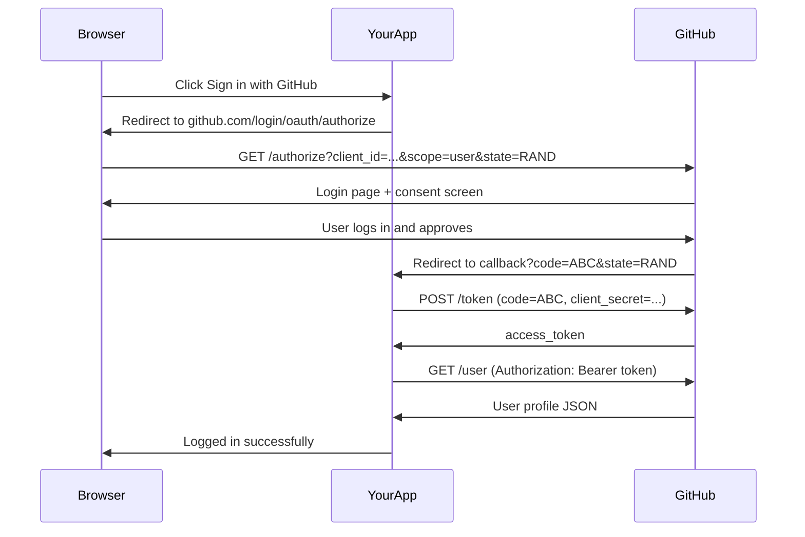
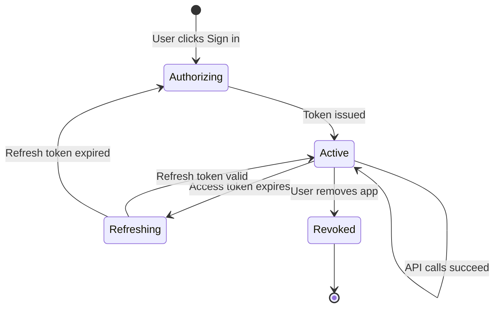

⚡ TL;DR - Every time you clicked "Sign in with Google," "Connect
with GitHub," or allowed an app to post on your behalf, you
completed an OAuth 2.0 flow. OAuth is already embedded in nearly
every app you use daily - recognizing it is the first step to
understanding it.

---

### 🔥 The Problem This Solves

**WORLD WITHOUT IT:**

OAuth exists everywhere, but most developers first encounter it
through documentation that starts at the protocol level: "OAuth 2.0
is an authorization framework defined in RFC 6749..." This abstract
entry point misses a critical shortcut: you have already experienced
OAuth dozens or hundreds of times as a user. The mental model is
already built. The protocol documentation just needs to name what
you already know.

**THE BREAKING POINT:**

Engineers who start with the spec often miss the most important
insight: OAuth is not a new concept to learn from scratch. It is
the formal name for a user experience pattern that is already
familiar. Every "Allow this app to..." consent screen is OAuth.
Every third-party integration that says "Connect your account" is
OAuth. Building a mental bridge from the known experience to the
protocol makes the spec instantly navigable.

**THE INVENTION MOMENT:**

This is exactly why grounding OAuth in lived experience matters:
the spec is long and abstract, but the user experience is
immediately recognizable. Once you map the experience to the
protocol, every step makes sense.

**EVOLUTION:**

The "Sign in with" button pattern emerged around 2010-2012 as
OAuth 2.0 and OpenID Connect were being standardized. Early social
login (Twitter, Facebook Connect) ran on OAuth 1.0. Google, GitHub,
and LinkedIn's developer programs popularized the OAuth 2.0 pattern
starting around 2012. Today, every cloud provider, SaaS platform,
and developer tool uses OAuth 2.0 for third-party integrations.

---

### 📘 Textbook Definition

OAuth 2.0 is the authorization protocol underlying the "Sign in
with X" and "Connect to X" experiences that appear across the web.
In these flows, a relying party (the app you are using) requests
delegated access to your account at a provider (Google, GitHub, etc.)
through a standardized consent mechanism. The user approves, the
provider issues an access token, and the relying party uses that
token to access only the data the user approved - without ever
seeing the user's password at the provider.

---

### ⏱️ Understand It in 30 Seconds

**One line:**
Every "Sign in with Google" button is OAuth in action - you approve
what the app can see, Google issues a key, and your password never
leaves Google.

**One analogy:**

> When a hotel concierge books restaurant reservations on your
> behalf, you give them your name and preferences - not your credit
> card PIN. They act for you in a limited way, and you can cancel
> their authority at any time. The concierge is the app; the
> restaurant's system is the resource server; your hotel account
> is the authorization server.

**One insight:**
The user experience of OAuth is the consent screen. Everything
else - the redirects, the code exchange, the tokens - is invisible
infrastructure. Understanding OAuth means understanding what the
consent screen is doing and why: it is the user telling the
authorization server exactly what the client is allowed to do.

---

### 🔩 First Principles Explanation

**CORE INVARIANTS:**

1. The user's credentials at the provider (Google, GitHub, etc.)
   never leave the provider.

2. The third-party app receives only a token scoped to what the
   user explicitly approved - nothing more.

3. The user can revoke the app's access at any time without
   changing their password.

**DERIVED DESIGN:**

These three invariants define the user experience you already know.
When you click "Sign in with Google," the browser redirects to
Google (not to the app). You see the consent screen on Google's
domain (your credentials are safe). You approve specific
permissions. Google redirects back to the app with a code. The app
exchanges the code for a token. The token is scoped to what you
approved. Google keeps a record - you can revoke it from
myaccount.google.com/permissions.

**THE TRADE-OFFS:**

**Gain:** Users never share their primary credential with third-
party apps. Access is granular and revocable. The provider retains
audit visibility.

**Cost:** The flow requires multiple redirects, which adds latency
and complexity for both users and developers. Apps cannot work
offline without pre-arranged refresh tokens.

**ESSENTIAL vs ACCIDENTAL COMPLEXITY:**

**Essential:** Any system implementing these three invariants must
involve a consent step, a redirect to the credential holder, and a
token mechanism. These are unavoidable.

**Accidental:** The specific redirect URL format, the code-for-token
exchange, the exact HTTP parameters - these are protocol artifacts
that could have been specified differently.

---

### 🧪 Thought Experiment

**SETUP:**

You use Notion and want to embed your Google Calendar events in a
Notion page. Notion needs read access to your Google Calendar.

**WHAT HAPPENS WITHOUT OAUTH:**

Notion asks for your Google email and password. You hand over your
master credential. Notion can now access your entire Google account
- Gmail, Drive, Photos, everything. Notion stores your password.
Six months later, Notion is breached. Your entire Google account is
compromised. To revoke Notion's access, you must change your Google
password - breaking every other service using it.

**WHAT HAPPENS WITH OAUTH:**

You click "Connect Google Calendar" in Notion. Your browser
redirects to accounts.google.com. You see: "Notion wants to:
View your Google Calendar events." You click "Allow." Google
redirects back to Notion with a token scoped only to calendar
read access. Notion can read your calendar but nothing else. You
can visit myaccount.google.com/permissions and click "Remove" next
to Notion at any time - instantly revoked, without touching your
password.

**THE INSIGHT:**

The consent screen is not a UX detail - it is the security
boundary. It is the user explicitly authorizing a specific scope
of access. Everything in the protocol exists to protect and enforce
that consent.

---

### 🧠 Mental Model / Analogy

> "Sign in with Google" is a valet parking service for your digital
> identity. You hand the valet (the app) a valet key that opens
> only the car door and starts the engine - not the glove
> compartment or trunk (limited scope). The valet company (Google)
> keeps a record of which valets have which keys. You can retrieve
> your key from the valet company's desk (revocation) at any time.

- "Your car" - your Google account and data
- "The valet key" - the access token scoped to calendar or contacts
- "The valet company" - Google (the authorization server)
- "The parking garage" - the resource server (Calendar API)
- "The valet" - the third-party app (Notion, travel app, etc.)
- "Retrieving your key" - revoking access via account settings

Where this analogy breaks down: a valet key is physical and unique
per car. OAuth tokens are digital, expirable, and can be issued to
many apps simultaneously - each with different scopes.

---

### 📶 Gradual Depth - Five Levels

**Level 1 - What it is (anyone can understand):**
OAuth is the system behind every "Sign in with Google/GitHub/Apple"
button. Instead of giving the app your password, you tell Google
(or whoever) to give the app limited access. You can take that
access away from your account settings whenever you want.

**Level 2 - How to use it (junior developer):**
As a developer, you register your app with the provider (GitHub,
Google, etc.) to get a client_id and client_secret. You redirect
users to the provider's authorization endpoint with your client_id,
requested scopes, and a redirect_uri. After approval, you receive
an authorization code, exchange it for tokens, and use the access
token to call the provider's API. The provider docs show the exact
URLs and parameters.

**Level 3 - How it works (mid-level engineer):**
The consent screen is driven by the `scope` parameter: `scope=
read:user repo` requests read access to the user's profile and
repositories on GitHub. The access token encodes these approved
scopes either in the token itself (JWT) or in the authorization
server's database (opaque token). The resource server validates
the token and checks the scope before returning data. Requesting
more scope than needed is a security risk: scope creep gives
attackers more surface if a token is stolen.

**Level 4 - Why it was designed this way (senior/staff):**
The redirect-based design is not accidental - it ensures that
credential entry happens on the provider's domain, not the app's.
This is the most important security property of the entire flow.
Any design that allowed the app to collect credentials and present
them to the provider on the user's behalf would recreate the
password anti-pattern with extra steps. The redirect makes it
structurally impossible for the app to see credentials. This is
why phishing attacks on OAuth flows work by mimicking the consent
screen URL rather than the app's URL.

**Level 5 - Mastery (distinguished engineer):**
The "Sign in with" pattern is used for both authentication (who are
you?) and authorization (what can this app do?). These are
different operations conflated in the UX. When a user clicks "Sign
in with Google," the app typically receives both an access token
(for API calls) and an ID token (for identity) via OpenID Connect.
A principal engineer understands that the access token cannot be
used as proof of identity - only the ID token's `sub` claim
reliably identifies the user. Confusing these two produces a class
of security vulnerabilities called "token substitution attacks"
where an access token issued to one app is presented to another.

---

### ⚙️ How It Works (Mechanism)

Every "Sign in with Google" click triggers a precise sequence:

```
┌───────────────────────────────────────────────────────┐
│       Real-World OAuth: "Sign in with GitHub"         │
├───────────────────────────────────────────────────────┤
│                                                       │
│  Your Browser     YourApp.com    GitHub.com           │
│       │               │              │               │
│  Click "Sign in       │              │               │
│   with GitHub"        │              │               │
│       │──────────────>│              │               │
│       │               │ Redirect to: │               │
│       │               │ github.com/  │               │
│       │               │ login/oauth/ │               │
│       │               │ authorize?   │               │
│       │               │ client_id=XX │               │
│       │               │ scope=user   │               │
│       │               │ state=RAND   │               │
│       │<──────────────────────────── │               │
│  Now on github.com    │              │               │
│  Login + "Allow"      │              │               │
│       │──────────────────────────────>               │
│       │               │<─────────────│               │
│       │        ?code=ABC&state=RAND  │               │
│       │               │              │               │
│       │               │ POST /token  │               │
│       │               │ code=ABC     │               │
│       │               │ secret=XXXX  │               │
│       │               │─────────────>│               │
│       │               │<─────────────│               │
│       │        access_token + user   │               │
│       │               │              │               │
│       │        Logged in ✓           │               │
│       │<──────────────│              │               │
└───────────────────────────────────────────────────────┘
```



**The five most common real-world OAuth patterns:**

1. **"Sign in with Google/GitHub/Apple"** - Authorization Code
   Flow + OpenID Connect. App gets identity and API access.

2. **"Connect your Dropbox"** - Authorization Code Flow. App gets
   ongoing access to cloud storage. Refresh tokens enable
   background sync without user re-approval.

3. **"This app will post on your behalf"** - Authorization Code
   Flow with write scopes (e.g. `tweet.write` for Twitter/X).
   User sees exactly what write access is being requested.

4. **Zapier/Make/n8n automation** - Authorization Code Flow
   connecting two services. The automation platform acts as the
   client, holding tokens for both source and destination.

5. **GitHub Actions CI/CD** - Client Credentials Flow (no user
   involved). The workflow authenticates as an app installation,
   not as a user. Used for automated deployments and repo
   operations.

---

### 🔄 The Complete Picture - End-to-End Flow

**NORMAL FLOW:**

```
User clicks → App redirects to provider → User authenticates
  → User approves consent screen → Provider issues code
  → App exchanges code for token [YOU ARE HERE]
  → App calls API with token → Provider validates scope
  → Data returned → User is logged in
```

**FAILURE PATH:**

```
User denies consent → Provider redirects with error=access_denied
  → App shows "Authorization declined" message
  → No token issued - app cannot proceed

Token expires → API returns 401 → App uses refresh token
  → New access token issued → API call retries
  → If refresh expired → App redirects user to re-authorize
```

**WHAT CHANGES AT SCALE:**

At scale, the provider's authorization server becomes the critical
path for every new login. Major providers handle billions of
authorizations per day by distributing consent processing and
using short-lived authorization codes (60 seconds, single-use) to
prevent code hoarding. The token exchange is rate-limited per
client to prevent abuse. At extreme scale, the authorization
server's JWKS endpoint (for JWT validation) must be cached
aggressively - a cold cache under spike traffic can cause
cascading validation failures.

---

### 💻 Code Example

**Example 1 - BAD then GOOD: Requesting OAuth scopes (scope creep):**

```java
// BAD: Requesting maximum scope "just in case"
// Gives the app (and any attacker who steals the token)
// full access to everything, violating least privilege
String authUrl = "https://github.com/login/oauth/authorize"
    + "?client_id=" + CLIENT_ID
    + "&scope=repo%20user%20gist%20admin:org"  // TOO BROAD
    + "&state=" + state;
// Why bad: if this token is stolen, attacker has full
// repo write access, org admin rights, gist access
```

```java
// GOOD: Request minimum scopes for the specific feature
// WHY: Least-privilege principle - if token is stolen or
//   if the user is deceived, impact is bounded to what
//   the app actually needs for this specific feature.
//
// Feature: "display user's public GitHub repositories"
String authUrl = "https://github.com/login/oauth/authorize"
    + "?client_id=" + CLIENT_ID
    + "&scope=public_repo%20read:user"  // minimum needed
    + "&redirect_uri=" + ENCODED_REDIRECT_URI
    + "&state=" + secureRandomState;  // CSRF protection
// WHAT BREAKS: If you later add a feature needing write
//   access, you must re-request authorization with the
//   new scope - users will see a new consent screen.
// HOW TO TEST: After authorization, decode the token's
//   scope claim or call the /user/repos endpoint and
//   verify you cannot create repos (write scope absent).
```

**Example 2 - Recognizing OAuth in the wild (Spring Security config):**

```yaml
# application.yml - this is what OAuth 2.0 looks like in code
# The "Sign in with GitHub" button is powered by these 6 lines
spring:
  security:
    oauth2:
      client:
        registration:
          github:
            # Your app's identity at GitHub
            client-id: ${GITHUB_CLIENT_ID}
            client-secret: ${GITHUB_CLIENT_SECRET}
            # What your app requests access to
            scope: read:user, user:email
        provider:
          github:
            # Where to send the user to authorize
            authorization-uri: >
              https://github.com/login/oauth/authorize
            # Where to exchange the code for a token
            token-uri: >
              https://github.com/login/oauth/access_token
            # Where to get the user's profile
            user-info-uri: https://api.github.com/user
# Spring Security handles: redirect, state, code exchange,
# token storage, and API calls - from these 6 config lines.
# WHAT CHANGES AT SCALE: token storage needs a distributed
#   cache (Redis) when running multiple instances.
```

**How to test / verify correctness:**
Check your provider's developer console (GitHub Settings >
Applications > Authorized OAuth Apps, or Google Account >
Security > Third-party apps) after completing the flow - your
app should appear with the exact scopes you requested. If it
shows broader scopes than requested, your scope parameter is
wrong. If it does not appear at all, the flow did not complete.

---

### ⚖️ Comparison Table

| Integration Pattern | OAuth Flow | User Involved | Use Case |
|---|---|---|---|
| **"Sign in with Google"** | Auth Code + OIDC | Yes | Social login, identity |
| **"Connect your Dropbox"** | Auth Code | Yes | Third-party data access |
| **API-to-API (no user)** | Client Credentials | No | Service accounts, CI/CD |
| **CLI tool login** | Device Authorization | Yes (other device) | `gh auth login`, AWS CLI |
| **Mobile app login** | Auth Code + PKCE | Yes | iOS/Android native apps |

How to choose: if a human user is approving the access, use
Authorization Code Flow (with PKCE for mobile/SPA). If no user
is involved (machine-to-machine), use Client Credentials. If the
device cannot display a browser, use Device Authorization Flow.

---

### 🔁 Flow / Lifecycle

The lifecycle of a "Sign in with Google" session:

```
┌───────────────────────────────────────────────────────┐
│       OAuth Session Lifecycle (User Perspective)      │
├───────────────────────────────────────────────────────┤
│                                                       │
│  [Click "Sign in"] ──→ [Provider login + consent]    │
│                                │                      │
│                                ↓                      │
│             [Token issued - active session]           │
│                    │           │                      │
│            API calls│          ↓ token expires        │
│            succeed │    [Silent refresh via           │
│                    │     refresh token]               │
│                    │           │                      │
│                    │           ↓ refresh expires      │
│                    │    [Re-authorization required]   │
│                    │           │                      │
│                    ↓           │                      │
│             [User visits provider account settings]  │
│             [Clicks "Remove" next to your app]       │
│                    │                                  │
│                    ↓                                  │
│        [Token revoked - next API call fails 401]     │
└───────────────────────────────────────────────────────┘
```



---

### ⚠️ Common Misconceptions

| Misconception | Reality |
|---|---|
| "Sign in with Google" means Google is authenticating for you | Google authenticates the user and issues an access token. Your app is still responsible for creating and managing the user's session. |
| The access token tells you who the user is | The access token grants API access; it does NOT reliably identify the user. Use the ID token's `sub` claim (OpenID Connect) for identity. |
| OAuth replaces your user database | OAuth provides authentication and API access tokens. Your app still needs its own user record linked to the OAuth subject identifier. |
| If the user logs out of Google, they're logged out of your app | Google's session and your app's session are independent. Your app must implement its own logout and token revocation. |
| "Connect my account" means the user shares their account | The user is granting specific, scoped access. The app never has the user's credentials at the connected service. |

---

### 🚨 Failure Modes & Diagnosis

**Redirect URI Mismatch**

**Symptom:**
User clicks "Sign in with GitHub," approves, and lands on a
provider error page: "The redirect_uri MUST match the registered
callback URL." The login flow never completes.

**Root Cause:**
The `redirect_uri` in the authorization request does not exactly
match any URI registered in the app's provider settings. Even a
trailing slash difference (`/callback` vs `/callback/`) causes
this. Providers enforce exact matching as a security control:
an imprecise match would allow redirect to attacker-controlled URLs.

**Diagnostic Command / Tool:**

```bash
# Extract the redirect_uri from the authorization URL
# your app generates and compare with registered value:
# 1. Open browser dev tools → Network tab
# 2. Click "Sign in with GitHub"
# 3. Find the redirect to github.com/login/oauth/authorize
# 4. Note the redirect_uri parameter value
# 5. Compare against GitHub Settings > Developer settings
#    > OAuth Apps > Your App > Callback URLs
#
# Exact match required - protocol, host, path, params all
# must be identical including trailing slashes.
```

**Fix:**
Add the exact redirect_uri your app sends to the provider's
allowed redirect URIs list. Use environment variables for the
base URL so dev/staging/prod values are all registered.

**Prevention:**
Register separate redirect URIs for each environment (dev, staging,
prod) in the provider's app settings. Never use wildcard URIs
(`https://example.com/*`) - they are a security vulnerability.

---

**Token Scope Insufficient (Missing Permission)**

**Symptom:**
API call returns HTTP 403 with `{"error": "insufficient_scope"}` or
`{"message": "Resource not accessible by integration"}`.

**Root Cause:**
The access token was issued for scopes that do not include
permission for the operation being attempted. The user approved
the original scopes, but the app is now requesting an API endpoint
that requires a scope it did not include in the authorization
request.

**Diagnostic Command / Tool:**

```bash
# Decode the JWT access token to check current scopes
# (or use token introspection for opaque tokens):
TOKEN="your_access_token_here"
# JWT: decode the payload (base64url, second segment)
echo $TOKEN | cut -d. -f2 \
  | base64 --decode 2>/dev/null \
  | python3 -m json.tool | grep scope

# For GitHub specifically:
curl -H "Authorization: Bearer $TOKEN" \
     https://api.github.com/user \
  | head -5
# Check X-OAuth-Scopes response header for granted scopes
```

**Fix:**
Add the required scope to the authorization request and
re-authenticate the user to get a new token with the expanded
scope. Present the scope addition to the user in context - "To
create repositories, we need additional GitHub permissions."

**Prevention:**
Audit all API calls your app makes and derive the minimum required
scopes before going to production. Test with a token that has
only those scopes to catch scope gaps early.

---

**Access Token Not Revoked After User Disconnect**

**Symptom:**
User clicks "Disconnect GitHub" in your app settings, but the app
continues making successful GitHub API calls. User sees your app
still listed in their GitHub authorized apps.

**Root Cause:**
The app deleted its local token record but did not call the
provider's token revocation endpoint (RFC 7009). The token remains
valid at the provider until it expires naturally.

**Diagnostic Command / Tool:**

```bash
# Test if a "revoked" token is actually revoked at provider:
# GitHub revocation endpoint:
curl -X DELETE \
  -H "Authorization: Bearer $CLIENT_TOKEN" \
  https://api.github.com/applications/$CLIENT_ID/token \
  -d '{"access_token": "'$USER_TOKEN'"}'
# 204 = revoked; 404 = already revoked; 422 = bad token

# Google revocation endpoint:
curl "https://oauth2.googleapis.com/revoke?token=$TOKEN"
```

**Fix:**
Always call the provider's revocation endpoint when a user
disconnects. Store the revocation endpoint URL per provider and
call it as part of the disconnect transaction.

**Prevention:**
Treat token revocation as a two-step process: delete your local
record AND call the provider's revocation endpoint. If revocation
fails, log the failure and retry - do not silently drop it.

---

### 🔗 Related Keywords

**Prerequisites (understand these first):**

- `The Delegation Problem - Why OAuth Exists` - why the pattern
  exists and what problem it was invented to solve
- `OAuth vs Authentication (What OAuth Is NOT)` - the critical
  distinction between identity and authorization in the UX

**Builds On This (learn these next):**

- `The Four Actors in Every OAuth Dance` - the formal names for
  all parties you interact with during authorization
- `Authorization Code Flow` - the full technical walkthrough
  of exactly what happens behind the "Sign in with" button
- `Scope` - what the consent screen is actually requesting and
  how scopes map to API permissions

**Alternatives / Comparisons:**

- `SAML 2.0` - enterprise SSO alternative with XML-based assertions;
  OAuth replaced it for consumer applications but SAML persists in
  enterprise identity management

---

### 📌 Quick Reference Card

```
┌──────────────────────────────────────────────────────────┐
│ WHAT IT IS   │ Real-world OAuth patterns you use daily   │
├──────────────┼───────────────────────────────────────────┤
│ PROBLEM IT   │ OAuth spec is abstract; lived experience  │
│ SOLVES       │ makes the protocol immediately concrete   │
├──────────────┼───────────────────────────────────────────┤
│ KEY INSIGHT  │ The consent screen IS the security        │
│              │ boundary - it records what was approved   │
├──────────────┼───────────────────────────────────────────┤
│ USE WHEN     │ Integrating with any provider that offers │
│              │ "Sign in with" or "Connect your" flows    │
├──────────────┼───────────────────────────────────────────┤
│ AVOID WHEN   │ You own both services - use session auth  │
│              │ or internal service credentials instead   │
├──────────────┼───────────────────────────────────────────┤
│ ANTI-PATTERN │ Using access token as proof of user       │
│              │ identity (need ID token from OIDC)        │
├──────────────┼───────────────────────────────────────────┤
│ TRADE-OFF    │ User control and security vs redirect     │
│              │ complexity and provider dependency        │
├──────────────┼───────────────────────────────────────────┤
│ ONE-LINER    │ "The consent screen is OAuth's security   │
│              │  boundary - protect and honor it"         │
├──────────────┼───────────────────────────────────────────┤
│ NEXT EXPLORE │ Four Actors → Auth Code Flow → Scopes     │
└──────────────────────────────────────────────────────────┘
```

**If you remember only 3 things:**

1. Every "Sign in with X" button is OAuth - you have used it
   hundreds of times already. The protocol is the formal name
   for an experience you already know.

2. The consent screen records what the app is authorized to do -
   it is a security boundary, not a UX detail.

3. Access tokens grant API access; they do NOT prove who the user
   is. Add OpenID Connect for identity.

**Interview one-liner:**
"OAuth 2.0 is the system behind every 'Sign in with Google' and
'Connect your GitHub' button. The user approves a specific scope of
access at the provider's consent screen; the provider issues a
scoped token; the app uses that token to call APIs. The user's
credentials never leave the provider."

---

### 💎 Transferable Wisdom

**Reusable Engineering Principle:**
The most effective way to teach an abstract protocol is to anchor
it in experience the learner already has. Naming what someone
already knows immediately makes the abstract concrete. This
principle applies to any technical concept with a familiar real-
world manifestation.

**Where else this pattern appears:**

- **TLS/HTTPS** - most developers understand "the padlock in the
  browser" before they understand TLS handshakes; the padlock is
  the experiential anchor
- **DNS** - understanding that typing a domain name "looks up"
  an IP address precedes any understanding of the recursive
  resolution protocol
- **CI/CD pipelines** - developers understand "it deployed itself
  after my PR merged" before they understand the webhook triggers
  and agent architecture behind it

**Industry applications:**

- **SaaS integrations** - every major SaaS platform (Salesforce,
  Slack, HubSpot) exposes OAuth 2.0 for third-party app access;
  the "Install" button in any app marketplace triggers an OAuth
  flow
- **Developer platforms** - GitHub Actions, GitLab CI, and
  Bitbucket Pipelines all use OAuth 2.0 app installations to
  grant CI systems scoped access to repositories

---

### 💡 The Surprising Truth

The "Sign in with" button you click took over five years to
standardize properly. Facebook Connect (2008) preceded OAuth
standardization and essentially used a proprietary variant. Twitter
implemented OAuth 1.0 (2010). Google used OpenID 2.0 before
migrating to OpenID Connect on OAuth 2.0 (2014). The ubiquitous
"Sign in with Google" button that appears on nearly every login
form today - which feels like it has always existed - was only
widely standardized and adopted after 2014. What seems like an
obviously correct solution took the industry nearly a decade of
competing, incompatible approaches to converge on.

---

### ✅ Mastery Checklist

**You've mastered this when you can:**

1. **[EXPLAIN]** Walk a non-technical user through what happens
   when they click "Sign in with Google" - what data moves where,
   who can see it, and how they can revoke access - using zero
   technical jargon.

2. **[DEBUG]** Given a "redirect_uri mismatch" error during an
   OAuth login, identify the two places you need to check and the
   exact strings that must match.

3. **[DECIDE]** A user reports that after they "disconnected" your
   app from their GitHub settings page on GitHub's side, your app
   is still making successful API calls. Explain why this happens
   and what your app should be doing to prevent it.

4. **[BUILD]** Add "Sign in with GitHub" to a Spring Boot app
   using only the configuration shown in this entry. Identify
   the minimum scopes needed for a profile display feature.

5. **[EXTEND]** A CLI tool needs to authenticate the developer
   against GitHub without opening a browser on the same machine.
   Identify which OAuth flow applies and why, and sketch the
   user experience it produces.

---

### 🧠 Think About This Before We Continue

**Q1.** You click "Sign in with Google" on a new app. Google shows
you a consent screen: "This app wants to: Read and write all files
in your Google Drive." You are suspicious - the app only claimed
to need calendar access. What does this tell you about the app's
OAuth configuration, what should you do as a user, and how would
you fix this as a developer?

*Hint: The scope in the consent screen comes directly from the
authorization request. Consider what scope the developer requested
versus what they need, and what the security implications are of
clicking "Allow" anyway.*

**Q2.** Your app has 10 million users who signed in with Google.
Google announces a change to their OAuth scope names - `profile`
is being replaced by `openid profile` in six months. Map out the
full impact on your user base, what breaks for existing vs new
users, and your migration strategy.

*Hint: Consider users who already authorized and have existing
tokens versus users who authorize after the change. Think about
scope validation, token re-issuance, and whether existing tokens
continue working during the transition.*

**Q3.** Build a minimal "Sign in with GitHub" flow handler in any
language: the redirect endpoint and the callback endpoint. What
are the three security checks you must perform in the callback
before exchanging the code for a token?

*Hint: The callback receives the authorization code AND the state
parameter. Think about what an attacker could do with a forged
callback request, and what each check prevents.*

---

### 🎯 Interview Deep-Dive

**Q1: A user says "I connected my Google Drive to your app last
month but now it says I need to re-authorize. Why?"**

*Why they ask:* Tests practical knowledge of token lifecycle and
the difference between access tokens and refresh tokens.

*Strong answer includes:*

- Access tokens expire (typically 1 hour for Google); the app
  should silently refresh using the refresh token
- Re-authorization is only required when the refresh token has
  also expired, been revoked, or the user revoked app access
- The most likely cause: the app did not request `offline_access`
  or `access_type=offline` so no refresh token was issued
- Fix: request `access_type=offline&prompt=consent` on initial
  authorization to ensure a refresh token is issued

**Q2: Your app uses "Sign in with Google" and someone reports they
can log into another user's account. What are the three most
likely causes?**

*Why they ask:* Tests OAuth security knowledge and understanding
of common implementation mistakes.

*Strong answer includes:*

- Missing state validation: an OAuth CSRF attack bound the wrong
  authorization to the victim's session
- Using access token as identity: the app trusted any valid token
  instead of validating the `sub` claim matches the session
- Account linking bug: the OAuth subject ID was associated with
  the wrong user record during initial login

**Q3: Why does "Sign in with Google" still leave you responsible
for session management, and what does that mean in practice?**

*Why they ask:* Tests understanding of where OAuth ends and
application security begins.

*Strong answer includes:*

- OAuth issues a token to your app; it does not create a session
  in your app's context - your app creates the session
- Google's session (whether the user is logged into Google) and
  your app's session are completely independent
- Logout must be handled separately: call token revocation AND
  clear your app's session; relying on Google logout is wrong
- If the Google account is compromised, your app's session
  remains active until it expires or the user logs out
