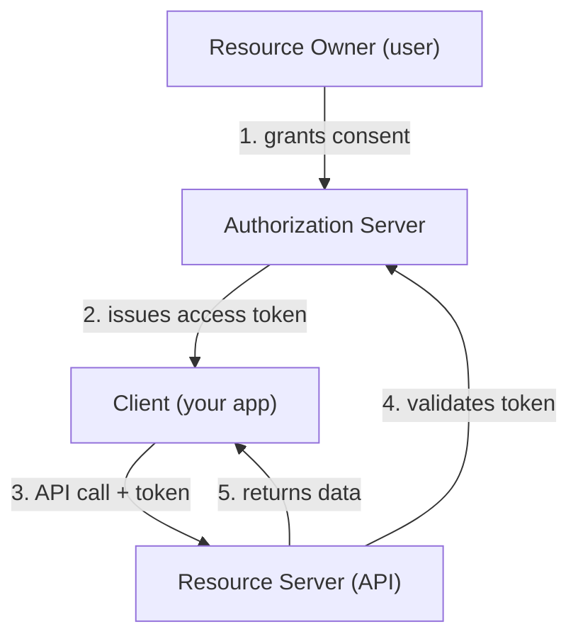
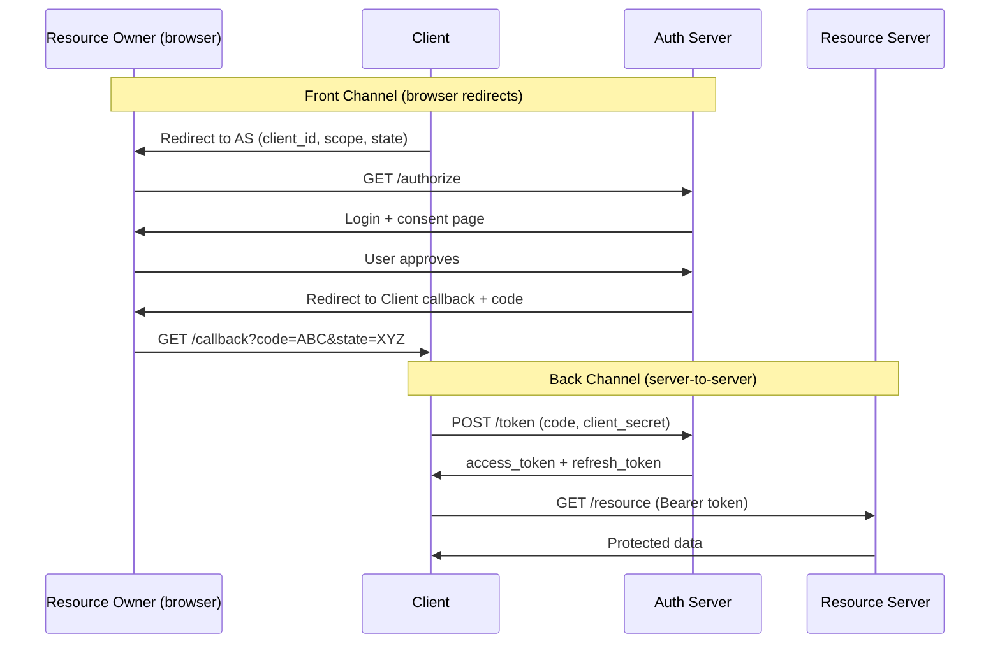
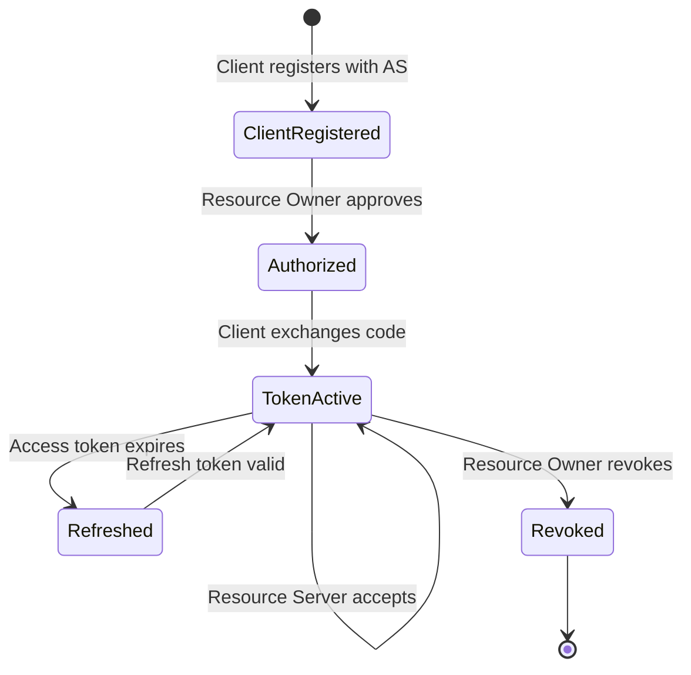

⚡ TL;DR - Every OAuth flow involves exactly four parties: the
Resource Owner (the user whose data is at stake), the Client (the
app requesting access), the Authorization Server (the trust anchor
that issues tokens), and the Resource Server (the API protecting
the data). Misidentifying any actor is the root cause of most
OAuth architecture mistakes.

---

### 🔥 The Problem This Solves

**WORLD WITHOUT IT:**

Before OAuth, API access was a bilateral agreement: one server
calls another server with a shared credential. Two parties, one
credential, done. OAuth shattered this into four distinct roles,
each with specific responsibilities and trust boundaries. Without
understanding these four actors, OAuth flows look like arbitrary
redirect mazes. Engineers implement them by copying examples
without understanding why each step exists or which party is
responsible for each security property.

**THE BREAKING POINT:**

The most common OAuth implementation mistakes - missing state
validation, misplaced client secrets, token validation on the
wrong party, trust of unvalidated tokens - all trace back to
confusion about which actor is responsible for which check. When
a developer places client secret handling in the browser, they have
confused the Client actor's role. When a resource server trusts
a token without validating it, they have misunderstood the
Authorization Server's role. The four-actor model makes these
mistakes structurally visible.

**THE INVENTION MOMENT:**

This is exactly why the RFC 6749 spec formalizes four distinct
roles: the roles define the trust boundary at each step and make
the security model auditable.

**EVOLUTION:**

OAuth 1.0 had the same four actors but used different terminology
(Service Provider, Consumer, User, Resource). OAuth 2.0 renamed
them to Resource Owner, Client, Authorization Server, and Resource
Server, separating the Authorization Server from the Resource
Server explicitly - a separation that OAuth 1.0 often collapsed.
This separation became critical as centralized identity providers
(Auth0, Okta, Google) emerged to serve multiple resource servers.

---

### 📘 Textbook Definition

RFC 6749 defines four roles in every OAuth 2.0 authorization
framework interaction: (1) the **Resource Owner**, an entity capable
of granting access to a protected resource, typically a human end
user; (2) the **Client**, an application making protected resource
requests on behalf of the resource owner; (3) the **Authorization
Server**, the server issuing access tokens to the client after
authenticating the resource owner and obtaining authorization; and
(4) the **Resource Server**, the server hosting the protected
resources, accepting and responding to protected resource requests
using access tokens.

---

### ⏱️ Understand It in 30 Seconds

**One line:**
User approves, App requests, Auth Server issues tokens, API uses
them - four actors, one OAuth flow.

**One analogy:**

> A hotel guest (Resource Owner) asks the front desk (Authorization
> Server) to authorize the bellhop (Client) to enter their room
> (Resource Server). The guest approves. The front desk gives the
> bellhop a room card (access token) with a specific expiry. The
> bellhop uses the card to enter the room. The room's lock reader
> (Resource Server) validates the card without calling the front
> desk each time.

**One insight:**
The Authorization Server and Resource Server are deliberately
separate actors. This separation enables one Authorization Server
to protect many Resource Servers - which is why Okta or Auth0 can
serve as the identity provider for dozens of your services while
each service only needs to validate tokens, not manage identities.

---

### 🔩 First Principles Explanation

**CORE INVARIANTS:**

1. Only the Resource Owner can authorize access to their data.

2. The Authorization Server is the sole party that authenticates
   the Resource Owner and issues tokens.

3. The Client never directly handles the Resource Owner's
   credentials at the Authorization Server.

4. The Resource Server validates tokens but does not issue them.

**DERIVED DESIGN:**

These invariants require four distinct parties. If the Client could
issue its own tokens (collapsing Client + Authorization Server),
there would be no trusted third party to validate authorization.
If the Resource Server issued tokens (collapsing Resource Server +
Authorization Server), every API would need full user management.
If the Client directly handled credentials (collapsing Resource
Owner + Client), the password anti-pattern returns.

The separation is not bureaucratic overhead - it is structural
enforcement of the security model. Each role boundary is a trust
boundary: the Client trusts that the Authorization Server has
correctly authenticated the Resource Owner; the Resource Server
trusts that the Authorization Server has correctly scoped the
token; neither trusts the Client's self-reported identity.

**THE TRADE-OFFS:**

**Gain:** Separation of concerns enables each actor to specialize.
The Authorization Server can implement robust identity management
without knowing about your API. The Resource Server can validate
tokens without managing users. The Client can call APIs without
storing credentials.

**Cost:** More actors mean more moving parts, more configuration,
and more failure points. In a single-org deployment, the
Authorization Server and Resource Server may be the same physical
machine - the logical separation still matters for security
analysis, even if the deployment collapses them.

**ESSENTIAL vs ACCIDENTAL COMPLEXITY:**

**Essential:** Any credential-free delegation model requires a
trusted third party that both the Client and Resource Server trust.
That is the Authorization Server. The four-actor model is the
minimum structure that achieves this.

**Accidental:** Separate callback endpoints, state parameters,
and multi-step redirects are protocol mechanics. The four-actor
conceptual model would exist in any correct design; the exact HTTP
flows are implementation artifacts.

---

### 🧪 Thought Experiment

**SETUP:**

A travel app (Client) wants to read your Google contacts (Resource
Server). You are the user (Resource Owner). Google is both the
Authorization Server and the Resource Server in this example.

**WHAT HAPPENS WITHOUT FOUR-ACTOR STRUCTURE:**

The travel app asks for your Google password. Now the travel app
IS the Resource Owner from the Resource Server's perspective - it
has your credential. The Authorization Server role disappears. The
travel app has unlimited access, no scope constraint, no audit
trail, and no revocation mechanism. When the travel app is
breached, your Google account is compromised.

**WHAT HAPPENS WITH FOUR-ACTOR STRUCTURE:**

You (Resource Owner) go to Google (Authorization Server).
You approve contacts access for the travel app (Client). Google
issues a token scoped to `contacts.readonly`. The travel app uses
the token to call the Contacts API (Resource Server). Google logs
the grant under your account. The Resource Server validates the
token against what the Authorization Server issued - the travel
app cannot escalate its own access. You revoke from Google account
settings; the next API call fails.

**THE INSIGHT:**

The four actors exist to ensure no single party can unilaterally
grant itself unauthorized access. The Resource Owner's approval
is required. The Authorization Server enforces it. The Resource
Server validates it. The Client is constrained by all three.

---

### 🧠 Mental Model / Analogy

> The four OAuth actors map perfectly to an employee access control
> system. The employee (Resource Owner) wants to give a contractor
> (Client) temporary badge access to the server room (Resource
> Server). The employee asks HR (Authorization Server) to issue a
> temporary badge. HR verifies the employee's identity, records the
> grant, and issues a badge with a specific expiry date. The
> contractor uses the badge. The server room door reader (Resource
> Server) validates the badge without calling HR each time.

- "Employee" - Resource Owner (owns the access rights)
- "Contractor" - Client (the party requesting limited access)
- "HR system" - Authorization Server (issues and tracks credentials)
- "Server room door" - Resource Server (enforces access with token)
- "Temporary badge" - Access token (scoped, expirable, revocable)
- "Badge reader calling HR" - Token introspection (for opaque tokens)
- "Badge with embedded chip" - JWT token (validated locally)

Where this analogy breaks down: in OAuth, the Resource Owner
typically approves access interactively via a browser redirect. In
the badge analogy, the employee might request the badge separately
from the contractor's actual use - the timing is more compressed
in OAuth.

---

### 📶 Gradual Depth - Five Levels

**Level 1 - What it is (anyone can understand):**
In any "Sign in with Google" or "Connect your GitHub" flow, four
parties are always involved: you (the user whose data is being
accessed), the app requesting access, Google/GitHub (who controls
access), and the API being called. Each has a specific, non-
interchangeable role.

**Level 2 - How to use it (junior developer):**
When building an OAuth integration, you are always building the
Client role. The Resource Owner is your user. The Authorization
Server is Google, GitHub, Auth0, or Okta. The Resource Server is
the API you want to call. Your code never directly handles the
Resource Owner's credentials at the Authorization Server.

**Level 3 - How it works (mid-level engineer):**
The four actors interact via two channels: the front channel
(browser redirects between Client and Authorization Server, visible
to the user) and the back channel (server-to-server calls for token
exchange and API calls, invisible to the user). The Client initiates
the front-channel redirect, the Authorization Server handles
authentication, and the Resource Server validates the token via
the back channel. The Resource Owner only participates in the front-
channel steps.

**Level 4 - Why it was designed this way (senior/staff):**
The key design decision in OAuth 2.0 vs 1.0 was the explicit
separation of the Authorization Server from the Resource Server.
In OAuth 1.0, they were often collapsed. OAuth 2.0's explicit
separation enables centralized identity providers (Okta, Auth0,
Google Cloud Identity) to serve as the Authorization Server for
many Resource Servers. This is the basis of Single Sign-On (SSO)
at scale: one Authorization Server, many Resource Servers, users
authenticate once. The Resource Server never needs to implement
user management - it only needs to validate tokens.

**Level 5 - Mastery (distinguished engineer):**
The four-actor model is the unit of OAuth security analysis. For
any OAuth implementation decision - where does the client_secret
go? who validates the state parameter? who checks token scope? -
the correct answer is always derivable from asking "which actor
owns this responsibility?" Client secrets belong in the Client's
back channel (never the browser). State validation belongs in the
Client (it generated the state). Scope validation belongs in the
Resource Server (it enforces access policy). Token issuance belongs
exclusively to the Authorization Server. When OAuth implementations
fail security reviews, the root cause almost always traces back to
a responsibility that landed in the wrong actor.

---

### ⚙️ How It Works (Mechanism)

**The four actors and their responsibilities:**

```
┌───────────────────────────────────────────────────────┐
│         The Four OAuth 2.0 Actors                     │
├───────────────────────────────────────────────────────┤
│                                                       │
│  ┌────────────────────────────────────────────┐       │
│  │ RESOURCE OWNER (the user)                  │       │
│  │ - Owns the protected data                  │       │
│  │ - Grants or denies consent                 │       │
│  │ - Can revoke access at any time            │       │
│  └────────────────────────────────────────────┘       │
│                  │ grants consent                      │
│                  ▼                                     │
│  ┌────────────────────────────────────────────┐       │
│  │ AUTHORIZATION SERVER (trust anchor)        │       │
│  │ - Authenticates the Resource Owner         │       │
│  │ - Issues access tokens + refresh tokens    │       │
│  │ - Maintains consent records                │       │
│  │ - Publishes JWKS for token validation      │       │
│  └────────────────────────────────────────────┘       │
│           │ issues token      │ token validated by     │
│           ▼                   ▼                        │
│  ┌──────────────────┐ ┌──────────────────────────┐    │
│  │ CLIENT           │ │ RESOURCE SERVER           │    │
│  │ - Requests access│ │ - Hosts protected data    │    │
│  │ - Stores tokens  │ │ - Validates access tokens │    │
│  │ - Calls APIs     │ │ - Enforces scope policy   │    │
│  │ - Refreshes      │ │ - Returns data or 401/403 │    │
│  └──────────────────┘ └──────────────────────────┘    │
│  Client never touches Resource Owner credentials      │
└───────────────────────────────────────────────────────┘
```



**Trust relationships between actors:**

The Authorization Server is the root of trust. Every other actor
derives its security properties from trusting the Authorization
Server.

- **Client trusts Authorization Server** to have correctly
  authenticated the Resource Owner and scoped the token.
- **Resource Server trusts Authorization Server** to have issued
  valid tokens whose signatures or introspection responses are
  authoritative.
- **Resource Owner trusts Authorization Server** to accurately
  represent what the Client is requesting and to honor revocation.
- **No actor trusts the Client** for anything except presenting
  a valid access token - the Client is untrusted infrastructure.

**Front channel vs back channel:**

```
┌───────────────────────────────────────────────────────┐
│  Front Channel (browser redirects - visible to user)  │
├───────────────────────────────────────────────────────┤
│  Client ──redirect──> Auth Server                     │
│  Auth Server ──redirect──> Client callback            │
│  (authorization code travels this path)               │
│  ⚠️  Anything in the browser URL is logged and        │
│      potentially visible - NO tokens in front channel │
├───────────────────────────────────────────────────────┤
│  Back Channel (server-to-server - invisible to user)  │
├───────────────────────────────────────────────────────┤
│  Client ──POST /token──> Auth Server                  │
│  Client ──GET /resource + Bearer token──> Resource    │
│  (tokens travel this path only)                       │
│  ✓ Protected by TLS, not visible in browser history  │
└───────────────────────────────────────────────────────┘
```



The architectural insight: the authorization code appears in the
front channel (browser URL) because it is short-lived (60 seconds),
single-use, and useless without the client_secret. The actual token
never appears in the browser URL.

---

### 🔄 The Complete Picture - End-to-End Flow

**NORMAL FLOW (identifying which actor does what):**

```
[Resource Owner] clicks "Connect" in Client UI
  → [Client] redirects browser to Authorization Server
  → [Resource Owner] authenticates at Authorization Server
  → [Resource Owner] approves consent screen
  → [Authorization Server] issues code to Client callback
  → [Client] exchanges code + secret for token (back channel)
  → [Authorization Server] validates and issues access token
  → [Client] calls Resource Server [YOU ARE HERE on Client side]
  → [Resource Server] validates token [YOU ARE HERE on RS side]
  → [Resource Server] returns data
```

**FAILURE PATH:**

```
[Resource Server] validation fails
  → 401: token expired → [Client] uses refresh_token
  → 403: insufficient scope → [Client] must re-authorize
  → 401: token invalid/revoked → [Client] must re-authorize
  → Cascade: [Client] shows user re-authorization prompt
```

**WHAT CHANGES AT SCALE:**

At scale, the Authorization Server becomes the critical bottleneck.
The separation of the Authorization Server from the Resource Server
enables the Resource Server to validate tokens locally (JWT
signature check using cached JWKS) without calling the
Authorization Server on every request. At 100,000 requests/second
per Resource Server, the difference between local JWT validation
and introspection calls is the difference between sustainable and
collapsed throughput.

---

### 💻 Code Example

**Example 1 - BAD then GOOD: Client secret placement:**

```javascript
// BAD: Client secret in browser-side JavaScript
// This is the most common four-actor confusion: treating
// a confidential Client as a public one by exposing the
// secret to the browser (the Resource Owner's device)
const tokenResponse = await fetch('/oauth/token', {
  method: 'POST',
  body: JSON.stringify({
    code: authCode,
    client_id: 'my-app',
    client_secret: 'abc123secret',  // EXPOSED TO BROWSER
    grant_type: 'authorization_code'
  })
});
// An attacker can read client_secret from browser source,
// network requests, or devtools - it is now public.
```

```javascript
// GOOD: Client secret in server-side code only
// WHY: The Client actor has two parts - the browser (public)
//   and the server (confidential). Secrets belong in the
//   confidential part - the server-side code that never
//   runs in the user's browser.

// Browser code (public - no secrets):
async function startLogin() {
  const state = crypto.randomUUID(); // CSRF protection
  sessionStorage.setItem('oauth_state', state);
  window.location.href = '/auth/github?state=' + state;
}

// Server-side code (confidential - secrets live here):
// Express.js route - client_secret never reaches browser
app.get('/auth/github/callback', async (req, res) => {
  const { code, state } = req.query;
  const storedState = req.session.oauth_state;
  if (!state || state !== storedState) {
    return res.status(400).send('State mismatch');
  }
  // Client secret stays on the server - never in browser
  const tokens = await exchangeCodeForTokens(
    code,
    process.env.GITHUB_CLIENT_SECRET  // env var, server only
  );
  req.session.access_token = tokens.access_token;
  res.redirect('/dashboard');
  // WHAT BREAKS: If you run this on the browser, any user
  //   can extract client_secret from network requests.
  // HOW TO TEST: Check that client_secret never appears in
  //   browser network requests or client-side JavaScript.
});
```

**Example 2 - Resource Server token validation (which actor validates):**

```java
// BAD: Resource Server trusts token without validating it
// This collapses the Resource Server actor's responsibility
@GetMapping("/api/user/data")
public ResponseEntity<UserData> getData(
    @RequestHeader("Authorization") String authHeader) {
  // BAD: No validation - just parsing the token blindly
  String token = authHeader.replace("Bearer ", "");
  String userId = parseJwtClaim(token, "sub"); // UNSAFE
  return ResponseEntity.ok(userDataService.get(userId));
  // Attacker can forge a JWT (if no signature check)
  // or submit an expired/revoked token
}
```

```java
// GOOD: Resource Server validates token properly
// WHY: The Resource Server actor is responsible for
//   validating that the token was issued by a trusted
//   Authorization Server with the correct scope.
@GetMapping("/api/user/data")
public ResponseEntity<UserData> getData(
    @RequestHeader("Authorization") String authHeader) {
  String token = authHeader.replace("Bearer ", "");
  // Validate: signature (using JWKS from Auth Server)
  // Validate: expiry (reject expired tokens)
  // Validate: audience (token is for THIS resource server)
  // Validate: scope (token has required permission)
  JwtClaims claims = jwtValidator.validateAndParse(token);
  // validateAndParse throws on any validation failure
  // - invalid signature: throws SignatureException
  // - expired: throws ExpiredTokenException
  // - wrong audience: throws AudienceException
  String userId = claims.getSubject();
  return ResponseEntity.ok(userDataService.get(userId));
  // WHAT BREAKS: If audience is not validated, a token
  //   issued for service A is accepted by service B.
  // HOW TO TEST: Submit an expired token and a token with
  //   wrong audience; both should return 401.
}
```

**How to test / verify correctness:**
For Client secret placement: run a security scanner (OWASP ZAP)
against your app and check that no requests to the token endpoint
originate from the browser. For Resource Server validation: submit
tokens with tampered signatures, expired timestamps, and wrong
audience claims - all should return HTTP 401, not 200.

---

### ⚖️ Comparison Table

| Actor | Trusts | Trusted By | Holds | Security Responsibility |
|---|---|---|---|---|
| **Resource Owner** | Authorization Server | Nobody (grants access) | Credentials at AS | Approve correct scopes, revoke access |
| **Client** | Authorization Server | Nobody (untrusted) | Access token, refresh token | Protect secrets, validate state, use PKCE |
| **Authorization Server** | Resource Owner identity | Client, Resource Server | User credentials, token registry | Issue correctly scoped tokens, enforce consent |
| **Resource Server** | Authorization Server | Resource Owner, Client | Protected data | Validate tokens, enforce scope per endpoint |

How to choose: when debugging an OAuth security issue, first
identify which actor is failing its responsibility. Most issues
trace to Client code (wrong secret placement, missing state check)
or Resource Server code (missing token validation, wrong scope
check).

---

### 🔁 Flow / Lifecycle

The lifecycle of trust between actors in a single OAuth session:

```
┌───────────────────────────────────────────────────────┐
│       Actor Interaction Lifecycle                     │
├───────────────────────────────────────────────────────┤
│                                                       │
│  [SETUP] Client registers with Authorization Server  │
│    → Receives client_id + client_secret              │
│    → Registers allowed redirect_uris                 │
│                                                       │
│  [AUTHORIZATION] Resource Owner grants access        │
│    → Client → Authorization Server: redirect         │
│    → Resource Owner: authenticates + approves        │
│    → Authorization Server → Client: code             │
│                                                       │
│  [TOKEN ISSUANCE] Back channel exchange              │
│    → Client → Authorization Server: code + secret   │
│    → Authorization Server → Client: tokens           │
│                                                       │
│  [RESOURCE ACCESS] Token presented to Resource Server│
│    → Client → Resource Server: API call + token      │
│    → Resource Server: validates signature + scope    │
│    → Resource Server → Client: data                  │
│                                                       │
│  [EXPIRY/REVOCATION] Session ends                    │
│    → Access token expires (15min-1hr typical)        │
│    → Client uses refresh token for new access token  │
│    → Resource Owner revokes → all tokens invalidated │
└───────────────────────────────────────────────────────┘
```



---

### ⚠️ Common Misconceptions

| Misconception | Reality |
|---|---|
| The Authorization Server and Resource Server are always the same | They CAN be (e.g., GitHub is both for its own APIs), but separating them enables centralized identity providers (Okta, Auth0) to serve multiple Resource Servers. |
| The Client is trusted to report its own identity | The Client is the least trusted actor. It is untrusted infrastructure. The client_secret provides server-side identity, but public clients (SPAs, mobile) have no reliable way to prove identity. |
| The Resource Owner participates in every API call | The Resource Owner only participates in the authorization step. All subsequent API calls use the token without user involvement. |
| Token validation is optional if you trust the token source | Every Resource Server must validate every token: signature, expiry, audience, and scope. Trusting without validating is not a performance optimization - it is a vulnerability. |
| "Resource Server" means a server with files or storage | Resource Server means any API that protects resources behind access tokens - it could be a microservice, a database API, or a file storage API. |

---

### 🚨 Failure Modes & Diagnosis

**Client Secret Exposed in Browser (actor boundary violation)**

**Symptom:**
The `client_secret` appears in browser network requests, JavaScript
source code, or mobile app binary. Any attacker can extract it
and impersonate the Client with the Authorization Server.

**Root Cause:**
Developer confused the Client actor's browser component (public -
no secrets) with its server component (confidential - secrets
allowed). The Client in an OAuth flow has two environments: the
user's device (untrusted) and the developer's server (trusted).

**Diagnostic Command / Tool:**

```bash
# Scan compiled JavaScript for client_secret patterns:
grep -r "client_secret" dist/ public/ build/
# Any match is a critical exposure.

# Check network requests during OAuth flow:
# 1. Open browser DevTools → Network tab
# 2. Start an OAuth flow
# 3. Filter requests to your domain
# 4. Search request bodies for "secret"
# Should return nothing for correct implementation.
```

**Fix:**
Move the token exchange to a server-side endpoint. The browser
sends the authorization code to your server; your server exchanges
it for tokens using the client_secret stored as an environment
variable.

**Prevention:**
Public clients (SPAs, mobile apps) MUST use PKCE instead of
client_secret. PKCE is a mathematically equivalent substitution
that works without a stored secret. There is no secure way to
keep a client_secret in a public client.

---

**Resource Server Skipping Token Validation**

**Symptom:**
API accepts expired, revoked, or tokens issued for different
audiences. Users report accessing data after their access should
have been revoked. Security audit finds that the API trusts
self-reported claims.

**Root Cause:**
The Resource Server actor failed its core responsibility: validate
that the token was issued by the trusted Authorization Server, has
not expired, and scopes match the requested endpoint.

**Diagnostic Command / Tool:**

```bash
# Test that expired tokens are rejected:
# Get a token, wait for it to expire (or decode JWT and
# check exp claim vs current time), then submit it:
EXPIRED_TOKEN="eyJ..."  # known expired token
curl -H "Authorization: Bearer $EXPIRED_TOKEN" \
     https://api.example.com/resource
# CORRECT: 401 {"error":"token_expired"}
# VULNERABLE: 200 with data

# Test that wrong-audience tokens are rejected:
OTHER_SERVICE_TOKEN="eyJ..."  # token for other service
curl -H "Authorization: Bearer $OTHER_SERVICE_TOKEN" \
     https://api.example.com/resource
# CORRECT: 401 {"error":"invalid_token"}
# VULNERABLE: 200 with data
```

**Fix:**
Validate token signature (RS256 via JWKS or HS256 via shared
secret), expiry (`exp` claim), issuer (`iss` claim), audience
(`aud` claim), and required scopes for each endpoint. Reject
on any failure.

**Prevention:**
Use a security-reviewed JWT library that enforces all validations
by default. Never write raw JWT parsing code that extracts claims
without signature verification.

---

**Authorization Server and Resource Server Collapsed**

**Symptom:**
Every API request requires a call back to the central authorization
service for validation. Under load, authorization service latency
directly impacts API response time. Single point of failure: when
authorization service is down, all API calls fail.

**Root Cause:**
The Authorization Server and Resource Server were not logically
separated, forcing the Resource Server to call the Authorization
Server (introspection) on every request instead of validating JWT
tokens locally.

**Diagnostic Command / Tool:**

```bash
# Measure introspection call latency under load:
ab -n 1000 -c 50 \
  -H "Authorization: Bearer $TOKEN" \
  https://api.example.com/resource
# Check "Time per request" - if > 50ms, introspection
# is likely the bottleneck

# Trace requests to find introspection calls:
tcpdump -i any -A 'host auth.example.com and port 443'
# Count unique POST /introspect calls per minute
```

**Fix:**
Switch to JWT access tokens. The Resource Server validates the JWT
signature locally using the Authorization Server's public keys
(JWKS endpoint). Cache the JWKS keys. Zero introspection calls
per request.

**Prevention:**
Design with logical separation from the start. Even if the
Authorization Server and Resource Server run on the same host,
use JWT tokens so the Resource Server can validate locally.
Reserve introspection for high-security, sensitive operations
where revocation must be immediate.

---

### 🔗 Related Keywords

**Prerequisites (understand these first):**

- `The Delegation Problem - Why OAuth Exists` - the problem that
  makes four actors necessary
- `Where You Have Already Used OAuth` - experiential grounding
  for the actor roles

**Builds On This (learn these next):**

- `OAuth 2.0 Roles` - the formal RFC 6749 role definitions in detail
- `Authorization Code Flow` - how all four actors interact in the
  most common OAuth flow
- `Authorization Server Architecture` - what the Authorization
  Server actor looks like in production at scale

**Alternatives / Comparisons:**

- `Client Credentials Flow` - a two-actor flow (Client +
  Authorization Server) where the Resource Owner is absent;
  used for machine-to-machine authorization

---

### 📌 Quick Reference Card

```
┌──────────────────────────────────────────────────────────┐
│ WHAT IT IS   │ The four roles in every OAuth 2.0 flow    │
├──────────────┼───────────────────────────────────────────┤
│ PROBLEM IT   │ Without clear roles, OAuth security       │
│ SOLVES       │ responsibilities land in the wrong actor  │
├──────────────┼───────────────────────────────────────────┤
│ KEY INSIGHT  │ Each role boundary is a trust boundary -  │
│              │ no actor is trusted beyond its role       │
├──────────────┼───────────────────────────────────────────┤
│ USE WHEN     │ Diagnosing OAuth bugs, designing systems, │
│              │ conducting security reviews               │
├──────────────┼───────────────────────────────────────────┤
│ AVOID WHEN   │ N/A - the four actors are always present  │
│              │ in every OAuth flow by definition         │
├──────────────┼───────────────────────────────────────────┤
│ ANTI-PATTERN │ Client secret in browser code (confusing  │
│              │ Client's public + confidential components)│
├──────────────┼───────────────────────────────────────────┤
│ TRADE-OFF    │ Separation of concerns vs operational     │
│              │ complexity of four moving parts           │
├──────────────┼───────────────────────────────────────────┤
│ ONE-LINER    │ "Every OAuth bug traces to a security     │
│              │  responsibility in the wrong actor"       │
├──────────────┼───────────────────────────────────────────┤
│ NEXT EXPLORE │ OAuth 2.0 Roles → Auth Code Flow → PKCE  │
└──────────────────────────────────────────────────────────┘
```

**If you remember only 3 things:**

1. Four actors: Resource Owner (user), Client (app), Authorization
   Server (trust anchor), Resource Server (API). Each owns specific
   security responsibilities.

2. The Client is the least trusted actor. Secrets belong in the
   server-side component of the Client, never in the browser.

3. The Authorization Server and Resource Server can be physically
   separate (Okta + your API) - this enables SSO at scale and
   local JWT validation without introspection.

**Interview one-liner:**
"OAuth 2.0 defines four roles: the Resource Owner who grants access,
the Client that requests it, the Authorization Server that issues
tokens, and the Resource Server that protects the data. Every OAuth
implementation decision - where secrets go, who validates state,
who checks scope - is answered by identifying which actor owns the
responsibility."

---

### 💎 Transferable Wisdom

**Reusable Engineering Principle:**
Explicit role separation enforces security boundaries structurally.
When responsibility boundaries are clear, violations are detectable
by inspection. When responsibilities are blurred, security failures
hide in the confusion. This principle governs secure system design
far beyond OAuth.

**Where else this pattern appears:**

- **Certificate Authority trust chain** - browsers (clients) trust
  CAs (authorization servers) to validate server certificates;
  servers present certificates; the same four-party trust model
- **Payment card networks** - cardholder (resource owner), merchant
  (client), card network/issuer (authorization server), and the
  merchant's bank (resource server) form the same trust structure
- **Software supply chain signing** - developer (resource owner),
  CI/CD pipeline (client), signing authority (authorization server),
  package consumer (resource server)

**Industry applications:**

- **Enterprise SSO** - Okta or Azure AD serves as the centralized
  Authorization Server for dozens of Resource Servers (SaaS apps,
  internal APIs); the four-actor model enables one auth provider
  to protect many services
- **Open Banking (PSD2)** - the four actors map directly to
  regulations: the account holder (resource owner), third-party
  provider (client), bank's auth system (authorization server),
  and bank's account API (resource server)

---

### 💡 The Surprising Truth

The four-actor model has a fifth actor that RFC 6749 deliberately
omits from its role definitions: the end user's browser. The
browser is not just a passive conduit - it is an active participant
in the front-channel flow that can observe the authorization code,
the state parameter, and the redirect URI. Most OAuth security
vulnerabilities (CSRF, code injection, open redirect) exploit this
unnamed fifth actor. The spec's silence on the browser as an actor
is why OAuth security requires additional specifications: OAuth 2.0
Security Best Current Practice (RFC 9700) explicitly addresses
browser-based threats that the original four-actor model treated
as out of scope.

---

### ✅ Mastery Checklist

**You've mastered this when you can:**

1. **[EXPLAIN]** Given any OAuth "Sign in with" flow, identify all
   four actors by name and describe exactly what security
   responsibility each one holds in that specific flow.

2. **[DEBUG]** A developer reports that their OAuth 2.0 integration
   is "leaking" the client_secret. Without seeing the code,
   describe the three most likely places it is appearing and why
   each represents a confusion of actor roles.

3. **[DECIDE]** Your company is choosing between building a custom
   authorization server versus using Auth0. Map the four OAuth
   actors to the build-vs-buy decision and identify which actor
   role Auth0 fulfills and which remain your responsibility.

4. **[BUILD]** Design the server-side callback handler for an
   OAuth Authorization Code flow. List all validation steps in
   order and identify which actor responsibility each step
   enforces.

5. **[EXTEND]** A microservices system has 12 services all
   validating OAuth tokens. Design the token validation strategy
   that minimizes authorization server load while maintaining
   security, and explain which actor interactions change.

---

### 🧠 Think About This Before We Continue

**Q1.** Your system has an Authorization Server (Okta) and 20
Resource Servers (microservices). One microservice is compromised
and starts accepting tokens without audience validation. Map the
security impact: which actors are affected, what data is at risk,
and what is the blast radius compared to if the Authorization
Server itself were compromised?

*Hint: Think about the scope of the audience validation - what
tokens can be accepted without it, and whether they are scoped
to other services or all services. Compare this to the centralized
trust anchor being compromised.*

**Q2.** You are building a CLI tool (`mytool auth login`) that
must obtain OAuth tokens from GitHub on the developer's laptop.
The CLI cannot be a confidential client (no server-side
component). Which actor role is the CLI playing, and what OAuth
flow and mechanism replace the client_secret for this type of
client?

*Hint: Think about PKCE and the Device Authorization Flow.
Consider which one is appropriate for a CLI tool that CAN open
a browser versus one that CANNOT.*

**Q3.** Build a minimal Resource Server middleware in any language
that validates JWT access tokens. What are the four validations
that must occur, in what order, and what HTTP response does each
failure produce?

*Hint: Think about the order of cheap-to-expensive checks. What
can be validated without a network call? What requires the JWKS
endpoint? What requires the token body to be parsed?*

---

### 🎯 Interview Deep-Dive

**Q1: Your junior developer put the OAuth client_secret in the
React frontend code. Explain the impact and the correct fix.**

*Why they ask:* Tests understanding of actor roles and the
public vs confidential client distinction.

*Strong answer includes:*

- Impact: any user can extract the client_secret from browser
  devtools or source; attacker impersonates your app at the
  Authorization Server, can issue tokens for any user
- Root cause: confusion between the browser component (public
  Client) and server component (confidential Client); secrets
  belong only in the server component
- Fix: move token exchange to a server-side endpoint; the
  browser sends the code to your server, server exchanges with
  the secret
- Long-term: use PKCE for SPAs - it's the spec-approved way
  to handle public clients without client_secret

**Q2: Describe the trust hierarchy between the four OAuth actors.
Who trusts whom, and why?**

*Why they ask:* Tests deep understanding of the security model,
not just the API surface.

*Strong answer includes:*

- Authorization Server is the root of trust for all actors
- Client trusts Authorization Server to have authenticated the
  user and scoped the token correctly
- Resource Server trusts Authorization Server's token signatures
  (via JWKS) - validates cryptographically, not by calling back
- Resource Owner trusts Authorization Server to honor the
  consent screen and allow revocation
- No actor trusts the Client - it is the least-privileged actor
  in the entire system

**Q3: Explain why separating the Authorization Server from the
Resource Server was a critical design decision in OAuth 2.0.**

*Why they ask:* Tests architectural understanding and ability
to reason about design decisions, not just implementations.

*Strong answer includes:*

- Enables centralized identity: one Authorization Server (Okta,
  Auth0) can serve many Resource Servers without each needing
  user management
- Enables local token validation: Resource Servers validate JWT
  tokens using JWKS public keys - zero calls to Authorization
  Server per request; essential at scale
- Enables Single Sign-On: user authenticates once at the
  Authorization Server, tokens work across all Resource Servers
- Trade-off: delayed revocation with JWT - a revoked token
  remains valid until expiry if the Resource Server validates
  locally and does not check revocation lists
