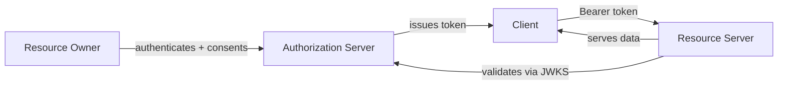
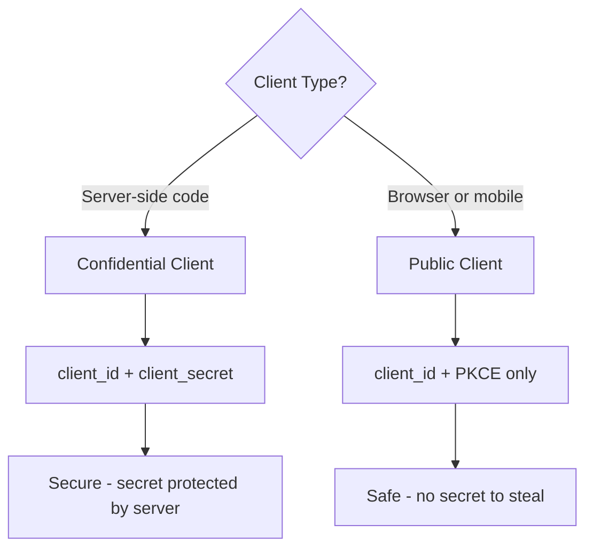

⚡ TL;DR - RFC 6749 defines four formal roles in OAuth 2.0:
Resource Owner, Client, Authorization Server, and Resource Server.
These are the precise technical names for the four actors. Every
YAML config key, every HTTP parameter, and every security decision
in an OAuth flow maps directly to one of these four roles.

---

### 🔥 The Problem This Solves

**WORLD WITHOUT IT:**

RFC 6749 is the specification that defines OAuth 2.0. To read the
spec, implement an OAuth library, debug an interop issue, or pass
a security audit, you need the exact role names it uses. Without
this vocabulary, you can understand the concept intuitively but
cannot read the spec, communicate precisely with other engineers,
or use OAuth libraries and frameworks that use these exact terms.

**THE BREAKING POINT:**

OAuth documentation, libraries (Spring Security, passport.js,
python-oauthlib), and authorization server configs all use these
four role names directly. Misconfiguring a Spring Security
`client-registration` vs `provider` block is a role confusion
error. Not knowing which role the `audience` claim refers to in
a JWT leads to incorrect token validation. The formal role names
are not jargon - they are the vocabulary for precision.

**THE INVENTION MOMENT:**

This is exactly why RFC 6749 Section 1.1 defines roles formally
before defining any flows - the entire spec is written in terms
of these roles and their interactions.

**EVOLUTION:**

OAuth 1.0 used different terms: Consumer (now Client), Service
Provider (now Resource Server + Authorization Server combined),
and User (now Resource Owner). OAuth 2.0 split the old Service
Provider role into two distinct roles (Authorization Server and
Resource Server), reflecting the architectural evolution toward
centralized identity providers. OpenID Connect adds a fifth
implicit role: Identity Provider (an Authorization Server that
also issues identity assertions).

---

### 📘 Textbook Definition

RFC 6749 Section 1.1 defines four roles:

**Resource Owner:** An entity capable of granting access to a
protected resource. When the resource owner is a person, it is
referred to as an end-user.

**Resource Server:** The server hosting the protected resources,
capable of accepting and responding to protected resource requests
using access tokens.

**Client:** An application making protected resource requests on
behalf of the resource owner and with its authorization. The term
"client" does not imply any particular implementation characteristics
(whether the application executes on a server, a desktop, or other
devices).

**Authorization Server:** The server issuing access tokens to the
client after successfully authenticating the resource owner and
obtaining authorization.

---

### ⏱️ Understand It in 30 Seconds

**One line:**
Four roles, one per party: the user who owns data, the app that
wants it, the gatekeeper that approves, and the API that serves it.

**One analogy:**

> Think of a car rental transaction: the car owner (Resource Owner)
> stores their car with a rental agency (Authorization Server).
> A traveler (Client) asks the agency to rent the car. The agency
> verifies the owner's consent and the traveler's license, then
> issues a rental agreement (access token). The traveler drives to
> the parking lot (Resource Server), shows the agreement, and gets
> the car keys.

**One insight:**
The most useful application of role knowledge is recognizing which
role each component in your system plays. Your React frontend is
the Client's public component. Your backend server is the Client's
confidential component. GitHub is both the Authorization Server and
Resource Server. Okta is the Authorization Server; your microservices
are Resource Servers. Roles clarify which party is responsible for
every security property.

---

### 🔩 First Principles Explanation

**CORE INVARIANTS:**

1. The Resource Owner is the ultimate source of all authorization.
   No token can be issued without the Resource Owner's consent
   (except Client Credentials, where the Resource Owner IS the
   Client).

2. The Authorization Server is the sole trusted issuer of access
   tokens. Its signatures are the root of trust.

3. The Client presents tokens; it never issues them.

4. The Resource Server consumes tokens; it never issues them.

**DERIVED DESIGN:**

Given these invariants, the four roles are the minimum required
set. Remove any role and the invariants collapse. Without the
Resource Owner role, there is no user consent model. Without the
Authorization Server role, there is no trusted token issuer.
Without the Client role, there is no separation between the
user and the requesting application. Without the Resource Server
role, there is no separation between token issuance and resource
access.

**THE TRADE-OFFS:**

**Gain:** Precise vocabulary enables unambiguous security analysis,
interoperable implementations, and clear responsibility assignment.

**Cost:** The formal role names are abstract. Engineers new to
OAuth must map them to concrete systems before the abstraction
is useful.

**ESSENTIAL vs ACCIDENTAL COMPLEXITY:**

**Essential:** These four roles are irreducible - any delegation
system that separates user consent from API access requires these
four parties.

**Accidental:** The specific names "Resource Owner" vs "User" and
"Authorization Server" vs "Identity Provider" are naming choices.
The roles they describe are structurally necessary.

---

### 🧪 Thought Experiment

**SETUP:**

You are reviewing an OAuth implementation. The engineer says:
"I simplified it - the client just validates tokens itself using
the shared secret, so we don't need a separate authorization
server."

**WHAT HAPPENS WITHOUT PROPER ROLE SEPARATION:**

The Client is now performing Authorization Server responsibilities.
It can issue tokens for any user without consent. It can modify
scope claims. It can create tokens that appear to come from the
"authorization server." Any other service in the system that trusts
these tokens now trusts the Client implicitly. One Client
compromise means all Resource Servers are compromised.

**WHAT HAPPENS WITH PROPER ROLE SEPARATION:**

The Authorization Server is the only trusted token issuer. Clients
receive tokens but cannot create or modify them. Resource Servers
validate tokens against the Authorization Server's public keys -
a key the Client does not possess. A compromised Client can only
use tokens it legitimately holds, bounded by their scope and expiry.

**THE INSIGHT:**

Role separation is structural enforcement of the principle of least
privilege. Each actor can only do what its role permits - not
because the code is written that way, but because the cryptographic
structure makes any other behavior detectable.

---

### 🧠 Mental Model / Analogy

> The four OAuth roles map to a healthcare authorization system.
> The patient (Resource Owner) stores medical records with a
> hospital (Resource Server). A specialist clinic (Client) needs
> read access to run diagnostics. The patient goes to the hospital's
> records office (Authorization Server), signs a specific consent
> form, and the records office issues a temporary access card. The
> specialist clinic presents the card to the records room and gets
> only the records the patient approved.

- "Patient" - Resource Owner (owns the data, consents to access)
- "Specialist clinic" - Client (requests access on patient's behalf)
- "Hospital records office" - Authorization Server (issues access)
- "Records room" - Resource Server (protects and serves data)
- "Temporary access card" - Access token
- "Consent form" - The OAuth consent screen authorization

Where this analogy breaks down: in healthcare, access cards are
physical and can be physically stolen. OAuth access tokens are
digital, short-lived, and can be revoked at the token registry
without physical interaction.

---

### 📶 Gradual Depth - Five Levels

**Level 1 - What it is (anyone can understand):**
OAuth 2.0 always involves four parties: the user who owns the data,
the app that wants access, the system that approves access and
issues tokens, and the API that checks the token and returns data.
These four parties have formal names in the OAuth spec.

**Level 2 - How to use it (junior developer):**
When configuring an OAuth client (e.g., Spring Security), you are
configuring the Client role. The `client-id`, `client-secret`, and
`scope` belong to Client configuration. The `authorization-uri` and
`token-uri` point to the Authorization Server. The `user-info-uri`
is a Resource Server endpoint. Keeping these roles distinct prevents
misconfiguration.

**Level 3 - How it works (mid-level engineer):**
The roles map directly to OAuth protocol messages. The Client
initiates flows. The Authorization Server handles `/authorize` and
`/token` endpoints. The Resource Server handles API endpoints
protected by `Authorization: Bearer` header validation. The
Resource Owner interacts only with the Authorization Server's
consent UI - they never interact with the Resource Server directly
during the OAuth flow.

**Level 4 - Why it was designed this way (senior/staff):**
The role separation that matters most architecturally is
Authorization Server vs Resource Server. In OAuth 1.0, these were
collapsed: the same server issued tokens and served resources. OAuth
2.0 separated them, enabling the Authorization Server to be a
centralized, hardened identity infrastructure (Okta, Auth0, Azure
AD) while Resource Servers remain lightweight API services that only
need to validate tokens. This separation is the architectural
foundation of modern enterprise SSO and the reason one Auth0
tenant can protect 50 microservices.

**Level 5 - Mastery (distinguished engineer):**
The four roles are a security analysis tool. For any OAuth
vulnerability, ask: "Which role failed to uphold its invariant?"
Client secret in browser = Client failed to protect its server-side
secret (confused public/confidential components). Missing token
validation = Resource Server failed its core responsibility. Consent
screen skipped = Authorization Server failed Resource Owner consent.
Scope broader than needed = Client failed least-privilege. The role
model converts security analysis from vague code review into
structured invariant checking.

---

### ⚙️ How It Works (Mechanism)

**Role definitions with RFC 6749 section references:**

```
┌───────────────────────────────────────────────────────┐
│         RFC 6749 Role Definitions                     │
├───────────────────────────────────────────────────────┤
│                                                       │
│  RESOURCE OWNER (§1.1)                                │
│  ─────────────────────────────────────────────────── │
│  Definition: Entity that can grant access to a        │
│    protected resource. Usually an end-user.           │
│  Responsibilities:                                    │
│    - Authenticate at Authorization Server             │
│    - Grant or deny consent to scopes                  │
│    - Revoke access via authorization server UI        │
│  Does NOT: directly interact with Resource Server     │
│    during flow; hold access tokens; call APIs         │
│                                                       │
│  RESOURCE SERVER (§1.1)                               │
│  ─────────────────────────────────────────────────── │
│  Definition: Server hosting protected resources.      │
│  Responsibilities:                                    │
│    - Validate access token on every request           │
│    - Enforce scope per endpoint                       │
│    - Return 401 (invalid/expired) or 403 (scope)     │
│  Does NOT: issue tokens; authenticate users           │
│                                                       │
│  CLIENT (§1.1, §2)                                    │
│  ─────────────────────────────────────────────────── │
│  Definition: Application making requests on behalf    │
│    of Resource Owner.                                 │
│  Types: confidential (server-side), public (browser,  │
│    mobile) - differs in ability to protect secrets   │
│  Responsibilities:                                    │
│    - Initiate authorization flows                     │
│    - Store and refresh access tokens                  │
│    - Call Resource Server with Bearer token           │
│    - Validate state parameter (CSRF protection)       │
│  Does NOT: issue tokens; authenticate Resource Owner  │
│                                                       │
│  AUTHORIZATION SERVER (§1.1, §3)                      │
│  ─────────────────────────────────────────────────── │
│  Definition: Server issuing tokens after auth +       │
│    authorization of Resource Owner.                   │
│  Responsibilities:                                    │
│    - Authenticate Resource Owner                      │
│    - Obtain and record consent                        │
│    - Issue access tokens + refresh tokens             │
│    - Publish JWKS for token validation                │
│    - Handle token revocation and introspection        │
└───────────────────────────────────────────────────────┘
```



**How roles map to real systems:**

| Abstract Role | Google SSO | GitHub CI/CD | Enterprise (Okta) |
|---|---|---|---|
| Resource Owner | Google account user | Repository owner | Employee |
| Client | Your web app | GitHub Actions workflow | SaaS application |
| Authorization Server | accounts.google.com | github.com | company.okta.com |
| Resource Server | Google APIs | github.com/api/v3 | Your internal APIs |

**The Client's dual nature - public vs confidential:**

RFC 6749 Section 2.1 defines two client types based on ability to
maintain confidentiality of credentials:

```
┌───────────────────────────────────────────────────────┐
│      Client Types (RFC 6749 §2.1)                     │
├───────────────────────────────────────────────────────┤
│                                                       │
│  Confidential Client                                  │
│  - Runs on a secure server (Node.js, Spring, etc.)   │
│  - CAN store client_secret securely                  │
│  - Uses: client_id + client_secret for token exchange│
│  - Examples: Server-rendered web app, backend service│
│                                                       │
│  Public Client                                        │
│  - Runs on user's device (browser, mobile app, CLI)  │
│  - CANNOT protect any stored secret                  │
│  - Uses: client_id + PKCE (no secret) for exchange   │
│  - Examples: SPA, React app, iOS app, CLI tool       │
│                                                       │
│  WHY IT MATTERS: A secret stored in a public client  │
│  is no longer a secret. Treat public clients as      │
│  untrusted. Use PKCE instead of client_secret.       │
└───────────────────────────────────────────────────────┘
```



---

### 🔄 The Complete Picture - End-to-End Flow

**NORMAL FLOW (roles labeled at each step):**

```
[Resource Owner] authenticates
  → [Authorization Server] verifies identity
  → [Resource Owner] approves scope
  → [Authorization Server] issues code to [Client]
  → [Client] back-channel: exchanges code + secret
  → [Authorization Server] issues access_token
  → [Client] calls [Resource Server] [YOU ARE HERE]
  → [Resource Server] validates token via JWKS
  → [Resource Server] checks scope against endpoint
  → [Resource Server] returns protected data
```

**FAILURE PATH:**

```
[Resource Server] validation fails →
  401 token_expired: [Client] uses refresh token
  403 insufficient_scope: [Client] re-authorizes with new scope
  401 invalid_signature: [Client] re-authorizes (token tampered)
  → Cascade: display re-authorization prompt to [Resource Owner]
```

**WHAT CHANGES AT SCALE:**

The Authorization Server becomes the shared critical path for all
Resource Servers. At scale, the architecture shifts: Authorization
Server handles only token issuance (relatively rare operations),
while Resource Servers validate tokens locally using cached JWKS
keys (high-frequency operations). The role separation IS the
scaling strategy.

---

### 💻 Code Example

**Example 1 - BAD then GOOD: Role confusion in Spring Security config:**

```yaml
# BAD: Confusing authorization-uri and token-uri roles
# authorization-uri should point to WHERE THE USER GOES
# (Authorization Server consent endpoint)
# token-uri should point to the BACK-CHANNEL endpoint
# (Authorization Server token endpoint)
spring:
  security:
    oauth2:
      client:
        registration:
          github:
            client-id: ${GITHUB_CLIENT_ID}
            client-secret: ${GITHUB_CLIENT_SECRET}
            # WRONG: Mixing up role responsibilities
            # authorization-uri is the Resource Server API!
            authorization-uri: https://api.github.com/user
            token-uri: https://github.com/login/oauth/authorize
# Result: login redirect goes to the API (Resource Server)
# instead of the Authorization Server - 404/error every time
```

```yaml
# GOOD: Each config key maps to the correct role
spring:
  security:
    oauth2:
      client:
        registration:
          github:
            client-id: ${GITHUB_CLIENT_ID}
            client-secret: ${GITHUB_CLIENT_SECRET}
            scope: read:user, user:email
        provider:
          github:
            # Authorization Server role: user consents here
            authorization-uri: >
              https://github.com/login/oauth/authorize
            # Authorization Server role: token issued here
            token-uri: >
              https://github.com/login/oauth/access_token
            # Resource Server role: user profile data
            user-info-uri: https://api.github.com/user
# WHY this structure: authorization-uri and token-uri are
#   Authorization Server endpoints (token issuance).
#   user-info-uri is a Resource Server endpoint (data access).
# WHAT BREAKS: Confusing these causes 4xx errors that look
#   like network problems but are actually role mismatches.
```

**Example 2 - Resource Server role: validating tokens correctly:**

```java
// Correct Resource Server implementation showing role
// responsibilities: validate token, enforce scope, return data
@RestController
@RequestMapping("/api")
public class UserDataController {

  // Resource Server responsibility: configure JWT validation
  // against Authorization Server's public keys (JWKS)
  // This is injected by Spring Security's oauth2ResourceServer
  // configuration - it handles JWKS key fetching and caching.

  @GetMapping("/profile")
  // @PreAuthorize enforces scope - Resource Server role:
  // "this endpoint requires the 'read:profile' scope"
  @PreAuthorize("hasAuthority('SCOPE_read:profile')")
  public ResponseEntity<UserProfile> getProfile(
      @AuthenticationPrincipal Jwt token) {
    // token is already validated by Spring Security:
    //   - signature verified against JWKS
    //   - expiry checked
    //   - audience validated
    //   - scope checked by @PreAuthorize
    String userId = token.getSubject();
    return ResponseEntity.ok(
        userService.findById(userId)
    );
    // WHAT BREAKS: Remove @PreAuthorize and any token with
    //   a valid signature can access any user's profile.
    // HOW TO TEST: Submit a token with 'read:admin' scope
    //   (not 'read:profile') - should return 403.
  }
}
```

**How to test / verify correctness:**
For role boundary testing: (1) submit a token issued for a
different Resource Server - should fail audience validation;
(2) submit a token with insufficient scope - should return 403;
(3) submit a token issued by an untrusted Authorization Server -
should fail signature validation.

---

### ⚖️ Comparison Table

| Role | RFC Section | HTTP Endpoints | Security Responsibility |
|---|---|---|---|
| **Resource Owner** | §1.1 | None (browser interaction) | Approve scopes, revoke access |
| **Authorization Server** | §1.1, §3 | /authorize, /token, /introspect, /revoke, /.well-known | Issue tokens, authenticate users |
| **Resource Server** | §1.1, §7 | /api/*, protected resources | Validate tokens, enforce scope |
| **Client** | §1.1, §2 | /callback (receives code) | Protect secrets, validate state |

How to choose: when debugging any OAuth issue, first identify which
role each component in your system plays. The responsible party
for each security check is determined by role, not by convenience.

---

### ⚠️ Common Misconceptions

| Misconception | Reality |
|---|---|
| The Authorization Server and Resource Server are always separate services | They CAN be the same service (GitHub acts as both). The logical role separation still matters for security analysis even when physically combined. |
| "Client" means the user's browser only | The Client role spans ALL code in your application that participates in the OAuth flow - both browser code (public component) and server code (confidential component). |
| The Resource Owner role is passive | The Resource Owner actively grants consent, can revoke it, and is the ultimate source of all authorization grants. They are not just an observer. |
| Any service that calls an API is the Resource Owner | A service calling an API is acting as a Client, not a Resource Owner. In Client Credentials flow, the Client and Resource Owner are the same entity, but they are still separate conceptual roles. |
| Adding OpenID Connect creates a fifth role | OIDC adds claims to the token but does not define a new RFC 6749 role. The Authorization Server also acts as an Identity Provider in OIDC flows - it is the same actor with additional responsibilities. |

---

### 🚨 Failure Modes & Diagnosis

**Role Confusion: Public Client Using Client Secret**

**Symptom:**
Browser network requests or mobile app binary contains
`client_secret`. Security scanners flag it. The secret is exposed
to all users of the application.

**Root Cause:**
A public Client (browser or mobile app) was configured with a
client_secret as if it were a confidential Client. Public Clients
run in environments the developer does not control - any secret
stored there is not secret.

**Diagnostic Command / Tool:**

```bash
# Scan JavaScript bundles for client_secret patterns:
grep -r "client_secret" dist/ public/ static/ build/

# Check mobile app binary:
strings ./MyApp.apk | grep -i "client_secret"

# Check network requests in browser devtools:
# Filter by "token" in the URL - look for POST requests
# containing client_secret in the request body
```

**Fix:**
Replace client_secret with PKCE for all public Clients. PKCE uses
a per-flow code_verifier and code_challenge - there is no stored
secret to steal.

**Prevention:**
Rule: if the code runs on a device you do not control (browser,
mobile), use PKCE. No exceptions. This rule is now codified in
OAuth 2.1 - client_secret is forbidden for public clients.

---

**Resource Server Not Enforcing Scope Per Endpoint**

**Symptom:**
A token scoped to `read:profile` can also call `POST /admin/users`
(an endpoint requiring `admin:write`). API returns 200 on all
authenticated requests regardless of scope.

**Root Cause:**
Resource Server validates token signature and expiry (the "is
this a real token?" check) but does not enforce scope per endpoint
(the "does this token allow THIS operation?" check). Both checks
are the Resource Server's role.

**Diagnostic Command / Tool:**

```bash
# Test scope enforcement on a write endpoint using a read token:
READ_TOKEN=$(get_token_with_scope "read:profile")
curl -X POST https://api.example.com/admin/users \
  -H "Authorization: Bearer $READ_TOKEN" \
  -d '{"email":"test@example.com"}'

# CORRECT: 403 Forbidden
# VULNERABLE: 201 Created (write succeeded with read token)

# Decode token to confirm scope:
echo $READ_TOKEN | cut -d. -f2 | base64 -d | jq '.scope'
# Should show "read:profile" only
```

**Fix:**
Add scope checking per endpoint. Spring Security: use
`@PreAuthorize("hasAuthority('SCOPE_admin:write')")`. Manual: check
`token.getClaimAsStringList("scope").contains("admin:write")`.

**Prevention:**
Scope enforcement is not optional configuration - it is the
Resource Server role's core security responsibility. Add scope
checks as a mandatory code review checklist item.

---

**Authorization Server JWKS Endpoint Not Cached**

**Symptom:**
Every API request adds 50-200ms latency. Under load, the
Authorization Server is overwhelmed. Token validation fails
intermittently during Authorization Server maintenance.

**Root Cause:**
The Resource Server calls the Authorization Server's JWKS endpoint
on every token validation instead of caching the public keys. This
collapses the architectural separation between roles - the Resource
Server is now tightly coupled to the Authorization Server's
availability on every request.

**Diagnostic Command / Tool:**

```bash
# Count JWKS fetches per minute in Resource Server logs:
grep "jwks" /var/log/app.log | \
  grep "$(date +%H:%M)" | wc -l
# Should be near 0 (keys cached); high number = not caching

# Measure Authorization Server load from JWKS requests:
curl -w "@curl-format.txt" \
  https://auth.example.com/.well-known/jwks.json
# Cache-Control header tells you how long to cache keys
```

**Fix:**
Cache JWKS keys for the duration of the `Cache-Control` header
(typically 24 hours). Implement key rotation handling: on JWT
validation failure, refresh JWKS once and retry before returning
401.

**Prevention:**
Design the Resource Server to be operationally independent of
the Authorization Server except for key rotation events. JWKS
keys rotate infrequently (days to weeks). Fetching them on every
request is an architectural error, not a tuning issue.

---

### 🔗 Related Keywords

**Prerequisites (understand these first):**

- `The Four Actors in Every OAuth Dance` - conceptual introduction
  to the same four parties using experiential framing
- `The Delegation Problem - Why OAuth Exists` - why the four-role
  structure is necessary

**Builds On This (learn these next):**

- `OAuth 2.0 Endpoints` - the specific HTTP endpoints for each
  Authorization Server and Resource Server role
- `Public vs Confidential Clients` - the two subtypes of the
  Client role and their security implications
- `Authorization Server Architecture` - what it takes to build
  and operate the Authorization Server role in production

**Alternatives / Comparisons:**

- `SAML 2.0` - uses different terminology (Identity Provider,
  Service Provider, Subject) but maps to the same structural roles
- `OpenID Connect` - extends the Authorization Server role to
  also act as an Identity Provider issuing ID tokens

---

### 📌 Quick Reference Card

```
┌──────────────────────────────────────────────────────────┐
│ WHAT IT IS   │ Four formal roles defined in RFC 6749     │
├──────────────┼───────────────────────────────────────────┤
│ PROBLEM IT   │ Precise role vocabulary for spec reading, │
│ SOLVES       │ security analysis, and library config     │
├──────────────┼───────────────────────────────────────────┤
│ KEY INSIGHT  │ Each role owns specific security checks - │
│              │ wrong role = missing or wrong check       │
├──────────────┼───────────────────────────────────────────┤
│ USE WHEN     │ Reading the OAuth spec, configuring OAuth │
│              │ libraries, or auditing implementations    │
├──────────────┼───────────────────────────────────────────┤
│ AVOID WHEN   │ N/A - these roles are always present in   │
│              │ every OAuth 2.0 flow by definition        │
├──────────────┼───────────────────────────────────────────┤
│ ANTI-PATTERN │ Treating public Client as confidential by │
│              │ storing client_secret in browser/mobile   │
├──────────────┼───────────────────────────────────────────┤
│ TRADE-OFF    │ Role separation enables scale and SSO     │
│              │ vs increased operational complexity       │
├──────────────┼───────────────────────────────────────────┤
│ ONE-LINER    │ "Every OAuth bug is a role that failed    │
│              │  to uphold its security invariant"        │
├──────────────┼───────────────────────────────────────────┤
│ NEXT EXPLORE │ Public vs Confidential → Auth Code Flow   │
│              │ → Authorization Server Architecture       │
└──────────────────────────────────────────────────────────┘
```

**If you remember only 3 things:**

1. Four roles: Resource Owner, Client, Authorization Server,
   Resource Server. Each has specific, non-interchangeable
   security responsibilities.

2. Clients come in two types: confidential (server-side, can
   store secrets) and public (browser/mobile, must use PKCE).

3. Authorization Server and Resource Server can be physically
   combined but should be logically separated - this separation
   enables local JWT validation at scale.

**Interview one-liner:**
"RFC 6749 defines four roles: Resource Owner grants access, Client
requests it, Authorization Server issues tokens after authenticating
the owner, and Resource Server validates tokens and serves data.
Every OAuth configuration decision maps to one of these roles."

---

### 💎 Transferable Wisdom

**Reusable Engineering Principle:**
Formal role definitions are the prerequisite for precise security
analysis. A system without explicit role definitions cannot be
analyzed for boundary violations - the boundaries do not exist as
formal constraints. This principle applies beyond OAuth to any
multi-party security protocol.

**Where else this pattern appears:**

- **X.509 PKI roles** - Root CA, Intermediate CA, End Entity, and
  Relying Party map directly to the same structural pattern as
  OAuth's four roles; each has defined issuance and validation
  responsibilities
- **Payment card processing** - Cardholder, Merchant, Issuer,
  and Acquirer form a four-role trust structure with analogous
  authorization flows
- **Kerberos** - Client, KDC (AS + TGS), and Service Server map
  to Resource Owner + Client, Authorization Server, and Resource
  Server respectively

**Industry applications:**

- **Cloud IAM** - AWS IAM follows the same role model: the user
  (Resource Owner), the application (Client), IAM/STS (Authorization
  Server), and AWS services (Resource Servers) with short-lived
  credentials (access tokens)
- **Open Banking** - regulatory frameworks like PSD2 define the
  four roles as regulatory entities: PSU (Resource Owner), TPP
  (Client), ASPSP auth system (Authorization Server), and ASPSP
  API (Resource Server)

---

### 💡 The Surprising Truth

RFC 6749's four-role model was explicitly designed to support a
scenario that did not exist yet in 2012: the use of a single
authorization server for multiple resource servers. In 2012, most
OAuth deployments had a 1:1 relationship - one authorization server
protecting one resource server (Twitter's AS protecting Twitter's
API). The architects deliberately separated the roles in
anticipation of the centralized identity provider market that would
emerge - Okta, Auth0, Ping Identity, and Azure AD now serve as the
Authorization Server for thousands of organizations, each with
dozens of Resource Servers. The four-role model was designed for
a future its authors could not quite see yet.

---

### ✅ Mastery Checklist

**You've mastered this when you can:**

1. **[EXPLAIN]** Map any "Sign in with X" implementation you have
   built or used to the four RFC 6749 roles - identify which
   system plays which role and what security responsibility each
   one fulfills.

2. **[DEBUG]** Given a Spring Security OAuth2 configuration that
   is failing, identify whether the error is in the Client
   configuration (registration), the Authorization Server
   configuration (provider), or the Resource Server configuration
   (jwt validation).

3. **[DECIDE]** A team wants to build their own authorization
   server. Map the RFC 6749 Authorization Server responsibilities
   to the features they must implement, and compare to using
   Keycloak or Auth0 as a managed Authorization Server.

4. **[BUILD]** Configure a Spring Boot application to act as both
   a Client (for external GitHub authorization) and a Resource
   Server (for your internal APIs), keeping the two role
   configurations correctly separate.

5. **[EXTEND]** Design a microservices authorization architecture
   where 15 Resource Servers all trust the same Authorization
   Server. Specify how token validation works, how key rotation
   is handled, and what happens to API requests during
   Authorization Server maintenance.

---

### 🧠 Think About This Before We Continue

**Q1.** In a Client Credentials flow, there is no Resource Owner
participating in the authorization. RFC 6749 says the Client "is
acting on its own behalf." How does the four-role model apply when
there is no human user? Who or what plays the Resource Owner role,
and what does this imply about consent and revocation?

*Hint: Consider whether the organization that deployed the service
is the "Resource Owner" and what consent and revocation look like
in a machine-to-machine context.*

**Q2.** You are running 50 microservices as Resource Servers, all
validating JWT tokens issued by a single Authorization Server. The
Authorization Server rotates its signing keys every 24 hours.
Design the key rotation protocol that ensures zero downtime across
all 50 Resource Servers during key rotation.

*Hint: Consider the JWKS endpoint, the `kid` (key ID) claim in
JWT headers, and the timing between when the Authorization Server
stops signing with the old key and when Resource Servers stop
accepting it.*

**Q3.** Build a minimal Authorization Server that issues JWT access
tokens for a single Resource Server. What are the four core
endpoints it must expose, what data must it persist, and what
cryptographic operations must it perform?

*Hint: Think about the endpoints required by RFC 6749 and RFC
8414. Consider what the Resource Server needs to validate tokens
locally without calling the Authorization Server on every request.*

---

### 🎯 Interview Deep-Dive

**Q1: A developer says "I can simplify our OAuth setup by making
the Resource Server also issue tokens, so we don't need a separate
Authorization Server." What is wrong with this approach?**

*Why they ask:* Tests understanding of why the Authorization
Server and Resource Server must be logically separate.

*Strong answer includes:*

- The Resource Server becomes both the token issuer and the token
  validator - it can issue tokens that give itself any permission
- Loses centralized audit trail and consent management
- Cannot scale SSO: other Resource Servers cannot trust tokens
  from your API without trusting your API specifically
- Correct approach: use a proper Authorization Server (Keycloak,
  Auth0) or build one that is fully separated from your APIs

**Q2: Your OAuth Client is a React SPA. How do you handle the
fact that SPAs cannot keep a client_secret safe?**

*Why they ask:* Tests knowledge of public clients and PKCE.

*Strong answer includes:*

- React SPAs are public clients - the code runs in the user's
  browser, any stored value is accessible to any script
- Solution: PKCE (Proof Key for Code Exchange) - generates a
  random code_verifier per flow, derives code_challenge, sends
  challenge in authorization request, sends verifier in token
  exchange; no stored secret needed
- Never store client_secret in browser JavaScript or localStorage
- OAuth 2.1 mandates PKCE for all public clients

**Q3: The Authorization Server vs Resource Server separation
enables something critical at production scale. What is it?**

*Why they ask:* Tests whether the candidate understands the
operational and architectural implications of role separation.

*Strong answer includes:*

- Local JWT validation: Resource Servers validate tokens using
  the AS's public key (from JWKS), zero calls to AS per request
- Scale: AS handles only token issuance (infrequent); RS handles
  token validation (per-request); these scale independently
- SSO: one AS serving many RSs without each RS needing user
  management; one login, tokens valid everywhere
- Tradeoff: JWT revocation is delayed (token valid until expiry
  unless RS checks a revocation list)
