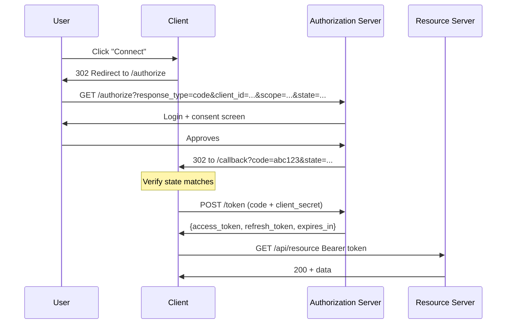
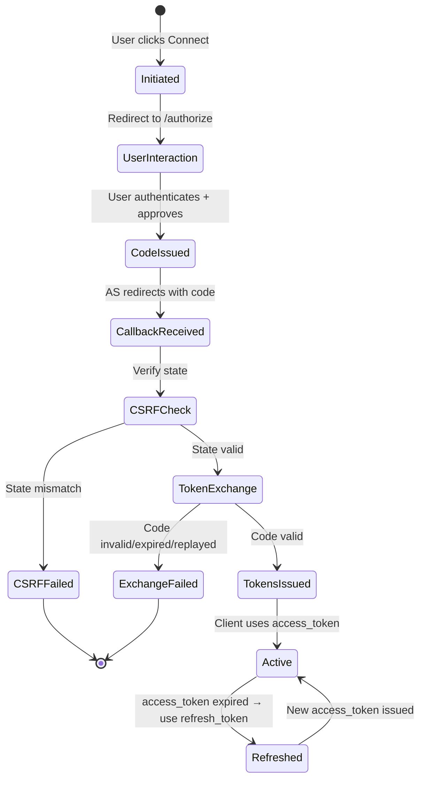

⚡ TL;DR - The Authorization Code Flow (RFC 6749 §4.1) is the
foundational OAuth 2.0 flow for applications that can keep
secrets: the user authenticates at the Authorization Server,
receives an authorization code via redirect, and the server
exchanges the code for tokens using its client secret. The code
is short-lived and single-use; the secret exchange happens in
the back channel, never visible to the browser. This two-step
design is not accidental - it is a deliberate security architecture
that separates front-channel user interaction from back-channel
token issuance.

---

### 🔥 The Problem This Solves

**WORLD WITHOUT IT:**

Without the Authorization Code Flow, the only way to get an access
token is to redirect the user and include the token directly in
the URL fragment (Implicit Flow) or ask the user for their
password (Resource Owner Password Credentials). Both approaches
are catastrophically insecure: tokens in URL fragments appear in
browser history, server logs, Referer headers, and any JavaScript
on the page. Passwords collected by the client defeat the entire
purpose of OAuth delegation.

**THE BREAKING POINT:**

The Implicit Flow was retired in OAuth 2.1 because tokens in URL
fragments are readable by JavaScript, logged by analytics tools,
and exposed through the Referer header when the user clicks an
external link. A single log pipeline misconfiguration could leak
every access token issued by the system.

**THE INVENTION MOMENT:**

The two-step authorization code design solves the exposure problem:
the authorization code is a short-lived, single-use voucher that
carries no authorization by itself. The code is exchanged for
tokens in the back channel (server-to-server), where the client
must prove its identity with the client secret. Even if the code
is stolen in transit, it is worthless without the client secret
and expires in seconds.

**EVOLUTION:**

RFC 6749 §4.1 (2012) defined the basic Authorization Code Flow.
The PKCE extension (RFC 7636, 2015) extended the flow to protect
public clients (SPAs, mobile apps) that cannot keep secrets. OAuth
2.1 (2023 draft) mandates PKCE for ALL clients, including
confidential clients, making PKCE the universal pattern. The
modern Authorization Code Flow is always Authorization Code + PKCE.

---

### 📘 Textbook Definition

The Authorization Code Flow (RFC 6749 §4.1) is an OAuth 2.0
grant type used by confidential clients that can securely maintain
a client secret. It proceeds in two phases: (1) front-channel
interaction where the resource owner authenticates and approves
scope, resulting in a short-lived authorization code delivered
via redirect; (2) back-channel token exchange where the client
presents the code plus client secret to the token endpoint and
receives an access token and optionally a refresh token. The
separation of code (front channel) from token (back channel)
prevents token exposure via the browser redirect mechanism.

---

### ⏱️ Understand It in 30 Seconds

**One line:**
The user approves access in the browser; the server exchanges a
short-lived code for tokens server-to-server using its secret.

**One analogy:**

> Buying concert tickets at a box office: the box office agent
> gives you a receipt voucher (authorization code) when you pay.
> You take the voucher to the ticket window, where the ticket
> agent (resource server) exchanges it for the actual tickets
> (access token) only after verifying the voucher is legitimate.
> If someone steals your voucher in the line, they cannot redeem
> it without the payment confirmation (client secret) that stays
> with the box office agent.

**One insight:**
The authorization code is designed to be safe to send through
the front channel (browser redirect) precisely BECAUSE it cannot
be used alone. The code is only as powerful as a key blank -
useless without the cutting machine (client secret) that lives
in the back channel. This is the critical design insight that
makes the flow secure.

---

### 🔩 First Principles Explanation

**CORE INVARIANTS:**

1. The browser (front channel) must never receive a usable token
   directly - the browser environment is not trustworthy (XSS,
   browser extensions, logging infrastructure).

2. The Authorization Server must verify the identity of the client
   when issuing tokens - preventing code injection attacks where
   a stolen code is submitted by a different client.

3. The user's approval must be cryptographically tied to the token
   issuance - preventing a token being issued without explicit
   user consent.

**DERIVED DESIGN:**

These three invariants require a two-phase design: Phase 1 (front
channel) collects user approval and issues a disposable voucher
(authorization code). Phase 2 (back channel) exchanges the voucher
for tokens, verifying client identity at exchange time. The code
is the bridge that carries user approval from the front channel
to the back channel without exposing the token.

**ESSENTIAL vs ACCIDENTAL COMPLEXITY:**

**Essential:** Two-phase design, client authentication at exchange,
short-lived single-use code - these are irreducible. Any single-
phase design that delivers tokens to the front channel fails
invariant 1.

**Accidental:** The specific parameters (`response_type=code`,
`grant_type=authorization_code`), redirect URI matching rules,
the exact error response format - these are implementation
decisions that implementations must follow but that could have
been specified differently.

---

### 🧪 Thought Experiment

**SETUP:**

A web application implements token retrieval using the Implicit
Flow (tokens in URL fragment). A competitor implements the
Authorization Code Flow (code in URL, tokens in back channel).

**WHAT HAPPENS WITH IMPLICIT FLOW (tokens in URL fragment):**

```
https://app.example.com/callback#access_token=eyJ...

1. Fragment stored in browser history
2. Fragment accessible via JavaScript: 
   location.hash → token exposed to every script
3. User navigates to documentation site:
   Referer: https://app.example.com/callback#access_token=eyJ...
   Token in the Referer header of every external link click
4. CDN logs the URL → token in log files
5. Error monitoring (Sentry, Datadog) captures URL → 
   token in error reports
```

The access token appears in at least 5 different log/storage
systems without any engineering error. An attacker with access
to any one of these can replay the token until expiry.

**WHAT HAPPENS WITH AUTHORIZATION CODE FLOW:**

```
https://app.example.com/callback?code=abc123&state=xyz

1. Code in URL → appears in history and logs (acceptable:
   code is single-use, expires in 10-60 seconds, useless
   without client secret)
2. Server exchanges code for token → POST /token with
   client_id + client_secret + code → back channel only
3. Token returned in JSON body → never in any URL
4. Token stored in server-side session → never in browser
5. Access to analytics/CDN logs reveals a 60-second-old
   code that has already been redeemed → zero value
```

**THE INSIGHT:**
The code is designed to be leaked. It is single-use and short-
lived by design so that it can safely transit the front channel
(browser history, URL logs, Referer). The token never leaves the
back channel.

---

### 🧠 Mental Model / Analogy

> The Authorization Code Flow is like a hotel key card system.
> The front desk (Authorization Server) gives you a paper claim
> ticket (authorization code) at check-in. You take that ticket
> to the concierge (token endpoint), who verifies it AND your
> passport (client secret), then gives you the actual room key
> card (access token). If someone steals your paper claim ticket
> in the lobby, they cannot get a room key without also having
> your passport.

- "Paper claim ticket" - authorization code (front channel, safe to expose)
- "Your passport" - client secret (back channel, never exposed)
- "Room key card" - access token (issued only in back channel)
- "Front desk" - Authorization Server /authorize endpoint
- "Concierge" - Authorization Server /token endpoint
- "10 minutes until claim expires" - authorization code TTL

Where this analogy breaks down: hotel keys are not scoped to
specific hotel services. Access tokens carry explicit scope
limiting which API operations are permitted.

---

### 📶 Gradual Depth - Five Levels

**Level 1 - What it is (anyone can understand):**
The Authorization Code Flow is the "Sign in with Google" process.
The user approves what the app may access. Google gives the app
a code. The app exchanges the code for an access token behind
the scenes. The user never sees the token - only the code, which
expires in seconds.

**Level 2 - How to use it (junior developer):**
Configure your OAuth library with the Authorization Server URL,
client ID, and client secret. The library handles the redirect,
code exchange, and token storage. When initiating login, use:
`response_type=code`. When exchanging the code: POST to /token
with `grant_type=authorization_code`, the code, redirect URI,
and client credentials. Never implement these steps manually in
production - use a battle-tested library.

**Level 3 - How it works (mid-level engineer):**
Step 1: Client redirects user to `/authorize?response_type=code&
client_id=...&redirect_uri=...&scope=...&state=...`. Step 2:
User authenticates and approves. Step 3: Authorization Server
redirects to the app's redirect URI with `?code=...&state=...`.
Step 4: App verifies state matches the value it generated.
Step 5: App POSTs to `/token` with code, client_id, client_secret,
redirect_uri. Step 6: Authorization Server returns access_token,
refresh_token, token_type, expires_in. The state parameter
prevents CSRF attacks by correlating the redirect with the
initiated authorization request.

**Level 4 - Why it was designed this way (senior/staff):**
The redirect_uri in the exchange step is a security binding: it
must exactly match the redirect_uri in the authorization step.
This prevents the "authorization code injection" attack where an
attacker substitutes a code obtained from a different client. The
Authorization Server ties the code to the specific redirect_uri,
so a stolen code presented with a different redirect_uri is
rejected. The state parameter binds the response to the original
request, preventing CSRF. Together these ensure: code is for this
client (redirect_uri match), response is for this request (state
match), and tokens were deliberately requested by the user (code
exchange requires client secret).

**Level 5 - Mastery (distinguished engineer):**
The two-step design creates a security boundary between consent
collection and token issuance. OAuth 2.1 mandates PKCE for all
flows because even confidential clients can be subject to code
injection if the network between the client and the Authorization
Server is compromised. PKCE prevents code injection by binding the
authorization request to the exchange request via a cryptographic
challenge: the `code_verifier` used at token exchange must hash
to the `code_challenge` sent in the authorization request. An
attacker intercepting the authorization code cannot redeem it
without also knowing the code_verifier, which is never sent over
the network (only its SHA-256 hash is sent in the authorization
request). This is defense-in-depth on top of client secret
authentication.

---

### ⚙️ How It Works (Mechanism)

**Complete flow with all parameters:**

```
┌───────────────────────────────────────────────────────┐
│     Authorization Code Flow (RFC 6749 §4.1)           │
├───────────────────────────────────────────────────────┤
│                                                       │
│  ┌────────┐  ┌────────┐  ┌──────────┐  ┌──────────┐ │
│  │Resource│  │        │  │Authoriz- │  │Resource  │ │
│  │Owner   │  │Client  │  │ation     │  │Server    │ │
│  │(User)  │  │(App)   │  │Server    │  │(API)     │ │
│  └────────┘  └────────┘  └──────────┘  └──────────┘ │
│       │           │            │              │       │
│  1.   │ Click     │            │              │       │
│       │"Connect"  │            │              │       │
│       │──────────>│            │              │       │
│  2.   │           │ 302 Redirect              │       │
│       │           │ GET /authorize?           │       │
│       │           │  response_type=code       │       │
│       │           │  &client_id=app123        │       │
│       │           │  &redirect_uri=...        │       │
│       │           │  &scope=read:user         │       │
│       │           │  &state=csrf-safe-random  │       │
│       │<──────────│────────────>              │       │
│  3.   │ Authenticate + consent screen         │       │
│       │─────────────────────────>             │       │
│  4.   │           │ 302 redirect to app       │       │
│       │           │ GET /callback?code=abc123 │       │
│       │           │   &state=csrf-safe-random │       │
│       │<──────────│<──────────                │       │
│  5.   │           │ Verify state == original  │       │
│       │           │            │              │       │
│  6.   │           │ POST /token               │       │
│       │           │  grant_type=authz_code    │       │
│       │           │  code=abc123              │       │
│       │           │  client_id=app123         │       │
│       │           │  client_secret=secret     │       │
│       │           │  redirect_uri=...         │       │
│       │           │────────────>              │       │
│  7.   │           │ {"access_token":...,      │       │
│       │           │  "refresh_token":...,     │       │
│       │           │  "expires_in":3600}       │       │
│       │           │<───────────               │       │
│  8.   │           │ GET /api/resource         │       │
│       │           │  Authz: Bearer <token>    │       │
│       │           │───────────────────────────>       │
│       │           │ 200 OK + data             │       │
│       │<──────────│<──────────────────────────│       │
│                                                       │
│  FRONT CHANNEL: Steps 1-5 (browser, visible, unsafe) │
│  BACK CHANNEL:  Steps 6-7 (server-to-server, safe)   │
└───────────────────────────────────────────────────────┘
```



**Authorization request parameters (mandatory and optional):**

```
Mandatory:
  response_type = code       (signals Authorization Code Flow)
  client_id     = app123     (identifies the client)
  redirect_uri  = https://app.example.com/callback
  scope         = read:user email

Security-critical:
  state         = cryptographically-random-nonce
                  (CSRF protection - must verify on response)

PKCE (mandatory in OAuth 2.1, recommended always):
  code_challenge        = BASE64URL(SHA256(code_verifier))
  code_challenge_method = S256
```

**Token request parameters:**

```
POST /token HTTP/1.1
Content-Type: application/x-www-form-urlencoded
Authorization: Basic base64(client_id:client_secret)

grant_type=authorization_code
&code=abc123
&redirect_uri=https://app.example.com/callback

# With PKCE:
&code_verifier=dBjftJeZ4CVP-mB92K27uhbUJU1p1r...
```

---

### 🔄 The Complete Picture - End-to-End Flow

**NORMAL FLOW:**

```
1. User clicks "Connect to [Service]" in your app
2. Your app generates: state (random), code_verifier (random),
   code_challenge = SHA256(code_verifier)
3. Store state + code_verifier in session (server) or
   sessionStorage (SPA)
4. Redirect user:
   GET /authorize?response_type=code&client_id=...
     &redirect_uri=...&scope=...
     &state=<state>&code_challenge=<challenge>
     &code_challenge_method=S256
5. User logs in + approves at Authorization Server
6. Authorization Server redirects:
   GET /callback?code=abc123&state=<state>
7. Verify state matches → prevents CSRF
8. Exchange code:
   POST /token
   grant_type=authorization_code&code=abc123
   &code_verifier=<verifier>&redirect_uri=...
   (+ client credentials via Authorization header)
9. Receive: access_token, refresh_token, expires_in
10. Store refresh_token (secure), use access_token for API calls
```

**FAILURE PATHS:**

```
State mismatch on callback:
  → CSRF attack detected → reject request, clear session
  → Do not exchange the code → return 400 to user

Code already redeemed (replay attempt):
  → Authorization Server returns error: invalid_grant
  → OAuth 2.0 spec requires AS to revoke ALL tokens from
    that authorization if code is replayed (§4.1.2)

Redirect URI mismatch at token endpoint:
  → Authorization Server returns error: invalid_grant
  → Log this - it may indicate authorization code injection

Client authentication failure:
  → Authorization Server returns error: invalid_client
  → Check: client_id + client_secret are correct?
```

**WHAT CHANGES AT SCALE:**

At high authorization volume (thousands of authorizations per
second), the Authorization Server's /authorize endpoint becomes
a bottleneck because it requires a user-facing interaction. The
/token endpoint is pure server-side processing and can be scaled
horizontally. The code storage (authorization codes must be single-
use and expire quickly) requires a fast, consistent store - Redis
is the common production choice. Code TTL is typically 10-60
seconds - Redis TTL handles expiry automatically.

---

### 💻 Code Example

**Example 1 - BAD then GOOD: state parameter handling:**

```python
# BAD: No state parameter - CSRF vulnerability
# An attacker can initiate an authorization with
# their own code and trick a victim into completing
# it, binding the victim's session to the attacker's
# account.
def initiate_oauth(request):
    auth_url = (
        f"{AS_URL}/authorize"
        f"?response_type=code"
        f"&client_id={CLIENT_ID}"
        f"&redirect_uri={REDIRECT_URI}"
        f"&scope=read:user"
        # No state parameter = CSRF attack surface
    )
    return redirect(auth_url)

def handle_callback(request):
    code = request.GET.get('code')
    # No state verification = CSRF attack succeeds
    exchange_code_for_token(code)
```

```python
# GOOD: State parameter with server-side verification
# WHY: state binds the callback to the specific
#   authorization request this server initiated.
#   Prevents CSRF where attacker initiates OAuth
#   and tricks victim into completing it.

import secrets
from django.http import HttpResponseBadRequest

def initiate_oauth(request):
    # Cryptographically random, URL-safe state
    state = secrets.token_urlsafe(32)
    # Store in session (server-side, not in URL or cookie)
    request.session['oauth_state'] = state

    auth_url = (
        f"{AS_URL}/authorize"
        f"?response_type=code"
        f"&client_id={CLIENT_ID}"
        f"&redirect_uri={REDIRECT_URI}"
        f"&scope=read:user+email"
        f"&state={state}"
        # With PKCE (always include):
        # f"&code_challenge={challenge}"
        # f"&code_challenge_method=S256"
    )
    return redirect(auth_url)

def handle_callback(request):
    returned_state = request.GET.get('state')
    stored_state = request.session.get('oauth_state')

    # Clear state immediately - single-use
    del request.session['oauth_state']

    # Constant-time comparison prevents timing attacks
    if not secrets.compare_digest(
        returned_state or '',
        stored_state or ''
    ):
        # State mismatch = possible CSRF attack
        return HttpResponseBadRequest(
            "State mismatch - authorization request invalid"
        )

    code = request.GET.get('code')
    tokens = exchange_code_for_token(code)
    # Store refresh_token securely, use access_token
    # WHAT BREAKS: If session expires between initiate
    #   and callback, state is lost - handle gracefully
    # HOW TO TEST: Delete session before callback;
    #   verify 400 returned (not 500 or auth bypass)
```

**Example 2 - Production authorization code exchange:**

```python
# Production token exchange with full error handling
# WHY this shape: handles all RFC 6749 error responses
# and distinguishes recoverable from fatal errors.
import httpx
import secrets
import hashlib
import base64

class AuthorizationCodeExchange:

    def __init__(self, client_id, client_secret,
                 token_endpoint, redirect_uri):
        self.client_id = client_id
        self.client_secret = client_secret
        self.token_endpoint = token_endpoint
        self.redirect_uri = redirect_uri

    def generate_pkce(self):
        """Generate PKCE code_verifier and code_challenge."""
        # code_verifier: 43-128 chars, URL-safe
        code_verifier = secrets.token_urlsafe(64)
        # code_challenge: BASE64URL(SHA256(code_verifier))
        digest = hashlib.sha256(
            code_verifier.encode('ascii')
        ).digest()
        code_challenge = base64.urlsafe_b64encode(
            digest
        ).rstrip(b'=').decode('ascii')
        return code_verifier, code_challenge

    def exchange(self, code, code_verifier):
        """Exchange authorization code for tokens."""
        try:
            response = httpx.post(
                self.token_endpoint,
                data={
                    'grant_type': 'authorization_code',
                    'code': code,
                    'redirect_uri': self.redirect_uri,
                    'code_verifier': code_verifier,
                },
                auth=(self.client_id, self.client_secret),
                # Basic auth = standard for confidential client
                timeout=10.0,  # fail fast; don't block
            )
            response.raise_for_status()
            return response.json()

        except httpx.HTTPStatusError as e:
            error_body = e.response.json()
            error = error_body.get('error', 'unknown')

            if error == 'invalid_grant':
                # Code expired, replayed, or invalid
                # Log + return user to auth start
                raise InvalidGrantError(error_body)
            elif error == 'invalid_client':
                # Client credentials wrong - config error
                raise ConfigurationError(error_body)
            else:
                # Other server error - retry may help
                raise TokenExchangeError(error_body)

        # WHAT BREAKS: Network timeout during exchange
        #   leaves code unconsumed; user must restart flow
        # HOW TO TEST: Mock /token to return invalid_grant;
        #   verify user is redirected to re-authorize
        # WHAT CHANGES AT SCALE: Exchange endpoint must be
        #   idempotent (same code = same error on replay);
        #   Redis stores code state with TTL for consistency
```

**Example 3 - BAD then GOOD: redirect URI validation:**

```python
# BAD: Partial redirect URI matching (open redirect)
# Authorization Server validates redirect URI with
# prefix matching - attacker registers:
# https://app.example.com.evil.com/callback
# and the prefix match accepts it.
def validate_redirect_uri(registered_uri, requested_uri):
    # VULNERABLE: prefix match allows subdomain attacks
    return requested_uri.startswith(registered_uri)

# GOOD: Exact match only per RFC 6749 §3.1.2
def validate_redirect_uri(registered_uri, requested_uri):
    # RFC 6749: redirect URI comparison must be exact
    # No wildcards, no prefix matching in production
    return registered_uri == requested_uri
    # WHAT BREAKS: Exact match fails if the app changes
    #   its callback URL without updating AS registration
    # HOW TO TEST: Submit redirect_uri with trailing slash
    #   added; must return invalid_request error
```

**How to test / verify correctness:**
Test the full flow end-to-end against a real Authorization
Server (or Auth0/Okta sandbox). Specifically test: (1) state
mismatch → 400 CSRF rejection, (2) code replay → invalid_grant,
(3) wrong redirect URI → invalid_grant, (4) expired code → 
invalid_grant, (5) code from different client → invalid_client.
All five failure modes should produce distinct error responses.

---

### ⚖️ Comparison Table

| Flow | When to Use | Key Trade-off | Security Level |
|---|---|---|---|
| **Authorization Code + PKCE** | All clients (SPA, mobile, server) | Two round trips, user interaction | High |
| **Client Credentials** | Server-to-server (no user) | No user consent, no delegation | High (machine context) |
| **Device Authorization** | CLI tools, TVs, IoT | No redirect URI, polling | Medium |
| **Implicit (deprecated)** | Never use | Tokens in URL fragment | Low - retired |
| **ROPC (deprecated)** | Never use | App collects user password | None - retired |

How to choose: use Authorization Code + PKCE for any flow
requiring user authorization (always the correct choice since
2019). Use Client Credentials for service-to-service. All other
flows are either deprecated or niche (Device Authorization for
browserless environments).

---

### 🔁 Flow / Lifecycle

```
┌───────────────────────────────────────────────────────┐
│     Authorization Code Flow State Machine             │
├───────────────────────────────────────────────────────┤
│                                                       │
│  [Authorization Initiated]                            │
│    - state generated + stored in session              │
│    - code_verifier generated (PKCE)                   │
│    - user redirected to /authorize                    │
│                                                       │
│  [User Interaction]                                   │
│    - user authenticates at Authorization Server       │
│    - user approves scope on consent screen            │
│    - Authorization Server issues authorization code   │
│      (single-use, TTL: 10-60 seconds)                 │
│                                                       │
│  [Callback Received]                                  │
│    - verify state matches stored value (CSRF check)   │
│    - extract code from query parameter                │
│                                                       │
│  [Token Exchange]                                     │
│    - POST /token (back channel only)                  │
│    - Authorization Server verifies:                   │
│      (1) code valid + not expired                     │
│      (2) code not previously redeemed                 │
│      (3) redirect_uri matches authorization request   │
│      (4) client credentials valid                     │
│      (5) code_verifier matches code_challenge (PKCE)  │
│                                                       │
│  [Tokens Issued]                                      │
│    - access_token (short-lived: 15-60 min)            │
│    - refresh_token (long-lived: days-months)          │
│    - token_type = Bearer                              │
│    - expires_in = seconds                             │
│                                                       │
│  [Code Consumed]                                      │
│    - Authorization code invalidated immediately       │
│    - Cannot be redeemed again (invalid_grant on retry)│
└───────────────────────────────────────────────────────┘
```



---

### ⚠️ Common Misconceptions

| Misconception | Reality |
|---|---|
| The authorization code IS the access token | The authorization code is a disposable voucher. It carries no authorization by itself and is only valuable for the 10-60 seconds before it expires. The access token is issued only in the token exchange step. |
| State is optional if you trust your users | State prevents CSRF attacks - a network-level attack where the attacker controls the callback, not the user. Users trusting the app does not protect against network-level CSRF. State is mandatory. |
| Implicit Flow is acceptable for single-page apps | Implicit Flow was explicitly retired in OAuth 2.1 and BCP 212 (2019). Use Authorization Code + PKCE for all SPAs. PKCE makes code exchange secure without a client secret. |
| The code is a secret and must be protected like a token | The code is designed to transit the front channel (URL, browser history). Its security comes from single-use + short TTL + required client secret at exchange. Protecting it from logs is good hygiene but not a security requirement. |
| redirect_uri in the token request is just informational | redirect_uri in the token exchange is a security binding - it must match the registration exactly. A mismatch indicates possible code injection and must return invalid_grant. |

---

### 🚨 Failure Modes & Diagnosis

**Missing State Parameter (CSRF Vulnerability)**

**Symptom:**
Security audit finds the authorization callback does not verify
the state parameter. Penetration test demonstrates an attacker
can initiate an OAuth flow with their own authorization code
and trick a victim into completing it via a crafted link. The
victim's account is silently linked to the attacker's identity.

**Root Cause:**
CSRF attack on OAuth callbacks: attacker initiates authorization
with a code they control, sends the callback URL to the victim,
victim's browser completes the flow binding the victim's session
to the attacker's authorization code.

**Diagnostic Command / Tool:**

```bash
# Test: initiate OAuth, note the state in the URL
# Then modify state in the callback and verify rejection:

# 1. Initiate authorization (observe state in URL)
# 2. Complete user auth to get the callback URL
# 3. Modify state parameter:
CALLBACK_URL="https://app.example.com/callback"
ORIGINAL_CODE="abc123"
TAMPERED_STATE="tampered_state_value"

curl -I "$CALLBACK_URL?code=$ORIGINAL_CODE&state=$TAMPERED_STATE"
# CORRECT: 400 Bad Request with CSRF error
# VULNERABLE: 200 OK with successful auth
```

**Fix:**
Generate cryptographically random state before each authorization
request, store in server-side session, verify exact match in
callback before exchanging the code.

**Prevention:**
State is a mandatory security control per OAuth 2.0 security BCP.
Treat it like CSRF token validation: missing or mismatched state
must abort the flow.

---

**Authorization Code Replay Attack**

**Symptom:**
A network attacker intercepts the authorization code in transit
(on a compromised network). They attempt to use the code before
the legitimate client does. If the legitimate client gets an
unexpected `invalid_grant` error, the code was replayed.

**Root Cause:**
Authorization codes transit the front channel (browser URL) and
can be intercepted on compromised networks. Without PKCE, a
stolen code can be replayed by the attacker directly at the
token endpoint.

**Diagnostic Command / Tool:**

```bash
# Test: attempt to exchange the same code twice
# First exchange: should succeed
curl -X POST https://auth.example.com/token \
  -d "grant_type=authorization_code" \
  -d "code=abc123" \
  -d "redirect_uri=https://app.example.com/callback" \
  -u "client_id:client_secret"

# Second exchange of same code: must return error
curl -X POST https://auth.example.com/token \
  -d "grant_type=authorization_code" \
  -d "code=abc123" \
  -d "redirect_uri=https://app.example.com/callback" \
  -u "client_id:client_secret"
# CORRECT: {"error":"invalid_grant"}
# Note: RFC 6749 §4.1.2: AS MUST revoke all tokens
#   issued under that authorization if code is replayed
```

**Fix:**
Add PKCE to all authorization code exchanges. With PKCE, a
stolen code is useless without the code_verifier, which is never
sent over the network.

**Prevention:**
Enable PKCE for all clients. Treat authorization code replay
detection as an active attack - revoke all tokens from that
authorization immediately (per RFC 6749 §4.1.2 requirement).

---

**Redirect URI Mismatch**

**Symptom:**
Users receive redirect errors during authorization. Logs show
`invalid_request` or `redirect_uri_mismatch` errors. Common
causes: app deployment changed the callback URL, development
vs production URL mismatch, or trailing slash inconsistency.

**Root Cause:**
The redirect_uri in the authorization request does not exactly
match any registered redirect URI for that client. RFC 6749
requires exact matching for confidential clients.

**Diagnostic Command / Tool:**

```bash
# Check: what redirect URIs are registered?
# Most Authorization Servers expose a management API:
curl https://auth.example.com/api/v2/clients/CLIENT_ID \
  -H "Authorization: Bearer $MGMT_TOKEN" \
  | jq '.callbacks'

# Compare against what the app is sending:
# Check app configuration for REDIRECT_URI env variable
# Verify: https://app.example.com/callback (no trailing slash)
# vs https://app.example.com/callback/ (trailing slash)
# → These are different URIs per RFC 3986
```

**Fix:**
Register the exact redirect URI including scheme, host, path,
and query parameters (if any). Trailing slashes matter. Register
each environment separately (dev, staging, production).

**Prevention:**
Treat redirect URI registration as a deployment step with
validation. Failed redirect URI validation in staging must block
production deployment.

---

### 🔗 Related Keywords

**Prerequisites (understand these first):**

- `OAuth 2.0 Roles` - the four actors that participate in the flow
- `Access Token` - the credential issued at the end of the flow

**Builds On This (learn these next):**

- `PKCE - Proof Key for Code Exchange` - the PKCE extension that
  makes this flow safe for public clients and is mandatory in
  OAuth 2.1
- `Token Response Structure` - the JSON object returned by the
  token endpoint after code exchange
- `Refresh Token` - the long-lived companion token issued with
  the access token; enables silent token renewal

**Alternatives / Comparisons:**

- `Client Credentials Flow` - the machine-to-machine OAuth flow
  (no user interaction); simpler but no delegation
- `Device Authorization Grant` - the flow for browserless devices
  (TVs, CLIs) that cannot perform redirects

---

### 📌 Quick Reference Card

```
┌──────────────────────────────────────────────────────────┐
│ WHAT IT IS   │ Two-phase OAuth flow: code via front      │
│              │ channel, tokens via back channel          │
├──────────────┼───────────────────────────────────────────┤
│ PROBLEM IT   │ Front-channel token delivery (Implicit)   │
│ SOLVES       │ exposes tokens to browser, logs, Referer  │
├──────────────┼───────────────────────────────────────────┤
│ KEY INSIGHT  │ Code is designed to be leaked (short-     │
│              │ lived, single-use, useless without secret)│
├──────────────┼───────────────────────────────────────────┤
│ USE WHEN     │ Any flow requiring user authorization;    │
│              │ all clients (SPA, mobile, server-side)    │
├──────────────┼───────────────────────────────────────────┤
│ AVOID WHEN   │ No user context needed → use Client Creds │
│              │ No redirect → use Device Authorization    │
├──────────────┼───────────────────────────────────────────┤
│ ANTI-PATTERN │ No state parameter = CSRF vulnerability   │
│              │ No PKCE = code injection attack surface   │
├──────────────┼───────────────────────────────────────────┤
│ TRADE-OFF    │ Two round trips + user interaction for    │
│              │ security vs. one-shot implicit (retired)  │
├──────────────┼───────────────────────────────────────────┤
│ ONE-LINER    │ "Code is the front-channel voucher;       │
│              │  tokens are the back-channel reward"      │
├──────────────┼───────────────────────────────────────────┤
│ NEXT EXPLORE │ PKCE → Token Response → Refresh Token     │
└──────────────────────────────────────────────────────────┘
```

**If you remember only 3 things:**

1. The authorization code is designed to transit the front channel
   (URL, browser history) safely - it is single-use, short-lived
   (10-60 seconds), and useless without the client secret.

2. Always include state (CSRF protection) and PKCE (code injection
   protection). In OAuth 2.1, both are mandatory for all clients.

3. Tokens are never in the URL. The back-channel token endpoint
   is server-to-server, authenticated with client credentials.

**Interview one-liner:**
"The Authorization Code Flow separates user consent (front
channel: code in URL, safe to expose) from token issuance (back
channel: server-to-server with client secret). The code is a
disposable voucher that is worthless without the client secret.
PKCE extends this to public clients by binding the exchange to
a cryptographic challenge known only to the initiating client."

---

### 💎 Transferable Wisdom

**Reusable Engineering Principle:**
Separate dangerous operations from the channels they transit.
The authorization code pattern - a disposable, time-limited
voucher exchanged via an authenticated back channel - applies
broadly: payment confirmation codes, email verification links,
one-time passwords, and API webhook signing all use the same
principle. The key insight: make the front-channel artifact
worthless by itself, requiring a back-channel secret to redeem
it.

**Where else this pattern appears:**

- **Two-factor authentication (TOTP)** - the 6-digit code is
  a time-limited voucher; validation requires the TOTP secret
  stored server-side - identical pattern to auth code + secret
- **Magic link email authentication** - the link contains a code;
  clicking it completes the back-channel exchange (server verifies
  the code, issues a session token)
- **Webhook signing** - the webhook payload is signed; receiver
  verifies signature using a shared secret stored out-of-band -
  same "public payload + back-channel secret verification" pattern

**Industry applications:**

- **Single Sign-On (SSO)** - SAML uses a similar two-phase design:
  SAML assertion (front channel) redeemed for session (back
  channel) at the service provider
- **Enterprise CI/CD** - GitHub Actions `GITHUB_TOKEN` uses a
  token exchange where the runner requests a token by presenting
  an OIDC JWT to a cloud provider, exchanging it for cloud
  credentials - same back-channel exchange principle

---

### 💡 The Surprising Truth

The Authorization Code Flow was designed in 2012 with confidential
clients (server-side web apps) in mind. Single-page applications
were an afterthought. The Implicit Flow (tokens directly in the
URL fragment) was added specifically for SPAs as a workaround for
SPAs that could not keep secrets. By 2019, the Implicit Flow was
being retroactively acknowledged as a security mistake - PKCE had
been published in 2015 showing that public clients COULD use the
Authorization Code Flow safely without a client secret. The OAuth
Security BCP (RFC 9700, 2025) formally retired Implicit Flow for
all new implementations. The original "Authorization Code Flow is
only for server-side apps" assumption lasted seven years before
being overturned by PKCE. Today, Authorization Code + PKCE is
the single correct flow for all clients.

---

### ✅ Mastery Checklist

**You've mastered this when you can:**

1. **[EXPLAIN]** Explain why the authorization code is safe to
   transit the front channel (browser URL, history, logs) even
   though it leads to token issuance, with specific reference to
   the single-use, short-TTL, and client-secret requirements.

2. **[DEBUG]** A user reports that OAuth authorization fails with
   "redirect_uri_mismatch" after a deployment. Describe the
   diagnostic steps to identify whether the issue is in the app
   configuration, the client registration, or a URL encoding
   difference.

3. **[BUILD]** Implement the complete Authorization Code + PKCE
   flow for a server-side web application, including state
   generation, PKCE verifier/challenge generation, state
   verification in the callback, and code exchange with error
   handling for each RFC 6749 error code.

4. **[SECURE]** Review a code change that removes state parameter
   verification "to simplify the login flow." Explain the specific
   CSRF attack that this enables, with a concrete attack scenario,
   and propose the minimal change that restores security.

5. **[SCALE]** Design the authorization code storage strategy for
   an Authorization Server handling 5,000 authorization flows per
   second, ensuring codes are single-use and expire in 60 seconds.
   Specify the storage technology, data model, and consistency
   requirements.

---

### 🧠 Think About This Before We Continue

**Q1.** A developer proposes removing the state parameter from the
OAuth flow "because we're using PKCE and that already provides
security." Evaluate this reasoning: does PKCE make state
redundant, or do they protect against different attacks?

*Hint: PKCE protects the code exchange (prevents a stolen code
from being redeemed by someone else). State protects the callback
binding (prevents a CSRF where an attacker controls which code
is received). They protect different attack vectors.*

**Q2.** Your Authorization Server must handle 10,000 authorization
code exchanges per second. Each code must be single-use and expire
after 60 seconds. Design the storage and invalidation strategy,
considering both correctness (no code reused) and performance.

*Hint: Consider Redis SET NX (set if not exists) for atomic
single-use enforcement. TTL handles expiry. The race condition
is two simultaneous exchanges of the same code - SET NX ensures
exactly one succeeds.*

**Q3.** The RFC 6749 spec says that if an authorization code is
replayed, the Authorization Server MUST revoke all tokens issued
under that authorization. Why is this requirement there and what
attack does it prevent?

*Hint: If a code is replayed, it may mean the legitimate client's
code was stolen and the attacker redeemed it first. The legitimate
client then tries to redeem the code again (replay). Revoking all
tokens prevents the attacker's tokens from remaining valid even
if the attacker successfully completed the first exchange.*

---

### 🎯 Interview Deep-Dive

**Q1: Walk me through every step of the Authorization Code Flow
and explain why each step is necessary.**

*Why they ask:* Tests mastery of the flow and the security
rationale for each step (not just rote memorization).

*Strong answer includes:*

- Step 1: Redirect to /authorize - collects user consent at the
  Authorization Server (user never shares credentials with app)
- Step 2: State generation - CSRF protection; binds response to
  request
- Step 3: User authenticates at AS - AS is the trust anchor
- Step 4: AS issues short-lived code and redirects back - code
  is safe in URL because single-use + short-lived
- Step 5: App verifies state - CSRF check
- Step 6: Back-channel code exchange with client credentials -
  proves identity of the client; token never in URL
- Step 7: Access + refresh tokens returned in JSON - never
  in URL or redirect

**Q2: How does PKCE extend the Authorization Code Flow and why is
it now required for all clients including confidential clients?**

*Why they ask:* Tests awareness of modern OAuth best practices
and the evolution from 2012 to 2023.

*Strong answer includes:*

- PKCE: code_verifier (random) + code_challenge (SHA256 hash)
  generated by client before authorization request
- code_challenge sent in /authorize request
- code_verifier sent in /token request
- AS verifies SHA256(verifier) == stored challenge
- Protects against: authorization code interception (code stolen
  in transit is useless without the verifier, which is never sent)
- For public clients: PKCE replaces client secret (public clients
  cannot keep secrets)
- For confidential clients: PKCE adds defense-in-depth on top of
  client secret - required in OAuth 2.1 even for server-side apps
- Why: if the AS or network is compromised, code interception
  attack requires both the code AND verifier - code alone is
  insufficient

**Q3: What is an authorization code injection attack and how does
redirect_uri binding prevent it?**

*Why they ask:* Tests understanding of the redirect_uri as a
security control, not just a routing parameter.

*Strong answer includes:*

- Injection attack: attacker intercepts a code issued to App A
  and submits it to App B's token endpoint
- Without redirect_uri binding: the code is valid and App B
  receives tokens for the user who authorized App A
- With redirect_uri binding: the code is tied to a specific
  redirect_uri at issuance; submitting it with a different
  redirect_uri → invalid_grant
- PKCE further prevents this: even with the correct redirect_uri,
  the attacker needs the code_verifier that App A generated
- Takeaway: redirect_uri exact matching is a security control,
  not a routing convenience; treat mismatch as a security event
