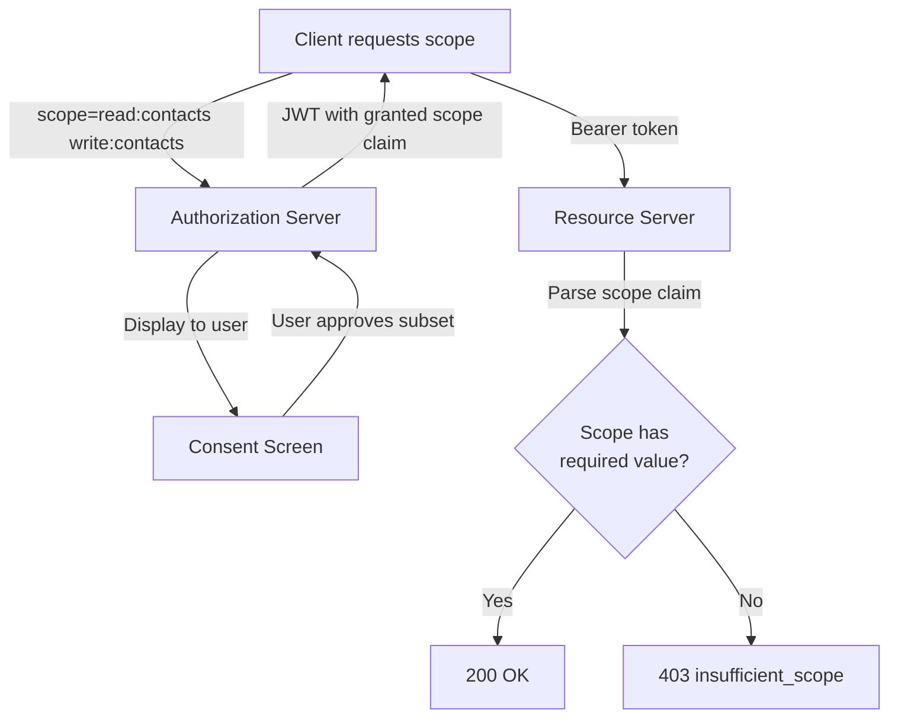
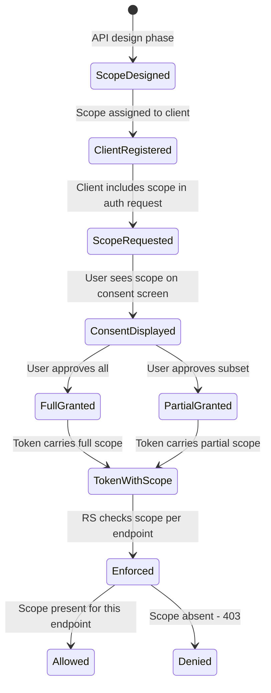

⚡ TL;DR - Scope is the mechanism by which an OAuth 2.0 token
carries its own permission boundaries. A scope string declares
what a client may do on behalf of the user. When the access token
is validated, the Resource Server checks that the token's scope
includes what the requested endpoint requires. Scope is the
primary implementation of least-privilege in OAuth 2.0 - without
it, every token would imply full access.

---

### 🔥 The Problem This Solves

**WORLD WITHOUT IT:**

Without scope, every OAuth access token grants unlimited access
to every operation the Resource Server supports. A token issued
so "My Calendar App" can read a user's calendar events also
implicitly grants permission to delete all events, read all
contacts, send email, and change the password. There is no
mechanism to say "this token is only for reading."

**THE BREAKING POINT:**

The application model that triggered OAuth (third-party apps
integrating with platform APIs) makes unlimited access
catastrophic: an app requesting authorization for a minor feature
gets the same access as a full admin. A compromised app token
can destroy user data across the entire API surface.

**THE INVENTION MOMENT:**

Scope solves this by making permission explicit and declarative.
The token carries its scope. The resource server enforces it.
The user sees what they are approving. The developer requests
only what the app needs. Scope is OAuth's implementation of the
principle of least privilege.

**EVOLUTION:**

RFC 6749 defined scope as a space-delimited string with no
standard format for scope names. This produced a decade of
incompatible scope naming conventions across APIs. Google uses
full URLs (`https://www.googleapis.com/auth/calendar.readonly`).
GitHub uses colon-delimited namespaces (`repo:read`). Auth0 uses
action:resource (`read:users`). The OIDC standard defined well-
known scope names (`openid`, `profile`, `email`, `address`,
`phone`) that all OIDC providers must support. RFC 8693 (Token
Exchange) added the concept of resource-scoped authorization
where scope is tied to a specific resource URI.

---

### 📘 Textbook Definition

Scope (RFC 6749 §3.3) is a mechanism for limiting an access
token's authorization. The authorization server uses scope to
limit the access that can be granted; the client uses scope to
request the minimum access it needs; the resource owner uses
scope to control what the client may access during consent; the
resource server uses scope to enforce access control on each
endpoint. Scope values are defined by the authorization server
and may be combined in a space-delimited list in both
authorization requests and access tokens. The authorization
server may issue an access token with a narrower scope than
requested; the actual granted scope is returned in the token
response.

---

### ⏱️ Understand It in 30 Seconds

**One line:**
Scope is the permission list embedded in an access token that
tells the Resource Server exactly what the token may do.

**One analogy:**

> A library membership card (access token) can have different
> scope levels: "check out books" (read scope), "borrow reference
> materials" (elevated scope), "access the archive" (special scope).
> The librarian (Resource Server) checks your card's scope before
> allowing each activity. An attacker who steals your "check out
> books" card cannot access the archive - your card's scope
> limits what it can do even if stolen.

**One insight:**
The most important scope decision is granularity. Too coarse
("read") grants more access than needed. Too fine ("read-user-
profile-first-name-only") creates an unusable consent screen.
The Goldilocks principle: scope should map to user-understandable
operations that correspond to real data access categories - what
a user would recognize and consciously consent to.

---

### 🔩 First Principles Explanation

**CORE INVARIANTS:**

1. Every API operation that accesses user-owned data must have
   a required scope. An operation with no required scope is
   accessible by any valid token regardless of what the user
   consented to.

2. The user's consent screen must present scope in terms the
   user understands - not technical scope strings.

3. The Resource Server enforces scope independently of the
   Authorization Server - it does not call back to verify scope
   per request.

**DERIVED DESIGN:**

These invariants require: scope embedded in the token (so RS
can enforce without AS call), human-readable descriptions for
scope (for consent screens), and scope-to-endpoint mapping in
the RS configuration (enforcement per operation). Scope is not
just a label; it is a contract between the Authorization Server,
the Resource Server, and the user.

**THE TRADE-OFFS:**

**Gain:** Fine-grained scope limits blast radius of token theft
and restricts what any single compromised token can do.

**Cost:** More scopes = more complex consent screens = lower
user approval rates. Users confronted with 15 scope permissions
abandon the flow. The practical limit for user-facing consent
is 3-5 scope permissions in a single authorization request.

---

### 🧠 Mental Model / Analogy

> Scope is like a power of attorney document that lists exactly
> which legal actions the attorney (client app) may take on your
> behalf. "Read-only access to bank statements" versus "full
> account management" are different powers of attorney. The bank
> (Resource Server) checks the document before each action.
> A stolen power of attorney for read-only bank statements
> cannot be used to transfer funds.

- "Powers of attorney listed" - scope values in the token
- "Bank checking the document" - Resource Server scope enforcement
- "What you signed" - user-approved scope on consent screen
- "Read-only bank statements" - narrow scope (e.g., `accounts:read`)
- "Full account management" - broad scope (e.g., `accounts:admin`)

---

### 📶 Gradual Depth - Five Levels

**Level 1 - What it is (anyone can understand):**
Scope is the list of what an app is allowed to do. When you see
"This app wants to: Read your calendar, See your email address"
on a permissions screen - those are scopes. The token you approve
can only do those specific things.

**Level 2 - How to use it (junior developer):**
Request scope in the authorization URL: `&scope=read:user email`.
The scope you request must be registered for your client. The
Authorization Server may grant a narrower scope than requested -
always check the `scope` field in the token response (not just
assume you got what you asked for). In the Resource Server,
map each endpoint to its required scope and return 403 if the
token's scope doesn't cover it.

**Level 3 - How it works (mid-level engineer):**
The scope string in an authorization request is space-delimited
(not comma-delimited). After token issuance, the token carries
the scope as a claim (a string in JWT, or a field in the
introspection response). The Resource Server extracts the scope,
splits it on spaces, and checks that the required scope value
is present. Some frameworks allow scope intersection checks
(token must contain ALL of a required set, or ANY of an
alternative set). The scope in the token is the actual granted
scope, which may differ from the requested scope.

**Level 4 - Why it was designed this way (senior/staff):**
Scope is intentionally underspecified in RFC 6749. The RFC defines
scope as "a set of values meaningful to the resource server" with
no standard naming convention. This decision was contentious in
the working group: prescribing scope names would make OAuth
immediately usable but would also make it inflexible for the
diverse API ecosystem it needed to support. The result: every
provider invented their own scope naming convention, creating
interoperability challenges. OIDC addressed this for identity
scope (`openid`, `profile`, `email`) but general API scopes
remain provider-specific. RFC 9396 (Rich Authorization Requests)
represents the most ambitious evolution: structured authorization
requests where scope carries machine-readable data (not just
a string) specifying the exact operation, resource, and
parameters the client is authorized for.

**Level 5 - Mastery (distinguished engineer):**
The deepest scope design decision is coarse-grained vs fine-
grained versus ABAC integration. Pure OAuth scope is coarse-
grained at best: it defines permission categories, not object-
level access control. `read:contacts` means the app can read
all contacts - not specifically only contacts in a group named
"Work." Object-level access control requires either: (1) very
fine-grained scopes that encode the resource identifier
(impractical at scale), (2) combining scope with claims-based
authorization (token carries scope + sub; RS combines both to
make decisions), or (3) Rich Authorization Requests (RFC 9396)
where the token authorization explicitly specifies the resource
and operation. Production systems typically combine: scope for
coarse-grained categories + application-layer ABAC for object-
level decisions.

---

### ⚙️ How It Works (Mechanism)

**Scope flow from request to enforcement:**

```
┌───────────────────────────────────────────────────────┐
│            Scope: Request → Grant → Enforce           │
├───────────────────────────────────────────────────────┤
│                                                       │
│  1. CLIENT REQUEST                                    │
│     GET /authorize?                                   │
│       ...&scope=read:contacts write:contacts email    │
│                                                       │
│  2. AUTHORIZATION SERVER SCOPE PROCESSING             │
│     - Check: are these scopes registered for client?  │
│     - Check: are these scopes valid for this AS?      │
│     - Display to user as human-readable descriptions  │
│                                                       │
│  3. CONSENT SCREEN (user sees)                        │
│     "App wants to:"                                   │
│     [✓] Read your contacts                            │
│     [✓] Edit your contacts                            │
│     [✓] See your email address                        │
│     User may uncheck individual scopes (some AS)      │
│                                                       │
│  4. TOKEN ISSUANCE (access token carries scope)       │
│     JWT payload:                                      │
│     {                                                 │
│       "scope": "read:contacts write:contacts email",  │
│       ...                                             │
│     }                                                 │
│     AS may narrow scope: user unchecked write:contacts│
│     → token scope: "read:contacts email"              │
│                                                       │
│  5. RESOURCE SERVER ENFORCEMENT                       │
│     GET /contacts → requires read:contacts            │
│     token.scope.contains("read:contacts") → 200 OK   │
│                                                       │
│     DELETE /contacts/123 → requires write:contacts    │
│     token.scope.contains("write:contacts") → false   │
│     → 403 Forbidden                                   │
│       {"error": "insufficient_scope",                 │
│        "scope": "write:contacts"}                     │
└───────────────────────────────────────────────────────┘
```



**Scope naming conventions in the wild:**

```
OIDC standard scopes (must use these exact strings):
  openid     - required for OIDC flows (ID token issued)
  profile    - name, picture, website, etc.
  email      - email + email_verified claims
  address    - physical mailing address
  phone      - phone_number + phone_number_verified

GitHub scope convention (resource:action):
  repo:read    read access to repositories
  repo:write   write access to repositories
  user:email   read user email addresses

Google scope convention (full URL):
  https://www.googleapis.com/auth/calendar.readonly
  https://www.googleapis.com/auth/gmail.send

Common internal convention (action:resource):
  read:users
  write:orders
  delete:invoices
  admin:all    (avoid this pattern - too broad)
```

---

### 🔄 The Complete Picture - End-to-End Flow

**SCOPE MISMATCH SCENARIOS:**

```
Scenario 1: Client requests scope not in registration
  Client requests: scope=admin:all
  AS checks: client registration allows: read:users, write:orders
  Result: error=invalid_scope
  Client must request only what it is registered for

Scenario 2: User narrows scope during consent
  Client requests: scope=read:contacts write:contacts
  User approves: only read:contacts
  Token issued with: scope=read:contacts
  Client receives token_response.scope=read:contacts
  Client MUST check granted scope vs requested scope

Scenario 3: Insufficient scope at Resource Server
  Token scope: read:contacts
  Client calls: DELETE /contacts/123
  RS requires: write:contacts
  RS returns: 403 Forbidden
    WWW-Authenticate: Bearer error="insufficient_scope"
      scope="write:contacts"
  Client cannot retry - must re-authorize with write scope

Scenario 4: No scope on sensitive endpoint (misconfiguration)
  Developer forgets to add scope check to admin endpoint
  Any valid token (even minimal scope) accesses admin API
  Root cause: missing scope enforcement, not scope design
```

**WHAT CHANGES AT SCALE:**

At scale, scope enforcement must be fast (<1ms). JWT scope claims
are extracted from the already-validated JWT - no additional
network calls. Scope enforcement is just a string contains check
on the parsed claims. Complex scope hierarchies (scope A implies
scope B) must be computed at token issuance, not at enforcement
time, to keep the enforcement path O(1).

---

### 💻 Code Example

**Example 1 - BAD then GOOD: Scope enforcement in Spring Security:**

```java
// BAD: Scope check in business logic, scattered across
// the codebase, easy to forget on new endpoints
@GetMapping("/contacts")
public List<Contact> getContacts(Principal principal) {
  // Where is the scope check? Forgotten entirely.
  return contactService.findAll();
  // Result: any valid token (any scope) can call this
}

@DeleteMapping("/contacts/{id}")
public void deleteContact(@PathVariable Long id,
                          OAuth2AuthenticationToken auth) {
  // Manual scope check buried in business logic
  if (auth.getPrincipal().getAttribute("scope")
      .toString().contains("write:contacts")) {
    contactService.delete(id);
  }
  // No else clause: silently does nothing on wrong scope
  // (should return 403, not silently succeed)
}
```

```java
// GOOD: Declarative scope enforcement at the security layer
// WHY: Scope checks as security annotations are applied
//   consistently; forgotten endpoints default to secure
//   (if using Spring's authorizeHttpRequests with deny-all
//   default). Silent failures become explicit 403 errors.

@Configuration
@EnableWebSecurity
public class ResourceServerConfig {

  @Bean
  public SecurityFilterChain filterChain(HttpSecurity http)
      throws Exception {
    http
      .oauth2ResourceServer(oauth2 ->
          oauth2.jwt(Customizer.withDefaults()))
      .authorizeHttpRequests(authz -> authz
        // Explicit scope per endpoint family
        .requestMatchers(HttpMethod.GET, "/contacts/**")
          .hasAuthority("SCOPE_read:contacts")
        .requestMatchers(HttpMethod.POST, "/contacts/**")
          .hasAuthority("SCOPE_write:contacts")
        .requestMatchers(HttpMethod.DELETE, "/contacts/**")
          .hasAuthority("SCOPE_write:contacts")
        // Default: deny all unmatched
        .anyRequest().denyAll()
      );
    return http.build();
    // Spring Security prefixes JWT scope values with
    // "SCOPE_" - so JWT scope "read:contacts" becomes
    // authority "SCOPE_read:contacts"
    // WHAT BREAKS: If JWT uses "scp" instead of "scope"
    //   claim, Spring Security does not extract it by
    //   default - configure JwtAuthenticationConverter
    // HOW TO TEST: Call DELETE /contacts/1 with a token
    //   that has only read:contacts scope; expect 403
  }
}
```

**Example 2 - BAD then GOOD: Scope naming design:**

```
# BAD: Over-broad scope naming
scopes = [
  "contacts",        # What can you do? Read? Write? Delete?
  "all",             # All of what? Every API? Every resource?
  "admin",           # Admin privileges, broadly - blast radius
]

# BAD: Over-fine scope naming (consent screen nightmare)
scopes = [
  "read-contact-first-name",
  "read-contact-last-name",
  "read-contact-email",
  "read-contact-phone",
  "write-contact-first-name",
  ...  # 30 more scopes - user will abandon flow
]
```

```
# GOOD: Action:resource pattern, understandable to users
# PRINCIPLE: Each scope = one type of operation on one
#   resource category; 3-5 scopes per consent flow max.

scopes = {
  # Read access - cannot modify anything
  "read:contacts": "View your contacts",
  "read:calendar": "View your calendar events",

  # Write access - includes create, update, delete
  "write:contacts": "Add and edit your contacts",
  "write:calendar": "Create and modify calendar events",

  # Identity (OIDC standard)
  "openid": "Sign in with your account",
  "email": "See your email address",
  "profile": "See your name and profile picture",
}

# Registration: each client gets ONLY the scopes it needs
# Calendar app registration:
# allowed_scopes: [openid, email, read:calendar, write:calendar]
# NOT: write:contacts, admin
```

**Example 3 - Checking granted scope vs requested scope:**

```javascript
// After token exchange, verify granted scope
// WHY: AS may issue narrower scope than requested.
//   Client must not assume full scope was granted.

async function exchangeCodeForTokens(code, codeVerifier) {
  const tokenResponse = await fetch('/token', {
    method: 'POST',
    body: new URLSearchParams({
      grant_type: 'authorization_code',
      code,
      code_verifier: codeVerifier,
      redirect_uri: REDIRECT_URI,
    }),
    headers: { 'Content-Type': 'application/x-www-form-urlencoded' }
  });

  const tokens = await tokenResponse.json();

  // ALWAYS check what scope was actually granted:
  const requestedScopes = ['read:contacts', 'write:contacts'];
  const grantedScopes = tokens.scope
    ? tokens.scope.split(' ')
    : [];

  const missedScopes = requestedScopes.filter(
    s => !grantedScopes.includes(s)
  );

  if (missedScopes.length > 0) {
    // User may have denied some scopes
    // Handle gracefully: disable features requiring
    // the missing scopes rather than failing entirely
    console.warn('Scope partially granted:', missedScopes);
    disableFeaturesRequiring(missedScopes);
  }

  return tokens;
  // WHAT BREAKS: App assumes write:contacts was granted
  //   when user only approved read:contacts; first write
  //   attempt returns 403 - confusing for the user.
  // HOW TO TEST: Mock AS to return scope=read:contacts
  //   when write:contacts was requested; verify UI
  //   gracefully disables the write feature.
}
```

---

### ⚖️ Comparison Table

| Scope Granularity | Pros | Cons | When to Use |
|---|---|---|---|
| **Coarse** (`contacts`) | Simple consent screen | Over-permissive; read = write = delete | Not recommended; avoid |
| **Action:resource** (`read:contacts`) | Understandable; least privilege | Requires careful mapping | Standard for user-facing APIs |
| **Resource URL** (Google style) | Machine-readable; namespaced | Long, opaque to users | Large API platforms |
| **Rich Authorization (RFC 9396)** | Object-level; structured | Complex; limited AS support | Financial/healthcare APIs |

---

### 🔁 Flow / Lifecycle

```
┌───────────────────────────────────────────────────────┐
│              Scope Lifecycle                          │
├───────────────────────────────────────────────────────┤
│                                                       │
│  [Design Time]                                        │
│    - Define scope names + human descriptions          │
│    - Register allowed scopes per client               │
│    - Map scopes to endpoints in Resource Server       │
│                                                       │
│  [Authorization Request]                              │
│    - Client requests minimum required scope           │
│    - AS validates scope is registered for client      │
│    - User sees scope descriptions on consent screen   │
│    - User approves all or subset                      │
│                                                       │
│  [Token Issuance]                                     │
│    - AS issues token with granted scope (may be < req)│
│    - Client MUST read token_response.scope            │
│    - Client adapts its behavior to granted scope      │
│                                                       │
│  [Resource Access]                                    │
│    - RS extracts scope from token on every request    │
│    - RS checks: does token scope include required     │
│      scope for this endpoint?                         │
│    - YES: 200 OK                                      │
│    - NO: 403 insufficient_scope with required scope   │
└───────────────────────────────────────────────────────┘
```



---

### ⚠️ Common Misconceptions

| Misconception | Reality |
|---|---|
| Scope is the same as role-based access control | Scope defines what a CLIENT is authorized to do on behalf of a user. Roles define what a USER may do directly. A token may have `read:orders` scope while the user has an `admin` role - these are orthogonal dimensions of access control. |
| Requesting more scope is harmless if the user approves | Broader scope = larger blast radius if the token is stolen. Minimum scope is not just about user experience - it is a security control. |
| The granted scope always equals the requested scope | The Authorization Server may issue a token with a narrower scope than requested (user denied some, or client is not authorized for some). Always check `token_response.scope`. |
| Adding a scope check to the endpoint is optional if the token is valid | Token validity (signature, expiry, audience) is separate from authorization (scope). A valid token without the required scope is a correctly-rejected request, not an error. Missing scope enforcement is an authorization vulnerability. |
| Scope values are standardized across providers | RFC 6749 defines the mechanism but not the values. Only OIDC scope names (`openid`, `profile`, `email`) are standard. Every other scope naming convention is provider-specific. |

---

### 🚨 Failure Modes & Diagnosis

**Endpoint Missing Scope Enforcement (Authorization Bypass)**

**Symptom:**
Security test discovers that a sensitive endpoint returns data
for a token with minimal scope (e.g., `openid` only). The
endpoint was added to the API without adding a scope check.

**Root Cause:**
Scope enforcement is opt-in in most frameworks. New endpoints
default to "any valid token" unless explicitly configured. A
missing scope check on a new endpoint silently allows any
authenticated request.

**Diagnostic Command / Tool:**

```bash
# Test all endpoints with minimal-scope token:
# Get a token with only 'openid' scope
MINIMAL_TOKEN=$(fetch_token scope=openid)

# Test each endpoint - any 200 from sensitive endpoint
# = missing scope enforcement
for ENDPOINT in /users /admin /reports /contacts; do
  STATUS=$(curl -s -o /dev/null -w "%{http_code}" \
    -H "Authorization: Bearer $MINIMAL_TOKEN" \
    "https://api.example.com$ENDPOINT")
  echo "$ENDPOINT: $STATUS"
  # Sensitive endpoints: expect 403, not 200
done
```

**Fix:**
Configure the Resource Server with a deny-all default and
explicit allow-list per endpoint. New endpoints must fail
authorization until scope is explicitly granted.

**Prevention:**
Make endpoint security configuration part of the code review
checklist. Use a security framework that requires explicit scope
declarations (so unannotated endpoints default to deny, not allow).
Add automated tests for each endpoint verifying both authorized
and unauthorized scope requests.

---

**Over-Broad Scope Requested (Blast Radius Expansion)**

**Symptom:**
Post-incident analysis shows a compromised service token was used
to access APIs far beyond what the service legitimately needed,
because the service was registered with excessive scope.

**Root Cause:**
Service registered with `admin:all` or a superset of required
scopes for convenience ("easier to just request everything"). A
compromise of the service grants the attacker access to every API
operation the overly-broad scope covers.

**Diagnostic Command / Tool:**

```bash
# Audit scope in existing tokens being issued to a service:
# Decode a sample token and check the scope claim:
TOKEN=$(fetch_service_token)
echo $TOKEN | cut -d. -f2 \
  | base64 --decode 2>/dev/null \
  | python3 -m json.tool | grep scope

# Compare to what the service actually calls:
grep -r "api.example.com" service/src/ \
  | grep "https\?://" \
  | sort -u
# Cross-reference used endpoints vs scope granted
```

**Fix:**
Audit each service's registered scopes against its actual API
usage. Remove unused scopes. Re-register with minimum required
scopes. Update token requests to request only what is needed.

**Prevention:**
Scope registration review is part of service deployment approval.
No service may be registered with broader scopes than its
documented API requirements.

---

### 🔗 Related Keywords

**Prerequisites (understand these first):**

- `Access Token` - the credential that carries the scope claim
- `OAuth 2.0 Roles` - the actors that request, grant, carry, and
  enforce scope

**Builds On This (learn these next):**

- `Token Response Structure` - where the granted scope appears
  in the token endpoint response
- `Rich Authorization Requests (RFC 9396)` - structured
  authorization that extends scope with object-level parameters

**Alternatives / Comparisons:**

- `Claims-Based Authorization` - combining scope with token claims
  (sub, custom claims) for finer-grained access control
- `Policy-Based Authorization` - using OPA or similar to evaluate
  rich authorization policy from token attributes

---

### 📌 Quick Reference Card

```
┌──────────────────────────────────────────────────────────┐
│ WHAT IT IS   │ Permission boundaries embedded in the     │
│              │ access token; enforced by Resource Server  │
├──────────────┼───────────────────────────────────────────┤
│ PROBLEM IT   │ Every token granting unlimited access     │
│ SOLVES       │ regardless of what user consented to      │
├──────────────┼───────────────────────────────────────────┤
│ KEY INSIGHT  │ Token validity ≠ authorization; scope     │
│              │ enforcement is separate from token check  │
├──────────────┼───────────────────────────────────────────┤
│ USE WHEN     │ Always - every token must have explicit   │
│              │ scope; every endpoint must enforce it     │
├──────────────┼───────────────────────────────────────────┤
│ ANTI-PATTERN │ No scope enforcement = any valid token    │
│              │ accesses any endpoint (authorization bypass│
├──────────────┼───────────────────────────────────────────┤
│ NAMING       │ action:resource pattern (read:contacts)   │
│ CONVENTION   │ OIDC standard: openid, profile, email     │
├──────────────┼───────────────────────────────────────────┤
│ TRADE-OFF    │ Fine-grained scope (secure, complex UX)   │
│              │ vs coarse scope (simple, over-permissive) │
├──────────────┼───────────────────────────────────────────┤
│ ONE-LINER    │ "Request minimum; enforce per endpoint;   │
│              │  always verify granted scope in response" │
├──────────────┼───────────────────────────────────────────┤
│ NEXT EXPLORE │ Token Response Structure →                 │
│              │ Rich Authorization Requests (RFC 9396)    │
└──────────────────────────────────────────────────────────┘
```

**If you remember only 3 things:**

1. Scope is least privilege in token form. Request only what the
   app needs. Register only what the service uses. Enforce per
   endpoint - not just "is the token valid."

2. The Authorization Server may grant less scope than requested.
   Always check `token_response.scope` after exchange - never
   assume full scope was granted.

3. Missing scope enforcement is an authorization vulnerability,
   not just a code omission. New endpoints default to accessible
   by any valid token unless explicitly configured otherwise.

**Interview one-liner:**
"Scope is the permission boundary carried by the access token.
The user approves it at consent time, the Authorization Server
embeds it in the token, and the Resource Server enforces it
per endpoint. A valid token without the required scope gets 403,
not 200. Missing scope enforcement is the most common OAuth
authorization vulnerability."

---

### 💎 Transferable Wisdom

**Reusable Engineering Principle:**
Credentials should carry their own authorization constraints. A
credential that requires an external lookup on every access to
determine its permissions is a bottleneck; a credential that
carries embedded permission boundaries is self-enforcing. This
principle appears in JWT claims, AWS IAM policy documents, SAML
attribute assertions, and Kerberos service tickets - all carry
their authorization data with the credential itself.

**Where else this pattern appears:**

- **AWS IAM policies** - IAM roles carry inline policies specifying
  allowed actions and resources; the policy IS the scope, embedded
  in the credential
- **Kubernetes RBAC** - ServiceAccount token-bound roles map
  directly to OAuth scope semantics (what verbs on what resources)
- **SAML attribute assertions** - SAML assertions carry attribute
  values that the service provider uses for authorization decisions,
  analogous to scope claims

---

### 💡 The Surprising Truth

RFC 6749 §3.3 defines scope using a single sentence with no
prescriptive guidance on naming: "The value of the scope parameter
is expressed as a list of space-delimited, case-sensitive strings."
The entire scope design philosophy is left to implementers. This
produced a situation where two implementations of the same
standard are completely incompatible at the scope level: a token
from one Authorization Server has scopes that are meaningless to
a Resource Server configured for another. The specification
committee made this choice deliberately, believing API-specific
scopes would be more useful than pre-defined standard scopes.
The result: every OAuth 2.0 provider documentation starts with
a page explaining their custom scope naming convention. The irony
is that the OIDC standard, designed for a narrower use case
(identity), specified scope values explicitly and achieved
cross-provider interoperability that the more general OAuth 2.0
specification did not.

---

### ✅ Mastery Checklist

**You've mastered this when you can:**

1. **[DESIGN]** Design the scope model for a new API with five
   resource types, three operation categories, and an admin role,
   following the principle of least privilege and ensuring the
   consent screen presents at most five scopes to users.

2. **[IMPLEMENT]** Configure scope enforcement in a Spring Security
   or similar framework such that: new endpoints default to
   deny-all, scope checks are declarative (not scattered in
   business logic), and 403 responses include the required scope
   in the WWW-Authenticate header.

3. **[AUDIT]** Review an existing service's client registration
   and token scope to identify over-provisioning. Enumerate the
   specific endpoints that justify each scope and identify scopes
   that are registered but never required by any endpoint.

4. **[DEBUG]** A service receives 403 for an endpoint it previously
   accessed successfully. Diagnose whether the issue is: (a) token
   scope was narrowed in a recent auth flow, (b) the endpoint's
   required scope was changed, or (c) the client registration no
   longer includes the scope.

5. **[EXPLAIN]** Explain to a product manager why the consent
   screen for a new app feature needs to request only one new
   scope rather than "just reusing the existing full-access
   token" - with specific reference to user experience (approval
   rate) and security (blast radius) implications.

---

### 🧠 Think About This Before We Continue

**Q1.** A user reports they "revoked" an app's access by removing
the permission in account settings, but the app still works for
another hour. The app uses JWT access tokens with a 60-minute TTL
and `scope=read:calendar`. Explain exactly what "revoked" means
in this context, why the app still works, and what the options
are for more immediate revocation.

*Hint: Revocation removes the refresh token; the AS will no longer
issue new access tokens. Existing JWT tokens remain valid until
exp. Options: shorter TTL (reduces window), revocation list at
Resource Server (immediate but adds latency), or opaque tokens
(introspection reflects revocation immediately).*

**Q2.** Design the scope model for a banking API with: account
balance inquiry, transaction history, payment initiation, and
account management (change details). Each operation must be
individually consentable, and payment initiation must require
step-up authentication regardless of existing token scope.

*Hint: Consider separate scopes for each operation category.
Payment initiation requires both a scope AND a higher assurance
level - this is where amr (authentication methods references)
and acr (authentication context class reference) claims become
relevant beyond just scope.*

**Q3.** Your authorization server issues tokens with scope
`read:contacts write:contacts email`. Your Resource Server has
60 endpoints. Describe the architectural approach to ensure
every endpoint has explicit scope enforcement, no endpoint is
accidentally left open to any valid token, and new endpoints
require scope configuration before deployment.

*Hint: Security-by-default configuration: declare a deny-all
default rule, then explicit allow-list per endpoint group.
Consider integration test that verifies every endpoint returns
403 for a minimal-scope token and 200 for a correctly-scoped token.*

---

### 🎯 Interview Deep-Dive

**Q1: How does scope relate to the principle of least privilege
in OAuth 2.0, and what are the practical limits of scope-based
access control?**

*Why they ask:* Tests understanding of scope as a security control
and its limitations compared to ABAC or RBAC.

*Strong answer includes:*

- Scope implements least privilege at the client/token level:
  a client requests only what it needs; a token can only do
  what its scope permits
- Practical limits: scope is coarse-grained; `read:contacts`
  grants access to ALL contacts, not specific contact records;
  object-level access control requires combining scope with
  claims-based or policy-based authorization
- Scope + subject (`sub` claim) is a common pattern: the RS
  checks both "does the token have read:contacts scope" AND
  "is the contact owned by the token's subject (user)"
- For finer control: RFC 9396 Rich Authorization Requests
  allow structured authorization data beyond a flat scope string

**Q2: A user approved `write:contacts` scope for an app six
months ago. The app continues to use the refresh token to get
new access tokens with that scope. How does the user revoke
the write:contacts permission but keep the read:contacts
permission?**

*Why they ask:* Tests understanding of scope revocation
mechanics and the granularity of consent management.

*Strong answer includes:*

- Most AS provide a user consent management screen where the
  user can revoke specific app authorizations
- Revoking revokes the refresh token; the app can no longer
  obtain NEW tokens with any scope for that user
- Existing access tokens remain valid until expiry (JWT TTL)
- Granular scope revocation (revoke write but keep read) is
  not universally supported; most AS revoke the entire grant
- The correct pattern: user revokes, then app re-initiates
  authorization requesting only `read:contacts` - user approves
  only the read scope on the new consent screen
- For immediate revocation of existing tokens: needs short TTL
  or a revocation list at the Resource Server

**Q3: What error response should a Resource Server return when
a valid token has insufficient scope, and what HTTP status code
and body format are correct per RFC 6750?**

*Why they ask:* Tests RFC knowledge and the distinction between
authentication failure (401) and authorization failure (403).

*Strong answer includes:*

- HTTP 403 Forbidden (not 401 - the token is valid but
  authorization is denied)
- WWW-Authenticate header per RFC 6750 §3.1:
  `WWW-Authenticate: Bearer error="insufficient_scope",`
  `  error_description="...", scope="required:scope"`
- JSON body (common practice, not strictly standardized):
  `{"error": "insufficient_scope", "scope": "write:contacts"}`
- The scope field in the error indicates what scope IS required,
  allowing the client to initiate a new authorization request
  with the correct scope
- 401 is for: missing token, invalid token (bad signature,
  expired, wrong audience) - authentication failure
- 403 is for: valid token, wrong scope - authorization failure
