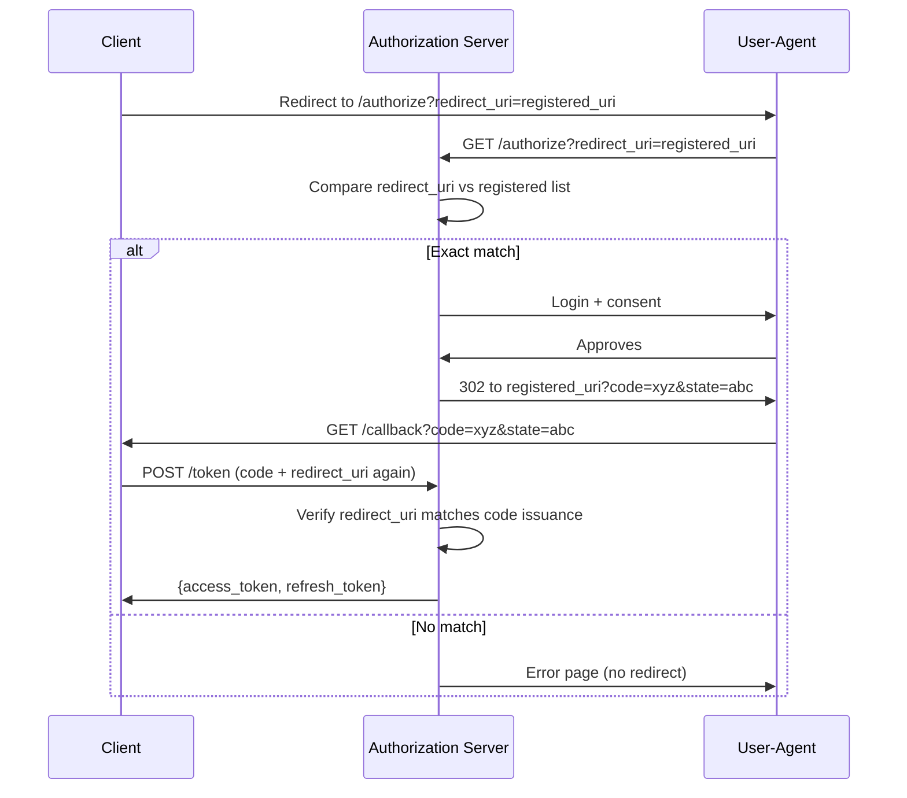
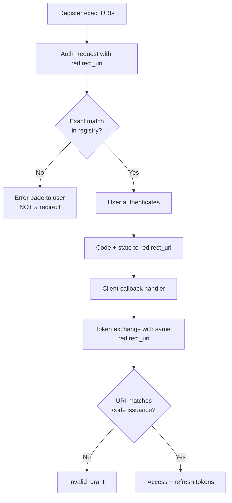

⚡ TL;DR - The redirect URI is the URL where the Authorization
Server sends the user back after authentication, delivering the
authorization code. It is also a security control: the
Authorization Server compares the requested redirect URI against
pre-registered values and rejects requests that don't match
exactly. Without this validation, an attacker can redirect
authorization codes to a server they control.

---

### 🔥 The Problem This Solves

**WORLD WITHOUT IT:**

Without redirect URI validation, any actor who can intercept or
modify the OAuth authorization request can change the redirect
destination. An attacker modifies `redirect_uri=https://evil.com/
steal` in the authorization URL. The user authenticates and
approves consent. The Authorization Server redirects the user
to the attacker's server carrying the authorization code. The
attacker exchanges the code for tokens and has full access to
the user's account. The user has no indication anything went wrong.

**THE BREAKING POINT:**

This is the "authorization code redirect" attack - one of the
most common OAuth vulnerabilities. It requires only the ability
to intercept or modify the authorization request URL (possible
via malicious links, referrer header manipulation, or MITM on
HTTP). Without redirect URI validation at the Authorization
Server, every OAuth authorization is vulnerable.

**THE INVENTION MOMENT:**

The redirect URI validation requirement in RFC 6749 is the
primary defense against this class of attack. The Authorization
Server maintains a registry of valid redirect URIs per client.
Any request with an unregistered redirect URI is rejected before
authentication begins. The comparison must be exact (per RFC 6749
§3.1.2.3 for confidential clients) - no wildcards, no prefix
matching, no path traversal.

**EVOLUTION:**

RFC 6749 allowed some flexibility in redirect URI validation
for confidential clients (requiring at least a registered URI)
and more flexibility for public clients. This flexibility was
abused: partial matching, subdomain wildcards, and path prefix
matching all turned the validation into a sieve. RFC 9700
(OAuth 2.0 Security Best Current Practice, 2025) requires exact
matching for all clients. Draft proposals for "loopback redirect
URIs" for native apps formalized `http://localhost` variants to
handle the native app use case securely.

---

### 📘 Textbook Definition

The redirect URI (RFC 6749 §3.1.2) is a URI registered with the
authorization server that specifies the endpoint to which the
authorization server will send the user-agent after completing
the user interaction. The redirect URI is included in the
authorization request and must be compared against the registered
redirect URIs for the client. The authorization server must
validate the redirect URI against the registered value, using
exact comparison (RFC 9700 §2.1). If the redirect URI is not
registered or does not match, the request must be rejected and
the user must not be redirected. The redirect URI is also
included in the token exchange request, where it serves as an
additional binding check to prevent authorization code injection.

---

### ⏱️ Understand It in 30 Seconds

**One line:**
The redirect URI is where the user's browser is sent after they
approve access - and must exactly match a pre-registered value
or the Authorization Server rejects the request.

**One analogy:**

> Think of the redirect URI as the "ship to" address on a
> package. When you order (initiate OAuth), you specify where
> the package (authorization code) should be delivered. The
> courier (Authorization Server) has a pre-approved list of
> delivery addresses for your account. If you try to change the
> delivery address to someone else's house, the courier refuses.
> Only the addresses on file are valid.

**One insight:**
The redirect URI is both a routing mechanism (where does the code
go?) and a security binding (was this the authorized destination?).
When it also appears in the token exchange, it becomes a binding
check: the Authorization Server verifies that the code is being
exchanged by the same party that received it (same redirect URI
= same party). An attacker who intercepts the code but uses a
different redirect URI gets rejected.

---

### 🔩 First Principles Explanation

**CORE INVARIANTS:**

1. The authorization code must only be delivered to a URI that
   the legitimate client controls.

2. An attacker who modifies the redirect URI in the authorization
   request must be detected and rejected before the code is issued.

3. A client must not be able to claim someone else's redirect URI
   as their own.

**DERIVED DESIGN:**

These invariants require: pre-registration of valid redirect URIs
per client (prevents claiming arbitrary URIs), exact comparison
at request time (prevents subtle bypasses via path traversal or
subdomain tricks), and the same redirect URI included in the
token exchange (creates a binding check that detects code theft
and redirection to a different party).

**WHERE EXACT MATCHING MATTERS:**

```
Registered:   https://app.example.com/callback
These should ALL be rejected:

https://app.example.com/callback?injected=param (extra query)
https://app.example.com/CALLBACK (case change)
https://app.example.com/callback/ (trailing slash)
https://app.example.com/callback/../admin (path traversal)
https://app.example.com.evil.com/callback (subdomain spoof)
https://evil.com/callback (different domain)
```

---

### 🧠 Mental Model / Analogy

> The redirect URI is like a notarized delivery authorization
> form. Before a bank (Authorization Server) releases a check
> (authorization code) to a courier (redirect), the courier must
> present the exact delivery address that was registered in
> advance with the bank. "Close enough" is not accepted: the
> address must be character-for-character identical. An attacker
> presenting a slightly different address (trailing slash, extra
> query parameter, different path) is rejected.

---

### 📶 Gradual Depth - Five Levels

**Level 1 - What it is (anyone can understand):**
After you approve an app's permissions, the website needs to send
you back to the right place with the authorization code. The
redirect URI is that "right place." For security, only addresses
the app registered in advance are allowed.

**Level 2 - How to use it (junior developer):**
Include the exact registered redirect URI in every authorization
request: `&redirect_uri=https://app.example.com/callback`. Register
the same URI in your Authorization Server's client configuration.
Include the identical URI in the token exchange. Dev, staging, and
production need separate registrations because they have different
callback URLs.

**Level 3 - How it works (mid-level engineer):**
The Authorization Server: (1) receives the authorization request
with a redirect URI parameter, (2) looks up all registered redirect
URIs for the client_id, (3) compares the requested URI against each
registered URI (exact comparison, case-sensitive, including query
parameters if present), (4) rejects the request if no match is found -
the user is NOT redirected anywhere on rejection. At token exchange,
the redirect URI is compared again - if the code was issued to
`https://app.example.com/callback`, the exchange must include the
same URI or the exchange fails with `invalid_grant`.

**Level 4 - Why it was designed this way (senior/staff):**
The double presentation of redirect URI (authorization request AND
token exchange) creates two independent security checks. The first
prevents the code being sent to an attacker's URI. The second
prevents a stolen code being exchanged by a different party (code
injection). Even if an attacker somehow intercepts the code, they
cannot exchange it without knowing the redirect URI - and their
URI won't match the registered value. The redirect URI is an
implicit element of client authentication even before the client
secret is presented.

**Level 5 - Mastery (distinguished engineer):**
The most subtle redirect URI security issue is open redirect
vulnerabilities in the application itself. If the application
at the registered redirect URI (e.g., `https://app.example.com/
callback`) has an open redirect vulnerability, an attacker can
construct a URL that the Authorization Server accepts (it IS the
registered URI) but which then immediately redirects the code to
an attacker-controlled destination. The Authorization Server
validated correctly; the vulnerability is in the application.
Defense: never allow open redirects in OAuth callback handlers.
The callback handler should only process the `code` and `state`
parameters - any `next` or `redirect` parameter in the callback
is a potential open redirect.

---

### ⚙️ How It Works (Mechanism)

**Authorization request with redirect URI:**

```
┌───────────────────────────────────────────────────────┐
│     Redirect URI Validation Flow                      │
├───────────────────────────────────────────────────────┤
│                                                       │
│  1. Client sends authorization request:               │
│     GET /authorize?                                   │
│       response_type=code                              │
│       &client_id=my-app                               │
│       &redirect_uri=https://app.example.com/callback  │
│       &scope=read:user                                │
│       &state=abc123                                   │
│                                                       │
│  2. AS validates redirect_uri:                        │
│     Registered URIs for my-app:                       │
│       ["https://app.example.com/callback"]            │
│     Requested: "https://app.example.com/callback"     │
│     Match: EXACT → proceed                            │
│                                                       │
│  3. If mismatch:                                      │
│     AS returns error page directly to user            │
│     (NOT a redirect - never redirect on URI error)   │
│     Error: "redirect_uri_mismatch"                    │
│     User sees error in browser, not in app            │
│                                                       │
│  4. After user auth + consent:                        │
│     AS redirects to REGISTERED URI:                   │
│     https://app.example.com/callback?code=xyz&state=abc123│
│                                                       │
│  5. Token exchange also includes redirect_uri:        │
│     POST /token                                       │
│       grant_type=authorization_code                   │
│       &code=xyz                                       │
│       &redirect_uri=https://app.example.com/callback  │
│       (must match authorization request exactly)      │
│     AS: code was issued for this redirect_uri? YES → proceed│
│     If different: invalid_grant (code injection check)│
└───────────────────────────────────────────────────────┘
```



**Native app redirect URI patterns:**

```
Web app:
  https://app.example.com/oauth/callback
  (must use https except for localhost)

Mobile app (custom scheme):
  com.example.myapp:/oauth/callback
  myapp://oauth/callback
  (registered custom URI scheme)

Mobile app (claimed HTTPS, preferred):
  https://app.example.com/oauth/callback
  (uses iOS Universal Links or Android App Links)
  (more secure than custom schemes)

CLI/native app (loopback):
  http://localhost:PORT/callback
  http://127.0.0.1:PORT/callback
  (AS must treat loopback URIs flexibly - port may vary)
  (RFC 8252 §7.3: match scheme, host, path; ignore port)
```

---

### 🔄 The Complete Picture - End-to-End Flow

**REDIRECT URI BINDING PREVENTS CODE INJECTION:**

```
Attack scenario (without redirect URI binding at token exchange):

1. App A (victim) initiates OAuth for user Alice
   redirect_uri = https://app-a.example.com/callback
   
2. Attacker intercepts the authorization code for Alice
   code = abc123
   
3. Attacker submits code to their own app (App B):
   POST /token
     code=abc123
     redirect_uri=https://app-b.evil.com/callback
     client_id=app-b
     client_secret=...
   
4. WITHOUT redirect_uri binding: code abc123 was issued
   for App A but accepted by App B
   → Attacker gets Alice's access token via App B
   
WITH redirect_uri binding:
   AS: code abc123 was issued for redirect_uri=app-a.example.com
   App B presents redirect_uri=app-b.evil.com
   → MISMATCH → invalid_grant error
   → Attack fails
```

**WHAT CHANGES AT SCALE:**

Redirect URI registration is a one-time configuration, not a
per-request operation. At scale, the Authorization Server caches
client registrations (including redirect URIs) in memory. The
comparison is O(n) where n = number of registered URIs per client
(typically 1-5). Redirect URI validation adds negligible latency
to the authorization flow.

---

### 💻 Code Example

**Example 1 - BAD then GOOD: Wildcard redirect URI (open to attack):**

```
# BAD: Wildcard or partial matching in redirect URI
# registration - common misconfiguration in early AS
# versions, still seen in misconfigured systems

# Registered with wildcard (WRONG):
allowed_redirect_uris = [
  "https://app.example.com/*"
  # Accepts any path under app.example.com
]

# This allows:
# https://app.example.com/callback       (intended)
# https://app.example.com/admin/steal    (unintended)
# If /admin has an open redirect:
# attacker crafts:
# redirect_uri=https://app.example.com/admin?next=evil.com
# → Code goes to /admin, which redirects to evil.com
```

```
# GOOD: Exact match, all environments registered separately
# WHY: Wildcard registration enables open redirect chains.
#   Each environment has a unique, exact, registered URI.

# Client registration (Authorization Server config):
{
  "client_id": "my-web-app",
  "redirect_uris": [
    "https://app.example.com/oauth/callback",
    "https://staging.example.com/oauth/callback",
    "http://localhost:3000/oauth/callback"
  ]
}
# Production, staging, and local dev registered separately.
# All exact strings - no wildcards, no patterns.
# Trailing slash is different from without trailing slash.
```

**Example 2 - BAD then GOOD: Open redirect in callback handler:**

```python
# BAD: Callback handler processes a 'next' redirect param
# The callback URL becomes an open redirect entry point

@app.route("/oauth/callback")
def oauth_callback():
    code = request.args.get('code')
    state = request.args.get('state')
    # BUG: 'next' parameter is attacker-controlled
    next_url = request.args.get('next', '/')

    # Exchange code for token...
    tokens = exchange_code(code)

    # Redirect to attacker-controlled URL:
    return redirect(next_url)
    # Attacker crafts:
    # redirect_uri=https://app.example.com/oauth/callback?
    #   next=https://evil.com/steal
    # AS accepts (registered URI prefix matches)
    # Code delivered to callback, then forwarded to evil.com
```

```python
# GOOD: Callback handler processes ONLY code and state
# WHY: No user-controlled redirect in the callback.
#   The post-auth destination is server-determined,
#   not passed via URL parameter.

@app.route("/oauth/callback")
def oauth_callback():
    code = request.args.get('code')
    state = request.args.get('state')
    # No 'next' parameter processing

    # Verify state (CSRF check)
    if not verify_state(state):
        return "Invalid state", 400

    # Exchange code for tokens
    tokens = exchange_code(code)
    store_tokens_in_session(tokens)

    # Destination is determined by server logic:
    # e.g., stored pre-auth URL from session
    # (stored BEFORE initiating OAuth, not in URL)
    destination = session.pop('pre_oauth_url', '/dashboard')

    # Validate destination is internal (no open redirect):
    if not destination.startswith('/'):
        destination = '/dashboard'

    return redirect(destination)
    # WHAT BREAKS: If pre_oauth_url is not in session
    #   (session expired), user lands at /dashboard instead
    #   of where they were going. Acceptable trade-off.
    # HOW TO TEST: Pass next=https://evil.com in callback URL;
    #   verify redirect goes to /dashboard, not evil.com
```

**Example 3 - Registration and validation for multiple environments:**

```yaml
# Correct multi-environment client registration
# (Auth0 format - similar for other providers)
# PRINCIPLE: Register each environment's exact URI.
#   Never use wildcard. Dev and prod are separate registrations.

name: "My Web Application"
app_type: "regular_web"
callbacks:
  - "https://myapp.example.com/oauth/callback"
  - "https://staging.myapp.example.com/oauth/callback"
  # Local dev only - note: http allowed for localhost
  - "http://localhost:3000/oauth/callback"
  - "http://127.0.0.1:3000/oauth/callback"

# Application configuration per environment:
# Production .env:
OAUTH_REDIRECT_URI=https://myapp.example.com/oauth/callback

# Staging .env:
OAUTH_REDIRECT_URI=https://staging.myapp.example.com/oauth/callback

# Local .env:
OAUTH_REDIRECT_URI=http://localhost:3000/oauth/callback

# NEVER:
# OAUTH_REDIRECT_URI=https://myapp.example.com/* (wildcard)
# Separate env vars prevent "wrong environment" redirect errors
```

---

### ⚖️ Comparison Table

| URI Type | Registration | Security Level | Use Case |
|---|---|---|---|
| **HTTPS exact** | Exact string | High | Web applications |
| **Loopback (localhost)** | Scheme+host+path, flexible port (RFC 8252) | High for native | CLI tools, desktop apps |
| **Custom scheme** | Exact scheme://path | Medium (spoofable on shared devices) | Mobile apps |
| **HTTPS App Links** | Exact HTTPS + platform verification | Highest for mobile | Modern mobile apps |
| **Wildcard** | Pattern | Never - do not use | Rejected in RFC 9700 |

---

### 🔁 Flow / Lifecycle

```
[Registration Phase - one time per environment]
  Developer registers redirect URIs in AS admin console
  Each URI: exact string, HTTPS (except localhost), no wildcards

[Authorization Request]
  Client sends: redirect_uri=registered_uri
  AS: exact match against registration → proceed or reject

[Code Delivery]
  AS redirects user to registered redirect URI with code + state

[Token Exchange]
  Client sends: same redirect_uri used in auth request
  AS: verify redirect_uri matches code's issuance URI
  → Additional binding check; prevents code injection
```



---

### ⚠️ Common Misconceptions

| Misconception | Reality |
|---|---|
| Redirect URI is just a routing parameter | Redirect URI is a security control. Exact match validation is the primary defense against authorization code interception attacks. Treating it as optional routing defeats OAuth security. |
| Wildcards are acceptable for flexibility | RFC 9700 prohibits wildcards. Wildcard registrations enable open redirect chain attacks. Each environment gets its own registered URI. |
| Redirect URI mismatch is a developer error, not a security event | It may be both. Random mismatches are config errors. Systematic mismatches with unusual URIs may indicate probing for vulnerable clients. Log and monitor redirect URI mismatches. |
| The redirect URI in the token exchange is optional | It is required when the redirect URI was included in the authorization request. Its purpose is code injection prevention - skipping it removes an important security check. |
| HTTPS is optional for redirect URIs in development | http:// is only acceptable for loopback addresses (localhost, 127.0.0.1). All non-loopback redirect URIs must use HTTPS, including in staging. HTTP staging URIs expose authorization codes over plaintext. |

---

### 🚨 Failure Modes & Diagnosis

**Redirect URI Mismatch After Deployment**

**Symptom:**
After a production deployment, all OAuth flows fail with
`redirect_uri_mismatch` errors. New users cannot authorize.
Existing refresh tokens still work (they bypass the authorization
flow) so some users are unaffected initially.

**Root Cause:**
The deployed application's OAUTH_REDIRECT_URI environment
variable does not match the registered redirect URI. Common
causes: (1) production URL changed from staging URL without
updating AS registration, (2) deployment added or removed
trailing slash, (3) HTTP vs HTTPS mismatch.

**Diagnostic Command / Tool:**

```bash
# Check what URI the app is using:
echo $OAUTH_REDIRECT_URI
# or check app config:
grep -r "redirect_uri" config/ src/

# Check what is registered with the AS:
# (Provider-specific - examples for common providers)

# Auth0:
curl https://YOUR_DOMAIN.auth0.com/api/v2/clients/CLIENT_ID \
  -H "Authorization: Bearer $MANAGEMENT_TOKEN" \
  | jq '.callbacks'

# Decode the error from the AS authorize request:
# The error appears in the user's browser, not in app logs
# Check AS audit logs if available for the exact URI that was rejected

# Quick test - construct the exact auth URL and try it:
python3 -c "
import urllib.parse
params = {
  'response_type': 'code',
  'client_id': 'CLIENT_ID',
  'redirect_uri': 'https://app.example.com/callback',
  'scope': 'openid',
  'state': 'test123',
}
print('https://auth.example.com/authorize?' +
      urllib.parse.urlencode(params))
"
# Open this URL - if redirect_uri_mismatch appears, compare
# the rejected URI with registered URIs character by character
```

**Fix:**
Compare the exact URI character by character. Register the
correct URI in the Authorization Server. URI comparison is
case-sensitive and slash-sensitive.

**Prevention:**
Make redirect URI registration part of the deployment checklist.
Add automated integration tests that verify the authorization
flow end-to-end in staging before production deployment.

---

**Open Redirect in Callback (Code Exfiltration)**

**Symptom:**
Security researcher reports that the OAuth callback endpoint
passes the `next` parameter value directly to a redirect
response. An attacker can use the registered callback URL
plus `?next=https://evil.com` to redirect authorization codes
to an attacker's server.

**Root Cause:**
The callback handler processes a user-supplied redirect parameter
(commonly `next`, `return_to`, `redirect`, or `url`) without
validating it against an allowlist of internal paths.

**Diagnostic Command / Tool:**

```bash
# Test: does the callback accept arbitrary redirect targets?
CALLBACK="https://app.example.com/oauth/callback"
TEST_TARGET="https://evil.com/steal"

# Manual test: complete an OAuth flow and observe redirect
# after the callback processes the code:
curl -v "$CALLBACK?code=TEST&state=TEST&next=$TEST_TARGET" \
  -H "Cookie: session=..."
# If Location header points to evil.com → open redirect
```

**Fix:**
Remove all user-controlled redirect parameters from the callback
handler. Store the pre-authorization destination in the server-
side session before initiating OAuth. Retrieve it in the callback.
Validate that any internal redirect destination starts with `/`
(relative path) before redirecting.

**Prevention:**
Open redirect vulnerabilities in OAuth callback handlers are
a critical severity finding. Add automated security tests that
attempt to inject redirect parameters in the callback URL.

---

### 🔗 Related Keywords

**Prerequisites (understand these first):**

- `Authorization Code Flow` - the flow where redirect URI is used
- `The Four Actors in Every OAuth Dance` - Client registers the
  redirect URI; Resource Owner is redirected to it

**Builds On This (learn these next):**

- `PKCE - Proof Key for Code Exchange` - works together with
  redirect URI validation to prevent code interception for
  public clients

**Alternatives / Comparisons:**

- `Custom URI Scheme for Native Apps` - mobile app redirect URI
  patterns using custom URL schemes
- `Claimed HTTPS Redirect URI (App Links / Universal Links)` -
  platform-verified HTTPS redirect URIs for mobile apps that
  resist custom scheme spoofing

---

### 📌 Quick Reference Card

```
┌──────────────────────────────────────────────────────────┐
│ WHAT IT IS   │ URL where user is redirected after auth;  │
│              │ must exactly match pre-registered value   │
├──────────────┼───────────────────────────────────────────┤
│ PROBLEM IT   │ Attacker redirecting auth code to their   │
│ SOLVES       │ server by modifying the redirect_uri      │
├──────────────┼───────────────────────────────────────────┤
│ KEY INSIGHT  │ Appears twice: auth request (routing) and │
│              │ token exchange (code injection prevention) │
├──────────────┼───────────────────────────────────────────┤
│ USE WHEN     │ Always - required for Authorization Code  │
│              │ Flow; register before deploying           │
├──────────────┼───────────────────────────────────────────┤
│ ANTI-PATTERN │ Wildcard URIs (*/callback), open redirect │
│              │ in callback handler (next= parameter)     │
├──────────────┼───────────────────────────────────────────┤
│ VALIDATION   │ EXACT match: case-sensitive, slash matters│
│              │ No wildcards, no prefix matching          │
├──────────────┼───────────────────────────────────────────┤
│ TRADE-OFF    │ Strictness requires separate registration │
│              │ per environment (minor ops overhead)      │
├──────────────┼───────────────────────────────────────────┤
│ ONE-LINER    │ "Redirect URI is a security control first,│
│              │  routing mechanism second"                │
├──────────────┼───────────────────────────────────────────┤
│ NEXT EXPLORE │ PKCE → Authorization Code Flow security   │
└──────────────────────────────────────────────────────────┘
```

**If you remember only 3 things:**

1. Redirect URI validation is exact match - case-sensitive,
   slash-sensitive, no wildcards. "Close enough" is a security
   vulnerability, not just a configuration nuance.

2. The redirect URI appears in both the authorization request
   (routing: where to send the code) and the token exchange
   (binding: was this code issued for this party?). Both serve
   security purposes.

3. Never allow user-controlled redirect parameters in the OAuth
   callback handler. Store the post-auth destination in session
   before initiating OAuth; retrieve it server-side in the callback.

**Interview one-liner:**
"The redirect URI is both a routing mechanism and a security
control. The Authorization Server validates it exactly against
registered values to prevent code hijacking. It appears again
in the token exchange as a code injection check. Wildcards and
open redirect vulnerabilities in the callback are the two most
common misconfigurations that break this security control."

---

### 💡 The Surprising Truth

RFC 6749 §3.1.2.3 says the Authorization Server "SHOULD require
the client to pre-register their redirection endpoint" and that
the comparison "SHOULD" be exact. The use of SHOULD (not MUST)
in the spec was intentional - the working group was designing for
a future where redirect URIs might need to be partially dynamic.
The result: early implementations used pattern matching, subdomain
wildcards, and prefix matching - all of which were later shown to
enable attack chains. A decade of security research converted those
SHOULDs to effective MUSTs in the security BCP (RFC 9700, 2025).
The spec's original flexibility was exploited in practice, and
the community had to spend years correcting implementations that
followed the letter of the spec but violated its intent.

---

### ✅ Mastery Checklist

**You've mastered this when you can:**

1. **[EXPLAIN]** Explain why redirect URI mismatch errors must
   never be communicated via a redirect (the AS returns an error
   page directly to the user instead) - with specific reference
   to the security reason for this design choice.

2. **[AUDIT]** Review a client registration and identify whether
   any registered redirect URIs use wildcards, allow trailing
   slash variants, or register HTTP non-localhost URIs. Explain
   the specific risk each misconfiguration introduces.

3. **[FIX]** A callback handler has an open redirect vulnerability
   via a `next` parameter. Refactor it to (a) store the pre-auth
   destination in session before initiating OAuth, (b) retrieve
   it server-side in the callback, and (c) validate that any
   redirect destination is a relative path.

4. **[DIAGNOSE]** After a production deployment, users report
   OAuth failures. Describe the diagnostic steps to determine
   whether the issue is a redirect URI mismatch (configuration)
   vs a state parameter mismatch (CSRF) vs a code expiry (timing).

5. **[DESIGN]** Propose a redirect URI registration strategy for
   a mobile app that (a) works on iOS and Android, (b) resists
   custom scheme spoofing by malicious apps on the same device,
   and (c) supports development with a local server.

---

### 🧠 Think About This Before We Continue

**Q1.** An attacker discovers that a popular OAuth client has a
registered redirect URI of `https://app.example.com/callback`
and that the `/callback` handler has an open redirect via a
`return` query parameter. Describe the exact attack chain from
the attacker's initial crafted URL to obtaining Alice's access
token, and identify the two security failures that make it
possible.

*Hint: (1) Attacker constructs authorization URL with
`redirect_uri=https://app.example.com/callback?return=https://evil.com/steal`.
AS accepts because the registered URI matches. (2) Callback
receives the code and redirects to evil.com with the code in
the URL. The two failures: wildcard or path-flexible URI
registration at the AS level, and open redirect in the callback
handler.*

**Q2.** A team wants to use a single OAuth client registration
for both web and mobile apps. The web app uses
`https://web.example.com/callback` and the mobile app uses
`myapp://oauth/callback`. Evaluate whether they can use a single
client_id and registration, and what security implications this
has.

*Hint: Multiple redirect URIs per client IS supported by OAuth.
The risk: a single compromised client registration enables an
attacker to claim EITHER redirect URI. Consider separate client
registrations with distinct client_ids for web and mobile, as
they have different security profiles and threat models.*

---

### 🎯 Interview Deep-Dive

**Q1: Why does the redirect URI appear in both the authorization
request and the token exchange? What security purpose does each
serve?**

*Why they ask:* Tests understanding of redirect URI as a
multi-layered security control, not just routing.

*Strong answer includes:*

- Authorization request: prevents code delivery to attacker's URI
  (the AS validates before sending code to any destination)
- Token exchange: prevents code injection (the code was issued
  to URI A; if attacker presents code at URI B, mismatch detected)
- Together: two-layer defense - first prevents code from reaching
  attacker, second prevents stolen code from being redeemed by
  a different party
- Without token exchange check: attacker who intercepts code
  from a different channel could redeem it by just guessing or
  using a different client registration

**Q2: What is the correct behavior when a redirect URI mismatch
is detected at the Authorization Server?**

*Why they ask:* Tests understanding of why redirect URI errors
must NOT result in a redirect.

*Strong answer includes:*

- AS returns an error page directly to the browser (no redirect)
- RFC 6749 §4.1.2.1: "the authorization server SHOULD inform
  the resource owner of the error and MUST NOT automatically
  redirect the user-agent"
- Why: if the AS redirected the error to the provided URI (even
  to indicate an error), it would potentially redirect the user
  to an attacker-controlled URL with error information
- The user sees an error page in the AS's domain - not in the
  app's domain. This is intentional and correct.
- Application consequence: the app cannot catch redirect URI
  mismatch errors in the callback - they never reach the callback.
  Monitor AS-level audit logs for these errors.
