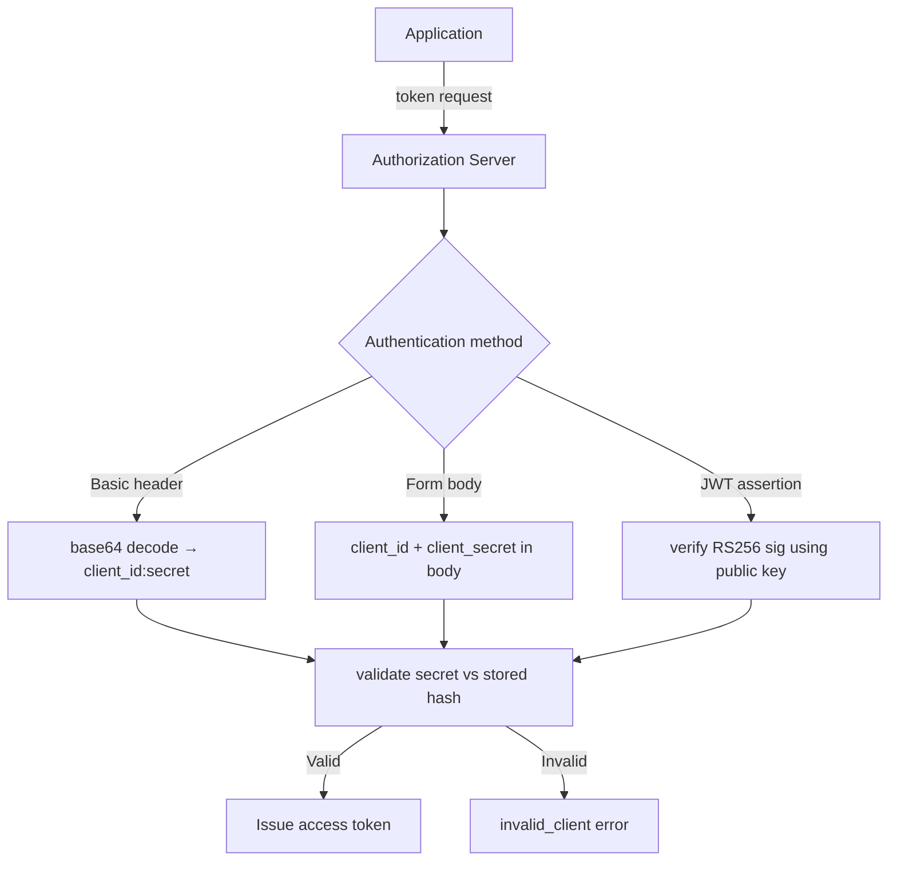
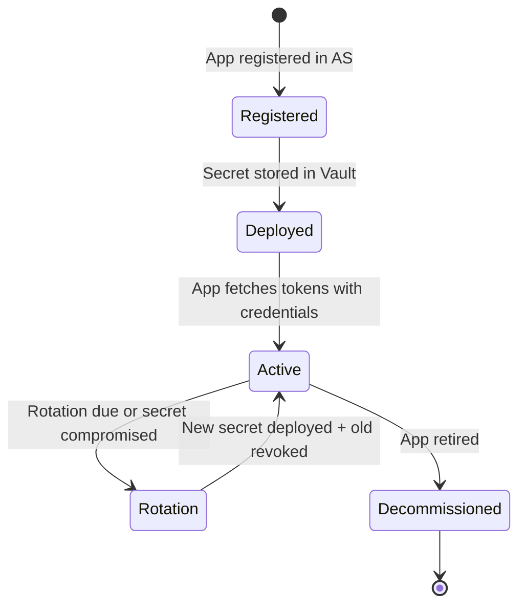

⚡ TL;DR - The client ID is the public identifier for an OAuth
2.0 application registered with an Authorization Server. The
client secret is the corresponding private credential that
proves the application's identity when exchanging tokens. Together
they are the application's "username and password" with the
Authorization Server. The client secret must never appear in
client-side code, URLs, or version control. Applications that
cannot keep secrets (SPAs, mobile apps) are "public clients"
and must not have a client secret - they use PKCE instead.

---

### 🔥 The Problem This Solves

**WORLD WITHOUT IT:**

Without application identity, any party that can observe a
valid OAuth callback could attempt to exchange the authorization
code. When a user approves access for App A, any other system
with the code could theoretically exchange it for tokens and
impersonate App A. There is no mechanism to verify that the code
is being redeemed by the legitimate application that initiated
the authorization.

**THE BREAKING POINT:**

An anonymous code exchange creates a free-for-all: any client
that captures an authorization code (from logs, referrer headers,
network intercepts) can exchange it for tokens. The Authorization
Server has no way to distinguish the legitimate app from an
impostor. Client credentials are the Authorization Server's
mechanism to verify: "You are the specific registered application
that this code was issued for."

**THE INVENTION MOMENT:**

The client_id + client_secret pair gives each registered
application a unique identity. The Authorization Server can tie
authorizations and tokens to specific clients, rate-limit per
client, revoke a specific application's access, and attribute
all API calls to the client that made them - without any of
this affecting other applications.

**EVOLUTION:**

RFC 6749 defined client_secret as the primary client
authentication method. In practice, static shared secrets create
a credential management burden: secrets must be distributed to
deployment environments, rotated periodically, and kept out of
version control. RFC 7523 introduced JWT client assertions as an
alternative: clients authenticate by presenting a signed JWT
(self-issued), eliminating the shared secret. RFC 8705 added
mTLS client authentication: the client's TLS certificate proves
its identity - no shared secret at all. Modern cloud environments
use Workload Identity Federation to eliminate client secrets
entirely at the infrastructure level.

---

### 📘 Textbook Definition

The client identifier (client_id, RFC 6749 §2.2) is a string
assigned by the authorization server during client registration
that identifies the specific client application. The client_id
is public - it appears in authorization request URLs and is not
a secret. The client secret (client_secret, RFC 6749 §2.3.1)
is a shared secret issued to confidential clients during
registration, used to authenticate the client at the token
endpoint. Confidential clients can maintain the secrecy of their
credentials (server-side applications). Public clients (SPAs,
mobile apps) cannot reliably protect secrets and must not be
issued client secrets; they use PKCE for code exchange integrity
instead.

---

### ⏱️ Understand It in 30 Seconds

**One line:**
Client ID identifies your app publicly; Client Secret proves
your app's identity privately at the token endpoint.

**One analogy:**

> Your app's client_id is its username on the Authorization
> Server. The client_secret is its password. When your app
> exchanges an authorization code for tokens, it logs in with
> username + password to prove it is the legitimate application.
> Unlike a user password, the client_secret is never typed by
> a human - it is stored in a secure secrets manager and
> presented programmatically.

**One insight:**
The critical conceptual distinction: client_id is like a bank
account number (public, visible, shareable) while client_secret
is like the PIN (private, never shared, rotated regularly). An
attacker who knows your client_id gains nothing - they also need
the secret. An attacker who knows your client_secret can
impersonate your application until the secret is rotated.

---

### 🔩 First Principles Explanation

**CORE INVARIANTS:**

1. The Authorization Server must be able to authenticate which
   application is making a token request - not just which user
   authorized it.

2. The client credential (secret or assertion) must be unknown to
   any party other than the client and the Authorization Server.

3. Applications running in environments where secrets cannot be
   protected (browser JavaScript, mobile app binaries) must not
   receive credentials that would be meaningless if exposed.

**DERIVED DESIGN:**

These invariants lead to the confidential/public client
distinction. Confidential clients (server-side code with a
protected execution environment) receive and use a client_secret.
Public clients (browser code, mobile apps, CLIs) cannot protect
secrets and therefore MUST NOT receive client_secrets. Instead,
they use PKCE - a mechanism that provides code exchange integrity
without requiring a persistent shared secret.

**THE CONFIDENTIAL/PUBLIC DIVIDE:**

```
Confidential client (server-side):
  - client_secret stored in environment variable or Vault
  - secret never in browser, never in mobile binary
  - secret transmitted only over HTTPS to token endpoint
  - secret rotation: operational task, coordinated deployment

Public client (SPA/mobile):
  - NO client_secret (any secret embedded is extractable)
  - Authenticates with PKCE (per-flow code verifier)
  - client_id IS public and safe to embed in browser code
  - Mitigation: redirect URI exact matching + PKCE
```

---

### 🧠 Mental Model / Analogy

> The client_id and client_secret are like a restaurant's
> supplier account. The supplier ID (client_id) is on every
> purchase order - public, visible to everyone who handles
> the order. The supplier password (client_secret) is entered
> when logging into the procurement portal to actually submit
> orders - private, stored in a secure password manager, never
> written on purchase orders. Anyone can see the supplier ID
> on an invoice; only the authorized supplier staff knows the
> password to act on it.

---

### 📶 Gradual Depth - Five Levels

**Level 1 - What it is (anyone can understand):**
When you register an app with Google, GitHub, or another OAuth
provider, you get two values: a client ID (like a username for
your app) and a client secret (like a password for your app).
You use both together when your server exchanges an authorization
code for an access token.

**Level 2 - How to use it (junior developer):**
Store client_id in your configuration (it's public). Store
client_secret in a secrets manager, environment variable, or
vault - NEVER in your source code or config files. Present
credentials as HTTP Basic auth: `Authorization: Basic
base64(client_id:client_secret)`. Never log the secret. Rotate
the secret by generating a new one in the Authorization Server's
console, deploying it to your application, then deactivating
the old one.

**Level 3 - How it works (mid-level engineer):**
At token exchange, the Authorization Server validates the
presented client credentials: (1) looks up the client_id,
(2) retrieves the stored secret hash, (3) compares the presented
secret against the hash using constant-time comparison (prevents
timing attacks), (4) if valid, proceeds with token issuance. The
client_secret is stored hashed at the Authorization Server (never
in plaintext) - exactly like a user password. If the Authorization
Server's credential store is breached, the hashed secrets provide
some protection against immediate exploitation (time to rotate).

**Level 4 - Why it was designed this way (senior/staff):**
Client authentication sits at an architectural tension point:
the Authorization Server needs to verify the client identity,
but static shared secrets are operationally painful and create
a persistent blast radius. JWT client assertions (RFC 7523) solve
this: the client generates an asymmetric key pair, registers the
public key with the Authorization Server, and at token time signs
a short-lived JWT with the private key. The Authorization Server
validates the signature using the registered public key. The
private key never leaves the client's environment; rotation is
just generating a new key pair. No shared secret exists to be
leaked. This is the production-mature pattern for all new systems.

**Level 5 - Mastery (distinguished engineer):**
The deepest client credential issue is the distinction between
client authentication and client authorization. Client credentials
prove IDENTITY (this is App A, not App B). They do not authorize
scope, token lifetime, or API access - those are configured in
the client registration, not in the credential. A compromised
client secret allows impersonating the app but is still bound by
the app's registered scope, allowed grant types, and allowed
redirect URIs. Defense in depth: limiting client scope and allowed
grant types limits what a stolen credential can accomplish.

---

### ⚙️ How It Works (Mechanism)

**Client credential presentation methods (RFC 6749 §2.3):**

```
┌───────────────────────────────────────────────────────┐
│     Client Authentication Methods Comparison          │
├───────────────────────────────────────────────────────┤
│                                                       │
│  Method 1: HTTP Basic Auth (RECOMMENDED)              │
│                                                       │
│  Authorization: Basic base64(client_id:client_secret) │
│                                                       │
│  base64("my-app:s3cr3t-v4lu3") = "bXktYXBwOn..."     │
│                                                       │
│  POST /token HTTP/1.1                                 │
│  Authorization: Basic bXktYXBwOn...                   │
│  Content-Type: application/x-www-form-urlencoded      │
│                                                       │
│  grant_type=authorization_code&code=abc123            │
│  &redirect_uri=https://app.example.com/callback       │
│                                                       │
│  Method 2: Form body (LESS PREFERRED)                 │
│                                                       │
│  POST /token HTTP/1.1                                 │
│  Content-Type: application/x-www-form-urlencoded      │
│                                                       │
│  grant_type=authorization_code&code=abc123            │
│  &client_id=my-app&client_secret=s3cr3t-v4lu3         │
│  &redirect_uri=https://app.example.com/callback       │
│  (credentials visible in body - risk if body logged)  │
│                                                       │
│  Method 3: JWT Client Assertion (RFC 7523, preferred) │
│                                                       │
│  POST /token HTTP/1.1                                 │
│  Content-Type: application/x-www-form-urlencoded      │
│                                                       │
│  grant_type=authorization_code&code=abc123            │
│  &client_assertion_type=urn:ietf:params:oauth:        │
│    client-assertion-type:jwt-bearer                   │
│  &client_assertion=eyJhbGciOiJSUzI1NiIs...           │
│  (signed JWT - no shared secret)                      │
└───────────────────────────────────────────────────────┘
```



**Client registration lifecycle:**

```
Registration → Issuance → Operational use → Rotation → Revocation

1. REGISTRATION (one-time, per environment):
   Developer registers app in AS admin console
   AS assigns: client_id (UUID or custom), client_secret (random)
   Developer configures: allowed scopes, redirect URIs,
     grant types, token TTL

2. ISSUANCE:
   AS returns client_id (always visible) + client_secret
   (shown ONCE - store immediately in secrets manager)
   Secret stored at AS as BCRYPT/Argon2 hash (never plaintext)

3. OPERATIONAL USE:
   App presents credentials at token endpoint only
   client_id in authorization request URL (safe, public)
   client_secret in HTTP header only (HTTPS encrypted)

4. ROTATION (periodic or on compromise):
   AS: generate new secret (old still valid during transition)
   Deploy new secret to app configuration
   Verify new secret works in production
   Revoke old secret in AS

5. REVOCATION:
   AS admin: deactivate client or revoke secret
   All NEW token requests fail immediately
   In-flight tokens expire per TTL
```

---

### 🔄 The Complete Picture - End-to-End Flow

**PUBLIC vs CONFIDENTIAL CLIENT COMPARISON:**

```
CONFIDENTIAL CLIENT (web application, backend service):
  Has: client_id + client_secret
  Exchange: POST /token with Basic auth header
  Secret stored: environment variable → secrets manager
  Rotation: planned maintenance window or zero-downtime rolling

PUBLIC CLIENT (SPA, mobile app, CLI):
  Has: client_id ONLY (no client_secret)
  Exchange: POST /token with PKCE code_verifier
  No secret to store or rotate
  Security: redirect URI exact match + PKCE verifier
  Why secure: PKCE binds exchange to specific flow without
    requiring a persistent shared secret
```

**WHAT CHANGES AT SCALE:**

Client credentials are used only at token issuance, not per API
request. In a microservices environment with 50 services each
refreshing tokens once per 15-minute TTL, the Authorization Server
handles ~200 client authentications per hour - negligible load.
Secret storage at the Authorization Server (hashed) scales with
client count, not request volume.

---

### 💻 Code Example

**Example 1 - BAD then GOOD: Secret storage and transmission:**

```javascript
// BAD: Client secret hardcoded in source code
// This appears in git history forever once committed,
// even if removed in a later commit.
const CLIENT_ID = 'my-spa-app';
const CLIENT_SECRET = 'hardcoded-secret-abc123'; // NEVER

async function exchangeCode(code) {
  return fetch('/token', {
    method: 'POST',
    body: `grant_type=authorization_code`
        + `&code=${code}`
        // Secret in URL or body if logged = exposed
        + `&client_secret=${CLIENT_SECRET}`,
  });
}

// EVEN WORSE: client secret in a SPA (browser code)
// Any user can open DevTools and read this:
const config = {
  clientId: 'app-123',
  clientSecret: 'secret-xyz', // visible to any user
};
```

```javascript
// GOOD: Secret from environment variable (server-side only)
// WHY: Environment variables are injected at runtime from
//   a secrets manager - not stored in source code.
//   Server-side only = never in browser bundle.

// Server-side Node.js (never runs in browser):
const clientId = process.env.OAUTH_CLIENT_ID;
const clientSecret = process.env.OAUTH_CLIENT_SECRET;
// Loaded from: AWS Secrets Manager / Vault / GCP Secret Manager

if (!clientId || !clientSecret) {
  throw new Error(
    'OAuth credentials not configured. '
    + 'Set OAUTH_CLIENT_ID and OAUTH_CLIENT_SECRET '
    + 'from secrets manager - never hardcode.'
  );
}

async function exchangeCode(code, redirectUri, codeVerifier) {
  // Basic auth header: credentials NOT in body
  const credentials = Buffer.from(
    `${clientId}:${clientSecret}`
  ).toString('base64');

  const response = await fetch(TOKEN_ENDPOINT, {
    method: 'POST',
    headers: {
      'Content-Type': 'application/x-www-form-urlencoded',
      // Credentials in Authorization header - NOT in body
      'Authorization': `Basic ${credentials}`,
      // Never log this header - redact in log config
    },
    body: new URLSearchParams({
      grant_type: 'authorization_code',
      code,
      redirect_uri: redirectUri,
      // code_verifier for PKCE (always include):
      code_verifier: codeVerifier,
    }),
  });

  return response.json();
  // WHAT BREAKS: Client secret rotated without updating
  //   env var → invalid_client until config updated
  // HOW TO TEST: Verify no secret in source, no secret
  //   in git log: git log -p | grep -i client_secret
}
```

**Example 2 - BAD then GOOD: Secret in logs:**

```python
# BAD: HTTP library debug logging with credentials
# python-requests debug mode logs Authorization headers
import logging
import requests

logging.basicConfig(level=logging.DEBUG)
# This logs the FULL Authorization: Basic header including
# the base64-encoded client_secret to stdout/log files

response = requests.post(
    'https://auth.example.com/token',
    auth=(CLIENT_ID, CLIENT_SECRET),  # appears in debug log
    data={'grant_type': 'client_credentials'},
)
```

```python
# GOOD: Credential-safe logging configuration
import logging
import httpx

# Configure HTTP logging to redact Authorization headers
class CredentialRedactingFilter(logging.Filter):
    SENSITIVE_HEADERS = {'authorization', 'x-api-key'}

    def filter(self, record):
        # Redact sensitive data from log messages
        msg = str(record.getMessage())
        for header in self.SENSITIVE_HEADERS:
            import re
            msg = re.sub(
                rf'(?i){header}:[^\r\n]+',
                f'{header.title()}: [REDACTED]',
                msg
            )
        record.msg = msg
        return True

# Apply filter to HTTP library loggers:
for logger_name in ['httpx', 'urllib3', 'requests']:
    logging.getLogger(logger_name).addFilter(
        CredentialRedactingFilter()
    )

# ALTERNATIVELY: Use transport-level logging that
# excludes headers:
transport = httpx.HTTPTransport(
    # Custom logging that excludes auth headers
)
# WHAT BREAKS: Redaction regex may miss log formats
#   from different HTTP clients; audit all loggers
# HOW TO TEST: Enable debug logging, make a token request,
#   grep logs for 'client_secret' - must find nothing
```

**Example 3 - Zero-downtime secret rotation:**

```bash
# Zero-downtime client secret rotation procedure
# Uses dual-credential window to avoid service interruption

# Step 1: Generate new secret in Authorization Server
# (most AS allow adding a new credential alongside old)
# New secret: "NEW_SECRET_VALUE"
# Old secret: "OLD_SECRET_VALUE"
# Both valid simultaneously for N minutes (transition window)

# Step 2: Deploy new secret to all service instances
# Using rolling deployment (one instance at a time):

# Instance A: Deploy with NEW_SECRET_VALUE
# Instance A: Verify token fetch with new secret works
# Observe: no 401/invalid_client errors in instance A

# Instance B: Deploy with NEW_SECRET_VALUE
# Verify same

# ... repeat for all instances

# Step 3: Revoke old secret in Authorization Server
# All instances now use new secret; old secret invalid
# Remaining in-flight tokens continue working (JWT TTL)

# Step 4: Verify revocation
curl -X POST https://auth.example.com/token \
  -H "Authorization: Basic $(echo -n 'client_id:OLD_SECRET' | base64)" \
  -d "grant_type=client_credentials"
# Expected: {"error":"invalid_client"}
# Confirms old secret is revoked

# TOTAL DOWNTIME: 0 (dual-credential transition window)
# KEY REQUIREMENT: Authorization Server must support
#   multiple active credentials per client (verify before
#   relying on this pattern)
```

---

### ⚖️ Comparison Table

| Auth Method | Secret Storage | Rotation | Zero Secret? | RFC | Best For |
|---|---|---|---|---|---|
| **client_secret** | Env var / Vault | Manual rotation, rolling deploy | No | RFC 6749 | Standard server-side apps |
| **JWT assertion (private key)** | Key in Vault / k8s secret | Key pair rotation | No (key stored) | RFC 7523 | Services needing no shared secret |
| **mTLS client certificate** | Cert + key in PKI | PKI-managed rotation | No (cert stored) | RFC 8705 | High-security, PKI infrastructure |
| **Workload Identity** | Platform-managed | Automatic (platform) | Yes | RFC 8693 | Cloud-native services |

How to choose: use client_secret for standard server-side
applications. Prefer JWT assertions in environments with key
management infrastructure. Use Workload Identity Federation in
cloud environments (GCP, AWS, Azure) for zero stored secrets.

---

### 🔁 Flow / Lifecycle

```
┌───────────────────────────────────────────────────────┐
│     Client Credential Lifecycle                       │
├───────────────────────────────────────────────────────┤
│                                                       │
│  [Registration]                                       │
│    App registered in AS admin console                 │
│    AS assigns client_id (public, permanent)           │
│    AS generates client_secret (private, rotatable)    │
│    AS stores: client_id → HASH(client_secret)         │
│                                                       │
│  [Initial Deploy]                                     │
│    client_id stored in app config (safe, public)      │
│    client_secret stored in secrets manager (Vault/AWS)│
│    App reads secret at startup from secrets manager   │
│                                                       │
│  [Operational Use]                                    │
│    client_id: in authorization request URL (public)   │
│    client_secret: in Authorization: Basic header only │
│    Secret never logged, never in URL params           │
│                                                       │
│  [Rotation (every 90-365 days or on compromise)]      │
│    AS: add new credential (dual-credential window)    │
│    Rolling deploy: update secret in all instances     │
│    AS: revoke old credential                          │
│    Verify revocation                                  │
│                                                       │
│  [Decommission]                                       │
│    AS: delete client registration                     │
│    All tokens from this client immediately invalid    │
│    (or expire per TTL for JWT tokens)                 │
└───────────────────────────────────────────────────────┘
```



---

### ⚠️ Common Misconceptions

| Misconception | Reality |
|---|---|
| The client_id is a secret and must be protected | client_id is PUBLIC. It appears in authorization request URLs and is visible to anyone who can observe the URL. Protecting it adds no security. Only client_secret is sensitive. |
| A SPA (React/Vue app) should have a client_secret | SPAs running in the browser cannot protect secrets - any secret embedded in JavaScript bundle is readable by any user. SPAs are public clients: they use PKCE, not client_secret. |
| Client credentials authenticate the user | Client credentials authenticate the APPLICATION (identify which OAuth client is making the request). User authentication is handled separately by the user's credentials at the authorization endpoint. |
| Long client secrets are always more secure | Secret length above the entropy threshold (~32 random characters) provides diminishing returns. A 64-char random secret is not meaningfully more secure than 32 chars. Storage security and rotation frequency matter more than length beyond a threshold. |
| Rotating the client secret revokes existing access tokens | Rotating the client secret only affects NEW token requests. In-flight JWT access tokens remain valid until their `exp` claim. Immediate revocation requires revoking the tokens directly or waiting for TTL expiry. |

---

### 🚨 Failure Modes & Diagnosis

**Client Secret in Version Control (Credential Leak)**

**Symptom:**
GitGuardian or similar scanner reports a detected client secret
in a Git repository. Even if the secret has been removed from
the current branch, it remains in Git history and is
permanently exposed.

**Root Cause:**
Developer hardcoded the client_secret in source code or
configuration file checked into Git. Committed: "Fixed config -
removed hardcoded secret" - but git log -p still shows the
original commit with the secret value.

**Diagnostic Command / Tool:**

```bash
# Scan git history for secrets (truffleHog):
trufflehog git file://. --only-verified

# Manual check: search all commits for client_secret:
git log -p --all | grep -i "client_secret\s*="

# Check currently tracked files:
grep -r "client_secret" . \
  --include="*.py" --include="*.js" --include="*.yaml" \
  --include="*.json" --include="*.env"

# .env files should be in .gitignore:
cat .gitignore | grep ".env"
# If not listed: add immediately and verify:
echo ".env" >> .gitignore
echo "*.env.local" >> .gitignore
```

**Fix:**
Rotate the secret immediately (the leaked secret is compromised).
Add `.env` files and config files containing secrets to
`.gitignore`. Use `git-filter-repo` to remove the secret from
Git history if the repository is not yet public. Configure
GitGuardian or similar to scan all future commits.

**Prevention:**
Never put credentials in source code, config files, or anywhere
tracked by version control. Use environment variables loaded
from a secrets manager at runtime. Add pre-commit hooks that
scan for secret patterns before committing.

---

**Client Secret in SPA JavaScript Bundle**

**Symptom:**
Security audit reveals the client_secret embedded in the
JavaScript bundle of a single-page application. Any user
who opens DevTools → Network → JS source can read the secret.

**Root Cause:**
Developer treated the SPA like a server-side app and included
client_secret in the React/Vue app configuration.

**Diagnostic Command / Tool:**

```bash
# Scan the built JavaScript bundle for secrets:
grep -r "client_secret" build/
grep -r "clientSecret" build/

# Check if secret appears in browser (DevTools method):
# Open browser DevTools → Sources
# Ctrl+F: search "client_secret" across all loaded scripts
# If found: critical security vulnerability

# Also check environment variable names in build output:
grep -r "REACT_APP_CLIENT_SECRET\|VUE_APP_CLIENT_SECRET" \
  build/ dist/
# Any REACT_APP_* env var is embedded in the bundle
```

**Fix:**
Remove client_secret from all frontend configuration immediately.
Rotate the exposed secret. Reconfigure the SPA as a public client:
register it with PKCE-only (no client_secret). The SPA uses PKCE
code_verifier/code_challenge for exchange integrity. For operations
that require a client secret (e.g., token exchange from a backend),
add a thin BFF (Backend for Frontend) service that holds the
secret server-side and proxies token requests from the SPA.

**Prevention:**
Public clients (SPAs, mobile apps) must never have a client
secret. Register them in the Authorization Server as "public"
clients with no secret configured. If the AS requires a secret
for exchange, use the BFF pattern.

---

### 🔗 Related Keywords

**Prerequisites (understand these first):**

- `OAuth 2.0 Roles` - client is one of the four roles; client
  credentials authenticate the Client role specifically
- `The Four Actors in Every OAuth Dance` - understanding which
  actors hold credentials and why

**Builds On This (learn these next):**

- `PKCE - Proof Key for Code Exchange` - the public client
  equivalent of client authentication; used instead of
  client_secret for SPAs and mobile apps
- `JWT Client Authentication (RFC 7523)` - replacing client
  secrets with signed JWTs for zero-shared-secret authentication
- `Client Registration` - the full set of metadata configured
  at registration time; credentials are one part

**Alternatives / Comparisons:**

- `mTLS Client Authentication (RFC 8705)` - TLS certificate-based
  client authentication; the PKI alternative to shared secrets
- `Workload Identity Federation` - platform-issued identity
  eliminating all stored client credentials

---

### 📌 Quick Reference Card

```
┌──────────────────────────────────────────────────────────┐
│ CLIENT_ID    │ PUBLIC identifier; safe in URLs, config,  │
│              │ browser code. Not a secret.               │
├──────────────┼───────────────────────────────────────────┤
│ CLIENT_SECRET│ PRIVATE credential for confidential       │
│              │ clients. Never in browser, logs, URLs,    │
│              │ or source control. Rotate periodically.   │
├──────────────┼───────────────────────────────────────────┤
│ PUBLIC CLIENT│ No client_secret (SPA, mobile, CLI).      │
│ (SPA/mobile) │ Use PKCE instead for code exchange.       │
├──────────────┼───────────────────────────────────────────┤
│ PRESENTATION │ HTTP Basic auth: base64(id:secret) in     │
│              │ Authorization header. NOT in URL or body. │
├──────────────┼───────────────────────────────────────────┤
│ STORAGE      │ client_id: env var or config file (safe)  │
│              │ client_secret: Vault, AWS/GCP Secrets Mgr │
├──────────────┼───────────────────────────────────────────┤
│ ROTATION     │ Generate new → dual window → deploy →     │
│              │ revoke old = zero-downtime rotation       │
├──────────────┼───────────────────────────────────────────┤
│ ANTI-PATTERN │ client_secret in SPA JavaScript bundle;   │
│              │ client_secret in source control           │
├──────────────┼───────────────────────────────────────────┤
│ ONE-LINER    │ "client_id = username (public);           │
│              │  client_secret = password (server-only)"  │
├──────────────┼───────────────────────────────────────────┤
│ NEXT EXPLORE │ PKCE → JWT Client Auth (RFC 7523)         │
└──────────────────────────────────────────────────────────┘
```

**If you remember only 3 things:**

1. client_id is public (safe in URLs, front-end code, logs).
   client_secret is private (only in server-side code, secrets
   manager, Authorization header on HTTPS). Never mix these up.

2. SPAs and mobile apps are public clients - they must NEVER
   have a client_secret. Use PKCE for code exchange integrity.
   Any client_secret in browser JavaScript is readable by all users.

3. Store client_secret in a secrets manager (Vault, AWS Secrets
   Manager, GCP Secret Manager) - not in environment variables
   committed to source control, not in config files, not hardcoded.

**Interview one-liner:**
"client_id is the app's public identifier - visible in every
authorization URL. client_secret is the app's private credential -
server-side only, stored in a secrets manager, presented as HTTP
Basic auth at the token endpoint, and never in browser code or
version control. SPAs are public clients with no client_secret;
they use PKCE instead. A leaked client_secret requires immediate
rotation and is bounded only by the token TTL for active sessions."

---

### 💎 Transferable Wisdom

**Reusable Engineering Principle:**
Credential confidentiality depends on the execution environment,
not the developer's intent. A secret embedded in code that runs
in an untrusted environment (browser, user-controlled device) is
not a secret regardless of how it is labeled or how carefully it
was intended to be protected. Design credential schemes with
the execution environment as the primary constraint.

**Where else this pattern appears:**

- **Database connection strings** - server-side only; a connection
  string in browser code is the same class of vulnerability as
  a client_secret in an SPA
- **API keys in mobile apps** - identical problem; any secret in
  a compiled binary is extractable; use backend proxy patterns
- **AWS credentials in Lambda environment variables** - safe
  (Lambda runs server-side, environment is isolated) vs
  credentials in S3 static website (browser-accessible, unsafe)

---

### 💡 The Surprising Truth

The public/confidential client distinction was one of the most
contentious design decisions in the OAuth 2.0 working group.
A faction argued that ALL clients should authenticate with
secrets; another argued that distinguishing by deployment
environment (can it keep a secret?) was the correct model.
The compromise: confidential clients authenticate; public clients
rely on redirect URI binding. The PKCE extension (RFC 7636,
2015) was later invented BECAUSE the "public clients rely on
redirect URI binding" turned out to be insufficient in practice
for mobile apps with custom URI scheme redirect vulnerabilities.
The original design's acknowledgment that "some clients cannot
keep secrets" was correct - but the compensating controls it
provided for public clients needed to be strengthened over time.
The lesson: security assumptions that depend on the client's
deployment environment must be supplemented by cryptographic
controls (PKCE) that do not depend on secrecy.

---

### ✅ Mastery Checklist

**You've mastered this when you can:**

1. **[EXPLAIN]** Explain to a new developer why embedding a
   client_secret in a React app is a critical vulnerability,
   with reference to the public client concept and PKCE as
   the correct alternative.

2. **[AUDIT]** Scan a codebase and configuration for improperly
   stored client secrets: check git history, environment variable
   files, build artifacts, and client registration type (public
   vs confidential).

3. **[ROTATE]** Design and execute a zero-downtime client secret
   rotation for a production service with 10 instances, using
   the dual-credential window pattern. Specify the exact steps,
   timing, and verification commands.

4. **[IMPLEMENT]** Implement a BFF (Backend for Frontend) pattern
   where a SPA's code-for-token exchange is proxied through a
   server-side endpoint that holds the client_secret - keeping
   the SPA as a public client while enabling server-side token
   exchange security.

5. **[MIGRATE]** Design the migration from client_secret to JWT
   client assertions (RFC 7523) for a service that currently uses
   client_secret stored in an environment variable. Identify the
   prerequisites (key pair generation, public key registration),
   transition steps, and rollback plan.

---

### 🧠 Think About This Before We Continue

**Q1.** A developer has built an Electron desktop app (cross-
platform desktop application using web technologies). Should this
app use client_secret or PKCE? Argue for both options and then
identify which is correct and why.

*Hint: Electron apps are NOT browser code - they run in a Node.js
environment with file system access. However, the binary is
distributed to end users' machines - it can be decompiled.
Both sides have merit; the correct answer depends on how the
secret is stored (if it's compiled in, it's not confidential)
versus if it's stored in the system keychain (OS-protected,
confidential). The RFC 8252 guidance for native apps recommends
PKCE as the safe default.*

**Q2.** A security incident reveals that a service's client_secret
was leaked 30 days ago. The secret has been used by an attacker
to fetch tokens. The service uses client credentials flow with
15-minute TTL tokens. What is the blast radius of the 30-day
exposure and what is the minimal set of actions required for
a complete remediation?

*Hint: Blast radius = everything the service's scope permits,
for 30 days continuously. Remediation: (1) rotate secret
immediately, (2) check AS audit logs for all tokens issued
with that client_id in the 30-day window, (3) identify all
API calls made with those tokens from non-service IP ranges,
(4) assess whether any accessed resources need remediation,
(5) post-incident review of secret storage and monitoring.*

---

### 🎯 Interview Deep-Dive

**Q1: Explain the difference between client_id and client_secret.
Which is public and which is private? What happens if each is
leaked?**

*Why they ask:* Tests fundamental credential hygiene knowledge;
candidates who confuse public/private identifiers are likely
to make security mistakes.

*Strong answer includes:*

- client_id: public, in every authorization URL, not sensitive,
  leaking it gives an attacker the application identifier only
- client_secret: private, server-side only, leaking allows an
  attacker to impersonate the application at the token endpoint
- Leaked client_id: no direct security impact (it is already public)
- Leaked client_secret: attacker can exchange codes and request
  tokens as the application until secret is rotated; rotation
  is the required response

**Q2: A developer builds a React SPA and includes a client_secret
in the app configuration. What is the vulnerability and how do
you fix it?**

*Why they ask:* Tests understanding of public vs confidential
clients and the SPA security model.

*Strong answer includes:*

- Any JavaScript in a SPA runs in the user's browser, readable
  via DevTools; client_secret is exposed to all users
- SPA is a public client: must use PKCE, not client_secret
- Fix: (1) rotate the exposed secret, (2) remove client_secret
  from SPA code entirely, (3) register the SPA as a public
  client in the AS, (4) implement PKCE for code exchange
- Alternative for operations requiring server-side secret:
  use BFF (Backend for Frontend) pattern - proxy token requests
  through a server-side endpoint

**Q3: How do you rotate a client_secret without any service
downtime?**

*Why they ask:* Tests operational knowledge of credential
rotation in live production systems.

*Strong answer includes:*

- Step 1: Check if AS supports dual credentials (two active
  secrets per client) - if not, coordination window required
- Step 2: Generate new secret in AS; both old and new are valid
- Step 3: Rolling deploy - update secret in deployment config
  (Vault, Kubernetes secret, env var), deploy one instance at
  a time and verify each instance authenticates successfully
  with new secret
- Step 4: Revoke old secret in AS after all instances updated
- Step 5: Verify revocation with a test request using old secret
- Zero downtime because both credentials valid during the
  rolling deploy window (dual-credential transition period)
