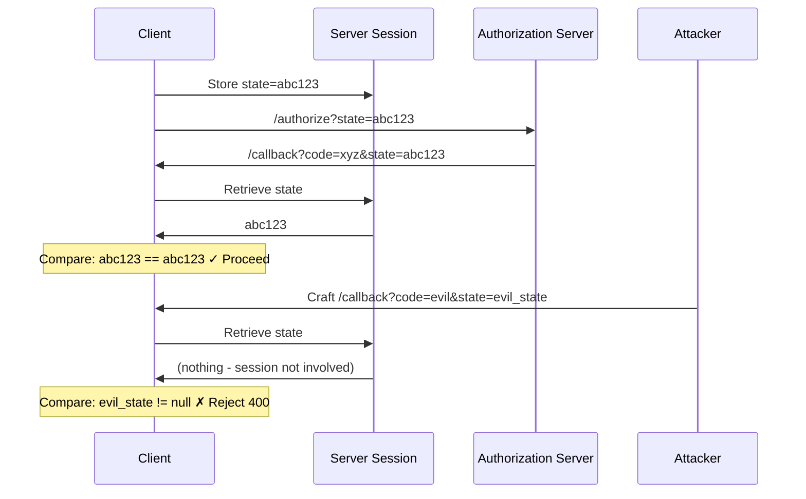
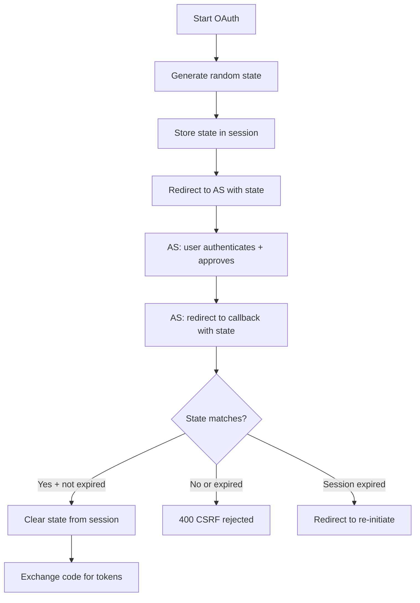

⚡ TL;DR - The state parameter is a cryptographically random
nonce sent in the OAuth authorization request and returned
unchanged in the authorization response. The client verifies
the returned state matches what it sent. This one comparison
prevents CSRF attacks on the OAuth callback - an attack where
an adversary tricks a victim into completing an OAuth flow
initiated by the attacker, binding the victim's session to
the attacker's authorization. State is also used to preserve
application context across the OAuth redirect round-trip.

---

### 🔥 The Problem This Solves

**WORLD WITHOUT IT:**

Without the state parameter, the OAuth callback endpoint
(`/oauth/callback`) will process any `code` parameter it
receives in a GET request. An attacker can: (1) initiate an
OAuth flow with their own account, (2) obtain the callback URL
containing a valid authorization code for their account,
(3) send that URL to a victim, (4) when the victim's browser
visits the URL (perhaps via an img tag or link), the victim's
session gets bound to the attacker's authorization code. The
result: the victim's account is linked to the attacker's
OAuth identity.

**THE BREAKING POINT:**

This attack - the OAuth CSRF attack - requires no user password
compromise. The attacker exploits the fact that the callback
endpoint accepts any code, regardless of whether the current
session initiated that OAuth flow. The victim unknowingly
completes an OAuth flow they never started.

**THE INVENTION MOMENT:**

The state parameter is a per-flow nonce that ties the callback
to a specific session's initiated authorization request. Before
redirecting to the Authorization Server, the client generates a
random state value and stores it in the session. When the
callback arrives, it compares the returned state to the stored
value. A mismatch means the callback was not initiated by this
session - CSRF detected, request rejected.

**EVOLUTION:**

RFC 6749 recommends state but does not mandate it. The OAuth
Security BCP (RFC 9700) mandates state for all flows that use
redirects. However, PKCE (RFC 7636) also provides some CSRF
protection for the code exchange phase - but state and PKCE
protect different phases and are both required per RFC 9700.

---

### 📘 Textbook Definition

The state parameter (RFC 6749 §4.1.1) is an opaque value used
by the client to maintain state between the authorization request
and the callback. The authorization server includes this value
when redirecting the user-agent back to the client. The parameter
should be used to prevent CSRF attacks by including a unique and
non-guessable value associated with each authentication request,
and by binding this value to the browser session. When the
callback is received, the client verifies that the state parameter
matches the value sent in the authorization request; if it does
not, the request must be rejected.

---

### ⏱️ Understand It in 30 Seconds

**One line:**
State is a random nonce you generate before the OAuth redirect,
verify upon return, and then discard - proving the callback
belongs to the same session that initiated the flow.

**One analogy:**

> State is like a "claim check" at a coat check counter. When
> you check your coat (start OAuth), you receive a unique ticket
> (state value). When you return to claim your coat (callback),
> you must present the same ticket. If someone presents your
> ticket without the coat check originating from your session,
> the attendant rejects it. An attacker who sends your claim
> check number to you is defeated because the ticket must match
> what the attendant recorded when YOUR coat was checked.

**One insight:**
State and PKCE protect different attack phases and are
complementary, not redundant. State prevents a CSRF attack
during the REDIRECT phase (attacker tricks victim into completing
a flow). PKCE prevents code injection during the EXCHANGE phase
(attacker steals the code and tries to exchange it). OAuth 2.1
requires both.

---

### 🔩 First Principles Explanation

**CORE INVARIANTS:**

1. The authorization callback must only be processed by the
   session that initiated the corresponding authorization request.

2. The state value must be unguessable to prevent an attacker
   from generating a valid state.

3. The state value must be bound to the specific browser session
   (stored server-side or in session storage, not URL or
   localStorage).

**DERIVED DESIGN:**

These invariants require: (1) a cryptographically random state
value (not sequential IDs, not timestamps), (2) stored in the
server-side session (so it cannot be read by the attacker),
(3) compared upon return using constant-time comparison (prevents
timing oracle attacks), (4) invalidated immediately after
verification (single-use: prevents replay).

**DUAL PURPOSE:**

State also carries application context across the OAuth
round-trip. Examples: the page the user was trying to visit
before being redirected to OAuth login, the specific action
they initiated, or any app-specific context needed after
authentication. This context is encoded in state so it survives
the browser redirect without being stored server-side.

---

### 🧠 Mental Model / Analogy

> State is a baton in a relay race. The first runner (your
> server generating the authorization request) passes the baton
> (state value) to the Authorization Server. The Authorization
> Server passes it back unchanged in the redirect. The second
> runner (your callback handler) must receive the EXACT same
> baton. If an adversary substitutes a different baton, the
> handoff is rejected. The baton is unique to this relay race
> instance - it is not reusable across races.

---

### 📶 Gradual Depth - Five Levels

**Level 1 - What it is (anyone can understand):**
State is a random code your app creates before starting the
OAuth login process. After the user logs in and is sent back
to your app, your app checks that the same code is returned.
If someone tried to trick the user into using a different code,
the mismatch is detected and the login is rejected.

**Level 2 - How to use it (junior developer):**
Before redirecting to `/authorize`, generate a cryptographically
random state value (`secrets.token_urlsafe(32)` in Python, or
`crypto.randomBytes(32).toString('hex')` in Node). Store it in
the user's session. Include `&state=<value>` in the authorization
URL. In the callback, compare `request.GET['state']` against
`session['oauth_state']` before doing anything else. If they
don't match: return 400 and clear the session. If they match:
proceed with code exchange.

**Level 3 - How it works (mid-level engineer):**
The state value transits two channels: (1) the authorization
request URL (from client to AS in the user's browser), (2) the
callback redirect URL (from AS back to client in the user's
browser). Both transit the front channel (browser, visible). The
stored state in the session is back-channel (server-side,
invisible to attacker). The comparison checks that the front-
channel value matches the back-channel value - which is only
true if the same server session initiated the request and is
processing the callback.

**Level 4 - Why it was designed this way (senior/staff):**
The state parameter is OAuth's adaptation of the standard CSRF
token pattern for redirect-based flows. In traditional CSRF
protection, a token in a hidden form field is compared to a
session-stored value. In OAuth, the redirect replaces the form
submission - the state parameter in the URL plays the role of
the hidden form field. The challenge unique to OAuth: the state
parameter is visible in the URL (unlike a hidden form field),
so it must be unguessable (cryptographically random) rather than
just secret. An attacker who can observe URLs but not the session
cannot forge a valid state-callback combination.

**Level 5 - Mastery (distinguished engineer):**
State can carry rich context by encoding a JSON payload instead
of a plain random string. The pattern: state = base64url(JSON)
where JSON includes the random nonce plus application context.
The random nonce provides CSRF protection; the context survives
the redirect. However, this pattern has a limitation: the state
value appears in the URL and in browser history - any context
embedded in state is visible to anyone who can observe the URL.
For sensitive context (user intent, partial form data), store
it server-side keyed by the random state value, and look it up
after state verification. The state parameter is the pointer;
the session is the storage.

---

### ⚙️ How It Works (Mechanism)

```
┌───────────────────────────────────────────────────────┐
│         State Parameter: CSRF Prevention              │
├───────────────────────────────────────────────────────┤
│                                                       │
│  LEGITIMATE FLOW:                                     │
│                                                       │
│  [Server] Generate: state = random_nonce()            │
│  [Server] Store: session['oauth_state'] = state       │
│  [Server] Redirect to:                                │
│    /authorize?...&state=abc123                        │
│                                                       │
│  [AS] User authenticates + approves                   │
│  [AS] Redirects to:                                   │
│    /callback?code=xyz&state=abc123                    │
│                                                       │
│  [Callback] state='abc123'                            │
│  [Session] oauth_state='abc123'                       │
│  [Check] 'abc123' == 'abc123' → MATCH → proceed       │
│                                                       │
│  CSRF ATTACK:                                         │
│                                                       │
│  [Attacker] Initiates OAuth, gets callback URL:       │
│    /callback?code=attacker_code&state=attacker_state  │
│  [Attacker] Sends this URL to victim (img tag, link)  │
│                                                       │
│  [Victim's browser] Visits:                           │
│    /callback?code=attacker_code&state=attacker_state  │
│                                                       │
│  [Callback] state='attacker_state'                    │
│  [Victim's Session] oauth_state = NOT SET             │
│  [Check] 'attacker_state' != '' → MISMATCH → 400      │
│                                                       │
│  Attack fails: victim session never initiated OAuth,  │
│  so it has no stored state to match the attacker's   │
└───────────────────────────────────────────────────────┘
```



**State as context carrier (dual-purpose pattern):**

```python
import json
import secrets
import base64

def create_state(return_path: str) -> str:
    """
    Encode CSRF nonce + app context into state.
    The nonce provides security; return_path provides UX.
    """
    payload = {
        'nonce': secrets.token_urlsafe(32),  # CSRF protection
        'return_to': return_path,  # where to go after auth
        # Note: return_to is visible in URL - don't store secrets
    }
    return base64.urlsafe_b64encode(
        json.dumps(payload).encode()
    ).decode()

def parse_state(state_value: str) -> dict:
    """Decode state payload - never trust without nonce verify."""
    try:
        return json.loads(
            base64.urlsafe_b64decode(state_value + '==')
        )
    except Exception:
        return {}

# In authorization initiation:
state = create_state(return_path='/dashboard/settings')
session['oauth_state'] = state  # store entire state string

# In callback:
stored = session.pop('oauth_state', None)
returned = request.args.get('state')
if not secrets.compare_digest(stored or '', returned or ''):
    return 400  # CSRF or session expiry
parsed = parse_state(returned)
# redirect to parsed['return_to'] after success
```

---

### 🔄 The Complete Picture - End-to-End Flow

**WHAT CHANGES AT SCALE:**

State is per-session, per-flow. At scale (many concurrent OAuth
flows), each active session has one pending state value stored
server-side. Session store load = one small record per pending
OAuth flow per user. State values should have a TTL matching the
maximum authorization flow window (typically 5-15 minutes); if
the user abandons the OAuth flow, the state entry expires
automatically.

**STATE STORAGE OPTIONS:**

```
Server-side session (RECOMMENDED):
  session['oauth_state'] = state_value
  - Not visible to client (attacker cannot read)
  - Requires sticky sessions or shared session store
    (Redis) in multi-instance deployments

sessionStorage (SPA alternative):
  sessionStorage.setItem('oauth_state', state_value)
  - JavaScript-accessible (XSS risk if injected script)
  - Cleared when tab closes (survives redirect, unlike
    localStorage which persists but is more exposed)
  - Acceptable for SPAs where server sessions are not used

localStorage (NOT RECOMMENDED):
  localStorage.setItem('oauth_state', state_value)
  - Persistent across sessions = higher XSS risk
  - If attacker injected script steals state before the
    OAuth flow, they can predict the state value
```

---

### 💻 Code Example

**Example 1 - BAD then GOOD: State generation and validation:**

```python
# BAD: No state parameter - CSRF vulnerability
# BAD: Predictable state (timestamp) - easy to forge
# BAD: State not verified in callback

def start_oauth(request):
    # WRONG: no state at all
    return redirect(f"{AS}/authorize?response_type=code"
                    f"&client_id={CLIENT_ID}")

def callback_no_state(request):
    code = request.GET.get('code')
    # No state verification: any code processed
    return exchange_code(code)

def start_oauth_predictable(request):
    # WRONG: predictable state - attacker can compute it
    state = str(int(time.time()))
    return redirect(f"{AS}/authorize?response_type=code"
                    f"&client_id={CLIENT_ID}&state={state}")
```

```python
# GOOD: Cryptographically random state, server-side storage,
# constant-time comparison, single-use invalidation

import secrets
from django.http import HttpResponseBadRequest

def start_oauth(request):
    # Cryptographically secure random nonce
    state = secrets.token_urlsafe(32)
    # Store server-side (not in cookie, not in URL)
    request.session['oauth_state'] = state
    # Set state expiry: max 10 minutes for the auth flow
    request.session['oauth_state_expires'] = (
        time.time() + 600
    )
    auth_url = (
        f"{AS_URL}/authorize"
        f"?response_type=code"
        f"&client_id={CLIENT_ID}"
        f"&redirect_uri={REDIRECT_URI}"
        f"&scope=openid+email"
        f"&state={state}"
    )
    return redirect(auth_url)

def oauth_callback(request):
    returned_state = request.GET.get('state', '')
    stored_state = request.session.get('oauth_state', '')
    state_expires = request.session.get(
        'oauth_state_expires', 0
    )

    # Always clear state - single-use, prevent replay
    request.session.pop('oauth_state', None)
    request.session.pop('oauth_state_expires', None)

    # Check expiry first (fail fast)
    if time.time() > state_expires:
        return HttpResponseBadRequest("OAuth flow expired")

    # Constant-time comparison (prevents timing oracle)
    if not secrets.compare_digest(returned_state, stored_state):
        # Log security event: possible CSRF attempt
        logger.warning(
            "OAuth state mismatch",
            extra={
                "returned": returned_state[:8] + "...",
                "session_id": request.session.session_key
            }
        )
        return HttpResponseBadRequest("Invalid OAuth state")

    # State verified: proceed with code exchange
    code = request.GET.get('code')
    return exchange_code_for_tokens(code)
    # WHAT BREAKS: Session expires between start and callback
    #   → stored_state is '' → mismatch → 400
    #   Handle: redirect user to re-initiate OAuth
    # HOW TO TEST: Submit callback with random state value;
    #   expect 400. Submit callback with correct state after
    #   session expiry; expect 400 (expired, not 200)
```

**Example 2 - State as context carrier for SPA:**

```javascript
// SPA implementation: state carries return path
// sessionStorage (cleared on tab close, survives redirect)

function initiateOAuth(returnPath) {
  const nonce = generateSecureRandom(32); // crypto.getRandomValues
  const state = btoa(JSON.stringify({
    nonce,
    returnPath,
    timestamp: Date.now(),
  }));

  // Store nonce server-side via API (or sessionStorage for SPA)
  sessionStorage.setItem('oauth_nonce', nonce);
  sessionStorage.setItem('oauth_state', state);
  // Limit state validity to 10 minutes
  sessionStorage.setItem(
    'oauth_state_expires',
    Date.now() + 10 * 60 * 1000
  );

  window.location.href =
    `${AS_URL}/authorize?response_type=code` +
    `&client_id=${CLIENT_ID}` +
    `&redirect_uri=${encodeURIComponent(REDIRECT_URI)}` +
    `&scope=openid+email` +
    `&code_challenge=${codeChallenge}` +
    `&code_challenge_method=S256` +
    `&state=${encodeURIComponent(state)}`;
}

function handleCallback(params) {
  const returnedState = params.get('state');
  const storedState = sessionStorage.getItem('oauth_state');
  const expires = parseInt(
    sessionStorage.getItem('oauth_state_expires') || '0'
  );

  sessionStorage.removeItem('oauth_nonce');
  sessionStorage.removeItem('oauth_state');
  sessionStorage.removeItem('oauth_state_expires');

  if (Date.now() > expires || returnedState !== storedState) {
    // CSRF or session expiry
    redirectToLogin();
    return;
  }

  const { returnPath } = JSON.parse(atob(returnedState));
  const code = params.get('code');

  exchangeCodeForTokens(code).then(() => {
    window.location.href = returnPath || '/';
  });
}
```

---

### ⚖️ Comparison Table

| CSRF Defense | Protects | Scope | Requirement |
|---|---|---|---|
| **State parameter** | OAuth callback binding | Authorization redirect flow | RFC 9700: mandatory |
| **PKCE** | Code exchange integrity | Token exchange step | RFC 9700: mandatory |
| **SameSite cookie** | Cookie-based CSRF | Same-site form submissions | Complement, not replacement for OAuth |
| **Double submit cookie** | Form-based CSRF | Web forms | Not applicable to OAuth redirects |

State and PKCE address different phases of the Authorization Code
Flow and are both required. Neither replaces the other.

---

### 🔁 Flow / Lifecycle

```
[Authorization Initiation]
  1. Generate cryptographically random state
  2. Store in server session (or sessionStorage for SPA)
  3. Include in /authorize URL
  4. Browser redirects user to Authorization Server

[At Authorization Server]
  5. AS includes state in callback redirect (verbatim)

[Callback Processing]
  6. Extract state from callback URL parameters
  7. Retrieve stored state from session
  8. Constant-time compare: must match exactly
  9. Mismatch: reject with 400, log security event
 10. Match: clear state from session (single-use)
 11. Proceed with code exchange

[State Expiry]
  12. If session expires before callback: state not found
      → Treat as expired flow, redirect to re-initiate
```



---

### ⚠️ Common Misconceptions

| Misconception | Reality |
|---|---|
| PKCE makes state redundant | PKCE and state protect different attack phases. PKCE protects the token exchange (code injection). State protects the callback binding (CSRF). OAuth 2.1 requires both. |
| A timestamp is an acceptable state value | Timestamps are predictable within seconds. An attacker who can observe when a user initiates OAuth can forge a valid state. State must be cryptographically random and unguessable. |
| State is optional for low-risk applications | CSRF attacks via OAuth have real consequences: account takeover if the attacker links their identity to the victim's session. There is no "low-risk" OAuth flow that makes CSRF irrelevant. |
| You can reuse the same state for multiple OAuth flows | State is single-use. After verification, it must be invalidated. Reuse enables replay attacks where an old callback URL is resubmitted to the callback endpoint. |
| Any random value works as state | State must be stored on the server side (not derived from client-observable values) and compared using constant-time comparison. Server-generated random values stored in session satisfy both requirements. |

---

### 🚨 Failure Modes & Diagnosis

**Missing State Validation (CSRF-Enabled Account Binding)**

**Symptom:**
Security audit demonstrates that an attacker can initiate an
OAuth flow with their own account and send the callback URL to
a victim. When the victim visits the callback URL, their account
is linked to the attacker's OAuth identity. The victim cannot
log out of the attacker's identity without the attack being
noticed.

**Root Cause:**
The callback handler does not verify the state parameter. Any
GET request to `/callback?code=...` is processed regardless
of whether the current session initiated the OAuth flow.

**Diagnostic Command / Tool:**

```bash
# Test: initiate OAuth, capture callback URL, visit as a
# different session (no stored state)

# Step 1: Initiate OAuth in one browser session
# Step 2: Capture the callback URL after AS redirect
# Step 3: Open incognito window (new session, no stored state)
# Step 4: Visit callback URL directly in incognito

# If the incognito session gets authenticated → CSRF vulnerable
# If the incognito session returns 400/error → protected

# Automated: use security test suite for OAuth:
# python oauth_csrf_test.py --client-id=CLIENT_ID \
#   --callback-url=https://app.example.com/callback
# Look for: "CSRF protection: MISSING" in output
```

**Fix:**
Generate a cryptographically random state before each OAuth
initiation, store it in the server session, and verify it in the
callback before processing the code. Clear state after verification
(single-use).

**Prevention:**
State verification is a security test, not just a correctness
test. Add automated tests that verify: (1) callback with no state
returns 400, (2) callback with wrong state returns 400, (3) same
state resubmitted twice returns 400 on second submission.

---

**Session Expired Before Callback (State Mismatch)**

**Symptom:**
Some users report that OAuth login fails with a "CSRF validation
error" or "invalid state" error during normal login flows, not
during any suspected attack.

**Root Cause:**
The user takes a long time at the Authorization Server (went away,
came back later). The session store expired the session (and its
stored state value) while the user was at the Authorization Server.
When the callback arrives, the stored state is gone - looks like
a CSRF attack but is actually a session timeout.

**Diagnostic Command / Tool:**

```bash
# Check session TTL vs typical OAuth flow duration:
# What is the session store TTL?
redis-cli ttl "session:SESSION_ID_FROM_LOG"
# If TTL is < 300s (5 minutes), sessions may expire during
# authorization flows on the Authorization Server

# Check the gap between oauth_state stored and callback:
# (from application logs)
grep "oauth_state stored" app.log | tail -100
grep "oauth_state verified\|state mismatch" app.log | tail -100
# Compare timestamps: large gaps → session TTL issue
```

**Fix:**
Ensure the session TTL is at least the maximum expected time for
an OAuth authorization flow (typically 10-15 minutes). Store
the state with an explicit TTL in the session (so it is treated
as an expired OAuth flow, not a CSRF attack), and provide a
user-friendly redirect to restart the OAuth flow when the state
is expired.

**Prevention:**
Distinguish between CSRF (no stored state, or active session
with mismatched state = security event) and session expiry
(stored state TTL expired = user experience issue, offer retry).
Different handling, different log severity.

---

### 🔗 Related Keywords

**Prerequisites (understand these first):**

- `Authorization Code Flow` - the flow where state is used and
  required; state is part of the callback mechanism
- `Redirect URI` - the destination where state is returned;
  the two parameters work together as CSRF protection

**Builds On This (learn these next):**

- `CSRF in OAuth and State Parameter Validation` - deep dive
  into the specific CSRF attack vectors that state prevents
- `PKCE - Proof Key for Code Exchange` - the complementary
  security control that protects the code exchange phase

---

### 📌 Quick Reference Card

```
┌──────────────────────────────────────────────────────────┐
│ WHAT IT IS   │ Cryptographic nonce that binds the OAuth  │
│              │ callback to the initiating session        │
├──────────────┼───────────────────────────────────────────┤
│ PROBLEM IT   │ CSRF: attacker tricks victim into         │
│ SOLVES       │ completing attacker-initiated OAuth flow  │
├──────────────┼───────────────────────────────────────────┤
│ KEY INSIGHT  │ State and PKCE protect different phases:  │
│              │ state = callback binding (CSRF);          │
│              │ PKCE = code exchange (injection)          │
├──────────────┼───────────────────────────────────────────┤
│ GENERATE     │ secrets.token_urlsafe(32) - crypto random │
│ STORE        │ Server-side session (not cookie/URL)      │
│ VERIFY       │ constant-time comparison (timing-safe)    │
│ INVALIDATE   │ Immediately after verification (single-use│
├──────────────┼───────────────────────────────────────────┤
│ ANTI-PATTERN │ No state → CSRF vulnerable                │
│              │ Predictable state → forgeable             │
│              │ State in URL/localStorage → exposed       │
├──────────────┼───────────────────────────────────────────┤
│ ONE-LINER    │ "Random nonce in, same nonce back, or     │
│              │  reject - the OAuth CSRF token"           │
├──────────────┼───────────────────────────────────────────┤
│ NEXT EXPLORE │ PKCE → CSRF in OAuth (OAU-038)            │
└──────────────────────────────────────────────────────────┘
```

**If you remember only 3 things:**

1. State is a cryptographically random nonce, NOT a sequential ID
   or timestamp. It must be unguessable by an attacker who can
   observe request timing.

2. State is stored server-side (in session), never in cookies,
   localStorage, or URL parameters. The server-side storage is
   what prevents the attacker from forging a matching state.

3. State and PKCE are both required - they protect different
   phases. State: callback binding (CSRF). PKCE: code exchange
   (injection). Neither replaces the other.

**Interview one-liner:**
"State is OAuth's CSRF token for the redirect flow: generate
a cryptographically random value before the authorization redirect,
store it server-side, and verify it matches in the callback.
A mismatch means the callback was not initiated by this session.
PKCE and state address different attack phases and are both
required by OAuth 2.1."

---

### 💡 The Surprising Truth

The RFC 6749 specification uses the word "should" (not "must")
for the state parameter - meaning it is a recommendation, not
a requirement. The consequence: many early OAuth implementations
shipped without state, and the resulting CSRF vulnerability in
OAuth 2.0 implementations was documented in security research
papers as an active attack vector. The OAuth Security Workshop
in 2016 found a significant proportion of real-world OAuth
deployments missing state validation. The OAuth Security BCP
(RFC 9700, final 2025) upgraded state from SHOULD to effectively
MUST - but by then, a decade of deployed code existed without it.
This is an example of how underspecified security recommendations
in standards produce real-world vulnerabilities that take years
to remediate.

---

### ✅ Mastery Checklist

**You've mastered this when you can:**

1. **[EXPLAIN]** Describe the exact CSRF attack that state
   prevents, including the specific sequence of requests an
   attacker would make and what outcome they achieve without
   state verification.

2. **[IMPLEMENT]** Implement state generation, storage, and
   verification in a web framework of your choice, including
   constant-time comparison, expiry check, and single-use
   invalidation.

3. **[DEBUG]** Users report intermittent "state mismatch" errors
   during normal login. Distinguish between CSRF attack indicators
   and session-expiry-driven false positives, and propose
   different handling for each case.

4. **[EXPLAIN]** Explain to a developer who proposes removing state
   because "we have PKCE" why this is incorrect, with specific
   reference to what phase each mechanism protects.

---

### 🧠 Think About This Before We Continue

**Q1.** A developer stores the state value in a cookie
(`document.cookie = 'oauth_state=...'`) instead of the server
session. Evaluate whether this provides the same CSRF protection
as server-session storage. What attack scenario does this enable
or prevent?

*Hint: A cookie is transmitted with every same-origin request,
but an attacker initiating a CSRF from a different domain cannot
read the victim's cookies. Cookie-based state storage provides
CSRF protection IF the cookie is HttpOnly and SameSite=Strict.
However, if the cookie is readable via JavaScript (not HttpOnly),
an XSS attacker can steal the state value.*

**Q2.** An application uses state to carry a return URL after
OAuth login (state = base64(JSON({nonce, returnTo}))). A security
researcher reports that they can inject a redirect by base64-
encoding `{"nonce": "...", "returnTo": "https://evil.com"}` and
crafting a fake callback with this state. Evaluate: does this
require CSRF protection to bypass? What prevents this?

*Hint: The crafted state must also match the stored state in the
session. Since state is server-session-stored, the attacker cannot
know what the current session's stored state is - they cannot
forge a matching callback. The nonce in the JSON payload provides
the same CSRF protection as a plain random state string.*

---

### 🎯 Interview Deep-Dive

**Q1: What is the OAuth CSRF attack, how does the state parameter
prevent it, and how does it differ from what PKCE provides?**

*Why they ask:* Tests understanding of the two complementary
OAuth security controls and the specific attacks each prevents.

*Strong answer includes:*

- OAuth CSRF: attacker initiates flow, sends callback URL to
  victim; victim's session becomes bound to attacker's authorization
- State prevents this: stored state in victim's session does not
  match attacker's callback → 400 rejection
- PKCE prevents different attack: code interception in transit;
  attacker who steals code cannot exchange it without code_verifier
- Both required: state = redirect binding (session correlation);
  PKCE = exchange binding (cryptographic proof)
- OAuth 2.1 mandates both; they are complementary, not redundant

**Q2: Walk through the exact state parameter handling code for
an Authorization Code Flow callback, noting the security
properties of each step.**

*Why they ask:* Tests ability to implement security controls
correctly, not just describe them.

*Strong answer covers:*

- Retrieve state from callback URL parameter
- Retrieve stored state from server-side session
- Clear stored state immediately (before comparison) - single-use
- Check state expiry (separate TTL stored with state)
- Constant-time comparison (prevents timing oracle)
- On mismatch: log security event, return 400 (not redirect)
- On match: proceed with code exchange
