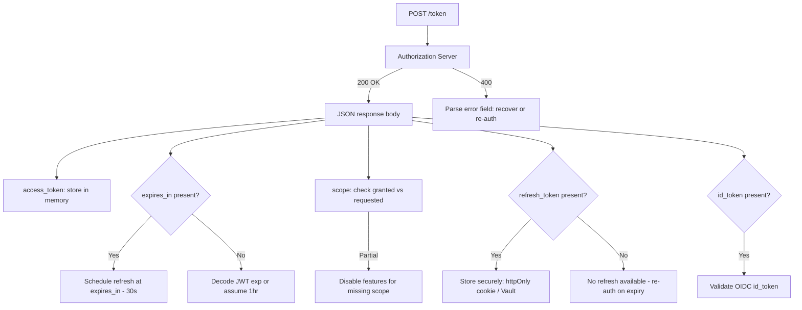

⚡ TL;DR - The token response is the JSON object returned by the
Authorization Server's token endpoint after a successful token
request. It always includes `access_token` and `token_type`
(always "Bearer"). It usually includes `expires_in` (seconds
until expiry) and optionally `refresh_token` and `scope`. OIDC
adds `id_token`. Every field has a specific purpose; the `scope`
field is the authoritative record of what was actually granted
(which may be narrower than what was requested).

---

### 🔥 The Problem This Solves

**WORLD WITHOUT IT:**

Without a standardized token response structure, each OAuth
provider returns tokens in a different format, requiring custom
client code per provider. The client has no standard way to know
when the token expires, whether a refresh token was issued, or
what scope was actually granted. Token expiry becomes a runtime
discovery (test the API, get 401) rather than a planned handoff
(schedule refresh before `expires_in` seconds pass).

**THE INVENTION MOMENT:**

RFC 6749 §5.1 standardized the token response format. The
structure is minimal by design: `access_token` and `token_type`
are required; everything else is optional but recommended. This
minimalism allows the same response format to work for all grant
types (Authorization Code, Client Credentials, Device) with
grant-type-specific additions (OIDC's `id_token`) layered on top.

---

### 📘 Textbook Definition

The token endpoint response (RFC 6749 §5.1) is a JSON object
returned in response to a successful token request. Required
fields: `access_token` (the issued access token string),
`token_type` (the token type - always "Bearer" for OAuth 2.0
bearer tokens). Recommended fields: `expires_in` (seconds until
the access token expires), `refresh_token` (a refresh token if
applicable), `scope` (the actual granted scope, which may differ
from the requested scope). OIDC adds `id_token` (a signed JWT
containing identity claims about the authenticated user). The
response must be sent with `Cache-Control: no-store` and
`Pragma: no-cache` HTTP headers to prevent token caching in
HTTP intermediaries.

---

### ⏱️ Understand It in 30 Seconds

**One line:**
The token endpoint returns a JSON object with the access token,
its type ("Bearer"), how long it lasts, an optional refresh
token, and the actual granted scope.

**One insight:**
The three most commonly missed fields: (1) `scope` - ALWAYS check
this; the granted scope may be narrower than requested and your
app must adapt; (2) `expires_in` - use this to schedule token
refresh proactively, not reactively (don't wait for 401); (3)
`refresh_token` - not always returned; presence depends on grant
type and Authorization Server configuration.

---

### ⚙️ How It Works (Mechanism)

**Complete token response with all fields:**

```json
HTTP/1.1 200 OK
Content-Type: application/json;charset=UTF-8
Cache-Control: no-store
Pragma: no-cache

{
  "access_token": "eyJhbGciOiJSUzI1NiIsInR5cCI6ImF0K...",
  "token_type": "Bearer",
  "expires_in": 3600,
  "refresh_token": "8xLOxBtZp8",
  "scope": "read:contacts email",
  "id_token": "eyJhbGciOiJSUzI1NiIsImtpZCI6..."
}
```

**Field-by-field breakdown:**

```
┌───────────────────────────────────────────────────────┐
│     Token Response Fields                             │
├────────────────┬──────────────────────────────────────┤
│ access_token   │ REQUIRED. The token to include in    │
│                │ Authorization: Bearer <token>. Can be│
│                │ opaque string or JWT. Present in     │
│                │ every successful response.           │
├────────────────┼──────────────────────────────────────┤
│ token_type     │ REQUIRED. Always "Bearer" for OAuth  │
│                │ 2.0 standard flows. Case-insensitive.│
├────────────────┼──────────────────────────────────────┤
│ expires_in     │ RECOMMENDED. Seconds until the       │
│                │ access_token expires. Use to schedule│
│                │ proactive refresh. If absent: treat  │
│                │ token as short-lived (decode JWT exp │
│                │ claim directly).                     │
├────────────────┼──────────────────────────────────────┤
│ refresh_token  │ OPTIONAL. Long-lived token for       │
│                │ obtaining new access tokens. Absent  │
│                │ in: Client Credentials flow (no user │
│                │ context), and some AS configs. Store │
│                │ securely (httpOnly cookie or Vault). │
├────────────────┼──────────────────────────────────────┤
│ scope          │ RECOMMENDED. The ACTUAL granted scope│
│                │ (may be narrower than requested).    │
│                │ Space-delimited. ALWAYS check this   │
│                │ field after token exchange.          │
├────────────────┼──────────────────────────────────────┤
│ id_token       │ OIDC ONLY. Signed JWT with user      │
│                │ identity claims (sub, name, email,   │
│                │ iss, aud, exp, iat, nonce). Present  │
│                │ only when openid scope was requested.│
└────────────────┴──────────────────────────────────────┘
```

**Token response per grant type:**

```
Authorization Code Flow:
  access_token: YES (always)
  refresh_token: YES (typically - AS-configured)
  id_token: YES (if openid scope requested)

Client Credentials Flow:
  access_token: YES (always)
  refresh_token: NO (no user context - no refresh)
  id_token: NO (no user identity - no OIDC)

Device Authorization Flow:
  access_token: YES (always)
  refresh_token: YES (typically)
  id_token: YES (if openid scope requested)

Refresh Token Exchange:
  access_token: YES (new token)
  refresh_token: MAYBE (rotation: new refresh token issued,
                        old one invalidated; depends on config)
  id_token: MAYBE (if openid scope still active)
```

**HTTP response headers (security-critical):**

```http
HTTP/1.1 200 OK
Content-Type: application/json
Cache-Control: no-store
Pragma: no-cache

WHY Cache-Control: no-store:
  Prevents HTTP caches (CDN, proxy, browser) from storing
  the token response. A cached token response is
  effectively a leaked token - the cache holder has
  the access_token without authorization.

  If absent: a shared proxy between client and AS could
  cache the response and serve it to subsequent requests
  (not just the requesting client).
```

---

### 💻 Code Example

**Example 1 - BAD then GOOD: Processing token response:**

```python
# BAD: Ignores scope and expires_in fields
# Assumes requested scope was granted.
# Waits for 401 to discover expiry (reactive).
def process_token_response(response_json):
    access_token = response_json['access_token']
    refresh_token = response_json.get('refresh_token')
    # WRONG: doesn't check granted scope
    # WRONG: doesn't schedule proactive refresh
    return access_token, refresh_token
```

```python
# GOOD: Process all fields, verify scope, schedule refresh
# WHY: Granted scope may be less than requested.
#   Proactive refresh prevents API call failures.
import time
from dataclasses import dataclass
from typing import Optional

@dataclass
class TokenSet:
    access_token: str
    token_type: str
    expires_at: float        # unix timestamp
    granted_scope: set       # actual granted scope
    refresh_token: Optional[str]
    id_token: Optional[str]

def process_token_response(
    response_json: dict,
    requested_scope: set
) -> TokenSet:
    required = {'access_token', 'token_type'}
    missing = required - response_json.keys()
    if missing:
        raise ValueError(f"Missing required fields: {missing}")

    # expires_at: use expires_in if present, else decode JWT
    if 'expires_in' in response_json:
        expires_at = time.time() + response_json['expires_in']
    elif response_json['access_token'].startswith('eyJ'):
        # JWT: decode exp claim
        import base64, json
        payload = response_json['access_token'].split('.')[1]
        pad = 4 - len(payload) % 4
        data = json.loads(
            base64.urlsafe_b64decode(payload + '='*pad)
        )
        expires_at = float(data.get('exp', time.time() + 3600))
    else:
        # Opaque token without expires_in: assume 1 hour
        expires_at = time.time() + 3600

    # Check granted scope vs requested scope
    scope_str = response_json.get('scope', '')
    granted_scope = set(scope_str.split()) if scope_str else set()

    missing_scopes = requested_scope - granted_scope
    if missing_scopes:
        # Log warning - app must handle missing scopes gracefully
        import logging
        logging.warning(
            "Scope partially granted. Missing: %s",
            missing_scopes
        )
        # Don't raise: adapt app behavior to granted scopes

    return TokenSet(
        access_token=response_json['access_token'],
        token_type=response_json['token_type'],
        expires_at=expires_at,
        granted_scope=granted_scope,
        refresh_token=response_json.get('refresh_token'),
        id_token=response_json.get('id_token'),
    )

def should_refresh(token_set: TokenSet) -> bool:
    # Proactive refresh: 30-second buffer before expiry
    return time.time() > token_set.expires_at - 30
    # WHAT BREAKS: expires_in absent + opaque token →
    #   assumed 1 hour; may over- or under-refresh
    # HOW TO TEST: Mock AS to return scope=read:contacts
    #   when write:contacts was requested; verify
    #   missing_scopes warning is logged
```

**Example 2 - Token response from different grant types:**

```python
# Authorization Code Flow response (full):
auth_code_response = {
    "access_token": "eyJhbGciOiJSUzI1NiIs...",
    "token_type": "Bearer",
    "expires_in": 3600,
    "refresh_token": "def50200abcdef...",  # present
    "scope": "openid email read:contacts",
    "id_token": "eyJhbGciOiJSUzI1NiIs...",  # OIDC
}

# Client Credentials Flow response (minimal):
client_credentials_response = {
    "access_token": "eyJhbGciOiJSUzI1NiIs...",
    "token_type": "Bearer",
    "expires_in": 900,
    # NO refresh_token (no user context in M2M flow)
    # NO id_token (no OIDC in M2M flow)
    "scope": "payment:process inventory:read",
}

# Refresh token exchange (may rotate refresh token):
refresh_response = {
    "access_token": "eyJhbGciOiJSUzI1NiIs...",  # new
    "token_type": "Bearer",
    "expires_in": 3600,
    "refresh_token": "ghi789...",  # NEW token (rotated)
    # OLD refresh token is now invalid
    "scope": "openid email read:contacts",
}
# CRITICAL: On refresh token rotation, you MUST store the
# NEW refresh token and discard the old one immediately.
# Two clients using the same refresh_token simultaneously
# triggers token reuse detection → both tokens revoked.
```

---

### ⚖️ Comparison Table

| Field | Required? | When Absent | Critical Action |
|---|---|---|---|
| `access_token` | Yes | Error - invalid response | Raise exception |
| `token_type` | Yes | Error - invalid response | Raise exception |
| `expires_in` | Recommended | Decode JWT exp, or assume 1hr | Schedule refresh manually |
| `refresh_token` | Optional | Not all grants issue one | Check before assuming longevity |
| `scope` | Recommended | Assume full requested scope (risky) | Always check and adapt |
| `id_token` | OIDC only | OIDC scope not requested | No action needed |

---

### 🔁 Flow / Lifecycle

```
[Token Request Sent]
  POST /token with grant + credentials

[Successful Response (200 OK)]
  Process JSON body:
    1. Extract access_token → store in memory
    2. Check token_type = "Bearer"
    3. Parse expires_in → schedule refresh at expires_in - 30s
    4. Check scope → compare to requested → adapt if partial
    5. Store refresh_token securely (httpOnly cookie or Vault)
    6. Validate id_token (if OIDC) → extract user identity

[Error Response (400/401)]
  Parse error field:
    invalid_client → config error, not recoverable by retry
    invalid_grant → code expired or replayed, re-authorize
    unsupported_grant_type → config error
    invalid_scope → requested scope not registered for client
```



---

### ⚠️ Common Misconceptions

| Misconception | Reality |
|---|---|
| The scope field always matches the requested scope | The Authorization Server may grant a narrower scope. Always parse `token_response.scope` and adapt app behavior. Assuming full scope is a bug, not just a missed optimization. |
| `expires_in` is the refresh_token TTL | `expires_in` is the ACCESS token TTL. The refresh token TTL is not returned in the standard response (it varies by AS configuration, often days to months). |
| A missing `refresh_token` means something went wrong | Refresh tokens are optional. Client Credentials flows never return a refresh token. Some AS configurations omit them for Authorization Code flow too. |
| Caching the token response is acceptable for performance | RFC 6749 requires `Cache-Control: no-store`. Caching the token response means a cache server holds the access token - a token leak. Never cache token responses at any intermediary. |

---

### 🚨 Failure Modes & Diagnosis

**Assuming Full Scope Was Granted**

**Symptom:**
Users report that the app sometimes fails to edit contacts after
authorizing. Investigation shows the app always attempts write
operations but sometimes the token only has `read:contacts`
scope (user unchecked write permission on consent screen).

**Root Cause:**
The app does not check `token_response.scope` after token
exchange. It assumes the full requested scope (`read:contacts
write:contacts`) was always granted. When a user unchecks write
permission, the app gets `read:contacts` only - but doesn't know.

**Fix:**

```python
# Parse scope after token exchange:
scope_field = token_response.get('scope', '')
granted = set(scope_field.split())
if 'write:contacts' not in granted:
    disable_contact_editing()
    show_message("Edit permissions not granted. "
                 "Re-authorize to enable editing.")
```

---

**Missing expires_in (No Proactive Refresh)**

**Symptom:**
Users experience silent API failures after long sessions. Logs
show 401 responses that are not immediately retried. Investigation
shows the app waits for 401s to discover token expiry, causing
one failed request per expiry cycle.

**Root Cause:**
`expires_in` not processed. No refresh scheduled. API failure
is the signal for expired token.

**Fix:**
Always parse `expires_in`. Schedule a background refresh at
`expires_in - 30` seconds. For JWT tokens, decode the `exp`
claim if `expires_in` is absent.

---

### 🔗 Related Keywords

**Prerequisites:**
- `Access Token` - what the access_token field contains
- `Bearer Token` - the token_type value and what it means

**Builds On:**
- `Refresh Token` - the refresh_token field and its lifecycle
- `JWT Access Tokens (RFC 9068)` - when the access_token is a JWT

---

### 📌 Quick Reference Card

```
┌──────────────────────────────────────────────────────────┐
│ REQUIRED     │ access_token, token_type (always "Bearer")│
├──────────────┼───────────────────────────────────────────┤
│ RECOMMENDED  │ expires_in (seconds), scope (granted)     │
├──────────────┼───────────────────────────────────────────┤
│ OPTIONAL     │ refresh_token (not in Client Credentials) │
│              │ id_token (OIDC only, when openid scope)   │
├──────────────┼───────────────────────────────────────────┤
│ CRITICAL     │ scope field = ACTUAL granted scope;       │
│ CHECK        │ always verify, it may be less than asked  │
├──────────────┼───────────────────────────────────────────┤
│ CACHE HEADER │ Cache-Control: no-store (mandatory)       │
│              │ Token in HTTP cache = token leak          │
├──────────────┼───────────────────────────────────────────┤
│ REFRESH TTL  │ NOT in response - AS-configured; varies   │
│              │ (days to months). expires_in = ACCESS TTL │
├──────────────┼───────────────────────────────────────────┤
│ ONE-LINER    │ "access_token is what you use; expires_in │
│              │  is when to refresh; scope is what you got│
└──────────────────────────────────────────────────────────┘
```

**If you remember only 3 things:**

1. Always check the `scope` field - the granted scope may be
   narrower than what was requested. Adapt the app accordingly.

2. Use `expires_in` to schedule proactive token refresh (30 seconds
   before expiry), not reactive refresh (on 401 from the API).

3. `refresh_token` is optional and absent in Client Credentials
   flow. `id_token` is OIDC only (when `openid` scope was requested).

**Interview one-liner:**
"The token response JSON always has access_token and token_type
(Bearer). expires_in schedules proactive refresh. scope is the
authoritative granted scope - never assume it matches what was
requested. refresh_token is optional (absent in Client Credentials).
id_token is OIDC-only. Cache-Control: no-store prevents token
caching at HTTP intermediaries."

---

### ✅ Mastery Checklist

**You've mastered this when you can:**

1. **[PARSE]** Write a complete token response parser that
   handles all fields, detects missing required fields, checks
   granted scope against requested, and schedules proactive
   refresh using expires_in.

2. **[DEBUG]** An app reports intermittent scope failures. Using
   token response logs, identify whether the issue is: (a) scope
   narrowing by user at consent, (b) AS configuration narrowing
   scope, or (c) app not requesting the required scope.

3. **[EXPLAIN]** Explain why RFC 6749 requires `Cache-Control:
   no-store` on token responses and what specific attack a cached
   token response enables.

---

### 🧠 Think About This Before We Continue

**Q1.** A token response does not include `expires_in` and the
access token is opaque (not a JWT). How do you determine when
to refresh? What are the trade-offs of each approach?

*Hint: Options: (1) attempt the API call, catch 401, then
refresh (reactive - one failed call per expiry); (2) assume
a fixed TTL (e.g., 1 hour) - risk of over-refreshing or using
expired token; (3) call the introspection endpoint before each
call to check expiry (expensive - introspection has latency).
The spec recommends that AS always include expires_in to avoid
this problem.*

---

### 🎯 Interview Deep-Dive

**Q1: What fields does a token response contain, which are
required vs optional, and what should a client do when the
scope field indicates less scope than was requested?**

*Why they ask:* Tests understanding of the token response
contract and handling partial authorization.

*Strong answer includes:*

- Required: access_token, token_type ("Bearer")
- Recommended: expires_in, scope
- Optional: refresh_token (grant-dependent), id_token (OIDC)
- Partial scope: parse granted scope from response, compare
  to requested scope, disable features requiring missing scopes,
  optionally notify user what permissions were not granted
- Never assume full scope: if user unchecked write:contacts,
  the token only has read:contacts - app must adapt gracefully

**Q2: A client application refreshes its access token by calling
the token endpoint with a refresh_token. The response includes a
new refresh_token value (different from the one it sent). What
should the client do and why?**

*Why they ask:* Tests understanding of refresh token rotation -
a common production issue.

*Strong answer includes:*

- Store the NEW refresh_token immediately, discarding the old one
- This is refresh token rotation (security feature): old token
  invalidated, new token issued on every refresh
- Why: if old refresh token is compromised and used by attacker,
  the legitimate client gets a new one; when attacker tries to
  use old token, AS detects reuse → revokes all tokens (detects
  theft)
- Failure: storing old token and discarding new one means the
  app loses session after one refresh cycle
