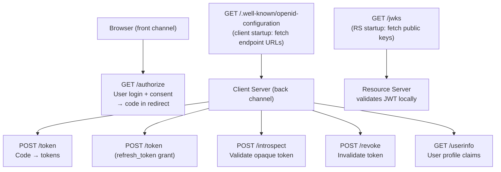
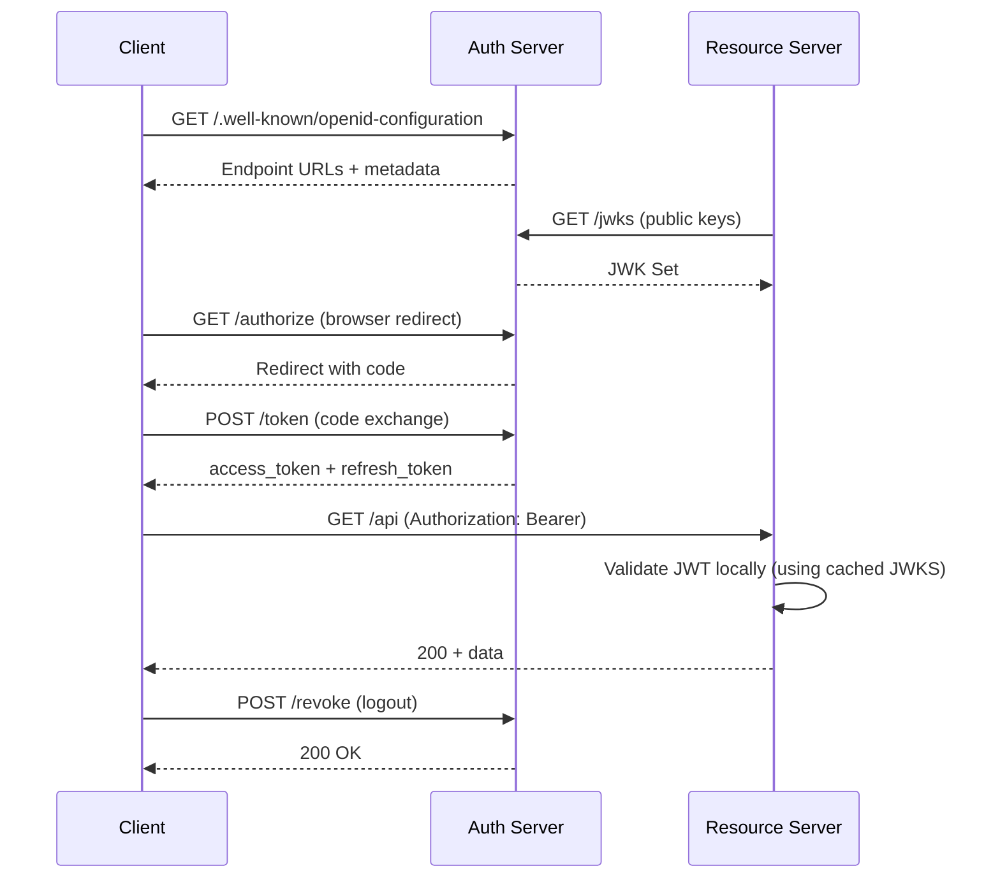

⚡ TL;DR - OAuth 2.0 defines two core endpoints on the
Authorization Server: the authorization endpoint (where the
user's browser goes to authorize) and the token endpoint (where
the client exchanges credentials for tokens). OIDC adds a
userinfo endpoint (for user profile data) and a discovery
endpoint (`/.well-known/openid-configuration`) that describes
all AS endpoints. Modern deployments also add introspection
(token validation for Resource Servers) and revocation (token
invalidation). The JWKS endpoint publishes public keys for JWT
verification. Together, these six endpoints cover the complete
OAuth 2.0 + OIDC protocol surface.

---

### 🔥 The Problem This Solves

**WORLD WITHOUT IT:**

Without standardized endpoints, each OAuth provider has its
own URL patterns, forcing developers to read proprietary API
documentation for every provider. Discovering the token
endpoint URL requires consulting docs - or hardcoding a URL
that might change. Token validation requires calling back to
the provider with no standard protocol. Library code cannot
be generic - every provider needs custom initialization.

**THE INVENTION MOMENT:**

RFC 6749 standardized the authorization and token endpoints
as the two required interaction points. OIDC discovery
(`.well-known/openid-configuration`) standardized automatic
configuration: a client fetches one document and gets all
endpoint URLs, supported scopes, and algorithm metadata.
This made generic OAuth/OIDC library code possible - one
library works with Google, Okta, Auth0, Keycloak, and any
standards-compliant provider.

---

### 📘 Textbook Definition

OAuth 2.0 (RFC 6749) defines two Authorization Server
endpoints: the authorization endpoint (user-agent interaction
for authorization grants) and the token endpoint (client
interaction for token exchange). RFC 7009 adds the revocation
endpoint. RFC 7662 adds the introspection endpoint. OpenID
Connect adds: the userinfo endpoint (user claims), the JWKS
endpoint (public key set for JWT verification), and the
discovery endpoint (`/.well-known/openid-configuration`).
The discovery document (RFC 8414 for OAuth 2.0, OIDC Core
for OIDC) is a JSON metadata document that lists all supported
endpoints, response types, scopes, algorithms, and claims.
JWKS (JSON Web Key Set, RFC 7517) is the JSON document
containing the public keys used to verify JWT access tokens
and ID tokens.

---

### ⏱️ Understand It in 30 Seconds

**One mental map:**

```
WHO CALLS IT?         ENDPOINT            WHAT HAPPENS
Browser/redirect  →  /authorize       →  User logs in + consents
Client backend    →  /token           →  Gets access/refresh token
Client backend    →  /token           →  Refresh token exchange
Client backend    →  /introspect      →  Validate opaque token
Client backend    →  /revoke          →  Invalidate token
Client backend    →  /userinfo        →  Get user profile (OIDC)
Client (startup)  →  /.well-known/    →  Auto-discover all URLs
                      openid-config
RS (startup)      →  /jwks            →  Cache public keys
```

**One insight:**
The browser ONLY talks to `/authorize`. All other endpoints
are server-to-server. This is the core security separation:
the front channel (browser, visible to user) carries only
the authorization code; the back channel (server, hidden from
user) carries the tokens. Any token that appears in the browser
URL is a design flaw.

---

### ⚙️ How It Works (Mechanism)

**Endpoint architecture diagram:**

```
┌───────────────────────────────────────────────────────┐
│     OAuth 2.0 + OIDC Endpoint Map                     │
├───────────────────────────────────────────────────────┤
│                                                       │
│  FRONT CHANNEL (browser-facing):                      │
│  ┌─────────────────────────────────────────────────┐  │
│  │ GET /authorize                                  │  │
│  │  → User authentication + consent UI            │  │
│  │  → Returns: ?code=AUTH_CODE to redirect_uri    │  │
│  │  RFC: 6749 §3.1                                 │  │
│  └─────────────────────────────────────────────────┘  │
│                                                       │
│  BACK CHANNEL (server-to-server, not in browser):     │
│  ┌─────────────────────────────────────────────────┐  │
│  │ POST /token                                     │  │
│  │  → Code exchange (grant_type=authorization_code)│  │
│  │  → Refresh (grant_type=refresh_token)           │  │
│  │  → M2M (grant_type=client_credentials)         │  │
│  │  → Returns: access_token, refresh_token, ...   │  │
│  │  RFC: 6749 §3.2                                 │  │
│  └─────────────────────────────────────────────────┘  │
│  ┌─────────────────────────────────────────────────┐  │
│  │ POST /introspect (RFC 7662)                     │  │
│  │  → Token → active:true/false + metadata         │  │
│  │  → Used by: Resource Servers (opaque tokens)   │  │
│  └─────────────────────────────────────────────────┘  │
│  ┌─────────────────────────────────────────────────┐  │
│  │ POST /revoke (RFC 7009)                         │  │
│  │  → Invalidate access or refresh token          │  │
│  │  → Used by: client on logout                   │  │
│  └─────────────────────────────────────────────────┘  │
│  ┌─────────────────────────────────────────────────┐  │
│  │ GET /userinfo (OIDC Core §5.3)                  │  │
│  │  → Access token → user claims JSON             │  │
│  │  → Requires openid scope                       │  │
│  └─────────────────────────────────────────────────┘  │
│                                                       │
│  CONFIGURATION & KEYS:                                │
│  ┌─────────────────────────────────────────────────┐  │
│  │ GET /.well-known/openid-configuration           │  │
│  │  → Discovery doc (all endpoint URLs + metadata)│  │
│  │  → Client startup: fetch once, cache            │  │
│  └─────────────────────────────────────────────────┘  │
│  ┌─────────────────────────────────────────────────┐  │
│  │ GET /jwks (URL in discovery doc)                │  │
│  │  → JWK Set with AS public keys                 │  │
│  │  → Client + RS: cache, refresh on key rotation │  │
│  └─────────────────────────────────────────────────┘  │
└───────────────────────────────────────────────────────┘
```



**Discovery document structure:**

```json
GET /.well-known/openid-configuration
HTTP/1.1 200 OK

{
  "issuer": "https://auth.example.com",
  "authorization_endpoint":
    "https://auth.example.com/authorize",
  "token_endpoint":
    "https://auth.example.com/oauth/token",
  "userinfo_endpoint":
    "https://auth.example.com/userinfo",
  "jwks_uri":
    "https://auth.example.com/.well-known/jwks.json",
  "introspection_endpoint":
    "https://auth.example.com/introspect",
  "revocation_endpoint":
    "https://auth.example.com/revoke",
  "scopes_supported": ["openid","email","profile","..."],
  "response_types_supported": ["code"],
  "grant_types_supported": [
    "authorization_code","client_credentials","refresh_token"
  ],
  "id_token_signing_alg_values_supported": ["RS256"]
}
```

---

### 💻 Code Example

**Example 1 - BAD then GOOD: Hardcoded endpoint URL vs discovery:**

```python
# BAD: Hardcoded endpoint URLs
# Provider changes URL: runtime failure with no warning.
# Different environments (dev/prod/staging) need different
# hardcoded values.
AUTH_ENDPOINT = "https://auth.example.com/auth"
TOKEN_ENDPOINT = "https://auth.example.com/token"

def get_token(code):
    return requests.post(TOKEN_ENDPOINT, data={...})
```

```python
# GOOD: Discover endpoints from well-known document
# WHY: Resilient to URL changes, works for any OIDC provider.
#   Library initializes once per process; all clients share.
import httpx
from functools import lru_cache

@lru_cache(maxsize=1)
def get_oidc_config(issuer_url: str) -> dict:
    """Fetch and cache OIDC discovery document."""
    discovery_url = (
        issuer_url.rstrip('/')
        + '/.well-known/openid-configuration'
    )
    response = httpx.get(discovery_url, timeout=10)
    response.raise_for_status()
    config = response.json()

    # Validate issuer matches what we expected
    if config['issuer'] != issuer_url:
        raise ValueError(
            f"Issuer mismatch: expected {issuer_url}, "
            f"got {config['issuer']}"
        )
    return config

def get_token(issuer: str, code: str, **kwargs):
    config = get_oidc_config(issuer)
    token_endpoint = config['token_endpoint']
    return httpx.post(token_endpoint, data={
        'grant_type': 'authorization_code',
        'code': code,
        **kwargs
    })
    # WHAT BREAKS: Discovery fails on startup in air-gapped
    #   env; pin known endpoints as fallback in those cases
    # HOW TO TEST: Mock discovery URL; verify token_endpoint
    #   used in POST matches discovery response
```

**Example 2 - Token introspection (Resource Server calling AS):**

```python
# Resource Server: validate an opaque bearer token
# via the introspection endpoint (RFC 7662)
def validate_opaque_token(token: str) -> dict:
    config = get_oidc_config(ISSUER)
    introspection_url = config['introspection_endpoint']

    # RS authenticates to introspection endpoint with its
    # own client_id/secret (RS is itself a "client" of AS)
    response = httpx.post(
        introspection_url,
        data={'token': token},
        auth=(RS_CLIENT_ID, RS_CLIENT_SECRET),
        timeout=2  # Introspection is on hot path; keep fast
    )
    response.raise_for_status()
    result = response.json()

    if not result.get('active'):
        raise TokenInactiveError("Token is expired or revoked")

    # result contains: scope, sub, exp, iat, client_id, etc.
    return result
    # WHAT BREAKS: Network call on every API request →
    #   introspection latency = API latency floor
    # PRODUCTION FIX: Short-TTL local cache on (token, AS) →
    #   trade revocation lag for performance
    # HOW TO TEST: Call with expired token → active:false;
    #   verify TokenInactiveError raised
```

**Example 3 - Token revocation on logout:**

```python
def logout(access_token: str, refresh_token: str | None):
    config = get_oidc_config(ISSUER)
    revocation_url = config.get('revocation_endpoint')
    if not revocation_url:
        return  # AS does not support revocation

    # Revoke refresh token first (it can generate new tokens)
    if refresh_token:
        httpx.post(revocation_url,
            data={
                'token': refresh_token,
                'token_type_hint': 'refresh_token'
            },
            auth=(CLIENT_ID, CLIENT_SECRET)
        )
    # Revoke access token
    httpx.post(revocation_url,
        data={
            'token': access_token,
            'token_type_hint': 'access_token'
        },
        auth=(CLIENT_ID, CLIENT_SECRET)
    )
    # NOTE: RFC 7009 requires AS to return 200 even if the
    # token was already expired or not found. Don't check
    # response body to infer whether revocation succeeded.
```

---

### ⚖️ Comparison Table

| Endpoint | RFC | Who calls it | HTTP method | Returns |
|---|---|---|---|---|
| `/authorize` | RFC 6749 §3.1 | Browser (front channel) | GET | Redirect with code |
| `/token` | RFC 6749 §3.2 | Client server | POST | access_token JSON |
| `/introspect` | RFC 7662 | Resource Server | POST | active:true/false + claims |
| `/revoke` | RFC 7009 | Client server | POST | 200 OK (always) |
| `/userinfo` | OIDC Core §5.3 | Client server | GET or POST | User claims JSON |
| `/.well-known/openid-configuration` | RFC 8414 | Client/RS (startup) | GET | AS metadata JSON |
| `/jwks` | RFC 7517 | Client/RS (startup) | GET | JWK Set JSON |

---

### 🔁 Flow / Lifecycle

```
CLIENT STARTUP:
  1. GET /.well-known/openid-configuration
     → cache: authorization_endpoint, token_endpoint,
       introspection_endpoint, revocation_endpoint,
       userinfo_endpoint, jwks_uri

RESOURCE SERVER STARTUP:
  1. GET {jwks_uri} from discovery doc
     → cache public keys by kid
     → schedule key refresh (rotation handling)

AUTHORIZATION CODE FLOW:
  1. Browser → GET /authorize (front channel)
  2. Server → POST /token (back channel: code exchange)

TOKEN REFRESH:
  1. Server → POST /token (grant_type=refresh_token)

LOGOUT:
  1. Server → POST /revoke (refresh_token first)
  2. Server → POST /revoke (access_token)

USER PROFILE LOOKUP:
  1. Server → GET /userinfo (with access_token)
```



---

### ⚠️ Common Misconceptions

| Misconception | Reality |
|---|---|
| The userinfo endpoint returns the same data as the id_token | The id_token (OIDC) is a signed JWT issued at authorization time with a fixed claim set. The userinfo endpoint is an API call with the access token that returns current, potentially more detailed user claims. They may differ if the user profile changed between authorization and the userinfo call. |
| Token revocation immediately invalidates a JWT access token | JWT revocation is not inherent - the Resource Server validates JWTs locally using cached JWKS, without calling the AS. A JWT is valid until its `exp` claim. Only opaque tokens (validated via introspection) reflect revocation immediately. JWT revocation requires either short TTL or a revocation list checked on every API call. |
| The JWKS endpoint is for clients to use during login | JWKS is primarily for Resource Servers to verify JWT access tokens and for clients to verify ID tokens. It is fetched once at startup and cached, not called on every request. |
| /introspect is the correct endpoint for all token validation | Introspection is for OPAQUE tokens that cannot be validated locally. For JWT tokens, Resource Servers should validate locally using JWKS (no network call). Using introspection for JWTs adds unnecessary network latency. |

---

### 🚨 Failure Modes & Diagnosis

**Discovery Endpoint Not Available at Startup**

**Symptom:**
Service fails to start (or starts in degraded mode) because it
cannot fetch the OIDC discovery document. Happens in local
development, air-gapped environments, or during AS maintenance.

**Root Cause:**
OIDC library configured to fetch discovery document during
application startup initialization, with no fallback if AS is
unreachable.

**Diagnostic + Fix:**

```bash
# Check discovery endpoint connectivity:
curl -s -o /dev/null -w "%{http_code}" \
  https://auth.example.com/.well-known/openid-configuration
# 200: accessible. 0: network unreachable.

# Fix option 1: retry with backoff (AS may be temporarily down):
# Configure library: discoveryRetries: 3, discoveryBackoff: 2s

# Fix option 2: pin endpoints as fallback for known AS:
# If OIDC_DISCOVERY_URL unavailable, use known endpoints
```

**Fix Strategy:**
For production, configure a retry with exponential backoff on
discovery. For air-gapped or local development environments,
support pinned endpoint configuration as a fallback so the
OIDC discovery URL failure does not prevent startup.

---

**JWKS Key Rotation Failure (JWT Validation Error)**

**Symptom:**
After AS performs key rotation, all JWT validation at Resource
Servers fails with "unknown key id" or "signature verification
failed" errors. Starts suddenly, affects all users simultaneously.

**Root Cause:**
Resource Server cached the old JWKS on startup and never
refreshes. AS rotated to a new signing key. The old `kid` is
no longer in the AS's JWKS. Local JWT validation fails because
the key is not in the cached set.

**Diagnostic:**

```bash
# Check JWKS for current key IDs:
curl -s https://auth.example.com/.well-known/jwks.json | \
  python3 -m json.tool | grep '"kid"'

# Decode a failing JWT to see which kid it expects:
# (JWT header is base64url - decode first segment)
echo "eyJhbGciOiJSUzI1NiIsImtpZCI6Im..." | \
  python3 -c "
import sys, base64, json
h = sys.stdin.read().strip().split('.')[0]
pad = 4 - len(h) % 4
print(json.loads(base64.urlsafe_b64decode(h + '='*pad)))
"
# If JWT kid not in JWKS: key rotation happened

# Fix: restart service (forces JWKS refresh) or trigger
# on-demand JWKS refresh if library supports it
```

**Fix:**
Configure JWKS caching with a periodic refresh interval
(typically every 15-60 minutes) AND a cache-miss refresh:
if a JWT arrives with a `kid` not in the current cache,
immediately re-fetch JWKS before failing. This handles key
rotation without downtime.

---

### 🔗 Related Keywords

**Prerequisites:**
- `OAuth 2.0 Roles` - who calls which endpoint
- `Access Token` - what the token endpoint returns

**Builds On:**
- `PKCE - Proof Key for Code Exchange` - a parameter to
  the authorization endpoint
- `Token Validation` - how clients use JWKS from the
  jwks_uri to verify JWTs

---

### 📌 Quick Reference Card

```
┌──────────────────────────────────────────────────────────┐
│ FRONT CHANNEL│ GET /authorize (browser only!)            │
├──────────────┼───────────────────────────────────────────┤
│ BACK CHANNEL │ POST /token (code exchange, refresh, M2M) │
│              │ POST /introspect (opaque token validation) │
│              │ POST /revoke (logout - revoke tokens)     │
│              │ GET /userinfo (OIDC user claims)          │
├──────────────┼───────────────────────────────────────────┤
│ STARTUP      │ GET /.well-known/openid-configuration     │
│ CONFIG       │ GET /jwks (public keys for JWT verify)    │
├──────────────┼───────────────────────────────────────────┤
│ KEY INSIGHT  │ Tokens NEVER appear in browser URLs.      │
│              │ Browser → /authorize only. Tokens from    │
│              │ /token (server-to-server only).           │
├──────────────┼───────────────────────────────────────────┤
│ DISCOVERY    │ /.well-known/openid-configuration fetched │
│              │ once at startup; all other URLs from it.  │
├──────────────┼───────────────────────────────────────────┤
│ JWKS CACHE   │ Cache with periodic refresh + cache-miss  │
│              │ refresh to handle key rotation.           │
└──────────────────────────────────────────────────────────┘
```

**If you remember only 3 things:**

1. The browser only calls `/authorize`. All other endpoints
   are server-to-server. A token in a browser URL = design flaw.

2. Use the OIDC discovery document (`.well-known/openid-
   configuration`) to auto-configure endpoint URLs at startup.
   Never hardcode AS endpoint URLs.

3. JWKS must be cached with both periodic refresh and cache-miss
   refresh to survive key rotation without downtime.

**Interview one-liner:**
"OAuth 2.0 has two core endpoints: /authorize (browser, front
channel) and /token (server, back channel). OIDC adds /userinfo,
JWKS, and discovery (.well-known/openid-configuration). RFC 7662
adds /introspect for opaque tokens; RFC 7009 adds /revoke. The
discovery document is fetched at startup to auto-configure all
endpoint URLs."

---

### ✅ Mastery Checklist

**You've mastered this when you can:**

1. **[EXPLAIN]** Draw the OAuth 2.0 + OIDC endpoint map from
   memory, labeling which caller (browser vs server), which
   RFC, and what each endpoint returns.

2. **[CONFIGURE]** Configure an OIDC client library to use
   discovery-based endpoint auto-configuration, with retry
   logic for startup failures and a JWKS cache refresh interval.

3. **[DEBUG]** After AS key rotation, diagnose JWT validation
   failures at the Resource Server: determine which kid the
   failing JWTs expect, verify it is missing from the cached
   JWKS, and describe the remediation steps without requiring
   downtime.
