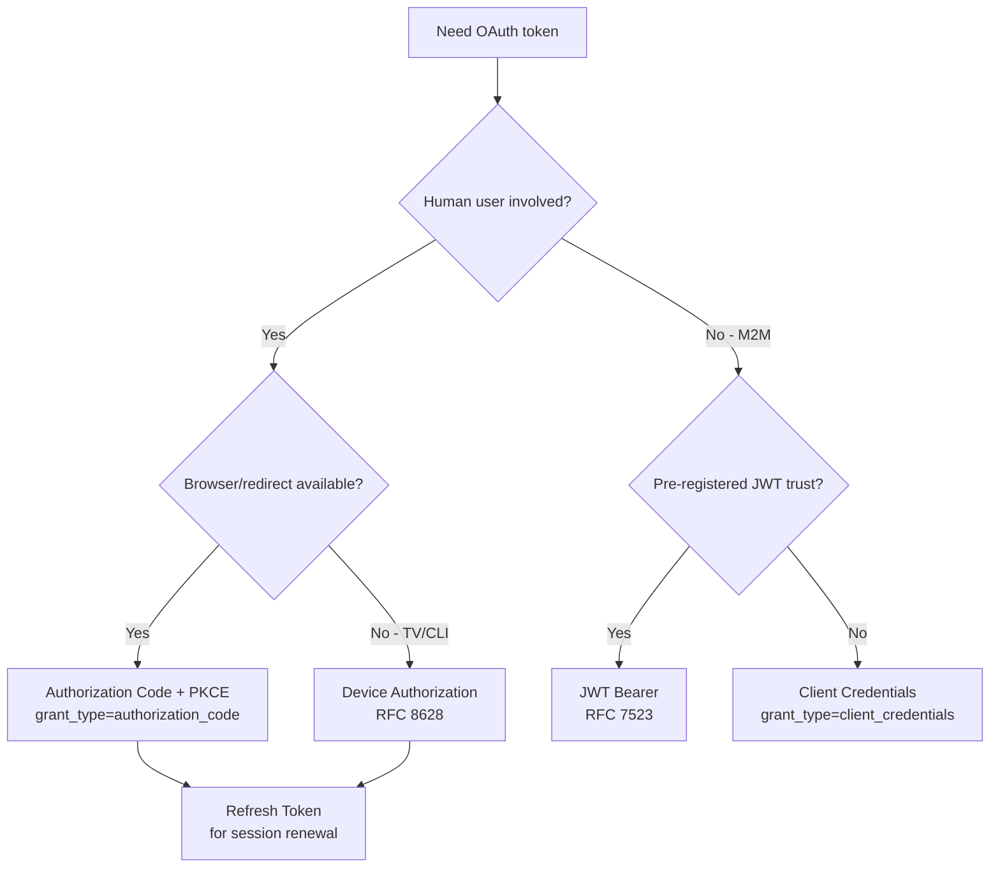

⚡ TL;DR - An OAuth 2.0 grant type is the method by which a
client obtains tokens from the Authorization Server. Each grant
type is designed for a specific deployment scenario. The four
original RFC 6749 grants are: Authorization Code (web apps with
server backend), Client Credentials (M2M, no user), Resource
Owner Password Credentials (legacy, NEVER use for new builds),
and Implicit (SPA legacy, deprecated by PKCE+Authorization Code).
Later RFCs added: Device Authorization (TV/CLI with no browser),
Refresh Token (all user flows for silent renewal), and JWT Bearer
(RFC 7523, for service-to-service with pre-registered trust).
Authorization Code + PKCE is now the universal recommendation for
any flow involving a user.

---

### 🔥 The Problem This Solves

**THE CORE TENSION:**

OAuth 2.0 must work for wildly different deployment scenarios:
a web app with a server backend, a JavaScript SPA with no backend,
a mobile app running natively, a batch job with no user involved,
a TV that cannot open a browser, and a legacy app that needs to
migrate. Each scenario has different capabilities: can it redirect?
can it keep a secret? is there a user? is there a browser? The
grant type system answers: "given your deployment constraints,
how do you get a token?"

**THE INVENTION MOMENT:**

RFC 6749 defined grant types as the extensibility point for
OAuth 2.0's flexibility. The core protocol (endpoints, token
format, error codes) is fixed; grant types are pluggable. This
design allowed the RFC ecosystem to extend OAuth to new scenarios
(Device Authorization, JWT Bearer, Token Exchange) without
changing the core protocol.

---

### 📘 Textbook Definition

An OAuth 2.0 grant type (also called "authorization grant") is a
credential representing the resource owner's authorization for
the client to obtain an access token (RFC 6749 §1.3). The client
specifies the grant type in the `grant_type` parameter of the
token endpoint request. RFC 6749 defines four grant types:
`authorization_code`, `client_credentials`,
`password` (Resource Owner Password Credentials), and
`implicit`. RFC 8628 adds `urn:ietf:params:oauth:grant-type:
device_code` (Device Authorization). RFC 7523 adds
`urn:ietf:params:oauth:grant-type:jwt-bearer`.
RFC 8693 defines Token Exchange. The `refresh_token` grant is
used for silent renewal (not an authorization grant per se,
but uses the same token endpoint).

---

### ⏱️ Understand It in 30 Seconds

**The one-sentence decision rule:**

- Has a browser + server backend? → **Authorization Code + PKCE**
- Has a browser, no server backend? → **Authorization Code + PKCE**
  (same answer - use BFF pattern, or PKCE for SPA directly)
- No user involved? → **Client Credentials**
- TV/CLI/IoT with no browser? → **Device Authorization**
- Legacy enterprise SSO with pre-shared JWT trust? → **JWT Bearer**
- Extending an existing user session? → **Refresh Token**
- ROPC? → **Never, for new builds.** (Legacy migration only.)
- Implicit? → **Deprecated.** (Use Authorization Code + PKCE.)

**One insight:**
The grant type determines who is trusted to initiate the flow
and what they receive. Authorization Code trusts the Authorization
Server to authenticate the user; Client Credentials trusts the
client's own identity; Device Authorization trusts a separate
device+user to complete authorization. Every grant type is an
answer to "who is authorizing what, and how?"

---

### ⚙️ How It Works (Mechanism)

**Grant type map:**

```
┌─────────────────────────────────────────────────────────┐
│  GRANT TYPE DECISION TREE                               │
├─────────────────────────────────────────────────────────┤
│                                                         │
│  Is there a human user involved?                        │
│  │                                                      │
│  ├── YES                                                │
│  │   Is there a browser/redirect capability?           │
│  │   │                                                  │
│  │   ├── YES → Authorization Code + PKCE               │
│  │   │         (web app, SPA, mobile app)               │
│  │   │         grant_type=authorization_code            │
│  │   │                                                  │
│  │   └── NO  → Device Authorization (RFC 8628)         │
│  │             (TV, CLI, IoT, no browser)               │
│  │             grant_type=urn:ietf:params:oauth:        │
│  │             grant-type:device_code                   │
│  │                                                      │
│  └── NO (machine-to-machine)                            │
│      Is there pre-registered JWT trust?                 │
│      │                                                  │
│      ├── YES → JWT Bearer (RFC 7523)                   │
│      │         (service federation, Workload Identity)  │
│      │         grant_type=urn:ietf:params:oauth:        │
│      │         grant-type:jwt-bearer                    │
│      │                                                  │
│      └── NO  → Client Credentials                      │
│                (standard M2M, service accounts)         │
│                grant_type=client_credentials            │
│                                                         │
│  EXTENSION: Refresh Token (any user flow)              │
│    grant_type=refresh_token                            │
│    Use to extend sessions without re-authorization      │
│                                                         │
│  DEPRECATED: Implicit, ROPC (never new builds)         │
└─────────────────────────────────────────────────────────┘
```



**Each grant type - request pattern:**

```
1. Authorization Code + PKCE:
   STEP 1: GET /authorize?
     response_type=code
     &client_id=CLIENT_ID
     &redirect_uri=REDIRECT_URI
     &scope=openid email
     &state=RANDOM_STATE
     &code_challenge=CODE_CHALLENGE
     &code_challenge_method=S256

   STEP 2: POST /token
     grant_type=authorization_code
     &code=AUTH_CODE
     &redirect_uri=REDIRECT_URI
     &client_id=CLIENT_ID
     &code_verifier=CODE_VERIFIER

2. Client Credentials:
   POST /token
     grant_type=client_credentials
     &client_id=CLIENT_ID
     &client_secret=CLIENT_SECRET
     &scope=payment:process

3. Refresh Token:
   POST /token
     grant_type=refresh_token
     &refresh_token=REFRESH_TOKEN
     &client_id=CLIENT_ID
     &client_secret=CLIENT_SECRET (confidential client only)

4. Device Authorization (RFC 8628):
   STEP 1: POST /device_authorization
     client_id=CLIENT_ID
     &scope=read:data
   Response: { device_code, user_code, verification_uri,
               expires_in, interval }

   STEP 2: User visits verification_uri, enters user_code

   STEP 3: Client polls POST /token
     grant_type=urn:ietf:params:oauth:grant-type:device_code
     &device_code=DEVICE_CODE
     &client_id=CLIENT_ID
   Until: success OR authorization_pending expires

5. JWT Bearer (RFC 7523 - service-to-service):
   POST /token
     grant_type=urn:ietf:params:oauth:grant-type:jwt-bearer
     &assertion=SIGNED_JWT_FROM_SERVICE_ACCOUNT
```

---

### 💻 Code Example

**Example 1 - BAD then GOOD: Choosing the right grant type:**

```python
# BAD: Using ROPC (Resource Owner Password) for web app login
# ROPC = app handles username+password directly.
# User credentials pass through the application server.
# Application stores or transmits user passwords.
# Cannot support MFA, IdP, SSO, phishing-resistant auth.

def login_bad(username, password):
    # WRONG: Application collects user credentials
    response = requests.post(TOKEN_ENDPOINT, data={
        'grant_type': 'password',       # DEPRECATED
        'username': username,
        'password': password,
        'client_id': CLIENT_ID,
        'client_secret': CLIENT_SECRET,
    })
    return response.json()
```

```python
# GOOD: Authorization Code + PKCE for user login
# WHY: User credentials never touch the application.
#   AS handles authentication (supports MFA, SSO, IdP).
#   PKCE prevents code interception. Standard redirect flow.

import secrets, hashlib, base64, urllib.parse

def start_authorization() -> tuple[str, str, str]:
    """Return (auth_url, state, code_verifier)"""
    state = secrets.token_urlsafe(32)
    code_verifier = secrets.token_urlsafe(43)

    # PKCE: SHA256(code_verifier) as code_challenge
    digest = hashlib.sha256(
        code_verifier.encode('ascii')
    ).digest()
    code_challenge = base64.urlsafe_b64encode(
        digest
    ).rstrip(b'=').decode('ascii')

    auth_url = (
        f"{AUTHORIZE_ENDPOINT}"
        f"?response_type=code"
        f"&client_id={CLIENT_ID}"
        f"&redirect_uri={REDIRECT_URI}"
        f"&scope=openid+email"
        f"&state={state}"
        f"&code_challenge={code_challenge}"
        f"&code_challenge_method=S256"
    )
    # Store state + code_verifier in server session
    return auth_url, state, code_verifier

def exchange_code(code: str, code_verifier: str) -> dict:
    """Exchange authorization code for tokens."""
    response = requests.post(TOKEN_ENDPOINT, data={
        'grant_type': 'authorization_code',
        'code': code,
        'redirect_uri': REDIRECT_URI,
        'client_id': CLIENT_ID,
        'code_verifier': code_verifier,  # PKCE verifier
    })
    response.raise_for_status()
    return response.json()
    # WHAT BREAKS: state not verified before code exchange
    #   → CSRF vulnerability; always verify state matches
    # HOW TO TEST: Exchange code with wrong code_verifier →
    #   AS returns error=invalid_grant
```

**Example 2 - Grant type selection at architecture level:**

```python
# System architecture: which grant type for each component?

# Component: Public-facing web app (server-rendered)
# Grant: Authorization Code + PKCE
# Why: Server backend, can keep client secret, users login
WEB_APP_GRANT = 'authorization_code'

# Component: Single-page React app with no BFF
# Grant: Authorization Code + PKCE (no Implicit!)
# Why: PKCE protects without client secret; Implicit deprecated
SPA_GRANT = 'authorization_code'  # + PKCE, no secret

# Component: Background worker (invoice processor)
# Grant: Client Credentials
# Why: No user involved, runs as service account
WORKER_GRANT = 'client_credentials'

# Component: Smart TV streaming app
# Grant: Device Authorization
# Why: No redirect capability; user uses phone to authorize
TV_APP_GRANT = 'urn:ietf:params:oauth:grant-type:device_code'

# Component: GitHub Actions workflow calling internal API
# Grant: JWT Bearer (OIDC token from GitHub → AS trust)
# Why: Pre-registered trust; no secrets in CI/CD pipeline
CICD_GRANT = 'urn:ietf:params:oauth:grant-type:jwt-bearer'

# Component: ANY app with logged-in user session renewal
# Grant: Refresh Token
# Why: Transparent session extension without re-login
ALL_USER_APPS_RENEWAL = 'refresh_token'
```

---

### ⚖️ Comparison Table

| Grant Type | User Involved | Client Secret | Browser Required | Refresh Token | Current Status |
|---|---|---|---|---|---|
| Authorization Code + PKCE | Yes | Optional | Yes | Yes | **Current standard** |
| Client Credentials | No | Yes | No | No | Active |
| Device Authorization | Yes | Optional | No | Yes | Active |
| JWT Bearer | No | No (JWT key) | No | No | Active |
| Refresh Token | Extension | Client-dependent | No | N/A | Active |
| Implicit | Yes | No | Yes | No | **Deprecated** |
| ROPC | Yes | Yes | No | Yes | **Never new builds** |

---

### 🔁 Flow / Lifecycle

```
NEW WEB APP DESIGN:
  User facing?
    └── YES + browser → Authorization Code + PKCE
    └── NO (M2M) → Client Credentials
  Session renewal → Refresh Token

LEGACY APP MIGRATION:
  ROPC → Authorization Code + PKCE (redirect to IdP)
  Implicit → Authorization Code + PKCE (add PKCE + state)

ENTERPRISE CI/CD:
  Service accounts + secrets → JWT Bearer / OIDC federation
  Eliminates: static client_secret in CI/CD pipelines
```

---

### ⚠️ Common Misconceptions

| Misconception | Reality |
|---|---|
| Implicit flow is acceptable for SPAs because they have no backend | Implicit was deprecated by OAuth 2.0 Security Best Current Practice (BCP). Modern SPAs use Authorization Code + PKCE without a client secret. Implicit exposes tokens in URL fragments, in browser history, and to Referer headers. |
| ROPC is fine for first-party apps (same company owns app and AS) | ROPC prevents all phishing-resistant authentication (FIDO2, passkeys), MFA challenges, and federated identity provider selection - even for first-party apps. The user experience and security cost of ROPC is never justified in new builds. Use Authorization Code instead. |
| Client Credentials is just "Authorization Code without a user" | Client Credentials is a completely different protocol path: no authorization endpoint visit, no redirect, no user consent. It goes directly to the token endpoint with client credentials. There is no code exchange phase. |
| Device Authorization is only for IoT devices | Device Authorization (RFC 8628) works for any scenario where the device lacks a suitable browser: CLI tools (`az login`, `gh auth login`), cloud shell, kiosk applications, and gaming consoles. It is widely used in developer tooling. |

---

### 🚨 Failure Modes & Diagnosis

**Wrong Grant Type for Scenario (SPA using Implicit)**

**Symptom:**
SPA stores ID token in URL fragment hash. Token appears in
browser history. After navigating away and back, the token is
in the browser's history. Third-party scripts can potentially
read `window.location.hash`.

**Root Cause:**
Authorization Code flow with `response_type=token` (Implicit).
Tokens returned in URL fragment after /authorize redirect.

**Fix:**
Migrate to `response_type=code` with PKCE (`code_challenge`,
`code_challenge_method=S256`). Exchange the code for tokens
server-side (BFF) or in the SPA (code + PKCE exchange via
`/token`). Tokens are never in the URL fragment.

**Diagnostic:**

```bash
# Check if response_type=token appears in authorization URLs
grep -rn "response_type=token" src/ --include="*.js" \
  --include="*.ts"
# Any result = Implicit flow in use. Migrate to code + PKCE.
```

---

### 🔗 Related Keywords

**Prerequisites:**
- `Authorization Code Flow` - the most important grant type
- `Client Credentials Flow` - M2M grant type
- `OAuth 2.0 Roles` - who participates in each grant

**Builds On:**
- `PKCE` - required extension to Authorization Code
- `Device Authorization Flow` - RFC 8628 grant type
- `Refresh Token` - the renewal grant type

---

### 📌 Quick Reference Card

```
┌──────────────────────────────────────────────────────────┐
│ USER + BROWSER   │ Authorization Code + PKCE (universal) │
├──────────────────┼───────────────────────────────────────┤
│ USER + NO BROWSER│ Device Authorization (RFC 8628)       │
├──────────────────┼───────────────────────────────────────┤
│ M2M (no user)    │ Client Credentials                    │
├──────────────────┼───────────────────────────────────────┤
│ M2M + JWT trust  │ JWT Bearer (RFC 7523 / OIDC federation│
├──────────────────┼───────────────────────────────────────┤
│ SESSION RENEWAL  │ Refresh Token (all user flows)        │
├──────────────────┼───────────────────────────────────────┤
│ DEPRECATED       │ Implicit (tokens in URL fragment)     │
├──────────────────┼───────────────────────────────────────┤
│ NEVER USE        │ ROPC (app sees user credentials)      │
├──────────────────┼───────────────────────────────────────┤
│ ONE-LINER        │ "Grant type = how you get tokens;     │
│                  │  choose based on: user? browser? M2M?"│
└──────────────────────────────────────────────────────────┘
```

**If you remember only 3 things:**

1. Authorization Code + PKCE is the correct answer for any flow
   involving a human user with a browser. For legacy Implicit or
   ROPC: migrate to Authorization Code + PKCE.

2. Client Credentials is M2M only - no user, no redirect, just
   the client presenting its own credentials for service tokens.

3. The grant type is determined by the deployment scenario, not
   preference. Wrong grant type = architectural vulnerability
   (ROPC = credentials through app, Implicit = tokens in URL).

**Interview one-liner:**
"OAuth 2.0 grant types match token acquisition method to
deployment scenario. Authorization Code + PKCE is the universal
standard for user-facing flows. Client Credentials is for M2M.
Device Authorization for no-browser flows. Implicit is deprecated
(tokens in URL). ROPC is never correct for new builds (app sees
user credentials). Refresh Token extends any user session silently."

---

### ✅ Mastery Checklist

**You've mastered this when you can:**

1. **[CHOOSE]** Given a system architecture description, select
   the correct grant type for each component and justify why the
   alternatives are inappropriate.

2. **[EXPLAIN]** Explain to a developer why Implicit flow is
   deprecated and how to migrate an existing SPA from Implicit
   to Authorization Code + PKCE. What specific security
   properties improve with the migration?

3. **[DEBUG]** Identify from access logs or code review whether
   an application is using a deprecated or inappropriate grant
   type, and describe the migration path.
