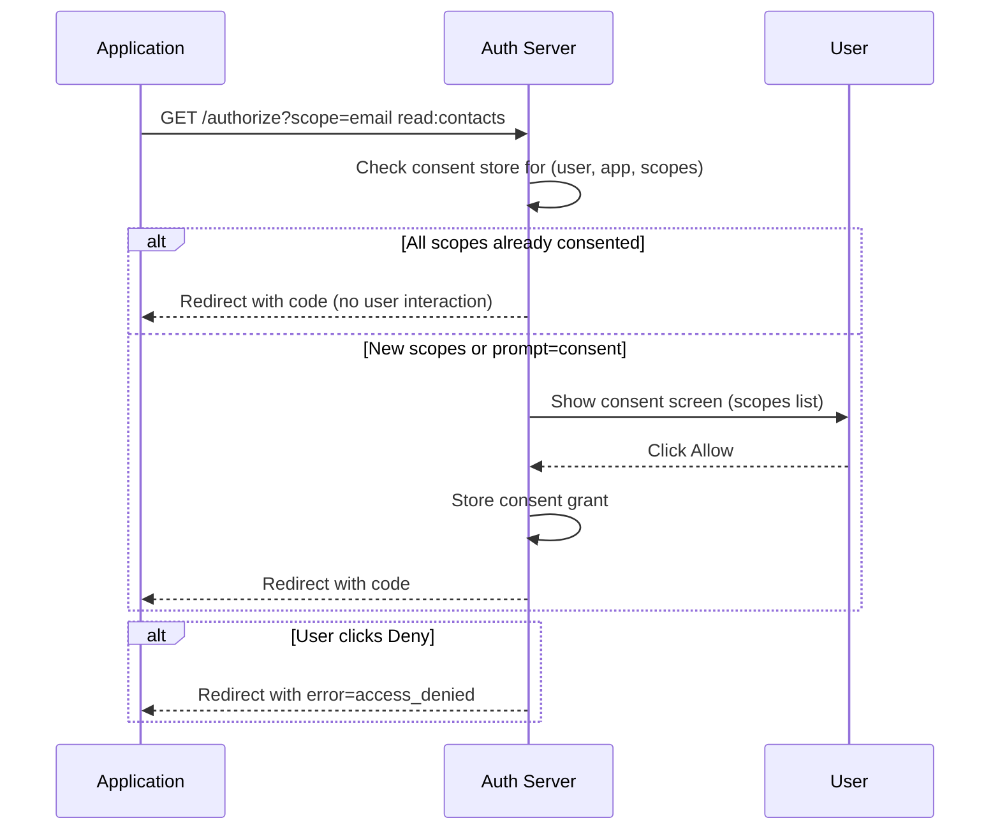

⚡ TL;DR - The consent screen is the UI shown to the user by the
Authorization Server during the Authorization Code flow, after
authentication. It displays which application is requesting
access and exactly what permissions (scopes) it is asking for.
The user grants or denies. This is the moment where the user's
delegated authorization decision is captured. The consent screen
is always rendered by the Authorization Server, never by the
application - this is the core trust property of OAuth.

---

### 🔥 The Problem This Solves

**WORLD WITHOUT IT:**

Without a consent screen, delegation is invisible. The user
logs in and the application silently gets access to all their
data with no visibility into what is shared. Applications
routinely over-request permissions because there is no user
friction. Users have no way to know what they authorized or
to which applications. Revocation is impossible because no
consent was recorded.

**THE INVENTION MOMENT:**

The consent screen is the UX manifestation of the OAuth
delegation model. OAuth's core value proposition is "user-
controlled delegation with explicit scope." The consent screen
is where that delegation is made explicit. It transforms
invisible data access into a documented, revocable grant.
The design principle: the user must understand what they are
authorizing, the authorization must be explicit, and it must
be revocable.

**PRODUCTION EVOLUTION:**

Modern consent implementations distinguish first-party apps
(same organization owns the app and the AS) from third-party
apps. First-party consent can be pre-approved (no screen shown
to user - they already implicitly trust their organization's
own apps). Third-party consent is always explicit. Enterprise
platforms add consent management: administrators can grant
org-wide consent (one admin approves access for all users in
the organization), a pattern critical for enterprise SaaS
adoption.

---

### 📘 Textbook Definition

The consent screen (also called authorization prompt or
permissions dialog) is the user interface presented by the
Authorization Server during the OAuth 2.0 authorization
endpoint interaction. It presents the resource owner (user)
with: the identity of the requesting application (client name,
logo, verified publisher status), the list of requested
permissions (scopes in human-readable form), and allow/deny
controls. The user's grant or denial determines whether the
Authorization Server issues an authorization code. RFC 6749
does not mandate the format or content of the consent screen;
it only requires that the authorization request be presented
to the resource owner. The specific UX, scope descriptions,
and trust indicators are defined by each Authorization Server.
The `prompt` parameter in the authorization request can
control consent behavior: `prompt=consent` forces re-consent
even if previously granted; `prompt=none` requests no UI
interaction (silent authorization - returns error if any
interaction would be required).

---

### ⏱️ Understand It in 30 Seconds

**One line:**
The consent screen is the AS asking the user: "This app wants
to do X with your data. Allow it?"

**One analogy:**

> The consent screen is the OAuth equivalent of the permission
> dialog on your phone when an app requests camera access.
> The OS (Authorization Server) shows the dialog, not the app.
> The app cannot fake it or bypass it. The user grants or denies.
> If denied, the app cannot access the camera (scope) regardless
> of what it tries. Previously granted permissions appear in the
> phone's Settings > App Permissions (the AS's consent dashboard).

**One insight:**
The consent screen being rendered by the AS (not the app) is
what makes OAuth delegation trustworthy. If the app showed the
consent screen, it could manipulate what the user sees while
requesting more permissions in the background. The AS owns
the consent UI as a security control, not just a UX element.

---

### 🔩 First Principles Explanation

**THREE PROPERTIES THE CONSENT SCREEN ENFORCES:**

1. **Informed consent:** The user sees a human-readable
   description of what they are authorizing. Scope strings like
   `read:contacts` must map to "Read your contacts list" in
   the consent UI.

2. **Explicit grant:** Consent is an explicit user action
   (clicking "Allow"), not an implicit consequence of logging in.
   The AS stores the consent grant linked to the user +
   client ID + scope set.

3. **Revocability:** Because consent was recorded, it can be
   revoked. The AS maintains a consent store: user → app →
   scopes → grant timestamp. Users can revoke grants from the
   AS's account settings (the "Connected Apps" page).

**CONSENT PERSISTENCE:**
After the user grants consent, the AS typically stores the
grant so subsequent authorization requests from the same app
with the same scopes do not require re-consent. This is
"incremental consent" behavior: if a new scope is requested,
consent is shown for only the new scope. The `prompt=consent`
parameter overrides this: forces the full consent screen
regardless of prior grants.

---

### 🧠 Mental Model / Analogy

> Consent screen = lease agreement. The landlord (AS) presents
> the lease (scope list) to the tenant (user) on behalf of the
> property manager (application). The tenant signs (grants) or
> walks away (denies). The lease is stored. The tenant can
> terminate the lease at any time (revocation). The property
> manager cannot add clauses after signing (cannot expand scope
> without re-consent). The landlord (AS) validates the lease is
> authentic - the property manager cannot forge it.

---

### 📶 Gradual Depth - Five Levels

**Level 1 - What it is (anyone):**
When you click "Sign in with Google" on a website, you see
a screen from Google asking "This app wants to see your name
and email." That's the consent screen. You click Allow or
Deny. Google records your choice.

**Level 2 - How to use it (developer):**
Design your app to request the minimum scopes needed for
the current feature. Use incremental consent: start with
`openid email`, request `write:calendar` only when the user
tries a feature that needs it. Over-requesting scopes upfront
leads to users denying access entirely.

**Level 3 - How it works (mid-level):**
The authorization request carries `scope` parameter. The AS
looks up existing consent for this user + client + scopes.
If all scopes are previously consented: skip screen (or show
minimal notification). If any scope is new: show consent
screen for the new scopes only. User decision → stored in
consent store → authorization code issued if granted.

**Level 4 - Why it was designed this way (senior):**
Consent persistence (remembering prior grants) is a UX
optimization with a security trade-off. If consent is stored
indefinitely, a user may forget they authorized an app that
now has stale or excessive access. Best practice: consent
grants should have a maximum TTL (many providers re-prompt
after 6-12 months) and should be invalidated when the user
changes their password or security settings.

**Level 5 - Mastery (staff/principal):**
Admin consent in enterprise scenarios (Azure AD "tenant-wide
consent", Google Workspace domain-wide delegation) is a consent
model where an administrator pre-authorizes a third-party app
for all users in the organization. Users never see a consent
screen - their organization's administrator made the decision.
This creates organizational-level consent grants that are
auditable and revocable by the admin, not individual users.
Admin consent is essential for enterprise SaaS adoption
(individual user consent workflows break in organizations with
10,000 employees). The security implication: a compromised
admin account can grant org-wide access to malicious
applications (consent phishing attacks exploit this vector).

---

### ⚙️ How It Works (Mechanism)

**Consent screen in the authorization flow:**

```
┌───────────────────────────────────────────────────────┐
│  CONSENT SCREEN - POSITION IN AUTH CODE FLOW          │
├───────────────────────────────────────────────────────┤
│                                                       │
│  Step 1: Browser → GET /authorize                     │
│    ?response_type=code                                │
│    &client_id=CLIENT_ID                               │
│    &scope=openid email read:contacts                  │
│    &prompt=consent   ← force re-show (optional)       │
│                                                       │
│  Step 2: AS checks consent store:                     │
│    Is (user + CLIENT_ID + [scopes]) already granted?  │
│    └── YES (all scopes) → skip screen (or brief note) │
│    └── NO / some scopes new → SHOW CONSENT SCREEN     │
│                                                       │
│  Step 3: AS renders consent screen                    │
│    ┌──────────────────────────────────────────┐       │
│    │  App "Acme Calendar" wants to:           │       │
│    │  ✓ View your name and email address      │       │
│    │  ✓ Read your contact list                │       │
│    │                                          │       │
│    │  [Allow]              [Deny]             │       │
│    └──────────────────────────────────────────┘       │
│                                                       │
│  Step 4: User clicks Allow                            │
│    → AS stores consent grant:                         │
│      {user: U, client: CLIENT_ID,                     │
│       scopes: [openid, email, read:contacts],         │
│       granted_at: NOW}                                │
│    → Issues authorization code                        │
│    → Redirects to redirect_uri?code=AUTH_CODE         │
│                                                       │
│  Step 5: User clicks Deny                             │
│    → Redirects to redirect_uri?error=access_denied    │
└───────────────────────────────────────────────────────┘
```



**The `prompt` parameter controls consent behavior:**

```
prompt=consent    → Always show consent screen
                    (even if all scopes previously granted)
                    USE FOR: re-authorization, scope change UX

prompt=none       → Never show any UI; fail if would require
                    interaction (silent check)
                    Returns error=interaction_required if
                    consent is needed

prompt=login      → Force re-authentication (ignore existing
                    session) but skip consent if granted

prompt=select_account → Show account selector even if only
                         one account exists
```

---

### 💻 Code Example

**Example 1 - BAD then GOOD: Scope requesting strategy:**

```python
# BAD: Request all scopes upfront, before user needs them
# Result: User sees intimidating permission list on first login
# Result: Many users deny entirely, abandoning signup

def start_auth_bad():
    # Over-requesting: user hasn't asked for calendar yet
    scope = (
        "openid email profile read:contacts "
        "write:contacts read:calendar write:calendar "
        "read:documents write:documents "
    )
    return build_auth_url(scope=scope)
    # WRONG: Shows 8 permissions at signup
    # Many users: "Why does this app need all this?" → Deny
```

```python
# GOOD: Incremental/just-in-time consent
# WHY: Request only what you need now. When user tries
#   a feature requiring more scope, trigger additional
#   authorization with only the new scope.

def start_auth_for_signup():
    # Minimum for signup: identity only
    scope = "openid email"
    return build_auth_url(scope=scope)
    # User sees: "View your email address" → LOW friction

def request_contacts_access(existing_token):
    # User clicks "Import contacts" feature
    # Check if we already have the scope in token
    if 'read:contacts' in existing_token.granted_scope:
        return  # Already have permission
    # Trigger incremental consent
    scope = "read:contacts"
    # Redirect to /authorize with just the new scope
    # AS shows: "Also allow: Read your contacts" (only 1 item)
    return build_auth_url(scope=scope, prompt=None)
    # WHAT BREAKS: Some AS implementations require the FULL
    #   scope list in incremental requests (not just the new
    #   scope). Test with your specific provider.
    # HOW TO VERIFY: Check token_response.scope after exchange
    #   - should include both openid email + read:contacts
```

**Example 2 - Handling `access_denied` from consent rejection:**

```python
# Callback handler: user may have clicked "Deny"
from urllib.parse import parse_qs, urlparse

def handle_callback(callback_url: str, session: dict):
    params = parse_qs(urlparse(callback_url).query)

    # Check for errors (including user denial)
    if 'error' in params:
        error = params['error'][0]
        if error == 'access_denied':
            # User clicked Deny - NOT a system error
            # Show friendly message, don't log as error
            return {
                'status': 'denied',
                'message': (
                    'Access was not granted. '
                    'You can try again anytime.'
                )
            }
        else:
            # System error: server_error, temporarily_unavailable
            raise OAuthError(error)

    # Verify state (CSRF protection) before code exchange
    if params.get('state', [None])[0] != session['state']:
        raise SecurityError("State mismatch - possible CSRF")

    code = params['code'][0]
    tokens = exchange_code(code, session['code_verifier'])
    return {'status': 'authorized', 'tokens': tokens}
    # CRITICAL: access_denied is user choice, not a system
    #   failure. Do NOT log it as an error. Show helpful UI.
    # BAD: Showing "Error: access_denied" to user.
    # GOOD: "You didn't grant permission. Try again?"
```

**Example 3 - Admin consent for enterprise apps (Azure AD):**

```
# Azure AD admin consent URL pattern
# (not Python - URL construction for documentation)

# Individual user consent:
GET https://login.microsoftonline.com/{tenant}/oauth2/v2.0/authorize
  ?client_id=APP_CLIENT_ID
  &response_type=code
  &scope=User.Read Calendars.Read
  → Each user sees consent screen individually

# Admin consent (grants for ALL users in the tenant):
GET https://login.microsoftonline.com/{tenant}/adminconsent
  ?client_id=APP_CLIENT_ID
  &redirect_uri=REDIRECT_URI
  → Admin approves once for entire organization
  → Users never see consent screen for these scopes
  → Consent stored at tenant level, not user level

# When to use admin consent:
#   - Enterprise SaaS B2B apps
#   - Daemon/background apps that access org data
#   - When scope requires admin privileges (e.g., Mail.Read
#     for all users in the org)
```

---

### ⚖️ Comparison Table

| Consent Type | Who approves | When shown | Revocable by | Enterprise use |
|---|---|---|---|---|
| **Individual user consent** | User | First request of each scope | User (account settings) | Consumer apps, small orgs |
| **Remembered consent** | User (prior) | Not shown (previously granted) | User | All apps with consent persistence |
| **prompt=consent** | User | Always (forced re-consent) | User | Scope change, security reset |
| **Admin consent** | Organization admin | Once for org; never shown to users | Admin | Enterprise B2B, daemon apps |
| **Auto-consent (first-party)** | N/A | Never shown | User / Admin | First-party apps (same org owns AS) |

---

### ⚠️ Common Misconceptions

| Misconception | Reality |
|---|---|
| The application controls what appears on the consent screen | The consent screen is rendered by the Authorization Server, not the application. The AS determines scope descriptions, trust indicators, and layout. The application only controls which scopes it requests. |
| Requesting all scopes upfront is more efficient (fewer auth redirects) | Requesting all scopes upfront increases consent denial rates significantly. Incremental consent (request scopes at the moment they are needed) dramatically improves conversion, as users see a clear connection between the permission and the feature they're using. |
| If the user previously consented, they can never be shown the consent screen again | `prompt=consent` forces the consent screen regardless of prior grants. Additionally, the AS may require re-consent after a fixed period or after security events (password reset, suspicious login). |
| Admin consent is a security shortcut that should be avoided | Admin consent is the architecturally correct pattern for enterprise multi-user scenarios. Individual user consent for org-wide data access would require each of thousands of users to individually consent - an unworkable UX. Admin consent centralizes authorization decision-making appropriately. |

---

### 🚨 Failure Modes & Diagnosis

**Consent Phishing Attack (Malicious App Getting Admin Consent)**

**Symptom:**
An attacker registers a malicious OAuth application in the target
organization's Azure AD tenant (or the AS allows self-service
registration). The attacker sends an admin consent URL to an
organization admin with a convincing display name (e.g.,
"Microsoft Teams Upgrade Tool"). The admin clicks the URL and
grants org-wide consent to the malicious app.

**Root Cause:**
Admin consent grants are powerful - one admin approval gives an
app access to all organizational data for the requested scopes.
Attackers exploit the trust admins place in familiar-looking
app names. The attack is called "OAuth consent phishing" or
"illicit consent grant attack."

**Defense:**

```
1. RESTRICT app registrations:
   - Configure AS to require admin approval for all
     third-party app consent grants
   - Disable self-service app registration for end users

2. REVIEW consent grants periodically:
   - Audit connected apps page / enterprise app list
   - Revoke access for apps that should not have org access

3. ENFORCE verified publisher status:
   - Only allow consent to apps from verified publishers
   - Unverified publishers require explicit admin approval

4. CONFIGURE conditional access:
   - Require specific org domains for app publishers
   - Alert on admin consent grants to external apps
```

---

**Scope Downgrade Not Handled (User Unchecks Permission)**

**Symptom:**
Some Authorization Servers allow users to selectively uncheck
scopes on the consent screen. A user requests `read:contacts
write:contacts` but unchecks `write:contacts`. The app
proceeds as if it has write access; API calls fail with 403.

**Root Cause:**
App does not check `token_response.scope` after token exchange.
Assumes granted scope matches requested scope.

**Fix:**

```python
# After token exchange, always verify granted scope:
token_response = exchange_code(code, code_verifier)
scope_str = token_response.get('scope', '')
granted = set(scope_str.split())

if 'write:contacts' not in granted:
    # User did not grant write access
    # Disable write features in UI
    # Do NOT assume write:contacts is available
    disable_contact_editing()
```

---

### 🔗 Related Keywords

**Prerequisites:**
- `Authorization Code Flow` - consent screen appears in this flow
- `Scope` - what the consent screen is asking permission for

**Builds On:**
- `Incremental and Dynamic Authorization` - just-in-time consent
- `OAuth Consent Phishing` - the attack that exploits consent

---

### 📌 Quick Reference Card

```
┌──────────────────────────────────────────────────────────┐
│ WHAT IT IS   │ AS-rendered UI: "App wants X. Allow?"     │
├──────────────┼───────────────────────────────────────────┤
│ SHOWN BY     │ Authorization Server (never the app)      │
│              │ This is the core trust property           │
├──────────────┼───────────────────────────────────────────┤
│ CONTENTS     │ App name/logo + scope descriptions        │
│              │ + Allow / Deny controls                   │
├──────────────┼───────────────────────────────────────────┤
│ prompt=      │ consent: force re-show                    │
│ VALUES       │ none: fail if UI needed (silent check)    │
│              │ login: force re-auth (skip if consent ok) │
├──────────────┼───────────────────────────────────────────┤
│ SCOPE TIP    │ Request minimum scopes (incremental UX).  │
│              │ Over-requesting = high denial rate.       │
├──────────────┼───────────────────────────────────────────┤
│ ENTERPRISE   │ Admin consent = one approval for all      │
│              │ users in org (B2B SaaS pattern)           │
├──────────────┼───────────────────────────────────────────┤
│ AFTER DENY   │ access_denied error - user choice, not    │
│              │ system error. Show friendly retry UI.     │
├──────────────┼───────────────────────────────────────────┤
│ ONE-LINER    │ "AS shows consent; user decides; grant    │
│              │  is stored and revocable."                │
└──────────────────────────────────────────────────────────┘
```

**If you remember only 3 things:**

1. The consent screen is rendered by the AS, not the app. The
   AS owns this UI as a security control. The app controls only
   which scopes it requests.

2. Request minimum scopes and use incremental consent (request
   more when needed). Upfront over-requesting = high denial rate.

3. `access_denied` means the user clicked Deny - it is a user
   choice, not a system error. Show a friendly retry message,
   do not log it as an error.

**Interview one-liner:**
"The consent screen is the Authorization Server's UI that shows
the user which app is requesting access and what specific
permissions (scopes). The user grants or denies. The consent
is recorded and revocable. The AS renders it - never the app -
which is what makes it trustworthy. Enterprise admin consent
lets one admin approve org-wide for all users."

---

### ✅ Mastery Checklist

**You've mastered this when you can:**

1. **[EXPLAIN]** Explain why the consent screen is rendered by
   the Authorization Server (not the application) and what
   specific attack is prevented by this design.

2. **[DESIGN]** Design an incremental consent UX for a
   productivity app: which scopes to request at signup, which
   to defer until feature use, and how to handle the case where
   a user previously denied a scope but now tries to use the
   feature.

3. **[AUDIT]** Review an enterprise app's admin consent grants
   and identify signs of a consent phishing attack (unexpected
   external apps with broad org-wide permissions). Describe the
   investigation steps and remediation actions.
