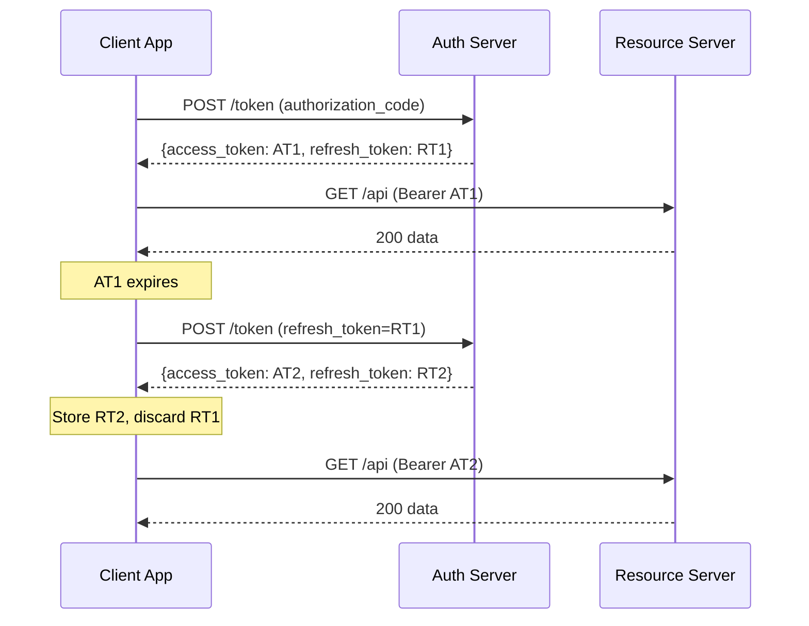

⚡ TL;DR - A refresh token is a long-lived credential issued
alongside the access token that allows a client to obtain new
access tokens silently, without requiring the user to re-
authorize. Access tokens are short-lived (15-60 min) for
security; the refresh token bridges the gap for long-running
sessions (days to months). The key security constraint: refresh
tokens must be stored securely (not in localStorage or cookies
that JS can read) because they are more powerful than access
tokens - a stolen refresh token provides long-term access.

---

### 🔥 The Problem This Solves

**THE CORE TENSION:**

Short access token TTL (15 minutes) is good security practice:
a stolen access token is usable only for 15 minutes. But users
expect sessions that last for hours or days without repeated
logins. If every access token expiry required a new full
authorization flow (browser redirect to AS, login, consent),
users would constantly be interrupted. The refresh token is
the bridge: a long-lived credential that can silently renew
access tokens, maintaining the short-TTL security property
while enabling long user sessions.

**WHY NOT JUST USE LONG-LIVED ACCESS TOKENS?**

A long-lived access token (e.g., 24h TTL) is presented to
every Resource Server on every API call. Every RS logs it,
caches it, and processes it. A single compromise of any RS
(or its logs) leaks an access token with hours of remaining
validity. The refresh token is different: it is ONLY sent
to the Authorization Server token endpoint, never to Resource
Servers. Its exposure surface is a single endpoint, not the
entire API estate.

**THE INVENTION MOMENT:**

The refresh token creates an asymmetric risk model: access
tokens are high-exposure (sent everywhere, short TTL), refresh
tokens are low-exposure (sent only to AS token endpoint,
long TTL). This separation allows short access token TTL
without breaking user experience.

---

### 📘 Textbook Definition

A refresh token (RFC 6749 §6) is a credential issued to the
client by the Authorization Server, used to obtain new access
tokens when the current access token expires or becomes
invalid, without requiring new user interaction. Refresh tokens
have a longer lifetime than access tokens (provider-configurable:
typically hours to months). They are sent ONLY to the AS token
endpoint with `grant_type=refresh_token`. They are not sent to
Resource Servers. Refresh token rotation (RFC 6749 §10.4 best
practice, now widely implemented): a new refresh token is
issued on every refresh call and the old one is invalidated.
Refresh token reuse detection: if an old (previously rotated)
refresh token is presented, the AS invalidates the entire token
family, detecting a possible token compromise. Refresh tokens
are NOT issued by the Client Credentials flow (no user session
to maintain) and may be omitted by AS configuration for other
flows.

---

### ⏱️ Understand It in 30 Seconds

**One line:**
A refresh token lets your app get new access tokens silently
when the old ones expire, so users stay logged in for days
without interruption.

**One analogy:**

> An access token is like a day pass to a theme park: it lets
> you in for the day (short TTL), then expires. The refresh
> token is like a season pass: you use it only at the main
> gate (token endpoint) to get new day passes. The season pass
> is never shown to the ride operators (Resource Servers) -
> only the day pass is. If you lose your day pass, someone
> has it for at most one day. If you lose your season pass,
> you call the park (revoke at AS) to cancel it.

**One insight:**
The most important thing about refresh tokens is WHERE they
go: only to the AS token endpoint. If you find code that
sends a refresh_token to an API endpoint, that is a
critical security bug.

---

### ⚙️ How It Works (Mechanism)

**Refresh token lifecycle:**

```
┌───────────────────────────────────────────────────────┐
│  REFRESH TOKEN LIFECYCLE                               │
├───────────────────────────────────────────────────────┤
│                                                       │
│  [ISSUANCE]                                           │
│  POST /token (authorization_code grant)               │
│  → Response: {                                        │
│      access_token: "eyJ...",   ← TTL: 15-60 min      │
│      refresh_token: "abc123",  ← TTL: days-months     │
│      expires_in: 3600,                                │
│    }                                                  │
│                                                       │
│  [STORAGE]                                            │
│  Client stores refresh_token securely:                │
│    Server-side: encrypted in database                 │
│    Mobile: platform secure enclave (Keychain/Keystore)│
│    SPA: httpOnly cookie (server-managed)              │
│    NEVER: localStorage, URL params, log files         │
│                                                       │
│  [USAGE - when access_token expires]                  │
│  POST /token                                          │
│    grant_type=refresh_token                           │
│    refresh_token=abc123                               │
│    client_id=CLIENT_ID                                │
│    client_secret=CLIENT_SECRET (confidential clients) │
│  → Response:                                          │
│    {                                                  │
│      access_token: "eyJ...(new)",   ← new token       │
│      refresh_token: "def456",       ← ROTATED!        │
│      expires_in: 3600,                                │
│    }                                                  │
│  Client: store def456, discard abc123                 │
│                                                       │
│  [REVOCATION]                                         │
│  POST /revoke with token=abc123                       │
│  → AS invalidates token family                        │
│                                                       │
│  [REUSE DETECTION]                                    │
│  If abc123 (old rotated token) is presented again:    │
│  → AS detects reuse → invalidates entire token family │
│  → Both legitimate client AND attacker lose access    │
│  → User must re-authorize                             │
└───────────────────────────────────────────────────────┘
```



**Refresh token rotation and reuse detection:**

```
Token family: [RT1 → RT2 → RT3]

Legitimate client:
  Uses RT1 → gets RT2 (RT1 invalidated)
  Uses RT2 → gets RT3 (RT2 invalidated)
  Uses RT3 → gets RT4 (RT3 invalidated)

Attack: attacker steals RT1 (before rotation)
  Attacker uses RT1:
    If client already used RT1 → RT2 was issued
    RT1 is a "used" token
    AS detects reuse → INVALIDATES ENTIRE FAMILY
    RT2, RT3, RT4 all revoked
    Both attacker AND legitimate client lose access
    User must re-authenticate
    Security alert generated

Result: Reuse detection turns token theft into a
detectable event, not a silent long-term compromise.
```

---

### 💻 Code Example

**Example 1 - BAD then GOOD: Refresh token storage:**

```python
# BAD: Storing refresh token in localStorage
# Any XSS script can steal this:
import json

def store_tokens_bad(token_response):
    # WRONG: Exposes long-lived token to XSS
    localStorage.setItem(
        'refresh_token',
        token_response['refresh_token']
    )
    localStorage.setItem(
        'access_token',
        token_response['access_token']
    )
```

```python
# GOOD: Refresh token in httpOnly cookie (server-managed)
# Access token in memory only.
# WHY: httpOnly cookie = not accessible to JavaScript at all,
#   not even in XSS. Memory = cleared on page close.

from flask import make_response
import time

def store_tokens_good(response, token_data: dict):
    """Store tokens: RT in httpOnly cookie, AT in memory."""
    refresh_token = token_data.get('refresh_token')
    if refresh_token:
        # httpOnly: JS cannot read this cookie
        # Secure: only sent over HTTPS
        # SameSite=Lax: CSRF protection for cookie
        response.set_cookie(
            'refresh_token',
            refresh_token,
            httponly=True,
            secure=True,
            samesite='Lax',
            max_age=30 * 24 * 3600,  # 30 days
            path='/auth/',  # Only sent to auth endpoints
        )

    # Access token returned to JS in response body (in memory)
    # Client stores ONLY in JS memory (not localStorage)
    return {
        'access_token': token_data['access_token'],
        'expires_in': token_data.get('expires_in', 3600),
        'granted_scope': token_data.get('scope', ''),
        # refresh_token NOT included: stays in httpOnly cookie
    }
    # WHAT BREAKS: SameSite=Lax may block cookie in
    #   cross-site POST requests. For cross-origin SPAs,
    #   use SameSite=None (with Secure attribute).
```

**Example 2 - BAD then GOOD: Token refresh with rotation:**

```python
# BAD: Discard new refresh_token, keep using old one
# This breaks after the first refresh (old token invalidated)
# and cannot detect compromise via reuse detection.

def refresh_tokens_bad(old_refresh_token: str) -> str:
    response = requests.post(TOKEN_ENDPOINT, data={
        'grant_type': 'refresh_token',
        'refresh_token': old_refresh_token,
        'client_id': CLIENT_ID,
    })
    data = response.json()
    new_access = data['access_token']
    # BUG: ignores data.get('refresh_token')
    # After rotation: old token is invalidated.
    # Next refresh attempt with old token → error.
    return new_access
```

```python
# GOOD: Atomic storage of new token + discard old one
# WHY: Rotation is atomic: if you store new RT and old is
#   invalidated, you must use new RT next time. Any failure
#   to atomically update = loss of session.

import threading

class TokenStore:
    def __init__(self):
        self._lock = threading.Lock()
        self._refresh_token = None
        self._access_token = None
        self._expires_at = 0.0

    def set_tokens(self, access: str,
                   refresh: str | None,
                   expires_in: int):
        with self._lock:
            self._access_token = access
            if refresh:
                # MUST update refresh token atomically
                self._refresh_token = refresh
            self._expires_at = time.time() + expires_in - 30

    def needs_refresh(self) -> bool:
        return time.time() >= self._expires_at

    def do_refresh(self) -> bool:
        with self._lock:
            if not self._refresh_token:
                return False  # No refresh token (e.g., CC flow)
            try:
                resp = requests.post(TOKEN_ENDPOINT, data={
                    'grant_type': 'refresh_token',
                    'refresh_token': self._refresh_token,
                    'client_id': CLIENT_ID,
                    'client_secret': CLIENT_SECRET,
                })
                resp.raise_for_status()
                data = resp.json()
                # Atomically update both tokens
                self.set_tokens(
                    access=data['access_token'],
                    refresh=data.get('refresh_token'),
                    expires_in=data.get('expires_in', 3600)
                )
                return True
            except requests.HTTPError as e:
                if e.response.status_code == 400:
                    # invalid_grant: refresh token expired or
                    # revoked (or reuse detected)
                    self._refresh_token = None
                    return False  # Must re-authorize
                raise
    # WHAT BREAKS: Race condition if two threads both
    #   detect refresh needed simultaneously → duplicate
    #   refresh calls. Lock prevents this, but distributed
    #   systems need distributed locking or leader election.
```

**Example 3 - Refresh token revocation on logout:**

```python
# Revoke BOTH tokens on logout (refresh first)
def logout(token_store: TokenStore):
    config = get_oidc_config(ISSUER)
    revoke_url = config.get('revocation_endpoint')
    if not revoke_url:
        # AS doesn't support RFC 7009 revocation
        # Just clear local tokens - they'll expire naturally
        token_store.clear()
        return

    # Revoke refresh token first
    # (can generate new access tokens - higher priority)
    if rt := token_store.get_refresh_token():
        requests.post(revoke_url,
            data={
                'token': rt,
                'token_type_hint': 'refresh_token'
            },
            auth=(CLIENT_ID, CLIENT_SECRET)
        )

    # Revoke access token
    if at := token_store.get_access_token():
        requests.post(revoke_url,
            data={
                'token': at,
                'token_type_hint': 'access_token'
            },
            auth=(CLIENT_ID, CLIENT_SECRET)
        )

    token_store.clear()
    # NOTE: After revocation, JWT access tokens may still be
    # valid locally (until exp) if RS doesn't check revocation.
    # Short TTL is the defense - expired access tokens are
    # harmless even if not revocation-checked.
```

---

### ⚖️ Comparison Table

| Token Type | Lifetime | Sent To | Stored In | Revocation Takes Effect |
|---|---|---|---|---|
| **Access token** | 15-60 min | Resource Servers (every API call) | Memory | At expiry (no revocation check in JWT RS) |
| **Refresh token** | Days to months | AS token endpoint only | Secure storage (httpOnly / Keychain) | Immediately (AS tracks state) |

---

### 🔁 Flow / Lifecycle

```
ISSUED:
  After successful auth code exchange or device auth
  Stored securely by client

USED:
  When access_token expires (expires_in seconds)
  POST /token (grant_type=refresh_token)
  → New access_token + new refresh_token (rotation)
  → Atomically store new RT, discard old RT

EXPIRED:
  AS-defined TTL (hours to months)
  OR user inactivity (sliding window TTL)
  After expiry: 400 invalid_grant on refresh
  Client: clear tokens, re-authorize (full login flow)

REVOKED:
  POST /revoke (on logout)
  OR AS invalidates on password change / security event
  OR Reuse detection triggers family invalidation
  After revocation: immediate 400 invalid_grant on refresh
```

---

### ⚠️ Common Misconceptions

| Misconception | Reality |
|---|---|
| The refresh token TTL is returned in the token response | The refresh token TTL is NOT returned in the standard token response. The `expires_in` field is the ACCESS token TTL. Refresh token TTL is AS-configured (varies from hours to months) and must be documented per provider. |
| Refresh tokens are just long-lived access tokens | Refresh tokens are fundamentally different: they are NOT sent to Resource Servers, they are ONLY sent to the AS token endpoint. They don't contain resource authorization claims. They are credentials for obtaining access tokens. |
| Client Credentials flow should use refresh tokens for M2M services | Client Credentials does not issue refresh tokens (there is no user session). M2M services should cache the access token until `expires_in - buffer` seconds, then get a new one via a fresh Client Credentials grant. |
| Refresh token rotation is optional and minor | Rotation + reuse detection converts a stolen refresh token from "long-term silent access" into "detectable compromise with session invalidation." This is a critical security property for long-lived refresh tokens. Providers that don't rotate (e.g., older OAuth providers) are significantly more vulnerable to refresh token theft. |

---

### 🚨 Failure Modes & Diagnosis

**Refresh Token Rotation Race Condition (Distributed Apps)**

**Symptom:**
In a horizontally-scaled application with 3+ instances, after
a token refresh, some requests start failing with
`invalid_grant` on subsequent refresh attempts. Logs show
the same refresh token being exchanged by two different
instances at the same time.

**Root Cause:**
Two app instances both detect the access token is expired
simultaneously and both attempt to use the same refresh token.
One succeeds and gets a new refresh token; the other gets
the new refresh token too (some AS allow a brief tolerance
window) OR gets `invalid_grant` (token already used). Worse:
if both get responses, instance A stores the first new RT and
instance B stores the second new RT. Both become inconsistent.

**Diagnostic:**

```bash
# Look for multiple refresh attempts from different
# instances at similar timestamps:
grep "grant_type=refresh_token" api-access-log.txt | \
  sort -k3 | \
  awk '{print $1, $3}' | \
  sort -k2 | \
  uniq -Df 1
# Multiple entries at same timestamp = race condition

# Check distributed lock implementation:
# Is there a Redis SETNX or similar before refresh call?
```

**Fix:**
Implement distributed locking before refresh calls. Use Redis
`SET key NX PX 30000` (acquire lock) before attempting refresh.
Only one instance proceeds; others wait and use the already-
refreshed token when the lock is released. Or use a dedicated
token service that serializes all refresh calls.

---

**Refresh Token Lost After Rotation (Session Broken)**

**Symptom:**
Users report being logged out after one day of usage. Logs show
refresh token exchange succeeds (200 from AS), but the next
refresh attempt returns `invalid_grant`. Investigation shows
the app is not storing the new refresh token from rotation
responses.

**Root Cause:**
App code processes token refresh but only stores the new
`access_token`, ignoring the new `refresh_token` in the
rotation response. After first refresh: old RT invalidated,
new RT not stored → session lost on next refresh.

**Diagnostic:**

```bash
# Check token exchange response handling:
grep -A10 "grant_type=refresh_token" src/ --include="*.py" -r
# Verify: is data['refresh_token'] stored after exchange?
# If code only stores data['access_token'] → this is the bug
```

**Fix:**

```python
data = token_response.json()
# MUST store new refresh_token if present (rotation):
new_rt = data.get('refresh_token')
if new_rt:
    store_refresh_token(new_rt)  # Overwrites old RT
```

---

### 🔗 Related Keywords

**Prerequisites:**
- `Access Token` - what the refresh token produces
- `Token Response Structure` - where refresh_token appears

**Builds On:**
- `Refresh Token Rotation` - the security mechanism around RT
- `Token Revocation` - how to invalidate a refresh token
- `Silent Authentication` - using refresh tokens in SPA flows

---

### 📌 Quick Reference Card

```
┌──────────────────────────────────────────────────────────┐
│ WHAT IT IS   │ Long-lived credential for silent AT renewal│
├──────────────┼───────────────────────────────────────────┤
│ SENT TO      │ AS token endpoint ONLY (never APIs/RS)    │
├──────────────┼───────────────────────────────────────────┤
│ STORE IN     │ httpOnly cookie (SPA) / Keychain (mobile) │
│              │ Encrypted DB (server) - NEVER localStorage│
├──────────────┼───────────────────────────────────────────┤
│ ROTATION     │ New RT issued on every refresh call;      │
│              │ old RT invalidated. Store new, discard old│
├──────────────┼───────────────────────────────────────────┤
│ REUSE DETECT │ Old RT presented after rotation →         │
│              │ AS revokes entire token family.           │
│              │ Turns theft into detectable event.        │
├──────────────┼───────────────────────────────────────────┤
│ EXPIRES      │ TTL NOT in response; AS-configured.       │
│              │ 400 invalid_grant = expired or revoked.   │
├──────────────┼───────────────────────────────────────────┤
│ LOGOUT       │ POST /revoke with refresh_token first     │
│              │ (more powerful - can generate new AT)     │
├──────────────┼───────────────────────────────────────────┤
│ CC FLOW      │ No refresh token (no user session)        │
├──────────────┼───────────────────────────────────────────┤
│ ONE-LINER    │ "Season pass to get day passes; never     │
│              │  shown to ride operators (RS)."           │
└──────────────────────────────────────────────────────────┘
```

**If you remember only 3 things:**

1. Refresh tokens go ONLY to the AS token endpoint - never to
   Resource Servers (APIs). Sending a refresh token to an API
   is a critical security bug.

2. Rotation: always store the NEW refresh token from the refresh
   response. Old token is invalidated. Discard old, store new,
   atomically.

3. `invalid_grant` on refresh = expired or revoked (or reuse
   detected). Clear tokens and trigger full re-authorization.

**Interview one-liner:**
"A refresh token is a long-lived credential used ONLY at the
AS token endpoint to silently renew short-lived access tokens.
Refresh token rotation issues a new RT on every exchange and
invalidates the old one; reuse of an old token indicates theft
and triggers family revocation. Stored in httpOnly cookies
or secure enclaves - never localStorage. Not issued in Client
Credentials flow."

---

### ✅ Mastery Checklist

**You've mastered this when you can:**

1. **[IMPLEMENT]** Build a thread-safe token refresh mechanism
   that handles: proactive refresh scheduling (30s before
   expiry), rotation (stores new RT, discards old), and
   `invalid_grant` error handling (clear and re-authorize).

2. **[EXPLAIN]** Explain refresh token reuse detection: what
   event triggers it, what the AS does in response, what the
   user experiences, and why this is the correct security
   behavior for a stolen refresh token.

3. **[DIAGNOSE]** Debug a production issue where users report
   being logged out after their first token refresh. Identify
   the most likely root cause (RT rotation not persisted) and
   describe the fix.
