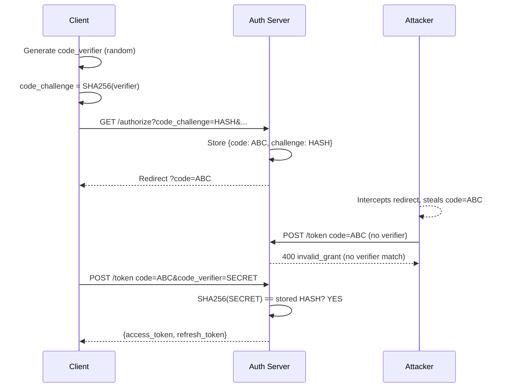
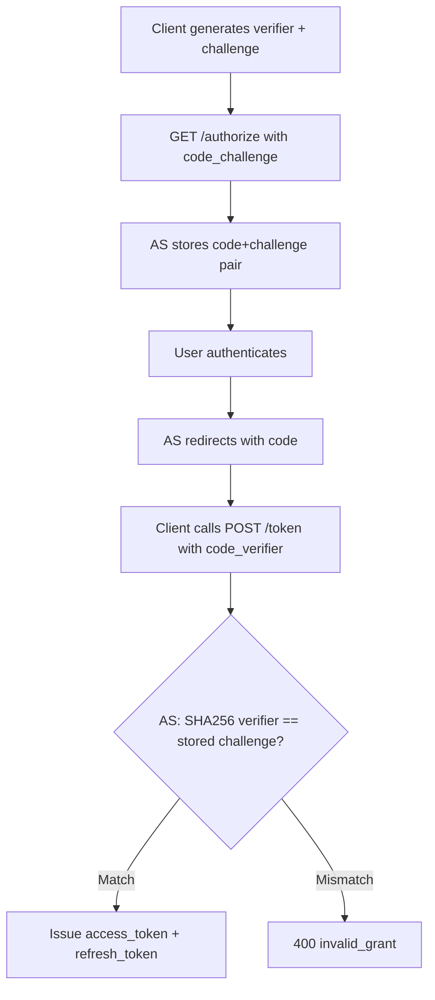

⚡ TL;DR - PKCE (RFC 7636) extends the Authorization Code flow
to prevent authorization code interception attacks. Before
redirecting to the AS, the client generates a random secret
(`code_verifier`), hashes it (SHA256 = `code_challenge`), and
sends the hash with the authorization request. When exchanging
the code for tokens, the client sends the original verifier.
The AS verifies SHA256(verifier) == stored challenge. Because
an intercepting attacker has only the code (not the verifier),
they cannot exchange the code for tokens. PKCE is now required
for all public clients and recommended even for confidential
clients.

---

### 🔥 The Problem This Solves

**THE ATTACK PKCE PREVENTS:**

Before PKCE, the Authorization Code flow had a critical
vulnerability for mobile and native apps: authorization code
interception. On mobile platforms, multiple apps can register
the same custom URI scheme (e.g., `myapp://callback`). When
the authorization server redirects to `myapp://callback?code=
ABC`, the operating system does not guarantee which app receives
the redirect. A malicious app registered with the same scheme
can intercept the redirect and receive the authorization code.

Without PKCE, that is all the malicious app needs. It sends the
stolen code to the token endpoint with the legitimate client_id
(which is public in the authorization request URL) and gets
tokens. The victim app gets an error; the attacker gets access.

**WHY PKCE WORKS:**

PKCE binds the authorization code to a cryptographic commitment.
The `code_challenge` in the authorization request is a SHA256
hash of the `code_verifier`. The attacker gets the authorization
code but NOT the code_verifier (it was never sent over the
front channel). Without the verifier, the stolen code is
worthless - the token endpoint rejects it because SHA256
(unknown) != stored challenge.

**EVOLUTION BEYOND MOBILE:**

PKCE was designed for mobile apps (RFC 7636, 2015) but is now
required for ALL public clients and recommended for confidential
clients too (OAuth 2.0 Security BCP, RFC 9700). Even for
confidential clients, PKCE prevents code injection attacks
where an attacker injects a code from one authorization into
another client's flow.

---

### 📘 Textbook Definition

PKCE (Proof Key for Code Exchange, RFC 7636) is an extension
to the Authorization Code grant type that mitigates
authorization code interception attacks. The client creates a
cryptographically random value (`code_verifier`), derives a
challenge from it (`code_challenge` = BASE64URL(SHA256
(ASCII(code_verifier))), and sends the challenge in the
authorization request. The verifier is sent (only once) in
the token request. The Authorization Server stores the challenge
with the authorization code, verifies the verifier at token
exchange, and rejects any request that fails the check.
RFC 7636 defines two methods: `S256` (SHA256 hash, required)
and `plain` (no hash, only for clients that cannot perform
SHA256, strongly discouraged). OAuth 2.0 Security BCP (RFC
9700) requires PKCE for all clients using Authorization Code
flow.

---

### ⏱️ Understand It in 30 Seconds

**The one-sentence mechanism:**

> "Send a hash of a secret with the authorization request;
> prove you know the secret when you exchange the code.
> An attacker who intercepts the code cannot exchange it
> without the secret."

**The cryptographic commitment analogy:**

> PKCE is a commitment scheme. Before the auth request,
> the client commits to a random value by sending its hash.
> At token exchange, the client reveals the value. The AS
> verifies the commitment. An adversary who sees only the
> commitment (hash) cannot produce the preimage (verifier)
> due to the preimage resistance of SHA256.

**One table:**

```
                 AUTHORIZATION REQUEST  TOKEN REQUEST
code_verifier    NO (stays local)       YES (sent to AS)
code_challenge   YES (hash only)        NO (already stored)

ATTACKER at front channel: sees code + code_challenge (hash)
ATTACKER at token endpoint: has code, has hash, NOT the verifier
RESULT: SHA256(unknown) != stored hash → 400 invalid_grant
```

---

### 🔩 First Principles Explanation

**THE CRYPTOGRAPHIC INVARIANTS:**

1. `code_verifier`: A cryptographically random string of 43-128
   characters from the unreserved character set [A-Z a-z 0-9
   - . _ ~]. Generated fresh per authorization request. Never
   transmitted in the front channel.

2. `code_challenge`: `BASE64URL(SHA256(ASCII(code_verifier)))`.
   Sent in the authorization request. Does not reveal the
   verifier due to SHA256 preimage resistance.

3. At token exchange: AS computes SHA256(verifier) and compares
   to stored challenge. Match = legitimate client. Mismatch =
   attacker with stolen code.

**THE SECURITY PROPERTY:**

PKCE provides per-authorization-request client authentication
for public clients. Unlike `client_secret` (static, known to
all copies of the app), the PKCE verifier is generated fresh
per request. Stealing one verifier does not help with future
authorization requests. This is the key advantage over static
secrets: each authorization is independently protected.

**WHY S256 ONLY:**

The `plain` method (where code_challenge == code_verifier) was
included in RFC 7636 for environments that cannot perform SHA256
(some embedded systems circa 2015). The plain method provides
no protection if the authorization request is visible to the
attacker - they already have the verifier. In 2025, all
environments that can perform OAuth can perform SHA256. Never
use `plain`.

---

### 🧠 Mental Model / Analogy

> PKCE is a locked envelope system. Before starting the
> authorization: the client writes a secret word on a note
> and seals it in an envelope (code_verifier → locked, not
> sent). The client writes the first letter of each word on
> the outside of the envelope (code_challenge = hash, sent
> to AS). The AS stores the envelope's outside notation.
> At token exchange: the client opens the envelope and reads
> the secret word (sends code_verifier). The AS checks:
> does the secret word match the notation on the outside?
> An attacker who intercepted the code only saw the notation
> on the outside (hash). They cannot forge the secret word.

---

### 📶 Gradual Depth - Five Levels

**Level 1 - What it is (anyone):**
PKCE makes the login code unusable by anyone except the app
that started the login. It does this by having the app generate
a one-time secret before starting login and prove it knows
the secret when finishing login.

**Level 2 - How to add it (developer):**
1. Generate random `code_verifier` (64 chars, random)
2. SHA256 hash it → `code_challenge`
3. Add to authorization request: `code_challenge=<hash>&
   code_challenge_method=S256`
4. Add to token request: `code_verifier=<original_secret>`
5. Store verifier in server session (or sessionStorage for SPA)

**Level 3 - How it works (mid-level):**
The AS stores the (code_challenge, authorization_code) pair
when issuing the authorization code. At token exchange, the AS
computes SHA256(received_verifier) and compares to the stored
challenge. If they match, the token request is from the
same entity that initiated the authorization. If not, reject
with `invalid_grant`.

**Level 4 - Why it was designed this way (senior):**
PKCE was added to the original Authorization Code flow rather
than creating a new flow because backward compatibility with
AS infrastructure was paramount. An AS that supports
Authorization Code needs only to add PKCE validation logic at
the token endpoint - existing redirect, session, and code
infrastructure is unchanged. This made adoption fast: libraries
added PKCE support as a small incremental change, and AS
vendors could enable it via configuration rather than
infrastructure redesign.

**Level 5 - Mastery (staff/principal):**
PKCE for confidential clients addresses code injection attacks
that are distinct from the interception attack PKCE solves for
public clients. In a code injection attack, an attacker who has
legitimately obtained an authorization code for their own
session (by being a legitimate user) injects that code into
another user's token exchange request (via CSRF or session
fixation). Without PKCE, if both use the same client_id and
the AS does not bind the code to a specific browser session,
the injection may succeed. PKCE prevents this: the injected
code has a different code_challenge than the victim's current
flow verifier, so AS rejects it. OAuth 2.0 Security BCP
(RFC 9700) requires PKCE for all clients for this reason -
not just public clients.

---

### ⚙️ How It Works (Mechanism)

**Complete PKCE flow with protocol details:**

```
┌───────────────────────────────────────────────────────┐
│  PKCE AUTHORIZATION CODE FLOW                         │
├───────────────────────────────────────────────────────┤
│                                                       │
│  CLIENT PREPARATION (before redirect):                │
│                                                       │
│  code_verifier = random_bytes(32).encode('base64url') │
│    = "dBjftJeZ4CVP-mB92K27uhbUJU1p1r_wW1gFWFOEjXk"   │
│                                                       │
│  code_challenge = base64url(sha256(code_verifier))    │
│    sha256("dBjftJeZ4CVP-...") = <32 bytes>            │
│    base64url(<32 bytes>)                              │
│    = "E9Melhoa2OwvFrEMTJguCHaoeK1t8URWbuGJSstw-cM"   │
│                                                       │
│  STEP 1 - Authorization Request (front channel):      │
│                                                       │
│  GET /authorize?                                      │
│    response_type=code                                 │
│    &client_id=CLIENT_ID                               │
│    &redirect_uri=REDIRECT_URI                         │
│    &scope=openid email                                │
│    &state=xyz789     (CSRF nonce)                     │
│    &code_challenge=E9Melhoa2OwvFrEMTJguCHaoeK...     │
│    &code_challenge_method=S256                        │
│                                                       │
│  AS stores: {code: ABC, challenge: E9Mel...}          │
│  AS redirects: REDIRECT_URI?code=ABC&state=xyz789     │
│                                                       │
│  STEP 2 - Token Request (back channel):               │
│                                                       │
│  POST /token                                          │
│    grant_type=authorization_code                      │
│    &code=ABC                                          │
│    &redirect_uri=REDIRECT_URI                         │
│    &client_id=CLIENT_ID                               │
│    &code_verifier=dBjftJeZ4CVP-mB92K27uhbUJU1p...   │
│                                                       │
│  AS validates:                                        │
│    sha256("dBjftJeZ4CVP-mB92K27...") =                │
│      "E9Melhoa2OwvFrEMTJguCHaoeK..."                  │
│    MATCH! → Issue tokens                              │
│                                                       │
│  ATTACK SCENARIO:                                     │
│    Attacker intercepts redirect: code=ABC             │
│    Attacker calls token endpoint:                     │
│      grant_type=authorization_code                    │
│      &code=ABC                                        │
│      &client_id=CLIENT_ID                             │
│      &code_verifier=UNKNOWN                           │
│    AS validates: sha256(UNKNOWN) != E9Mel...          │
│    → 400 invalid_grant. Code is worthless.            │
└───────────────────────────────────────────────────────┘
```



---

### 💻 Code Example

**Example 1 - BAD then GOOD: PKCE implementation:**

```python
# BAD: Authorization Code without PKCE for public client
# No protection against code interception.
# AS cannot verify the client that started the flow.
def start_auth_bad():
    state = secrets.token_urlsafe(16)
    url = (
        f"{AUTHORIZE_URL}?response_type=code"
        f"&client_id={CLIENT_ID}"
        f"&redirect_uri={REDIRECT_URI}"
        f"&scope=openid email"
        f"&state={state}"
        # MISSING: &code_challenge=...
        # MISSING: &code_challenge_method=S256
    )
    session['state'] = state
    return url

# BAD: Using plain method (no hash - no protection)
code_challenge = code_verifier  # WRONG: plain == no hash
code_challenge_method = 'plain' # WRONG: offers no security
```

```python
# GOOD: Full PKCE implementation with S256
# WHY: S256 is SHA256 hash - preimage resistant.
#   Attacker with code_challenge cannot compute verifier.
import secrets, hashlib, base64

def generate_pkce_pair() -> tuple[str, str]:
    """Return (code_verifier, code_challenge) pair."""
    # Verifier: 43-128 chars, unreserved charset
    # 32 random bytes → 43 base64url chars (no padding)
    code_verifier = (
        base64.urlsafe_b64encode(secrets.token_bytes(32))
        .rstrip(b'=')
        .decode('ascii')
    )
    # Challenge: BASE64URL(SHA256(ASCII(verifier)))
    digest = hashlib.sha256(
        code_verifier.encode('ascii')
    ).digest()
    code_challenge = (
        base64.urlsafe_b64encode(digest)
        .rstrip(b'=')
        .decode('ascii')
    )
    return code_verifier, code_challenge

def start_auth(session: dict) -> str:
    code_verifier, code_challenge = generate_pkce_pair()
    state = secrets.token_urlsafe(32)

    # Store in server-side session (NOT query params or URL)
    session['pkce_verifier'] = code_verifier
    session['oauth_state'] = state

    params = {
        'response_type': 'code',
        'client_id': CLIENT_ID,
        'redirect_uri': REDIRECT_URI,
        'scope': 'openid email',
        'state': state,
        'code_challenge': code_challenge,
        'code_challenge_method': 'S256',  # Always S256
    }
    return f"{AUTHORIZE_URL}?" + urllib.parse.urlencode(params)
    # WHAT BREAKS: Storing code_verifier in cookie or localStorage
    #   instead of server session - attacker can steal verifier
    #   from cookie/storage, making PKCE protection worthless
    # HOW TO TEST: Submit code + wrong verifier → invalid_grant

def handle_callback(code: str, state: str,
                    session: dict) -> dict:
    # Verify state first (CSRF)
    if state != session.get('oauth_state'):
        raise SecurityError("State mismatch - possible CSRF")

    code_verifier = session.pop('pkce_verifier', None)
    if not code_verifier:
        raise SecurityError("No code verifier in session")

    return exchange_code(code, code_verifier)

def exchange_code(code: str, verifier: str) -> dict:
    resp = requests.post(TOKEN_URL, data={
        'grant_type': 'authorization_code',
        'code': code,
        'redirect_uri': REDIRECT_URI,
        'client_id': CLIENT_ID,
        # No client_secret for public client
        'code_verifier': verifier,  # PKCE proof
    })
    if resp.status_code == 400:
        error = resp.json().get('error')
        if error == 'invalid_grant':
            raise AuthError("Code expired or PKCE mismatch")
    resp.raise_for_status()
    return resp.json()
```

**Example 2 - PKCE for SPA (browser JavaScript):**

```javascript
// PKCE in browser: subtle.crypto for SHA256
// WHY: window.crypto.subtle is available in all modern
//   browsers and provides secure randomness + SHA256

async function generatePKCE() {
  // Generate code_verifier
  const array = new Uint8Array(32);
  window.crypto.getRandomValues(array);
  const verifier = btoa(String.fromCharCode(...array))
    .replace(/\+/g, '-')
    .replace(/\//g, '_')
    .replace(/=/g, '');

  // Generate code_challenge = BASE64URL(SHA256(verifier))
  const encoder = new TextEncoder();
  const data = encoder.encode(verifier);
  const digest = await window.crypto.subtle.digest(
    'SHA-256', data
  );
  const challenge = btoa(
    String.fromCharCode(...new Uint8Array(digest))
  )
    .replace(/\+/g, '-')
    .replace(/\//g, '_')
    .replace(/=/g, '');

  return { verifier, challenge };
}

async function startAuth() {
  const { verifier, challenge } = await generatePKCE();
  const state = Array.from(
    window.crypto.getRandomValues(new Uint8Array(16))
  ).map(b => b.toString(16).padStart(2, '0')).join('');

  // Store verifier in sessionStorage (NOT localStorage)
  // sessionStorage: cleared on tab close, not persistent
  sessionStorage.setItem('pkce_verifier', verifier);
  sessionStorage.setItem('oauth_state', state);

  const params = new URLSearchParams({
    response_type: 'code',
    client_id: CLIENT_ID,
    redirect_uri: REDIRECT_URI,
    scope: 'openid email',
    state,
    code_challenge: challenge,
    code_challenge_method: 'S256',
  });

  window.location.href = `${AUTH_URL}?${params}`;
  // WHAT BREAKS: sessionStorage not available in iframes
  //   or if third-party cookie restrictions block it.
  //   For cross-frame flows, use BFF pattern instead.
}
```

**Example 3 - AS-side PKCE validation (understanding the verification):**

```python
# Authorization Server perspective:
# How PKCE is validated at the token endpoint
# (Reference implementation for understanding)

def validate_pkce(
    stored_challenge: str,  # From /authorize request
    received_verifier: str  # From /token request
) -> bool:
    """Verify PKCE: SHA256(verifier) == challenge."""
    import hashlib, base64

    # Always use S256 method (reject 'plain')
    computed = hashlib.sha256(
        received_verifier.encode('ascii')
    ).digest()
    computed_challenge = (
        base64.urlsafe_b64encode(computed)
        .rstrip(b'=')
        .decode('ascii')
    )

    # Constant-time comparison (prevent timing attacks)
    import hmac
    return hmac.compare_digest(
        computed_challenge.encode(),
        stored_challenge.encode()
    )
    # CRITICAL: Use constant-time comparison (hmac.compare_digest)
    # NOT: computed_challenge == stored_challenge
    # Early-exit comparison reveals timing information
    # that could be exploited to brute-force the challenge.

# Token endpoint logic (simplified):
def handle_token_request(request):
    code = request.form['code']
    verifier = request.form.get('code_verifier')

    # Look up stored auth code
    auth_code = get_auth_code(code)
    if not auth_code:
        return {'error': 'invalid_grant'}, 400

    # PKCE validation
    if auth_code.code_challenge:  # Challenge was set in /authorize
        if not verifier:
            return {'error': 'invalid_grant',
                    'error_description':
                        'code_verifier required'}, 400
        if not validate_pkce(auth_code.code_challenge, verifier):
            return {'error': 'invalid_grant',
                    'error_description':
                        'code_verifier mismatch'}, 400

    # Issue tokens...
```

---

### ⚖️ Comparison Table

| Security Property | Without PKCE | With PKCE (S256) |
|---|---|---|
| Code interception attack | Stolen code → stolen tokens | Stolen code → useless (no verifier) |
| Code injection attack | Possible (no per-flow binding) | Prevented (verifier bound to flow) |
| Works for public clients | No (no client auth method) | Yes (verifier = dynamic auth) |
| Pre-requisites | None | SHA256 capability (universal) |
| State parameter needed? | Yes (separate CSRF control) | Yes (different threat model - both needed) |

---

### 🔁 Flow / Lifecycle

```
1. Client generates: code_verifier + code_challenge
2. Client starts /authorize with code_challenge + method=S256
3. AS stores (code, code_challenge) pair at code issuance
4. User authenticates + consents
5. AS issues authorization code + redirects
6. Client sends code + code_verifier to /token
7. AS: SHA256(verifier) == stored challenge?
   YES → issue tokens
   NO  → 400 invalid_grant

IMPORTANT SEQUENCE:
   code_verifier NEVER leaves the client until /token call
   code_challenge is the only PKCE data in the front channel
```



---

### ⚠️ Common Misconceptions

| Misconception | Reality |
|---|---|
| PKCE replaces the `state` parameter | PKCE and state address different threats. PKCE prevents code interception (attacker steals code from redirect). State prevents CSRF (attacker tricks client into accepting a code they generated). Both are required. They protect different phases of the flow. |
| The `plain` method is acceptable when HTTPS protects the front channel | `plain` means code_challenge == code_verifier. If any intermediary (CDN log, Referer header, browser history) captures the authorization URL, the attacker has the verifier. S256 provides hash protection so the captured challenge is not the verifier. Use S256 only. |
| PKCE is only needed for mobile apps | RFC 9700 (OAuth 2.0 Security BCP) requires PKCE for ALL clients using Authorization Code flow, including confidential clients. For confidential clients, PKCE prevents code injection attacks in addition to interception. |
| Storing the code_verifier in localStorage is equivalent to storing it in a server session | localStorage is accessible to JavaScript on the page, including XSS-injected scripts. Storing the code_verifier in localStorage means an XSS attack can steal the verifier and combine it with an intercepted code. Server-side session or sessionStorage (with appropriate XSS protections) is correct. |

---

### 🚨 Failure Modes & Diagnosis

**PKCE Verifier Not Stored Across Redirect**

**Symptom:**
Authorization code exchange always fails with `invalid_grant`.
Logs show the AS validating PKCE and finding a mismatch. The
`code_verifier` in the token request is null or empty.

**Root Cause:**
The `code_verifier` generated before the redirect is stored
only in memory (local variable), not in a persistent store
(server session, database, or encrypted cookie). After the
redirect completes and the callback handler runs in a new
request context, the verifier is gone.

**Diagnostic:**

```python
# Check: is code_verifier stored in server session?
# In the authorization start handler:
code_verifier, code_challenge = generate_pkce_pair()
# Is this line present?
session['pkce_verifier'] = code_verifier  # Must exist

# In the callback handler:
verifier = session.get('pkce_verifier')
if verifier is None:
    # This is the bug: not stored in session
    pass
```

**Fix:**
Store `code_verifier` in the server-side session (not in memory,
URL params, or as a response to the browser) before the
redirect. Retrieve from session in the callback handler.
Pop after use (single-use).

---

**AS Does Not Require PKCE for Public Client**

**Symptom:**
Security audit finds that the application's Authorization Server
is configured to allow token exchange WITHOUT a
`code_verifier`, even though the application registers as a
public client. Authorization code interception attack is viable.

**Root Cause:**
AS was configured before PKCE was mandatory. Default
configuration does not enforce PKCE for public clients. Some
older AS configurations allow the `code_challenge` to be
omitted even for public clients.

**Diagnostic:**

```bash
# Test if AS enforces PKCE:
# Start auth without code_challenge:
curl -v "https://as.example.com/authorize?
  response_type=code
  &client_id=PUBLIC_CLIENT_ID
  &redirect_uri=https://app.example.com/callback
  &scope=openid"
# If this succeeds (does not error with invalid_request) →
# AS does not require PKCE for this client

# Exchange code WITHOUT code_verifier:
curl -X POST https://as.example.com/token \
  -d 'grant_type=authorization_code' \
  -d 'code=INTERCEPTED_CODE' \
  -d 'client_id=PUBLIC_CLIENT_ID' \
  -d 'redirect_uri=...'
# If this succeeds: PKCE is not enforced → vulnerability
```

**Fix:**
Configure AS to require `code_challenge` for all public client
authorization requests. In the AS configuration:
- Auth0: Applications → Advanced → "Require PKCE": ON
- Keycloak: Client settings → PKCE Code Challenge Method: S256
- Azure AD B2C: Enabled by default for public clients

---

### 🔗 Related Keywords

**Prerequisites:**
- `Authorization Code Flow` - PKCE is an extension to this flow
- `Public vs Confidential Clients` - why public clients need PKCE
- `State Parameter` - the complementary CSRF protection (different threat)

**Builds On:**
- `OAuth 2.0 Security Best Practices` - broader context for code security
- `Authorization Code Injection` - the attack PKCE prevents for
  confidential clients

---

### 📌 Quick Reference Card

```
┌──────────────────────────────────────────────────────────┐
│ VERIFIER     │ Random 43-128 char string                 │
│              │ Generated fresh per-authorization         │
│              │ NEVER sent in front channel               │
├──────────────┼───────────────────────────────────────────┤
│ CHALLENGE    │ BASE64URL(SHA256(verifier))               │
│              │ Sent in authorization request only        │
├──────────────┼───────────────────────────────────────────┤
│ METHOD       │ S256 ONLY (plain = no protection)         │
├──────────────┼───────────────────────────────────────────┤
│ AUTH REQUEST │ ?code_challenge=HASH                      │
│              │ &code_challenge_method=S256               │
├──────────────┼───────────────────────────────────────────┤
│ TOKEN REQUEST│ &code_verifier=ORIGINAL_SECRET            │
├──────────────┼───────────────────────────────────────────┤
│ STORE IN     │ Server session (server app)               │
│              │ sessionStorage (SPA - cleared on close)   │
│              │ NOT: localStorage, cookies JS can read    │
├──────────────┼───────────────────────────────────────────┤
│ REPLACES     │ Not state (different threat). Replaces    │
│              │ client_secret authentication for public   │
│              │ clients.                                  │
├──────────────┼───────────────────────────────────────────┤
│ REQUIRED FOR │ ALL public clients (RFC 7636)             │
│              │ Recommended for confidential (RFC 9700)   │
├──────────────┼───────────────────────────────────────────┤
│ ONE-LINER    │ "Send hash before; prove preimage after.  │
│              │  Stolen code is worthless without proof." │
└──────────────────────────────────────────────────────────┘
```

**If you remember only 3 things:**

1. Generate `code_verifier` (random), hash it → `code_challenge`
   (S256). Send challenge in auth request, verifier in token
   request. An intercepted code is useless without the verifier.

2. Use S256 only. Never `plain`. Store verifier in server session
   (server apps) or sessionStorage (SPA). Never localStorage.

3. PKCE and `state` solve different problems: PKCE prevents code
   interception (attacker steals code). State prevents CSRF
   (attacker forces a flow). Both are required.

**Interview one-liner:**
"PKCE prevents authorization code interception: before redirect,
the client generates a random verifier and sends SHA256(verifier)
as the code_challenge. At token exchange, the client sends the
verifier. An attacker who intercepted the code lacks the verifier
and cannot exchange it. Method must be S256 (plain provides no
protection). Required for all public clients; recommended for
confidential clients to prevent code injection."

---

### ✅ Mastery Checklist

**You've mastered this when you can:**

1. **[IMPLEMENT]** Implement complete PKCE from scratch
   in any language: generate cryptographically random
   code_verifier, compute S256 code_challenge, add both to
   the correct request phases, and validate at the AS.

2. **[EXPLAIN]** Explain to a developer why PKCE and state
   are both required even though both involve random values.
   What specific attack does each prevent? What happens if
   you have state but no PKCE? What happens if you have PKCE
   but no state?

3. **[AUDIT]** Review a code repository for PKCE
   implementation errors: wrong method (plain), verifier
   stored insecurely (localStorage), verifier not stored
   across redirect, challenge reuse across requests.
   Describe the security impact of each flaw.
