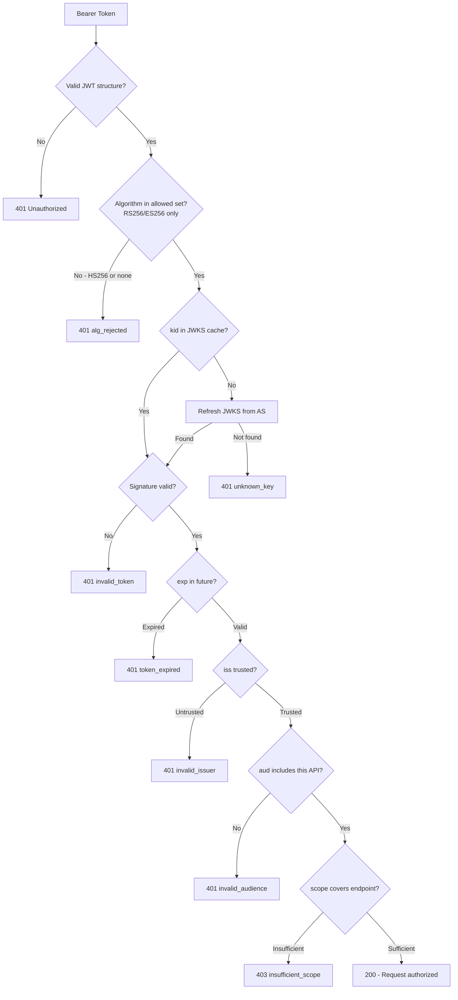

⚡ TL;DR - Token validation is the Resource Server's process of
verifying a bearer token before granting access. For JWT access
tokens: decode header, fetch/cache the JWKS signing key by
`kid`, verify the RS256 signature, check `exp` (not expired),
`iss` (trusted issuer), `aud` (this RS), then check `scope` for
the specific endpoint. All steps are mandatory - skipping any
one creates an exploitable vulnerability. For opaque tokens:
call the AS introspection endpoint instead. The complete
algorithm is the security contract between the AS and the RS.

---

### 🔥 The Problem This Solves

**THE TRUST PROBLEM:**

When an API (Resource Server) receives a request with
`Authorization: Bearer <token>`, it must answer: "Should I
trust this token and serve this request?" The token comes from
the client, not directly from the AS. Without validation, the
RS has no basis for trust. The validation algorithm is the
entire security contract: each step prevents a specific class
of attack. Skip one step = introduce a specific vulnerability.

**WHAT EACH STEP PREVENTS:**

```
Signature verification → forged tokens (attacker creates fake token)
exp check             → replayed expired tokens
iss check             → tokens from untrusted/attacker-controlled AS
aud check             → tokens intended for a different RS used here
scope check           → tokens with insufficient authorization
nbf check (if present)→ tokens used before valid period
```

**THE HARD PROBLEM:**

JWT validation SEEMS simple (just verify the signature) but
has many subtleties: algorithm confusion attacks (header says
`none` = no signature), key confusion attacks (HMAC vs RSA),
expired JWKS cache leading to key rotation failures, missing
`aud` check leading to confused deputy attacks, and `exp`
clock skew issues in distributed systems. Every one of these
has been a real-world vulnerability in production OAuth
deployments.

---

### 📘 Textbook Definition

Token validation is the process by which a Resource Server
(API) verifies an OAuth 2.0 access token before granting
access to a protected resource. For JWT access tokens (RFC
9068): validation includes decoding the header, retrieving
the signing key from the AS's JWKS endpoint (by `kid`),
verifying the signature using the correct algorithm, validating
`exp` (expiration), `nbf` (not before, if present), `iss`
(issuer), `aud` (audience), and checking the `scope` or
specific permission claims. For opaque tokens: call the AS
introspection endpoint (RFC 7662) which returns an
`active:true/false` response with associated claims.
The ID Token (OIDC) has an additional validation step:
the `nonce` claim must match the nonce sent in the
authorization request.

---

### ⏱️ Understand It in 30 Seconds

**The complete validation checklist:**

```
JWT VALIDATION ALGORITHM (all steps mandatory):
  1. Decode header → get alg + kid
  2. REJECT: alg=none, alg=HS256 (use RS256/RS384/ES256)
  3. Fetch JWKS → find key by kid
  4. Verify signature (RS256 or ES256)
  5. Check exp > now (not expired)
  6. Check nbf <= now (if present - not before)
  7. Check iss == expected issuer URL
  8. Check aud contains this RS's identifier
  9. Check scope for this endpoint's requirement
 10. Extract sub, user claims for business logic
```

**One insight:**
The `aud` (audience) claim is the most commonly skipped step.
Without `aud` validation, a token issued for API-A can be
presented to API-B and API-B will accept it if APIs A and B
share the same issuer. This is the "confused deputy" attack:
a token with limited permissions on API-A gets used for
sensitive operations on API-B.

---

### 🔩 First Principles Explanation

**WHY RS256 (NOT HS256):**

JWT can be signed with HMAC (HS256) or RSA/ECDSA (RS256/ES256).

HMAC (HS256): symmetric - same key signs AND verifies. If
the RS can verify, it can also FORGE tokens. In an OAuth
deployment, the RS should not be able to create tokens.
Using HS256 means sharing the signing secret with every
RS - a massive blast radius if any RS is compromised.

RSA/ECDSA (RS256/ES256): asymmetric - AS signs with private
key, RS verifies with public key (from JWKS). RS can never
forge tokens (no private key). JWKS is public - anyone can
verify, no secret to share. This is the correct model.

**THE `alg=none` VULNERABILITY:**

Early JWT libraries accepted `alg: "none"` in the header,
which means "unsigned JWT - no verification needed." If a
RS processes the algorithm from the token header rather than
hardcoding the expected algorithm, an attacker can forge a
token with `alg: "none"`, remove the signature, and get it
accepted. The fix: never trust the `alg` claim from the
token header. Always use the algorithm you expect (RS256 or
ES256) based on configuration.

**THE `aud` CONFUSED DEPUTY:**

If the RS does not check `aud`, a user can get a token for
a low-permission API and present it to a high-permission API.
The high-permission API sees a valid signature and valid
expiry and serves the request. The `aud` claim is the contract:
"this token is intended for THIS specific resource server."

---

### 🧠 Mental Model / Analogy

> JWT token validation is like airport security. The signature
> check is the passport control officer verifying the passport
> is real (not forged). The exp check is verifying the
> passport has not expired. The iss check is verifying the
> passport is from a country you accept. The aud check is
> verifying the passenger's ticket is for THIS flight (not
> just any flight from the same airline). The scope check is
> verifying the passenger's ticket class (business vs economy
> = read vs write). Skip any one check and you either let
> in forgeries, expired documents, passengers from
> untrusted countries, passengers on the wrong flight, or
> passengers in the wrong seat class.

---

### 📶 Gradual Depth - Five Levels

**Level 1 - What it is (anyone):**
Before your API gives data to anyone, it checks: Is this
a real token (signature valid)? Is it still valid (not
expired)? Is it for my API specifically? Does it have
permission for what the user is asking?

**Level 2 - Implementation (developer):**
Use a JWT library that handles verification. Configure it
with the JWKS URL, expected issuer, and your API's audience
identifier. Check scope in your request handler. Don't roll
your own signature verification.

**Level 3 - Security mechanics (mid-level):**
The validation algorithm has a specific order: algorithm
algorithm check before key lookup (prevent algorithm
confusion), signature before claims (no point checking
claims on a forged token), exp and iss before aud (cheapest
checks first). Scope is checked last because it requires
understanding the specific API endpoint.

**Level 4 - Attack prevention (senior):**
Each validation step prevents a specific attack class:
algorithm confusion (skip alg check), signature forgery
(skip sig), replay attack (skip exp), cross-issuer attack
(skip iss), confused deputy (skip aud), over-privileged
access (skip scope). A RS that skips aud validation is
vulnerable to confused deputy even with all other steps
correct. An RS that accepts HS256 can have tokens forged
by any party that has observed the AS's HMAC key.

**Level 5 - Mastery (principal/staff):**
In multi-tenant environments, the issuer (`iss`) may be
tenant-specific: `https://auth.example.com/tenant-A`. Naive
iss validation with a static expected value breaks multi-
tenancy. Solutions: validate that `iss` matches the pattern
`https://auth.example.com/{tenant}` where `{tenant}` is from
a registry, OR issue a per-tenant AS and register each
issuer. The second (per-tenant AS) is preferred for isolation
but more operationally complex. In both cases, the `aud`
claim must be configured per tenant or be a fixed identifier
for the RS. Key rotation per tenant + caching per tenant's
JWKS adds complexity that must be operationalized.

---

### ⚙️ How It Works (Mechanism)

**Complete JWT validation algorithm:**

```
┌───────────────────────────────────────────────────────┐
│  JWT ACCESS TOKEN VALIDATION ALGORITHM                │
├───────────────────────────────────────────────────────┤
│                                                       │
│  INPUT: Bearer token string from Authorization header │
│                                                       │
│  STEP 1: Structural validation                        │
│    Token = header.payload.signature (3 dot-separated) │
│    header = BASE64URL_DECODE(part1) → JSON            │
│    If invalid structure → 401                         │
│                                                       │
│  STEP 2: Algorithm validation                         │
│    alg from header                                    │
│    REJECT if alg not in allowed_algorithms            │
│    allowed = {RS256, RS384, ES256} (NO HS256, NO none)│
│    Hardcode allowed list in RS config - NEVER use     │
│    alg from the token header as the source of truth   │
│                                                       │
│  STEP 3: Key resolution                               │
│    kid = header['kid']                                │
│    key = jwks_cache.get(kid)                          │
│    if not key:                                        │
│      jwks_cache.refresh()  # Key may have rotated     │
│      key = jwks_cache.get(kid)                        │
│    if still not found → 401 (unknown key)             │
│                                                       │
│  STEP 4: Signature verification                       │
│    verify(key, header.payload, signature)             │
│    if fails → 401 invalid_token                       │
│                                                       │
│  STEP 5: Expiry check                                 │
│    now = current_unix_timestamp                       │
│    exp = payload['exp']                               │
│    if now > exp + CLOCK_SKEW (30s) → 401              │
│                                                       │
│  STEP 6: Not-Before check (optional claim)            │
│    nbf = payload.get('nbf')                           │
│    if nbf and now < nbf - CLOCK_SKEW → 401            │
│                                                       │
│  STEP 7: Issuer check                                 │
│    iss = payload['iss']                               │
│    if iss not in trusted_issuers → 401                │
│    trusted_issuers = ['https://auth.example.com']     │
│                                                       │
│  STEP 8: Audience check                               │
│    aud = payload['aud']  # string or list             │
│    if THIS_API_IDENTIFIER not in aud → 401/403        │
│    THIS_API_IDENTIFIER = 'https://api.example.com'    │
│                                                       │
│  STEP 9: Scope check (per-endpoint)                   │
│    scope = payload['scope']  # space-delimited string │
│    required = endpoint_required_scope(request.path)   │
│    if required not in scope.split() → 403             │
│                                                       │
│  STEP 10: Return validated claims                     │
│    { sub, scope, iss, aud, exp, ... }                 │
└───────────────────────────────────────────────────────┘
```



---

### 💻 Code Example

**Example 1 - BAD then GOOD: JWT validation implementation:**

```python
# BAD: Incomplete validation - trusts alg from header,
# skips aud check, skips issuer check
import jwt  # PyJWT

def validate_token_bad(token: str) -> dict:
    # WRONG: decodes_without_verification is a backdoor
    header = jwt.get_unverified_header(token)
    alg = header.get('alg')  # WRONG: trusts token's alg claim
    # WRONG: no aud check → confused deputy attack
    # WRONG: no iss check → cross-issuer attack
    return jwt.decode(token, PUBLIC_KEY, algorithms=[alg])
```

```python
# GOOD: Complete, secure JWT validation
import jwt
from jwt.algorithms import RSAAlgorithm
from functools import lru_cache
from typing import NamedTuple
import time, httpx

# Configuration (loaded from environment, not hardcoded)
EXPECTED_ISSUER = "https://auth.example.com"
EXPECTED_AUDIENCE = "https://api.example.com"  # This RS's ID
ALLOWED_ALGORITHMS = frozenset({"RS256", "ES256"})
CLOCK_SKEW_SECONDS = 30

class ValidatedClaims(NamedTuple):
    sub: str
    scope: set[str]
    issuer: str
    audience: list[str]
    expires_at: int
    raw: dict

@lru_cache(maxsize=1)
def get_jwks_keys(cache_bust: int = 0) -> dict:
    """Fetch JWKS from AS. cache_bust invalidates cache."""
    response = httpx.get(
        f"{EXPECTED_ISSUER}/.well-known/jwks.json",
        timeout=5
    )
    response.raise_for_status()
    keys = {}
    for jwk in response.json().get('keys', []):
        key_id = jwk.get('kid')
        if key_id and jwk.get('use') == 'sig':
            keys[key_id] = RSAAlgorithm.from_jwk(jwk)
    return keys

def get_signing_key(kid: str):
    """Get signing key by kid, with rotation handling."""
    keys = get_jwks_keys()
    if kid not in keys:
        # Possible key rotation: refresh cache once
        get_jwks_keys.cache_clear()
        keys = get_jwks_keys(cache_bust=int(time.time()))
    key = keys.get(kid)
    if not key:
        raise jwt.InvalidTokenError(f"Unknown kid: {kid}")
    return key

def validate_access_token(token: str) -> ValidatedClaims:
    """Validate JWT access token - all steps mandatory."""

    # STEP 1+2: Get header, validate algorithm BEFORE
    # anything else. Never use alg from the token.
    try:
        header = jwt.get_unverified_header(token)
    except jwt.DecodeError as e:
        raise jwt.InvalidTokenError("Malformed token") from e

    alg = header.get('alg', 'none')
    if alg not in ALLOWED_ALGORITHMS:
        # Explicit rejection of 'none' and HS256
        raise jwt.InvalidAlgorithmError(
            f"Algorithm {alg!r} not allowed"
        )

    # STEP 3: Key resolution by kid
    kid = header.get('kid')
    if not kid:
        raise jwt.InvalidTokenError("Missing kid in header")
    signing_key = get_signing_key(kid)

    # STEPS 4-8: Signature + claims validation
    # PyJWT does all of these in one call when configured:
    try:
        payload = jwt.decode(
            token,
            key=signing_key,
            algorithms=list(ALLOWED_ALGORITHMS),
            issuer=EXPECTED_ISSUER,       # STEP 7: iss
            audience=EXPECTED_AUDIENCE,  # STEP 8: aud
            options={
                'verify_exp': True,      # STEP 5: exp
                'verify_nbf': True,      # STEP 6: nbf
                'verify_iss': True,
                'verify_aud': True,
                'leeway': CLOCK_SKEW_SECONDS,
            }
        )
    except jwt.ExpiredSignatureError:
        raise  # 401 - specific error for client to refresh
    except jwt.InvalidAudienceError:
        raise  # 401 - token for different API
    except jwt.InvalidIssuerError:
        raise  # 401 - token from untrusted AS
    except jwt.DecodeError as e:
        raise jwt.InvalidTokenError("Invalid signature") from e

    # STEP 9: Scope is checked per-endpoint (not here)
    # Return validated claims
    scope_str = payload.get('scope', '')
    return ValidatedClaims(
        sub=payload['sub'],
        scope=set(scope_str.split()),
        issuer=payload['iss'],
        audience=(
            [payload['aud']]
            if isinstance(payload['aud'], str)
            else payload['aud']
        ),
        expires_at=payload['exp'],
        raw=payload,
    )
    # WHAT BREAKS: JWKS cache persists after key rotation
    #   → unknown kid for new tokens. Cache-miss refresh
    #   handles this, but refresh can be slow under load.
    # HOW TO TEST:
    #   1. Token with alg=none → InvalidAlgorithmError
    #   2. Expired token → ExpiredSignatureError
    #   3. Wrong aud → InvalidAudienceError
    #   4. Unknown kid → refresh JWKS, then InvalidTokenError
```

**Example 2 - Scope validation per endpoint:**

```python
# Scope validation is separate from token validation
# because required scope is endpoint-specific

from functools import wraps
from flask import request, g

def require_scope(*required_scopes: str):
    """Decorator: validate token + check required scope."""
    def decorator(f):
        @wraps(f)
        def decorated_function(*args, **kwargs):
            auth_header = request.headers.get('Authorization')
            if not auth_header or \
               not auth_header.startswith('Bearer '):
                return (
                    {'error': 'invalid_request'},
                    401,
                    # RFC 6750: WWW-Authenticate on 401
                    {'WWW-Authenticate':
                        f'Bearer realm="api.example.com"'}
                )

            token = auth_header[7:]  # Strip "Bearer "
            try:
                claims = validate_access_token(token)
            except jwt.ExpiredSignatureError:
                return (
                    {'error': 'invalid_token',
                     'error_description': 'Token expired'},
                    401,
                    {'WWW-Authenticate':
                        'Bearer error="invalid_token"'}
                )
            except jwt.InvalidTokenError as e:
                return (
                    {'error': 'invalid_token'},
                    401,
                    {'WWW-Authenticate':
                        'Bearer error="invalid_token"'}
                )

            # Step 9: Scope check (after token is validated)
            for scope in required_scopes:
                if scope not in claims.scope:
                    missing = ' '.join(required_scopes)
                    return (
                        {'error': 'insufficient_scope',
                         'scope': missing},
                        403,  # 403 - valid token, wrong scope
                        {'WWW-Authenticate':
                            f'Bearer error="insufficient_scope"'
                            f', scope="{missing}"'}
                    )

            # Make claims available in request context
            g.claims = claims
            g.user_id = claims.sub
            return f(*args, **kwargs)
        return decorated_function
    return decorator

# Usage on endpoint:
@app.route('/api/contacts')
@require_scope('read:contacts')
def list_contacts():
    # g.claims is validated; g.user_id is the user
    return get_contacts(user_id=g.user_id)

@app.route('/api/contacts', methods=['POST'])
@require_scope('write:contacts')
def create_contact():
    return create_new_contact(user_id=g.user_id, ...)
```

**Example 3 - Opaque token validation (introspection path):**

```python
# When token is opaque (not JWT), use introspection
# RFC 7662: POST /introspect returns active:true/false + claims

import time

# Local cache for introspection results
# (short TTL: 30-60s for revocation sensitivity)
_introspection_cache: dict = {}
INTROSPECT_CACHE_TTL = 30  # seconds

def validate_opaque_token(token: str) -> ValidatedClaims:
    """Validate opaque token via AS introspection."""
    cache_key = token[:32]  # Use prefix as cache key
    cached = _introspection_cache.get(cache_key)
    if cached and cached['cached_at'] + INTROSPECT_CACHE_TTL \
       > time.time():
        if not cached['active']:
            raise jwt.InvalidTokenError("Token inactive")
        return _build_claims(cached)

    # Call introspection endpoint
    resp = httpx.post(
        INTROSPECTION_ENDPOINT,
        data={'token': token},
        auth=(RS_CLIENT_ID, RS_CLIENT_SECRET),  # RS auth
        timeout=2  # On hot path - must be fast
    )
    resp.raise_for_status()
    result = resp.json()

    _introspection_cache[cache_key] = {
        **result,
        'cached_at': time.time()
    }

    if not result.get('active'):
        raise jwt.InvalidTokenError(
            "Token expired or revoked"
        )

    # Validate claims from introspection response
    iss = result.get('iss')
    if iss != EXPECTED_ISSUER:
        raise jwt.InvalidIssuerError(
            f"Unexpected issuer: {iss}"
        )

    aud = result.get('aud', '')
    if EXPECTED_AUDIENCE not in (
        aud if isinstance(aud, list) else [aud]
    ):
        raise jwt.InvalidAudienceError("Wrong audience")

    return _build_claims(result)
    # TRADE-OFF: 30s cache = revocation lag of up to 30s.
    # For near-instant revocation: lower TTL or no cache.
    # Lower TTL = more load on introspection endpoint.
    # Production: 30-60s is typically acceptable.
```

---

### ⚖️ Comparison Table

| Validation Step | What it prevents | Skip consequence |
|---|---|---|
| Algorithm check | Algorithm confusion (alg=none, HS256 confusion) | Forged tokens accepted |
| Signature verification | Forged tokens | Any string accepted as valid token |
| `exp` check | Replay attacks with expired tokens | Expired tokens valid forever |
| `iss` check | Cross-issuer attacks (attacker-controlled AS) | Tokens from malicious AS accepted |
| `aud` check | Confused deputy (token for API-A used at API-B) | Tokens for other services accepted |
| `scope` check | Over-privileged requests | Low-scope tokens access sensitive endpoints |

---

### 🔁 Flow / Lifecycle

```
RESOURCE SERVER STARTUP:
  1. Fetch JWKS from {issuer}/.well-known/jwks.json
  2. Cache keys by kid
  3. Schedule periodic JWKS refresh (every 15-60 min)

PER REQUEST:
  1. Extract Bearer token from Authorization header
  2. Decode header → get alg, kid
  3. Validate algorithm (whitelist RS256/ES256 only)
  4. Find key by kid (cache first, refresh on miss)
  5. Verify signature
  6. Check exp + nbf
  7. Check iss == trusted issuer
  8. Check aud contains this RS identifier
  9. Check scope for this endpoint
  10. Return claims or 401/403
```

---

### ⚠️ Common Misconceptions

| Misconception | Reality |
|---|---|
| Validating the signature is sufficient | Signature validation confirms the token was issued by the AS. But a validly-signed token from a trusted AS could still be expired, intended for a different API, or have insufficient scope. All steps are required. |
| Using `alg` from the token header is fine | This enables algorithm confusion attacks. If an attacker controls the `alg` field (by crafting a token), they can force downgrade to `none` (unsigned) or confuse HMAC and RSA (HS256 with RS public key as HMAC key). Always hardcode the expected algorithm in RS configuration. |
| Skipping `aud` check is harmless if `iss` and `scope` are checked | Without `aud` check, a valid token issued for API-A (read:contacts) can be presented to API-B (payment:process) if both share the same issuer and API-B doesn't check `aud`. This is a confused deputy attack - real-world exploitation requires only that the user has a valid token for any API from the same issuer. |
| JWT validation and introspection are interchangeable | JWT validation is local (no network call, sub-millisecond). Introspection is a network call to the AS (1-10ms latency, AS must be reachable). JWT validation cannot detect revocation (unless a revocation list is checked). Introspection reflects revocation immediately. Choose based on your revocation sensitivity requirements. |

---

### 🚨 Failure Modes & Diagnosis

**Missing `aud` Validation (Confused Deputy Attack)**

**Symptom:**
Security audit finds that API-B (payment API) accepts tokens
that were issued for API-A (contacts API). An attacker with
a contacts API token can call payment APIs.

**Root Cause:**
API-B validates signature, exp, and iss but not `aud`. The
`aud` claim in tokens for API-A is `["https://contacts-api"]`
but API-B skips the audience check.

**Diagnostic:**

```bash
# Get a token for API-A (contacts API)
# Then call API-B with that token
curl -H "Authorization: Bearer $(GET_CONTACTS_TOKEN)" \
  https://payment-api.example.com/api/transfer
# If 200: aud not validated. If 401: aud validated correctly.

# Decode the token's aud claim:
python3 -c "
import sys, base64, json
t = sys.argv[1].split('.')
pad = 4 - len(t[1]) % 4
p = json.loads(base64.urlsafe_b64decode(t[1] + '='*pad))
print('aud:', p.get('aud'))
" "$CONTACTS_TOKEN"
# If aud doesn't include payment API identifier: correct
# that API-B should reject it but doesn't.
```

**Fix:**
Add `audience=EXPECTED_AUDIENCE` to all JWT decode calls.
`EXPECTED_AUDIENCE` is the canonical identifier for THIS
specific API, not a wildcard.

---

**Algorithm Confusion (HS256 with RS Public Key)**

**Symptom:**
JWT validation library accepts a token signed with HS256
using the RS256 public key as the HMAC key. The public key
is extractable from the JWKS endpoint.

**Root Cause:**
JWT library is configured with `algorithms=["RS256", "HS256"]`
or uses the algorithm from the token header. An attacker
extracts the RS256 public key from JWKS, signs a token with
HS256 using that public key, and presents it. If the library
tries to verify with the public key as an HMAC key, it may
accept the token.

**Fix:**

```python
# Never allow HS256 in algorithms list at RS:
# WRONG:
jwt.decode(token, key, algorithms=["RS256", "HS256"])
# RIGHT:
jwt.decode(token, key, algorithms=["RS256"])
# Or even better - hardcode in config:
ALLOWED_ALGORITHMS = frozenset({"RS256", "ES256"})
# And validate BEFORE jwt.decode using header inspection
```

---

### 🔗 Related Keywords

**Prerequisites:**
- `Access Token` - what is being validated
- `Bearer Token` - how the token arrives at the RS
- `OAuth 2.0 Endpoints` - the JWKS endpoint for key fetch

**Builds On:**
- `JWT Access Tokens (RFC 9068)` - the token format being validated
- `Token Introspection (RFC 7662)` - opaque token validation path
- `Token Revocation` - what introspection reflects; JWTs cannot

---

### 📌 Quick Reference Card

```
┌──────────────────────────────────────────────────────────┐
│ STEP 1-2  │ Decode header. Reject alg=none, alg=HS256    │
│           │ NEVER trust alg from token - hardcode RS256  │
├───────────┼───────────────────────────────────────────────┤
│ STEP 3    │ Get key by kid from JWKS (cache + miss-refresh│
├───────────┼───────────────────────────────────────────────┤
│ STEP 4    │ Verify RS256/ES256 signature                  │
├───────────┼───────────────────────────────────────────────┤
│ STEP 5-6  │ exp > now + clock skew. nbf <= now (if set)   │
├───────────┼───────────────────────────────────────────────┤
│ STEP 7    │ iss == configured trusted issuer URL          │
├───────────┼───────────────────────────────────────────────┤
│ STEP 8    │ aud contains THIS API's identifier            │
│           │ (most skipped → confused deputy attack)       │
├───────────┼───────────────────────────────────────────────┤
│ STEP 9    │ scope covers this endpoint's requirement      │
│           │ 401=token problem; 403=scope problem          │
├───────────┼───────────────────────────────────────────────┤
│ OPAQUE    │ POST /introspect → active:true + claims       │
│           │ Cache 30s. Reflects revocation.               │
├───────────┼───────────────────────────────────────────────┤
│ ONE-LINER │ "sig→exp→iss→aud→scope. Skip any step =      │
│           │  specific exploitable vulnerability."         │
└──────────────────────────────────────────────────────────┘
```

**If you remember only 3 things:**

1. All steps are mandatory. Each prevents a specific attack class.
   The most commonly skipped (and most exploited): `aud` check.
   Without `aud`, tokens for API-A work on API-B.

2. Never trust `alg` from the token header. Hardcode expected
   algorithms in RS configuration. Whitelist RS256/ES256 only.
   Never allow HS256 or `none` at a Resource Server.

3. JWT validation is local and fast (JWKS cached). Opaque token
   validation requires introspection (network call, reflects
   revocation). Choose based on revocation sensitivity.

**Interview one-liner:**
"JWT access token validation at the RS is a 9-step algorithm:
decode header, reject non-RS256/ES256 algorithms (algorithm
confusion prevention), fetch key from JWKS by kid, verify
signature, check exp, check iss against configured trusted
issuer, check aud against this API's identifier (prevents
confused deputy), then check scope per endpoint. Skip any step
= specific exploitable attack class. Opaque tokens use RFC 7662
introspection instead."

---

### ✅ Mastery Checklist

**You've mastered this when you can:**

1. **[IMPLEMENT]** Implement a complete, production-grade JWT
   validation function with algorithm whitelist, JWKS key fetch
   with rotation handling, all claim checks (exp, iss, aud, nbf),
   constant-time comparison, and correct RFC 6750 error responses.

2. **[ATTACK]** Demonstrate the confused deputy attack: obtain a
   token for API-A, show that it would be accepted by API-B
   without `aud` validation, and demonstrate that proper `aud`
   validation prevents it.

3. **[DIAGNOSE]** Given a JWT with algorithm confusion
   vulnerability (RS public key used as HMAC key), identify the
   attack, demonstrate it, and implement the correct fix
   (algorithm whitelist in RS configuration).

---

### 🎯 Interview Deep-Dive

**Q1: Walk through the complete JWT validation algorithm at a
Resource Server. What does each step prevent?**

*Why they ask:* Tests depth of security understanding - not
just "verify the signature" but why each subsequent step is
equally mandatory.

*Strong answer:* Walk all 9 steps, name the attack each prevents.
Emphasize: algorithm whitelist prevents confusion attacks; aud
prevents confused deputy; exp prevents replay; all are required.

**Q2: What is the confused deputy attack in OAuth, and how does
the `aud` claim prevent it?**

*Why they ask:* Tests understanding of a sophisticated OAuth
attack vector that is frequently exploited in real deployments.

*Strong answer:* Without `aud` check, a token valid for
low-permission API-A can be presented to high-permission API-B
from the same issuer. The `aud` claim binds the token to a
specific API; the RS must reject tokens where its identifier
is absent from `aud`. With `aud` validation: the contacts-API
token's aud=["contacts-api"] will be rejected by the payments
API (expects aud containing "payments-api").
