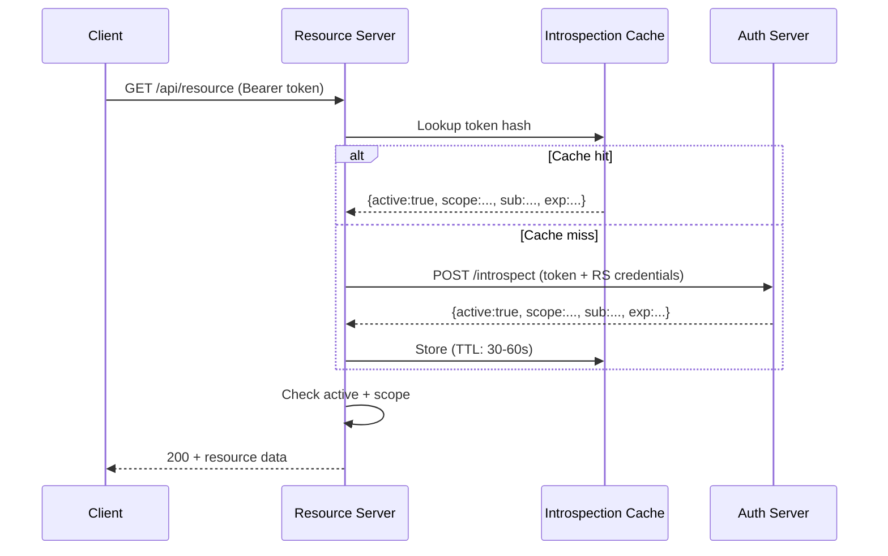

⚡ TL;DR - Token introspection (RFC 7662) is the protocol by
which a Resource Server calls the Authorization Server to
validate an opaque access token and retrieve its metadata
(active status, scope, subject, expiry). Unlike JWT local
validation (no network call), introspection is a synchronous
HTTP POST to `/introspect` that returns `active: true/false`
plus claims. The trade-off: introspection reflects revocation
immediately but adds network latency to every API request.
Production use always adds a short-TTL local cache.

---

### 🔥 The Problem This Solves

**THE OPAQUE TOKEN PROBLEM:**

JWT access tokens are self-contained: the Resource Server
decodes and validates them locally with no network call to
the AS. But opaque tokens (random strings with no embedded
claims) cannot be validated locally - they are references,
not values. The RS must ask the AS: "Is this token still
valid, and what does it represent?"

**JWT LOCAL VALIDATION LIMITATION:**

Even with JWTs, local validation has a blind spot: revocation.
When a user logs out, changes their password, or revokes access,
the JWT is immediately marked invalid at the AS - but the RS
has already cached the public key and will accept the JWT
until its `exp` claim is reached. For high-security scenarios
(financial, healthcare, admin operations), a 15-60 minute
window where a revoked token is still accepted may be
unacceptable. Introspection checks the current AS state on
every call.

**THE INVENTION MOMENT:**

RFC 7662 (2015) standardized introspection as a simple,
provider-agnostic protocol: POST the token to `/introspect`,
get back `{active: true, scope: "...", sub: "..."}`. Before
RFC 7662, each AS had its own proprietary token check API.
The standard made introspection library support generic.

---

### 📘 Textbook Definition

Token introspection (RFC 7662) is a protocol that allows
authorized callers (Resource Servers or other OAuth clients)
to query the Authorization Server about the current state
of an access or refresh token. The introspecting party POSTs
the token to the introspection endpoint with its own client
credentials as authentication. The AS responds with a JSON
object containing `active` (boolean - whether the token is
currently valid), and if active: `scope`, `client_id`, `sub`,
`username` (if present), `token_type`, `exp`, `iat`, `nbf`,
`aud`, and `iss`. A response of `active: false` indicates
the token is expired, revoked, or otherwise invalid. The RS
must authenticate to the introspection endpoint (its own
client_id/secret) to prevent unauthorized token lookups
(which would leak token metadata to unauthenticated callers).

---

### ⏱️ Understand It in 30 Seconds

**One sentence:**
Introspection is the RS asking the AS: "Is this token still
good, and what claims does it carry?" The AS answers with
`active: true/false` and (if true) the token's metadata.

**The key trade-offs table:**

```
                  JWT LOCAL         INTROSPECTION
Network call      No                Yes (per request)
Revocation lag    Up to TTL (mins)  Near-zero
Latency added     ~0ms              1-10ms per request
AS availability   Not required      Required on hot path
Opaque tokens     No                Yes
Scale at 100k RPS JWKS cached       Introspection cache needed
```

**One insight:**
The critical operational decision: if your API handles 10,000
requests/second and each triggers an introspection call, the
AS becomes a bottleneck with 10,000 RPS of introspection load.
The solution: short-TTL local cache (30-60 seconds). This
means revocation takes effect within 30-60 seconds, not
immediately. Whether that's acceptable is a business decision.

---

### ⚙️ How It Works (Mechanism)

**Protocol diagram:**

```
┌───────────────────────────────────────────────────────┐
│  TOKEN INTROSPECTION FLOW (RFC 7662)                  │
├───────────────────────────────────────────────────────┤
│                                                       │
│  Client → Resource Server:                            │
│    GET /api/resource                                  │
│    Authorization: Bearer <opaque_or_jwt_token>        │
│                                                       │
│  Resource Server → Authorization Server:              │
│    POST /introspect                                   │
│    Authorization: Basic base64(RS_ID:RS_SECRET)       │
│    Content-Type: application/x-www-form-urlencoded    │
│    Body:                                              │
│      token=<the_access_token>                         │
│      token_type_hint=access_token  (optional)         │
│                                                       │
│  Authorization Server → Resource Server:              │
│    HTTP 200 OK                                        │
│    {                                                  │
│      "active": true,           ← key field            │
│      "scope": "read:contacts", ← granted scope        │
│      "client_id": "app123",    ← which client         │
│      "sub": "user-uuid-789",   ← resource owner       │
│      "exp": 1748220000,        ← unix expiry          │
│      "iat": 1748216400,        ← issued at            │
│      "aud": "https://api.example.com",                 │
│      "iss": "https://auth.example.com",               │
│      "token_type": "Bearer"                           │
│    }                                                  │
│                                                       │
│  OR (for inactive token):                             │
│    { "active": false }         ← only this field      │
│                                                       │
│  Resource Server → Client:                            │
│    200 + resource (if active + scope match)           │
│    401 (if active: false)                             │
│    403 (if active: true but insufficient scope)       │
└───────────────────────────────────────────────────────┘
```



**Security: why the RS must authenticate:**

```
If introspection required NO authentication:
  Attacker with any token string could call /introspect
  to discover: the token's subject (user ID), scopes,
  client_id, and expiry. This leaks user identity even
  for invalid tokens (some AS return claims on inactive
  tokens too).

  Also: attacker could enumerate users by trying common
  token formats (though random tokens make this unlikely)

RFC 7662 §2.1: "To prevent token scanning attacks, the
  endpoint MUST also require some form of authorization
  to access this endpoint."

RS authenticates as:
  - HTTP Basic: Authorization: Basic base64(client_id:secret)
  - Bearer token: The RS itself has its own OAuth token
  - mTLS: client certificate (enterprise environments)
```

---

### 💻 Code Example

**Example 1 - BAD then GOOD: Introspection without caching:**

```python
# BAD: Call introspection on every single API request
# At 1000 RPS: 1000 introspection calls/second to AS
# AS becomes bottleneck; P99 latency = introspection latency

def validate_token_bad(token: str) -> dict:
    resp = requests.post(
        INTROSPECTION_ENDPOINT,
        data={'token': token},
        auth=(RS_CLIENT_ID, RS_CLIENT_SECRET),
    )
    result = resp.json()
    if not result.get('active'):
        raise UnauthorizedError()
    return result
    # PROBLEM: every API request = 1 AS call
    # AS must handle the same RPS as the API
    # Single AS failure = entire API fails
```

```python
# GOOD: Introspection with short-TTL local cache
# WHY: Cache reduces AS load by 95%+ (hot tokens hit cache).
#   TTL = 30-60s = acceptable revocation lag for most cases.
#   Cache key = token hash (not the token itself - no plaintext
#   token in cache key is a defense-in-depth measure).

import hashlib, time
from threading import Lock
from dataclasses import dataclass, field
from typing import Optional

@dataclass
class CacheEntry:
    result: dict
    cached_at: float
    ttl: int = 30  # seconds

class IntrospectionCache:
    def __init__(self):
        self._store: dict[str, CacheEntry] = {}
        self._lock = Lock()

    def _key(self, token: str) -> str:
        # Cache key = SHA256 of token (never store raw token)
        return hashlib.sha256(
            token.encode('ascii')
        ).hexdigest()

    def get(self, token: str) -> Optional[dict]:
        key = self._key(token)
        with self._lock:
            entry = self._store.get(key)
            if not entry:
                return None
            if time.time() > entry.cached_at + entry.ttl:
                del self._store[key]
                return None
            return entry.result

    def set(self, token: str, result: dict, ttl: int = 30):
        key = self._key(token)
        # For inactive tokens: shorter TTL (re-check sooner)
        effective_ttl = 5 if not result.get('active') else ttl
        with self._lock:
            self._store[key] = CacheEntry(
                result=result,
                cached_at=time.time(),
                ttl=effective_ttl,
            )

_cache = IntrospectionCache()

def validate_token(token: str) -> dict:
    """Validate token via introspection with caching."""
    # Check cache first
    cached = _cache.get(token)
    if cached is not None:
        if not cached.get('active'):
            raise TokenInactiveError("Token inactive (cached)")
        return cached

    # Cache miss: call introspection endpoint
    resp = requests.post(
        INTROSPECTION_ENDPOINT,
        data={
            'token': token,
            'token_type_hint': 'access_token',
        },
        auth=(RS_CLIENT_ID, RS_CLIENT_SECRET),
        timeout=2,  # On request hot path - tight timeout
    )
    resp.raise_for_status()
    result = resp.json()

    _cache.set(token, result)

    if not result.get('active'):
        raise TokenInactiveError("Token expired or revoked")

    # Validate issuer and audience from introspection result
    if result.get('iss') != EXPECTED_ISSUER:
        raise SecurityError(
            f"Unexpected issuer: {result.get('iss')}"
        )
    aud = result.get('aud', '')
    if isinstance(aud, str):
        aud = [aud]
    if EXPECTED_AUDIENCE not in aud:
        raise SecurityError("Token audience mismatch")

    return result
    # WHAT BREAKS: AS unavailable during cache miss →
    #   requests.post() raises ConnectionError.
    # CIRCUIT BREAKER: Wrap introspection call with circuit
    #   breaker; on open circuit: fail closed (reject requests)
    #   not fail open (accept all). Security > availability.
    # HOW TO TEST: Mock AS to return active:false; verify
    #   TokenInactiveError raised and result cached with short TTL.
```

**Example 2 - Spring Boot Resource Server using introspection:**

```java
// Spring Security 6: configure introspection for opaque tokens
// Alternative to JWT local validation

@Configuration
@EnableWebSecurity
public class ResourceServerConfig {

  @Value("${spring.security.oauth2.resourceserver"
       + ".opaquetoken.introspection-uri}")
  private String introspectionUri;

  @Value("${spring.security.oauth2.resourceserver"
       + ".opaquetoken.client-id}")
  private String clientId;

  @Value("${spring.security.oauth2.resourceserver"
       + ".opaquetoken.client-secret}")
  private String clientSecret;

  @Bean
  public SecurityFilterChain securityFilterChain(
      HttpSecurity http) throws Exception {
    http
      .authorizeHttpRequests(auth -> auth
        .requestMatchers("/api/admin/**")
          .hasAuthority("SCOPE_admin:read")
        .requestMatchers("/api/contacts")
          .hasAuthority("SCOPE_read:contacts")
        .anyRequest().authenticated()
      )
      .oauth2ResourceServer(oauth2 -> oauth2
        // Introspection mode (not JWT mode)
        .opaqueToken(opaque -> opaque
          .introspectionUri(introspectionUri)
          .introspectionClientCredentials(
              clientId, clientSecret
          )
        )
      );
    return http.build();
  }

  // Optional: configure introspection result cache
  // to reduce load on the AS
  @Bean
  public OpaqueTokenIntrospector introspector() {
    // Spring's default makes one call per request.
    // For caching: implement OpaqueTokenIntrospector:
    return new CachingOpaqueTokenIntrospector(
        new NimbusOpaqueTokenIntrospector(
            introspectionUri, clientId, clientSecret
        ),
        Duration.ofSeconds(30)  // cache TTL
    );
  }
}
// application.yml:
// spring.security.oauth2.resourceserver.opaquetoken:
//   introspection-uri: https://auth.example.com/introspect
//   client-id: ${RS_CLIENT_ID}
//   client-secret: ${RS_CLIENT_SECRET}
```

**Example 3 - Introspection vs JWT: choosing per use case:**

```python
# Decision matrix in code: when to use each approach

def select_validation_strategy(config: dict):
    """
    Choose between JWT local validation and introspection.

    Use INTROSPECTION when:
      - Tokens are opaque (cannot decode locally)
      - Near-instant revocation required (financial, medical)
      - Token metadata may change after issuance
        (e.g., dynamic scope adjustment)
      - AS is always available and low-latency

    Use JWT LOCAL VALIDATION when:
      - Tokens are JWTs from a trusted AS
      - Revocation lag is acceptable (TTL-based)
      - AS availability must not affect API availability
      - Scale is high (>10k RPS and cache not viable)
      - Offline or air-gapped Resource Servers
    """
    if config.get('token_format') == 'opaque':
        return 'introspection'
    if config.get('revocation_required_immediately'):
        return 'introspection_with_cache'
    if config.get('high_scale') and \
       not config.get('strict_revocation'):
        return 'jwt_local'
    # Default for standard production:
    return 'jwt_local_with_introspection_fallback'

# Hybrid pattern: JWT local validation + introspection
# on scope-sensitive endpoints only
def validate_payment_token(token: str) -> dict:
    """
    High-security endpoint: use introspection even for JWTs
    to catch revoked tokens within the TTL window.
    """
    # First: fast JWT local validation (signature, claims)
    claims = validate_access_token(token)

    # Second: introspection to check current revocation state
    # (payment operations: cannot allow revoked-but-not-expired)
    introspect_result = validate_token_via_introspect(token)
    if not introspect_result.get('active'):
        # JWT was valid but AS says it's revoked
        raise TokenRevokedError(
            "Token revoked - introspection overrides JWT exp"
        )
    return claims
```

---

### ⚖️ Comparison Table

| Property | JWT Local Validation | Token Introspection |
|---|---|---|
| Network call | None (JWKS cached at startup) | Yes (per cache miss) |
| Revocation reflection | At token expiry (TTL lag) | Near-instant (AS state) |
| Works with opaque tokens | No | Yes |
| AS outage impact | API continues (JWKS cached) | API degraded (fail closed) |
| Scale (10k+ RPS) | Excellent (no AS calls) | Needs cache to be viable |
| Implementation | Library + JWKS config | HTTP call + cache |
| Suitable for | Standard APIs, high scale | Opaque tokens, strict revocation |

---

### 🔁 Flow / Lifecycle

```
RESOURCE SERVER STARTUP:
  Configure introspection endpoint URL + RS credentials

PER API REQUEST:
  1. Extract Bearer token from header
  2. Check introspection cache (token SHA256 key)
     HIT: use cached result (check active field)
     MISS: POST /introspect with RS credentials
  3. Cache result (30s active, 5s inactive)
  4. Check active: false → 401
  5. Check scope → 403 if insufficient
  6. Process request with claims (sub, scope, etc.)

TOKEN REVOCATION EVENT:
  AS marks token inactive immediately
  Cache entry TTL: up to 30s before RS reflects revocation
  If TTL=0 (no cache): instant reflection, high AS load
```

---

### ⚠️ Common Misconceptions

| Misconception | Reality |
|---|---|
| Introspection is only for opaque tokens | RFC 7662 works for both opaque and JWT tokens. Introspecting a JWT is useful when you need current revocation state beyond the JWT's exp claim - common in high-security flows. |
| An `active: false` response means the token is malformed | `active: false` means the token is not currently valid for any reason: expired, revoked, wrong audience, wrong issuer, or simply not recognized. It does not imply the token string is syntactically invalid. |
| The introspection endpoint should be publicly accessible | RFC 7662 §2.1 requires authentication to the introspection endpoint. Public access enables token scanning and metadata enumeration attacks. The RS authenticates with its own client credentials. |
| Caching introspection results defeats the purpose of introspection | Caching with a short TTL (30-60s) provides the primary benefit of introspection (revocation reflection) while making it operationally viable at scale. The alternative (no cache) creates AS bottleneck. The TTL is a configurable trade-off: lower TTL = faster revocation, higher AS load. |

---

### 🚨 Failure Modes & Diagnosis

**AS Introspection Endpoint Unavailable (Cascading Failure)**

**Symptom:**
All API requests fail with 500 or timeout after AS goes down
for maintenance. The RS has no fallback and calls introspection
on every request. AS downtime = complete API outage.

**Root Cause:**
Introspection endpoint is on the critical path with no circuit
breaker or fallback. RS fails open or fails with server errors
when the connection times out.

**Fix:**

```python
import httpx
from circuitbreaker import circuit

@circuit(failure_threshold=5, recovery_timeout=30)
def call_introspection(token: str) -> dict:
    """Call introspection with circuit breaker."""
    resp = httpx.post(
        INTROSPECTION_ENDPOINT,
        data={'token': token},
        auth=(RS_CLIENT_ID, RS_CLIENT_SECRET),
        timeout=2
    )
    resp.raise_for_status()
    return resp.json()

def validate_token_with_fallback(token: str) -> dict:
    try:
        return call_introspection(token)
    except CircuitBreakerError:
        # Circuit open: AS is down.
        # FAIL CLOSED (reject requests) for security:
        raise ServiceUnavailableError(
            "Authorization service unavailable"
        )
        # DO NOT fail open (accept all tokens when AS is down)
        # That would allow unauthorized access during outages
```

---

**Token Scanning via Unauthenticated Introspection**

**Symptom:**
Attacker calls `/introspect` without RS credentials and receives
metadata about arbitrary token strings (user IDs, scopes, expiry).

**Root Cause:**
Introspection endpoint accessible without authentication
(misconfigured API gateway or AS configuration error).

**Fix:**
The introspection endpoint MUST require RS authentication (per
RFC 7662 §2.1). Validate via API gateway: require `Authorization`
header on `/introspect`. Test with: `curl -X POST /introspect -d
token=anything` without auth → expect `401 Unauthorized`.

---

### 🔗 Related Keywords

**Prerequisites:**
- `Token Validation` - the broader context (JWT vs introspection)
- `Access Token` - what is being introspected
- `OAuth 2.0 Endpoints` - /introspect endpoint location

**Builds On:**
- `Token Revocation (RFC 7009)` - what makes active=false
- `OAuth Production Debugging` - using introspection for diagnostics

---

### 📌 Quick Reference Card

```
┌──────────────────────────────────────────────────────────┐
│ ENDPOINT     │ POST /introspect (RS authenticated)       │
│ REQUEST      │ token=<access_token>                      │
│              │ [token_type_hint=access_token]            │
├──────────────┼───────────────────────────────────────────┤
│ RESPONSE     │ {active: true/false}                      │
│ (active=true)│ + scope, sub, exp, iss, aud, client_id    │
├──────────────┼───────────────────────────────────────────┤
│ RS AUTH      │ Basic base64(RS_ID:RS_SECRET)             │
│              │ Mandatory - prevents token scanning       │
├──────────────┼───────────────────────────────────────────┤
│ CACHE        │ 30-60s TTL for active=true                │
│ STRATEGY     │ 5s TTL for active=false                   │
│              │ Key: SHA256(token) not raw token          │
├──────────────┼───────────────────────────────────────────┤
│ vs JWT       │ Introspection: reflects revocation now    │
│              │ JWT local: fast, no network, TTL lag      │
├──────────────┼───────────────────────────────────────────┤
│ CIRCUIT      │ Fail CLOSED on AS outage (not fail open)  │
│ BREAKER      │ Security > availability on hot path       │
├──────────────┼───────────────────────────────────────────┤
│ ONE-LINER    │ "RS asks AS: is this token still valid?   │
│              │  Cache 30s; fail closed on AS outage."    │
└──────────────────────────────────────────────────────────┘
```

**If you remember only 3 things:**

1. Introspection is for opaque tokens (required) or when
   near-instant revocation is needed (JWT supplement). The RS
   must authenticate to the introspection endpoint.

2. Always cache results with a short TTL (30-60s active,
   5s inactive). Without caching, introspection creates AS
   load equal to your API's RPS.

3. Fail closed (reject requests) when the AS is unreachable.
   Never fail open (accept all tokens when AS is down).

**Interview one-liner:**
"Token introspection (RFC 7662) is a POST /introspect call by
the Resource Server to check if an opaque token is active and
get its claims. The RS authenticates with its own credentials.
The response is {active: true/false} + scope, sub, exp, aud.
Cache results 30-60s to avoid AS bottleneck. Fail closed on AS
outage. Use over JWT local validation when: token is opaque,
or immediate revocation reflection is required."

---

### ✅ Mastery Checklist

**You've mastered this when you can:**

1. **[IMPLEMENT]** Build a production-grade introspection client
   with: RS credential authentication, short-TTL local cache
   (active: 30s, inactive: 5s), circuit breaker with fail-closed
   behavior, and correct claim validation (iss, aud) on the
   introspection response.

2. **[COMPARE]** Given a system with 5,000 RPS on an API, analyze
   the AS load difference between: (a) no cache, (b) 30s cache,
   (c) JWT local validation. Calculate approximate introspection
   RPS for each and recommend which to use with justification.

3. **[SECURE]** Audit an introspection endpoint configuration
   for: authentication requirements, response data minimization
   (not leaking PII to unauthorized RSs), and rate limiting
   to prevent token scanning.
