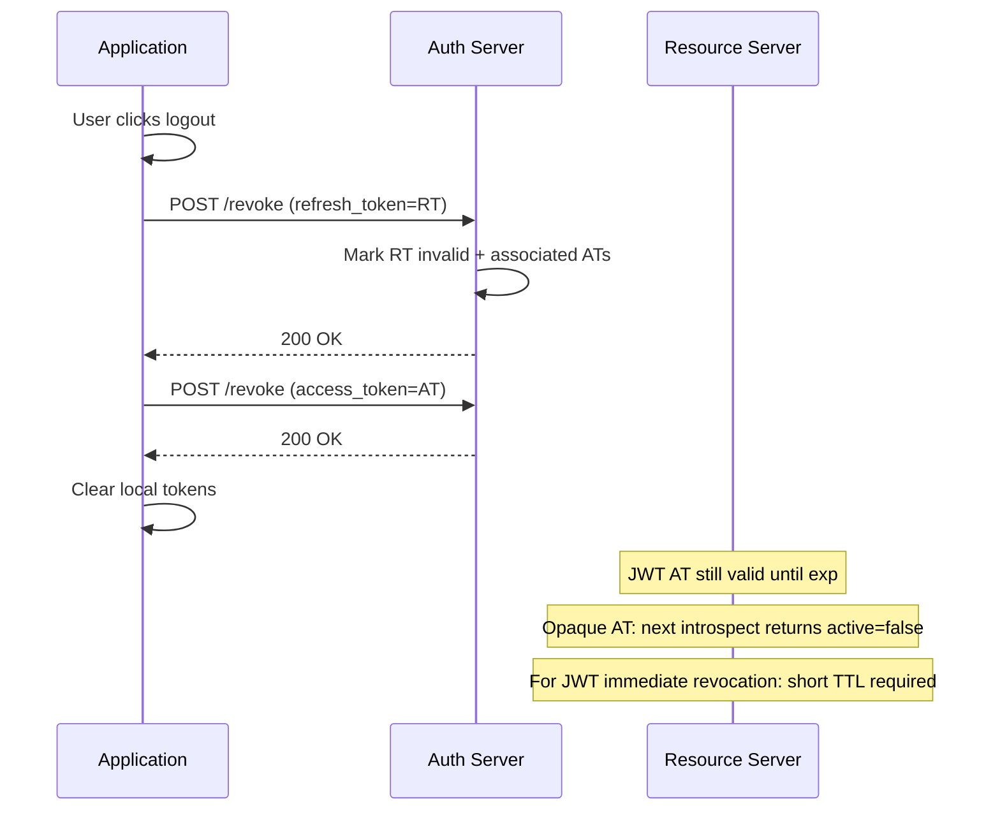

⚡ TL;DR - Token revocation (RFC 7009) is the protocol for
invalidating an OAuth 2.0 access or refresh token before it
naturally expires. The client POSTs the token to the AS
revocation endpoint (`POST /revoke`). The AS invalidates it.
For refresh tokens: immediate effect (AS refuses future refresh
calls). For JWT access tokens: NOT immediately effective at
Resource Servers (they validate locally without calling AS).
Revocation is essential for logout flows - always revoke the
refresh token first (it's more dangerous because it can
generate new access tokens).

---

### 🔥 The Problem This Solves

**THE RESIDUAL ACCESS PROBLEM:**

When a user logs out of an application, the application clears
its local tokens - but the tokens still exist at the AS and
may still be accepted by Resource Servers. If an attacker
stole the access token before logout, clearing it locally
does nothing to stop the attacker. The access token remains
valid at every RS until its `exp` claim is reached. The
refresh token, if stolen, is even worse: it can generate
fresh access tokens for days or months.

**WHY REVOCATION IS HARDER THAN IT SOUNDS:**

For opaque tokens: revocation is immediate. The AS tracks
each token; revocation marks it inactive. Next introspection
call returns `active: false`.

For JWT access tokens: the RS does NOT call the AS on each
request (it validates locally with cached JWKS). Revocation
at the AS does not affect JWT validation at the RS. A JWT
is valid until `exp` unless the RS explicitly checks a
revocation list. This is the fundamental tension of JWT
architecture: local validation speed vs revocation lag.

**THE INVENTION MOMENT:**

RFC 7009 (2013) standardized the revocation endpoint, making
logout flows provider-agnostic. Before RFC 7009, each provider
had a proprietary logout API (or none at all). The standard
made it possible to write a generic "revoke on logout"
implementation that works with any compliant AS.

---

### 📘 Textbook Definition

Token revocation (RFC 7009) defines a protocol for OAuth 2.0
clients to notify the Authorization Server that a previously
obtained token is no longer needed. The client sends a POST
request to the revocation endpoint with the token in the
request body. The AS MUST invalidate the token. If the token
is a refresh token, the AS SHOULD also invalidate all access
tokens derived from that refresh token. If the token is an
access token, the AS MAY additionally invalidate refresh tokens
that were associated with it. The AS returns HTTP 200 for all
valid requests (including when the token was already expired
or not found) to prevent token existence enumeration. The
`token_type_hint` parameter helps the AS locate the token in
the correct store faster (optional, AS ignores if wrong).

---

### ⏱️ Understand It in 30 Seconds

**The revocation hierarchy:**

```
REVOKE REFRESH TOKEN:
  → AS marks refresh token as invalid
  → No new access tokens can be generated
  → Existing valid JWTs continue until exp
  → Effect: user cannot silently renew, must re-auth
  → HOW LONG? Until existing JWT access tokens expire

REVOKE ACCESS TOKEN (opaque):
  → AS marks access token as invalid
  → Next introspection call returns active:false
  → Effect: immediate (for RSs using introspection)

REVOKE JWT ACCESS TOKEN:
  → AS marks it invalid in its store
  → But RS validates locally - AS state irrelevant
  → Effect: NONE until exp (or RS checks revocation list)
  → Real revocation for JWTs: short TTL + token binding

ALWAYS REVOKE IN ORDER:
  1. Refresh token (most dangerous - can generate access tokens)
  2. Access token (imminent resource access)
```

---

### ⚙️ How It Works (Mechanism)

**RFC 7009 protocol:**

```
POST /revoke
Content-Type: application/x-www-form-urlencoded
Authorization: Basic base64(client_id:client_secret)

token=<token_to_revoke>
token_type_hint=refresh_token  ← optional hint

RESPONSE:
  HTTP 200 OK
  (empty body OR {} - always 200 even if token unknown)

WHY ALWAYS 200?
  RFC 7009 §2.2: "The authorization server responds with
  HTTP status code 200 if the token has been revoked
  successfully or if the client submitted an invalid token."
  Reason: returning 404 for "token not found" reveals
  whether a given token string exists → enumeration attack.
  Always 200 prevents the RS from learning anything about
  tokens it doesn't own.
```



**Refresh token family revocation (theft scenario):**

```
Token family: RT1 → RT2 → RT3 (RT1 is the root)

User revokes access from connected apps page:
  POST /revoke with RT1 (or any token in family)
  AS invalidates: RT1, RT2, RT3
  Any future refresh call with any family member → 400

Token theft scenario:
  Attacker steals RT1 (before rotation)
  User uses RT1 → gets RT2 (RT1 invalidated)
  Attacker tries RT1 → reuse detected → RT2 revoked
  Both: next refresh = invalid_grant → re-authenticate

This is refresh token rotation + reuse detection
working as designed. Revocation is the manual version:
user explicitly invalidates the entire family.
```

---

### 💻 Code Example

**Example 1 - BAD then GOOD: Logout implementation:**

```python
# BAD: "Logout" by only clearing local storage
# Tokens still valid at AS; attacker who stole tokens
# still has access until natural expiry

def logout_bad(session: dict):
    # Only clears client-side state
    session.clear()
    # WRONG: tokens still valid at AS and every RS
    # Stolen refresh token can still generate access tokens
```

```python
# GOOD: Logout = revoke tokens first, then clear local state
# WHY: Revoke refresh token first (can generate new ATs).
#   Then revoke access token. Then clear local state.
#   If revocation fails: clear local anyway (but log failure).

import requests

def logout(
    session: dict,
    revoke_endpoint: str,
    client_id: str,
    client_secret: str
) -> bool:
    """
    Full logout: revoke tokens at AS, then clear locally.
    Returns True if revocation succeeded.
    """
    revoked = True

    # Step 1: Revoke refresh token first
    # (higher priority - can generate new access tokens)
    refresh_token = session.get('refresh_token')
    if refresh_token:
        try:
            resp = requests.post(
                revoke_endpoint,
                data={
                    'token': refresh_token,
                    'token_type_hint': 'refresh_token',
                },
                auth=(client_id, client_secret),
                timeout=5
            )
            # RFC 7009: 200 = success (even if already invalid)
            if resp.status_code != 200:
                revoked = False
                # Log but do not block logout
        except requests.RequestException:
            revoked = False
            # Log: revocation endpoint unavailable

    # Step 2: Revoke access token
    access_token = session.get('access_token')
    if access_token:
        try:
            requests.post(
                revoke_endpoint,
                data={
                    'token': access_token,
                    'token_type_hint': 'access_token',
                },
                auth=(client_id, client_secret),
                timeout=5
            )
        except requests.RequestException:
            revoked = False

    # Step 3: Always clear local state regardless of
    # revocation success (local logout is always complete)
    session.clear()

    if not revoked:
        # Audit log: tokens may still be valid at AS
        audit_log.warning(
            "Token revocation failed during logout; "
            "access token will expire naturally at %s",
            access_token_expiry
        )

    return revoked
    # WHAT BREAKS: AS revocation endpoint not in discovery
    #   doc → KeyError. Check config.get('revocation_endpoint')
    # HOW TO TEST: Mock AS to return 503; verify local
    #   session cleared; verify failure logged
```

**Example 2 - JWT revocation limitation and mitigations:**

```python
# JWT ACCESS TOKENS: revocation has no immediate effect on RS
# The RS validates locally; AS revocation state is irrelevant

# SCENARIO: User changes password. Security team wants all
# sessions terminated immediately.

# OPTION 1: Short TTL (15 min) - simplest, no revocation infra
# After password change: all existing sessions valid for
# at most 15 more minutes. For most apps: acceptable.
JWT_ACCESS_TOKEN_TTL = 900  # 15 minutes

# OPTION 2: Token family invalidation via generation counter
# In access token payload: { sub: U, jti: "...", gen: 42 }
# On logout/password change: increment user's generation counter
# RS checks: token.gen == user.current_gen (requires DB call)
# This adds one DB lookup per request - partially negates JWT benefit

# OPTION 3: Introspection for sensitive endpoints only
# Normal endpoints: JWT local validation (fast, no network)
# High-security endpoints: introspection (immediate revocation)
@app.route('/api/payment', methods=['POST'])
def payment():
    # Force introspection on payment endpoint
    # (cannot accept revoked tokens for financial operations)
    token = get_bearer_token(request)
    result = introspect_token(token)  # AS network call
    if not result.get('active'):
        return {'error': 'invalid_token'}, 401
    ...

# OPTION 4: DPoP token binding (RFC 9449)
# Tokens are bound to the client's key pair.
# Revocation is still TTL-based but stolen tokens are
# useless without the private key.

# BEST PRACTICE: Combine short TTL + revocation at AS
# Short TTL: limits blast radius
# Revocation: defense-in-depth for stolen refresh tokens
```

**Example 3 - Admin revocation of all user sessions:**

```python
# Scenario: user account compromised; admin must revoke all
# active sessions across all devices

def revoke_all_user_sessions(
    user_id: str,
    admin_token: str,
    revocation_endpoint: str,
):
    """
    Admin operation: invalidate all active tokens for a user.
    Requires an admin-scoped token on the revocation endpoint
    (or AS-specific bulk revocation API - varies by provider).
    """
    # Standard RFC 7009 revokes one token at a time.
    # For bulk revocation, use AS-specific admin API:
    # e.g., Keycloak: DELETE /admin/realms/{realm}/users/{id}/sessions
    # Auth0: DELETE /api/v2/users/{id}/sessions

    # Generic approach: list and revoke active tokens
    # (requires admin scope on introspection or list endpoint)

    # Step 1: Fetch active sessions from AS admin API
    active_sessions = fetch_user_active_sessions(
        user_id, admin_token
    )  # AS-specific admin endpoint

    # Step 2: Revoke each refresh token
    revoked_count = 0
    for session in active_sessions:
        if rt := session.get('refresh_token'):
            resp = requests.post(
                revocation_endpoint,
                data={'token': rt,
                      'token_type_hint': 'refresh_token'},
                auth=(ADMIN_CLIENT_ID, ADMIN_CLIENT_SECRET)
            )
            if resp.status_code == 200:
                revoked_count += 1

    # Step 3: For JWT ATs - they expire naturally.
    # If immediate revocation needed: increment user's
    # token generation counter (requires custom AS/RS support)

    audit_log.info(
        "Revoked %d sessions for user %s",
        revoked_count, user_id
    )
    return revoked_count
    # JWT ATs still valid until exp.
    # For immediate JWT AT revocation: update user's
    # revocation_at timestamp; RS checks this on each request.
```

---

### ⚖️ Comparison Table

| Token Type | Revocation Effect | When RS Sees It | Primary Defense |
|---|---|---|---|
| **Opaque access token** | Immediate | Next introspection call | RFC 7009 revocation |
| **JWT access token** | Logged at AS; RS unaffected | Never (without revocation list) | Short TTL |
| **Refresh token** | Immediate at AS token endpoint | On next refresh attempt | RFC 7009 revocation |
| **OIDC ID token** | Not revocable | N/A (used once at login) | Short TTL + re-auth |

---

### 🔁 Flow / Lifecycle

```
NORMAL LOGOUT:
  1. App: POST /revoke (refresh_token)
  2. App: POST /revoke (access_token)
  3. App: Clear local session
  Effect: user cannot silently renew; must re-authenticate

SECURITY EVENT (password change, breach):
  1. AS: mark all user's tokens invalid in token store
  2. JWT ATs: valid until exp (short TTL mitigates)
  3. App: on next refresh: invalid_grant → redirect to login

TOKEN THEFT DETECTION:
  1. Refresh token rotation detects reuse
  2. AS revokes entire token family
  3. Next legitimate use: invalid_grant → re-auth
```

---

### ⚠️ Common Misconceptions

| Misconception | Reality |
|---|---|
| Revoking a JWT access token immediately invalidates it at all Resource Servers | JWT access tokens are validated locally at RSs. Revocation at the AS has no effect at RSs that do not check a revocation endpoint or revocation list. Only short TTL or introspection provide near-instant revocation for JWTs. |
| A 200 response from /revoke confirms the token was successfully revoked | RFC 7009 §2.2 requires 200 for both successful revocation AND unknown/invalid tokens. 200 means "request was processed"; it does not confirm the token existed. This prevents enumeration attacks. |
| Refresh token revocation automatically revokes associated access tokens | RFC 7009 says the AS "SHOULD" (not MUST) revoke associated access tokens when a refresh token is revoked. Behavior varies by AS. For JWT ATs: revocation at the AS doesn't help at the RS anyway. Always rely on short TTL as the primary defense for ATs. |
| Front-channel logout (OIDC) is the same as token revocation | Front-channel logout is an OIDC mechanism for propagating logout events to multiple relying parties (RPs) via browser iframes. Token revocation (RFC 7009) is the protocol for invalidating tokens at the AS. They solve different problems and are both needed for complete logout. |

---

### 🚨 Failure Modes & Diagnosis

**Logout Without Token Revocation (Stolen Session)**

**Symptom:**
User logs out, but an attacker who previously captured the
refresh token can still use it to obtain new access tokens.
The application's "logout" only cleared the browser cookie
containing the refresh token; the token itself was never
invalidated at the AS.

**Root Cause:**
Logout implementation clears local state without calling
POST /revoke. The refresh token remains valid at the AS
until its natural TTL (days to months).

**Diagnostic:**

```bash
# Test: capture refresh token before logout, log out,
# then try to use the refresh token:
curl -X POST https://as.example.com/token \
  -d grant_type=refresh_token \
  -d refresh_token=THE_CAPTURED_REFRESH_TOKEN \
  -d client_id=CLIENT_ID \
  -d client_secret=CLIENT_SECRET

# If 200: refresh token still valid → revocation not called
# If 400 invalid_grant: revocation worked correctly
```

**Fix:**
Implement POST /revoke call in the logout handler before
clearing local state. Test that captured tokens are rejected
after logout.

---

**Revocation Endpoint Not in Discovery Document**

**Symptom:**
Attempt to configure revocation endpoint URL fails. Discovery
document does not contain `revocation_endpoint`. Application
silently skips revocation on logout.

**Root Cause:**
Some AS implementations omit `revocation_endpoint` from
discovery if revocation is not supported or is disabled.

**Fix:**

```python
def logout(session: dict, config: dict):
    revoke_url = config.get('revocation_endpoint')
    if not revoke_url:
        # AS does not support RFC 7009 revocation
        # Log this as a gap in the AS capability
        audit_log.warning(
            "AS does not support RFC 7009 token revocation. "
            "Tokens will expire naturally. "
            "Short TTL is required for this AS."
        )
        session.clear()
        return

    # Normal revocation flow
    revoke_token(revoke_url, session.get('refresh_token'), ...)
    session.clear()
```

---

### 🔗 Related Keywords

**Prerequisites:**
- `Refresh Token` - what most revocations target at logout
- `Token Introspection` - how revocation effects reach RSs for opaque tokens

**Builds On:**
- `Refresh Token Rotation Security` - detection that triggers automatic revocation
- `Refresh Token Lifecycle` - complete RT state transitions

---

### 📌 Quick Reference Card

```
┌──────────────────────────────────────────────────────────┐
│ ENDPOINT     │ POST /revoke (client authenticated)       │
│ BODY         │ token=<token>&token_type_hint=refresh_token│
├──────────────┼───────────────────────────────────────────┤
│ RESPONSE     │ Always 200 (even if token unknown)         │
│              │ 200 ≠ confirmation token existed           │
├──────────────┼───────────────────────────────────────────┤
│ LOGOUT ORDER │ 1. Revoke refresh_token (most dangerous)   │
│              │ 2. Revoke access_token                     │
│              │ 3. Clear local session                     │
├──────────────┼───────────────────────────────────────────┤
│ EFFECT ON    │ Opaque AT: immediate (via introspection)   │
│ RESOURCE SVR │ JWT AT: NO effect until exp (TTL defense!) │
├──────────────┼───────────────────────────────────────────┤
│ JWT AT       │ Short TTL (15 min) is primary defense.     │
│ REVOCATION   │ Introspection on high-security endpoints.  │
├──────────────┼───────────────────────────────────────────┤
│ RT           │ Immediate: next refresh call fails         │
│ REVOCATION   │ = 400 invalid_grant                        │
├──────────────┼───────────────────────────────────────────┤
│ ONE-LINER    │ "Revoke refresh token on logout; JWT ATs   │
│              │  need short TTL for meaningful revocation."│
└──────────────────────────────────────────────────────────┘
```

**If you remember only 3 things:**

1. Always revoke the refresh token first at logout - it is
   more dangerous than the access token because it can generate
   new access tokens for days/months.

2. JWT access token revocation at the AS has NO immediate effect
   at Resource Servers. Short TTL is the primary mitigation.
   Introspection adds immediate revocation for high-security flows.

3. `/revoke` always returns 200 - even for unknown tokens.
   This prevents enumeration. 200 is not confirmation the token existed.

**Interview one-liner:**
"Token revocation (RFC 7009) is a POST /revoke call to invalidate
tokens at the AS. Always revoke refresh_token first on logout.
The 200 response is always returned (prevents enumeration).
For opaque tokens: revocation is immediately reflected via
introspection. For JWT ATs: revocation has no immediate effect
at RS (validates locally); short TTL is the defense. RFC 7009
says the AS SHOULD also revoke ATs derived from a revoked RT,
but behavior varies."
