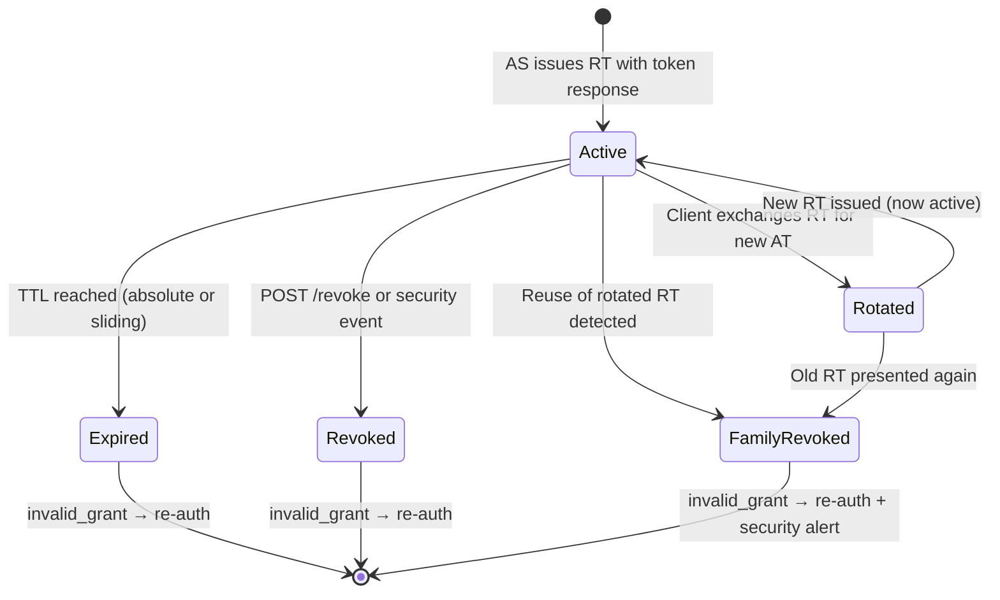

⚡ TL;DR - A refresh token's lifecycle has four phases: issuance
(with the initial token response), use (exchanged for new access
tokens via `grant_type=refresh_token`), rotation (new RT issued
on every use, old one invalidated), and termination (expiry,
revocation at logout, or reuse detection triggers family
invalidation). Understanding the full lifecycle is essential
for building correct session management: proactive refresh
scheduling, handling rotation atomically, detecting `invalid_grant`
errors, and designing session TTLs that balance security and UX.

---

### 🔥 The Problem This Solves

**THE SESSION MANAGEMENT PROBLEM:**

Applications that need persistent user sessions (stay logged in
for days) must manage the entire refresh token lifecycle correctly.
Mistakes at any phase create either security vulnerabilities
(not revoking on logout, not handling rotation) or poor UX
(session loss from missed rotation storage, unexpected logouts
from clock skew on expiry). The lifecycle is a state machine
with specific transitions that must be handled explicitly.

---

### 📘 Textbook Definition

The refresh token lifecycle encompasses: issuance (AS issues
RT alongside access token after successful authorization),
storage (client stores RT securely), usage (client exchanges
RT for new AT at token endpoint with `grant_type=refresh_token`),
rotation (AS issues new RT, invalidates old one per RFC 6749
§10.4 best practice), expiry (absolute TTL or sliding window
TTL configured at AS), revocation (explicit invalidation via
RFC 7009 or on security events), and reuse detection (attempted
use of an already-rotated RT triggers family invalidation as a
theft detection mechanism). The RT's state machine: active →
used (rotation) → invalidated (rotation), OR active →
expired (TTL), OR active → revoked (explicit or reuse detect).

---

### ⏱️ Understand It in 30 Seconds

**The state machine:**

```
                  ┌─────────────┐
       Issued  → │   ACTIVE    │
                  └──────┬──────┘
                         │
              ┌──────────┼────────────┐
              │          │            │
         Exchange    TTL expires   POST /revoke
              │          │            │
              ▼          ▼            ▼
         ┌────────┐  ┌──────────┐  ┌──────────┐
         │ ROTATED│  │ EXPIRED  │  │ REVOKED  │
         │ (used) │  └──────────┘  └──────────┘
         └────────┘
              │
        Old RT invalidated
        New RT issued → ACTIVE
```

**One insight:**
The sliding window TTL pattern is the most nuanced: the RT
expires if unused for N days (e.g., 14 days inactive = expiry),
but resets the timer on each use. A user who logs in daily
effectively never gets logged out; a user who is inactive for
14+ days must re-authenticate. This mirrors user mental models
better than absolute TTLs.

---

### ⚙️ How It Works (Mechanism)

**Complete lifecycle with all state transitions:**

```
┌──────────────────────────────────────────────────────────┐
│  REFRESH TOKEN LIFECYCLE STATE MACHINE                    │
├──────────────────────────────────────────────────────────┤
│                                                           │
│  [PHASE 1: ISSUANCE]                                      │
│  Trigger: Successful authorization_code or device flow    │
│  POST /token → Response:                                  │
│    { access_token: AT1, expires_in: 3600,                 │
│      refresh_token: RT1, scope: "..." }                   │
│  RT1 state: ACTIVE                                        │
│  RT1 TTL: AS-configured (absolute or sliding)             │
│  RT1 stored: server session / httpOnly cookie / Keychain  │
│                                                           │
│  [PHASE 2: USAGE]                                         │
│  Trigger: AT1 expires (at expires_in - buffer seconds)    │
│  POST /token:                                             │
│    grant_type=refresh_token                               │
│    refresh_token=RT1                                      │
│    client_id=... [client_secret=... for confidential]     │
│  Response (rotation enabled):                             │
│    { access_token: AT2, expires_in: 3600,                 │
│      refresh_token: RT2 }    ← NEW token                  │
│  RT1 state: INVALIDATED. RT2 state: ACTIVE.               │
│  Client: atomically discard RT1, store RT2                │
│                                                           │
│  [PHASE 3: EXPIRY]                                        │
│  Absolute TTL: RT2 valid until issued_at + TTL            │
│  Sliding TTL: RT2 valid if used within last N days        │
│  On expiry: POST /token returns 400 invalid_grant         │
│  Client: clear tokens, redirect to login                  │
│                                                           │
│  [PHASE 4: REVOCATION]                                    │
│  Normal logout: POST /revoke with refresh_token           │
│  Security event: AS batch-revokes all user tokens         │
│  Reuse detection: old RT presented → entire family        │
│    revoked → next use by attacker OR legitimate client    │
│    = invalid_grant                                        │
│                                                           │
│  [ERROR: invalid_grant]                                   │
│  Causes:                                                  │
│    a) RT expired (TTL reached)                            │
│    b) RT revoked (logout, security event)                 │
│    c) Reuse detected (rotation: old RT used again)        │
│    d) RT for different client (wrong client_id)           │
│  Client action: clear tokens, prompt re-authentication    │
└──────────────────────────────────────────────────────────┘
```



**TTL configuration patterns:**

```
ABSOLUTE TTL:
  RT valid for exactly N days from issuance.
  Pro: predictable session duration, easy to reason about.
  Con: active users get logged out after N days regardless.
  Common: 30 days for web apps, 90 days for mobile.

SLIDING WINDOW TTL:
  RT valid if used at least once in the last N days.
  Pro: active users never get logged out unexpectedly.
  Con: attackers with stolen RT can also "slide" the window.
  Common: 14-30 day inactivity timeout.

COMBINED (most production systems):
  Absolute max TTL: 90 days (hard limit regardless of activity)
  Sliding inactivity TTL: 14 days unused = expiry
  When user actively uses app daily: session up to 90 days.
  When user is inactive 14+ days: must re-authenticate.
```

---

### 💻 Code Example

**Example 1 - Complete refresh token session manager:**

```python
# Production refresh token session manager
# Handles: proactive refresh, rotation, expiry, revocation

import time
import threading
import requests
from dataclasses import dataclass, field
from typing import Optional, Callable

@dataclass
class TokenSession:
    access_token: str
    refresh_token: Optional[str]
    expires_at: float       # unix timestamp
    granted_scope: set[str]
    # Track rotation generation for debugging:
    rotation_count: int = 0
    last_refreshed_at: float = field(
        default_factory=time.time
    )

class SessionManager:
    REFRESH_BUFFER_SECONDS = 60  # Refresh 1 min before expiry
    MAX_REFRESH_RETRIES = 2

    def __init__(
        self,
        token_endpoint: str,
        client_id: str,
        client_secret: Optional[str],
        on_session_expired: Callable,
    ):
        self._endpoint = token_endpoint
        self._client_id = client_id
        self._client_secret = client_secret
        self._on_expired = on_session_expired
        self._session: Optional[TokenSession] = None
        self._lock = threading.Lock()

    def set_session(self, token_response: dict):
        with self._lock:
            expires_in = token_response.get(
                'expires_in', 3600
            )
            self._session = TokenSession(
                access_token=token_response['access_token'],
                refresh_token=token_response.get(
                    'refresh_token'
                ),
                expires_at=time.time() + expires_in,
                granted_scope=set(
                    token_response.get('scope', '').split()
                ),
            )

    def get_access_token(self) -> str:
        """Get valid access token, refreshing if needed."""
        with self._lock:
            if not self._session:
                raise SessionExpiredError(
                    "No active session"
                )

            # Proactive refresh: within buffer window
            if time.time() >= (
                self._session.expires_at
                - self.REFRESH_BUFFER_SECONDS
            ):
                self._do_refresh()

            return self._session.access_token

    def _do_refresh(self):
        """Execute refresh token exchange. Lock held."""
        if not self._session or \
           not self._session.refresh_token:
            self._session = None
            self._on_expired()
            raise SessionExpiredError(
                "No refresh token available"
            )

        data = {
            'grant_type': 'refresh_token',
            'refresh_token': self._session.refresh_token,
            'client_id': self._client_id,
        }
        if self._client_secret:
            data['client_secret'] = self._client_secret

        try:
            resp = requests.post(
                self._endpoint, data=data, timeout=10
            )
        except requests.RequestException as e:
            raise RefreshNetworkError(
                f"Token refresh failed: {e}"
            )

        if resp.status_code == 400:
            error = resp.json().get('error', '')
            if error == 'invalid_grant':
                # RT expired, revoked, or reuse detected
                self._session = None
                self._on_expired()
                raise SessionExpiredError(
                    f"Refresh token invalid: {error}"
                )
            raise RefreshError(
                f"Token refresh error: {error}"
            )

        resp.raise_for_status()
        token_data = resp.json()

        old_rotation = self._session.rotation_count
        expires_in = token_data.get('expires_in', 3600)

        # ATOMICALLY update: new AT, new RT (rotation)
        self._session = TokenSession(
            access_token=token_data['access_token'],
            # Use new RT if present (rotation), else keep old
            refresh_token=token_data.get(
                'refresh_token',
                self._session.refresh_token
            ),
            expires_at=time.time() + expires_in,
            granted_scope=set(
                token_data.get('scope', '').split()
            ),
            rotation_count=old_rotation + 1,
        )
        # WHAT BREAKS: two threads both detect expiry and
        #   both call _do_refresh. Lock prevents this.
        #   But: lock contention at high concurrency.
        #   For high-traffic apps: use a single refresh
        #   goroutine/thread + queue of waiters.
```

**Example 2 - Refresh token rotation: handling race conditions:**

```python
# BAD: No lock - race condition on rotation
# Thread A and Thread B both see expired AT at same time
# Both call refresh with same RT → first succeeds, second fails

class BadSessionManager:
    def refresh(self):
        # WRONG: no lock
        resp = requests.post(TOKEN_ENDPOINT, data={
            'grant_type': 'refresh_token',
            'refresh_token': self.refresh_token,  # RACE
        })
        self.access_token = resp.json()['access_token']
        self.refresh_token = resp.json().get(
            'refresh_token', self.refresh_token
        )
```

```python
# GOOD: Lock + first-caller-refreshes pattern
# Second caller waits and uses the freshly-refreshed token

import threading, time

class ConcurrentSafeSessionManager:
    def __init__(self):
        self._lock = threading.Lock()
        self._refresh_in_progress = False
        self._condition = threading.Condition(self._lock)

    def get_valid_access_token(self) -> str:
        with self._condition:
            # If another thread is refreshing: wait
            while self._refresh_in_progress:
                self._condition.wait(timeout=10)

            # After wait: check if already refreshed by other
            if not self._needs_refresh():
                return self._access_token

            # This thread does the refresh
            self._refresh_in_progress = True

        try:
            new_tokens = self._call_refresh_endpoint()
            with self._condition:
                self._access_token = new_tokens['access_token']
                self._refresh_token = new_tokens.get(
                    'refresh_token', self._refresh_token
                )
                self._expires_at = (
                    time.time()
                    + new_tokens.get('expires_in', 3600)
                )
                return self._access_token
        finally:
            with self._condition:
                self._refresh_in_progress = False
                self._condition.notify_all()  # Wake waiters
```

---

### ⚖️ Comparison Table

| TTL Strategy | Session Length | Logged-out Surprise | Attack Window |
|---|---|---|---|
| **Absolute 30 days** | Max 30 days | Yes (on 30th day) | Up to 30 days if RT stolen |
| **Sliding 14 days** | Indefinite (active users) | Only if inactive 14+ days | Active window for stolen RT |
| **Combined: 90d abs + 14d sliding** | Up to 90 days (active) | Only inactivity | Bounded by shorter of the two |
| **Short absolute (1 day)** | Max 1 day | Yes (daily re-auth) | Max 1 day |

---

### 🔁 Flow / Lifecycle

```
ISSUANCE → STORAGE → USAGE (rotation) → [EXPIRY | REVOCATION]

Key invariants:
  1. RT stored securely (never JS-accessible)
  2. RT used only at AS token endpoint
  3. New RT stored atomically on rotation
  4. invalid_grant = end of session, redirect to login
  5. POST /revoke on logout (before clearing local state)
```

---

### ⚠️ Common Misconceptions

| Misconception | Reality |
|---|---|
| Sliding TTL refresh tokens provide indefinite sessions | Even with sliding TTL, the absolute max TTL (if configured) caps the session. More importantly, the sliding window means the token expires N days after the last use - not N days after issuance. Active users benefit; inactive users do not. |
| `invalid_grant` always means the refresh token was stolen | `invalid_grant` is a normal operational event: the token expired naturally (absolute TTL reached), the user is inactive beyond the sliding window, or the AS performed a security-triggered batch revocation (password change, suspicious login). Token theft detection (reuse detection) is just one cause. |
| Storing the new refresh token on every exchange is optional | Refresh token rotation is not optional to handle correctly. If you store the new RT but something crashes and you lose it before saving to your session store, you have no valid RT. This must be handled atomically - store the new RT and discard the old one in the same DB transaction or write operation. |
| After logout, refresh tokens expire within minutes | Unless the AS also shortens the TTL on revocation, a revoked token remains in the AS's revocation list but its "natural" TTL may be 30-90 days. The revocation marks it as inactive, but the token string itself doesn't disappear. This is why checking `active: false` in introspection works. |

---

### 🚨 Failure Modes & Diagnosis

**Session Loss from Non-Atomic Rotation Storage**

**Symptom:**
After a successful token refresh, the app crashes before
writing the new refresh token to the session store. On restart,
it reads the old refresh token (pre-rotation) but the AS has
already invalidated it. Next refresh attempt: `invalid_grant`.
User is logged out unexpectedly.

**Root Cause:**
Refresh token rotation storage is not atomic. A crash window
between receiving the new RT and storing it leaves the app
with an invalid token.

**Diagnostic:**

```python
# Check logs for refresh success followed by invalid_grant:
# Timeline:
# 10:00:01 - POST /token (refresh) → 200, new RT issued
# 10:00:01 - CRASH (process killed before DB write)
# 10:00:05 - Process restarts, reads old RT from DB
# 10:00:05 - POST /token (refresh) with old RT → 400 invalid_grant
```

**Fix:**
Store token pairs atomically. In a DB: single transaction.
For HTTP session: write-through with confirmation before
clearing old token. For distributed systems: use two-phase
commit or accept that rare session loss on crash is acceptable
(user must re-authenticate) and implement friendly "session
expired" UI.

---

**Refresh Token Silently Expired (No `exp` Field)**

**Symptom:**
Users report random logouts after ~30 days. Application does
not proactively check RT expiry (RT has no `exp` in the token
response). The RT silently reaches its AS-configured TTL and
the next refresh call fails with `invalid_grant`.

**Root Cause:**
The RT TTL is AS-configured but not returned in the token
response. The app never schedules RT expiry handling or shows
the user a "your session will expire in X days" warning.

**Fix:**
Track RT issuance time. When RT age approaches the expected
AS TTL (e.g., 25 days of a 30-day TTL), prompt the user to
re-authenticate to extend the session before it expires. Or,
configure the AS to return `refresh_token_expires_in` as a
custom claim (non-standard but many AS providers support it).

---

### 🔗 Related Keywords

**Prerequisites:**
- `Refresh Token` - what the lifecycle manages
- `Token Revocation (RFC 7009)` - the termination phase

**Builds On:**
- `Refresh Token Rotation Security` - the rotation + reuse detection mechanism
- `Token Introspection (RFC 7662)` - how revoked RT state is visible

---

### 📌 Quick Reference Card

```
┌──────────────────────────────────────────────────────────┐
│ STATE MACHINE│ ACTIVE → (exchange) → ROTATED             │
│              │ ACTIVE → (TTL) → EXPIRED                  │
│              │ ACTIVE → (/revoke) → REVOKED              │
│              │ ROTATED (reuse) → FAMILY REVOKED           │
├──────────────┼───────────────────────────────────────────┤
│ ROTATION     │ Atomic: store NEW, discard OLD.            │
│              │ Race condition: lock before refresh call   │
├──────────────┼───────────────────────────────────────────┤
│ invalid_grant│ Expired / Revoked / Reuse detected.        │
│ HANDLING     │ Clear session → prompt re-auth             │
├──────────────┼───────────────────────────────────────────┤
│ TTL MODES    │ Absolute (30-90 days) or Sliding (14 days  │
│              │ inactivity) or Combined (both limits)      │
├──────────────┼───────────────────────────────────────────┤
│ PROACTIVE    │ Schedule refresh at expires_in - 60s.      │
│ REFRESH      │ Don't wait for 401 from resource server.   │
├──────────────┼───────────────────────────────────────────┤
│ LOGOUT       │ POST /revoke first. Then clear local.      │
├──────────────┼───────────────────────────────────────────┤
│ ONE-LINER    │ "Issue → use (rotate atomically) →         │
│              │  expire or revoke. invalid_grant = logout."│
└──────────────────────────────────────────────────────────┘
```

**If you remember only 3 things:**

1. Rotation is atomic - store the NEW refresh token before
   discarding the old one. A crash in between = session loss.
   Handle `invalid_grant` gracefully: clear session, re-auth.

2. `invalid_grant` on refresh is a NORMAL event (natural expiry)
   as well as a security event (reuse detection). Always handle
   it as "session ended, please log in again."

3. TTL is AS-configured and NOT in the token response. Track
   RT issuance time client-side to proactively warn users or
   trigger re-authentication before surprise logout.
