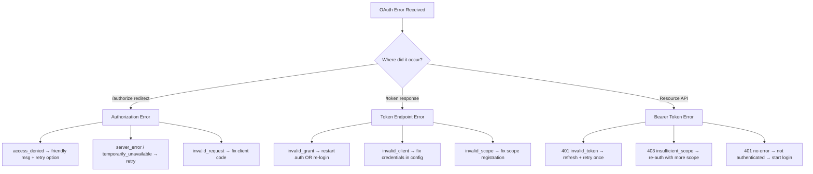

⚡ TL;DR - OAuth 2.0 defines standardized error responses at two
levels: authorization endpoint errors (returned as redirect URL
query parameters: `?error=access_denied&error_description=...`)
and token endpoint errors (returned as JSON: `{error: "...",
error_description: "..."}` with HTTP 400). Bearer token errors
(RFC 6750) use the `WWW-Authenticate` response header with
`error=invalid_token` (401) or `error=insufficient_scope` (403).
Each error code has a specific meaning and a specific correct
client response. Getting error handling right is the difference
between a recoverable failure and a stuck session.

---

### 🔥 The Problem This Solves

**THE ERROR TAXONOMY PROBLEM:**

OAuth flows fail for many different reasons: the user denied
consent (`access_denied`), the authorization code expired
(`invalid_grant`), the access token is insufficient
(`insufficient_scope`), the client is misconfigured
(`invalid_client`), the server has a transient issue
(`temporarily_unavailable`). Each requires a different recovery
action. Without a standard error taxonomy, clients cannot
implement correct recovery logic - every provider uses different
strings, HTTP codes, and field names.

**THE STANDARDIZATION:**

RFC 6749 §4.1.2.1 (authorization errors), §5.2 (token errors),
and RFC 6750 §3.1 (bearer token errors) define the complete
error taxonomy. Any OAuth client that correctly handles these
codes can handle any compliant OAuth provider without provider-
specific error handling code.

---

### 📘 Textbook Definition

OAuth 2.0 defines three error response formats:

**Authorization endpoint errors (RFC 6749 §4.1.2.1):**
Returned via redirect to `redirect_uri?error=CODE&
error_description=TEXT&state=STATE`. Error codes:
`access_denied`, `invalid_request`, `unauthorized_client`,
`unsupported_response_type`, `invalid_scope`,
`server_error`, `temporarily_unavailable`.

**Token endpoint errors (RFC 6749 §5.2):**
HTTP 400 with JSON body `{error: CODE, error_description:
TEXT, error_uri: URL}`. Error codes: `invalid_request`,
`invalid_client` (401 for HTTP Basic), `invalid_grant`,
`unauthorized_client`, `unsupported_grant_type`,
`invalid_scope`.

**Bearer token errors (RFC 6750 §3.1):**
HTTP 401/403 with `WWW-Authenticate: Bearer` header and
optional `error` parameter. Codes: `invalid_token` (401),
`insufficient_scope` (403).

---

### ⏱️ Understand It in 30 Seconds

**Error code → correct client action:**

```
AUTHORIZATION ENDPOINT:
  access_denied           → Show "Permission not granted" message
  invalid_request         → Fix client code (bad parameters)
  server_error            → Retry with backoff
  temporarily_unavailable → Retry with backoff
  invalid_scope           → Fix requested scopes in client config

TOKEN ENDPOINT:
  invalid_grant           → Code expired/replayed → start over
                            OR refresh token expired → re-auth
  invalid_client          → Wrong client credentials → fix config
  invalid_scope           → Scope not registered for this client
  unsupported_grant_type  → AS doesn't support this flow → fix config

BEARER TOKEN (resource API):
  401 invalid_token       → Token expired → refresh → retry once
  401 (no error field)    → Token missing → redirect to auth
  403 insufficient_scope  → Need more permissions → re-auth with scope
```

---

### ⚙️ How It Works (Mechanism)

**Error response locations and formats:**

```
┌──────────────────────────────────────────────────────────┐
│  OAUTH ERROR RESPONSE TAXONOMY                            │
├──────────────────────────────────────────────────────────┤
│                                                           │
│  1. AUTHORIZATION ENDPOINT (GET /authorize)               │
│     User denies or AS returns error → redirect back:      │
│                                                           │
│     GET https://app.example.com/callback                  │
│       ?error=access_denied                                │
│       &error_description=User+denied+access               │
│       &state=xyz789                                       │
│                                                           │
│     Error codes + meanings:                               │
│     access_denied          User clicked "Deny"            │
│     invalid_request        Missing/duplicate parameter    │
│     unauthorized_client    Client not allowed this grant  │
│     unsupported_response_type  AS doesn't support code    │
│     invalid_scope          Scope not supported by AS      │
│     server_error           AS internal error              │
│     temporarily_unavailable AS overloaded / maintenance   │
│                                                           │
│  2. TOKEN ENDPOINT (POST /token)                          │
│     Returns HTTP 400 (or 401 for invalid_client):         │
│                                                           │
│     {                                                     │
│       "error": "invalid_grant",                           │
│       "error_description": "Authorization code expired",  │
│       "error_uri": "https://as.example.com/errors/..."    │
│     }                                                     │
│                                                           │
│     Error codes + when they occur:                        │
│     invalid_request        Missing required parameter     │
│     invalid_client  (401)  Wrong client_id/secret         │
│     invalid_grant          Code expired/replayed          │
│                            or RT expired/revoked          │
│     unauthorized_client    Client can't use this grant    │
│     unsupported_grant_type Grant type not supported       │
│     invalid_scope          Scope not registered           │
│                                                           │
│  3. RESOURCE SERVER (Bearer token errors)                 │
│     RFC 6750 §3.1:                                        │
│                                                           │
│     HTTP 401 (token invalid/missing):                     │
│     WWW-Authenticate: Bearer realm="api.example.com"      │
│     WWW-Authenticate: Bearer error="invalid_token",       │
│       error_description="The access token expired"        │
│                                                           │
│     HTTP 403 (token valid but insufficient scope):        │
│     WWW-Authenticate: Bearer error="insufficient_scope",  │
│       scope="write:contacts"                              │
└──────────────────────────────────────────────────────────┘
```



---

### 💻 Code Example

**Example 1 - BAD then GOOD: Authorization callback error handling:**

```python
# BAD: Treats all OAuth errors the same way
# Logs user-denied-access as a server error
# No distinction between recoverable and non-recoverable

def handle_callback_bad(params):
    if 'error' in params:
        raise Exception(f"OAuth error: {params['error']}")
        # WRONG: access_denied is USER CHOICE, not a bug
        # WRONG: temporarily_unavailable is retryable
```

```python
# GOOD: Handle each error code correctly
# WHY: Different codes require different recovery actions.
#   access_denied: user choice, friendly message only.
#   server_error: retry. invalid_request: fix code.

class OAuthCallbackError(Exception):
    def __init__(self, error: str, description: str):
        self.error = error
        self.description = description
        super().__init__(description)

def handle_callback(
    code: str | None,
    error: str | None,
    error_description: str | None,
    state: str,
    session_state: str,
) -> dict:
    """Handle /callback from AS with full error coverage."""

    # ALWAYS verify state first (CSRF protection)
    if state != session_state:
        raise SecurityError("State mismatch - CSRF attempt")

    if error:
        if error == 'access_denied':
            # User deliberately chose not to authorize
            # NOT a system error. Do NOT log as error.
            return {
                'status': 'denied',
                'message': (
                    "You didn't grant access. "
                    "You can try again anytime."
                ),
            }
        elif error in ('server_error', 'temporarily_unavailable'):
            # Transient AS failure - schedule retry
            # DO log as warning (AS may be having issues)
            import logging
            logging.warning(
                "AS error at /authorize: %s (%s)",
                error, error_description
            )
            return {
                'status': 'retry',
                'message': (
                    "Service temporarily unavailable. "
                    "Please try again in a few moments."
                ),
                'retry_after': 30,  # seconds
            }
        elif error == 'invalid_request':
            # Client code bug - log at error level
            import logging
            logging.error(
                "OAuth invalid_request: %s. "
                "Check client configuration.",
                error_description
            )
            return {
                'status': 'config_error',
                'message': "Authorization configuration error.",
            }
        else:
            # Catch-all for unknown error codes
            raise OAuthCallbackError(
                error, error_description or error
            )

    if not code:
        raise OAuthCallbackError(
            'missing_code',
            'No authorization code in callback'
        )

    # Success path: exchange code for tokens
    return exchange_code(code, session['code_verifier'])
```

**Example 2 - Token endpoint error recovery:**

```python
# Token endpoint: comprehensive error handling

def exchange_code_with_recovery(
    code: str,
    code_verifier: str,
    retry_count: int = 0,
) -> dict:
    """Exchange auth code for tokens with full error handling."""
    resp = requests.post(TOKEN_ENDPOINT, data={
        'grant_type': 'authorization_code',
        'code': code,
        'client_id': CLIENT_ID,
        'redirect_uri': REDIRECT_URI,
        'code_verifier': code_verifier,
    })

    if resp.status_code == 200:
        return resp.json()

    if resp.status_code in (400, 401):
        error_data = resp.json()
        error = error_data.get('error', 'unknown')
        desc = error_data.get('error_description', '')

        if error == 'invalid_grant':
            # Code expired (>10 minutes since /authorize)
            # OR code already used (only usable once!)
            # OR PKCE verifier mismatch
            # → Cannot recover: start over
            raise CodeExpiredError(
                "Authorization code expired or replayed. "
                "Please re-authenticate."
            )

        elif error == 'invalid_client':
            # Wrong client_id/secret
            # → Configuration error; not retryable
            raise ConfigurationError(
                f"Client authentication failed: {desc}"
            )

        elif error == 'invalid_scope':
            # Scope not registered for this client
            # → Fix client registration; not retryable
            raise ConfigurationError(
                f"Scope not configured: {desc}"
            )

        else:
            raise OAuthTokenError(error, desc)

    if resp.status_code == 503 and retry_count < 2:
        # Transient AS error: retry with backoff
        time.sleep(2 ** retry_count)
        return exchange_code_with_recovery(
            code, code_verifier, retry_count + 1
        )

    resp.raise_for_status()
```

**Example 3 - Bearer token error handling at client:**

```python
# Client calling Resource Server: handle RFC 6750 errors

async def call_api_with_token_refresh(
    url: str,
    token_manager: SessionManager,
    max_refresh_attempts: int = 1,
) -> dict:
    """Call API, handle token errors per RFC 6750."""
    access_token = token_manager.get_access_token()
    resp = await httpx.get(
        url,
        headers={'Authorization': f'Bearer {access_token}'}
    )

    if resp.status_code == 200:
        return resp.json()

    if resp.status_code == 401:
        # Parse WWW-Authenticate header
        www_auth = resp.headers.get('WWW-Authenticate', '')

        if 'error="invalid_token"' in www_auth:
            # Token expired or invalid → try refresh ONCE
            if max_refresh_attempts > 0:
                token_manager.do_refresh()
                return await call_api_with_token_refresh(
                    url, token_manager,
                    max_refresh_attempts - 1
                )
            # Refresh also failed → re-authenticate
            raise AuthorizationRequiredError(
                "Token expired and refresh failed"
            )
        else:
            # No token at all (shouldn't happen here)
            raise AuthorizationRequiredError(
                "Not authenticated"
            )

    if resp.status_code == 403:
        # Insufficient scope - cannot fix by refreshing
        # Must re-authorize with the required scope
        www_auth = resp.headers.get('WWW-Authenticate', '')
        required_scope = _extract_scope(www_auth)
        raise InsufficientScopeError(
            f"Token lacks required scope: {required_scope}. "
            "Re-authorize to grant additional permissions.",
            required_scope=required_scope,
        )
        # CRITICAL: Do NOT retry 403 with the same token.
        # Same token = same scope = same 403.
        # 403 requires re-authorization with broader scope.

    resp.raise_for_status()

def _extract_scope(www_auth: str) -> str:
    """Extract scope from WWW-Authenticate header."""
    import re
    m = re.search(r'scope="([^"]+)"', www_auth)
    return m.group(1) if m else ''
```

---

### ⚖️ Comparison Table

| Error Code | HTTP Status | Location | Recovery Action |
|---|---|---|---|
| `access_denied` | 302 redirect | /authorize | Show friendly message; offer retry |
| `server_error` | 302 redirect | /authorize | Retry with exponential backoff |
| `temporarily_unavailable` | 302 redirect | /authorize | Retry after delay |
| `invalid_grant` | 400 | /token | Restart auth (code) or re-login (RT) |
| `invalid_client` | 401 | /token | Fix client_id/secret config |
| `invalid_scope` | 400 | /token | Fix scope in client registration |
| `invalid_token` | 401 | Resource API | Refresh token, retry once |
| `insufficient_scope` | 403 | Resource API | Re-authorize with required scope |

---

### ⚠️ Common Misconceptions

| Misconception | Reality |
|---|---|
| All OAuth errors should be logged at ERROR level | `access_denied` is a user choice - it should be logged at DEBUG or INFO, not ERROR. `server_error` is an AS-side issue - log as WARNING. `invalid_client` is a client misconfiguration - log as ERROR. The log level should reflect the action required, not just that an error occurred. |
| A 403 from a Resource Server can be fixed by refreshing the access token | 403 `insufficient_scope` means the token has valid credentials but lacks the required scope. Getting a new access token via refresh will have the same scopes as the old one. Only re-authorization (new /authorize request with required scope) can fix a 403. |
| `invalid_grant` always means the user needs to log in again | `invalid_grant` has multiple causes: authorization code expired (just re-start the auth flow, user is already authenticated if their session is active), refresh token expired (user must re-login), PKCE verifier mismatch (fix client code). Not all `invalid_grant` errors require a full user re-authentication. |
| The `error_description` field is reliable and always present | `error_description` is OPTIONAL in the spec. Many AS providers return it inconsistently or not at all. Client code must handle the error using the `error` field (standardized), not the description (implementation-specific text). |

---

### 🚨 Failure Modes & Diagnosis

**Retrying 403 Insufficient Scope**

**Symptom:**
Logs show hundreds of 403 responses for the same token, same
endpoint. Metrics show high error rates but no 401 (token not
being refreshed on 403). Client is in an infinite retry loop
on a 403 response.

**Root Cause:**
Client error handler retries all non-200 responses including
403. 403 = valid token, wrong scope. Retrying with the same
token will always return 403. The only fix is re-authorization
with broader scope.

**Fix:**
Never retry 403 `insufficient_scope`. Raise the error to the
application layer, which can: (a) disable the feature for this
user, (b) prompt the user to re-authorize with expanded scope,
or (c) inform the user they need additional permissions.

---

**`invalid_grant` on Authorization Code Replay**

**Symptom:**
Sporadic `invalid_grant` errors on code exchange in logs. Some
users fail to complete login. Investigation reveals the callback
URL is being requested twice (e.g., prefetched by a browser,
double-submitted form, load balancer retry).

**Root Cause:**
Authorization codes are single-use per RFC 6749. The first
exchange succeeds; the second exchange for the same code returns
`invalid_grant`. The AS also treats a replayed code as a
security signal and may revoke any tokens already issued for
that code.

**Fix:**
Handle `invalid_grant` on code exchange by restarting the auth
flow (redirect to `/authorize` again). If the user's AS session
is still active (not expired), the redirect completes without
re-authentication (AS sends a new code silently). Add
idempotency checks at the callback handler to prevent double-
processing of the same `code` parameter.

---

### 🔗 Related Keywords

**Prerequisites:**
- `Authorization Code Flow` - errors in the main flow
- `Token Response Structure` - the response format context

**Builds On:**
- `OAuth 2.0 Threat Model (RFC 6819)` - the attacks behind the errors
- `OAuth Production Debugging` - using error codes in monitoring

---

### 📌 Quick Reference Card

```
┌──────────────────────────────────────────────────────────┐
│ /authorize   │ access_denied: user choice (friendly msg) │
│ ERRORS       │ server_error: retry with backoff          │
│ (redirect)   │ invalid_request: fix client code          │
├──────────────┼───────────────────────────────────────────┤
│ /token       │ invalid_grant: restart flow or re-auth    │
│ ERRORS       │ invalid_client: fix client credentials    │
│ (400/401)    │ invalid_scope: fix scope registration     │
├──────────────┼───────────────────────────────────────────┤
│ RESOURCE API │ 401 invalid_token: refresh + retry once   │
│ ERRORS       │ 403 insufficient_scope: re-auth (not retry│
│              │ 401 (no error): start auth flow           │
├──────────────┼───────────────────────────────────────────┤
│ KEY RULES    │ Don't retry 403 (same scope = same 403)   │
│              │ Retry 503/server_error (transient)        │
│              │ access_denied is NOT an error to log      │
├──────────────┼───────────────────────────────────────────┤
│ ONE-LINER    │ "Each error code = specific action.       │
│              │  403 ≠ 401. Don't retry scope errors."    │
└──────────────────────────────────────────────────────────┘
```

**If you remember only 3 things:**

1. `invalid_grant` at token endpoint = restart the auth flow
   (code expired) or prompt re-login (RT expired). It has
   multiple causes; not all require full re-authentication.

2. `403 insufficient_scope` CANNOT be fixed by refreshing the
   token. Same token = same scope = same 403. Only re-
   authorization with expanded scope resolves it.

3. `access_denied` is a user choice, not a system error. Show
   a friendly "you can try again" message. Never log at ERROR.

**Interview one-liner:**
"OAuth defines three error response locations: authorization
endpoint (redirect with ?error=), token endpoint (400 JSON),
and resource server (401/403 with WWW-Authenticate). Key codes:
invalid_grant = expired/replayed code or RT; access_denied =
user denied; invalid_token = 401, refresh and retry once;
insufficient_scope = 403, re-authorize (don't retry same token);
invalid_client = config error. Each code has a specific correct
recovery action."

---

### ✅ Mastery Checklist

**You've mastered this when you can:**

1. **[IMPLEMENT]** Write a complete OAuth error handler that
   covers all three error locations (authorization callback,
   token endpoint, resource API), handles each error code with
   the correct recovery action, and uses appropriate log levels
   for each.

2. **[DEBUG]** Given a sequence of OAuth error responses in
   production logs, identify: which errors are user-caused
   (access_denied), which are client misconfiguration
   (invalid_client, invalid_scope), and which are transient
   AS issues (server_error, temporarily_unavailable).

3. **[EXPLAIN]** Explain why retrying a 403 `insufficient_scope`
   response will never succeed and what the correct client
   action is. Contrast with the correct handling of 401
   `invalid_token`.
