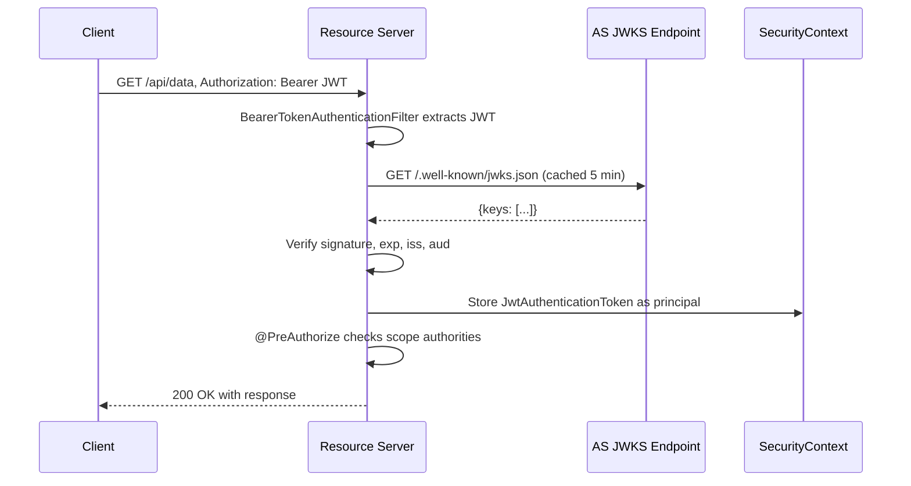

⚡ TL;DR - Spring Security 6 has three OAuth2 modules: the
OAuth2 Client (for apps that delegate authentication to an AS),
the OAuth2 Resource Server (for APIs that validate incoming
bearer tokens - JWT or opaque), and the Spring Authorization
Server (SAS, for building your own AS). The Resource Server
mode is the most common: configure with `oauth2ResourceServer()`
in `SecurityFilterChain`, provide a JWKS URI or public key,
and Spring handles JWT validation, scope-to-authority mapping,
and the `WWW-Authenticate` 401/403 responses automatically.

---

### 🔥 The Problem This Solves

**THE INTEGRATION COMPLEXITY PROBLEM:**

Protecting a Spring API with OAuth2 requires: validating the
JWT signature (JWKS endpoint polling, key rotation), extracting
claims into a `SecurityContext`, enforcing scope requirements
per endpoint, handling expired tokens with correct 401 response,
and supporting both JWT and opaque token modes. Doing this
manually is 200+ lines of filter code. Spring Security encodes
the RFC 6750 resource server contract in ~10 lines of
configuration.

---

### 📘 Textbook Definition

Spring Security 6 OAuth2 support is provided by three
`spring-security-oauth2-*` modules:

**spring-security-oauth2-resource-server:**
Protects APIs from unauthorized access. Parses Bearer tokens
from `Authorization` headers. Supports two modes: JWT
(validates signature locally using JWKS or public key, no
AS call per request) and opaque token introspection (calls
AS `/introspect` per request). Maps JWT claims to Spring
`GrantedAuthority` objects. Returns correct RFC 6750
`WWW-Authenticate` headers on 401/403.

**spring-security-oauth2-client:**
Handles initiating authorization flows, managing tokens in
`OAuth2AuthorizedClientRepository`, and injecting tokens
into outbound `WebClient`/`RestClient` calls. Supports
authorization_code, client_credentials, and refresh_token
grant types.

**spring-authorization-server (SAS):**
Implements a full AS (RFC 6749, RFC 8414, OpenID Connect
1.0 Core). Handles `/authorize`, `/token`, `/introspect`,
`/revoke`, and JWKS endpoints. Configurable via
`AuthorizationServerSettings` and `RegisteredClientRepository`.

---

### ⏱️ Understand It in 30 Seconds

**The three configurations you need most:**

```
Resource Server (JWT mode):
  .oauth2ResourceServer(rs -> rs
    .jwt(jwt -> jwt.jwkSetUri("https://as.example.com/jwks")))
  → Validates tokens; maps scope_X claims to SCOPE_X authorities

Resource Server (opaque mode):
  .oauth2ResourceServer(rs -> rs
    .opaqueToken(ot -> ot
      .introspectionUri("https://as.example.com/introspect")
      .introspectionClientCredentials(id, secret)))
  → Calls /introspect per request; extracts active + scope

Client (calling APIs with client credentials):
  @Bean WebClient webClient(OAuth2AuthorizedClientManager mgr) {
    return WebClient.builder()
      .filter(new ServletOAuth2AuthorizedClientExchangeFilterFunction(mgr))
      .build();
  }
```

---

### ⚙️ How It Works (Mechanism)

**Request processing pipeline for Resource Server (JWT mode):**

```
┌────────────────────────────────────────────────────────────┐
│  SPRING SECURITY OAUTH2 RESOURCE SERVER REQUEST PIPELINE    │
├────────────────────────────────────────────────────────────┤
│  Incoming request:                                          │
│    GET /api/contacts                                        │
│    Authorization: Bearer eyJhbGci...                        │
│                                                             │
│  1. BearerTokenAuthenticationFilter                         │
│     Extracts token from Authorization header                │
│     Creates BearerTokenAuthenticationToken(token)           │
│                                                             │
│  2. AuthenticationManager (JwtAuthenticationProvider)       │
│     - Parse JWT header/payload (base64 decode)              │
│     - Fetch JWKS from .well-known/jwks.json (cached)        │
│     - Verify signature with matching kid                    │
│     - Validate: iss, aud, exp, nbf claims                   │
│     - Map scope claim → GrantedAuthority list               │
│       "read write" → [SCOPE_read, SCOPE_write]              │
│     Returns: JwtAuthenticationToken (principal)             │
│                                                             │
│  3. SecurityContextHolder.setAuthentication(token)          │
│     Principal now available in all downstream code          │
│                                                             │
│  4. Authorization checks (@PreAuthorize / requestMatchers)  │
│     - Has SCOPE_read? → 200 OK                              │
│     - Missing scope? → 403 (insufficient_scope)             │
│     - No token? → 401 with WWW-Authenticate header          │
│                                                             │
│  ERROR PATHS:                                               │
│  Token missing:   BearerTokenEntryPoint → 401               │
│  Token invalid:   BearerTokenAuthenticationEntryPoint → 401 │
│  Token expired:   401 + error="invalid_token"               │
│  Wrong scope:     BearerTokenAccessDeniedHandler → 403      │
└────────────────────────────────────────────────────────────┘
```



---

### 💻 Code Example

**Example 1 - BAD then GOOD: Resource Server configuration:**

```java
// BAD: Manual JWT validation - verbose, error-prone
// Does not handle key rotation, JWKS caching,
// or RFC 6750 WWW-Authenticate header formatting

@Component
public class BadJwtFilter extends OncePerRequestFilter {
    @Override
    protected void doFilterInternal(
        HttpServletRequest req,
        HttpServletResponse res,
        FilterChain chain
    ) throws IOException, ServletException {
        String header = req.getHeader("Authorization");
        if (header != null && header.startsWith("Bearer ")) {
            // WRONG: No JWKS key rotation support
            // WRONG: No aud/iss validation
            // WRONG: Not RFC 6750 compliant on error
            String token = header.substring(7);
            Claims claims = Jwts.parser()
                .setSigningKey(hardcodedKey)
                .parseClaimsJws(token)
                .getBody();
            // manual SecurityContext population...
        }
        chain.doFilter(req, res);
    }
}
```

```java
// GOOD: Spring Security OAuth2 Resource Server
// WHY: JWKS caching + rotation, RFC 6750 error responses,
//   scope mapping, and audience validation in ~15 lines.

@Configuration
@EnableWebSecurity
@EnableMethodSecurity   // For @PreAuthorize
public class SecurityConfig {

    @Bean
    public SecurityFilterChain securityFilterChain(
        HttpSecurity http
    ) throws Exception {
        return http
            .csrf(csrf -> csrf.disable())  // APIs use JWT, no session
            .sessionManagement(session -> session
                .sessionCreationPolicy(
                    SessionCreationPolicy.STATELESS
                )
            )
            .authorizeHttpRequests(auth -> auth
                .requestMatchers("/actuator/health").permitAll()
                .anyRequest().authenticated()
            )
            .oauth2ResourceServer(rs -> rs
                .jwt(jwt -> jwt
                    .jwkSetUri(
                        "https://as.example.com/.well-known/jwks.json"
                    )
                    .jwtAuthenticationConverter(
                        jwtAuthenticationConverter()
                    )
                )
            )
            .build();
    }

    @Bean
    public JwtAuthenticationConverter jwtAuthenticationConverter() {
        JwtGrantedAuthoritiesConverter conv =
            new JwtGrantedAuthoritiesConverter();
        // Default: "scope" claim → SCOPE_ prefix
        // Custom: map "roles" claim with "ROLE_" prefix
        conv.setAuthoritiesClaimName("scope");
        conv.setAuthorityPrefix("SCOPE_");

        JwtAuthenticationConverter converter =
            new JwtAuthenticationConverter();
        converter.setJwtGrantedAuthoritiesConverter(conv);
        return converter;
    }
}
```

**Example 2 - Method-level scope enforcement:**

```java
// Scope enforcement per endpoint with @PreAuthorize
// Preferred over requestMatchers for fine-grained control

@RestController
@RequestMapping("/api/contacts")
public class ContactsController {

    // Requires scope "read:contacts" in the token
    @GetMapping
    @PreAuthorize("hasAuthority('SCOPE_read:contacts')")
    public List<Contact> getContacts() {
        return contactService.findAll();
    }

    // Requires scope "write:contacts"
    @PostMapping
    @PreAuthorize("hasAuthority('SCOPE_write:contacts')")
    public Contact createContact(
        @RequestBody CreateContactRequest req
    ) {
        return contactService.create(req);
    }

    // Extract the principal's subject claim
    @GetMapping("/me")
    @PreAuthorize("isAuthenticated()")
    public UserInfo getMyInfo(
        @AuthenticationPrincipal Jwt jwt
    ) {
        String userId = jwt.getSubject();       // sub claim
        String email  = jwt.getClaimAsString("email");
        return new UserInfo(userId, email);
    }
}
```

**Example 3 - Client credentials outbound calls with WebClient:**

```java
// Service-to-service: use client credentials grant
// Spring's OAuth2AuthorizedClientManager handles token
// caching, refresh, and retry automatically.

@Configuration
public class WebClientConfig {

    @Bean
    public WebClient serviceWebClient(
        OAuth2AuthorizedClientManager authorizedClientManager
    ) {
        ServletOAuth2AuthorizedClientExchangeFilterFunction
            filter =
                new ServletOAuth2AuthorizedClientExchangeFilterFunction(
                    authorizedClientManager
                );
        // Set default client registration to use
        filter.setDefaultClientRegistrationId(
            "internal-service"
        );
        return WebClient.builder()
            .apply(filter.oauth2Configuration())
            .build();
    }

    @Bean
    public OAuth2AuthorizedClientManager authorizedClientManager(
        ClientRegistrationRepository clients,
        OAuth2AuthorizedClientRepository authorizedClients
    ) {
        OAuth2AuthorizedClientProvider provider =
            OAuth2AuthorizedClientProviderBuilder.builder()
                .clientCredentials()
                .refreshToken()
                .build();
        DefaultOAuth2AuthorizedClientManager mgr =
            new DefaultOAuth2AuthorizedClientManager(
                clients, authorizedClients
            );
        mgr.setAuthorizedClientProvider(provider);
        return mgr;
    }
}

// application.yml (client registration config):
// spring:
//   security:
//     oauth2:
//       client:
//         registration:
//           internal-service:
//             client-id: my-service
//             client-secret: ${CLIENT_SECRET}
//             authorization-grant-type: client_credentials
//             scope: read:orders write:orders
//         provider:
//           internal-service:
//             token-uri: https://as.example.com/token

// Usage: WebClient will automatically inject Bearer token
@Service
public class OrderServiceClient {
    private final WebClient webClient;

    public OrderServiceClient(WebClient serviceWebClient) {
        this.webClient = serviceWebClient;
    }

    public Mono<Order> getOrder(String orderId) {
        return webClient.get()
            .uri(
                "https://orders-service/api/orders/{id}",
                orderId
            )
            .retrieve()
            .bodyToMono(Order.class);
        // Token is automatically injected + refreshed
    }
}
```

---

### ⚖️ Comparison Table

| Configuration | Use Case | Token Validation | Overhead per Request |
|---|---|---|---|
| **JWT (jwkSetUri)** | Standard RS | Local (JWKS cached) | Near-zero (cache hit) |
| **Opaque introspection** | Immediate revocation needed | Remote (/introspect call) | Network RTT to AS |
| **OAuth2 Client (auth code)** | User-facing web app | N/A (client doesn't validate) | Token refresh when expired |
| **Client Credentials** | Service-to-service | N/A (caller) | Token cache, refresh ~5 min |

---

### ⚠️ Common Misconceptions

| Misconception | Reality |
|---|---|
| Spring Security validates JWT against the database | JWT validation in Spring Security is stateless by default: cryptographic signature verification using JWKS public keys. No database call. Revoked JWTs remain valid until expiry unless you add an opaque token introspection layer or a custom filter that checks a revocation list. |
| `@PreAuthorize("hasRole('ADMIN')")` works with OAuth2 JWT scopes | `hasRole('ADMIN')` expects a `ROLE_ADMIN` authority. OAuth2 scope claims are mapped to `SCOPE_scope_name` authorities by default (e.g., `SCOPE_admin`). Use `hasAuthority('SCOPE_admin')` for scope-based checks, or customize the `JwtGrantedAuthoritiesConverter` to add `ROLE_` prefixes if needed. |
| The JWKS endpoint is called on every request | Spring Security caches the JWKS response (default 5 minutes). The JWT's `kid` (key ID) header is matched against cached keys. Only on a cache miss (unknown `kid`) or cache expiry does Spring re-fetch the JWKS. Key rotation is handled automatically: new key appears in JWKS, old JWT `kid` still in cache, new JWT `kid` triggers JWKS refresh. |
| Spring Authorization Server requires Keycloak or Auth0 | SAS (spring-authorization-server) is an AS implementation built by the Spring team as a first-class Spring project. It implements RFC 6749, OIDC 1.0 Core, PKCE, token introspection, token revocation, and dynamic client registration. It runs as a standard Spring Boot app. |

---

### 🚨 Failure Modes & Diagnosis

**JWT Validation Failing Due to Missing `aud` Claim**

**Symptom:**
All requests to the Resource Server return 401 even with a
valid token. Logs show `JwtException: The aud claim is not
valid`. Token inspection at jwt.io shows token is well-formed.

**Root Cause:**
Spring Security Resource Server (JWT mode) validates the `aud`
(audience) claim when `spring.security.oauth2.resourceserver
.jwt.audiences` is configured. If the token does not include
the configured audience in its `aud` claim, validation fails.

**Diagnostic:**

```bash
# Decode the JWT payload (not verifying signature):
echo "eyJhbGci..." | cut -d. -f2 | base64 -d | python -m json.tool
# Look for "aud" field in output
# Compare with spring.security.oauth2.resourceserver.jwt.audiences config
```

**Fix options:**
a) Configure the AS to include the RS's audience in the token.
b) Remove the `audiences` configuration if audience check is
not needed (not recommended for production).
c) Add `@Bean JwtDecoder jwtDecoder()` with custom configuration
that validates against the correct audience value.

---

**403 on All Requests Despite Correct Scope**

**Symptom:**
API returns 403 on all authenticated requests. Token has
`"scope": "read:contacts"` in JWT payload. Method is annotated
with `@PreAuthorize("hasAuthority('SCOPE_read:contacts')")`.

**Root Cause (most common):** The JWT uses a `roles` or
`authorities` claim instead of `scope`, but
`JwtGrantedAuthoritiesConverter` is not configured to read it.
Default converter reads only `scope` and `scp` claims.

**Diagnostic:**

```java
// Add this debug log to see what authorities Spring extracted:
@GetMapping("/debug/me")
@PreAuthorize("isAuthenticated()")
public Map<String, Object> debugAuth(
    Authentication auth
) {
    return Map.of(
        "principal", auth.getName(),
        "authorities", auth.getAuthorities()
        // Compare with expected SCOPE_ strings
    );
}
```

**Fix:**

```java
// Configure converter to read the correct claim:
JwtGrantedAuthoritiesConverter conv =
    new JwtGrantedAuthoritiesConverter();
conv.setAuthoritiesClaimName("roles");   // or "authorities"
conv.setAuthorityPrefix("ROLE_");        // match @PreAuthorize
```

---

### 🔗 Related Keywords

**Prerequisites:**
- `Token Validation` - what Spring RS does under the hood
- `Client Credentials Flow` - for service-to-service patterns

**Builds On:**
- `JWT Access Tokens (RFC 9068)` - the token format RS validates
- `Spring Authorization Server` - building your own AS

---

### 📌 Quick Reference Card

```
┌──────────────────────────────────────────────────────────┐
│ RESOURCE     │ .oauth2ResourceServer(rs -> rs            │
│ SERVER (JWT) │   .jwt(jwt -> jwt.jwkSetUri("...")))      │
│              │ → validates locally via JWKS (cached)     │
├──────────────┼───────────────────────────────────────────┤
│ RESOURCE     │ .opaqueToken(ot -> ot                     │
│ SERVER (OT)  │   .introspectionUri("...")                 │
│              │   .introspectionClientCredentials(id,sec))│
├──────────────┼───────────────────────────────────────────┤
│ SCOPE AUTHORITIES scope claim→ SCOPE_x default prefix    │
│              │ Use hasAuthority('SCOPE_x') in @PreAuth   │
├──────────────┼───────────────────────────────────────────┤
│ CLIENT CREDS │ OAuth2AuthorizedClientManager +           │
│ OUTBOUND     │ ServletOAuth2AuthorizedClientExchange...  │
│              │ → auto-inject Bearer token in WebClient   │
├──────────────┼───────────────────────────────────────────┤
│ 403 DEBUG    │ auth.getAuthorities() to see actual list  │
│              │ Check JwtGrantedAuthoritiesConverter cfg  │
├──────────────┼───────────────────────────────────────────┤
│ ONE-LINER    │ "RS JWT: ~10 lines config, JWKS cached,   │
│              │  scope→SCOPE_ mapped automatically."      │
└──────────────────────────────────────────────────────────┘
```

**If you remember only 3 things:**

1. `oauth2ResourceServer().jwt().jwkSetUri()` handles all JWT
   validation: signature, exp, iss, aud. Add
   `@EnableMethodSecurity` + `@PreAuthorize("hasAuthority(
   'SCOPE_x')")` for scope-level authorization.

2. Default scope mapping: `"scope": "read write"` in JWT →
   authorities `[SCOPE_read, SCOPE_write]`. If your token uses
   `roles` or `permissions` claim, configure
   `JwtGrantedAuthoritiesConverter` to read that claim.

3. For opaque tokens: use `.opaqueToken()` mode. Spring calls
   `/introspect` per request (network overhead), but revocation
   is immediately visible unlike JWT (which remains valid until
   `exp` even after revocation).