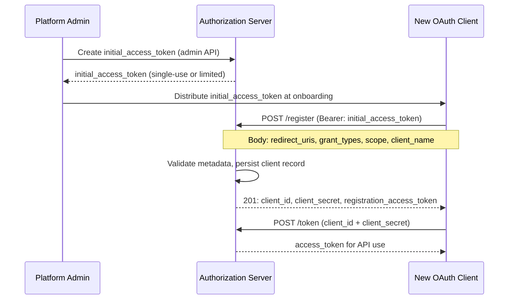

⚡ TL;DR - RFC 7591 Dynamic Client Registration lets OAuth clients
register themselves programmatically at the AS's `/register`
endpoint instead of requiring an administrator to manually
create client credentials in the AS UI. The client POSTs its
metadata (redirect_uris, grant_types, client_name, scope) and
receives back `client_id` and optionally `client_secret`. Key
use cases: multi-tenant SaaS platforms where each customer needs
an isolated OAuth client, developer API portals that auto-issue
client credentials, and OpenID Connect Federation scenarios.
RFC 7592 extends this with client management (read, update, delete).

---

### 🔥 The Problem This Solves

**THE MANUAL PROVISIONING BOTTLENECK:**

In traditional OAuth deployment, every new client (app) must
be pre-registered by an administrator in the AS's admin UI.
For a multi-tenant SaaS platform with thousands of customers,
or an API marketplace issuing developer credentials at signup,
manual registration is a bottleneck that doesn't scale.

**THE SOLUTION:**

Expose a `/register` endpoint at the AS that clients can
call programmatically. The AS validates the registration
request and issues client_id (and client_secret for
confidential clients) in the response. Client registration
becomes a self-service API call at onboarding time.

---

### 📘 Textbook Definition

RFC 7591 (OAuth 2.0 Dynamic Client Registration Protocol)
defines a standard for clients to register with an AS by
sending a `POST` request to the AS's registration endpoint
(`/register` or as discovered via OIDC discovery metadata).

**Registration request fields (client metadata):**
`redirect_uris` (REQUIRED for code flow clients),
`token_endpoint_auth_method` (none/client_secret_basic/
client_secret_post/private_key_jwt), `grant_types`
(authorization_code/client_credentials/refresh_token),
`response_types` (code), `client_name`, `client_uri`,
`scope`, `contacts`, `logo_uri`, `policy_uri`, `tos_uri`,
`jwks_uri` or `jwks` (for private_key_jwt auth).

**Registration response:**
All submitted metadata + `client_id`, optionally
`client_secret`, `client_id_issued_at`, and
`client_secret_expires_at` (0 = no expiry). For RFC 7592
(management), also `registration_access_token` and
`registration_client_uri` for subsequent management calls.

**Access modes:**
Protected (requires initial_access_token issued by AS admin
- prevents open registration), open (no token required -
AS auto-approves all registrations, typically for development
environments only).

---

### ⏱️ Understand It in 30 Seconds

**The registration call:**

```
POST /register
Authorization: Bearer <initial_access_token>  # if protected
Content-Type: application/json

{
  "client_name": "Acme Corp App",
  "redirect_uris": ["https://acme.example.com/callback"],
  "grant_types": ["authorization_code", "refresh_token"],
  "response_types": ["code"],
  "scope": "openid profile read:orders",
  "token_endpoint_auth_method": "client_secret_basic"
}

→ 201 Created:
{
  "client_id": "s6BhdRkqt3",
  "client_secret": "cf136dc3c1fc93f31185e5885805d",
  "client_id_issued_at": 2893256800,
  "client_secret_expires_at": 0
}
```

---

### ⚙️ How It Works (Mechanism)

```
┌────────────────────────────────────────────────────────────┐
│  DYNAMIC CLIENT REGISTRATION FLOW                           │
├────────────────────────────────────────────────────────────┤
│                                                             │
│  1. OBTAIN INITIAL ACCESS TOKEN (Protected Registration)    │
│     Admin generates IAT in AS admin UI or via admin API.    │
│     IAT is scoped, short-lived, and single-use or limited.  │
│     IAT is distributed to new clients at onboarding.        │
│                                                             │
│  2. REGISTRATION REQUEST                                    │
│     Client POSTs metadata to /register.                     │
│     AS validates:                                           │
│       - redirect_uris are HTTPS (not for localhost)         │
│       - grant_types + response_types are consistent         │
│       - requested scope is within allowed scope             │
│       - jwks_uri is reachable (for private_key_jwt)         │
│     AS creates client record (persists to DB).              │
│                                                             │
│  3. REGISTRATION RESPONSE (201 Created)                     │
│     client_id issued (unique, permanent).                   │
│     client_secret issued (if confidential client).          │
│     client_secret_expires_at: 0 = never expires.            │
│     registration_access_token (RFC 7592): for management.   │
│     registration_client_uri: URI for READ/UPDATE/DELETE.    │
│                                                             │
│  4. CLIENT MANAGEMENT (RFC 7592 - optional)                 │
│     GET  /register/{client_id}  → read current metadata     │
│     PUT  /register/{client_id}  → update metadata           │
│     DELETE /register/{client_id} → delete client            │
│     All require registration_access_token in Authorization. │
│                                                             │
│  SECURITY MODES:                                            │
│  Protected: POST /register requires initial_access_token    │
│  → Only pre-vetted clients can register                     │
│  → Used in production                                       │
│                                                             │
│  Open: POST /register requires no token                     │
│  → Any client can register itself                           │
│  → Typically restricted to development AS only             │
└────────────────────────────────────────────────────────────┘
```



---

### 💻 Code Example

**Example 1 - BAD then GOOD: Multi-tenant onboarding:**

```python
# BAD: Manual provisioning - requires admin action for each tenant
# Blocks new customer activation on admin availability

def onboard_tenant_bad(tenant_name: str, redirect_uri: str):
    # WRONG: Admin must manually log into AS admin UI
    # WRONG: Creates ticket in Jira, 2-3 day turnaround
    # WRONG: Does not scale past ~100 tenants
    send_email_to_admin(
        f"Please create OAuth client for {tenant_name} "
        f"with redirect_uri={redirect_uri}"
    )
    return "Pending manual provisioning"
```

```python
# GOOD: Automated dynamic client registration at tenant signup
# WHY: Each tenant gets an isolated OAuth client with their
#   own client_id/secret. No admin bottleneck.

import requests, secrets, json

AS_REGISTRATION_ENDPOINT = (
    "https://as.example.com/register"
)

def provision_tenant_oauth_client(
    tenant_id: str,
    tenant_name: str,
    redirect_uris: list[str],
    initial_access_token: str,
) -> dict:
    """Register a new OAuth client for a tenant."""
    registration_request = {
        "client_name": f"{tenant_name} ({tenant_id})",
        "redirect_uris": redirect_uris,
        "grant_types": [
            "authorization_code",
            "refresh_token",
        ],
        "response_types": ["code"],
        "scope": "openid profile read:data write:data",
        "token_endpoint_auth_method": "client_secret_basic",
        "contacts": [f"support+{tenant_id}@example.com"],
        # Metadata to help AS admins identify the client:
        "client_uri": f"https://{tenant_id}.example.com",
    }

    resp = requests.post(
        AS_REGISTRATION_ENDPOINT,
        headers={
            "Authorization": f"Bearer {initial_access_token}",
            "Content-Type": "application/json",
        },
        json=registration_request,
        timeout=10,
    )

    if resp.status_code == 201:
        data = resp.json()
        # Store client_id and client_secret securely
        # (e.g., encrypted in DB, not in plaintext logs)
        client_record = {
            "client_id": data["client_id"],
            # Treat like a password: store hashed or encrypted
            "client_secret": data["client_secret"],
            "registration_access_token": data.get(
                "registration_access_token"
            ),
            "registration_client_uri": data.get(
                "registration_client_uri"
            ),
        }
        return client_record

    elif resp.status_code == 400:
        error = resp.json().get("error", "")
        if error == "invalid_redirect_uri":
            raise RegistrationError(
                "Invalid redirect_uri format or scheme"
            )
        raise RegistrationError(
            f"Registration failed: {resp.json()}"
        )
    else:
        resp.raise_for_status()

# Usage during tenant onboarding:
initial_token = get_initial_access_token_from_vault()
client = provision_tenant_oauth_client(
    tenant_id="acme-corp",
    tenant_name="Acme Corporation",
    redirect_uris=["https://acme.example.com/oauth/callback"],
    initial_access_token=initial_token,
)
# Store client_id and client_secret in tenant config
tenant_config.oauth_client_id = client["client_id"]
tenant_config.save_encrypted_secret(client["client_secret"])
```

**Example 2 - RFC 7592 Client Management (update redirect URIs):**

```python
# RFC 7592: Update client metadata after registration
# Common use case: tenant adds a new redirect_uri
#   for a new app environment (staging, mobile)

def add_redirect_uri_to_client(
    registration_client_uri: str,
    registration_access_token: str,
    current_metadata: dict,
    new_redirect_uri: str,
) -> dict:
    """Add a redirect_uri to existing client registration."""
    updated_redirect_uris = list(
        set(current_metadata["redirect_uris"] + [new_redirect_uri])
    )

    # RFC 7592: PUT replaces ALL metadata (not a PATCH)
    # MUST include all existing fields + new values
    updated_metadata = {
        **current_metadata,
        "redirect_uris": updated_redirect_uris,
        # Remove server-issued fields (not allowed in PUT):
        # client_id, client_secret, registration_* fields
    }
    for server_field in [
        "client_id", "client_secret",
        "client_id_issued_at", "client_secret_expires_at",
        "registration_access_token", "registration_client_uri"
    ]:
        updated_metadata.pop(server_field, None)

    resp = requests.put(
        registration_client_uri,
        headers={
            "Authorization": (
                f"Bearer {registration_access_token}"
            ),
            "Content-Type": "application/json",
        },
        json=updated_metadata,
        timeout=10,
    )
    resp.raise_for_status()
    return resp.json()
```

---

### ⚖️ Comparison Table

| Mode | Who Registers | Use Case | Security Level |
|---|---|---|---|
| **Protected (IAT required)** | Clients with admin-issued token | Production multi-tenant SaaS | High (controlled) |
| **Open registration** | Any client, no token | Development AS, testing | Low (any client registers) |
| **Static (manual)** | Admin via AS UI | Small fixed client count | Highest (fully controlled) |
| **RFC 7592 (management)** | Client manages own registration | Self-service, Terraform-like | High (RAT-protected) |

---

### ⚠️ Common Misconceptions

| Misconception | Reality |
|---|---|
| Dynamic registration means any client can register with no restrictions | In protected mode (recommended for production), every registration requires a valid `initial_access_token` issued by an admin. Open registration (no IAT required) is typically disabled in production and reserved for developer sandboxes. The "dynamic" refers to the mechanism being programmatic, not to being unrestricted. |
| `client_secret_expires_at: 0` means the client secret expired | `0` is a special value defined in RFC 7591 meaning "the client secret does NOT expire" (no expiry). A non-zero value is a Unix timestamp indicating when it expires. This is the opposite of what most developers initially assume. |
| After updating via RFC 7592 PUT, the client_secret is rotated | A RFC 7592 PUT updates client metadata (redirect_uris, grant_types, scope, etc.) but does NOT rotate the `client_secret`. Secret rotation requires a specific mechanism provided by the AS (if supported), or deleting and re-registering the client. |
| Dynamic client registration is only useful for large platforms | Any system that provisions client applications programmatically benefits: CI/CD pipelines that register short-lived OAuth clients for test environments, Kubernetes operators that provision AS clients for new service deployments, and OpenID Connect Federation for cross-domain trust establishment. |

---

### 🚨 Failure Modes & Diagnosis

**Registration Token Leakage**

**Symptom:**
Unauthorized third-party clients appearing in AS admin console
with the platform's `client_name` prefix. Registration audit
logs show requests from unknown IP addresses.

**Root Cause:**
`initial_access_token` distributed to new customers via email
or stored in client-side code was leaked. Or the registration
endpoint was left in "open" mode (no IAT required) in
production by mistake.

**Mitigation:**
1. Enable protected mode: require IAT for all registrations.
2. Issue short-lived, single-use IATs (not reusable tokens).
3. Distribute IAT via secure out-of-band channel (not email).
4. Audit the `/register` endpoint access logs for anomalies.
5. Rate-limit the `/register` endpoint.

---

**`registration_access_token` Lost - Cannot Update Client**

**Symptom:**
Tenant requests to update their redirect_uri (e.g., adding a
mobile app). System cannot find the `registration_access_token`
stored at registration time. RFC 7592 PUT returns 401.

**Root Cause:**
`registration_access_token` was not persisted at registration
time, or was stored in an ephemeral location (in-memory cache
that was cleared).

**Fix:**
Store `registration_access_token` alongside `client_id` and
`client_secret` in a secure, persistent store (encrypted DB
or secrets manager). If lost, the AS admin must either issue
a new `registration_access_token` via the AS admin API, or
the client must be deleted and re-registered.

---

### 🔗 Related Keywords

**Prerequisites:**
- `Client ID and Client Secret` - what registration issues
- `OAuth 2.0 Roles` - the client role being provisioned

**Builds On:**
- `Multi-Tenant OAuth Configuration` - using per-tenant clients
- `Pushed Authorization Requests (PAR)` - advanced AS features

---

### 📌 Quick Reference Card

```
┌──────────────────────────────────────────────────────────┐
│ REGISTER     │ POST /register                            │
│              │ Body: redirect_uris, grant_types, scope   │
│              │ Auth: Bearer initial_access_token         │
│              │ → 201: client_id, client_secret           │
├──────────────┼───────────────────────────────────────────┤
│ MANAGE       │ GET/PUT/DELETE /register/{id}             │
│ (RFC 7592)   │ Auth: Bearer registration_access_token    │
│              │ PUT = full replace (not PATCH)            │
├──────────────┼───────────────────────────────────────────┤
│ KEY FIELDS   │ expires_at=0 → secret never expires       │
│              │ registration_access_token → store it!     │
├──────────────┼───────────────────────────────────────────┤
│ SECURITY     │ Protected: IAT required (production)      │
│ MODES        │ Open: no IAT (dev only)                   │
├──────────────┼───────────────────────────────────────────┤
│ USE CASES    │ Multi-tenant SaaS, API marketplace,       │
│              │ OIDC Federation, CI/CD test clients        │
├──────────────┼───────────────────────────────────────────┤
│ ONE-LINER    │ "Client POSTs metadata, AS returns        │
│              │  client_id/secret. No admin UI needed."   │
└──────────────────────────────────────────────────────────┘
```

**If you remember only 3 things:**

1. Dynamic registration = `POST /register` with client metadata
   → receive `client_id` + `client_secret`. Requires an
   `initial_access_token` in protected mode (production standard).

2. `client_secret_expires_at: 0` means NEVER expires (not
   "already expired"). Non-zero = Unix timestamp of expiry.

3. Store `registration_access_token` persistently alongside
   `client_secret`. It is needed for RFC 7592 client management
   (update, delete). If lost, client may need to be re-registered.
