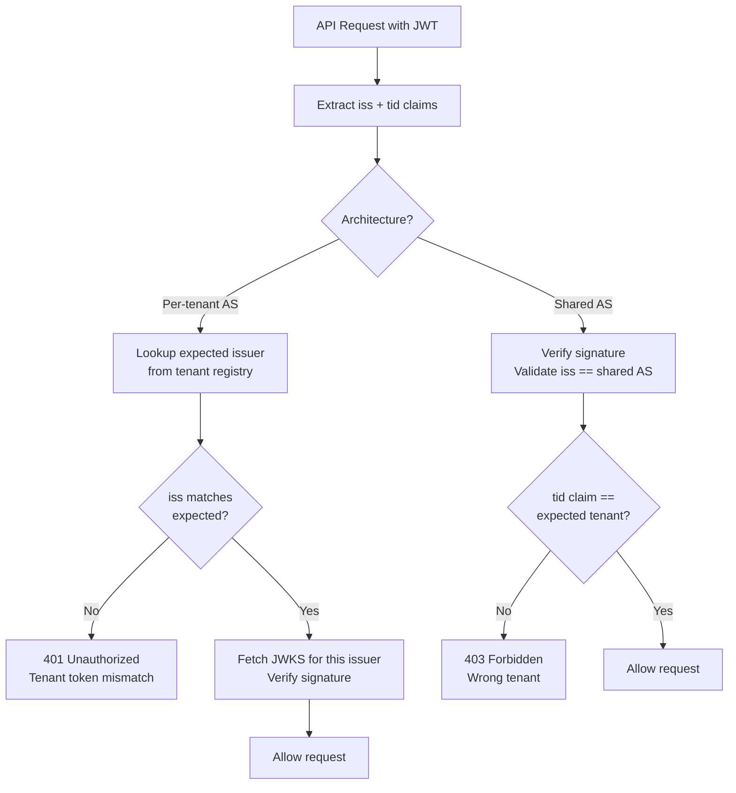

⚡ TL;DR - Multi-tenant OAuth has two main architectures: one
AS per tenant (Keycloak realms, Auth0 tenants) where each tenant
has isolated issuer URLs, JWKS, and client registrations; and a
shared AS with tenant-aware tokens where the AS includes a tenant
claim (`tid`, `tenant_id`) in the JWT and the Resource Server
validates both token authenticity and tenant membership. The
`iss` (issuer) claim validation is the key security control:
it prevents tokens issued for tenant A from being used against
tenant B. Getting `iss` validation right in a multi-tenant
setup requires dynamic issuer resolution, not hardcoded strings.

---

### 🔥 The Problem This Solves

**THE TENANT ISOLATION PROBLEM:**

A SaaS platform serves hundreds of customers. Each customer
has their own users, their own data, and (in enterprise SaaS)
their own identity provider (Okta, Azure AD, Google Workspace).
If a token issued for customer A's tenant can be used to access
customer B's data, the platform has a critical security failure.
Multi-tenant OAuth configuration is the architectural pattern
that enforces tenant isolation at the authorization layer.

---

### 📘 Textbook Definition

Multi-tenant OAuth configuration is the design pattern for
issuing and validating OAuth 2.0 tokens in SaaS platforms
where multiple customer organizations (tenants) share the
same application infrastructure.

**Architecture 1 - One AS per tenant:**
Each tenant gets its own AS instance (Keycloak realm, Auth0
tenant, Cognito user pool). Distinct issuer URL (e.g.,
`https://as.example.com/realms/acme-corp`). Distinct JWKS
endpoint and signing keys. Complete isolation of user accounts,
client registrations, and token policies. RS validates `iss`
against a tenant-to-issuer mapping registry.

**Architecture 2 - Shared AS with tenant claims:**
All tenants share one AS instance. AS includes tenant identifier
in the JWT as a custom claim (`tid`, `tenant_id`, `org_id`).
RS validates token signature + tenant claim ownership. Simpler
operationally; less isolation (one AS compromise affects all
tenants).

**Hybrid:** Shared AS with per-tenant signing keys and per-tenant
issuer URL patterns (used by Microsoft Azure AD, which issues
from `https://login.microsoftonline.com/{tenant_id}/...`).

---

### ⏱️ Understand It in 30 Seconds

**The two architectures:**

```
ARCH 1: ONE AS PER TENANT
  Tenant A → AS: https://as.example.com/realms/tenant-a
  Tenant B → AS: https://as.example.com/realms/tenant-b
  RS validates: iss == expected issuer for THIS request's tenant

ARCH 2: SHARED AS + TENANT CLAIM
  All tenants → AS: https://as.example.com
  Token includes: {"tid": "tenant-a", "sub": "user123"}
  RS validates: iss == shared issuer AND tid == expected tenant

KEY SECURITY RULE:
  Token for tenant A must NEVER be accepted for tenant B's data.
  The security control is iss validation (Arch 1) or
  iss + tenant_claim validation (Arch 2).
```

---

### ⚙️ How It Works (Mechanism)

```
┌────────────────────────────────────────────────────────────┐
│  MULTI-TENANT OAUTH: ISS VALIDATION PATTERNS               │
├────────────────────────────────────────────────────────────┤
│                                                             │
│  ARCHITECTURE 1: PER-TENANT AS (Keycloak Realms)            │
│                                                             │
│  Tenant A's users get tokens with:                          │
│    iss: "https://as.example.com/realms/tenant-a"            │
│  Tenant B's users get tokens with:                          │
│    iss: "https://as.example.com/realms/tenant-b"            │
│                                                             │
│  Resource Server validation (request to /api/tenant-a/...) │
│    1. Extract JWT.                                          │
│    2. Extract iss claim.                                    │
│    3. Lookup issuer in tenant registry:                     │
│       tenant_registry["tenant-a"] =                         │
│         "https://as.example.com/realms/tenant-a"            │
│    4. Compare JWT.iss == expected_iss → match = valid.      │
│    5. Fetch JWKS from iss+/.well-known/openid-configuration │
│    6. Verify signature. Validate exp, aud.                  │
│                                                             │
│  TOKEN ISOLATION:                                           │
│  Tenant-B token used against tenant-A resource:             │
│    JWT.iss = "https://.../realms/tenant-b"                  │
│    Expected: "https://.../realms/tenant-a"                  │
│    → iss mismatch → 401 Unauthorized ✓                      │
│                                                             │
│  ARCHITECTURE 2: SHARED AS + tid CLAIM                      │
│                                                             │
│  All tokens have: iss: "https://as.example.com"             │
│  Plus: "tid": "tenant-a" (custom claim in AS config)        │
│                                                             │
│  Resource Server validation:                                │
│    1. Validate JWT signature (single JWKS source).          │
│    2. Validate exp, iss == "https://as.example.com".        │
│    3. Extract tid claim.                                     │
│    4. Verify tid == expected_tenant for this API path.      │
│                                                             │
│  TOKEN ISOLATION:                                           │
│  Tenant-B token used against tenant-A resource:             │
│    JWT.tid = "tenant-b"                                     │
│    Expected: "tenant-a"                                     │
│    → tid mismatch → 403 Forbidden ✓                         │
│                                                             │
│  AZURE AD PATTERN (Hybrid):                                 │
│  iss: "https://login.microsoftonline.com/{tenantId}/v2.0"   │
│  Sub-path is tenant-specific → iss validation enforces      │
│  tenant isolation dynamically. JWKS per tenant.             │
└────────────────────────────────────────────────────────────┘
```



---

### 💻 Code Example

**Example 1 - BAD then GOOD: iss validation in multi-tenant RS:**

```python
# BAD: Hardcoded single issuer - only validates one tenant
# WRONG: All tenants must use the same AS issuer
# WRONG: A token from any compliant AS passes iss check

class BadMultiTenantResourceServer:
    JWKS_URI = "https://as.example.com/.well-known/jwks.json"
    ISSUER = "https://as.example.com"  # Only one issuer

    def validate_token(self, jwt_token: str) -> dict:
        # WRONG: Does not check which tenant the request is for
        # WRONG: Tenant-B token will pass for Tenant-A resource
        claims = jwt.decode(
            jwt_token,
            algorithms=["RS256"],
            issuer=self.ISSUER,   # Only one issuer allowed
            options={"verify_aud": False},
        )
        return claims
```

```python
# GOOD: Dynamic issuer resolution per tenant
# WHY: Each tenant has its own issuer URL (per-AS architecture).
#   Token from tenant-B rejected for tenant-A resources because
#   the expected issuer is fetched from the tenant registry.

from functools import lru_cache
import httpx, jwt as pyjwt

class TenantRegistry:
    """Map tenant_id → AS issuer URL."""
    def __init__(self):
        # Loaded from DB at startup / refreshed periodically
        self._registry: dict[str, str] = {}

    def get_issuer_url(self, tenant_id: str) -> str:
        if tenant_id not in self._registry:
            raise TenantNotFoundError(
                f"Unknown tenant: {tenant_id}"
            )
        return self._registry[tenant_id]

    def register_tenant(
        self, tenant_id: str, issuer_url: str
    ):
        # Called when a new tenant is onboarded
        self._registry[tenant_id] = issuer_url

class MultiTenantResourceServer:
    def __init__(self, tenant_registry: TenantRegistry):
        self._registry = tenant_registry
        self._jwks_cache: dict[str, pyjwt.PyJWKClient] = {}

    def _get_jwks_client(
        self, issuer_url: str
    ) -> pyjwt.PyJWKClient:
        """Get (or create) JWKS client for this issuer."""
        if issuer_url not in self._jwks_cache:
            # Discover JWKS URI from OpenID configuration
            oidc_config_url = (
                f"{issuer_url}/.well-known/openid-configuration"
            )
            config = httpx.get(
                oidc_config_url, timeout=5
            ).json()
            jwks_uri = config["jwks_uri"]
            self._jwks_cache[issuer_url] = (
                pyjwt.PyJWKClient(jwks_uri)
            )
        return self._jwks_cache[issuer_url]

    def validate_token_for_tenant(
        self,
        jwt_token: str,
        expected_tenant_id: str,
    ) -> dict:
        """Validate JWT and enforce tenant isolation."""

        # Step 1: Get expected issuer for this tenant
        expected_issuer = self._registry.get_issuer_url(
            expected_tenant_id
        )

        # Step 2: Get JWKS client for this issuer
        jwks_client = self._get_jwks_client(expected_issuer)
        signing_key = jwks_client.get_signing_key_from_jwt(
            jwt_token
        )

        # Step 3: Validate JWT with expected issuer
        # PyJWT validates: signature, exp, iss, aud
        claims = pyjwt.decode(
            jwt_token,
            signing_key.key,
            algorithms=["RS256"],
            issuer=expected_issuer,     # Tenant-specific iss
            audience=f"api.example.com/{expected_tenant_id}",
        )

        # Step 4 (Architecture 2 only):
        # Also validate tid claim if using shared AS
        # token_tenant = claims.get("tid")
        # if token_tenant != expected_tenant_id:
        #     raise TenantMismatchError(...)

        return claims
```

**Example 2 - Spring Security multi-tenant JWT validation:**

```java
// Spring Security 6: Multi-tenant JWT validation
// JwtIssuerAuthenticationManagerResolver resolves
// the AuthenticationManager based on the JWT's iss claim.

@Configuration
@EnableWebSecurity
public class MultiTenantSecurityConfig {

    private final TenantRepository tenantRepository;

    @Bean
    public SecurityFilterChain securityFilterChain(
        HttpSecurity http
    ) throws Exception {
        return http
            .authorizeHttpRequests(auth -> auth
                .anyRequest().authenticated()
            )
            .oauth2ResourceServer(rs -> rs
                // Key: resolve auth manager per-tenant
                .authenticationManagerResolver(
                    multiTenantAuthManagerResolver()
                )
            )
            .build();
    }

    @Bean
    public AuthenticationManagerResolver<HttpServletRequest>
        multiTenantAuthManagerResolver() {

        // Spring's built-in multi-issuer resolver
        // Caches AuthenticationManager per issuer URL
        JwtIssuerAuthenticationManagerResolver resolver =
            JwtIssuerAuthenticationManagerResolver
                .fromTrustedIssuers(
                    this::getTrustedIssuerForRequest
                );
        return resolver;
    }

    private String getTrustedIssuerForRequest(
        String issuer
    ) {
        // Return the issuer if it is trusted; throw if not
        // This is called with the JWT's iss claim value
        return tenantRepository
            .findByIssuerUrl(issuer)
            .map(Tenant::getIssuerUrl)
            .orElseThrow(() -> new IllegalArgumentException(
                "Untrusted issuer: " + issuer
            ));
    }
}
```

---

### ⚖️ Comparison Table

| Architecture | Tenant Isolation | Operational Complexity | Token Cross-Tenant Security |
|---|---|---|---|
| **One AS per tenant** | Complete (separate JWKS, keys) | High (N AS instances) | iss mismatch = immediate 401 |
| **Shared AS + tid claim** | Logical (same signing keys) | Low (one AS) | iss valid; must validate tid explicitly |
| **Azure AD pattern** | High (per-tenant iss sub-path) | Medium (one AS, N tenants) | iss sub-path = tenant-specific |
| **Federated (OIDC Fed)** | Cross-domain | Very high | Trust chain validation |

---

### ⚠️ Common Misconceptions

| Misconception | Reality |
|---|---|
| A JWT signed with the AS's key is valid for all tenants | A valid JWT signature only proves the AS issued the token. In a multi-tenant setup, a valid JWT for tenant-A must be rejected for tenant-B's resources. The `iss` claim validation (per-tenant AS) or the `tid` claim validation (shared AS) is the tenant isolation control. Without this check, tokens are cross-tenant forgeable. |
| The `iss` issuer URL is just informational metadata | The `iss` claim is a security control. In multi-tenant systems, the RS must compare the JWT's `iss` against the expected issuer for the requested tenant. A JWT with an unexpected `iss` (e.g., a token from a different tenant's AS, or a forged claim) must be rejected even if its signature is valid. |
| Multi-tenant OAuth requires a separate database per tenant | Multi-tenant OAuth is about isolated identity boundaries, not isolated databases. A shared AS with tenant claims (`tid`) can use a single database with row-level tenant scoping. The authentication and authorization layers are logically isolated; the data storage strategy is separate. |
| Keycloak realms are only for development | Keycloak realms are production-grade tenant isolation mechanisms. Each realm has its own clients, users, roles, identity providers, and signing keys. Multi-realm Keycloak deployments serve millions of users in production SaaS platforms. The RS validates `iss` against the realm-specific URL. |

---

### 🚨 Failure Modes & Diagnosis

**Token Cross-Tenant Attack (Missing tid Validation)**

**Symptom:**
User from tenant-B can access tenant-A's data by using their
own valid JWT. JWT signature is valid (same AS). No 401 or 403.

**Root Cause:**
Shared AS architecture where the RS validates the JWT signature
but does NOT validate the `tid` (tenant) claim against the
expected tenant for the requested resource.

**Diagnostic:**

```python
# Decode the token and check which claims are being validated:
# Expected validation chain:
# 1. Signature valid? ✓
# 2. exp not expired? ✓
# 3. iss == expected issuer? ✓
# 4. tid == expected tenant? ← MISSING = security vulnerability
```

**Fix:**
In shared AS architecture, ALWAYS validate the tenant claim
(tid/org_id) against the tenant expected for the requested
resource path. This is as critical as signature validation.
Document the validation chain and add a test for cross-tenant
rejection.

---

### 🔗 Related Keywords

**Prerequisites:**
- `Token Validation` - the validation steps for multi-tenant
- `Dynamic Client Registration` - per-tenant client provisioning

**Builds On:**
- `OAuth 2.0 Threat Model (RFC 6819)` - cross-tenant token abuse
- `JWT Access Tokens (RFC 9068)` - the iss/aud/tid claims

---

### 📌 Quick Reference Card

```
┌──────────────────────────────────────────────────────────┐
│ ARCH 1       │ Per-tenant issuer URL + JWKS               │
│ (per-AS)     │ RS validates: iss == tenant's issuer       │
│              │ Token from wrong tenant: 401 iss mismatch  │
├──────────────┼───────────────────────────────────────────┤
│ ARCH 2       │ Shared AS + tid/tenant_id custom claim     │
│ (shared AS)  │ RS validates: iss + tid == expected tenant │
│              │ Token from wrong tenant: 403 tid mismatch  │
├──────────────┼───────────────────────────────────────────┤
│ AZURE AD     │ iss sub-path = tenant ID (hybrid)          │
│ PATTERN      │ iss: .../tenantId/v2.0 (dynamic per tenant)│
├──────────────┼───────────────────────────────────────────┤
│ SPRING       │ JwtIssuerAuthenticationManagerResolver     │
│ SUPPORT      │ Resolves AuthManager per iss claim value   │
├──────────────┼───────────────────────────────────────────┤
│ SECURITY     │ ALWAYS validate tenant isolation.          │
│ RULE         │ Valid JWT signature ≠ valid for all tenants│
├──────────────┼───────────────────────────────────────────┤
│ ONE-LINER    │ "iss = isolation control. Shared AS needs  │
│              │  tid claim validation to prevent crossing."│
└──────────────────────────────────────────────────────────┘
```

**If you remember only 3 things:**

1. A valid JWT signature does NOT mean the token is valid for
   all tenants. The tenant isolation control is `iss` validation
   (per-tenant AS) or `tid`/`tenant_id` claim validation
   (shared AS). Without this, cross-tenant token abuse is trivial.

2. Azure AD uses a hybrid: `iss` sub-path contains the tenant
   ID. The RS must dynamically resolve the expected issuer from
   the tenant context of the request, not hardcode it.

3. Spring Security 6 supports multi-tenant JWT validation via
   `JwtIssuerAuthenticationManagerResolver`, which creates and
   caches a `JwtDecoder` per issuer URL based on the JWT `iss`
   claim.
