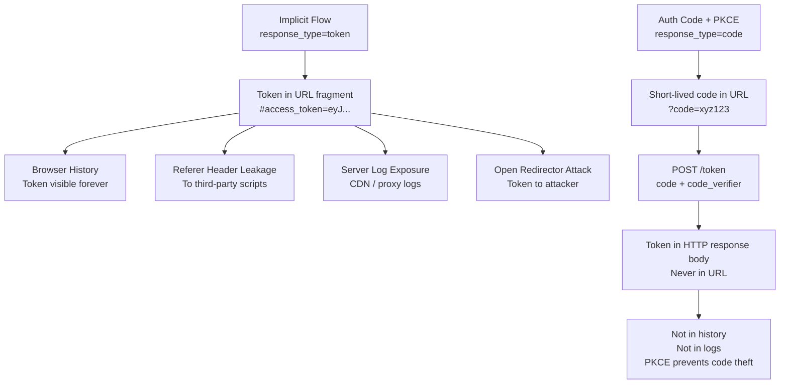

⚡ TL;DR - The Implicit Flow (`response_type=token`) was designed
for browser-based SPAs before CORS existed. It returned the
access token directly in the URL fragment (`#access_token=...`)
avoiding the server-side code exchange. This design has three
fatal flaws: tokens in URL fragments are visible in browser
history, Referer headers, and server logs; they can be stolen
via open redirectors in the redirect_uri; and PKCE cannot be
applied (no code exchange step). The OAuth 2.0 Security BCP
(RFC 9700, formerly draft-ietf-oauth-security-topics) formally
deprecated Implicit in 2023. All SPAs must migrate to
Authorization Code + PKCE.

---

### 🔥 The Problem It Was Trying to Solve (Context)

**WHY IMPLICIT EXISTED:**

In 2010-2012, CORS (Cross-Origin Resource Sharing) did not have
universal browser support. SPAs could not make cross-origin
`POST /token` requests to the authorization server because
browsers blocked them. The Implicit Flow was the workaround:
skip the code exchange step entirely and return the token
directly in the redirect, which the browser receives as a
navigation (not a cross-origin XHR).

By 2015, CORS was universally supported. The original technical
justification for Implicit no longer existed. But the flow was
already in widespread use.

---

### 📘 Textbook Definition

The OAuth 2.0 Implicit Grant (RFC 6749 §4.2) uses
`response_type=token` to return the access token directly in
the redirect URI fragment: `https://app.example.com/callback
#access_token=eyJ...&token_type=bearer&expires_in=3600`.

**OIDC Implicit:** `response_type=id_token` or
`response_type=id_token token` returns ID token (and optionally
access token) in the fragment. Also deprecated.

**What was removed/missing by design:**
- No authorization code (nothing to exchange server-side)
- No refresh token (AS refused per RFC 6749 §4.2.2)
- No `code_challenge`/PKCE parameter (no code to protect)
- No client authentication (no server to authenticate from)

**Formal deprecation:** RFC 9700 (OAuth 2.0 Security BCP,
published March 2023) §2.1.2: "Clients MUST NOT use the
implicit grant (response type 'token')". OIDC Implicit profiles
are also deprecated by OpenID Foundation best practices.

---

### ⏱️ Understand It in 30 Seconds

**The flow that puts tokens in URLs:**

```
IMPLICIT (DEPRECATED):
  GET /authorize?response_type=token&...
  → Redirect to: https://app.com/cb#access_token=eyJ...

ATTACK SURFACE:
  browser history → token visible for months
  Referer header → token sent to third-party sites
  server logs → any server in the chain logs the URL
  open redirector → token redirected to attacker

AUTHORIZATION CODE + PKCE (replacement):
  GET /authorize?response_type=code&code_challenge=...
  → Redirect to: https://app.com/cb?code=auth_code
  → SPA POSTs code + code_verifier → receives token
  Token never in URL. PKCE protects code exchange.
```

---

### ⚙️ How It Works (and Why It Fails)

```
┌──────────────────────────────────────────────────────────┐
│  IMPLICIT FLOW ATTACK SCENARIOS                           │
├──────────────────────────────────────────────────────────┤
│                                                           │
│  ATTACK 1: BROWSER HISTORY EXPOSURE                       │
│  1. User logs in → token in URL fragment.                 │
│  2. User shares laptop. Friend opens "History".           │
│     Sees: .../callback#access_token=eyJhbGci...           │
│  3. Friend copies token. Uses it to call API.             │
│  Fragment is in browser history in all major browsers.    │
│                                                           │
│  ATTACK 2: REFERER HEADER LEAKAGE                         │
│  1. SPA is on https://app.example.com/#access_token=...   │
│  2. App loads third-party analytics script.               │
│  3. Script fires request to https://analytics.company.com │
│     Referer: https://app.example.com/#access_token=...    │
│  4. Analytics provider now has the access token.          │
│  (Fragment MAY be sent in Referer in some browsers)       │
│                                                           │
│  ATTACK 3: OPEN REDIRECTOR                                │
│  1. Attacker registers malicious redirect_uri:            │
│     https://attacker.com/steal?target=https://app.com     │
│  2. If client has an open redirector at its redirect_uri  │
│     or AS has weak redirect_uri validation,               │
│     token flows to attacker.                              │
│  AS redirect_uri validation must be exact-match per spec, │
│  but some AS implementations allow prefix matching.        │
│                                                           │
│  ATTACK 4: TOKEN IN SERVER LOGS                           │
│  1. SPA loads server-rendered page with fragment in URL.  │
│     Some servers log the full URL including fragment.     │
│  2. Reverse proxy, CDN edge logs capture the token.       │
│  (Fragment should not reach server; some implementations  │
│   do forward it or log from Referer headers)              │
│                                                           │
│  WHY PKCE CANNOT BE ADDED:                                │
│  PKCE works by binding the code_challenge to the auth     │
│  request and verifying code_verifier at the token         │
│  endpoint. Implicit skips the token endpoint entirely.    │
│  There is no code exchange step to protect.               │
└──────────────────────────────────────────────────────────┘
```



---

### 💻 Code Example

**Example 1 - BAD then GOOD: SPA authorization:**

```javascript
// BAD: Implicit Flow - token in URL fragment
// Still found in legacy Angular/React apps

function loginWithImplicitFlow() {
  const authUrl = new URL(
    'https://as.example.com/authorize'
  );
  authUrl.searchParams.set(
    'response_type', 'token'  // WRONG: deprecated
  );
  authUrl.searchParams.set('client_id', 'my-spa');
  authUrl.searchParams.set(
    'redirect_uri', 'https://app.example.com/callback'
  );
  authUrl.searchParams.set('scope', 'openid read:data');
  // WRONG: No state parameter (CSRF risk)
  // WRONG: No PKCE (nothing to protect code exchange)
  window.location.href = authUrl.toString();
}

// After redirect: URL contains
// https://app.example.com/callback#access_token=eyJ...
// Token is now in browser history ← permanent exposure

function handleImplicitCallback() {
  const hash = window.location.hash.substring(1);
  const params = new URLSearchParams(hash);
  const token = params.get('access_token'); // STOLEN if history accessed
  localStorage.setItem('access_token', token); // ALSO BAD
}
```

```javascript
// GOOD: Authorization Code + PKCE for SPAs
// WHY: Token never in URL. PKCE prevents auth code theft.
//   Works without client_secret (public client safe).

import { createHash } from 'crypto';  // Node; browser: SubtleCrypto

function generateCodeVerifier() {
  const array = new Uint8Array(32);
  window.crypto.getRandomValues(array);
  return btoa(String.fromCharCode(...array))
    .replace(/\+/g, '-').replace(/\//g, '_')
    .replace(/=/g, '');
}

async function generateCodeChallenge(verifier) {
  const data = new TextEncoder().encode(verifier);
  const hash = await window.crypto.subtle.digest(
    'SHA-256', data
  );
  return btoa(
    String.fromCharCode(...new Uint8Array(hash))
  ).replace(/\+/g, '-').replace(/\//g, '_')
   .replace(/=/g, '');
}

async function loginWithPKCE() {
  const codeVerifier = generateCodeVerifier();
  const codeChallenge = await generateCodeChallenge(
    codeVerifier
  );
  const state = generateCodeVerifier(); // Random CSRF token

  // Store for use in callback
  sessionStorage.setItem('code_verifier', codeVerifier);
  sessionStorage.setItem('oauth_state', state);

  const authUrl = new URL(
    'https://as.example.com/authorize'
  );
  authUrl.searchParams.set('response_type', 'code'); // GOOD
  authUrl.searchParams.set('client_id', 'my-spa');
  authUrl.searchParams.set(
    'redirect_uri', 'https://app.example.com/callback'
  );
  authUrl.searchParams.set('scope', 'openid read:data');
  authUrl.searchParams.set('state', state);
  authUrl.searchParams.set('code_challenge', codeChallenge);
  authUrl.searchParams.set(
    'code_challenge_method', 'S256'
  );

  window.location.href = authUrl.toString();
  // Callback URL will be: .../callback?code=...&state=...
  // No token in URL - just a short-lived code
}

async function handlePKCECallback() {
  const params = new URLSearchParams(
    window.location.search
  );
  const code = params.get('code');
  const state = params.get('state');

  // Validate state (CSRF protection)
  const savedState = sessionStorage.getItem('oauth_state');
  if (state !== savedState) {
    throw new Error('State mismatch - possible CSRF attack');
  }

  const codeVerifier = sessionStorage.getItem('code_verifier');
  sessionStorage.removeItem('code_verifier'); // Use only once
  sessionStorage.removeItem('oauth_state');

  // Exchange code for tokens (code never in history again)
  const resp = await fetch(
    'https://as.example.com/token', {
      method: 'POST',
      headers: {
        'Content-Type': 'application/x-www-form-urlencoded'
      },
      body: new URLSearchParams({
        grant_type: 'authorization_code',
        code,
        redirect_uri: 'https://app.example.com/callback',
        client_id: 'my-spa',
        code_verifier: codeVerifier,  // PKCE verification
      }),
    }
  );

  const tokens = await resp.json();
  // Store token in memory (not localStorage for maximum security)
  return tokens.access_token;
}
```

---

### ⚖️ Comparison Table

| Flow | Token Location | PKCE | Refresh Token | Status |
|---|---|---|---|---|
| **Implicit** | URL fragment | Not applicable | Never issued | DEPRECATED (RFC 9700) |
| **OIDC Implicit (id_token)** | URL fragment | Not applicable | Never issued | DEPRECATED |
| **Auth Code** | HTTP response body | Optional (required for public) | Supported | CURRENT |
| **Auth Code + PKCE** | HTTP response body | Required (public clients) | Supported | RECOMMENDED |

---

### ⚠️ Common Misconceptions

| Misconception | Reality |
|---|---|
| URL fragments are not sent to servers, so tokens in fragments are safe | This is partially true (the fragment is not sent in the HTTP request path), but incorrect overall. The fragment is visible in browser history, in JavaScript on the page (including third-party scripts), potentially in Referer headers, and in some proxy/CDN access logs. The fragment is accessible to any JavaScript on the page - including analytics, ads, and CDN edge workers. "Not sent to server" ≠ "not exposed." |
| PKCE can be added to Implicit Flow to make it secure | PKCE is a mechanism for protecting the code exchange step: the `code_verifier` is used in the `POST /token` request to prove the party that initiated the auth request is the same one exchanging the code. Implicit Flow has no `POST /token` step - it skips code exchange entirely. PKCE cannot be retrofitted onto Implicit. The only secure migration path is Authorization Code + PKCE. |
| Migrating from Implicit to Auth Code + PKCE requires a backend server | Authorization Code + PKCE was specifically designed for public clients (SPAs, mobile apps) that have no backend. The code exchange `POST /token` is made from the browser/app directly to the AS, which is now allowed via CORS. No backend server is required. The PKCE code_verifier replaces the client_secret as proof of client identity. |
| Implicit is deprecated but still supported and safe if using HTTPS | RFC 9700 §2.1.2 says clients MUST NOT use Implicit. The deprecation is not about HTTPS vs HTTP - it's about architectural flaws that exist regardless of transport encryption. HTTPS protects the channel; it doesn't protect tokens stored in browser history or Referer headers. HTTPS + Implicit is still insecure. |

---

### 🚨 Failure Modes & Diagnosis

**Detecting Implicit Flow Still in Use**

**Symptom:**
Security audit finds tokens in browser network logs under
response redirect URLs. Or: third-party analytics vendor
reports access tokens in their Referer header data.

**Diagnostic:**

```bash
# Search codebase for Implicit Flow indicators:
# In JavaScript/TypeScript codebases:
grep -r "response_type.*token" src/  # Implicit indicator
grep -r "response_type=token" src/   # Direct string

# In URL logs (if fragment is somehow logged):
grep -E "#access_token=" /var/log/nginx/access.log

# In OIDC library configs:
grep -r "response_type.*id_token" src/
# response_type="id_token token" is OIDC Implicit (deprecated)
# response_type="code" + nonce is OIDC Auth Code (current)
```

**Migration checklist:**
1. Change `response_type=token` to `response_type=code`
2. Add `code_challenge` + `code_challenge_method=S256` parameters
3. Generate and store `code_verifier` before redirect
4. Add `POST /token` exchange in callback handler
5. Validate `state` parameter (CSRF protection)
6. Remove fragment-parsing code from callback handler
7. Update AS client registration: set `response_types` to `["code"]`

---

### 🔗 Related Keywords

**Prerequisites:**
- `Authorization Code Flow` - the replacement
- `PKCE (Proof Key for Code Exchange)` - the protection mechanism

**Builds On:**
- `OAuth 2.0 Threat Model (RFC 6819)` - attacks this flow enables
- `Authorization Code Interception Attack` - what PKCE protects against

---

### 📌 Quick Reference Card

```
┌──────────────────────────────────────────────────────────┐
│ STATUS       │ DEPRECATED: RFC 9700 §2.1.2 (March 2023) │
│              │ Clients MUST NOT use Implicit             │
├──────────────┼───────────────────────────────────────────┤
│ OLD WAY      │ response_type=token → #access_token=...   │
│              │ Token in URL fragment = history exposure   │
├──────────────┼───────────────────────────────────────────┤
│ WHY BAD      │ Token in browser history                  │
│              │ Token in Referer headers                   │
│              │ PKCE cannot be applied                    │
│              │ No refresh token                          │
├──────────────┼───────────────────────────────────────────┤
│ MIGRATION    │ response_type=code + PKCE                 │
│              │ Token in HTTP response body (POST /token)  │
│              │ Works for SPAs without backend            │
├──────────────┼───────────────────────────────────────────┤
│ WHY CORS     │ CORS now universal. No need to skip        │
│ SOLVED IT    │ POST /token exchange. Original reason gone.│
├──────────────┼───────────────────────────────────────────┤
│ ONE-LINER    │ "Tokens in URLs = in history. Use Auth    │
│              │  Code + PKCE. RFC 9700 says MUST NOT."    │
└──────────────────────────────────────────────────────────┘
```

**If you remember only 3 things:**

1. Implicit Flow puts tokens in URL fragments → visible in
   browser history, Referer headers, and JS-accessible on page.
   RFC 9700 says clients MUST NOT use it. Full stop.

2. PKCE cannot be added to Implicit because there is no code
   exchange step to protect. The only fix is migrating to
   Authorization Code + PKCE.

3. Authorization Code + PKCE works for SPAs without a backend.
   The `POST /token` exchange uses CORS (universally supported
   since ~2015). No server required. The `code_verifier`
   replaces the `client_secret` for public clients.
