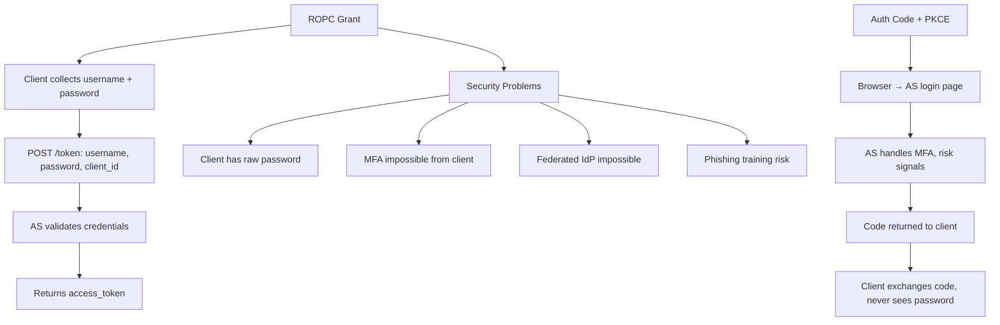

⚡ TL;DR - The Resource Owner Password Credentials (ROPC) grant
sends the user's raw username and password directly to the
client application, which forwards them to the AS's token
endpoint. This is the opposite of OAuth's fundamental design
goal (the user never gives credentials to third-party clients).
RFC 9700 (OAuth 2.0 Security BCP) says grant type `password`
MUST NOT be used in new systems. It was included in RFC 6749
only as a migration aid for legacy systems. The only legitimate
remaining use case is first-party apps where the client IS the
AS operator - and even that is better served by the Device Flow
or a custom login page with authorization_code flow.

---

### 🔥 The Problem It Was Supposed to Solve

**THE LEGACY MIGRATION PROBLEM:**

In 2011, many internal enterprise apps had existing HTTP Basic
authentication: the client (a Java desktop app, a CLI tool)
collected the username/password and sent it in every request
header. Converting these to Authorization Code flow would have
required building redirect infrastructure, managing sessions,
and rewriting the UI. ROPC was designed as a bridge: let the
client collect credentials once, exchange them for a token,
then use the token. In practice it was massively abused - used
for convenience by developers who didn't want to implement
redirect flows.

---

### 📘 Textbook Definition

The OAuth 2.0 Resource Owner Password Credentials Grant
(RFC 6749 §4.3) allows a client to obtain tokens by presenting
the resource owner's credentials (username + password) directly
to the AS token endpoint.

**Flow:**
`POST /token` with `grant_type=password`, `username=user`,
`password=pass`, `client_id=...`, (optionally `scope=...`
and `client_secret=...` for confidential clients).

**What breaks the OAuth model:**
The client (which may be a third-party app) receives the raw
password. The user has no choice but to trust the client with
their credentials. This prevents: MFA (client cannot perform
TOTP/WebAuthn steps), federated login (client cannot redirect
to an external IdP), phishing prevention (users are trained
to enter passwords directly into apps, which teaches dangerous
habits), and passwordless login (biometric/passkey flows
require the browser/OS, not the client app).

**Formal status:** RFC 9700 §2.4: "The resource owner password
credentials grant MUST NOT be used." IANA OAuth Parameters
Registry marks it as deprecated.

---

### ⏱️ Understand It in 30 Seconds

**The anti-pattern:**

```
ROPC (DEPRECATED):
  Client collects username + password from user
    ↓
  POST /token
    grant_type=password
    username=alice@example.com
    password=SecretP@ssw0rd     ← RAW PASSWORD
    client_id=my-app
    ↓
  AS returns: access_token, refresh_token

PROBLEMS:
  - Client has the raw password = "I trust you"
  - MFA cannot be performed by client
  - Federated IdP (SAML, social login) impossible
  - Phishing: user trains to type password into any app

CORRECT ALTERNATIVE for first-party apps:
  Authorization Code + PKCE (AS shows its own login page)
  OR Device Flow (for headless environments)
```

---

### ⚙️ How It Works (Mechanism)

```
┌──────────────────────────────────────────────────────────┐
│  ROPC FLOW VS AUTHORIZATION CODE FLOW COMPARISON          │
├──────────────────────────────────────────────────────────┤
│                                                           │
│  ROPC:                                                    │
│  User → [types password into CLIENT app UI]               │
│  Client → POST /token                                     │
│    grant_type=password                                    │
│    username=alice                                         │
│    password=S3cret!                   ← password exposed  │
│    client_id=app123                                       │
│  AS → validates credentials directly                      │
│  AS → returns { access_token, refresh_token }             │
│                                                           │
│  WHAT IS MISSING FROM ROPC:                               │
│  - User consent screen (AS login page bypass)             │
│  - MFA challenge (AS cannot prompt for 2FA via client)    │
│  - Federated identity (can't redirect to Google/SAML)     │
│  - Phishing resistance (user enters password in any app)  │
│  - Session binding (no AS session created)                │
│                                                           │
│  AUTHORIZATION CODE + PKCE (correct alternative):         │
│  User → [browser opens AS login page]                     │
│  User → types password ONLY into AS login page            │
│  AS → may challenge for MFA, risk signals, etc.           │
│  AS → issues auth code → redirected to client             │
│  Client → exchanges code for token (PKCE protected)        │
│  Client NEVER sees the password                           │
└──────────────────────────────────────────────────────────┘
```



---

### 💻 Code Example

**Example 1 - BAD then GOOD: CLI tool authentication:**

```python
# BAD: CLI tool using ROPC
# Collects user's raw password → violates OAuth model

def authenticate_cli_bad():
    import getpass
    username = input("Username: ")
    password = getpass.getpass("Password: ")  # Raw password

    resp = requests.post(TOKEN_ENDPOINT, data={
        'grant_type': 'password',       # WRONG: deprecated
        'username': username,
        'password': password,           # WRONG: raw password
        'client_id': 'my-cli-app',
        'scope': 'openid read:data',
    })
    # WRONG: MFA impossible if AS requires it
    # WRONG: Federated SSO impossible
    # WRONG: Trains users to type passwords into any CLI
    return resp.json()['access_token']
```

```python
# GOOD: CLI tool using Device Authorization Flow
# WHY: User authenticates in their browser (AS login page).
#   CLI never sees the password. MFA, SSO all work.
#   This is how gh auth login, az login, gcloud auth work.

def authenticate_cli_good():
    """Authenticate using Device Authorization Flow."""
    # Phase 1: Get device_code and user_code
    resp = requests.post(DEVICE_AUTH_ENDPOINT, data={
        'client_id': 'my-cli-app',
        'scope': 'openid read:data',
    })
    data = resp.json()

    # Display to user
    print(
        f"\nTo authenticate, open:\n"
        f"  {data['verification_uri']}\n"
        f"  Enter code: {data['user_code']}\n"
    )

    # Phase 2: Poll for tokens
    interval = data.get('interval', 5)
    deadline = time.time() + data['expires_in']

    while time.time() < deadline:
        time.sleep(interval)
        poll = requests.post(TOKEN_ENDPOINT, data={
            'grant_type': (
                'urn:ietf:params:oauth:grant-type:device_code'
            ),
            'device_code': data['device_code'],
            'client_id': 'my-cli-app',
        })
        if poll.status_code == 200:
            print("Authentication successful!")
            return poll.json()['access_token']
        error = poll.json().get('error', '')
        if error == 'slow_down':
            interval += 5
        elif error not in ('authorization_pending',):
            raise AuthError(f"Auth failed: {error}")

    raise AuthError("Authentication timed out")
```

**Example 2 - The one case it appeared legitimate (and why it is still wrong):**

```python
# APPEARS LEGITIMATE: First-party native app
# Client IS operated by the same org as the AS
# e.g., "Our mobile banking app using our own auth server"

# WHY IT IS STILL WRONG even for first-party:
# 1. The AS COULD show its own login screen via Auth Code
#    The client only needs a WebView/ASWebAuthSession
# 2. MFA: if the bank wants to add 2FA, ROPC makes this
#    impossible without custom protocol work
# 3. Passwordless: if the bank wants biometrics/passkey,
#    those require the OS/browser, not the app itself
# 4. Regulatory: PSD2, Open Banking require proper OAuth
#    with consent screens; ROPC is non-compliant

# The migration path:
# From: ROPC in mobile app
# To:   ASWebAuthenticationSession (iOS) /
#       Custom Tabs (Android) opening AS login page
#       Authorization Code + PKCE
# → Same app experience (embedded browser looks native)
# → All security properties restored
```

---

### ⚖️ Comparison Table

| Flow | Password Exposed to Client | MFA Support | Federated IdP | Status |
|---|---|---|---|---|
| **ROPC** | Yes (directly) | No | No | DEPRECATED (RFC 9700) |
| **Auth Code + PKCE** | Never | Yes (via AS) | Yes | CURRENT |
| **Device Flow** | Never | Yes (via AS, user's browser) | Yes | CURRENT |
| **Client Credentials** | N/A (no user) | N/A | N/A | CURRENT |

---

### ⚠️ Common Misconceptions

| Misconception | Reality |
|---|---|
| ROPC is safe for first-party apps where you trust the client | Even for first-party apps, ROPC breaks MFA, federated SSO, passwordless/biometric authentication, and phishing resistance training. The Authorization Code flow with a WebView/custom tab provides the same UX (embedded-looking login page) without any of the ROPC security downsides. "First-party" is not sufficient justification. |
| ROPC is needed for automated testing (Selenium, integration tests) | Test automation can obtain tokens directly via client credentials (if the test acts as a service) or via the AS admin API to directly issue tokens for test users. Production ROPC endpoints should not be enabled for test automation. Using ROPC for tests normalizes having the raw password flow enabled. |
| Disabling ROPC in the AS is a breaking change for all clients | It is only a breaking change for clients actively using ROPC. These are identifiable via AS audit logs (filter for `grant_type=password` in token endpoint logs). The number is usually small. Migration to Auth Code + PKCE for those clients should be planned and communicated - but the breaking change scope is limited. |
| ROPC is equivalent to HTTP Basic auth and therefore acceptable | HTTP Basic auth has the same credential exposure problem - it's not "acceptable" either. Both patterns expose raw credentials to intermediary systems. The move away from HTTP Basic to token-based authentication was a security improvement. ROPC is the OAuth anti-pattern that re-introduces the same problem. |

---

### 🚨 Failure Modes & Diagnosis

**ROPC Endpoint Left Enabled After Migration**

**Symptom:**
Security scan finds `grant_type=password` in AS audit logs
even though the organization believes it has migrated to
Authorization Code. Investigation reveals a legacy batch job
or old mobile app version still using ROPC credentials
stored in environment variables.

**Diagnostic:**

```bash
# Find all ROPC usage in AS audit logs:
# Look for grant_type=password in token endpoint requests

# Splunk / Elasticsearch query:
# index=oauth_audit grant_type=password
# | stats count by client_id, client_ip

# AWS Cognito:
aws cognito-idp admin-list-groups-for-user ... # or use CloudTrail

# Keycloak:
# Admin Console → Events → Filter: grant_type=password
```

**Fix:**
1. Identify all `client_id` values using ROPC from logs.
2. Contact owners of those clients, plan migration to Device
   Flow (for CLI/IoT) or Auth Code + PKCE (for apps).
3. After migration confirmed: disable ROPC grant type in AS
   client configuration (set `grant_types` to not include
   `password`).
4. At org level: disable ROPC globally in AS if possible.

---

### 🔗 Related Keywords

**Prerequisites:**
- `Grant Types Overview` - context for this as one grant type
- `OAuth 2.0 Roles` - who the Resource Owner is

**Builds On:**
- `OAuth 2.0 Threat Model (RFC 6819)` - credential exposure risks
- `Device Authorization Flow (RFC 8628)` - the correct alternative

---

### 📌 Quick Reference Card

```
┌──────────────────────────────────────────────────────────┐
│ STATUS       │ DEPRECATED: RFC 9700 §2.4 (MUST NOT use) │
├──────────────┼───────────────────────────────────────────┤
│ WHAT IT DOES │ Client collects username+password, sends   │
│              │ to /token. Client sees raw password.       │
├──────────────┼───────────────────────────────────────────┤
│ WHAT BREAKS  │ MFA, federated IdP, passwordless/biometric│
│              │ Phishing resistance, regulatory compliance │
├──────────────┼───────────────────────────────────────────┤
│ MIGRATION    │ CLI/IoT → Device Authorization Flow       │
│              │ Mobile/Web → Auth Code + PKCE (WebView)   │
│              │ M2M (no user) → Client Credentials        │
├──────────────┼───────────────────────────────────────────┤
│ DETECTION    │ grep grant_type=password in AS audit logs  │
│              │ Find all client_ids still using it         │
├──────────────┼───────────────────────────────────────────┤
│ ONE-LINER    │ "Client sees raw password = OAuth violated.│
│              │  RFC 9700: MUST NOT use. Migrate to PKCE."│
└──────────────────────────────────────────────────────────┘
```

**If you remember only 3 things:**

1. ROPC violates the core OAuth principle: the user should never
   give credentials to the client. The client receives the raw
   password. RFC 9700 says MUST NOT use in new systems.

2. ROPC breaks MFA, federated SSO, and passwordless auth.
   Even for first-party apps, Authorization Code + PKCE with
   a WebView provides the same UX with full security restored.

3. Detect lingering ROPC usage via AS audit log queries for
   `grant_type=password`. Migrate those clients to Device Flow
   (CLI/IoT) or Auth Code + PKCE (apps) before disabling ROPC.
