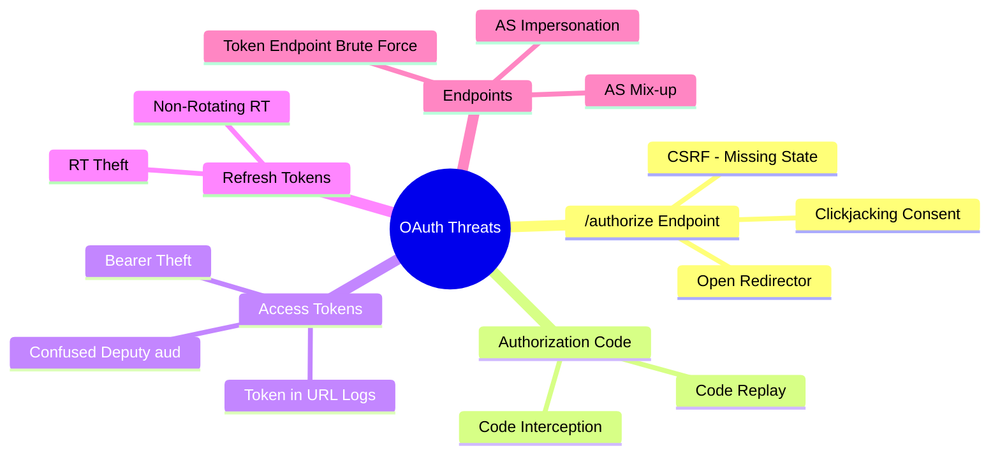

⚡ TL;DR - RFC 6819 is the OAuth 2.0 Threat Model and Security
Considerations, cataloguing every known attack category against
OAuth flows and their mitigations. The six major threat areas:
(1) authorization endpoint attacks (CSRF via state, open
redirectors via redirect_uri hijacking), (2) authorization code
attacks (interception, replay), (3) access token attacks
(leakage, bearer token theft), (4) refresh token attacks
(theft, excessive lifetime), (5) client credential attacks
(secret leakage, phishing), (6) endpoint attacks (AS
impersonation, token endpoint brute force). RFC 9700 (Security
BCP) supersedes RFC 6819 with updated attack guidance for
modern OAuth deployments.

---

### 🔥 The Problem This Solves

**THE SYSTEMATIC ATTACK COVERAGE PROBLEM:**

OAuth 2.0 has many moving parts: the authorization endpoint,
token endpoint, redirect URI, state parameter, codes, tokens,
and multiple parties (user, client, AS, RS). Without a
systematic threat model, developers defend against attacks
they have personally encountered and miss the ones they have
not. RFC 6819 provides the complete attack catalog so security
decisions are based on the full threat landscape, not random
historical awareness.

---

### 📘 Textbook Definition

RFC 6819 (OAuth 2.0 Threat Model and Security Considerations,
published January 2013) catalogues security threats to OAuth
2.0 implementations and their mitigations. It was superseded
(but not obsoleted) by RFC 9700 (OAuth 2.0 Security Best
Current Practice, March 2023), which addresses attacks that
emerged after 2013 (PKCE necessity, Implicit deprecation,
mix-up attacks, redirect URI open redirector stricter rules).

**Threat taxonomy from RFC 6819:**

**Threats at the authorization endpoint:**
T1 - CSRF via missing/weak `state` parameter (auth request
injection). T2 - Open redirector via weak redirect_uri
validation. T3 - Authorization code interception. T4 - Click-
jacking on consent page.

**Threats at the token endpoint:**
T5 - Replay of leaked authorization codes. T6 - Client secret
exposure. T7 - Token endpoint brute force.

**Threats to tokens:**
T8 - Access token leakage (bearer token theft). T9 - Refresh
token theft (long-lived, high-value). T10 - Token in URL (log
exposure - addressed by deprecating Implicit). T11 - Confused
deputy via missing audience validation.

**Threats to clients:**
T12 - Client impersonation (malicious client pretending to be
legitimate). T13 - AS mix-up attack (client confused about
which AS issued which token).

---

### ⏱️ Understand It in 30 Seconds

**The threat map - attack → countermeasure:**

```
THREAT                      COUNTERMEASURE
─────────────────────────────────────────────────────
State-missing CSRF          Always validate state parameter
redirect_uri hijacking      AS: exact-match only; no wildcards
Code interception           PKCE (code_verifier binding)
Code replay                 AS: one-time use enforcement
Bearer token theft          Short expiry + TLS only; DPoP for sender-binding
Refresh token theft         Rotation + reuse detection + server-only storage
Token in logs               Never in URL (no Implicit); response body only
Confused deputy             Always validate aud claim at RS
AS mix-up                   Binding iss to the token + validate per-RS
Client impersonation        Exact redirect_uri match + client auth
Clickjacking consent        X-Frame-Options / CSP frame-ancestors: none
```

---

### ⚙️ How It Works (Mechanism)

```
┌──────────────────────────────────────────────────────────┐
│  RFC 6819 / RFC 9700 THREAT CATALOG BY ATTACK SURFACE     │
├──────────────────────────────────────────────────────────┤
│                                                           │
│  SURFACE 1: /authorize ENDPOINT                           │
│                                                           │
│  CSRF Attack (state param injection):                     │
│    Attacker forges auth request → state missing           │
│    User authenticates → attacker gets their token         │
│    Mitigation: AS requires state; client validates state  │
│                                                           │
│  Open Redirector (redirect_uri hijacking):                │
│    Attacker uses https://app.com/callback?next=evil.com   │
│    or https://app.com-evil.com/callback (AS prefix match) │
│    Mitigation: AS exact-match redirect_uri; RFC 9700 §2.1 │
│                                                           │
│  SURFACE 2: AUTHORIZATION CODE                            │
│                                                           │
│  Code Interception:                                       │
│    Attacker intercepts code in TLS-MITM or mobile OS     │
│    Mitigation: PKCE (code_challenge binds code to client) │
│                                                           │
│  Code Replay:                                             │
│    Attacker captures code, replays after legitimate use   │
│    Mitigation: AS: one-time code enforcement; revoke      │
│    all tokens when replayed code detected                 │
│                                                           │
│  SURFACE 3: ACCESS TOKENS                                 │
│                                                           │
│  Bearer Token Theft:                                      │
│    Token stolen from localStorage, logs, or network      │
│    Mitigation: Short lifetime (15-60 min); TLS only;      │
│    DPoP for sender-binding; no token in URLs              │
│                                                           │
│  Token Confused Deputy:                                   │
│    Token for payments-API used against contacts-API       │
│    Mitigation: aud claim validation per RFC 9068          │
│                                                           │
│  SURFACE 4: REFRESH TOKENS                                │
│                                                           │
│  Refresh Token Theft:                                     │
│    Long-lived token stolen from storage                   │
│    Mitigation: Rotation + reuse detection; server-only    │
│    storage; binding to client (client_id validation)      │
│                                                           │
│  SURFACE 5: ENDPOINTS                                     │
│                                                           │
│  AS Mix-up Attack:                                        │
│    Client configured with multiple AS; attacker routes    │
│    auth response from AS-A to AS-B context               │
│    Mitigation: iss parameter in auth response (RFC 9207); │
│    PAR (RFC 9126) for AS request binding                  │
│                                                           │
│  Clickjacking on Consent:                                 │
│    Attacker embeds consent page in iframe; tricks user    │
│    Mitigation: X-Frame-Options: DENY on AS consent page   │
└──────────────────────────────────────────────────────────┘
```



---

### 💻 Code Example

**Example 1 - Security checklist implementation:**

```python
# RFC 6819 / RFC 9700 implementation checklist
# Each line maps to a specific threat mitigation

class OAuth2SecurityChecklist:
    """
    Verify OAuth client implementation covers RFC 6819/9700
    threat mitigations.
    """

    def check_authorization_request(
        self,
        auth_params: dict,
    ) -> list[str]:
        """T1: CSRF - T3: Code Interception mitigation."""
        issues = []

        # T1 CSRF mitigation: state must be present + random
        if 'state' not in auth_params:
            issues.append(
                "MISSING: state parameter (CSRF risk)"
            )
        elif len(auth_params['state']) < 16:
            issues.append(
                "WEAK: state too short (< 16 chars)"
            )

        # T3 Code Interception mitigation: PKCE required
        if 'code_challenge' not in auth_params:
            issues.append(
                "MISSING: code_challenge (PKCE not used)"
            )
        elif auth_params.get(
            'code_challenge_method'
        ) != 'S256':
            issues.append(
                "WEAK: code_challenge_method must be S256"
            )

        # Response type check: Implicit deprecated
        if auth_params.get('response_type') == 'token':
            issues.append(
                "DEPRECATED: response_type=token (Implicit)"
                " - use response_type=code"
            )

        return issues

    def check_token_storage(
        self,
        storage_location: str,
    ) -> list[str]:
        """T8: Bearer Token Theft mitigation check."""
        issues = []

        # T8 Bearer token theft: localStorage is accessible
        # to all JS on the page including XSS payloads
        if storage_location == 'localStorage':
            issues.append(
                "RISK: Access token in localStorage. "
                "XSS attacker can read it. "
                "Use httpOnly cookie or memory storage."
            )
        elif storage_location == 'sessionStorage':
            issues.append(
                "MODERATE RISK: sessionStorage accessible"
                " to all JS. Prefer memory or httpOnly cookie."
            )

        return issues

    def check_redirect_uri_registration(
        self,
        registered_uris: list[str],
        current_uri: str,
    ) -> bool:
        """T2: Redirect URI hijacking mitigation check."""
        # RFC 9700 §2.1: exact match required
        return current_uri in registered_uris
        # WRONG: prefix match allows https://app.com.evil.com
        # return any(
        #   current_uri.startswith(u) for u in registered_uris
        # )

    def check_token_validation(
        self,
        validation_config: dict,
    ) -> list[str]:
        """T11: Confused deputy mitigation check."""
        issues = []

        # T11: aud must be validated
        if not validation_config.get('verify_aud'):
            issues.append(
                "CRITICAL: aud validation disabled. "
                "Confused deputy attack possible."
            )
        if not validation_config.get('audience'):
            issues.append(
                "MISSING: expected audience not configured"
            )

        # T8: Short expiry
        if validation_config.get('max_token_lifetime', 0) > 3600:
            issues.append(
                "RISK: Access token lifetime > 1 hour. "
                "Stolen tokens have long attack window."
            )

        return issues
```

**Example 2 - AS configuration security hardening:**

```yaml
# Keycloak / Spring Authorization Server security config
# Maps to RFC 6819/9700 mitigations

# Client configuration (per RFC 9700 mitigations):
client:
  # T2: Exact redirect_uri match only (no wildcards)
  redirectUris:
    - "https://app.example.com/callback"
    # NOT: "https://app.example.com/*"  ← wildcard = risk

  # T1: State parameter enforced by PKCE (auto-checked)
  # T3: PKCE required for all public clients
  pkceRequired: true

  # Deprecated flows disabled:
  grantTypes:
    - authorization_code
    - refresh_token
    # NOT: implicit, password  ← both deprecated per RFC 9700

  # Token lifetime (T8 short lifetime for AT):
  accessTokenLifespan: 900          # 15 minutes
  refreshTokenLifespan: 86400       # 24 hours

  # T9 Refresh token rotation (RT theft detection):
  refreshTokenRotationEnabled: true
  reuseRefreshTokens: false         # RT must rotate

  # T11: Audience in access tokens (confused deputy defense):
  accessTokenAudience:
    - "https://api.example.com"

# AS-level config:
authorization_server:
  # T4: Clickjacking prevention on consent page
  consentScreenFrameOptions: "DENY"

  # T7: Token endpoint rate limiting
  tokenEndpointRateLimit:
    maxRequestsPerMinute: 60
    perClientId: true
```

---

### ⚖️ Comparison Table

| Threat | RFC 6819 Coverage | RFC 9700 Updates | Mitigation |
|---|---|---|---|
| **CSRF** | T1 - state param | Unchanged | `state` validation + PKCE |
| **Code interception** | T3 - PKCE recommended | PKCE REQUIRED for public | `code_challenge` S256 |
| **Bearer theft** | T8 - short lifetime | DPoP added as solution | Short TTL + DPoP option |
| **Redirect hijacking** | T2 - exact match | Stricter: no wildcards | AS exact-match registry |
| **Implicit Flow** | Allowed | MUST NOT use | Removed - use Auth Code |
| **AS mix-up** | Not covered | T-new - iss in response | RFC 9207 iss parameter |

---

### ⚠️ Common Misconceptions

| Misconception | Reality |
|---|---|
| HTTPS/TLS fully mitigates OAuth bearer token risks | TLS protects tokens in transit, but not at rest (localStorage, logs, browser history) or after theft from server memory. HTTPS is necessary but not sufficient. DPoP (RFC 9449) provides sender-binding: even a stolen token is useless without the private key. Short token lifetimes limit the attack window. Multiple layers are needed. |
| PKCE is only needed for mobile apps (insecure clients) | RFC 9700 §2.1.1 requires PKCE for ALL public clients - SPAs, mobile apps, desktop apps. Even for confidential clients (those with client_secret), PKCE adds defense-in-depth against code interception and is recommended. PKCE's security value is not about "is this a mobile app" but about binding the code to the exact client that initiated the request. |
| RFC 6819 is the current OAuth security reference | RFC 9700 (OAuth 2.0 Security Best Current Practice, March 2023) is the current reference. It supersedes the guidance in RFC 6819 and adds coverage for attacks discovered after 2013: AS mix-up (RFC 9207), Implicit deprecation, PKCE as mandatory for public clients, and stricter redirect_uri requirements. Security implementations should reference RFC 9700 first. |
| State parameter alone is sufficient CSRF protection | State prevents CSRF at the authorization request level, but PKCE provides a stronger binding at the code exchange level: even if the state is guessed or leaked, an attacker cannot exchange the authorization code without the correct `code_verifier`. RFC 9700 recommends BOTH for maximum protection. |

---

### 🚨 Failure Modes & Diagnosis

**Authorization Code Replay via Double-Processing of Callback**

**Symptom:**
Occasional `invalid_grant` errors on code exchange in
production logs. Pattern: the same session shows two code
exchange attempts within milliseconds. Second attempt fails.
First attempt succeeds.

**Root Cause:**
RFC 6819 T5: Authorization code replay. The code can only be
used once per RFC 6749. Cause here: the callback URL is being
requested twice (browser prefetch, duplicate form submission,
or retry on network timeout). Not an attack - but AS correctly
enforces single-use.

**Diagnostic:**

```bash
# Look for duplicate code exchange attempts:
grep "grant_type=authorization_code" /var/log/as/token.log \
  | sort -t'code=' -k2 \
  | uniq -d -f1  # Find duplicate code values
# Expected: none (each code unique)
# If duplicates found: client is double-submitting
```

**Fix:**
Implement idempotency check in callback handler: track seen
`code` values for 60 seconds; if same code received twice,
use cached response from first exchange. Add `code` to
session; check before processing. Handle `invalid_grant` on
second code exchange gracefully (session already has tokens).

---

### 🔗 Related Keywords

**Prerequisites:**
- `OAuth 2.0 Roles` - the parties in the threat model
- `State Parameter` - CSRF mitigation

**Builds On:**
- `Authorization Code Interception Attack` - deep dive on T3
- `CSRF in OAuth and State Parameter Validation` - deep dive on T1

---

### 📌 Quick Reference Card

```
┌──────────────────────────────────────────────────────────┐
│ CSRF         │ State param + PKCE. Both. Validate both.  │
├──────────────┼───────────────────────────────────────────┤
│ CODE         │ PKCE (S256). Required for public clients.  │
│ INTERCEPTION │ RFC 9700: MUST for public clients.        │
├──────────────┼───────────────────────────────────────────┤
│ REDIRECT URI │ Exact match only. No wildcards.           │
│ HIJACKING    │ RFC 9700 §2.1: strict validation required │
├──────────────┼───────────────────────────────────────────┤
│ BEARER THEFT │ Short AT lifetime (15-60 min). TLS only.  │
│              │ DPoP for high-security APIs.              │
├──────────────┼───────────────────────────────────────────┤
│ RT THEFT     │ Rotation + reuse detection. Never in URL. │
│              │ Short absolute TTL. Revoke on logout.     │
├──────────────┼───────────────────────────────────────────┤
│ DEPRECATED   │ Implicit: MUST NOT (RFC 9700 §2.1.2)     │
│ FLOWS        │ ROPC: MUST NOT (RFC 9700 §2.4)           │
├──────────────┼───────────────────────────────────────────┤
│ ONE-LINER    │ "6819 = threat catalog. 9700 = must-do    │
│              │  list. PKCE, state, aud, exact-match, TLS"│
└──────────────────────────────────────────────────────────┘
```

**If you remember only 3 things:**

1. RFC 6819 is the threat catalog; RFC 9700 is the current
   security BCP. Reference RFC 9700 for new implementations.
   Key mandates: PKCE for public clients, no Implicit, no ROPC,
   exact redirect_uri matching, aud validation at RS.

2. Every OAuth interaction has a specific attack: /authorize
   (CSRF, open redirector), code (interception, replay), token
   (bearer theft, confused deputy), refresh token (theft,
   non-rotation). Know the attack for each component.

3. Defense-in-depth is the strategy. State + PKCE together.
   HTTPS + short token lifetime + DPoP. Exact redirect_uri +
   aud validation. No single countermeasure is sufficient.
