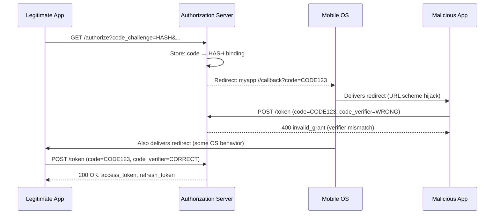

⚡ TL;DR - The authorization code interception attack occurs
when a malicious app (mobile OS) or network position intercepts
the authorization code from the redirect URI before the
legitimate client can exchange it. On mobile, the attack uses
a malicious app registered for the same custom URL scheme
(`myapp://callback`). On web, it exploits weak redirect_uri
validation (prefix matching) at the AS. PKCE (Proof Key for
Code Exchange) defeats this attack: the intercepted code is
useless without the `code_verifier` that only the legitimate
client knows, since the code was bound to its `code_challenge`
at the authorization request.

---

### 🔥 The Problem This Solves

**THE CODE INTERCEPTION WINDOW:**

The authorization code flow has a vulnerability window: the
moment the code is delivered via redirect (URL query parameter)
to the client. On mobile, ANY app can register for a custom
URL scheme (`myapp://`). If the malicious app registers the
same scheme, the OS may present it when the browser tries to
redirect to `myapp://callback?code=...`. The malicious app
receives the code first, exchanges it for tokens, and
impersonates the user - without ever knowing the user's password.

---

### 📘 Textbook Definition

The authorization code interception attack (RFC 9700 §2.1,
originally from RFC 7636) exploits the redirect-based code
delivery mechanism in OAuth 2.0 Authorization Code Flow.

**Attack vector on mobile (custom URL scheme):**
The OS delivers the redirect to a registered scheme handler.
If two apps register the same scheme, the OS may: (a) present
a "choose which app to open" dialog (and the attacker's app
is listed), (b) silently deliver to the first-registered app,
or (c) deliver to the last-installed app. The attacker app
intercepts the `code` parameter.

**Attack vector on web (redirect_uri prefix matching):**
If the AS uses prefix-based redirect_uri matching instead of
exact matching, the attacker registers `https://app.com/
callback-malicious` and the AS accepts it as a valid callback
for client `app.com`. The code is delivered to the attacker.

**Why PKCE defeats this:**
At `/authorize`, the legitimate client generates a random
`code_verifier`, derives `code_challenge = SHA256(code_verifier)`,
and includes `code_challenge` in the request. The AS records
the binding: this code is only exchangeable by whoever knows
the `code_verifier`. The attacker app receives the code but
does not know the `code_verifier` → POST /token returns 400
`invalid_grant`.

---

### ⏱️ Understand It in 30 Seconds

**The attack and the defense:**

```
WITHOUT PKCE (vulnerable):
  Legitimate app: /authorize?response_type=code&client_id=app
  AS redirects: myapp://callback?code=AUTH_CODE_XYZ
  [Attacker app registered for myapp://]
  Attacker receives: code=AUTH_CODE_XYZ
  Attacker: POST /token?code=AUTH_CODE_XYZ → TOKENS ← stolen

WITH PKCE (defended):
  Legitimate app: /authorize?...&code_challenge=HASH_OF_VERIFIER
  AS records: this code bound to HASH_OF_VERIFIER
  AS redirects: myapp://callback?code=AUTH_CODE_XYZ
  Attacker receives: code=AUTH_CODE_XYZ
  Attacker: POST /token?code=AUTH_CODE_XYZ → 400 invalid_grant
  (Attacker doesn't know code_verifier → challenge doesn't match)
  Legitimate app: POST /token?code=CODE&code_verifier=VERIFIER → TOKENS ✓
```

---

### ⚙️ How It Works (Mechanism)

```
┌──────────────────────────────────────────────────────────┐
│  CODE INTERCEPTION ATTACK - PKCE DEFENSE                  │
├──────────────────────────────────────────────────────────┤
│                                                           │
│  SETUP (legitimate app, registered custom scheme):        │
│    Legitimate: myapp://callback                           │
│    Malicious:  myapp://callback  (same scheme!)           │
│                                                           │
│  STEP 1 - LEGITIMATE CLIENT INITIATES:                    │
│    code_verifier = random_bytes(32) [store securely]      │
│    code_challenge = base64url(SHA256(code_verifier))      │
│    GET /authorize?                                        │
│      response_type=code                                   │
│      &client_id=myapp                                     │
│      &redirect_uri=myapp://callback                       │
│      &code_challenge=<HASH>                               │
│      &code_challenge_method=S256                          │
│    AS stores: code_record = { code, challenge=<HASH> }    │
│                                                           │
│  STEP 2 - AS ISSUES CODE VIA REDIRECT:                    │
│    Location: myapp://callback?code=CODE123                │
│                                                           │
│  STEP 3 - OS DELIVERS TO WHICH APP?:                      │
│    Scenario A: Malicious app intercepts CODE123           │
│                                                           │
│  STEP 4 - ATTACKER TRIES TO EXCHANGE:                     │
│    Attacker: POST /token                                  │
│      grant_type=authorization_code                        │
│      &code=CODE123                                        │
│      &code_verifier=ATTACKER_GUESS  ← doesn't know verifier│
│    AS: SHA256(ATTACKER_GUESS) ≠ stored HASH               │
│    AS: 400 invalid_grant ← ATTACK DEFEATED                │
│                                                           │
│  STEP 5 - LEGITIMATE APP EXCHANGES (if it gets CODE):     │
│    Legitimate: POST /token                                │
│      grant_type=authorization_code                        │
│      &code=CODE123                                        │
│      &code_verifier=<ORIGINAL_VERIFIER>                   │
│    AS: SHA256(ORIGINAL_VERIFIER) == stored HASH           │
│    AS: 200 OK + tokens ← legitimate exchange succeeds     │
│                                                           │
│  IMPORTANT: If attacker gets code first, legitimate app   │
│  also receives invalid_grant (code already attempted).    │
│  Legitimate user needs to restart auth flow.              │
└──────────────────────────────────────────────────────────┘
```



---

### 💻 Code Example

**Example 1 - BAD then GOOD: Mobile OAuth without/with PKCE:**

```kotlin
// BAD: Android OAuth without PKCE
// Authorization code can be stolen by any app
// registered for the same custom URL scheme

fun startOAuthBad() {
    val authUri = Uri.Builder()
        .scheme("https")
        .authority("as.example.com")
        .path("/authorize")
        .appendQueryParameter("response_type", "code")
        .appendQueryParameter("client_id", "myapp")
        .appendQueryParameter(
            "redirect_uri", "myapp://callback"
        )
        .appendQueryParameter(
            "scope", "openid read:data"
        )
        // MISSING: code_challenge → no PKCE protection
        // MISSING: state → CSRF vulnerability
        .build()

    startActivity(Intent(Intent.ACTION_VIEW, authUri))
}
```

```kotlin
// GOOD: Android OAuth with PKCE (AppAuth library)
// Code bound to code_verifier; intercepted code is useless

import net.openid.appauth.*
import java.security.MessageDigest
import android.util.Base64
import java.security.SecureRandom

class OAuthClient(private val context: Context) {
    private val serviceConfig = AuthorizationServiceConfiguration(
        Uri.parse("https://as.example.com/authorize"),
        Uri.parse("https://as.example.com/token")
    )

    private var codeVerifier: String? = null

    fun startLoginWithPKCE(callback: (String?) -> Unit) {
        // Generate cryptographically random code_verifier
        val secureRandom = SecureRandom()
        val bytes = ByteArray(32)
        secureRandom.nextBytes(bytes)
        codeVerifier = Base64.encodeToString(
            bytes,
            Base64.URL_SAFE or Base64.NO_WRAP or Base64.NO_PADDING
        )

        // Derive code_challenge = BASE64URL(SHA256(verifier))
        val sha256 = MessageDigest.getInstance("SHA-256")
        val challengeBytes = sha256.digest(
            codeVerifier!!.toByteArray(Charsets.US_ASCII)
        )
        val codeChallenge = Base64.encodeToString(
            challengeBytes,
            Base64.URL_SAFE or Base64.NO_WRAP or Base64.NO_PADDING
        )

        val authRequest = AuthorizationRequest.Builder(
            serviceConfig,
            "myapp",
            ResponseTypeValues.CODE,
            Uri.parse("myapp://callback")
        )
            .setScope("openid read:data")
            .setCodeVerifier(
                codeVerifier,        // stored in request
                codeChallenge,       // sent to AS
                "S256"
            )
            // setNonce for OIDC CSRF protection
            .build()

        val authService = AuthorizationService(context)
        // AppAuth uses Custom Tabs (no custom scheme hijacking)
        authService.performAuthorizationRequest(
            authRequest,
            PendingIntent.getActivity(context, 0,
                Intent(context, CallbackActivity::class.java),
                0)
        )
    }

    fun exchangeCode(
        code: String,
        callback: (AccessToken?) -> Unit
    ) {
        val tokenRequest = TokenRequest.Builder(
            serviceConfig,
            "myapp"
        )
            .setAuthorizationCode(code)
            .setRedirectUri(Uri.parse("myapp://callback"))
            .setCodeVerifier(codeVerifier)  // PKCE verifier
            .build()

        val authService = AuthorizationService(context)
        authService.performTokenRequest(tokenRequest) {
            response, exception ->
            callback(response?.accessToken?.let {
                AccessToken(it)
            })
        }
    }
}
```

**Example 2 - Web: Redirect URI exact-match defense:**

```python
# AS side: redirect_uri validation (server implementing an AS)
# RFC 9700 §2.1: MUST use exact string comparison

REGISTERED_REDIRECT_URIS = {
    "myapp": [
        "https://app.example.com/callback",
        "https://staging.example.com/callback",
    ]
}

def validate_redirect_uri(
    client_id: str,
    requested_redirect_uri: str,
) -> bool:
    """
    RFC 9700 §2.1 compliant redirect_uri validation.
    MUST be exact string match. No prefix matching.
    No wildcard matching.
    """
    registered = REGISTERED_REDIRECT_URIS.get(
        client_id, []
    )

    # WRONG: prefix matching (allows hijacking)
    # return any(
    #     requested_redirect_uri.startswith(u)
    #     for u in registered
    # )

    # CORRECT: exact match only
    return requested_redirect_uri in registered
```

---

### ⚖️ Comparison Table

| Defense | Mitigates | Effectiveness | Notes |
|---|---|---|---|
| **PKCE (S256)** | Code interception | Complete - code useless without verifier | Required per RFC 9700 for public clients |
| **Exact redirect_uri match** | Web-based interception | Complete for web | AS must enforce; no prefix/wildcard |
| **HTTPS only** | Network MITM | Partial (not OS-level interception) | Necessary but not sufficient |
| **Custom Tabs / ASWebAuthSession** | Custom scheme hijacking | Reduces attack surface vs custom URL schemes | Preferred over embedded WebView |

---

### ⚠️ Common Misconceptions

| Misconception | Reality |
|---|---|
| PKCE is only needed if the app has no client_secret | RFC 9700 §2.1.1 requires PKCE for all public clients. Even for confidential clients with a `client_secret`, PKCE adds defense-in-depth. A stolen `client_secret` (e.g., in a mobile app binary, or in source code) plus an intercepted code allows token theft. PKCE makes code interception worthless regardless of whether a secret is present. |
| iOS/Android custom URL schemes are safe because apps are signed | Code signing prevents binary tampering but not URL scheme registration hijacking. Any app in the ecosystem can register any custom URL scheme. iOS 10+ introduced Universal Links (HTTPS-based deep links) and Android has App Links, which are harder to hijack because they require control of the domain's server. AppAuth recommends Universal Links/App Links over custom schemes for OAuth redirects. |
| If the attacker can't exchange the code, they just wait for the legitimate client to do it | PKCE binds the code to the challenge. The attacker has the code but not the verifier. The legitimate client has both. There is no race condition to worry about: the legitimate client will succeed with the correct verifier. If the attacker tries first with a wrong verifier, the AS records the attempt and some AS implementations revoke the code (per RFC 6749 §10.5 guidance). |
| Exact redirect_uri matching breaks wildcard deployment (dev environments) | For development environments, register explicit dev redirect URIs: `http://localhost:3000/callback`. RFC 9700 allows localhost as a special case for native apps (RFC 8252). Do not use wildcard patterns in the AS for development convenience - create separate client registrations for dev/staging/production with their explicit redirect URIs. |

---

### 🚨 Failure Modes & Diagnosis

**Code Interception on Android via Intent Resolution**

**Symptom:**
Android security audit reveals that another app on the test
device can intercept OAuth callbacks. Specifically, when the
browser issues the `myapp://callback?code=...` redirect, the
OS presents a chooser dialog listing both apps.

**Root Cause:**
Multiple apps registered for the same custom URL scheme.
OAuth client using bare custom URL scheme (`myapp://`) instead
of HTTPS-based Universal Links / App Links.

**Fix:**
1. Implement PKCE immediately (short-term: makes interception
   ineffective even if URL scheme is hijacked).
2. Migrate to Android App Links (HTTPS deep links): replace
   `myapp://callback` with `https://app.example.com/oauth`.
   The app needs `/.well-known/assetlinks.json` on the domain.
3. Use AppAuth for Android library which handles PKCE and
   Custom Tabs automatically.

---

### 🔗 Related Keywords

**Prerequisites:**
- `Authorization Code Flow` - the flow being attacked
- `PKCE (Proof Key for Code Exchange)` - the defense

**Builds On:**
- `OAuth 2.0 Threat Model (RFC 6819)` - the broader threat context
- `Open Redirect via Redirect URI Hijacking` - related web attack

---

### 📌 Quick Reference Card

```
┌──────────────────────────────────────────────────────────┐
│ ATTACK       │ Malicious app/site intercepts auth code   │
│ VECTOR       │ via URL scheme hijack or weak redirect_uri│
├──────────────┼───────────────────────────────────────────┤
│ WHY CODE     │ Delivered in URL → any app with same      │
│ IS RISKY     │ URL scheme can receive it                 │
├──────────────┼───────────────────────────────────────────┤
│ PKCE DEFENSE │ code_challenge binds code to code_verifier│
│              │ Attacker has code but not verifier = 400  │
├──────────────┼───────────────────────────────────────────┤
│ WEB DEFENSE  │ AS: exact-match redirect_uri only         │
│              │ No prefix/wildcard matching               │
├──────────────┼───────────────────────────────────────────┤
│ MOBILE BEST  │ Use Universal Links / App Links           │
│ PRACTICE     │ (HTTPS deep links, harder to hijack)      │
├──────────────┼───────────────────────────────────────────┤
│ ONE-LINER    │ "Code in URL = interceptable. PKCE binds  │
│              │  code to verifier; stolen code = useless."│
└──────────────────────────────────────────────────────────┘
```

**If you remember only 3 things:**

1. Custom URL scheme (`myapp://`) on mobile = any app can
   register the same scheme and intercept the auth code.
   PKCE is the defense: the attacker cannot exchange the code
   without the `code_verifier` that only the real app generated.

2. PKCE is required for ALL public clients (RFC 9700), not just
   mobile apps. SPAs are equally vulnerable if redirect_uri
   validation is weak. Use PKCE everywhere.

3. For mobile, prefer HTTPS-based deep links (Universal Links
   on iOS, App Links on Android) over custom URL schemes.
   These require domain ownership proof and are much harder
   for a malicious app to hijack.
