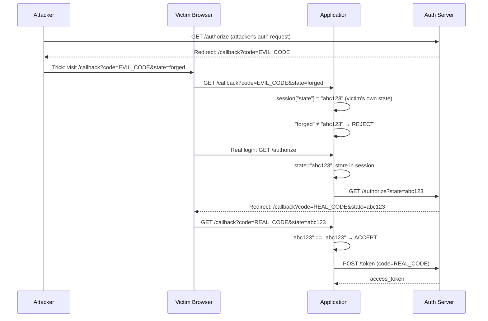

⚡ TL;DR - CSRF in OAuth exploits the redirect-based flow:
an attacker forces a victim's browser to complete an OAuth
authorization request that the attacker initiated, binding
the victim's account to the attacker's tokens or injecting
the attacker's authorization code into the victim's session.
The `state` parameter is the mitigation: the client generates
a random value before the `/authorize` redirect, stores it in
session, and verifies it matches the value in the callback.
If they do not match, the callback is rejected. PKCE also
provides CSRF protection at the code exchange level and is
recommended alongside `state`.

---

### 🔥 The Problem This Solves

**THE OAUTH CSRF ATTACK:**

Standard CSRF attacks forge state-changing requests. OAuth
CSRF forges the authorization FLOW itself. The classic attack:
(1) Attacker starts an auth flow with their own AS account,
gets to the authorization request stage, but does not complete
it. (2) Attacker captures the callback URL (with `code=...`).
(3) Attacker tricks the victim into visiting that callback URL
(via phishing link, img src, etc.). (4) The victim's session
at the application now exchanges the attacker's authorization
code and binds it to the victim's session. Result: the attacker's
OAuth tokens are associated with the victim's account.

---

### 📘 Textbook Definition

OAuth 2.0 CSRF (Cross-Site Request Forgery) is an attack that
exploits the redirect-based authorization flow to inject a
malicious authorization response into a victim's OAuth session.

**The `state` parameter (RFC 6749 §10.12):**
The client generates a random, unguessable value before sending
the `/authorize` request. This value is bound to the user's
session (stored in session storage, cookie, or in-memory). It
is sent as the `state` parameter to the AS. The AS reflects
it back in the callback redirect. The client validates that
the returned `state` matches the stored value. If it does not
match, the request is rejected.

**PKCE as additional CSRF protection:**
PKCE's `code_challenge`/`code_verifier` provides an independent
second layer: even if an attacker's authorization code reaches
the victim's callback handler, the `code_verifier` stored in
the victim's session will not match the `code_challenge` in
the attacker's code → `invalid_grant` at token endpoint.

---

### ⏱️ Understand It in 30 Seconds

**The attack and defense:**

```
ATTACK (no state validation):
  1. Attacker: GET /authorize → gets callback with code=EVIL_CODE
  2. Attacker tricks victim: visit https://app.com/callback?code=EVIL_CODE
  3. Victim's session exchanges EVIL_CODE → gets tokens
  4. Victim's account now linked to attacker's identity
  Result: Account takeover or token injection

DEFENSE (state validation):
  1. Before /authorize: generate random state=RANDOM_XYZ
     Store in victim's session: session["state"] = RANDOM_XYZ
  2. Send: /authorize?state=RANDOM_XYZ&...
  3. Callback arrives: ?code=...&state=ATTACKER_STATE
  4. RANDOM_XYZ ≠ ATTACKER_STATE → REJECT callback
  Result: Attack fails; valid callback is accepted
```

---

### ⚙️ How It Works (Mechanism)

```
┌──────────────────────────────────────────────────────────┐
│  OAUTH CSRF ATTACK - STATE PARAMETER DEFENSE              │
├──────────────────────────────────────────────────────────┤
│                                                           │
│  WITHOUT STATE (VULNERABLE):                              │
│                                                           │
│  Attacker                    App               Victim     │
│    1. GET /authorize                                      │
│         ?client_id=app                                    │
│         &response_type=code                               │
│    2. AS issues code for attacker's account               │
│    3. AS redirects to:                                    │
│       https://app.com/callback?code=EVIL_CODE             │
│    4. Attacker captures this URL                          │
│    5. Attacker sends victim an email:                     │
│       "Click here: https://app.com/callback?code=EVIL_CODE│
│    6. Victim clicks → Victim's browser sends callback     │
│    7. App (no state validation):                          │
│       POST /token { code: EVIL_CODE }                     │
│       → Tokens for ATTACKER issued to VICTIM's session    │
│    8. Victim's actions in app use ATTACKER's account      │
│                                                           │
│  WITH STATE (DEFENDED):                                   │
│                                                           │
│  Victim requests login:                                   │
│    App generates: state = "abc123" [stored in session]    │
│    Redirects to: /authorize?...&state=abc123              │
│    AS issues code, redirects:                             │
│    https://app.com/callback?code=REAL_CODE&state=abc123   │
│    App: state in callback ("abc123") == session ("abc123")│
│    → MATCH → proceed with code exchange                   │
│                                                           │
│  ATTACKER TRIES:                                          │
│    Attacker forges: /callback?code=EVIL_CODE&state=xyz789 │
│    App: state in callback ("xyz789") ≠ session ("abc123") │
│    → MISMATCH → REJECT → 403 / redirect to error page    │
│                                                           │
│  ATTACKER TRIES TO FORGE state:                           │
│    state must be random, unguessable (≥128 bits entropy)  │
│    Even if attacker knows victim's session cookie,        │
│    they cannot forge the state value without seeing it    │
└──────────────────────────────────────────────────────────┘
```



---

### 💻 Code Example

**Example 1 - BAD then GOOD: State validation in callback:**

```python
# BAD: No state validation - vulnerable to OAuth CSRF

from flask import Flask, request, redirect, session
import requests

app = Flask(__name__)

@app.route('/auth/login')
def login():
    auth_url = (
        "https://as.example.com/authorize?"
        "response_type=code"
        "&client_id=myapp"
        "&redirect_uri=https://app.example.com/callback"
        "&scope=openid"
        # MISSING: state parameter
    )
    return redirect(auth_url)

@app.route('/callback')
def callback_bad():
    code = request.args.get('code')
    # WRONG: No state validation
    # Attacker can forge this callback with their own code
    tokens = exchange_code(code)
    session['access_token'] = tokens['access_token']
    return redirect('/dashboard')
```

```python
# GOOD: State validation per RFC 6749 §10.12
# WHY: state binds the callback to THIS user's login session.
#   A forged callback with a different state is rejected.

import secrets
from flask import Flask, request, redirect, session, abort
import requests

app = Flask(__name__)
app.secret_key = secrets.token_hex(32)

@app.route('/auth/login')
def login():
    # Generate cryptographically random state
    state = secrets.token_urlsafe(32)  # 256-bit entropy
    session['oauth_state'] = state

    # Also generate PKCE (additional protection layer)
    code_verifier = secrets.token_urlsafe(64)
    import hashlib, base64
    code_challenge = base64.urlsafe_b64encode(
        hashlib.sha256(
            code_verifier.encode('ascii')
        ).digest()
    ).decode('ascii').rstrip('=')
    session['code_verifier'] = code_verifier

    auth_url = (
        "https://as.example.com/authorize?"
        "response_type=code"
        "&client_id=myapp"
        "&redirect_uri=https://app.example.com/callback"
        "&scope=openid"
        f"&state={state}"           # CSRF protection
        f"&code_challenge={code_challenge}"
        "&code_challenge_method=S256"
    )
    return redirect(auth_url)

@app.route('/callback')
def callback():
    # STEP 1: Validate state BEFORE any other processing
    returned_state = request.args.get('state')
    stored_state = session.pop('oauth_state', None)

    if not stored_state:
        # No pending auth in this session
        abort(400, "No authorization in progress")

    if not secrets.compare_digest(
        returned_state or '',
        stored_state
    ):
        # State mismatch = CSRF attack or replay attempt
        abort(403, "State mismatch - invalid callback")

    # STEP 2: Check for errors
    if request.args.get('error'):
        error = request.args.get('error')
        if error == 'access_denied':
            return "You denied access", 200
        return f"Authorization error: {error}", 400

    # STEP 3: Exchange code for tokens
    code = request.args.get('code')
    code_verifier = session.pop('code_verifier', None)

    tokens = exchange_code(code, code_verifier)
    session['access_token'] = tokens['access_token']
    return redirect('/dashboard')

def exchange_code(code, code_verifier):
    resp = requests.post(
        'https://as.example.com/token',
        data={
            'grant_type': 'authorization_code',
            'code': code,
            'client_id': 'myapp',
            'redirect_uri': 'https://app.example.com/callback',
            'code_verifier': code_verifier,
        }
    )
    resp.raise_for_status()
    return resp.json()
```

**Example 2 - State entropy and storage requirements:**

```python
# State quality requirements:
# 1. Cryptographically random (not predictable)
# 2. Sufficient entropy (≥128 bits = 22+ base64url chars)
# 3. Bound to this browser session (session storage, not URL)
# 4. Single-use (remove from session after validation)
# 5. Short lifetime (invalidate if not used in 10 minutes)

# BAD state implementations:
bad_states = [
    "12345",                    # Guessable (sequential)
    "csrf-token",               # Static = replayable
    str(user_id) + str(time()), # Predictable
    uuid.uuid4().hex[:8],       # Too short (< 128 bits)
]

# GOOD state implementations:
import secrets
import time

good_state = secrets.token_urlsafe(32)  # 256 bits

# With expiry (store state with timestamp):
session['oauth_pending'] = {
    'state': secrets.token_urlsafe(32),
    'issued_at': time.time(),
    'expires_at': time.time() + 600,  # 10 minute window
}

def validate_state(returned_state: str) -> bool:
    pending = session.pop('oauth_pending', None)
    if not pending:
        return False
    if time.time() > pending['expires_at']:
        return False  # Expired state (session replay?)
    return secrets.compare_digest(
        returned_state, pending['state']
    )
```

---

### ⚖️ Comparison Table

| CSRF Defense | Protects Against | Layer | When Sufficient |
|---|---|---|---|
| **State parameter** | Forged callback injection | Authorization request binding | Required baseline |
| **PKCE** | Code interception + CSRF at exchange | Code exchange binding | Required for public clients |
| **PKCE + State** | Full CSRF coverage | Both layers | Recommended for all clients |
| **nonce (OIDC)** | ID token replay/injection | ID token binding | Required for OIDC Implicit (deprecated) |

---

### ⚠️ Common Misconceptions

| Misconception | Reality |
|---|-------|
| The `state` parameter is optional boilerplate | RFC 6749 §10.12 says "clients SHOULD utilize" the state parameter to prevent CSRF. RFC 9700 §2.1.0 is stronger: failing to validate state is a vulnerability. The `state` parameter is not documentation decoration - it is the CSRF mitigation mechanism. Omitting it leaves the callback endpoint exploitable. |
| PKCE replaces the need for the state parameter | PKCE protects code exchange (the code_verifier binding). State protects the authorization request initiation (session binding). They protect different attack surfaces. A CSRF attack can inject a callback before PKCE verification occurs (if the attacker's code matches the expected format). RFC 9700 recommends BOTH. Some AS implementations also support `nonce` as additional protection. |
| OAuth CSRF requires the attacker to be on the same network | OAuth CSRF is a social engineering + browser attack, not a network attack. The attacker captures their own authorization callback URL, then tricks the victim into visiting it (phishing email, embedded image, XSS redirect). No network position is required. The attacker can be anywhere in the world. |
| Short session TTLs are sufficient CSRF protection for OAuth | The OAuth callback window is short (authorization codes expire in ~10 minutes), which limits the attack window but does not prevent it. An attacker can act within the window. State parameter validation closes the window entirely: even if the attacker tricks the victim immediately, the state mismatch prevents the injection. |

---

### 🚨 Failure Modes & Diagnosis

**OAuth CSRF via Unvalidated State**

**Symptom:**
Security researcher reports: user account linkage can be
hijacked by sending a victim a crafted link to
`https://app.com/callback?code=EVIL_CODE`. The victim's account
is linked to the attacker's OAuth identity (e.g., attacker's
Google account linked to victim's app account).

**Root Cause:**
Callback handler calls `exchange_code(request.args['code'])`
without first validating the `state` parameter against the
value stored in the user's session.

**Diagnostic:**

```python
# Check if state validation is present and correct:
# grep for callback handler logic

# VULNERABLE pattern:
# code = request.args.get('code')
# tokens = exchange_code(code)  # No state check!

# ALSO VULNERABLE: weak check
# if request.args.get('state'):  # Only checks presence
#     exchange_code(code)         # Doesn't compare value!

# CORRECT pattern:
# returned_state = request.args.get('state')
# stored_state = session.pop('oauth_state', None)
# if not secrets.compare_digest(returned_state, stored_state):
#     abort(403)
```

**Fix:**
Add state validation as the FIRST operation in the callback
handler, before processing `code` or `error` parameters.
Use `secrets.compare_digest()` (timing-safe comparison).
Remove state from session after validation (single-use).
Add automated test: callback with wrong state must return 403.

---

### 🔗 Related Keywords

**Prerequisites:**
- `State Parameter` - the mechanism
- `Authorization Code Flow` - the flow being protected

**Builds On:**
- `OAuth 2.0 Threat Model (RFC 6819)` - the broader threat context
- `PKCE (Proof Key for Code Exchange)` - the complementary protection

---

### 📌 Quick Reference Card

```
┌──────────────────────────────────────────────────────────┐
│ ATTACK       │ Forged callback injects attacker's code   │
│              │ into victim's session → account takeover  │
├──────────────┼───────────────────────────────────────────┤
│ STATE RULE   │ Generate random (≥256 bit) BEFORE /auth   │
│              │ Store in session. Validate in callback.   │
│              │ Remove after single use.                  │
├──────────────┼───────────────────────────────────────────┤
│ VALIDATION   │ Use timing-safe compare (compare_digest)  │
│              │ Reject if missing OR mismatched           │
├──────────────┼───────────────────────────────────────────┤
│ PKCE         │ Second layer: code_verifier in session    │
│ LAYER        │ Bound to code_challenge. Use BOTH.        │
├──────────────┼───────────────────────────────────────────┤
│ FIRST CHECK  │ Validate state BEFORE processing code     │
│              │ or error params in callback handler       │
├──────────────┼───────────────────────────────────────────┤
│ ONE-LINER    │ "state = CSRF token for OAuth. Validate   │
│              │  before exchanging code. Use both + PKCE."│
└──────────────────────────────────────────────────────────┘
```

**If you remember only 3 things:**

1. OAuth CSRF injects an attacker's authorization code into
   the victim's session. The `state` parameter prevents this:
   it binds the callback to the specific user session that
   initiated the auth request. Always validate state FIRST.

2. Use cryptographically random state (≥256 bits via
   `secrets.token_urlsafe(32)`). Compare with
   `secrets.compare_digest()` (timing-safe). Remove from
   session after validation (single-use).

3. Use BOTH state AND PKCE. State protects the authorization
   request level; PKCE protects the code exchange level.
   Each covers an attack surface the other does not.
