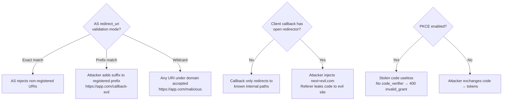

⚡ TL;DR - Redirect URI hijacking attacks exploit weak
validation of the `redirect_uri` parameter at the AS. If the
AS uses prefix matching, wildcard matching, or path-traversal-
vulnerable validation, an attacker can redirect the authorization
code to an attacker-controlled URI. Even without exploiting
the AS directly, an open redirector at the client's own
redirect URI (e.g., `https://app.com/callback?next=
https://evil.com`) can be abused to forward the authorization
code off-domain. The defenses: AS uses exact-match-only
redirect_uri registration (RFC 9700 §2.1); client callback
handlers never redirect to externally-supplied URLs.

---

### 🔥 The Problem This Solves

**THE REDIRECT URI AS ATTACK SURFACE:**

The redirect URI is the most security-critical parameter in
OAuth. The entire security of the authorization code delivery
depends on the AS correctly restricting where it can send the
code. If an attacker can make the AS redirect to their server,
they receive the authorization code and can exchange it for
tokens. This requires no phishing, no MitM - just a
misconfigured AS or a client app with an open redirect endpoint.

---

### 📘 Textbook Definition

Redirect URI hijacking attacks exploit misconfigured redirect
URI validation to deliver authorization codes or tokens to
attacker-controlled URIs. RFC 9700 §2.1 requires strict
redirect URI validation to prevent these attacks.

**Attack categories:**

**1. AS-level: Weak redirect_uri validation**
- Prefix matching: AS accepts any URI starting with the
  registered prefix. Attack: register `https://app.com/callback-evil`
  or `https://app.com.evil.com/callback` if AS matches domain prefix.
- Wildcard: AS accepts `https://app.com/*`. Attack: use any path.
- Path traversal: AS accepts `https://app.com/callback`; attacker
  uses `https://app.com/callback/../steal`.
- Port variance: AS accepts `https://app.com/callback`; attacker
  uses `https://app.com:8080/callback` on a port they control.

**2. Client-level: Open redirector at callback URI**
If the client's callback endpoint is `https://app.com/callback
?next=/dashboard` and the client redirects to the `next`
parameter without validation, the attacker uses:
`https://app.com/callback?next=https://evil.com&code=...`
The code is processed; then the user is redirected to evil.com
(and the attacker could capture the authorization code in the
Referer header of the evil.com request).

---

### ⏱️ Understand It in 30 Seconds

**The attack variants:**

```
VARIANT 1: AS prefix matching (misconfigured AS):
  Registered: https://app.com/callback
  Attack URI: https://app.com/callback-evil ← prefix match!
  Result: code delivered to attacker's /callback-evil

VARIANT 2: Domain prefix matching:
  Registered: https://app.com/callback
  Attack URI: https://app.com.evil.com/callback ← "app.com."
  Result: code to evil.com (subdomain of attacker)

VARIANT 3: Client open redirector:
  Callback: https://app.com/callback?next=/dashboard
  Attack: https://app.com/callback?next=https://evil.com
  Result: code processed; Referer leaks code to evil.com

DEFENSE:
  AS: exact-match only. No prefix, no wildcards.
  Client: never redirect to externally-provided `next` URL.
```

---

### ⚙️ How It Works (Mechanism)

```
┌──────────────────────────────────────────────────────────┐
│  REDIRECT URI HIJACKING: AS-LEVEL ATTACK                  │
├──────────────────────────────────────────────────────────┤
│                                                           │
│  REGISTERED (in AS): https://app.com/callback             │
│  AS VALIDATION: prefix match (misconfigured)              │
│                                                           │
│  ATTACK FLOW:                                             │
│  1. Attacker crafts auth URL:                             │
│     GET /authorize?                                       │
│       client_id=app                                       │
│       &redirect_uri=https://app.com/callback-steal        │
│       &response_type=code                                 │
│       &state=...                                          │
│                                                           │
│  2. AS validates: does requested URI start with           │
│     "https://app.com/callback"? YES. ← prefix match bug  │
│     AS accepts the URI.                                   │
│                                                           │
│  3. Victim visits attacker's link, authenticates.         │
│     AS redirects to: https://app.com/callback-steal?code= │
│                                                           │
│  4. Attacker controls /callback-steal → captures code     │
│                                                           │
│  5. Without PKCE: attacker exchanges code for tokens      │
│     With PKCE: code useless (no code_verifier) ← defense  │
│                                                           │
│  ATTACK FLOW - OPEN REDIRECTOR AT CLIENT:                 │
│  1. AS validates: redirect_uri=https://app.com/callback   │
│     This is exactly registered → accepted.                │
│  2. Attacker crafts URL:                                  │
│     https://app.com/callback?next=https://evil.com        │
│  3. Victim authenticates; AS redirects to:                │
│     https://app.com/callback?code=XYZ&next=https://evil   │
│  4. Client's callback handler processes code.             │
│  5. Client redirects to next="https://evil.com"           │
│     (URL parameter without validation)                    │
│  6. Browser sends: GET https://evil.com                   │
│     Referer: https://app.com/callback?code=XYZ&...        │
│  7. Evil.com server logs the Referer → extracts code      │
│     (Code may already be used, but AT could be in Referer │
│     if using Implicit flow or if stored in URL)           │
└──────────────────────────────────────────────────────────┘
```



---

### 💻 Code Example

**Example 1 - BAD then GOOD: AS redirect_uri validation:**

```python
# BAD: Prefix-based redirect_uri validation
# Allows attacker to append to the registered URI

REGISTERED_URIS = {
    "myapp": ["https://app.example.com/callback"]
}

def validate_redirect_uri_bad(
    client_id: str,
    requested_uri: str,
) -> bool:
    # WRONG: prefix matching - allows suffix injection
    return any(
        requested_uri.startswith(reg)
        for reg in REGISTERED_URIS.get(client_id, [])
    )

# validate_redirect_uri_bad("myapp",
#   "https://app.example.com/callback-steal") → True!
# validate_redirect_uri_bad("myapp",
#   "https://app.example.com/callback/../evil") → True!
```

```python
# GOOD: Exact string match only (RFC 9700 §2.1)
# WHY: Any deviation in path, host, or port = different URI.
#   "exact match" means all components must match.

from urllib.parse import urlparse

REGISTERED_URIS = {
    "myapp": [
        "https://app.example.com/callback",
        "https://staging.example.com/callback",
        "http://localhost:3000/callback",  # dev only
    ]
}

def validate_redirect_uri(
    client_id: str,
    requested_uri: str,
) -> bool:
    """
    RFC 9700 §2.1 compliant redirect_uri validation.
    Exact string match. Case-sensitive. No normalization.
    """
    registered = REGISTERED_URIS.get(client_id, [])

    # Exact string comparison - no normalization tricks
    if requested_uri not in registered:
        return False

    # Additional: reject dangerous schemes
    parsed = urlparse(requested_uri)
    allowed_schemes = {'https', 'http'}  # http for localhost
    if parsed.scheme not in allowed_schemes:
        return False

    # Enforce HTTPS for non-localhost
    if (parsed.scheme == 'http' and
            parsed.hostname not in ('localhost', '127.0.0.1')):
        return False

    return True

# Attacker attempts all fail:
# "https://app.example.com/callback-evil" → False (not registered)
# "https://app.example.com/callback/../evil" → False (not registered)
# "https://app.example.com.evil.com/callback" → False
# "https://app.example.com:8080/callback" → False (port differs)
```

**Example 2 - Client: preventing open redirector at callback:**

```python
# BAD: Callback handler with open redirector
# The `next` parameter is used without validation

from flask import request, redirect

@app.route('/callback')
def callback_bad():
    code = request.args.get('code')
    next_url = request.args.get('next', '/dashboard')
    # ... process code ...
    return redirect(next_url)  # WRONG: attacker controls this
    # Attacker: /callback?code=...&next=https://evil.com
    # After code processed: user sent to evil.com
    # evil.com logs Referer containing the callback URL
```

```python
# GOOD: Callback handler rejects external redirects
# WHY: The callback must only redirect to internal paths.
#   Any external redirect from a callback handler is a
#   security vulnerability (open redirector).

from urllib.parse import urlparse
from flask import request, redirect, abort
import re

ALLOWED_REDIRECT_PATHS = re.compile(
    r'^/(dashboard|profile|home|orders)(\/.*)?$'
)

@app.route('/callback')
def callback():
    # State validation first (CSRF)
    # ... state validation ...

    # Code exchange
    code = request.args.get('code')
    # ... exchange code ...

    # SAFE post-auth redirect:
    # Option A: Fixed redirect (most secure)
    return redirect('/dashboard')

    # Option B: Path-only redirect with allowlist
    # next_path = request.args.get('next', '/dashboard')
    # parsed = urlparse(next_path)
    # if parsed.scheme or parsed.netloc:
    #     # Has scheme or host = external URL = reject
    #     return redirect('/dashboard')
    # if not ALLOWED_REDIRECT_PATHS.match(parsed.path):
    #     return redirect('/dashboard')
    # return redirect(next_path)
```

---

### ⚖️ Comparison Table

| Validation Mode | Attack Vector | RFC 9700 Status | Example |
|---|---|---|---|
| **Exact match** | None | Required | `/callback` only |
| **Prefix match** | Append suffix | Non-compliant | `/callback-evil` accepted |
| **Wildcard** | Any path | Non-compliant | `/evil` accepted |
| **No validation** | Completely open | Prohibited | Any URI accepted |

---

### ⚠️ Common Misconceptions

| Misconception | Reality |
|---|---|
| PKCE mitigates redirect_uri hijacking at the AS level | PKCE prevents an attacker from exchanging a stolen code without the `code_verifier`. It does NOT prevent the AS from sending the code to the wrong URI in the first place. PKCE is a second layer of defense; strict redirect_uri validation is the primary defense that prevents code delivery to the attacker at all. |
| Wildcards are needed for multi-subdomain apps | Multi-subdomain apps should register each subdomain's callback URI explicitly. If dynamic subdomain callback URIs are genuinely required (e.g., per-tenant subdomains), use a server-side component that validates the subdomain against a registry and proxies the OAuth callback. Never use wildcards at the AS level. |
| Open redirectors in the callback handler are a low-severity issue | An open redirector at a callback endpoint (where authorization codes are present in the URL) is a HIGH severity issue. The attacker can use the open redirector to forward the user (with the code in the URL history) to their site, where Referer headers may expose the code. Combined with the lack of PKCE, this can result in token theft. |
| The `redirect_uri` AS validation only matters for public clients | Private/confidential clients (those with client_secret) are also affected by weak redirect_uri validation. An attacker who can make the AS send the code to a controlled URI can bypass client authentication entirely - they get the code without needing the client_secret, because the code was delivered directly to them. |

---

### 🚨 Failure Modes & Diagnosis

**AS Accepting Non-Registered Redirect URI (Prefix Match)**

**Symptom:**
Penetration test demonstrates that the AS accepts
`redirect_uri=https://app.example.com/callback-evil` even
though only `https://app.example.com/callback` is registered.
The redirect_uri parameter in the auth request is not the one
registered, but no error is returned.

**Diagnostic:**

```bash
# Test AS redirect_uri validation:
curl -v "https://as.example.com/authorize?\
  response_type=code\
  &client_id=myapp\
  &redirect_uri=https%3A%2F%2Fapp.example.com%2Fcallback-evil\
  &scope=openid"

# Correct AS behavior: 400 with error=invalid_request
# Vulnerable AS behavior: 302 redirect to callback-evil
```

**Fix:**
Configure the AS to use exact-match redirect_uri validation.
In Keycloak: set "Valid Redirect URIs" to exact URIs (no
wildcards). In Auth0: register exact callback URLs in
"Allowed Callback URLs". In Spring Authorization Server:
`RegisteredClient.withId()...redirectUri("exact-uri")`.
After fix: repeat the test to verify AS returns 400 for
non-registered URIs.

---

### 🔗 Related Keywords

**Prerequisites:**
- `Redirect URI` - the foundational concept
- `Authorization Code Flow` - the flow being attacked

**Builds On:**
- `OAuth 2.0 Threat Model (RFC 6819)` - attack taxonomy
- `Authorization Code Interception Attack` - related attack pattern

---

### 📌 Quick Reference Card

```
┌──────────────────────────────────────────────────────────┐
│ AS DEFENSE   │ Exact-match only. No prefix, wildcard.   │
│              │ RFC 9700 §2.1: required.                  │
│              │ Test: non-registered URI → 400 error      │
├──────────────┼───────────────────────────────────────────┤
│ ATTACK       │ Prefix: /callback-evil if AS prefix-match│
│ VARIANTS     │ Domain: app.com.evil.com if AS domains    │
│              │ Open redir: /callback?next=https://evil   │
├──────────────┼───────────────────────────────────────────┤
│ CLIENT       │ Never redirect to externally-provided URL │
│ DEFENSE      │ Post-auth redirect = fixed or path-only   │
├──────────────┼───────────────────────────────────────────┤
│ PKCE         │ Second layer: stolen code needs verifier  │
│ LAYER        │ Doesn't prevent delivery to wrong URI     │
├──────────────┼───────────────────────────────────────────┤
│ TEST         │ Try registering non-exact URIs at AS      │
│              │ AS MUST return 400 invalid_request        │
├──────────────┼───────────────────────────────────────────┤
│ ONE-LINER    │ "Weak redirect_uri check = code delivery  │
│              │  to attacker. Exact match is non-negotiable"│
└──────────────────────────────────────────────────────────┘
```

**If you remember only 3 things:**

1. AS must use exact-match redirect_uri validation. No prefix
   matching, no wildcards. Test this explicitly: a non-registered
   URI should return 400 `invalid_request`, never redirect.

2. An open redirector at the client's callback endpoint is a
   security vulnerability, not a convenience feature. Post-auth
   redirects should only go to known internal paths.

3. PKCE is a second layer (code useless without verifier) but
   does not prevent the code being delivered to the attacker's
   URI in the first place. The primary defense is strict AS
   redirect_uri validation.
