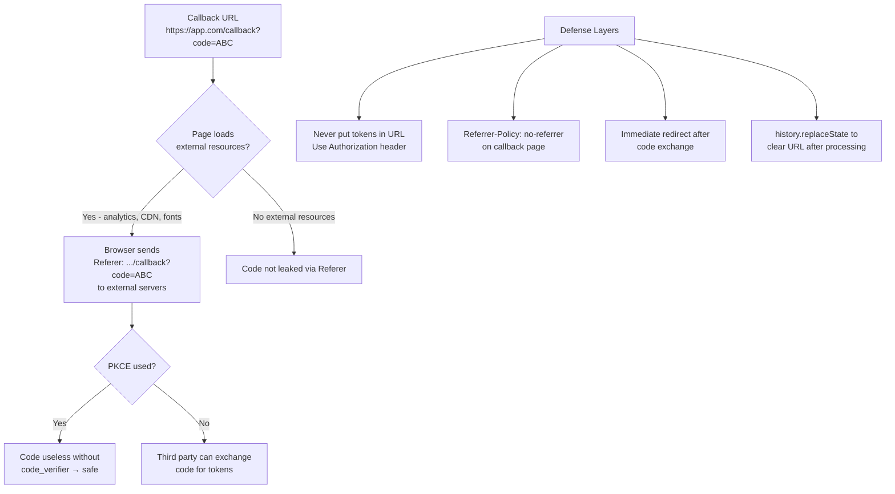

⚡ TL;DR - Token leakage via Referrer header occurs when an
access token embedded in a URL (from Implicit Flow or poor
API design using `?token=` query params) is transmitted to a
third party as part of the HTTP `Referer` header when the user
or page navigates externally. Specifically: if the page URL
contains `?access_token=eyJ...` and that page has any external
resource (analytics script, CDN image, third-party font), the
browser sends `Referer: https://app.com/page?access_token=eyJ`
to the external server. Mitigations: never put tokens in URLs,
use `Referrer-Policy: no-referrer` or `origin` header, and
deploy `Content-Security-Policy` to restrict external requests.

---

### 🔥 The Problem This Solves

**THE URL-EMBEDDED TOKEN PROBLEM:**

Tokens were never designed to be in URLs. But two patterns
routinely put them there: Implicit Flow (deprecated, returns
`#access_token=...` in fragment), and bad API designs that
use `?api_key=` or `?token=` query parameters for authentication.
URLs travel further than developers expect: browser history,
browser bookmarks, server access logs, CDN edge logs, proxy
logs, Referer headers to analytics platforms, and link-in-bio
shorteners. Any of these exposures can result in token theft.

---

### 📘 Textbook Definition

Token leakage via Referrer header is a class of information
disclosure vulnerabilities where sensitive data embedded in
a URL is transmitted to unintended third parties through the
HTTP `Referer` (historical misspelling retained by spec)
request header.

**The Referer header mechanism:**
When a browser navigates from page A to page B (via link,
redirect, or loading a sub-resource), it sends the URL of
page A in the `Referer` header of the request to page B's
server. If page A's URL contains sensitive data (tokens, keys,
session IDs), that data is sent to page B's server.

**In OAuth context:**
- Implicit Flow: `#access_token=...` in fragment. Per spec,
  fragments are NOT sent in Referer, but query string tokens
  from subsequent OIDC responses (`?id_token=...`, `?code=...`)
  or poor API designs ARE sent.
- The `code` query parameter in authorization callbacks:
  `https://app.com/callback?code=AUTH_CODE` is in the Referer
  for any subsequent navigation from that page before the code
  is processed and the URL is cleaned up.

**`Referrer-Policy` header:**
The `Referrer-Policy` HTTP response header controls how much
Referer information the browser includes. Values: `no-referrer`
(send nothing), `origin` (send only scheme+host, no path),
`strict-origin-when-cross-origin` (default browser behavior:
full URL same-origin, origin-only cross-origin, origin-only
for downgrade to HTTP).

---

### ⏱️ Understand It in 30 Seconds

**The leakage path:**

```
URL: https://app.com/callback?code=AUTHCODE123

Page loads: analytics.js from analytics.company.com
Browser sends:
  GET https://analytics.company.com/tracker.gif
  Referer: https://app.com/callback?code=AUTHCODE123

Analytics server logs:
  IP: 1.2.3.4
  Referer: https://app.com/callback?code=AUTHCODE123
  → code is now on analytics server

WITH PKCE: code is useless without code_verifier
WITHOUT PKCE: analytics company (or anyone with log access)
              can exchange the code for tokens

TOKEN IN URL (Implicit or ?token= API design):
  Browser logs → permanent history exposure
  Analytics logs → every page load leaks the token
  Proxy logs → infra team can see tokens in logs
  HTTP (not HTTPS) → any network observer sees it
```

---

### ⚙️ How It Works (Mechanism)

```
┌──────────────────────────────────────────────────────────┐
│  TOKEN LEAKAGE VECTORS                                    │
├──────────────────────────────────────────────────────────┤
│                                                           │
│  VECTOR 1: AUTHORIZATION CODE IN CALLBACK URL             │
│    https://app.com/callback?code=AUTHCODE&state=xyz        │
│    Any sub-resource loaded on this page (script, img)     │
│    → browser sends Referer with full URL including code   │
│    Risk: code leaked to analytics, CDN, any third party   │
│    Mitigation: immediate redirect after code exchange     │
│                                                           │
│  VECTOR 2: IMPLICIT FLOW (deprecated)                     │
│    https://app.com/#access_token=eyJ...                   │
│    Fragment technically NOT sent in Referer per HTTP spec  │
│    But: JavaScript can read fragment and include in XHR   │
│    And: The URL is in browser history with the token       │
│    Risk: history exposure, XSS-accessible, JS-readable    │
│    Mitigation: STOP USING IMPLICIT FLOW                   │
│                                                           │
│  VECTOR 3: QUERY PARAM TOKENS IN API DESIGN               │
│    GET /api/data?access_token=eyJ...                      │
│    This IS sent in Referer by all browsers                │
│    Also logged in: nginx, Apache, CDN, API gateway        │
│    Risk: token in every server access log                 │
│    Mitigation: ALWAYS use Authorization header, not URL   │
│                                                           │
│  DEFENSE LAYERS:                                          │
│                                                           │
│  1. Never put tokens in URLs (primary defense)            │
│     → Auth Code + PKCE: code in URL is short-lived        │
│     → Tokens in response body (POST /token), not URL      │
│     → API calls use Authorization: Bearer header          │
│                                                           │
│  2. Referrer-Policy header on sensitive pages             │
│     → Callback handler sends:                             │
│        Referrer-Policy: no-referrer                        │
│     → Browser sends no Referer from this page             │
│                                                           │
│  3. Immediate URL cleanup (for code in callback URL)      │
│     → After processing ?code=..., redirect to /dashboard   │
│     → Or: replace URL with history.replaceState            │
│        (removes code from URL without full redirect)      │
│                                                           │
│  4. Content Security Policy (CSP)                         │
│     → Restrict which external origins can load scripts    │
│     → Reduces attack surface for third-party Referer leak │
└──────────────────────────────────────────────────────────┘
```



---

### 💻 Code Example

**Example 1 - BAD then GOOD: API token placement:**

```python
# BAD: Token in URL query parameter
# Logged by: nginx, Apache, CDN, API gateway, Referer headers

# Client calls:
GET https://api.example.com/users?access_token=eyJhbGci...
# WRONG: every server in the chain logs this URL
# WRONG: token in server access logs permanently
# WRONG: if user bookmarks this URL, token in bookmarks
# WRONG: Referer sends this URL to any subsequent requests

# Server receives:
request.args.get('access_token')  # Reading from URL = bad
```

```python
# GOOD: Token in Authorization header
# WHY: Headers are NOT logged by default in nginx/Apache.
#   Headers are NOT sent in Referer.
#   Headers are NOT in browser history.

# Client calls (Python requests):
import requests

def call_api_safely(access_token: str) -> dict:
    """Always send token in Authorization header, not URL."""
    response = requests.get(
        'https://api.example.com/users',
        headers={
            'Authorization': f'Bearer {access_token}',
            # Note: no token in URL, no token in query params
        }
    )
    response.raise_for_status()
    return response.json()

# Server receives:
from flask import request

@app.route('/users')
def get_users():
    auth_header = request.headers.get('Authorization', '')
    if not auth_header.startswith('Bearer '):
        return {'error': 'missing_token'}, 401
    token = auth_header[7:]  # Strip "Bearer "
    # Token is in header - not in URL - not logged by default
```

**Example 2 - Callback handler: Referrer-Policy and URL cleanup:**

```python
# Flask callback handler with Referrer-Policy and URL cleanup

from flask import request, redirect, make_response, session
import secrets

@app.after_request
def add_security_headers(response):
    """Add security headers to all responses."""
    # Referrer-Policy: restrict what the browser sends as Referer
    # For auth callback: no-referrer prevents code leakage
    response.headers['Referrer-Policy'] = 'no-referrer'
    # For general pages: strict-origin-when-cross-origin
    # sends only origin (not path) cross-origin
    return response

@app.route('/callback')
def callback():
    # State validation first (CSRF protection)
    state = request.args.get('state')
    stored_state = session.pop('oauth_state', None)
    if not secrets.compare_digest(state or '', stored_state or ''):
        return 'Invalid state', 403

    code = request.args.get('code')
    code_verifier = session.pop('code_verifier', None)

    # Exchange code for tokens
    tokens = exchange_code(code, code_verifier)

    # Store tokens in session (not in URL)
    session['access_token'] = tokens['access_token']
    session['refresh_token'] = tokens.get('refresh_token')

    # IMPORTANT: Redirect immediately after processing code.
    # This removes the ?code= from the URL in browser history
    # and prevents sub-resources on /dashboard from seeing
    # the callback URL with code in Referer.
    resp = make_response(redirect('/dashboard'))
    resp.headers['Referrer-Policy'] = 'no-referrer'
    return resp
```

```javascript
// Frontend: clean URL after processing code
// Alternative to server redirect: use history.replaceState
// This removes code from URL bar without a round trip

function handleOAuthCallback() {
  const params = new URLSearchParams(window.location.search);
  const code = params.get('code');
  const state = params.get('state');

  if (!code) return;

  // Validate state
  const savedState = sessionStorage.getItem('oauth_state');
  if (state !== savedState) {
    throw new Error('CSRF attack detected');
  }
  sessionStorage.removeItem('oauth_state');

  // Exchange code for tokens (async)
  exchangeCode(code, sessionStorage.getItem('code_verifier'))
    .then(tokens => {
      sessionStorage.removeItem('code_verifier');

      // CLEAN UP URL: Remove code from browser history
      // so it doesn't appear in Referer for page resources
      const cleanUrl = window.location.pathname;
      window.history.replaceState(
        {}, document.title, cleanUrl
      );
      // URL is now https://app.com/callback (no ?code=...)
      // Any analytics loaded now won't see code in Referer

      // Store token in memory (best) or sessionStorage
      storeTokens(tokens);
      navigateToDashboard();
    });
}
```

---

### ⚖️ Comparison Table

| Token Location | Logged Where | Referrer Risk | History Risk | Recommendation |
|---|---|---|---|---|
| **URL query param** | Server logs, CDN, proxy, analytics | High (always sent) | High | Never for tokens |
| **URL fragment** | Client-only, JS-readable | Partial (not in HTTP Referer per spec) | High | Never (Implicit deprecated) |
| **Authorization header** | Not logged by default | None (headers not in Referer) | None | Always use this |
| **Cookie (httpOnly)** | Not in URL | None (not in Referer) | None | For sessions/refresh tokens |

---

### ⚠️ Common Misconceptions

| Misconception | Reality |
|---|---|
| URL fragments (`#access_token=`) are safe because they don't appear in server logs | Fragments are not sent in HTTP requests to the server, so they don't appear in server access logs for the initial request. However: they ARE in browser history, they ARE visible to JavaScript on the page (including third-party scripts), they CAN appear in Referer headers in some browsers when navigating away, and they ARE logged if the page's JavaScript explicitly reads the fragment and includes it in an analytics event or XHR request. |
| Referrer-Policy only needs to be set on the auth callback page | Every page in the application that handles sensitive data should have an appropriate `Referrer-Policy`. `strict-origin-when-cross-origin` is the browser default for modern browsers and is generally acceptable. For particularly sensitive pages (payment, health data, admin), `no-referrer` or `origin` prevents path-level information from leaking to third-party analytics. |
| PKCE fully mitigates Referrer leakage of authorization codes | PKCE ensures an intercepted code cannot be exchanged without the `code_verifier`. But it does not prevent the code from being logged on third-party servers or from leaking the sensitive URL to analytics platforms. The defense is both: PKCE (makes stolen codes useless) AND immediate URL cleanup (removes code from Referer exposure window). |
| Setting `Referrer-Policy` to `no-referrer` breaks analytics | `no-referrer` does prevent the `Referer` header from being sent, which can affect analytics attribution (where did the user come from). For auth callback pages specifically, this is acceptable - the callback page is not a page users "come from" in a meaningful analytics sense. Use `strict-origin-when-cross-origin` (origin only cross-origin) for general pages; `no-referrer` specifically on the auth callback handler. |

---

### 🚨 Failure Modes & Diagnosis

**Authorization Codes in Analytics Server Logs**

**Symptom:**
Security audit of third-party analytics platform shows
`Referer` header values containing `code=` or `state=`
parameters from the application's OAuth callback URL.
These are logged in the analytics provider's systems.

**Root Cause:**
Callback handler at `https://app.com/callback?code=...` loads
an analytics tracking pixel or script before processing the
code or redirecting. The browser sends the callback URL (with
code) as Referer to the analytics server.

**Diagnostic:**

```python
# Check what gets loaded on the callback page:
# 1. Inspect callback route - does it render a page with
#    external script tags?
# 2. Check if there's a layout template with analytics that
#    applies to all routes including /callback

# Quick test: intercept the callback response and check
# Response-Headers for Referrer-Policy
# and check the rendered HTML for external resources

# Browser DevTools: Network tab → filter by "third-party"
# when on the callback URL → see what gets loaded
```

**Fix:**
1. Add `Referrer-Policy: no-referrer` to the callback response.
2. Redirect immediately after code exchange (don't render HTML
   at the callback URL - use `Location: /dashboard` redirect).
3. Or: load no external resources on the callback page.
4. Consider adding CSP that blocks external script loading
   on the callback endpoint.

---

### 🔗 Related Keywords

**Prerequisites:**
- `Bearer Token` - what gets leaked
- `Implicit Flow and Why It Was Deprecated` - primary source of URL tokens

**Builds On:**
- `OAuth 2.0 Threat Model (RFC 6819)` - token leakage threat category
- `DPoP (RFC 9449)` - sender-binding to make leaked tokens useless

---

### 📌 Quick Reference Card

```
┌──────────────────────────────────────────────────────────┐
│ NEVER        │ Tokens in URL (query params, fragments)   │
│              │ Always use Authorization: Bearer header   │
├──────────────┼───────────────────────────────────────────┤
│ CALLBACK     │ Referrer-Policy: no-referrer (callback)   │
│ HEADER       │ Prevents code leakage via Referer         │
├──────────────┼───────────────────────────────────────────┤
│ URL CLEANUP  │ Redirect after code exchange OR           │
│              │ history.replaceState() on SPA             │
├──────────────┼───────────────────────────────────────────┤
│ PKCE LAYER   │ Even if code leaks to logs/analytics:     │
│              │ No code_verifier → code useless → safe    │
├──────────────┼───────────────────────────────────────────┤
│ LEAKAGE      │ Server logs, CDN logs, proxy logs,        │
│ VECTORS      │ analytics Referer, browser history        │
├──────────────┼───────────────────────────────────────────┤
│ ONE-LINER    │ "Tokens in URLs = tokens in logs. Use     │
│              │  headers. Clean callback URL immediately."│
└──────────────────────────────────────────────────────────┘
```

**If you remember only 3 things:**

1. Never put tokens in URL query parameters. They end up in
   server access logs, CDN logs, proxy logs, browser history,
   and Referer headers sent to third-party analytics. Always
   use `Authorization: Bearer` header.

2. Add `Referrer-Policy: no-referrer` to OAuth callback
   handlers. This prevents the browser from sending the
   callback URL (with authorization code) to any third-party
   resources loaded on the page.

3. After exchanging the authorization code in a callback
   handler, redirect immediately to a clean URL (or use
   `history.replaceState()` in SPAs). This removes the code
   from the URL before any further navigation can expose
   it via Referer.
