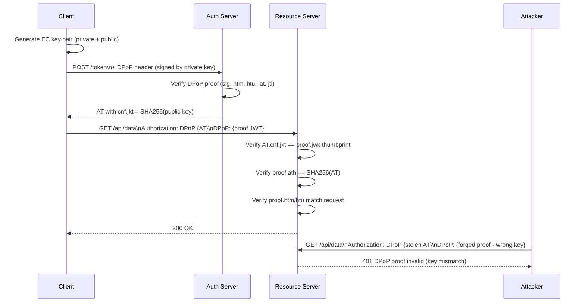

⚡ TL;DR - DPoP (Demonstrating Proof of Possession, RFC 9449)
upgrades bearer tokens to sender-constrained tokens: even if
an access token is stolen, it is useless without the private
key that was used to sign the DPoP proof JWT. The mechanism:
the client generates an asymmetric key pair; on every token
request and every API call, it signs a DPoP proof JWT (HTTP
method + URL + timestamp + nonce + access token hash). The
AS and RS verify the DPoP proof alongside the access token.
A stolen access token cannot be used from a different machine
because the attacker lacks the private key. DPoP is the modern
alternative to Mutual TLS (mTLS) for sender-binding - simpler
to deploy but with equivalent security guarantees.

---

### 🔥 The Problem This Solves

**THE BEARER TOKEN THEFT PROBLEM:**

Bearer tokens are like cash: whoever holds them can spend
them. If an access token is stolen (from localStorage, server
logs, network sniff after TLS termination at reverse proxy,
or memory dump), the attacker can use it from any machine
until it expires. Short token lifetimes (15 minutes) limit
the window but don't eliminate it. For high-value APIs
(banking, healthcare, financial services), this is
insufficient. DPoP binds the token to the specific client
that obtained it, making stolen tokens cryptographically
unusable.

---

### 📘 Textbook Definition

Demonstrating Proof-of-Possession at the Application Layer
(DPoP, RFC 9449) is a mechanism for sender-constraining OAuth
2.0 access tokens. It prevents token theft by binding the
access token to an asymmetric key pair that only the legitimate
client possesses.

**How it works:**

1. Client generates an asymmetric key pair (EC or RSA).

2. At token request: client sends a signed `DPoP` header
   (a JWT) containing: HTTP method (`htm`), token endpoint
   URL (`htu`), timestamp (`iat`), unique ID (`jti`), and
   the public key (`jwk` in the JWT header).

3. AS issues an access token with `cnf.jkt` claim =
   SHA-256 thumbprint of the DPoP public key.

4. At each API call: client sends the access token AND a new
   DPoP JWT signed with the same private key, containing:
   HTTP method, request URL, timestamp, jti, and
   `ath` = BASE64URL(SHA256(access_token)).

5. RS verifies: (a) DPoP JWT signature with public key from
   JWT header, (b) `cnf.jkt` in access token matches public
   key thumbprint, (c) `ath` matches the presented token,
   (d) `htm`/`htu` match the current request, (e) `iat` is
   fresh (within tolerance), (f) `jti` not seen before
   (replay prevention).

**Token type:** Access token issued with DPoP has
`token_type: DPoP` (not `Bearer`). RS must require DPoP
proof alongside the token.

---

### ⏱️ Understand It in 30 Seconds

**The sender-binding chain:**

```
CLIENT                 AS                    RS
  │                     │                     │
  │ Generate key pair   │                     │
  │ (private + public)  │                     │
  │                     │                     │
  │ POST /token         │                     │
  │   + DPoP proof JWT  │                     │
  │   (signed by priv)  │                     │
  │                     │ Verify DPoP proof   │
  │                     │ Issue AT with       │
  │  AT { cnf.jkt: key  │ cnf.jkt = pubkey    │
  │       thumbprint }  │ thumbprint          │
  │                     │                     │
  │ GET /api/data                             │
  │   Authorization: DPoP <AT>               │
  │   DPoP: <proof JWT signed by private key>│
  │                                Verify:   │
  │                                AT.cnf.jkt│
  │                                == proof  │
  │                                   pubkey │
  │                                200 OK    │

ATTACKER steals AT:
  Sends: Authorization: DPoP <stolen AT>
  Missing: valid DPoP proof (no private key)
  → RS rejects: 401 DPoP proof required / invalid
```

---

### ⚙️ How It Works (Mechanism)

```
┌──────────────────────────────────────────────────────────┐
│  DPOP PROOF JWT STRUCTURE                                 │
├──────────────────────────────────────────────────────────┤
│                                                           │
│  HEADER:                                                  │
│  {                                                        │
│    "typ": "dpop+jwt",                                     │
│    "alg": "ES256",                                        │
│    "jwk": {                                               │
│      "kty": "EC",                                         │
│      "crv": "P-256",                                      │
│      "x": "...", "y": "..."    ← Public key (no private!) │
│    }                                                      │
│  }                                                        │
│                                                           │
│  PAYLOAD (at token endpoint):                             │
│  {                                                        │
│    "jti": "e1c8c8a1-9d02-4d5e",  ← Unique ID (replay)    │
│    "htm": "POST",                ← HTTP method            │
│    "htu": "https://as.example.com/token",  ← URL          │
│    "iat": 1882996800             ← Timestamp (freshness)  │
│  }                                                        │
│                                                           │
│  PAYLOAD (at resource server):                            │
│  {                                                        │
│    "jti": "different-unique-id", ← New ID each request    │
│    "htm": "GET",                                          │
│    "htu": "https://api.example.com/contacts",             │
│    "iat": 1882996900,                                     │
│    "ath": "fUHyO2r2Z3DZ53EsNrWBb0xWXoaNy59IiKCAqksmQEo"  │
│          ← BASE64URL(SHA256(access_token))                │
│  }                                                        │
│                                                           │
│  SIGNATURE: ES256 with client's private key               │
│                                                           │
│  ACCESS TOKEN ISSUED BY AS:                               │
│  {                                                        │
│    "iss": "...", "sub": "...", "aud": "...",               │
│    "exp": ..., "iat": ...,                                │
│    "token_type": "DPoP",        ← NOT "Bearer"!           │
│    "cnf": {                                               │
│      "jkt": "SHA256_THUMBPRINT_OF_DPOP_PUBLIC_KEY"        │
│    }                                                      │
│  }                                                        │
└──────────────────────────────────────────────────────────┘
```



---

### 💻 Code Example

**Example 1 - BAD then GOOD: From Bearer to DPoP:**

```python
# BAD: Standard bearer token - stolen = usable by anyone

import requests

def call_api_bearer(access_token: str) -> dict:
    resp = requests.get(
        'https://api.example.com/contacts',
        headers={
            'Authorization': f'Bearer {access_token}',
            # WRONG: No proof of possession
            # Stolen token is fully usable from any machine
        }
    )
    resp.raise_for_status()
    return resp.json()
```

```python
# GOOD: DPoP sender-constrained request
# WHY: Access token bound to private key.
#   Stolen token requires private key to use → useless.

import time, uuid, hashlib, base64
from cryptography.hazmat.primitives.asymmetric import ec
import jwt  # PyJWT
import requests

class DPoPClient:
    """OAuth client using DPoP sender-constrained tokens."""

    def __init__(self):
        # Generate EC key pair at client startup
        # Private key stays in memory; never stored or sent
        self._private_key = ec.generate_private_key(
            ec.SECP256R1()   # P-256 (ES256)
        )
        self._public_key = self._private_key.public_key()
        self._public_jwk = self._build_public_jwk()

    def _build_public_jwk(self) -> dict:
        """Build public key as JWK (without private parts)."""
        key_size = (self._public_key.key_size + 7) // 8

        def to_base64url(n):
            return base64.urlsafe_b64encode(
                n.to_bytes(key_size, 'big')
            ).rstrip(b'=').decode()

        nums = self._public_key.public_numbers()
        return {
            "kty": "EC", "crv": "P-256",
            "x": to_base64url(nums.x),
            "y": to_base64url(nums.y),
        }

    def _create_dpop_proof(
        self,
        http_method: str,
        uri: str,
        access_token: str | None = None,
        nonce: str | None = None,
    ) -> str:
        """Create a signed DPoP proof JWT for one request."""
        payload = {
            "jti": str(uuid.uuid4()),
            "htm": http_method.upper(),
            "htu": uri,
            "iat": int(time.time()),
        }
        if access_token:
            token_bytes = access_token.encode('ascii')
            payload["ath"] = base64.urlsafe_b64encode(
                hashlib.sha256(token_bytes).digest()
            ).rstrip(b'=').decode()
        if nonce:
            payload["nonce"] = nonce

        return jwt.encode(
            payload, self._private_key, algorithm="ES256",
            headers={"typ": "dpop+jwt", "jwk": self._public_jwk}
        )

    def call_api(
        self,
        access_token: str,
        method: str,
        url: str,
        nonce: str | None = None,
    ) -> requests.Response:
        """Call API with DPoP-bound access token."""
        dpop_proof = self._create_dpop_proof(
            method, url, access_token, nonce
        )
        resp = getattr(requests, method.lower())(
            url,
            headers={
                "Authorization": f"DPoP {access_token}",
                "DPoP": dpop_proof,
            }
        )
        # Handle server nonce challenge
        if resp.status_code == 401:
            import re
            www = resp.headers.get('WWW-Authenticate', '')
            m = re.search(r'nonce="([^"]+)"', www)
            if m:
                return self.call_api(
                    access_token, method, url, nonce=m.group(1)
                )
        return resp
```

**Example 2 - RS: DPoP proof verification (critical checks):**

```python
# Resource Server: Verify DPoP proof on incoming requests

import hashlib, base64, time
from typing import Optional

_seen_jtis: set = set()  # Use Redis with TTL in production

def verify_dpop_request(
    authorization_header: str,  # "DPoP <access_token>"
    dpop_header: str,
    http_method: str,
    request_uri: str,
    clock_skew_seconds: int = 60,
) -> dict:
    """
    Verify DPoP-protected request per RFC 9449 §11.
    Returns access token claims on success.
    """
    if not authorization_header.startswith("DPoP "):
        raise DPoPValidationError("Expected token_type DPoP")
    access_token = authorization_header[5:]

    # Extract and verify DPoP proof
    dpop_headers = jwt.get_unverified_header(dpop_header)
    if dpop_headers.get("typ") != "dpop+jwt":
        raise DPoPValidationError("typ must be dpop+jwt")

    public_jwk = dpop_headers.get("jwk")
    if not public_jwk or "d" in public_jwk:
        raise DPoPValidationError("Invalid jwk in DPoP header")

    # Verify signature with embedded public key
    public_key = load_public_jwk(public_jwk)
    dpop_claims = jwt.decode(
        dpop_header, public_key, algorithms=["ES256"],
        options={"verify_exp": False}
    )

    # Validate htm/htu match this request
    if dpop_claims.get("htm") != http_method.upper():
        raise DPoPValidationError("htm mismatch")
    if dpop_claims.get("htu") != request_uri:
        raise DPoPValidationError("htu mismatch")

    # Validate iat freshness
    iat = dpop_claims.get("iat", 0)
    if abs(int(time.time()) - iat) > clock_skew_seconds:
        raise DPoPValidationError("DPoP proof stale")

    # Replay prevention via jti
    jti = dpop_claims.get("jti")
    if not jti or jti in _seen_jtis:
        raise DPoPValidationError("Replayed or missing jti")
    _seen_jtis.add(jti)

    # Validate ath binds proof to this specific access token
    expected_ath = base64.urlsafe_b64encode(
        hashlib.sha256(access_token.encode()).digest()
    ).rstrip(b'=').decode()
    if dpop_claims.get("ath") != expected_ath:
        raise DPoPValidationError("ath mismatch")

    # Validate access token cnf.jkt matches DPoP public key
    at_claims = validate_jwt_access_token(access_token)
    jkt = at_claims.get("cnf", {}).get("jkt")
    if not jkt:
        raise DPoPValidationError("AT missing cnf.jkt")
    if jkt != compute_jwk_thumbprint(public_jwk):
        raise DPoPValidationError("cnf.jkt key mismatch")

    return at_claims
```

---

### ⚖️ Comparison Table

| Mechanism | Stolen Token Risk | Deployment Complexity | Binding Mechanism |
|---|---|---|---|
| **Bearer (standard)** | High | Low | None |
| **DPoP** | None (private key required) | Medium | cnf.jkt in AT |
| **mTLS** | None (cert required) | High | cnf.x5t#S256 in AT |
| **DPoP + PKCE + short AT** | Negligible | Medium | Defense in depth |

---

### ⚠️ Common Misconceptions

| Misconception | Reality |
|---|---|
| DPoP eliminates the need for short token lifetimes | DPoP makes stolen tokens unusable without the private key, which is a stronger guarantee than short lifetimes alone. However, if the client device is fully compromised including private key extraction, short lifetimes still limit the window. Defense in depth: DPoP + short lifetimes. |
| DPoP key pairs should always be ephemeral | DPoP key pairs can be ephemeral (per session) or persistent (stored in Keychain/Android Keystore). Ephemeral: simpler, no key storage risk; but token cannot be refreshed after restart. Persistent: refresh tokens work; requires secure key storage. RFC 9449 allows both. |
| DPoP replaces PKCE | PKCE protects the authorization code from interception. DPoP protects the resulting access token from being stolen and reused. They solve different problems. Use both together: Auth Code + PKCE + DPoP is the current gold standard. |
| `jti` replay detection requires a distributed cache | For single-node: in-memory set is fine. For multi-node: Redis with TTL. TTL should be at least `clock_skew_tolerance * 2 + 1` seconds. Many deployments accept small replay risk with sticky sessions rather than paying distributed cache cost. |

---

### 🚨 Failure Modes & Diagnosis

**DPoP Nonce Requirement Not Handled**

**Symptom:**
DPoP requests return 401 with `WWW-Authenticate: DPoP
error="use_dpop_nonce"` after initial successful calls.
Application fails when the AS/RS starts requiring nonces.

**Root Cause:**
AS/RS can require a server-issued `nonce` in DPoP proofs
to prevent pre-computation attacks. If the `nonce` claim
is absent, the RS rejects the proof with `use_dpop_nonce`.

**Fix:**
Detect `use_dpop_nonce` error in 401 responses. Extract
`DPoP-Nonce` from the response header. Re-create the DPoP
proof including `"nonce": "<server_nonce>"` in the payload.
Cache the nonce per-AS/RS and include proactively on the
next request. Nonces are typically short-lived (minutes).

---

### 🔗 Related Keywords

**Prerequisites:**
- `Bearer Token` - what DPoP upgrades
- `JWT Access Tokens (RFC 9068)` - the cnf claim context

**Builds On:**
- `OAuth 2.0 Token Exchange (RFC 8693)` - DPoP in delegation
- `Pushed Authorization Requests (PAR)` - combined for maximum security

---

### 📌 Quick Reference Card

```
┌──────────────────────────────────────────────────────────┐
│ MECHANISM    │ Client key pair → sign DPoP proof per     │
│              │ request → AS binds AT to pub key (cnf.jkt)│
│              │ RS verifies: sig + cnf.jkt + ath + htm/htu│
├──────────────┼───────────────────────────────────────────┤
│ TOKEN TYPE   │ DPoP (not Bearer). AT has cnf.jkt claim.  │
├──────────────┼───────────────────────────────────────────┤
│ PROOF JWT    │ typ=dpop+jwt, jwk(pub), jti, htm, htu,    │
│ REQUIRED     │ iat, ath=SHA256(AT). New JWT per request. │
├──────────────┼───────────────────────────────────────────┤
│ RS CHECKS    │ 1. DPoP sig valid with embedded jwk        │
│              │ 2. cnf.jkt == SHA256(jwk)                 │
│              │ 3. ath == SHA256(AT)                       │
│              │ 4. htm/htu match request                  │
│              │ 5. iat fresh (±clock_skew)                │
│              │ 6. jti not replayed                       │
├──────────────┼───────────────────────────────────────────┤
│ ONE-LINER    │ "Private key signs every request. Stolen  │
│              │  AT useless without the key. cnf binds."  │
└──────────────────────────────────────────────────────────┘
```

**If you remember only 3 things:**

1. DPoP upgrades bearer to sender-constrained: AT has `cnf.jkt`
   binding it to the client's public key. Every API call
   requires a fresh DPoP proof JWT signed by the matching
   private key. Stolen token = useless without private key.

2. Each DPoP proof JWT is single-use (`jti` replay prevention),
   request-specific (`htm`+`htu`), fresh (`iat` within seconds),
   and bound to the AT (`ath` = SHA256 of access token).

3. Use DPoP for high-security APIs. Combine with Auth Code +
   PKCE and short AT lifetimes. DPoP is the modern alternative
   to mTLS - simpler to deploy, equivalent security guarantees.