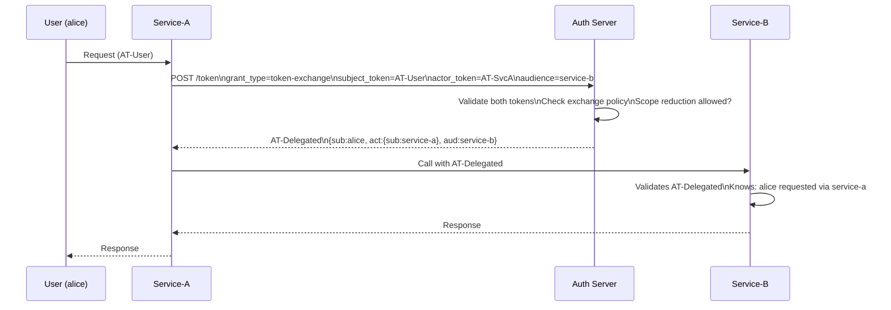

⚡ TL;DR - OAuth 2.0 Token Exchange (RFC 8693) standardizes
the exchange of one security token for another by introducing
`grant_type=urn:ietf:params:oauth:grant-type:token-exchange`.
Three key use cases: (1) Impersonation - Service A obtains a
token that acts as User X; (2) Delegation - Service A calls
Service B on behalf of User X while preserving user identity
in the token chain; (3) Workload Identity Federation - a
GitHub Actions OIDC token is exchanged for AWS STS credentials.
The new token carries `act` (actor) or `may_act` claims to
record the delegation chain for audit. Token exchange replaces
the anti-pattern of passing raw tokens between microservices
or storing user passwords in service accounts.

---

### 🔥 The Problem This Solves

**THE MICROSERVICE IDENTITY CHAIN PROBLEM:**

When Service A calls Service B on behalf of User X, how does
Service B know it is acting for User X - not just for Service A?
Pre-RFC 8693, common bad patterns: (1) Service A passes the
user's raw access token to Service B (token leakage, confused
deputy risk); (2) Service A re-authenticates as itself and
loses user context; (3) Service A re-issues tokens internally
without AS involvement (no audit trail). RFC 8693 gives the
AS a standardized protocol for controlled token exchange with
explicit delegation semantics and an auditable chain.

---

### 📘 Textbook Definition

OAuth 2.0 Token Exchange (RFC 8693) defines a protocol for
exchanging one security token (access token, ID token, SAML
assertion) for another through the token endpoint using the
`token-exchange` grant type.

**Request parameters:**
- `grant_type`: `urn:ietf:params:oauth:grant-type:token-exchange`
- `subject_token`: The incoming token being exchanged.
- `subject_token_type`: URN identifying the token type,
  e.g., `urn:ietf:params:oauth:token-type:access_token`.
- `requested_token_type`: What type to issue (optional;
  access_token or JWT is default).
- `actor_token`: Token of the principal acting on behalf of
  the subject (for delegation scenarios).
- `actor_token_type`: Type of the actor token.
- `scope`, `audience`, `resource`: Scope and audience
  restrictions for the new token.

**Response claims:**
- `issued_token_type`: Type of token issued.
- `access_token`: The new token.
- `act` claim: Records the actor in delegation scenarios:
  `{ "act": { "sub": "service-a" } }`.

**Two semantic modes:**
1. Impersonation: new token `sub` = original subject (user).
   Service acts as if it were the user.
2. Delegation: new token `sub` = original user, `act.sub` =
   service doing the acting. Auditable chain preserved.

---

### ⏱️ Understand It in 30 Seconds

**The three use cases:**

```
USE CASE 1: IMPERSONATION
  Service-A (admin) needs to act AS user@example.com.
  POST /token
    grant_type=token-exchange
    subject_token=<user AT>
    actor_token=<service-a AT>
    subject_token_type=access_token
  → New AT: sub=user@example.com (no act claim)
  → Service acts with user's identity directly

USE CASE 2: DELEGATION (preferred for microservices)
  User calls Service-A → Service-A calls Service-B
  Service-A wants to preserve user context:
  POST /token
    grant_type=token-exchange
    subject_token=<user AT>
    actor_token=<service-a AT>
  → New AT: sub=user@example.com, act.sub=service-a
  → Service-B knows: this is service-a acting FOR the user
  → Auditable delegation chain preserved

USE CASE 3: WORKLOAD IDENTITY FEDERATION
  GitHub Actions job has OIDC token from GitHub.
  Exchange it for AWS temporary credentials:
  POST https://sts.amazonaws.com/
    grant_type=token-exchange
    subject_token=<github-oidc-id-token>
    subject_token_type=urn:...:id_token
  → AWS STS returns: AccessKeyId, SecretAccessKey, Token
  → No static AWS credentials stored in GitHub secrets
```

---

### ⚙️ How It Works (Mechanism)

```
┌──────────────────────────────────────────────────────────┐
│  DELEGATION CHAIN: USER → SERVICE-A → SERVICE-B          │
├──────────────────────────────────────────────────────────┤
│                                                           │
│  1. User authenticates → AS issues AT-User               │
│     AT-User: { sub: "alice", scope: "read:orders" }      │
│                                                           │
│  2. User calls Service-A with AT-User.                    │
│     Service-A has its own AT (AT-SvcA, client credentials)│
│                                                           │
│  3. Service-A needs to call Service-B for user alice.     │
│     Service-A calls token exchange:                       │
│     POST /token                                           │
│       grant_type=...token-exchange                        │
│       subject_token=AT-User                               │
│       subject_token_type=...access_token                  │
│       actor_token=AT-SvcA                                 │
│       actor_token_type=...access_token                    │
│       audience=service-b                                  │
│       scope=read:orders                                   │
│                                                           │
│  4. AS validates:                                         │
│     - AT-User is valid and not expired                    │
│     - AT-SvcA is valid and service-a is allowed to        │
│       perform token exchange for AT-User's subject        │
│     - Requested scope subset of AT-User's scope           │
│     - Requested audience matches registered resource      │
│                                                           │
│  5. AS issues AT-Delegated:                               │
│     { sub: "alice",                    ← user preserved   │
│       act: { sub: "service-a" },       ← actor recorded  │
│       aud: "service-b",                                   │
│       scope: "read:orders" }                              │
│                                                           │
│  6. Service-A calls Service-B with AT-Delegated.          │
│     Service-B sees: alice's request, acted by service-a  │
│     Audit log: "alice → service-a → service-b"            │
└──────────────────────────────────────────────────────────┘
```



---

### 💻 Code Example

**Example 1 - BAD then GOOD: Microservice token forwarding:**

```python
# BAD: Forwarding the user's raw token to Service-B
# PROBLEM 1: Service-B sees an AT scoped for Service-A
#   (confused deputy - wrong audience)
# PROBLEM 2: User's token forwarded = more exposure surface
# PROBLEM 3: No audit trail of who is calling whom
# PROBLEM 4: AT may have broader scope than needed

import requests

def call_service_b_bad(
    user_access_token: str,  # Token issued to Service-A's client
    endpoint: str,
) -> dict:
    # WRONG: Forwarding user token directly to Service-B
    resp = requests.get(
        f"https://service-b.internal/{endpoint}",
        headers={"Authorization": f"Bearer {user_access_token}"}
    )
    resp.raise_for_status()
    return resp.json()
```

```python
# GOOD: Token Exchange for delegation
# WHY: AS issues a new token with:
#   - Correct audience (service-b)
#   - Minimal scope (just what's needed)
#   - act claim preserving delegation chain
#   - AS enforces exchange policy (not all services can
#     exchange tokens for all other services)

import requests

TOKEN_ENDPOINT = "https://as.example.com/token"
CLIENT_ID = "service-a"
CLIENT_SECRET = "..."

TOKEN_TYPE_AT = (
    "urn:ietf:params:oauth:token-type:access_token"
)

def exchange_token_for_service_b(
    user_access_token: str,   # Subject token (the user)
    service_a_token: str,     # Actor token (this service)
    required_scope: str = "read:orders",
) -> str:
    """
    Exchange user AT for a delegation AT targeting service-b.
    Returns the new delegated access token.
    """
    grant_type = (
        "urn:ietf:params:oauth:grant-type:token-exchange"
    )
    resp = requests.post(TOKEN_ENDPOINT, data={
        "grant_type": grant_type,
        "subject_token": user_access_token,
        "subject_token_type": TOKEN_TYPE_AT,
        "actor_token": service_a_token,
        "actor_token_type": TOKEN_TYPE_AT,
        "audience": "service-b",
        "scope": required_scope,
    }, auth=(CLIENT_ID, CLIENT_SECRET))

    if resp.status_code != 200:
        raise TokenExchangeError(
            f"Token exchange failed: {resp.json()}"
        )

    token_data = resp.json()
    # token_data["issued_token_type"] should be
    # urn:ietf:params:oauth:token-type:access_token
    return token_data["access_token"]

def call_service_b(
    user_access_token: str,
    service_a_token: str,
    endpoint: str,
) -> dict:
    delegated_token = exchange_token_for_service_b(
        user_access_token, service_a_token
    )
    resp = requests.get(
        f"https://service-b.internal/{endpoint}",
        headers={"Authorization": f"Bearer {delegated_token}"}
        # Service-B receives AT with:
        # sub=alice (user preserved)
        # act.sub=service-a (delegation chain recorded)
        # aud=service-b (correct audience)
        # scope=read:orders (minimal, not all of alice's scopes)
    )
    resp.raise_for_status()
    return resp.json()
```

**Example 2 - Workload Identity Federation (GitHub Actions to AWS):**

```yaml
# GitHub Actions workflow: exchange GitHub OIDC for AWS creds
# NO static AWS_ACCESS_KEY_ID in repository secrets

name: Deploy to AWS
on: [push]
permissions:
  id-token: write  # Required to get GitHub OIDC token
  contents: read

jobs:
  deploy:
    runs-on: ubuntu-latest
    steps:
      - uses: actions/checkout@v4

      # This action performs token exchange:
      # 1. Gets GitHub OIDC ID token for the job
      # 2. POSTs to AWS STS AssumeRoleWithWebIdentity
      #    (which is OAuth 2.0 Token Exchange semantics)
      # 3. Receives temporary AWS credentials
      - name: Configure AWS credentials
        uses: aws-actions/configure-aws-credentials@v4
        with:
          role-to-assume: arn:aws:iam::123456789012:role/GHActions
          aws-region: us-east-1
          # role-session-name: defaults to actor@ref
          # No static credentials - uses OIDC token exchange!

      - name: Deploy
        run: |
          aws s3 cp dist/ s3://my-bucket/ --recursive
```

```python
# What happens under the hood (Python equivalent):
import boto3, requests

def get_aws_creds_via_oidc(
    github_oidc_token: str,   # From $ACTIONS_ID_TOKEN_REQUEST
    role_arn: str,
) -> dict:
    """
    Manually do what configure-aws-credentials does:
    Exchange GitHub OIDC token for temporary AWS credentials.
    This is OAuth 2.0 Token Exchange (RFC 8693 semantics)
    via AWS STS AssumeRoleWithWebIdentity.
    """
    sts = boto3.client('sts')
    response = sts.assume_role_with_web_identity(
        RoleArn=role_arn,
        RoleSessionName="github-actions-session",
        WebIdentityToken=github_oidc_token,
        # STS validates: token issuer = token.github.com
        # STS validates: audience matches your configured trust
        # Returns: temporary credentials (15min - 12h)
    )
    return response['Credentials']
    # {AccessKeyId, SecretAccessKey, SessionToken, Expiration}
```

---

### ⚖️ Comparison Table

| Pattern | Audit Trail | Scope Control | AS Enforcement | Recommended |
|---|---|---|---|---|
| **Forward raw user AT** | None | None (full user scope) | None | Never |
| **Service calls AS for new AT (client creds)** | Loses user context | Controlled | Yes | Low-sensitivity only |
| **Token Exchange (delegation)** | Full chain (act claim) | Yes (scope reduction) | Yes (exchange policy) | Yes - microservices |
| **Token Exchange (impersonation)** | Partial (no act) | Yes | Yes | Admin-only use cases |

---

### ⚠️ Common Misconceptions

| Misconception | Reality |
|---|---|
| Token exchange is just AS-side token forwarding | The AS actively enforces an exchange policy: not all clients can exchange tokens for any resource. The AS validates both the subject_token (the user's token) and the actor_token (the requesting service's identity), checks that the scope requested is a subset of the subject's scope, and can restrict which services can exchange which tokens for which audiences. This is controlled delegation, not transparent forwarding. |
| `act` claim in impersonation mode contains the actor | In impersonation mode, there is NO `act` claim. The `sub` is set to the original subject (user), and the service's identity is effectively invisible in the resulting token. In delegation mode, `act.sub` contains the actor's identity while `sub` remains the user. Use delegation when you need an audit trail; use impersonation only when the service genuinely needs to act as the user without the system knowing it is a service. |
| Token exchange only works with access tokens | RFC 8693 supports exchanging any security token: access tokens, ID tokens, SAML 1.1 assertions, SAML 2.0 assertions, and JWT tokens. The `subject_token_type` URN specifies what type is being submitted. Workload Identity Federation frequently exchanges OIDC ID tokens for access tokens with the target system (AWS, GCP, Azure). |
| You need RFC 8693 for simple service-to-service calls | If Service A calls Service B with NO user context (pure machine-to-machine), use client credentials grant (OAU-023). Token exchange is specifically for scenarios where user context needs to be preserved and forwarded across service boundaries. Don't add token exchange complexity where client credentials suffice. |

---

### 🚨 Failure Modes & Diagnosis

**Delegation Loop in Token Exchange**

**Symptom:**
Service calls form a cycle (A → B → C → A) and each leg
calls the token endpoint for delegation. This causes
unexpected latency spikes and AS rate limiting on the
token endpoint at the innermost service.

**Diagnostic:**

```python
# Detect delegation depth before requesting exchange
# RFC 8693 does not specify max delegation depth,
# but AS may enforce it; you should too

import jwt as pyjwt

def get_delegation_depth(access_token: str) -> int:
    """Count delegation hops in the act claim chain."""
    claims = pyjwt.decode(
        access_token, options={"verify_signature": False}
    )
    depth = 0
    act = claims.get("act")
    while act:
        depth += 1
        act = act.get("act")  # Nested act chains
    return depth

MAX_DELEGATION_DEPTH = 3

def safe_token_exchange(
    user_token: str,
    service_token: str,
    audience: str,
) -> str:
    if get_delegation_depth(user_token) >= MAX_DELEGATION_DEPTH:
        raise DelegationDepthError(
            f"Max delegation depth {MAX_DELEGATION_DEPTH} reached"
        )
    return exchange_token_for_audience(
        user_token, service_token, audience
    )
```

**Fix:**
Enforce a max delegation depth (typically 3-5 hops) both
at the AS (if configurable) and in the client before
requesting exchange. Cache delegated tokens per
(user_token_jti, target_audience) pair to avoid re-exchanging
on every downstream call within the same request context.

---

### 🔗 Related Keywords

**Prerequisites:**
- `Client Credentials Grant` - pure service-to-service (no user context)
- `JWT Access Tokens (RFC 9068)` - the act claim structure

**Builds On:**
- `Pushed Authorization Requests (PAR)` - PAR + Token Exchange combined
- `DPoP (RFC 9449)` - sender-constrained delegation tokens

---

### 📌 Quick Reference Card

```
┌──────────────────────────────────────────────────────────┐
│ GRANT TYPE   │ urn:ietf:params:oauth:grant-type:         │
│              │   token-exchange                          │
├──────────────┼───────────────────────────────────────────┤
│ KEY PARAMS   │ subject_token (user AT)                   │
│              │ actor_token (service AT)                  │
│              │ audience (target service)                 │
│              │ scope (subset of user's scope)            │
├──────────────┼───────────────────────────────────────────┤
│ IMPERSONATE  │ sub=user, NO act claim                    │
│              │ Service acts AS user - audit trail lost   │
├──────────────┼───────────────────────────────────────────┤
│ DELEGATION   │ sub=user, act.sub=service                 │
│              │ Service acts FOR user - chain preserved   │
├──────────────┼───────────────────────────────────────────┤
│ WORKLOAD     │ GitHub OIDC → AWS STS → temp credentials  │
│ FEDERATION   │ No static cloud credentials required      │
├──────────────┼───────────────────────────────────────────┤
│ ONE-LINER    │ "Exchange any token for any token with    │
│              │  AS-enforced policy and act claim chain." │
└──────────────────────────────────────────────────────────┘
```

**If you remember only 3 things:**

1. Token Exchange preserves user identity across microservice
   hops. Delegation mode (`act` claim) keeps the full chain
   auditable: `sub=alice, act.sub=service-a` means service-a
   is acting on behalf of alice.

2. Three use cases: delegation (microservices), impersonation
   (admin), workload identity federation (CI/CD tokens exchanged
   for cloud credentials). Each uses the same grant type.

3. Never forward raw user tokens between services. Use token
   exchange so the AS enforces scope reduction, audience
   restriction, and exchange policy. The AS is the control
   plane for cross-service identity.