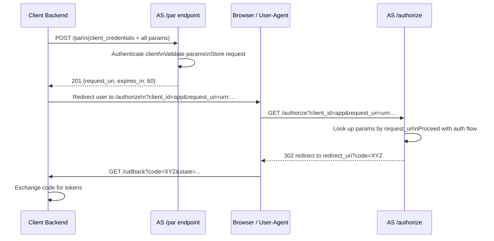

⚡ TL;DR - Pushed Authorization Requests (PAR, RFC 9126)
inverts the authorization flow: instead of the client
including all auth parameters in the browser redirect URL
(which is logged in browser history, proxy logs, and
accessible to JavaScript), the client POSTs the parameters
to the AS's `/par` endpoint first. The AS returns an opaque
`request_uri`, and only that URI appears in the browser
redirect URL. Benefits: (1) parameters never travel through
the browser, (2) AS validates client identity before user
redirection, (3) large or confidential parameters (JAR, RAR,
DPoP) are submitted server-to-server. PAR is required by
FAPI 2.0 and strongly recommended for any high-security
OAuth deployment where parameter integrity matters.

---

### 🔥 The Problem This Solves

**THE AUTHORIZATION REQUEST EXPOSURE PROBLEM:**

Traditional OAuth flows have all authorization parameters
in the redirect URL:
`GET /authorize?client_id=app&scope=openid+read:accounts
&redirect_uri=https://app.com/callback&state=xyz&
code_challenge=abc123&response_type=code`

This URL goes through: the browser URL bar, browser history,
proxy access logs, CDN edge logs, any JavaScript on the page
that reads `document.referrer`, and any `Referer` headers
sent to subresources. For long request parameters (JAR, Rich
Authorization Requests), URL length limits become a real
constraint. PAR moves all parameters off the URL and onto a
server-to-server channel.

---

### 📘 Textbook Definition

Pushed Authorization Requests (PAR, RFC 9126) is a mechanism
that allows OAuth clients to push the authorization request
payload to the authorization server prior to initiating
the authorization flow, receiving in return a `request_uri`
that is then used in the browser redirect.

**Flow:**
1. Client authenticates to AS and POSTs all authorization
   request parameters to the `/par` endpoint.
2. AS validates client authentication and parameters.
3. AS returns `request_uri` (opaque reference, URN format)
   and `expires_in` (typically 60 seconds).
4. Client redirects user to:
   `GET /authorize?client_id=...&request_uri=urn:...`
5. AS looks up the stored parameters from the `request_uri`
   and proceeds with the authorization flow.
6. Authorization code is delivered to the `redirect_uri`
   that was submitted in step 1 (not the browser URL).

**Security properties:**
- Client is authenticated BEFORE user is redirected.
- Parameters are pre-validated (errors caught before UX).
- `redirect_uri` binding: enforced at PAR endpoint,
  not at redirect.
- `request_uri` is single-use and short-lived (60 seconds
  default; AS MAY extend).
- Works with JAR (JWT-Secured Authorization Requests) for
  signed/encrypted request objects.

---

### ⏱️ Understand It in 30 Seconds

**Traditional vs PAR flow:**

```
TRADITIONAL OAUTH (parameters in browser URL):
  Client → Browser redirect with ALL parameters in URL:
  GET /authorize?
    client_id=app&response_type=code
    &scope=openid+read:accounts
    &redirect_uri=https://app.com/callback
    &state=secureRandom&code_challenge=abc
    &code_challenge_method=S256
  Problem: this URL is in browser history, proxy logs,
           Referer headers to any page scripts/resources

PAR FLOW (parameters off-URL):
  Step 1: Client → AS (server-to-server, with client auth):
    POST /par
    Authorization: Basic base64(client_id:client_secret)
    Body: response_type=code&scope=openid+read:accounts
          &redirect_uri=https://app.com/callback
          &state=secureRandom&code_challenge=abc
          &code_challenge_method=S256
    AS validates: client auth, redirect_uri, params
    ← 201: {request_uri: "urn:ietf:params:oauth:...", expires_in: 60}

  Step 2: Client → Browser redirect (minimal URL):
    GET /authorize?
      client_id=app
      &request_uri=urn:ietf:params:oauth:request_uri:abc123
    Only client_id + opaque request_uri in browser URL

  Browser URL is clean: no scope, no redirect_uri,
  no state, no code_challenge visible in history/logs
```

---

### ⚙️ How It Works (Mechanism)

```
┌──────────────────────────────────────────────────────────┐
│  PAR PROTOCOL FLOW                                        │
├──────────────────────────────────────────────────────────┤
│                                                           │
│  CLIENT         AS (PAR endpoint)      BROWSER           │
│    │                   │                  │               │
│    │ POST /par          │                  │               │
│    │ (with client auth) │                  │               │
│    │ Params: scope,     │                  │               │
│    │  redirect_uri,     │                  │               │
│    │  state, PKCE,      │                  │               │
│    │  response_type     │                  │               │
│    │───────────────────→│                  │               │
│    │                   │ Validate:         │               │
│    │                   │ - Client auth OK  │               │
│    │                   │ - redirect_uri OK │               │
│    │                   │ - Params valid    │               │
│    │                   │ Store params      │               │
│    │                   │ Generate request_ │               │
│    │                   │ uri + expiry      │               │
│    │←──────────────────│                  │               │
│    │ 201: {            │                  │               │
│    │   request_uri:    │                  │               │
│    │   "urn:...:abc123"│                  │               │
│    │   expires_in: 60  │                  │               │
│    │ }                 │                  │               │
│    │                   │                  │               │
│    │ Redirect user to /authorize          │               │
│    │────────────────────────────────────→ │               │
│    │  GET /authorize?client_id=app        │               │
│    │     &request_uri=urn:...:abc123      │               │
│    │                   │←─────────────────│               │
│    │                   │ Look up stored   │               │
│    │                   │ params for abc123│               │
│    │                   │ Proceed with     │               │
│    │                   │ auth flow as     │               │
│    │                   │ normal           │               │
│    │                   │─────────────────→│               │
│    │                   │  302 /callback   │               │
│    │                   │     ?code=XYZ    │               │
└──────────────────────────────────────────────────────────┘
```



---

### 💻 Code Example

**Example 1 - BAD then GOOD: Traditional vs PAR initiation:**

```python
# BAD: Traditional OAuth redirect (parameters in URL)
# All sensitive params are in browser history, proxy logs

from flask import redirect, session
import secrets, hashlib, base64

@app.route('/login')
def login_bad():
    state = secrets.token_urlsafe(32)
    code_verifier = secrets.token_urlsafe(64)
    session['oauth_state'] = state
    session['code_verifier'] = code_verifier

    code_challenge = base64.urlsafe_b64encode(
        hashlib.sha256(code_verifier.encode()).digest()
    ).rstrip(b'=').decode()

    # WRONG: All parameters exposed in browser URL
    # These end up in browser history, proxy logs, Referer
    params = (
        "response_type=code"
        "&client_id=myapp"
        f"&scope=openid+read%3Aaccounts"
        f"&redirect_uri=https%3A%2F%2Fapp.example.com%2Fcallback"
        f"&state={state}"
        f"&code_challenge={code_challenge}"
        "&code_challenge_method=S256"
    )
    return redirect(
        f"https://as.example.com/authorize?{params}"
    )
```

```python
# GOOD: PAR - parameters pushed server-to-server first
# WHY: Params never appear in browser URL/history/logs.
#   AS validates client identity before user redirection.
#   Errors surface before user sees anything.

import requests, secrets, hashlib, base64
from flask import redirect, session, abort
from urllib.parse import urlencode

PAR_ENDPOINT = "https://as.example.com/par"
AUTHORIZE_ENDPOINT = "https://as.example.com/authorize"
CLIENT_ID = "myapp"
CLIENT_SECRET = "..."

@app.route('/login')
def login_with_par():
    state = secrets.token_urlsafe(32)
    code_verifier = secrets.token_urlsafe(64)
    session['oauth_state'] = state
    session['code_verifier'] = code_verifier

    code_challenge = base64.urlsafe_b64encode(
        hashlib.sha256(code_verifier.encode()).digest()
    ).rstrip(b'=').decode()

    # Step 1: Push authorization request to AS
    # This is server-to-server with client authentication
    par_response = requests.post(
        PAR_ENDPOINT,
        data={
            "response_type": "code",
            "client_id": CLIENT_ID,
            "scope": "openid read:accounts",
            "redirect_uri": (
                "https://app.example.com/callback"
            ),
            "state": state,
            "code_challenge": code_challenge,
            "code_challenge_method": "S256",
            # Additional params that would be too long in URL:
            # "authorization_details": json.dumps([...]),
        },
        auth=(CLIENT_ID, CLIENT_SECRET),
        # mTLS would also go here for FAPI 2.0
    )

    if par_response.status_code != 201:
        # Error caught BEFORE user redirect - handle cleanly
        error = par_response.json()
        app.logger.error(
            f"PAR failed: {error.get('error')}: "
            f"{error.get('error_description')}"
        )
        abort(500, "Authorization initialization failed")

    par_data = par_response.json()
    request_uri = par_data["request_uri"]
    # expires_in: typically 60 seconds
    # Must redirect user before expiry

    # Step 2: Redirect user with ONLY request_uri (clean URL)
    auth_params = urlencode({
        "client_id": CLIENT_ID,
        "request_uri": request_uri,
        # No scope, no redirect_uri, no state in browser URL
    })
    return redirect(f"{AUTHORIZE_ENDPOINT}?{auth_params}")
```

**Example 2 - Spring Security with PAR (OAuth2 client):**

```java
// Spring Security 6 PAR configuration
// Spring Authorization Server supports PAR natively

@Configuration
@EnableWebSecurity
public class SecurityConfig {

    @Bean
    public SecurityFilterChain filterChain(
        HttpSecurity http,
        ClientRegistrationRepository repo
    ) throws Exception {
        http
            .oauth2Login(oauth2 -> oauth2
                .authorizationEndpoint(endpoint -> endpoint
                    // PAR is configured per ClientRegistration
                    // Set pushed-authorization-request-uri in
                    // the registration metadata
                    .authorizationRequestResolver(
                        parRequestResolver(repo)
                    )
                )
            );
        return http.build();
    }

    @Bean
    public OAuth2AuthorizationRequestResolver parRequestResolver(
        ClientRegistrationRepository repo
    ) {
        // DefaultOAuth2AuthorizationRequestResolver with
        // PAR support - Spring Security 6.3+
        var resolver =
            new DefaultOAuth2AuthorizationRequestResolver(
                repo,
                OAuth2AuthorizationRequestRedirectFilter
                    .DEFAULT_AUTHORIZATION_REQUEST_BASE_URI
            );
        // Enable PAR: pushes params to /par before redirect
        resolver.setAuthorizationRequestCustomizer(
            OAuth2AuthorizationRequestCustomizers.withPkce()
        );
        return resolver;
    }
}
```

```yaml
# application.yml: PAR-enabled client registration
spring:
  security:
    oauth2:
      client:
        registration:
          myapp:
            client-id: myapp
            client-secret: ${CLIENT_SECRET}
            authorization-grant-type: authorization_code
            redirect-uri: https://app.example.com/callback
            scope:
              - openid
              - read:accounts
        provider:
          myas:
            issuer-uri: https://as.example.com
            # PAR endpoint discovered from OIDC metadata:
            # pushed_authorization_request_endpoint
```

---

### ⚖️ Comparison Table

| Approach | Params in Browser URL | Client Auth Before Redirect | URL Length Limit | Standard |
|---|---|---|---|---|
| **Standard Auth Code** | Yes (all params) | No | ~2048 chars | RFC 6749 |
| **Auth Code + JAR** | No (signed JWT in URL) | No | Moderate | RFC 9101 |
| **PAR** | No (request_uri only) | Yes (at /par) | None (POST body) | RFC 9126 |
| **PAR + JAR** | No | Yes | None | RFC 9126 + RFC 9101 |
| **PAR + mTLS + DPoP** | No | Yes (mTLS) | None | FAPI 2.0 |

---

### ⚠️ Common Misconceptions

| Misconception | Reality |
|---|---|
| PAR replaces PKCE | PAR and PKCE are complementary. PKCE prevents authorization code interception by binding the code to a secret only the legitimate client knows. PAR prevents authorization request parameter exposure. FAPI 2.0 requires both. Using PAR without PKCE still leaves code interception as a threat; using PKCE without PAR still exposes auth params in the browser URL. |
| The `request_uri` is sensitive and should be protected | The `request_uri` is an opaque reference with 60 seconds TTL and is single-use. An attacker who intercepts the `request_uri` (from browser history or proxy logs) would still need to be in the user's browser to follow the authorization flow. The actual sensitive parameters (redirect_uri, scope, state, PKCE challenge) were submitted server-to-server and never appear in the URL. The `request_uri` is still better in the browser URL than full parameters. |
| PAR requires client secret and is only for confidential clients | RFC 9126 supports PAR for both public and confidential clients. Public clients (SPAs, mobile apps) can use PAR authenticated with PKCE only (no client_secret) - though many AS implementations require at least one form of client authentication. The security benefit for public clients is primarily the parameter integrity guarantee and pre-validation, not client authentication (which doesn't exist for public clients). |
| PAR is only used in financial/government APIs | PAR is increasingly adopted broadly as a security best practice. FAPI 2.0 requires it for financial APIs, but the Open ID Foundation recommends it for any OAuth deployment where parameter integrity matters. Spring Authorization Server supports it natively. Keycloak, Auth0, and Okta all support PAR. Adoption is growing across all industries. |

---

### 🚨 Failure Modes & Diagnosis

**`request_uri` Expired Before User Authenticates**

**Symptom:**
Users occasionally see an error during authentication that
references `invalid_request_uri` or `expired_request_uri`.
This happens more often on slow connections or when users
take time at the login screen.

**Root Cause:**
The `request_uri` returned by the PAR endpoint has a short
TTL (default: 60 seconds per RFC 9126). If the user hasn't
completed authentication before the TTL expires, the AS
rejects the `request_uri` on the `/authorize` call (or at
any point before code issuance when it looks it up).

**Diagnostic:**

```python
# Check what expires_in value the AS returns in PAR response
par_response = requests.post(PAR_ENDPOINT, data=params, ...)
par_data = par_response.json()
print(f"PAR expires_in: {par_data.get('expires_in')} seconds")
# If it's 60s and your auth page takes >60s (MFA, 2FA setup,
# consent screen with many permissions), users will hit this.
```

**Fix:**
1. Check the AS documentation/configuration: some AS allow
   configuring longer PAR TTLs (120-300 seconds). Request
   longer TTL if supported.
2. If the TTL cannot be extended: re-initiate PAR when the
   error is detected (retry the full PAR → redirect flow).
3. For MFA-heavy flows: pre-fetch the PAR request_uri as
   late as possible before the redirect, not at page load.
4. For AS that expose `expires_in`: monitor this metric and
   alert if PAR expiry errors exceed 0.1% of auth attempts.

---

### 🔗 Related Keywords

**Prerequisites:**
- `Authorization Code Flow` - the flow PAR enhances
- `PKCE` - used alongside PAR for code protection

**Builds On:**
- `JWT Secured Authorization Request (JAR)` - combined with PAR
- `FAPI 2.0` - requires PAR + mTLS or DPoP

---

### 📌 Quick Reference Card

```
┌──────────────────────────────────────────────────────────┐
│ FLOW         │ POST /par (server-to-server, client auth) │
│              │ → request_uri (60s TTL, single-use)       │
│              │ → GET /authorize?client_id=&request_uri=  │
├──────────────┼───────────────────────────────────────────┤
│ KEY BENEFIT  │ Params never in browser URL or history    │
│              │ AS validates client BEFORE user redirect  │
├──────────────┼───────────────────────────────────────────┤
│ ERROR        │ Errors surface at POST /par (pre-UX)      │
│ HANDLING     │ Not mid-redirect after user sees screen   │
├──────────────┼───────────────────────────────────────────┤
│ FAPI 2.0     │ PAR is required (not optional)            │
│              │ Combined with mTLS or DPoP + private_key_ │
│              │ jwt client authentication                 │
├──────────────┼───────────────────────────────────────────┤
│ REQUEST_URI  │ urn:ietf:params:oauth:request_uri:<uuid>  │
│ FORMAT       │ Short-lived (60s), single-use reference   │
├──────────────┼───────────────────────────────────────────┤
│ ONE-LINER    │ "POST params first, redirect only ref_uri │
│              │  = params off URL, client auth pre-UX."  │
└──────────────────────────────────────────────────────────┘
```

**If you remember only 3 things:**

1. PAR sends authorization parameters via POST to `/par`
   server-to-server before the browser redirect. The browser
   only sees an opaque `request_uri` in the URL - never scope,
   redirect_uri, state, or PKCE challenge.

2. PAR authenticates the client at the `/par` step, before
   the user is involved. This means the AS can reject invalid
   configurations, wrong redirect URIs, or unauthorized
   clients immediately - not after user authentication.

3. PAR is required by FAPI 2.0 (financial APIs, open banking).
   Combine with PKCE (code protection), JAR (signed request
   objects), and DPoP/mTLS (sender binding) for high-security
   OAuth deployments.