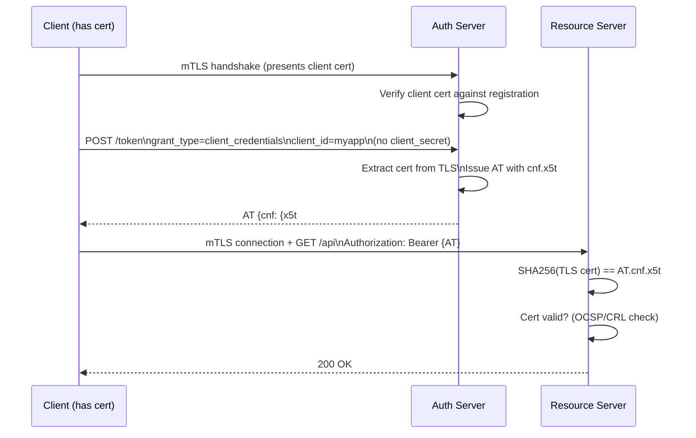

⚡ TL;DR - Mutual TLS for OAuth (RFC 8705) provides two
capabilities: (1) Client authentication using a TLS client
certificate instead of a client_secret or private_key_jwt -
the client presents a certificate at the token endpoint TLS
handshake; (2) Certificate-bound access tokens - the AS
embeds the certificate's SHA-256 thumbprint in the access
token's `cnf.x5t#S256` claim, binding the token to the
client's certificate so stolen tokens are unusable without
the matching private key. mTLS is the mandatory client
authentication method in FAPI 1.0 and one of two options
in FAPI 2.0 (alongside `private_key_jwt`). In zero-trust
architectures, mTLS provides workload identity at the TLS
layer rather than in application-layer credentials.

---

### 🔥 The Problem This Solves

**CLIENT AUTHENTICATION BEYOND SHARED SECRETS:**

`client_secret_basic` and `client_secret_post` use a shared
secret for client authentication. Shared secrets have known
weaknesses: they can be brute-forced if weak, leaked from
deployment pipelines, stored insecurely, or phished from
developers. They are also symmetric - the AS and client both
hold the secret, so compromise at either end exposes it.
mTLS and `private_key_jwt` are asymmetric alternatives where
the client proves possession of a private key without
revealing it. mTLS additionally provides transport-layer
security with certificate revocation (CRL/OCSP) as a
real-time revocation mechanism.

---

### 📘 Textbook Definition

RFC 8705 defines two mechanisms:

**Mechanism 1 - mTLS Client Authentication:**
The client presents a TLS client certificate at the token
endpoint TLS handshake. The AS extracts the certificate
and validates it as client authentication. Two sub-methods:
- PKI-based mTLS: AS validates certificate against a trusted
  CA. The `client_id` must correspond to a registered
  certificate (by issuer+serial or subject DN).
- Self-signed certificate mTLS: The client registers a
  specific certificate (by SHA-256 thumbprint) with the AS.
  No CA trust required; AS validates the thumbprint directly.

**Mechanism 2 - Certificate-Bound Access Tokens:**
When the AS issues an access token to a mTLS-authenticated
client, it can bind the token to the client's certificate:
`cnf: { "x5t#S256": "SHA256_THUMBPRINT_OF_CERT" }`
The RS extracts the client's certificate from the TLS
connection and verifies it matches the `cnf.x5t#S256` claim
in the access token. A stolen token is useless without the
private key corresponding to the certificate.

**Token endpoint client metadata:**
```
token_endpoint_auth_method: tls_client_auth
  (PKI-based)
token_endpoint_auth_method: self_signed_tls_client_auth
  (self-signed cert)
```

---

### ⏱️ Understand It in 30 Seconds

**The two mTLS modes:**

```
MODE 1: CLIENT AUTHENTICATION (replaces client_secret)
  Normal TLS: Client authenticates server only
  mTLS: Client also authenticates to server with cert

  Client cert sent during TLS handshake to /token endpoint.
  AS validates: cert is registered for this client_id.
  If valid: client is authenticated (no client_secret needed).

  PKI: cert validated against trusted CA (like HTTPS)
  Self-signed: cert thumbprint registered in AS for client_id

MODE 2: CERTIFICATE-BOUND ACCESS TOKENS
  AT includes: cnf.x5t#S256 = SHA256(client cert)
  RS receives: AT + client cert (from mTLS connection)
  RS validates: SHA256(cert from TLS) == AT.cnf.x5t#S256
  Stolen AT without the cert = 401 (binding mismatch)

COMBINED (FAPI):
  1. mTLS handshake to /token: client authenticated
  2. AS issues AT bound to cert thumbprint
  3. Client calls RS with mTLS connection
  4. RS verifies: AT binding matches connection cert
  → Strongest sender-binding without extra headers
  → Transport + application layer are both secured
```

---

### ⚙️ How It Works (Mechanism)

```
┌──────────────────────────────────────────────────────────┐
│  MTLS CLIENT AUTH + CERT-BOUND TOKEN FLOW                 │
├──────────────────────────────────────────────────────────┤
│                                                           │
│  CLIENT                    AS (/token)                    │
│    │                          │                           │
│    │ TLS ClientHello          │                           │
│    │─────────────────────────→│                           │
│    │          TLS ServerHello │                           │
│    │          + server cert   │                           │
│    │←─────────────────────────│                           │
│    │ Client cert              │                           │
│    │─────────────────────────→│                           │
│    │          TLS established │                           │
│    │          (mTLS handshake)│                           │
│    │                          │                           │
│    │ POST /token              │                           │
│    │   grant_type=client_     │                           │
│    │    credentials           │                           │
│    │   client_id=myapp        │                           │
│    │   (no client_secret!)    │                           │
│    │─────────────────────────→│                           │
│    │                          │ AS extracts cert from TLS │
│    │                          │ Validates cert for myapp  │
│    │                          │ (PKI or thumbprint match) │
│    │                          │ Issues AT with:           │
│    │                          │ cnf.x5t#S256 =            │
│    │                          │   SHA256(client_cert)     │
│    │←─────────────────────────│                           │
│    │ AT (bound to cert)       │                           │
│    │                          │                           │
│    │ RESOURCE SERVER CALL:                                │
│    │ mTLS connection to RS                                │
│    │   Authorization: Bearer <AT>                         │
│    │   + TLS client cert (same as used at AS)             │
│    │                          │                           │
│    │ RS validates:            │                           │
│    │   SHA256(TLS cert) == AT.cnf.x5t#S256                │
│    │   cert is valid (not revoked, not expired)           │
│    │   AT is valid (sig, exp, aud, scope)                 │
│    │   → 200 OK               │                           │
└──────────────────────────────────────────────────────────┘
```



---

### 💻 Code Example

**Example 1 - BAD then GOOD: Client authentication method:**

```python
# BAD: client_secret_post - shared secret in POST body
# Problem: secret lives in env var, config files, pipelines
# Problem: symmetric - AS also stores the secret

import requests

def get_token_bad(client_secret: str) -> dict:
    resp = requests.post(
        'https://as.example.com/token',
        data={
            'grant_type': 'client_credentials',
            'client_id': 'myservice',
            'client_secret': client_secret,  # SHARED SECRET
            'scope': 'read:data',
        }
    )
    resp.raise_for_status()
    return resp.json()
```

```python
# GOOD: mTLS client authentication - no shared secret
# WHY: Private key never leaves client; AS only stores cert.
#   Certificate can be revoked (CRL/OCSP) in real time.
#   For self-signed: AS stores thumbprint only (not the key).

import requests

def get_token_mtls(
    cert_path: str,   # Client certificate (PEM)
    key_path: str,    # Client private key (PEM)
) -> dict:
    """
    Authenticate to token endpoint via mTLS.
    No client_secret in the request body.
    The TLS handshake carries the client certificate.
    """
    resp = requests.post(
        'https://as.example.com/token',
        data={
            'grant_type': 'client_credentials',
            'client_id': 'myservice',
            # Note: NO client_secret - cert IS the credential
            'scope': 'read:data',
        },
        cert=(cert_path, key_path),  # mTLS: (cert, key) tuple
        # verify=True ensures server cert is also validated
    )
    resp.raise_for_status()
    return resp.json()
    # Response AT will have cnf.x5t#S256 if AS is configured
    # for certificate-bound tokens

def call_api_mtls(
    access_token: str,
    cert_path: str,
    key_path: str,
) -> dict:
    """
    Call RS with mTLS connection.
    RS validates AT.cnf.x5t#S256 against TLS cert.
    """
    resp = requests.get(
        'https://api.example.com/data',
        headers={'Authorization': f'Bearer {access_token}'},
        cert=(cert_path, key_path),  # Same cert as token request
    )
    resp.raise_for_status()
    return resp.json()
```

**Example 2 - Spring Boot: mTLS at RS (certificate binding validation):**

```java
// Spring Boot: extract and validate certificate from mTLS connection

@Component
public class MtlsCertificateBoundTokenFilter
    extends OncePerRequestFilter {

    private final JwtDecoder jwtDecoder;

    @Override
    protected void doFilterInternal(
        HttpServletRequest request,
        HttpServletResponse response,
        FilterChain chain
    ) throws ServletException, IOException {

        // Extract TLS client certificate from request
        X509Certificate[] certs = (X509Certificate[])
            request.getAttribute(
                "javax.servlet.request.X509Certificate"
            );
        if (certs == null || certs.length == 0) {
            response.sendError(401,
                "mTLS client certificate required"
            );
            return;
        }
        X509Certificate clientCert = certs[0];

        // Extract Bearer token
        String authHeader = request.getHeader("Authorization");
        if (authHeader == null ||
                !authHeader.startsWith("Bearer ")) {
            chain.doFilter(request, response);
            return;
        }
        String token = authHeader.substring(7);

        try {
            Jwt jwt = jwtDecoder.decode(token);
            Map<String, Object> cnf = jwt.getClaim("cnf");
            if (cnf == null) {
                response.sendError(401,
                    "Token missing cnf claim (not bound)"
                );
                return;
            }

            String tokenThumbprint =
                (String) cnf.get("x5t#S256");
            String certThumbprint = computeCertThumbprint(
                clientCert
            );

            if (!tokenThumbprint.equals(certThumbprint)) {
                response.sendError(401,
                    "Certificate binding mismatch"
                );
                return;
            }

            // Certificate matches - proceed with auth
            chain.doFilter(request, response);

        } catch (JwtException e) {
            response.sendError(401, "Invalid access token");
        }
    }

    private String computeCertThumbprint(
        X509Certificate cert
    ) throws Exception {
        byte[] encoded = cert.getEncoded();
        MessageDigest sha256 =
            MessageDigest.getInstance("SHA-256");
        byte[] thumbprint = sha256.digest(encoded);
        return Base64.getUrlEncoder()
            .withoutPadding()
            .encodeToString(thumbprint);
    }
}
```

**Example 3 - nginx: mTLS termination passing cert to backend:**

```nginx
# nginx config: terminate mTLS, pass cert to backend
# Backend (Spring/Flask) reads cert from header

server {
    listen 443 ssl;
    ssl_certificate /certs/server.crt;
    ssl_certificate_key /certs/server.key;

    # Require client certificate (mTLS)
    ssl_client_certificate /certs/trusted-ca.crt;
    ssl_verify_client on;     # Require client cert
    ssl_verify_depth 2;       # CA chain depth

    location /api/ {
        proxy_pass http://backend:8080;
        # Pass client cert fingerprint to backend
        proxy_set_header X-SSL-Client-Cert
            $ssl_client_escaped_cert;
        proxy_set_header X-SSL-Client-Fingerprint
            $ssl_client_fingerprint;
        # IMPORTANT: Trust ONLY the header from your own
        # nginx. Never trust client-sent cert headers from
        # public-facing connections.
    }
}
```

---

### ⚖️ Comparison Table

| Method | Secret Type | Revocation | Certificate Binding | FAPI Support |
|---|---|---|---|---|
| **client_secret_basic** | Shared symmetric | No (rotate only) | No | Not allowed |
| **client_secret_post** | Shared symmetric | No (rotate only) | No | Not allowed |
| **private_key_jwt** | Asymmetric (JWT) | No (key rotation) | No (without DPoP) | Yes |
| **mTLS (PKI)** | Asymmetric (cert) | Yes (CRL/OCSP) | Yes (cnf.x5t#S256) | Yes (mandatory FAPI 1.0) |
| **mTLS (self-signed)** | Asymmetric (cert) | Thumbprint rotation | Yes | Yes |

---

### ⚠️ Common Misconceptions

| Misconception | Reality |
|---|---|
| mTLS requires a proper CA; self-signed certs don't work | RFC 8705 defines two distinct methods: `tls_client_auth` (PKI-based, requires CA trust) and `self_signed_tls_client_auth` (self-signed cert thumbprint registered with the AS). Self-signed certificates work perfectly for machine-to-machine OAuth where you want mTLS without managing a PKI. The AS simply validates that the certificate's thumbprint matches the registered thumbprint for the client_id. |
| Once mTLS is set up, certificate-bound tokens are automatic | Certificate-bound tokens are a separate opt-in feature. The AS must be configured to include `cnf.x5t#S256` in issued tokens, and the RS must be configured to validate the binding. Using mTLS for client authentication alone does not automatically make the resulting tokens certificate-bound. Check your AS configuration for `tls_client_certificate_bound_access_tokens: true` in the client registration. |
| mTLS at the TLS layer means the application doesn't need to handle certificate validation | When a reverse proxy (nginx, envoy) terminates TLS and forwards to a backend, the backend no longer sees the TLS connection. The proxy must forward the client certificate via a trusted header (e.g., `X-SSL-Client-Cert`). The backend application must validate that this header comes from the trusted proxy (not from external clients), extract the certificate, compute its thumbprint, and validate it against the AT's `cnf.x5t#S256` claim. |
| mTLS is too complex for microservices; use DPoP instead | mTLS and DPoP solve the same problem (sender binding) at different layers. mTLS binds at the TLS layer (certificate); DPoP binds at the application layer (JWT proof). In service meshes (Istio, Linkerd), mTLS is often configured automatically for all internal service communication, making it very low operational cost. DPoP requires application code changes. For microservices in a service mesh: mTLS is often easier. For public-facing OAuth clients: DPoP is easier. |

---

### 🚨 Failure Modes & Diagnosis

**Certificate Thumbprint Mismatch at RS**

**Symptom:**
API calls return 401 with "Certificate binding mismatch" after
the TLS connection appears to succeed. The token was issued
successfully at the token endpoint.

**Root Cause:**
The most common cause: different certificates used at the
token endpoint vs. the resource server. This happens when:
(1) Client has multiple certificates (one for AS, one for RS),
(2) Load balancer or proxy is re-terminating TLS with a
different certificate before the RS, (3) Certificate was
rotated between token issuance and API call.

**Diagnostic:**

```python
# Debug certificate binding mismatch

import base64, hashlib
from cryptography import x509
from cryptography.hazmat.backends import default_backend

def get_cert_thumbprint(cert_pem: str) -> str:
    """Compute SHA-256 thumbprint of a PEM certificate."""
    cert = x509.load_pem_x509_certificate(
        cert_pem.encode(), default_backend()
    )
    der = cert.public_bytes(
        encoding=serialization.Encoding.DER
    )
    thumbprint = hashlib.sha256(der).digest()
    return base64.urlsafe_b64encode(
        thumbprint
    ).rstrip(b'=').decode()

def check_binding(token_cnf_jkt: str, cert_pem: str):
    """Check if cert matches token binding."""
    actual = get_cert_thumbprint(cert_pem)
    expected = token_cnf_jkt
    print(f"Token cnf.x5t#S256: {expected}")
    print(f"Actual cert thumbprint: {actual}")
    print(f"Match: {actual == expected}")

# Also check if the proxy is forwarding the correct cert:
# curl -v --cert client.crt --key client.key \
#   https://api.example.com/endpoint
# Look for "subject:" in TLS handshake output
```

**Fix:**
Ensure the same certificate and key are used for all
connections in the same OAuth session (AS token request AND
RS API calls). If the RS is behind a proxy that terminates
TLS, configure the proxy to pass the client certificate as
a header (not re-issue a different cert). Use the diagnostic
to confirm thumbprint values at each stage.

---

### 🔗 Related Keywords

**Prerequisites:**
- `Client Authentication Methods` - the alternatives context
- `Certificate-Bound Tokens` - the sender binding concept

**Builds On:**
- `DPoP (RFC 9449)` - application-layer alternative to mTLS binding
- `OAuth 2.0 in Financial Services (FAPI)` - where mTLS is required

---

### 📌 Quick Reference Card

```
┌──────────────────────────────────────────────────────────┐
│ PKI mTLS     │ Cert validated against trusted CA         │
│              │ auth_method: tls_client_auth              │
├──────────────┼───────────────────────────────────────────┤
│ SELF-SIGNED  │ Cert thumbprint registered with AS        │
│              │ auth_method: self_signed_tls_client_auth  │
├──────────────┼───────────────────────────────────────────┤
│ CERT-BOUND   │ AT.cnf.x5t#S256 = SHA256(client cert)    │
│ TOKENS       │ RS validates: cert from TLS == cnf claim  │
├──────────────┼───────────────────────────────────────────┤
│ REVOCATION   │ CRL / OCSP (real-time cert revocation)    │
│              │ Advantage over private_key_jwt             │
├──────────────┼───────────────────────────────────────────┤
│ FAPI         │ Mandatory in FAPI 1.0; one option FAPI 2.0│
│              │ (alongside private_key_jwt)                │
├──────────────┼───────────────────────────────────────────┤
│ ONE-LINER    │ "mTLS = cert proves client identity at    │
│              │  TLS layer + optional AT binding to cert."│
└──────────────────────────────────────────────────────────┘
```

**If you remember only 3 things:**

1. mTLS for OAuth has two parts: client authentication
   (certificate replaces client_secret at token endpoint)
   and certificate-bound tokens (AT's `cnf.x5t#S256` binds
   the token to the cert so stolen tokens are useless).

2. Self-signed certificates work: register the cert's
   SHA-256 thumbprint with the AS (`self_signed_tls_client_auth`).
   No CA infrastructure needed for machine-to-machine OAuth.

3. Certificate-bound tokens are opt-in - configure AS to
   include `cnf.x5t#S256` in tokens AND configure RS to
   validate the binding. mTLS for auth alone is not enough
   for sender-constrained tokens.
