```mermaid
stateDiagram-v2
  [*] --> ACTIVE: Token issued
  ACTIVE --> ROTATED: Used (rotation); new token issued atomically
  ACTIVE --> REVOKED: Logout / explicit revocation
  ACTIVE --> EXPIRED: Absolute TTL reached
  ROTATED --> REVOKED: Reuse detected - revoke entire family
  REVOKED --> [*]: Terminal state
  EXPIRED --> [*]: Terminal state
```

⚡ TL;DR - Refresh token rotation (RTR) is a security
mechanism where every use of a refresh token immediately
invalidates it and issues a new one. If a refresh token is
stolen and used by an attacker, the AS detects theft when
the legitimate client next attempts to use its (now-invalid)
copy: both the attacker's new token and the legitimate
client's old token are revoked, notifying the legitimate
user that their session may be compromised. RFC 6819 §5.2.2.3
recommends RTR; RFC 9700 §2.4 mandates it for public clients.
The critical implementation detail: the rotation must be
atomic - the old token must be invalidated at the exact moment
the new token is issued, or race conditions create security
vulnerabilities.

---

### 🔥 The Problem This Solves

**LONG-LIVED REFRESH TOKEN THEFT:**

Refresh tokens are high-value targets: they last days to
weeks and can be used to obtain new access tokens repeatedly.
Without rotation, a stolen refresh token is usable for its
entire lifetime - the legitimate user would need to manually
revoke sessions to stop the attacker. With RTR, the AS
creates an automatic theft detector: when the attacker uses
the stolen token, the legitimate client's copy becomes invalid
(it was rotated away). When the legitimate client tries to
refresh, it fails - surfacing the theft.

---

### 📘 Textbook Definition

Refresh Token Rotation (RTR) is a protocol-level security
mechanism where each successful use of a refresh token results
in the issuance of a new refresh token and the invalidation
of the used one.

**States in the rotation lifecycle:**
- `ACTIVE`: Current, usable refresh token.
- `ROTATED`: Previously used; replaced by a new token. If
  presented again, indicates replay → theft detected.
- `EXPIRED`: Past absolute TTL; rejected normally.
- `REVOKED`: Explicitly revoked (logout, security event).

**Reuse detection:**
If a `ROTATED` token is presented, the AS knows that either:
1. The original legitimate client is replaying an old token
   (network error, bug) - unlikely in production.
2. An attacker who obtained the token is using it after the
   legitimate client already rotated it.

The AS response: revoke the ENTIRE token family (all tokens
linked to the same authorization grant) and notify the user.

**Sliding vs absolute TTL:**
- Sliding TTL: RTR resets the refresh token expiry on each
  use. A sufficiently active user never re-authenticates.
  Risk: an attacker can maintain a session indefinitely.
- Absolute TTL: The refresh token family expires at a fixed
  point regardless of rotation activity. Forces periodic
  re-authentication. Recommended for high-security apps.

---

### ⏱️ Understand It in 30 Seconds

**The theft detection mechanism:**

```
TIME: T0
  AS issues: RT-1 (ACTIVE) to legitimate client (LC)

TIME: T1 - THEFT
  RT-1 stolen. Now attacker (A) has RT-1, LC also has RT-1.

TIME: T2 - ATTACKER USES STOLEN TOKEN
  A uses RT-1 → AS issues RT-2 (for A), RT-1 = ROTATED
  AS: grant family = { RT-1(ROTATED), RT-2(ACTIVE) }
  LC still has RT-1 (unaware it's been rotated by attacker)

TIME: T3 - LEGITIMATE CLIENT TRIES TO REFRESH
  LC uses RT-1 → AS sees RT-1 is ROTATED (already used!)
  AS detects reuse: ENTIRE FAMILY REVOKED
  AS: RT-1=REVOKED, RT-2=REVOKED (attacker's new token too!)
  LC gets 401 invalid_grant → user re-authenticates
  A's RT-2 also revoked → attacker loses access

RESULT: Theft window = only between T1 and T3
```

---

### ⚙️ How It Works (Mechanism)

```
┌──────────────────────────────────────────────────────────┐
│  REFRESH TOKEN FAMILY MANAGEMENT                          │
├──────────────────────────────────────────────────────────┤
│                                                           │
│  Database schema for RT rotation:                         │
│                                                           │
│  refresh_token_grants:                                    │
│    grant_id        UUID (PK) - unique auth grant          │
│    user_id         FK - who authorized                    │
│    client_id       FK - which client                      │
│    scope           granted scopes                         │
│    absolute_expiry TIMESTAMP - never rotates past this    │
│    revoked         BOOL                                   │
│                                                           │
│  refresh_tokens:                                          │
│    token_hash      BINARY(32) (PK) - SHA256 of token      │
│    grant_id        FK → refresh_token_grants              │
│    issued_at       TIMESTAMP                              │
│    status          ENUM(ACTIVE, ROTATED, REVOKED, EXPIRED)│
│    parent_token_hash - hash of token that was rotated     │
│                                                           │
│  ROTATION FLOW (atomic):                                  │
│  1. BEGIN TRANSACTION                                     │
│  2. SELECT token WHERE hash=incoming_hash FOR UPDATE      │
│  3. IF status = ACTIVE:                                   │
│     a. UPDATE status = ROTATED                            │
│     b. INSERT new token (ACTIVE, same grant_id)           │
│     c. Issue new AT + new RT                              │
│     d. COMMIT                                             │
│  4. IF status = ROTATED:                                  │
│     a. REVOKE entire grant family                         │
│        UPDATE status=REVOKED WHERE grant_id=...           │
│     b. COMMIT                                             │
│     c. Return 401 + notify user (security event)          │
│  5. IF status = REVOKED/EXPIRED:                          │
│     Return 401 invalid_grant                              │
└──────────────────────────────────────────────────────────┘
```



---

### 💻 Code Example

**Example 1 - BAD then GOOD: Non-atomic rotation:**

```python
# BAD: Non-atomic rotation - race condition window
# Two concurrent requests can each use RT-1 and each get
# a new token, doubling the attack surface.

def rotate_token_bad(old_token: str) -> dict:
    old_record = db.get_token(old_token)
    if old_record is None:
        raise InvalidGrantError("Token not found")

    # WRONG: Gap between status check and new token creation.
    # Concurrent request can slip through here.
    if old_record.status != 'ACTIVE':
        raise InvalidGrantError("Token not active")

    # Non-atomic: old token still ACTIVE while new one issued
    new_token = generate_secure_token()
    db.insert_token(new_token, old_record.grant_id)
    # WRONG: If this crashes after insert, old is still ACTIVE
    db.update_token_status(old_token, 'ROTATED')

    return {'refresh_token': new_token, ...}
```

```python
# GOOD: Atomic rotation with race condition protection
# WHY: SELECT...FOR UPDATE serializes concurrent requests.
#   Old token is atomically invalidated in same transaction.
#   Partial failure (crash after rotate) leaves old=ROTATED,
#   which surfaces as a reuse event - conservative but safe.

import secrets, hashlib
from contextlib import contextmanager

def hash_token(token: str) -> bytes:
    """Hash RT before storing - don't store raw tokens."""
    return hashlib.sha256(token.encode()).digest()

def rotate_refresh_token(
    incoming_token: str,
    db_session,
) -> dict:
    """
    Atomic refresh token rotation with reuse detection.
    Returns new {access_token, refresh_token, ...} or raises.
    """
    incoming_hash = hash_token(incoming_token)

    # All operations in a single atomic transaction
    with db_session.begin():
        # Lock the row - prevent concurrent rotation of same RT
        record = db_session.execute(
            """SELECT * FROM refresh_tokens
               WHERE token_hash = %s
               FOR UPDATE""",
            [incoming_hash]
        ).fetchone()

        if record is None:
            raise InvalidGrantError(
                "Refresh token not found"
            )

        if record['status'] == 'ROTATED':
            # Reuse detected! This means either:
            # - Legitimate client retry (network error)
            # - Attacker using our old token after rotation
            # Conservative: revoke entire family
            db_session.execute(
                """UPDATE refresh_tokens SET status='REVOKED'
                   WHERE grant_id = %s""",
                [record['grant_id']]
            )
            db_session.execute(
                """INSERT INTO security_events
                   VALUES (%s, 'RT_REUSE_DETECTED', NOW())""",
                [record['grant_id']]
            )
            raise InvalidGrantError(
                "Refresh token reuse detected - session revoked"
            )

        if record['status'] != 'ACTIVE':
            raise InvalidGrantError(
                f"Token not active: {record['status']}"
            )

        # Check absolute TTL
        grant = db_session.execute(
            "SELECT * FROM refresh_token_grants "
            "WHERE grant_id = %s",
            [record['grant_id']]
        ).fetchone()
        if grant['absolute_expiry'] < datetime.utcnow():
            db_session.execute(
                "UPDATE refresh_tokens SET status='EXPIRED' "
                "WHERE token_hash = %s",
                [incoming_hash]
            )
            raise InvalidGrantError("Grant expired")

        # Atomic rotation: mark old ROTATED, insert new ACTIVE
        db_session.execute(
            "UPDATE refresh_tokens SET status='ROTATED' "
            "WHERE token_hash = %s",
            [incoming_hash]
        )

        new_rt = secrets.token_urlsafe(48)
        new_rt_hash = hash_token(new_rt)
        db_session.execute(
            """INSERT INTO refresh_tokens
               (token_hash, grant_id, issued_at, status)
               VALUES (%s, %s, NOW(), 'ACTIVE')""",
            [new_rt_hash, record['grant_id']]
        )

        new_at = issue_access_token(grant)

        # Transaction commits here - atomic
        return {
            'access_token': new_at,
            'refresh_token': new_rt,
            'token_type': 'Bearer',
            'expires_in': 900,
        }
```

---

### ⚖️ Comparison Table

| Configuration | Theft Detection | Session UX | Re-auth Required | Risk |
|---|---|---|---|---|
| **No rotation (static RT)** | None | Seamless | Rare | Stolen RT usable for full lifetime |
| **Rotation, sliding TTL** | Yes (reuse detect) | Good | Only on theft | Attacker can maintain session post-theft |
| **Rotation, absolute TTL** | Yes (reuse detect) | Re-auth on expiry | Yes (periodic) | Bounded session lifetime |
| **Rotation + sender binding** | Yes + key mismatch | Good | Only on theft/expiry | Strongest: rotation + DPoP/mTLS |

---

### ⚠️ Common Misconceptions

| Misconception | Reality |
|---|---|
| Refresh token rotation prevents all token theft damage | RTR detects theft after the fact (when the legitimate client next refreshes). The damage window is the period between theft and detection. If the attacker uses the stolen RT frequently (keeping it rotated), the legitimate client may lose access quickly - but the attacker's access continues until they slip up. RTR plus short access token lifetimes (15 min) limits the window that matters. |
| The new refresh token should have the same TTL as the original | Two TTL strategies: (1) Sliding - new RT gets a fresh TTL on each rotation. Users never re-authenticate if active. (2) Absolute - the entire grant family has a fixed expiry from the original issuance. New RTs inherit the remaining time of the family. Absolute TTL is required for high-security apps (banking, healthcare) to ensure periodic re-authentication. RFC 9700 recommends absolute TTL for public clients. |
| Reuse detection should silently reject the token without revoking the family | Silent rejection on reuse is insufficient and potentially dangerous. If the attacker controls which request arrives first, they could use the rotated token, then the legitimate client gets the silent rejection (looking like a network error), and the attacker's new token remains valid. The correct behavior: detect reuse → revoke the entire family → force re-authentication → log a security event. |
| Storing the refresh token hash is unnecessary | Never store raw refresh tokens in the database. A database breach would give attackers all active sessions immediately. Store only the SHA-256 hash (or use a similarly secure one-way function). The raw token is only held by the client. This follows the same principle as password hashing - the database stores a verifier, not the secret itself. |

---

### 🚨 Failure Modes & Diagnosis

**Race Condition: Concurrent RT Refresh Requests**

**Symptom:**
Mobile clients occasionally get `invalid_grant` during refresh.
Investigation shows two parallel network requests were sent at
the same time (network library retry), both using RT-1. One
succeeded; the other got `invalid_grant` even though the token
was valid.

**Root Cause:**
The client's HTTP library sent a retry of the refresh request
due to a timeout, resulting in two concurrent requests with the
same RT-1. The first request succeeded and rotated RT-1 → RT-2.
The second request (or the AS's reuse detection) invalidated
the whole family.

**Diagnostic:**

```python
# Detect race by checking error details:
# AS should indicate "reuse_detected" vs "expired" vs "invalid"
# in the error_description if possible

# Client-side fix: serialize refresh operations
import threading

class TokenManager:
    def __init__(self):
        self._refresh_lock = threading.Lock()
        self._current_rt = None
        self._current_at = None

    def ensure_valid_token(self) -> str:
        with self._refresh_lock:
            # Double-check: may have been refreshed while waiting
            if not self._is_at_expired():
                return self._current_at
            # Perform refresh
            tokens = self._do_refresh(self._current_rt)
            self._current_at = tokens['access_token']
            self._current_rt = tokens['refresh_token']
            return self._current_at
```

**Fix:**
Client-side: serialize all refresh token requests with a lock.
Never allow concurrent refresh calls for the same session.
AS-side: consider a short-lived grace period for same-token
reuse (e.g., within 30 seconds, treat as idempotent retry).
This is a pragmatic concession for mobile clients on flaky
networks. Log separately from actual theft events.

---

### 🔗 Related Keywords

**Prerequisites:**
- `Refresh Token` - the fundamental concept
- `Refresh Token Lifecycle` - state machine details

**Builds On:**
- `OAuth 2.0 Threat Model (RFC 6819)` - RT theft threat model
- `DPoP (RFC 9449)` - sender binding for stolen-token defense

---

### 📌 Quick Reference Card

```
┌──────────────────────────────────────────────────────────┐
│ ROTATION     │ Each RT use → new RT + invalidate old RT  │
│              │ Rotation MUST be atomic (DB transaction)  │
├──────────────┼───────────────────────────────────────────┤
│ REUSE        │ Old RT used again = family revoked        │
│ DETECTION    │ Legitimate client forced to re-auth       │
├──────────────┼───────────────────────────────────────────┤
│ SLIDING TTL  │ Expiry resets on each rotation            │
│              │ Active users never re-authenticate        │
├──────────────┼───────────────────────────────────────────┤
│ ABSOLUTE TTL │ Grant family expires at fixed time        │
│              │ Required for high-security (RFC 9700)     │
├──────────────┼───────────────────────────────────────────┤
│ STORE RT     │ Store SHA-256(RT). Never raw. DB breach   │
│              │ exposes hashes not usable tokens.         │
├──────────────┼───────────────────────────────────────────┤
│ ONE-LINER    │ "Use RT once, get new RT. Reuse = whole   │
│              │  family revoked = theft detected."        │
└──────────────────────────────────────────────────────────┘
```

**If you remember only 3 things:**

1. Each use of a refresh token must atomically issue a new
   one and invalidate the old one. If the invalidated token
   is presented again (reuse), revoke the entire token family
   (all tokens from the same authorization grant).

2. Use absolute TTL for high-security applications. Sliding
   TTL allows an attacker to maintain a session indefinitely
   as long as they keep rotating before the legitimate client.

3. Never store raw refresh tokens - store only their SHA-256
   hash. The raw token stays client-side only. This way a
   database breach doesn't directly expose active sessions.
