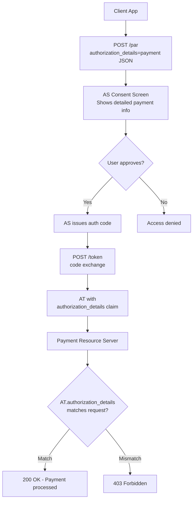

⚡ TL;DR - Rich Authorization Requests (RAR, RFC 9396) extends
OAuth beyond opaque string scopes by introducing an
`authorization_details` parameter - a structured JSON array
describing exactly what the client needs authorization for,
at object-level granularity. Instead of `scope=payment`, a
payment API can specify `authorization_details=[{"type":
"payment_initiation","creditorName":"...","amount":{"value":
"123.50","currency":"EUR"}}]`. The AS can present this detail
in the consent screen; the RS can enforce it precisely. RAR
is foundational to Open Banking (FAPI 2.0), healthcare (SMART
on FHIR), and any API that needs fine-grained authorization
beyond what string scopes can express.

---

### 🔥 The Problem This Solves

**THE STRING SCOPE LIMITATION:**

OAuth scopes are opaque strings like `read:accounts` or
`payment`. They are coarse-grained by design - they cannot
express: "read transactions from account X123 only", "initiate
a one-time payment of €50 to creditor Y", or "access patient
records for patient ID 12345 for 30 days". The AS has no way
to present precise authorization requests in the consent UI.
The RS has no way to enforce object-level restrictions from
the scope string alone. RAR solves this by making authorization
requests structured data, not just strings.

---

### 📘 Textbook Definition

OAuth 2.0 Rich Authorization Requests (RFC 9396) introduces
the `authorization_details` parameter to the authorization
request and token request. Its value is a JSON array of
authorization detail objects, each describing a specific
authorization action.

**Authorization detail object structure:**
```json
{
  "type": "...",  // REQUIRED: identifier of the authorization
                  // type (defined by the AS/RS or a spec)
  // ... type-specific fields ...
}
```

**Lifecycle:**
1. `authorization_details` is sent in the authorization
   request (or PAR push) and token request.
2. The AS presents the details in the consent screen (much
   richer than a scope string).
3. The AS includes the granted `authorization_details` in
   the access token (as a JWT claim or in the token
   introspection response).
4. The RS validates the `authorization_details` claim in
   the access token matches what the current request requires.

**Interaction with scopes:**
RAR can be used alongside traditional scopes. For OIDC
identity scopes (`openid`, `profile`, `email`), continue
using scopes. For resource-specific fine-grained authorization,
use `authorization_details`.

---

### ⏱️ Understand It in 30 Seconds

**Scopes vs RAR:**

```
SCOPE (coarse-grained):
  scope=payment
  Consent: "This app wants to: Make payments"
  RS can only check: does token have "payment" scope?
  Cannot enforce: which account, what amount, to whom.

RAR (fine-grained):
  authorization_details=[
    {
      "type": "payment_initiation",
      "locations": ["https://banking.example.com/payments"],
      "instructedAmount": {
        "currency": "EUR",
        "amount": "123.50"
      },
      "creditorName": "Merchant XYZ",
      "creditorAccount": {
        "iban": "DE02100100109307118603"
      },
      "remittanceInformationUnstructured": "Order #42"
    }
  ]
  Consent: "This app wants to: Make a payment of €123.50
            to Merchant XYZ (DE02...8603) for Order #42"
  RS can enforce: payment details match AT exactly.
  User sees EXACTLY what they're authorizing.
```

---

### ⚙️ How It Works (Mechanism)

```
┌──────────────────────────────────────────────────────────┐
│  RAR FLOW: PAYMENT INITIATION EXAMPLE                     │
├──────────────────────────────────────────────────────────┤
│                                                           │
│  1. CLIENT → PAR endpoint (recommended with RAR):         │
│     POST /par                                             │
│     authorization_details=[{                              │
│       "type": "payment_initiation",                       │
│       "instructedAmount":{"currency":"EUR","amount":"50"},│
│       "creditorName": "Merchant Inc",                     │
│       "creditorAccount": {"iban": "DE02..."}              │
│     }]                                                    │
│     + standard PKCE params                                │
│                                                           │
│  2. AS → Consent screen:                                  │
│     "Authorize payment of €50 to Merchant Inc            │
│      IBAN: DE02...? [Allow] [Deny]"                       │
│     (Details extracted from authorization_details)        │
│                                                           │
│  3. User approves → AS issues auth code.                  │
│                                                           │
│  4. Client → Token exchange: code → AT                    │
│     AT JWT payload includes:                              │
│     {                                                     │
│       "authorization_details": [{                         │
│         "type": "payment_initiation",                     │
│         "instructedAmount": {"currency":"EUR","amount":50}│
│         "creditorName": "Merchant Inc"                    │
│       }],                                                 │
│       "scope": "openid",                                  │
│       "exp": ..., "iss": ..., "sub": ...                  │
│     }                                                     │
│                                                           │
│  5. Client → Payment RS: POST /payments                   │
│     + body: {creditorAccount: "DE02...", amount: "50"}    │
│     + Authorization: Bearer <AT>                          │
│                                                           │
│  6. RS validates:                                         │
│     - AT.authorization_details[0].type == payment_init   │
│     - AT.authorization_details[0].amount == "50"          │
│     - AT.authorization_details[0].creditorName == "Merch" │
│     - Request body amount matches AT claim                │
│     - If mismatch: 403 Forbidden                          │
└──────────────────────────────────────────────────────────┘
```



---

### 💻 Code Example

**Example 1 - BAD then GOOD: Scope-only vs RAR authorization:**

```python
# BAD: Using string scopes for fine-grained payment auth
# Problem: scope=payment gives blanket payment authority
# Problem: RS cannot enforce specific amount/recipient
# Problem: consent screen just shows "Make payments"

def initiate_payment_bad(
    client,
    amount: str,
    creditor_iban: str,
) -> str:
    # WRONG: Coarse-grained scope cannot encode payment details
    auth_url = client.build_auth_url(
        scope="openid payment",  # Blanket permission
        # No way to encode amount, creditor, one-time use here
    )
    # The resulting AT only proves: user allowed "payment" scope
    # RS must trust client to send correct amount (not verifiable)
    return auth_url
```

```python
# GOOD: RAR with authorization_details for payment
# WHY: AS shows exact payment details in consent.
#   AT contains exact authorization - RS can verify.
#   One-time use semantics can be enforced by RS.

import json

def initiate_payment_with_rar(
    par_endpoint: str,
    authorize_endpoint: str,
    client_id: str,
    client_cert: tuple,     # (cert_path, key_path)
    amount: str,
    currency: str,
    creditor_name: str,
    creditor_iban: str,
    remittance: str,
) -> str:
    """
    Build PAR request with authorization_details for payment.
    Returns the browser redirect URL.
    """
    import secrets, hashlib, base64, requests
    from urllib.parse import urlencode

    code_verifier = secrets.token_urlsafe(64)
    code_challenge = base64.urlsafe_b64encode(
        hashlib.sha256(code_verifier.encode()).digest()
    ).rstrip(b'=').decode()
    state = secrets.token_urlsafe(32)

    # RAR: structured authorization details
    authorization_details = [
        {
            "type": "payment_initiation",
            "locations": [
                "https://payments.bank.example.com"
            ],
            "instructedAmount": {
                "currency": currency,
                "amount": amount,
            },
            "creditorName": creditor_name,
            "creditorAccount": {
                "iban": creditor_iban,
            },
            "remittanceInformationUnstructured": remittance,
        }
    ]

    # Push to PAR endpoint (server-to-server, with mTLS)
    par_resp = requests.post(
        par_endpoint,
        data={
            "response_type": "code",
            "client_id": client_id,
            "scope": "openid",
            "redirect_uri":
                "https://app.example.com/callback",
            "state": state,
            "code_challenge": code_challenge,
            "code_challenge_method": "S256",
            # KEY: authorization_details as JSON string
            "authorization_details": json.dumps(
                authorization_details
            ),
        },
        cert=client_cert,
    )
    par_resp.raise_for_status()
    request_uri = par_resp.json()["request_uri"]

    # Return redirect URL (clean - only client_id + request_uri)
    return f"{authorize_endpoint}?" + urlencode({
        "client_id": client_id,
        "request_uri": request_uri,
    })
```

**Example 2 - RS: Validating authorization_details in AT:**

```python
# Resource Server: validate authorization_details claim

from dataclasses import dataclass
from typing import Optional

@dataclass
class PaymentRequest:
    amount: str
    currency: str
    creditor_iban: str
    remittance: str

def validate_payment_authorization(
    access_token_claims: dict,
    payment_request: PaymentRequest,
) -> None:
    """
    Validate that the access token's authorization_details
    authorize exactly this payment request.
    Raises PermissionError on any mismatch.
    """
    auth_details = access_token_claims.get(
        "authorization_details", []
    )

    # Find payment_initiation entry
    payment_auth = next(
        (d for d in auth_details
         if d.get("type") == "payment_initiation"),
        None
    )

    if not payment_auth:
        raise PermissionError(
            "No payment_initiation authorization in token"
        )

    # Validate amount
    token_amount = payment_auth.get(
        "instructedAmount", {}
    ).get("amount")
    token_currency = payment_auth.get(
        "instructedAmount", {}
    ).get("currency")

    if token_amount != payment_request.amount:
        raise PermissionError(
            f"Amount mismatch: authorized={token_amount}, "
            f"requested={payment_request.amount}"
        )
    if token_currency != payment_request.currency:
        raise PermissionError("Currency mismatch")

    # Validate creditor
    token_iban = payment_auth.get(
        "creditorAccount", {}
    ).get("iban")
    if token_iban != payment_request.creditor_iban:
        raise PermissionError(
            "Creditor IBAN mismatch: "
            "payment details do not match authorization"
        )

    # Payment is authorized - proceed
```

---

### ⚖️ Comparison Table

| Authorization Mechanism | Granularity | Consent Screen | RS Enforcement | Standard |
|---|---|---|---|---|
| **Scopes only** | Coarse (verb/resource type) | Generic ("Make payments") | Scope presence only | RFC 6749 |
| **Custom JWT claims** | Fine (custom fields) | Not standardized | Manual, non-portable | Proprietary |
| **RAR (authorization_details)** | Fine (type + structured fields) | Detailed, standardized | authorization_details claim | RFC 9396 |

---

### ⚠️ Common Misconceptions

| Misconception | Reality |
|---|---|
| RAR replaces OAuth scopes entirely | RAR supplements, not replaces, OAuth scopes. OIDC scopes (`openid`, `profile`, `email`) continue to use the `scope` parameter. RAR is for resource-specific fine-grained authorization. The two can be used together in the same request: `scope=openid&authorization_details=[...]`. |
| The `authorization_details` parameter is optional in FAPI 2.0 | FAPI 2.0 for financial-grade APIs requires RAR for most API operations where transaction details need to be explicitly authorized. It is not optional when the RS requires fine-grained authorization. For non-FAPI deployments, RAR is optional and can be adopted incrementally. |
| The AS automatically understands all `authorization_details` types | The `type` field in `authorization_details` is an extensible identifier. The AS must be configured to understand specific types (e.g., `payment_initiation`, `account_information`). Standardized types exist for Open Banking (by the Berlin Group, UK OBL) and healthcare (SMART on FHIR). For custom APIs, you define your own types and configure the AS to handle them. |
| RAR makes PAR unnecessary | PAR and RAR are complementary. RAR authorization requests can be very large (complex payment details, rich objects). URLs have length limits. PAR solves the URL length problem by submitting RAR parameters via POST. FAPI 2.0 requires both: PAR for parameter integrity and size, RAR for fine-grained authorization. |

---

### 🚨 Failure Modes & Diagnosis

**RS Rejects Token Despite Valid RAR Authorization**

**Symptom:**
POST /payments returns 403 with "authorization_details
mismatch" even though the AS granted authorization and the AT
looks correct.

**Root Cause:**
String comparison mismatch in amount validation. The RAR
specified `"amount": "50.00"` but the request body sends
`"amount": "50"`. The RS does strict string equality on
`authorization_details` claims - the formats don't match.

**Diagnostic:**

```python
# Debug: compare AT claims vs request
import jwt as pyjwt

def debug_rar_mismatch(
    access_token: str,
    request_amount: str,
):
    claims = pyjwt.decode(
        access_token,
        options={"verify_signature": False}
    )
    auth_details = claims.get("authorization_details", [])
    payment_auth = next(
        (d for d in auth_details
         if d.get("type") == "payment_initiation"),
        None
    )
    if payment_auth:
        token_amount = payment_auth.get(
            "instructedAmount", {}
        ).get("amount", "NOT_FOUND")
        print(f"Token amount: '{token_amount}'")
        print(f"Request amount: '{request_amount}'")
        print(f"Match: {token_amount == request_amount}")
        # Common: "50.00" vs "50" → mismatch
```

**Fix:**
Normalize amount representation before comparison (strip
trailing zeros, standardize decimal separator). Use Decimal
type comparisons rather than string equality for monetary
amounts. Define a canonical amount format in the type spec
and enforce it both client-side (when building RAR) and
RS-side (when validating). Document the normalization rule.

---

### 🔗 Related Keywords

**Prerequisites:**
- `OAuth Scopes in Practice` - what RAR extends
- `Pushed Authorization Requests (PAR)` - recommended with RAR

**Builds On:**
- `OAuth 2.0 in Financial Services (FAPI)` - main production use case
- `Authorization Server Architecture` - how AS processes RAR types

---

### 📌 Quick Reference Card

```
┌──────────────────────────────────────────────────────────┐
│ PARAMETER    │ authorization_details=[{type:..., ...}]   │
│              │ Sent in auth request (or PAR) + token req │
├──────────────┼───────────────────────────────────────────┤
│ REQUIRED     │ type field: identifies the auth type      │
│ FIELD        │ Custom fields: type-specific              │
├──────────────┼───────────────────────────────────────────┤
│ AT CLAIM     │ authorization_details embedded in AT JWT  │
│              │ RS validates: AT claim matches request    │
├──────────────┼───────────────────────────────────────────┤
│ USE CASE     │ Open Banking, healthcare (SMART on FHIR), │
│              │ any fine-grained resource authorization   │
├──────────────┼───────────────────────────────────────────┤
│ WITH PAR     │ RECOMMENDED: RAR payload in POST body     │
│              │ avoids URL length limits + exposure       │
├──────────────┼───────────────────────────────────────────┤
│ ONE-LINER    │ "Scopes = verbs. RAR = structured data.   │
│              │  Consent shows exact authorization object."│
└──────────────────────────────────────────────────────────┘
```

**If you remember only 3 things:**

1. RAR introduces `authorization_details` - a JSON array of
   typed objects describing exactly what is being authorized.
   Unlike scope strings, the AS can show precise details in
   consent screens and embed the full authorization in the AT.

2. The RS validates `authorization_details` in the AT against
   the actual request (amount, account, recipient). If they
   don't match, the request is rejected - fine-grained
   enforcement at the resource level, not just scope presence.

3. RAR + PAR = recommended combination. RAR makes requests
   large and structured; PAR moves them off the URL into a
   POST body. Together they provide both parameter integrity
   and fine-grained authorization. Required in FAPI 2.0.
