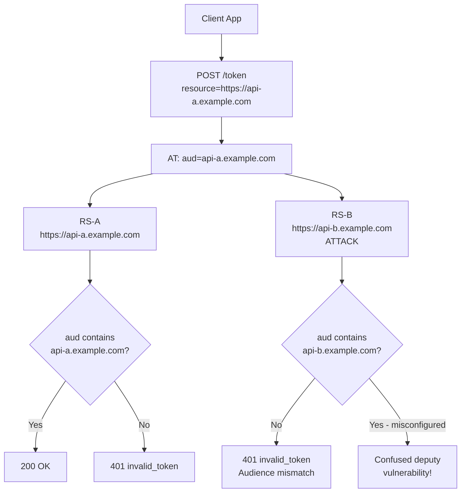

⚡ TL;DR - The `aud` (audience) claim in JWT access tokens
restricts which resource servers are permitted to accept the
token. If `aud` is not validated, a confused deputy attack
becomes possible: a token issued for Resource Server A is
presented to Resource Server B, which accepts it because
the signature is valid - but the token was never authorized
for use with RS-B. RFC 7519 §4.1.3 requires that the token
be rejected if the receiving party is not identified in `aud`.
In practice: RS-A must verify that its own identifier appears
in the token's `aud` claim. `aud` MUST be the RS's unique
identifier (not the client_id). Forgetting audience
validation is one of the most common JWT security bugs.

---

### 🔥 The Problem This Solves

**THE CONFUSED DEPUTY PROBLEM:**

Imagine a user grants a client access to API-A (photos).
The AS issues an AT with `scope=read:photos` and
`aud=api-a.example.com`. Without audience validation,
the client can present this token to API-B (finance) and
API-B will accept it (signature verifies, not expired,
valid issuer). API-B never received authorization from
the user to act for the client - it was deceived by a
token from a different context. This is the confused deputy
vulnerability. Audience validation closes this hole: API-B
must reject any token where its identifier doesn't appear
in `aud`.

---

### 📘 Textbook Definition

JWT `aud` (audience) claim: identifies the recipients that
the JWT is intended for. RFC 7519 §4.1.3: "The 'aud' (audience)
claim identifies the recipients that the JWT is intended for.
Each principal intended to process the JWT MUST identify
itself with a value in the audience claim. If the principal
processing the claim does not identify itself with a value
in the 'aud' claim when this claim is present, the JWT MUST
be rejected."

**Value forms:**
- Single string: `"aud": "https://api.example.com"`
- Array: `"aud": ["https://api-a.example.com", "https://api-b.example.com"]`

**What `aud` should be:**
In RFC 9068 (JWT Access Tokens), `aud` MUST be the
URL(s) of the resource server(s) the token is intended for.
It MUST NOT be the `client_id`. The client_id is the entity
that obtained the token; the audience is who should accept it.
For AS metadata, the `resource` parameter at the token endpoint
specifies which RS the token is for.

**The RFC 8707 `resource` parameter:**
Clients can request a token for a specific resource server
using `resource=https://api.example.com` in the token
request. The AS sets `aud` accordingly. This ensures tokens
are audience-specific even when a client has access to
multiple resource servers.

---

### ⏱️ Understand It in 30 Seconds

**The validation rule:**

```
TOKEN:
  {
    "iss": "https://as.example.com",
    "aud": "https://api-a.example.com",
    "sub": "user-123",
    "exp": 1882996800,
    "scope": "read:data"
  }

RESOURCE SERVER A (https://api-a.example.com):
  My identifier in aud? YES ("https://api-a.example.com")
  → Proceed with authorization

RESOURCE SERVER B (https://api-b.example.com):
  My identifier in aud? NO
  → REJECT with 401 "invalid_token"

COMMON MISTAKE:
  RS-B validates: sig OK? YES. exp OK? YES. iss OK? YES.
  But forgets: is my identifier in aud?
  → Confused deputy vulnerability

CORRECT VALIDATION ORDER:
  1. Verify signature (cryptographic integrity)
  2. Verify iss (trusted issuer)
  3. Verify aud (token for this RS - most commonly missed!)
  4. Verify exp/nbf (token is not expired)
  5. Verify scope (required permissions present)
```

---

### ⚙️ How It Works (Mechanism)

```
┌──────────────────────────────────────────────────────────┐
│  AUDIENCE VALIDATION IN MULTI-SERVICE ARCHITECTURE        │
├──────────────────────────────────────────────────────────┤
│                                                           │
│  USER                  AS              RS-A       RS-B    │
│    │                    │               │          │      │
│    │ Auth for RS-A       │               │          │      │
│    │ resource=api-a     │               │          │      │
│    │───────────────────→│               │          │      │
│    │                    │ AT: aud=api-a │          │      │
│    │←───────────────────│               │          │      │
│    │                    │               │          │      │
│    │ Call RS-A with AT                             │      │
│    │────────────────────────────────────→          │      │
│    │                    │               │ Validate: │     │
│    │                    │               │ aud=api-a │     │
│    │                    │               │ = my id   │     │
│    │                    │               │ ACCEPT    │     │
│    │←───────────────────────────────────│          │      │
│    │                    │               │          │      │
│    │ ATTACK: Present api-a AT to RS-B             │      │
│    │─────────────────────────────────────────────→│      │
│    │                    │               │          │      │
│    │                    │               │ Validate: │     │
│    │                    │               │ aud=api-a │     │
│    │                    │               │ ≠ api-b   │     │
│    │                    │               │ REJECT 401│     │
│    │←─────────────────────────────────────────────│      │
│                                                           │
│  MISCONFIGURED RS-B (no aud validation):                  │
│    Only checks: sig OK? exp OK? iss trusted? → ACCEPT     │
│    Confused deputy: RS-B accepted a token for RS-A        │
└──────────────────────────────────────────────────────────┘
```



---

### 💻 Code Example

**Example 1 - BAD then GOOD: Missing audience validation:**

```python
# BAD: JWT validation that ignores audience
# This is one of the most common OAuth security bugs

import jwt as pyjwt

JWKS_URI = "https://as.example.com/.well-known/jwks.json"
TRUSTED_ISSUER = "https://as.example.com"

def validate_token_bad(token: str) -> dict:
    # WRONG: No audience check
    # Any valid JWT from the trusted AS will be accepted,
    # even if it was issued for a different resource server
    claims = pyjwt.decode(
        token,
        key=get_signing_key(token),
        algorithms=["RS256"],
        # MISSING: audience= parameter
    )
    return claims  # Confused deputy vulnerability!

# A token with aud="payment-service" will be accepted by
# the "accounts-service" using this validator.
```

```python
# GOOD: JWT validation with mandatory audience check
# WHY: RS must verify that the token was specifically issued
#   for use with this service. Tokens from other services
#   must be rejected even if they are cryptographically valid.

import jwt as pyjwt
from jwt.exceptions import InvalidAudienceError

# MY_RESOURCE_ID is this RS's unique identifier
# Must match what the AS puts in the aud claim
MY_RESOURCE_ID = "https://accounts.api.example.com"

def validate_token(token: str) -> dict:
    """
    Validate JWT access token with all required checks.
    Returns verified claims on success.
    Raises jwt.exceptions.* on any validation failure.
    """
    signing_key = get_signing_key(token)  # From JWKS

    # PyJWT validates audience automatically when audience=
    # is provided. Raises InvalidAudienceError if aud check
    # fails. aud can be string or list in the token.
    claims = pyjwt.decode(
        token,
        key=signing_key,
        algorithms=["RS256"],
        # KEY: Specify this RS's identifier as audience.
        # PyJWT checks: MY_RESOURCE_ID in token.aud
        audience=MY_RESOURCE_ID,
        # PyJWT also validates exp, nbf automatically
        options={
            "require": ["aud", "exp", "iss", "sub"],
        }
    )

    # Additional: verify issuer is trusted
    if claims.get("iss") != TRUSTED_ISSUER:
        raise ValueError(f"Untrusted issuer: {claims['iss']}")

    # Additional: verify jti not in revocation list
    jti = claims.get("jti")
    if jti and is_token_revoked(jti):
        raise ValueError("Token has been revoked")

    return claims

# Token with aud="payment-service" presented to accounts-service:
# PyJWT raises InvalidAudienceError: "Invalid audience"
# → 401 returned to client
```

**Example 2 - Requesting audience-specific tokens via `resource` parameter:**

```python
# Client: request a token for a specific RS using RFC 8707
# This ensures the AS sets the correct aud claim

import requests

TOKEN_ENDPOINT = "https://as.example.com/token"
CLIENT_ID = "my-client"

def get_token_for_service(
    grant_type: str,
    target_resource: str,  # The RS URL
    scope: str,
    # ... grant-specific params ...
) -> str:
    """
    Request an access token for a specific resource server.
    The 'resource' parameter (RFC 8707) tells the AS which
    RS should be set as the audience.
    """
    resp = requests.post(TOKEN_ENDPOINT, data={
        "grant_type": grant_type,
        "client_id": CLIENT_ID,
        "scope": scope,
        # RFC 8707: indicate the target resource server
        # AS will set aud=target_resource in the issued AT
        "resource": target_resource,
    }, auth=(CLIENT_ID, "client_secret"))

    resp.raise_for_status()
    token = resp.json()["access_token"]

    # Verify the aud was set correctly
    import jwt as pyjwt
    claims = pyjwt.decode(
        token, options={"verify_signature": False}
    )
    actual_aud = claims.get("aud")
    if isinstance(actual_aud, str):
        assert actual_aud == target_resource
    else:
        assert target_resource in actual_aud

    return token

# Get token for accounts service
accounts_token = get_token_for_service(
    "client_credentials",
    "https://accounts.api.example.com",
    "read:accounts",
)
# accounts_token.aud = "https://accounts.api.example.com"

# Get token for payment service (DIFFERENT token, different aud)
payment_token = get_token_for_service(
    "client_credentials",
    "https://payment.api.example.com",
    "initiate:payments",
)
# payment_token.aud = "https://payment.api.example.com"
# These tokens are NOT interchangeable - audience validation
# prevents presenting the wrong token to the wrong service.
```

---

### ⚖️ Comparison Table

| Audience Configuration | Security Level | Use Case | RS Validation |
|---|---|---|---|
| **No aud claim** | Low (confused deputy risk) | Legacy / simple deployments | Cannot be enforced |
| **aud = client_id** | Wrong (RFC 9068 violation) | Anti-pattern | Client, not RS |
| **aud = RS URL** | Correct | Standard FAPI/multi-RS | RS validates its own URL |
| **aud = [RS-A, RS-B]** | Medium (multi-audience) | API gateways, token downcasting | Each RS validates own URL |
| **aud = RS URL + resource param** | Correct + explicit | Best practice for multi-RS | RS validates + AS enforces |

---

### ⚠️ Common Misconceptions

| Misconception | Reality |
|---|---|
| `aud` should be the `client_id` | RFC 9068 §2.2 explicitly states: "the audience MUST be set to the URL of the resource server." The `client_id` is already captured in the `client_id` JWT claim (RFC 9068 §2.2). The audience identifies which RS should accept the token, not who requested it. Setting `aud=client_id` is a common misconfiguration that provides no protection against confused deputy attacks across different resource servers. |
| Validating signature + expiry is sufficient | Signature validation only proves the token came from the trusted AS. Expiry prevents replay of old tokens. But neither proves this token was authorized for THIS resource server. A valid, unexpired token for a different RS should be rejected. Audience validation is the third leg of the validation tripod: sig + iss + aud. All three must pass before any other claim is trusted. |
| Multi-audience tokens are fine for all cases | A token with `aud=["rs-a", "rs-b"]` allows both resource servers to accept it. This is appropriate for tightly coupled services. However, if RS-A and RS-B have different security requirements or if the token should not flow between them (e.g., different privilege levels), multi-audience tokens are dangerous. Prefer per-RS tokens (with the `resource` parameter) for fine-grained control. |
| The AS always sets `aud` correctly by default | AS behavior on `aud` varies by implementation. Some AS set `aud=client_id` by default (misconfigured). Others require explicit configuration. Check the token structure in your deployment and verify that `aud` contains the RS URL. If the AS doesn't support the `resource` parameter (RFC 8707), configure audience mapping in the AS for each client registration. |

---

### 🚨 Failure Modes & Diagnosis

**Audience Mismatch After AS Reconfiguration**

**Symptom:**
After deploying to a new environment or reconfiguring the AS,
all API calls return 401 with "Invalid audience". This happens
even though the user just authenticated and tokens look valid.

**Root Cause:**
The AS's configured `aud` value for the client/RS changed
between environments (e.g., staging uses
`https://staging.api.example.com` but production was
misconfigured as `api.example.com`). The RS's configured
`MY_RESOURCE_ID` (expected audience) doesn't match.

**Diagnostic:**

```python
# Quick aud claim inspection without verification
import jwt as pyjwt, json

def inspect_token_audience(token: str):
    """Decode token without verification to inspect aud."""
    claims = pyjwt.decode(
        token, options={"verify_signature": False}
    )
    aud = claims.get("aud", "NOT_PRESENT")
    iss = claims.get("iss", "NOT_PRESENT")
    print(f"iss: {iss}")
    print(f"aud: {aud}")
    print(f"exp: {claims.get('exp')}")
    print(f"scope: {claims.get('scope', '')}")

# Compare:
# AS configured to issue: aud=?
# RS configured to expect: MY_RESOURCE_ID=?
# These MUST match exactly (case-sensitive, exact URL)
```

**Fix:**
1. Decode the AT to see what `aud` the AS is actually setting.
2. Compare against the RS's expected audience (`MY_RESOURCE_ID`).
3. Fix either the AS configuration (correct `aud` value) or
   the RS configuration (correct expected audience).
4. Test: use the `resource` parameter at the token endpoint
   to explicitly request the correct `aud`.

---

### 🔗 Related Keywords

**Prerequisites:**
- `Bearer Token` - what audience restricts
- `JWT Access Tokens (RFC 9068)` - aud is a required claim there

**Builds On:**
- `OAuth 2.0 Mix-Up Attack` - audience confusion at AS level
- `Token Substitution Attack` - audience bypass attack pattern

---

### 📌 Quick Reference Card

```
┌──────────────────────────────────────────────────────────┐
│ AUD VALUE    │ RS's own URL identifier (not client_id)   │
│              │ Set by AS; must be RS's configured ID     │
├──────────────┼───────────────────────────────────────────┤
│ RS RULE      │ MUST reject tokens where own ID not in aud│
│              │ Even if sig valid + not expired            │
├──────────────┼───────────────────────────────────────────┤
│ VALIDATION   │ 1. sig verified  2. iss trusted           │
│ ORDER        │ 3. aud contains MY_ID  4. exp valid       │
│              │ 5. scope present                          │
├──────────────┼───────────────────────────────────────────┤
│ RESOURCE     │ client: resource=https://rs.example.com   │
│ PARAMETER    │ AS: issues AT with aud=that URL (RFC 8707)│
├──────────────┼───────────────────────────────────────────┤
│ CONFUSED     │ No aud validation → valid token for RS-A  │
│ DEPUTY       │ accepted by RS-B → unauthorized access    │
├──────────────┼───────────────────────────────────────────┤
│ ONE-LINER    │ "aud = who may accept this token. RS must │
│              │  reject tokens not addressed to it."      │
└──────────────────────────────────────────────────────────┘
```

**If you remember only 3 things:**

1. Every RS MUST validate that its own identifier appears in
   the token's `aud` claim. A token issued for API-A must be
   rejected by API-B, even if the signature is valid. Missing
   audience validation = confused deputy vulnerability.

2. `aud` must be the RS's URL identifier, NOT the client_id.
   RFC 9068 is explicit: `aud` is the resource server, not
   the party that requested the token.

3. Use the `resource` parameter (RFC 8707) at the token
   endpoint to request audience-specific tokens when calling
   multiple resource servers. Tokens should not be shared
   across RS boundaries.
