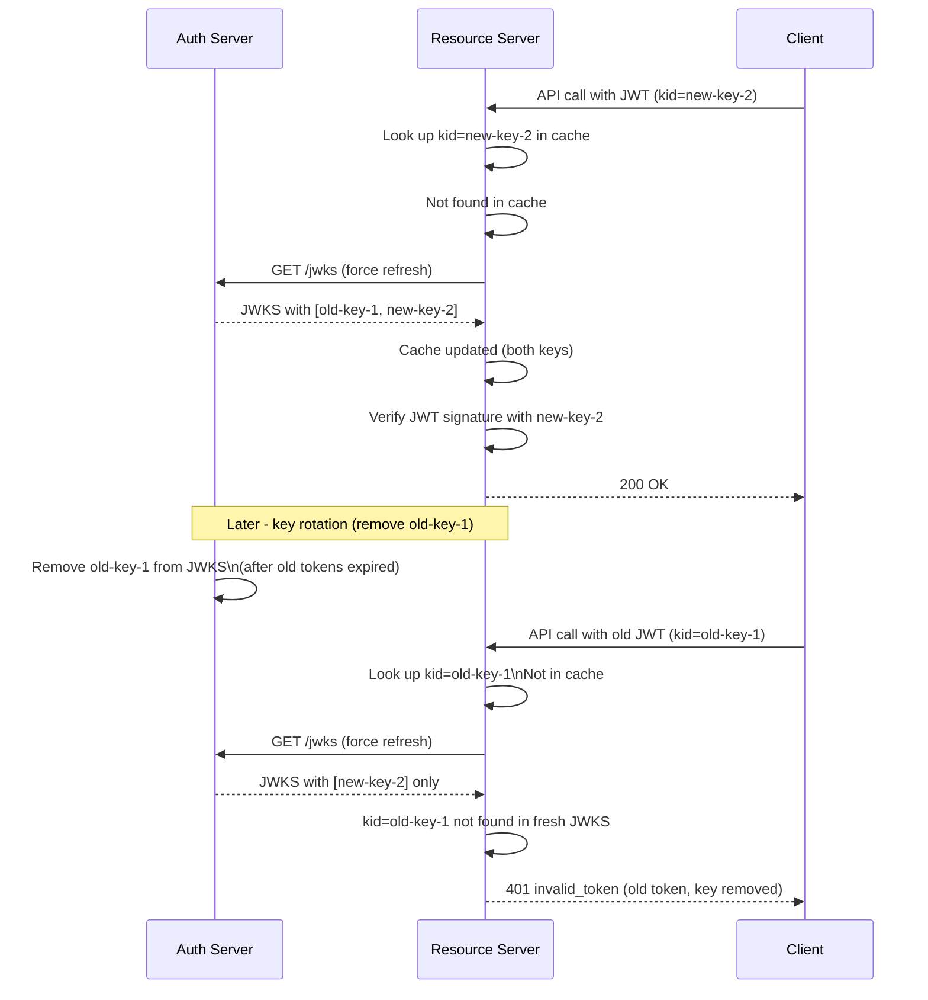

⚡ TL;DR - JWKS (JSON Web Key Set) is the standard format
for publishing public keys used to verify JWT signatures.
The AS publishes its JWKS at a well-known URL (discovered via
the `jwks_uri` in OIDC metadata). Each key in the set has a
`kid` (key ID); JWT headers include the matching `kid` so
the RS can select the correct verification key. Key rotation
is the critical operational challenge: the AS must publish
both the new key and the old key during the rotation overlap
window (to avoid 401 errors for tokens signed with the old
key that are still valid). The RS must cache JWKS with a
TTL, refresh on unknown `kid`, and re-validate on `Cache-
Control` expiry. Getting key rotation wrong causes widespread
401 errors at the moment of rotation.

---

### 🔥 The Problem This Solves

**THE KEY DISTRIBUTION PROBLEM:**

JWT access tokens are signed by the AS's private key and
verified by resource servers using the corresponding public
key. How does the RS get the public key? Hard-coding it is
brittle (rotation breaks it). Email attachment is insecure.
JWKS provides a standardized, automated, versioned key
distribution mechanism: the AS publishes its public keys
as a JSON document at a fixed URL; RSes fetch it automatically
and cache it; when the AS rotates keys, RSes auto-discover
the new key from the same endpoint.

---

### 📘 Textbook Definition

JWKS (JSON Web Key Set, RFC 7517) is a JSON document
representing a collection of JSON Web Keys (JWK). Each JWK
is a JSON object representing a cryptographic key.

**JWKS document structure:**
```json
{
  "keys": [
    {
      "kty": "RSA",
      "use": "sig",
      "alg": "RS256",
      "kid": "2024-10-key-1",
      "n": "...",
      "e": "AQAB"
    },
    {
      "kty": "EC",
      "use": "sig",
      "alg": "ES256",
      "kid": "2024-10-ec-1",
      "crv": "P-256",
      "x": "...",
      "y": "..."
    }
  ]
}
```

**Key fields:**
- `kty`: Key type: `RSA`, `EC`, `OKP` (Ed25519).
- `use`: `sig` (signature) or `enc` (encryption).
- `alg`: Algorithm: `RS256`, `RS384`, `RS512`, `ES256`, `ES384`.
- `kid`: Key identifier. Must be unique in the set. Matches
  the `kid` in JWT headers.
- `n`, `e`: RSA public key components.
- `x`, `y`: EC public key coordinates.
- Private key components (`d`, `p`, `q`, etc.) MUST NEVER
  appear in the published JWKS.

**Discovery:**
OIDC metadata (`/.well-known/openid-configuration`) contains
`"jwks_uri": "https://as.example.com/jwks"`. The RS discovers
the JWKS URL by fetching OIDC metadata first (or by static
configuration). RFC 8414 (AS metadata) also defines
`"jwks_uri"` for non-OIDC deployments.

---

### ⏱️ Understand It in 30 Seconds

**The key rotation lifecycle:**

```
NORMAL OPERATION:
  AS JWKS: [ key-2024-A (ACTIVE) ]
  JWT header: { kid: "key-2024-A", alg: "RS256" }
  RS: cached JWKS has key-2024-A → verify OK

KEY ROTATION (ZERO DOWNTIME):
  Step 1: AS adds new key to JWKS
          JWKS: [ key-2024-A, key-2025-B (NEW) ]
          Still signing with key-2024-A

  Step 2: Wait for RS caches to refresh (≥ JWKS cache TTL)
          All RSes now have both keys cached.

  Step 3: AS switches signing to key-2025-B
          New JWTs: { kid: "key-2025-B", ... }
          RSes: have key-2025-B in cache → verify OK
          Old tokens (signed with 2024-A): still verify OK
          (2024-A still in JWKS)

  Step 4: Wait for all 2024-A signed tokens to expire
          (≥ max AT lifetime, typically 15-60 min)

  Step 5: Remove key-2024-A from JWKS
          JWKS: [ key-2025-B ]

ROTATE TOO FAST (BROKEN):
  AS switches signing key AND removes old key in one step.
  All valid tokens from before the rotation:
  → kid=key-2024-A not found in JWKS
  → RS re-fetches JWKS: key-2024-A still not there
  → 401 for all valid sessions
  → Thousands of users logged out simultaneously
```

---

### ⚙️ How It Works (Mechanism)

```
┌──────────────────────────────────────────────────────────┐
│  RS JWKS CACHE STRATEGY                                   │
├──────────────────────────────────────────────────────────┤
│                                                           │
│  1. At startup: fetch JWKS, cache with TTL (e.g., 1h)    │
│                                                           │
│  2. On JWT validation:                                    │
│     a. Extract kid from JWT header                        │
│     b. Look up kid in cache                               │
│     c. IF found: verify signature                         │
│     d. IF not found:                                      │
│        - Fetch fresh JWKS (bypass cache)                  │
│        - Update cache                                     │
│        - Re-look up kid                                   │
│        - IF still not found: reject (unknown kid)         │
│     e. Verify signature with found key                    │
│     f. Verify all other claims (iss, aud, exp, scope)     │
│                                                           │
│  WHY FORCE-REFRESH ON UNKNOWN KID:                        │
│  When the AS adds a new signing key, RSes with stale     │
│  cache won't have it yet. Force-refreshing ensures        │
│  newly issued tokens (with new kid) are immediately       │
│  accepted without waiting for TTL expiry.                 │
│                                                           │
│  SECURITY: Refresh on unknown kid is safe because:        │
│  - JWKS endpoint is HTTPS-authenticated                   │
│  - Key is still validated (attacker can't inject keys)    │
│  - JWT signature is still cryptographically verified      │
│                                                           │
│  RATE LIMITING PROTECTION:                                │
│  Cache the "refreshed_at" timestamp. If we just fetched   │
│  JWKS within the last 60 seconds, don't fetch again       │
│  (prevents DoS: flood RS with tokens with unknown kid).   │
└──────────────────────────────────────────────────────────┘
```



---

### 💻 Code Example

**Example 1 - BAD then GOOD: Static key vs JWKS-based verification:**

```python
# BAD: Hardcoded public key for JWT verification
# Problem: Rotation requires re-deployment of all RSes.
# Problem: Single point of failure if key is compromised.
# Problem: Cannot support key rotation without downtime.

PUBLIC_KEY_PEM = """-----BEGIN PUBLIC KEY-----
MIIBIjANBgkqhkiG9w0BAQEFAAOCAQ8AMIIBCgKCAQEA...
-----END PUBLIC KEY-----"""

def validate_token_bad(token: str) -> dict:
    return jwt.decode(
        token,
        PUBLIC_KEY_PEM,  # WRONG: hardcoded key
        algorithms=["RS256"],
        audience="https://api.example.com"
    )
```

```python
# GOOD: Dynamic key lookup via JWKS
# WHY: RS automatically gets new keys after rotation.
#   Force-refresh on unknown kid handles rotation gracefully.
#   Rate limiting prevents JWKS DoS.

import time, jwt, requests
from cryptography.hazmat.primitives import serialization
from cryptography.hazmat.backends import default_backend
import base64, struct
from cachetools import TTLCache

JWKS_URI = "https://as.example.com/jwks"
TRUSTED_ISSUER = "https://as.example.com"
MY_AUDIENCE = "https://api.example.com"

# Cache: 1 key set, 1 hour TTL
_jwks_cache: dict = {}
_cache_fetched_at: float = 0
_CACHE_TTL = 3600  # 1 hour
_MIN_REFRESH_INTERVAL = 60  # Rate limit: max 1 fetch/60s

def _fetch_jwks() -> dict:
    """Fetch JWKS from AS. Returns dict of kid -> public_key."""
    global _cache_fetched_at, _jwks_cache

    now = time.time()
    if now - _cache_fetched_at < _MIN_REFRESH_INTERVAL:
        # Rate limiting: don't re-fetch if we just did
        return _jwks_cache

    resp = requests.get(JWKS_URI, timeout=5)
    resp.raise_for_status()
    jwks = resp.json()

    key_map = {}
    for jwk in jwks.get("keys", []):
        if jwk.get("use") != "sig":
            continue
        kid = jwk.get("kid")
        if not kid:
            continue
        # Build public key object from JWK
        from jwt.algorithms import RSAAlgorithm
        key_obj = RSAAlgorithm.from_jwk(jwk)
        key_map[kid] = key_obj

    _jwks_cache = key_map
    _cache_fetched_at = now
    return key_map

def get_signing_key(token: str):
    """Get verification key for token's kid."""
    header = jwt.get_unverified_header(token)
    kid = header.get("kid")
    if not kid:
        raise ValueError("JWT missing kid header")

    # Try cache first
    keys = _jwks_cache or _fetch_jwks()
    if kid in keys:
        return keys[kid]

    # Force refresh: kid not in cache (rotation case)
    keys = _fetch_jwks()
    if kid not in keys:
        raise ValueError(f"Unknown signing key: {kid}")
    return keys[kid]

def validate_token(token: str) -> dict:
    """Full JWT validation with dynamic key lookup."""
    key = get_signing_key(token)
    claims = jwt.decode(
        token,
        key=key,
        algorithms=["RS256", "ES256"],
        audience=MY_AUDIENCE,
        options={"require": ["aud", "exp", "iss", "sub"]},
    )
    if claims["iss"] != TRUSTED_ISSUER:
        raise ValueError("Untrusted issuer")
    return claims
```

**Example 2 - AS: JWKS endpoint with safe key rotation:**

```python
# AS: Publish JWKS with rotation safety

from cryptography.hazmat.primitives.asymmetric import rsa, padding
from cryptography.hazmat.primitives import serialization
import base64, json, time

class KeyManager:
    def __init__(self):
        # Two keys: current signing key + old key (overlap)
        self._current_key = self._load_key("current-key.pem")
        self._current_kid = "key-2025-01"
        self._old_key = self._load_key("old-key.pem")
        self._old_kid = "key-2024-01"
        self._old_key_retire_at = None  # Set during rotation

    def get_jwks(self) -> dict:
        """Build JWKS document for public endpoint."""
        keys = []

        # Current signing key (always include)
        keys.append(self._build_jwk(
            self._current_key.public_key(),
            self._current_kid
        ))

        # Old key: include during rotation overlap window
        if (self._old_key and
                self._old_key_retire_at and
                time.time() < self._old_key_retire_at):
            keys.append(self._build_jwk(
                self._old_key.public_key(),
                self._old_kid
            ))

        return {"keys": keys}

    def rotate_key(
        self,
        new_key_pem: bytes,
        new_kid: str,
        overlap_seconds: int = 7200,  # 2h overlap = max AT TTL
    ):
        """
        Rotate to a new signing key.
        Old key remains in JWKS for overlap_seconds
        to allow existing tokens to continue validating.
        """
        # Move current → old
        self._old_key = self._current_key
        self._old_kid = self._current_kid
        # Old key expires from JWKS after overlap window
        self._old_key_retire_at = (
            time.time() + overlap_seconds
        )

        # Set new current key
        self._current_key = serialization.load_pem_private_key(
            new_key_pem, password=None
        )
        self._current_kid = new_kid

        # Now sign new tokens with new key
        # Old tokens continue validating until old key removed

    def _build_jwk(self, public_key, kid: str) -> dict:
        """Build JWK from RSA public key."""
        pub_numbers = public_key.public_numbers()
        def to_base64url(n: int, length: int = None) -> str:
            byte_len = length or (n.bit_length() + 7) // 8
            b = n.to_bytes(byte_len, 'big')
            return base64.urlsafe_b64encode(b).decode().rstrip('=')

        return {
            "kty": "RSA",
            "use": "sig",
            "alg": "RS256",
            "kid": kid,
            "n": to_base64url(pub_numbers.n),
            "e": to_base64url(pub_numbers.e),
        }
```

---

### ⚖️ Comparison Table

| Key Management Strategy | Rotation Downtime | Operational Complexity | Security |
|---|---|---|---|
| **Hardcoded public key** | Yes (re-deploy all RSes) | Low (until rotation) | Low (can't rotate quickly) |
| **Static config file** | Yes (restart or reload) | Medium | Medium |
| **JWKS with hot refresh** | Zero (overlap window) | Low after setup | High (auto-rotation) |
| **JWKS + cache TTL + kid mismatch refresh** | Zero | Low | High + performant |

---

### ⚠️ Common Misconceptions

| Misconception | Reality |
|---|---|
| JWKS should include private keys for the RS to decrypt tokens | JWKS is a PUBLIC key set. Private keys MUST NEVER appear in the JWKS endpoint. The RS uses public keys to VERIFY JWT signatures - it doesn't need the private key. Only the AS needs the private key (to sign tokens). Private key exposure via a misconfigured JWKS endpoint is a critical security incident: all tokens can be forged. |
| You can rotate keys instantly by just swapping the key | Instant key swap causes widespread 401 errors. Valid tokens signed with the old key (up to 15-60 minutes old) will fail signature verification at all RSes because the old key is gone from JWKS. The overlap window (keep old key in JWKS until all tokens signed by it have expired) is the mandatory safe rotation procedure. Minimum overlap = max AT lifetime. |
| RS should always fetch fresh JWKS per request | Fetching JWKS per API call would make the AS the bottleneck for all API traffic. JWKS must be cached (typically 1-24 hours). The correct strategy: cache for TTL, invalidate and refresh only on unknown `kid`. Rate-limit the refresh to prevent DoS. For extra freshness: use `Cache-Control: max-age=3600` from the AS and respect `max-age` at the RS. |
| `kid` values should be secret or hard to guess | `kid` values are public identifiers (they appear in JWT headers, which are base64-decoded by anyone). They don't need to be secret. Use meaningful, human-readable `kid` values like timestamps or UUIDs that help debug key rotation issues in logs: `kid: "2025-01-rsa"` is more debuggable than `kid: "a7f3"`. |

---

### 🚨 Failure Modes & Diagnosis

**JWKS Endpoint Returns Private Key Fields**

**Symptom:**
Security audit reveals that the AS's `/jwks` endpoint returns
JWK objects containing `"d"`, `"p"`, `"q"` fields - RSA
private key components.

**Root Cause:**
Code that serializes the key pair serialized the full
`KeyPair` or `PrivateKey` object instead of calling
`.getPublic()` before building the JWK.

**Impact:**
Critical. Anyone can download the JWKS, extract the private
key, and forge arbitrary access tokens for any user, client,
or resource server. All tokens must be considered compromised.

**Immediate Fix:**

```python
# Check if JWKS exposes private key fields
import requests
import json

def audit_jwks(jwks_uri: str):
    resp = requests.get(jwks_uri)
    jwks = resp.json()
    private_fields = {'d', 'p', 'q', 'dp', 'dq', 'qi',
                      'k', 'x5c'}
    for key in jwks.get('keys', []):
        exposed = private_fields & set(key.keys())
        if exposed:
            print(f"CRITICAL: kid={key.get('kid')} "
                  f"exposes private fields: {exposed}")
        else:
            print(f"OK: kid={key.get('kid')} - public only")
```

**Remediation:**
1. IMMEDIATELY rotate all signing keys (old private key
   is compromised - assume all tokens are forged).
2. Fix the JWKS builder to serialize only the public key.
3. Revoke all existing tokens and force re-authentication.
4. Add a CI/CD gate: test that JWKS endpoint never includes
   private key fields.

---

### 🔗 Related Keywords

**Prerequisites:**
- `JWT Structure and Claims` - the kid in JWT headers
- `Authorization Server Architecture` - where JWKS fits

**Builds On:**
- `Authorization Server Metadata Discovery (RFC 8414)` - discovers jwks_uri
- `OAuth Production Debugging` - debugging JWKS validation failures

---

### 📌 Quick Reference Card

```
┌──────────────────────────────────────────────────────────┐
│ DISCOVERY    │ /.well-known/openid-configuration         │
│              │ → jwks_uri field → fetch JWKS             │
├──────────────┼───────────────────────────────────────────┤
│ JWK FIELDS   │ kty, use:sig, alg, kid, n+e (RSA)        │
│              │ NEVER: d, p, q, dp, dq (private!)         │
├──────────────┼───────────────────────────────────────────┤
│ RS STRATEGY  │ Cache JWKS (TTL). Force-refresh on        │
│              │ unknown kid. Rate-limit refreshes (60s).  │
├──────────────┼───────────────────────────────────────────┤
│ KEY ROTATION │ 1. Add new key to JWKS (keep old)         │
│ STEPS        │ 2. Wait for RSes to cache new key         │
│              │ 3. Switch signing to new key              │
│              │ 4. Wait for old-signed tokens to expire   │
│              │ 5. Remove old key from JWKS               │
├──────────────┼───────────────────────────────────────────┤
│ ONE-LINER    │ "JWKS = public keys over HTTP. Overlap    │
│              │  window = zero-downtime key rotation."    │
└──────────────────────────────────────────────────────────┘
```

**If you remember only 3 things:**

1. JWKS is a JSON document of public keys. RSes cache it and
   refresh on unknown `kid`. Rate-limit JWKS refreshes to
   prevent DoS. NEVER include private key fields in JWKS.

2. Key rotation requires a 5-step overlap procedure: add new
   key, wait for RS caches to update, switch signing, wait
   for old-signed tokens to expire, then remove old key.
   Skipping any step causes 401 floods.

3. Force-refresh on unknown `kid` is the mechanism that
   allows zero-downtime key rotation. The RS re-fetches
   JWKS immediately when it sees a `kid` it doesn't know,
   picking up the new key without waiting for cache TTL.
