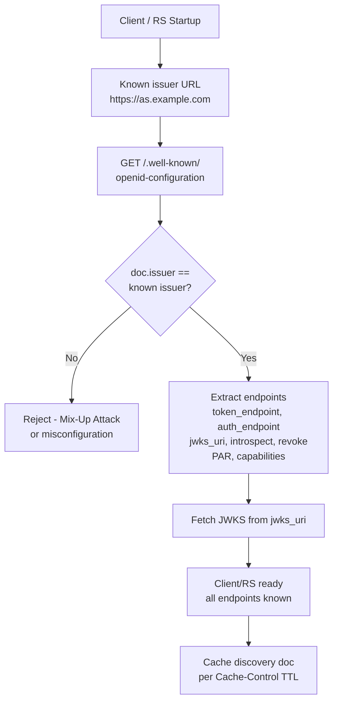

⚡ TL;DR - RFC 8414 (OAuth 2.0 Authorization Server Metadata)
and OpenID Connect Discovery define a well-known JSON document
that describes every endpoint and capability of an AS. Clients
and RSes fetch `/.well-known/oauth-authorization-server` (RFC
8414) or `/.well-known/openid-configuration` (OIDC) to
discover: token endpoint URL, authorization endpoint,
introspection endpoint, JWKS URI, supported grant types,
response types, client authentication methods, and claimed
security features. Without discovery, endpoint URLs and
capabilities must be hardcoded - breaking on any AS
reconfiguration. With discovery, clients auto-configure from
a single URL. The security implication: clients must validate
the discovery document comes from the expected issuer and
must never accept discovery documents that change the issuer.

---

### 🔥 The Problem This Solves

**HARDCODED AS CONFIGURATION:**

Without discovery, an OAuth client must be manually configured
with: token endpoint URL, authorization endpoint URL, JWKS URI,
supported scopes, supported response types, and supported
algorithms. When an AS changes any URL (e.g., migration,
path change, TLS cert on new hostname), all clients must be
manually updated. For multi-tenant AS deployments (each tenant
has a different issuer), dynamic client configuration is
impossible without discovery. RFC 8414 standardizes AS
self-description so clients can bootstrap from a single URL.

---

### 📘 Textbook Definition

RFC 8414 defines a JSON document published at a well-known
URL that describes the AS's configuration. OIDC Discovery
(OpenID Connect Core + Discovery specs) extends this for
OIDC-specific claims.

**Well-known URLs:**
- OAuth 2.0: `https://{issuer}/.well-known/oauth-authorization-server`
- OIDC: `https://{issuer}/.well-known/openid-configuration`
- For issuers with path component: insert before path segment

**Required fields (RFC 8414):**
- `issuer`: AS's identifier (MUST match issuer in tokens)
- `token_endpoint`: Token endpoint URL
- `jwks_uri`: JWKS endpoint URL
- `response_types_supported`: Supported response types

**Important optional fields:**
- `authorization_endpoint`: /authorize URL
- `scopes_supported`: Supported scope values
- `grant_types_supported`: Supported grant types
- `token_endpoint_auth_methods_supported`: `client_secret_basic`, `private_key_jwt`, `tls_client_auth`...
- `code_challenge_methods_supported`: `S256` (or `plain`)
- `pushed_authorization_request_endpoint`: /par URL (RFC 9126)
- `introspection_endpoint`: /introspect URL (RFC 7662)
- `revocation_endpoint`: /revoke URL (RFC 7009)
- `require_pushed_authorization_requests`: If true, all clients MUST use PAR
- `dpop_signing_alg_values_supported`: DPoP-supported algs (RFC 9449)

**Security requirement (issuer validation):**
RFC 8414 §3: the `issuer` field in the discovery document
MUST be identical to the URL used to fetch the document
(minus the `/.well-known/...` suffix). Clients MUST reject
any discovery document where `issuer` doesn't match. This
prevents Mix-Up Attacks where a malicious AS serves a
discovery document with a different issuer's endpoints.

---

### ⏱️ Understand It in 30 Seconds

**Bootstrap from one URL:**

```
WITHOUT DISCOVERY (fragile):
  Client config.json:
    "token_endpoint": "https://as.example.com/oauth/token"
    "auth_endpoint": "https://as.example.com/oauth/authorize"
    "jwks_uri": "https://as.example.com/oauth/v1/jwks"
    "issuer": "https://as.example.com"
  Problem: AS moves /oauth/v1/jwks to /jwks → all clients break

WITH DISCOVERY (resilient):
  Client knows ONE URL:
    "issuer": "https://as.example.com"

  At startup, client fetches:
    GET https://as.example.com/.well-known/openid-configuration
  Response: {
    "issuer": "https://as.example.com",       ← validate this!
    "token_endpoint": "https://as.example.com/token",
    "authorization_endpoint": "https://as.example.com/authorize",
    "jwks_uri": "https://as.example.com/jwks",
    "scopes_supported": ["openid","profile","email"],
    "code_challenge_methods_supported": ["S256"],
    "pushed_authorization_request_endpoint":
      "https://as.example.com/par",
    "require_pushed_authorization_requests": true,
    ...
  }

  Client uses these URLs directly.
  AS changes /token path: only discovery doc changes.
  Clients auto-pick up new URL on next discovery fetch.
```

---

### ⚙️ How It Works (Mechanism)

```
┌──────────────────────────────────────────────────────────┐
│  DISCOVERY DOCUMENT VALIDATION CHAIN                      │
├──────────────────────────────────────────────────────────┤
│                                                           │
│  CLIENT STARTUP:                                          │
│  1. Known: issuer = "https://as.example.com"              │
│  2. Compute discovery URL:                                │
│     Option A (OIDC): issuer +                             │
│       "/.well-known/openid-configuration"                 │
│     Option B (RFC 8414): issuer +                         │
│       "/.well-known/oauth-authorization-server"           │
│  3. Fetch over HTTPS (server cert validates issuer host)  │
│  4. CRITICAL: Validate doc["issuer"] == known issuer      │
│     IF mismatch: REJECT. Possible Mix-Up Attack.          │
│  5. Extract and store endpoint URLs + capabilities        │
│  6. Fetch JWKS from doc["jwks_uri"]                       │
│  7. Cache discovery doc (per Cache-Control header)        │
│                                                           │
│  MULTI-TENANT SCENARIO:                                   │
│  Tenant A: issuer = "https://as.example.com/tenants/acme"│
│  Discovery URL:                                           │
│    "https://as.example.com/tenants/acme"                  │
│    + "/.well-known/openid-configuration"                  │
│    = "https://as.example.com/tenants/acme/               │
│       .well-known/openid-configuration"                   │
│  Each tenant has different JWKS, different endpoints.     │
│  Spring Security: JwtIssuerAuthenticationManagerResolver  │
│  fetches discovery doc per issuer claim in JWT.           │
└──────────────────────────────────────────────────────────┘
```



---

### 💻 Code Example

**Example 1 - BAD then GOOD: Hardcoded vs discovery-based config:**

```python
# BAD: Hardcoded AS endpoints
# Problem: Any AS reconfiguration breaks all clients.
# Problem: Cannot support multi-tenant or dynamic AS selection.

TOKEN_ENDPOINT = "https://as.example.com/oauth2/token"
AUTH_ENDPOINT = "https://as.example.com/oauth2/authorize"
JWKS_URI = "https://as.example.com/oauth2/v1/keys"
# WRONG: these are fragile - AS may change paths at any time
```

```python
# GOOD: Dynamic configuration via AS discovery
# WHY: Client bootstraps from a single issuer URL.
#   All endpoint URLs come from the AS's own metadata.
#   AS path changes don't break clients (discovery doc updates).

import requests, time
from typing import Optional

class OAuthServerMetadata:
    """
    RFC 8414 / OIDC Discovery metadata client.
    Fetches, validates, and caches AS configuration.
    """

    def __init__(
        self,
        issuer: str,
        cache_ttl_seconds: int = 86400,  # 24h default
    ):
        self._issuer = issuer.rstrip('/')
        self._cache_ttl = cache_ttl_seconds
        self._metadata: Optional[dict] = None
        self._fetched_at: float = 0

    def _discovery_url(self) -> str:
        """
        Construct OIDC discovery URL from issuer.
        Per RFC 8414/OIDC: append /.well-known path.
        """
        return (
            f"{self._issuer}/.well-known/openid-configuration"
        )

    def _fetch(self) -> dict:
        """Fetch and validate discovery document."""
        url = self._discovery_url()
        resp = requests.get(url, timeout=10)
        resp.raise_for_status()
        doc = resp.json()

        # CRITICAL SECURITY CHECK: issuer must match
        # RFC 8414 §3: reject if issuer doesn't match
        doc_issuer = doc.get("issuer", "").rstrip('/')
        if doc_issuer != self._issuer:
            raise SecurityError(
                f"Discovery issuer mismatch: "
                f"expected='{self._issuer}', "
                f"got='{doc_issuer}'. "
                f"Possible Mix-Up Attack."
            )

        return doc

    def _get_metadata(self) -> dict:
        """Return cached or freshly-fetched metadata."""
        if (self._metadata is None or
                time.time() - self._fetched_at >
                self._cache_ttl):
            self._metadata = self._fetch()
            self._fetched_at = time.time()
        return self._metadata

    @property
    def token_endpoint(self) -> str:
        return self._get_metadata()["token_endpoint"]

    @property
    def authorization_endpoint(self) -> str:
        return self._get_metadata()["authorization_endpoint"]

    @property
    def jwks_uri(self) -> str:
        return self._get_metadata()["jwks_uri"]

    @property
    def par_endpoint(self) -> Optional[str]:
        return self._get_metadata().get(
            "pushed_authorization_request_endpoint"
        )

    @property
    def par_required(self) -> bool:
        return self._get_metadata().get(
            "require_pushed_authorization_requests", False
        )

    @property
    def supports_dpop(self) -> bool:
        return bool(self._get_metadata().get(
            "dpop_signing_alg_values_supported"
        ))

    def supports_code_challenge_method(
        self, method: str = "S256"
    ) -> bool:
        supported = self._get_metadata().get(
            "code_challenge_methods_supported", []
        )
        return method in supported

# Usage:
as_meta = OAuthServerMetadata("https://as.example.com")
# All URLs come from discovery - never hardcoded:
print(as_meta.token_endpoint)
print(as_meta.par_endpoint)
print(as_meta.par_required)  # Should enforce PAR?
print(as_meta.supports_dpop)  # Should use DPoP?
```

**Example 2 - Spring Security: auto-configuration from issuer:**

```java
// Spring Security auto-configures RS from OIDC discovery.
// Only the issuer URI needs to be provided.

@Configuration
public class ResourceServerConfig {

    @Value("${spring.security.oauth2.resourceserver.jwt.issuer-uri}")
    private String issuerUri;

    @Bean
    public SecurityFilterChain securityFilterChain(
        HttpSecurity http
    ) throws Exception {
        http
            .oauth2ResourceServer(oauth2 -> oauth2
                // Spring fetches issuerUri/.well-known/
                // openid-configuration to discover:
                // - jwks_uri (for key fetching)
                // - issuer (for validation)
                // All via JwtDecoderFromIssuerUriBuilder
                .jwt(jwt -> jwt.issuerUri(issuerUri))
            );
        return http.build();
    }
}
```

```yaml
# application.yml: only issuer URI needed
spring:
  security:
    oauth2:
      resourceserver:
        jwt:
          # Spring discovers jwks_uri from this issuer's metadata
          issuer-uri: https://as.example.com
          # Do NOT need to configure jwks-uri separately;
          # Spring fetches it from the discovery document.
```

---

### ⚖️ Comparison Table

| Configuration Method | Maintainability | Multi-tenant | AS Change Resilience | Security |
|---|---|---|---|---|
| **Hardcoded endpoints** | Low (manual updates) | No | Breaks on any change | N/A |
| **Config file** | Medium (re-deploy on change) | Limited | Partial | N/A |
| **RFC 8414 discovery** | High (auto-bootstrap) | Yes (per issuer) | Resilient | Must validate issuer |
| **OIDC discovery + Spring** | Very high (2 lines config) | Yes | Fully automatic | Built-in issuer validation |

---

### ⚠️ Common Misconceptions

| Misconception | Reality |
|---|---|
| Discovery document `issuer` validation is optional boilerplate | Issuer validation in the discovery document is a critical security control against Mix-Up Attacks. RFC 8414 §3 mandates it. If a malicious party can serve a fake discovery document (DNS hijack, MITM), they could point the `token_endpoint` to their server while keeping `authorization_endpoint` as the real AS. Users would authenticate at the real AS, but their code would be sent to the attacker's token endpoint. Issuer validation prevents this: the doc's `issuer` must match the URL you configured. |
| The discovery endpoint changes frequently and should not be cached | Discovery documents are stable - they change only when the AS is reconfigured (path changes, new features). Cache them aggressively (24h is common). Most frameworks re-fetch on startup or on a daily schedule. The AS should set appropriate `Cache-Control` headers on the discovery endpoint to signal the expected cache lifetime. Over-fetching discovery on every API call is wasteful. |
| Clients only need `token_endpoint` and `jwks_uri` from discovery | Discovery documents contain security capability information that clients should use to auto-configure security features: `code_challenge_methods_supported` → whether to use PKCE; `pushed_authorization_request_endpoint` → whether PAR is available; `require_pushed_authorization_requests` → whether PAR is mandatory; `dpop_signing_alg_values_supported` → whether DPoP is supported. A client that ignores these may skip security features the AS offers or expects. |

---

### 🚨 Failure Modes & Diagnosis

**Discovery Document Returns Wrong Issuer**

**Symptom:**
Client initialization fails with "Discovery issuer mismatch"
after deploying to a new environment. The discovery endpoint
is reachable but the `issuer` in the document doesn't match
the configured issuer URI.

**Root Cause:**
The AS is configured with a different issuer value than what
clients expect. Common in migrations: staging AS still has
the production issuer URL in its config, or the AS is behind
a proxy that changes the host.

**Diagnostic:**

```bash
# Check what the discovery endpoint actually returns:
curl -s https://as.example.com/.well-known/openid-configuration \
  | python -m json.tool | grep '"issuer"'

# Expected: "issuer": "https://as.example.com"
# If it returns: "issuer": "https://old-as.example.com"
# → AS is misconfigured with wrong issuer
```

**Fix:**
1. Update the AS configuration to set `issuer` to the correct
   URL (the base URL that clients will use, not a legacy URL).
2. In Keycloak: change `frontendUrl` in realm settings.
3. In Spring Authorization Server: update `issuer` in
   `AuthorizationServerSettings`.
4. Verify: re-fetch discovery and confirm `issuer` matches.

---

### 🔗 Related Keywords

**Prerequisites:**
- `Authorization Server Architecture` - the AS context
- `JWKS and Public Key Discovery` - discovered via discovery

**Builds On:**
- `OAuth 2.0 Mix-Up Attack` - attacks that discovery prevents
- `Authorization Server Clustering` - discovery in HA setups

---

### 📌 Quick Reference Card

```
┌──────────────────────────────────────────────────────────┐
│ OIDC URL     │ {issuer}/.well-known/openid-configuration │
│ RFC 8414     │ {issuer}/.well-known/oauth-authorization- │
│              │   server                                  │
├──────────────┼───────────────────────────────────────────┤
│ REQUIRED     │ issuer, token_endpoint, jwks_uri,         │
│ FIELDS       │ response_types_supported                  │
├──────────────┼───────────────────────────────────────────┤
│ VALIDATE     │ doc.issuer MUST == configured issuer      │
│              │ Reject if mismatch (Mix-Up Attack defense)│
├──────────────┼───────────────────────────────────────────┤
│ CACHE        │ Cache aggressively (24h). Re-fetch on     │
│              │ startup or daily. Respect Cache-Control.  │
├──────────────┼───────────────────────────────────────────┤
│ USE IT FOR   │ Auto-detect PAR, DPoP, PKCE support,      │
│              │ endpoint URLs. Don't hardcode any URLs.   │
├──────────────┼───────────────────────────────────────────┤
│ ONE-LINER    │ "One issuer URL → all AS config. Validate │
│              │  doc.issuer matches. Never hardcode URLs."│
└──────────────────────────────────────────────────────────┘
```

**If you remember only 3 things:**

1. RFC 8414 / OIDC Discovery gives clients all AS endpoint
   URLs from a single well-known URL. Never hardcode
   `token_endpoint`, `jwks_uri`, or any other AS URL.
   Bootstrap from `issuer` + discovery URL suffix.

2. ALWAYS validate that the discovery document's `issuer`
   field matches the issuer you configured. This prevents
   Mix-Up Attacks where a malicious discovery doc redirects
   OAuth traffic to attacker-controlled endpoints.

3. Discovery documents contain security capability metadata
   (`code_challenge_methods_supported`, `pushed_authorization_
   request_endpoint`, `dpop_signing_alg_values_supported`).
   Use this to auto-configure security features rather than
   relying on documentation or manual configuration.
