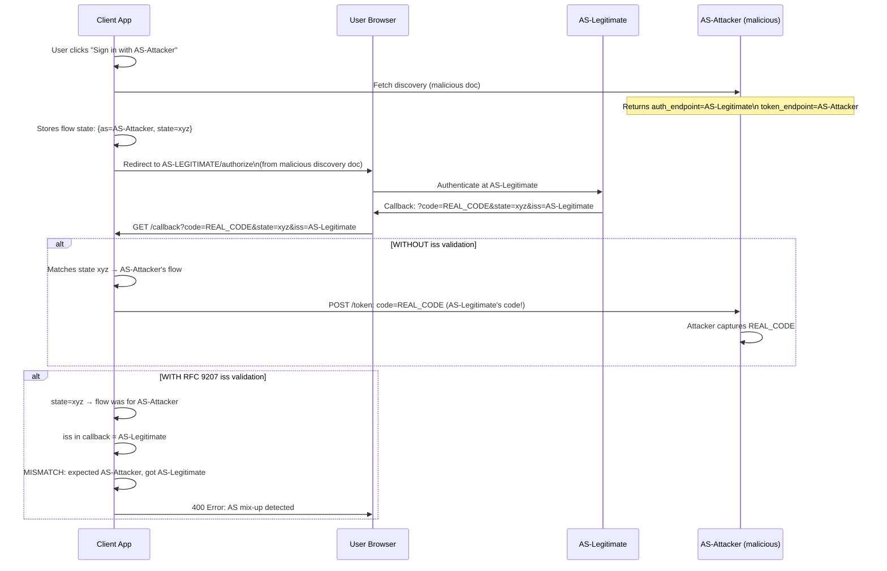

⚡ TL;DR - The OAuth Mix-Up Attack exploits clients that
support multiple Authorization Servers (AS): an attacker
tricks the client into sending an authorization code (or
access token) that was issued by AS-A to AS-B's token
endpoint. This happens when a malicious AS-B is registered
alongside legitimate AS-A - the attacker's AS-B instructs
the client to use AS-A for authorization but AS-B's own
token endpoint. The client then sends the code to AS-B,
which can exchange it (if AS-B can impersonate the client
to AS-A) or capture it. Defense: `iss` response parameter
(RFC 9207) - the client must bind the authorization code
to the issuer that created it and reject codes mixed
between ASes. PAR also prevents mix-up by binding the
AS interaction at the push step.

---

### 🔥 The Problem This Solves

**THE MULTI-AS IDENTITY CONFUSION PROBLEM:**

Applications that offer "Sign in with Google", "Sign in with
GitHub", and "Sign in with Okta" support multiple AS
simultaneously. Each AS has its own discovery URL, endpoints,
and keys. If the client doesn't carefully track which AS
issued which authorization response, an attacker who controls
one of the registered ASes can redirect responses from a
legitimate AS to their own token endpoint. The vulnerability
is in the gap between "which AS initiated this authorization"
and "where the code came back from" - if these are tracked
separately with no binding, mixing is possible.

---

### 📘 Textbook Definition

The OAuth 2.0 Mix-Up Attack (formalized in RFC 9700 §4.4
and draft-ietf-oauth-security-topics) is a class of attacks
targeting OAuth clients that interact with multiple
authorization servers.

**Attack preconditions:**
1. The client supports multiple AS (multi-IdP).
2. One of the registered AS is attacker-controlled (malicious AS).
3. The client doesn't properly bind authorization responses
   to the specific AS that initiated the flow.

**Attack mechanism:**
The malicious AS (AS-Attacker) configures its discovery
metadata to instruct the client to use AS-Legitimate's
`authorization_endpoint` but AS-Attacker's own `token_endpoint`
(or the client already has this configuration from a
misconfigured registration).

**Attack variants:**
- Classic: malicious AS returns manipulated discovery doc.
- Cross-AS code injection: authorization response from
  AS-A is injected into a flow intended for AS-B.
- IdP mix-up via redirect: authorization code response
  is redirected to a different client/AS combination.

**Defense: `iss` response parameter (RFC 9207):**
RFC 9207 adds an `iss` parameter to the authorization
response at the callback URL. The client must verify that
`iss` in the callback matches the AS that was used for
authorization. This creates a response-to-AS binding.
Clients MUST use `iss` response validation when supporting
multiple AS with the same redirect URI.

---

### ⏱️ Understand It in 30 Seconds

**The attack flow:**

```
SETUP:
  Client supports 3 ASes: Google, GitHub, AS-Attacker
  Client registers same redirect_uri for all.

ATTACK FLOW:
  1. Client: "Sign in with Google"
     → Sends user to Google's /authorize
     → Google issues auth code CODE-G

  2. BETWEEN redirect: Attacker intercepts callback URL
     (network MitM, or malicious JavaScript on the page)
     Attacker changes: response URL from Google's callback
     to look like it came from AS-Attacker's callback

  3. Client receives callback (now appears to be AS-Attacker)
     WITHOUT iss validation:
       Client sends CODE-G to AS-Attacker's /token endpoint!
       AS-Attacker now has Google auth code
       Can attempt to exchange it with Google using its
       registered client credentials with Google

  WITH RFC 9207 iss VALIDATION:
     Callback URL: ?code=CODE-G&state=...&iss=https://as.attacker
     Client: "I initiated a Google flow; iss in callback
             says as.attacker; MISMATCH → reject"
     Attack fails.
```

---

### ⚙️ How It Works (Mechanism)

```
┌──────────────────────────────────────────────────────────┐
│  MIX-UP ATTACK DETAILED FLOW                              │
├──────────────────────────────────────────────────────────┤
│                                                           │
│  Legitimate flow: Client → AS-Legitimate → Client         │
│  Attack flow:     Client → AS-Legitimate + AS-Attacker    │
│                                                           │
│  AS-Attacker's discovery document (malicious):            │
│  {                                                        │
│    "issuer": "https://as-attacker.com",                   │
│    "authorization_endpoint":                              │
│       "https://as-legitimate.com/authorize",  ← REAL!    │
│    "token_endpoint":                                      │
│       "https://as-attacker.com/token"  ← ATTACKER'S!     │
│  }                                                        │
│                                                           │
│  1. User: "Sign in with AS-Attacker"                      │
│     Client reads attacker's discovery doc                  │
│     Uses: as-legitimate.com/authorize (per malicious doc) │
│     Redirects user to AS-LEGITIMATE (real auth)           │
│                                                           │
│  2. User authenticates at AS-Legitimate                   │
│     AS-Legitimate redirects to client:                    │
│     https://app.com/callback?code=REAL-CODE               │
│     &state=attacker-initiated-state                       │
│                                                           │
│  3. Client: callback matched to "AS-Attacker" flow        │
│     (because state was generated for AS-Attacker)         │
│     Sends REAL-CODE to as-attacker.com/token             │
│     = code from AS-Legitimate sent to AS-Attacker's server│
│                                                           │
│  DEFENSE: RFC 9207 iss in callback:                       │
│     AS-Legitimate adds iss=as-legitimate.com to callback  │
│     Client: state was for AS-Attacker,                    │
│             but iss in callback = AS-Legitimate           │
│             MISMATCH → reject immediately                 │
└──────────────────────────────────────────────────────────┘
```



---

### 💻 Code Example

**Example 1 - BAD then GOOD: Missing iss validation:**

```python
# BAD: Multi-AS client without iss response validation
# Vulnerable to mix-up attacks

import secrets
from flask import request, redirect, session

AS_CONFIG = {
    "google": {
        "authorization_endpoint":
            "https://accounts.google.com/o/oauth2/auth",
        "token_endpoint":
            "https://oauth2.googleapis.com/token",
        "client_id": "google-client-id",
    },
    "github": {
        "authorization_endpoint":
            "https://github.com/login/oauth/authorize",
        "token_endpoint":
            "https://github.com/login/oauth/access_token",
        "client_id": "github-client-id",
    },
}

@app.route('/login/<provider>')
def login_bad(provider: str):
    if provider not in AS_CONFIG:
        return 400
    state = secrets.token_urlsafe(32)
    session['state'] = state
    session['provider'] = provider  # Remember which AS
    config = AS_CONFIG[provider]
    return redirect(
        f"{config['authorization_endpoint']}?"
        f"client_id={config['client_id']}&"
        f"state={state}&response_type=code"
    )

@app.route('/callback')
def callback_bad():
    state = request.args.get('state')
    code = request.args.get('code')
    # WRONG: Only validates state, not iss
    if state != session.get('state'):
        return 403
    provider = session.get('provider')
    config = AS_CONFIG[provider]
    # WRONG: code might be from a different AS
    # but we send it to 'provider's token endpoint
    tokens = exchange_code(
        config['token_endpoint'], code
    )
    # Attack: code from Google sent to GitHub's endpoint
```

```python
# GOOD: Multi-AS client with RFC 9207 iss validation
# WHY: Binds the authorization response to the specific AS
#   that was expected. Mix-up where a different AS issues
#   the code is detected and rejected.

import secrets, requests
from flask import request, redirect, session, abort
from urllib.parse import urlencode

def fetch_oidc_metadata(issuer: str) -> dict:
    """Fetch and cache OIDC discovery document."""
    url = f"{issuer}/.well-known/openid-configuration"
    resp = requests.get(url, timeout=10)
    resp.raise_for_status()
    doc = resp.json()
    # VALIDATE issuer in doc matches configured issuer
    if doc.get("issuer", "").rstrip('/') != issuer.rstrip('/'):
        raise SecurityError(
            f"OIDC issuer mismatch in discovery doc"
        )
    return doc

AS_ISSUERS = {
    "google": "https://accounts.google.com",
    "github": "https://token.actions.githubusercontent.com",
    "company": "https://as.example.com",
}

@app.route('/login/<provider>')
def login(provider: str):
    if provider not in AS_ISSUERS:
        abort(400, "Unknown provider")

    issuer = AS_ISSUERS[provider]
    metadata = fetch_oidc_metadata(issuer)

    state = secrets.token_urlsafe(32)
    session['state'] = state
    session['expected_issuer'] = issuer  # Store EXPECTED issuer
    session['provider'] = provider

    params = urlencode({
        "client_id": get_client_id(provider),
        "response_type": "code",
        "state": state,
        "redirect_uri": "https://app.example.com/callback",
    })
    return redirect(
        f"{metadata['authorization_endpoint']}?{params}"
    )

@app.route('/callback')
def callback():
    state = request.args.get('state')
    code = request.args.get('code')
    # RFC 9207: iss in authorization response
    response_iss = request.args.get('iss')

    # Validate state (CSRF protection)
    if state != session.get('state'):
        abort(403, "State mismatch (CSRF)")

    expected_issuer = session.get('expected_issuer')
    provider = session.get('provider')

    # CRITICAL: Validate iss response parameter
    # This prevents Mix-Up Attacks
    if response_iss:
        if (response_iss.rstrip('/') !=
                expected_issuer.rstrip('/')):
            abort(403,
                f"AS Mix-Up detected: "
                f"expected={expected_issuer}, "
                f"got={response_iss}"
            )
    else:
        # iss not present: AS doesn't support RFC 9207
        # Fall back: ensure we trust this AS independently
        # Use PAR which pre-binds the AS interaction
        pass

    # Only send code to the EXPECTED provider's token endpoint
    metadata = fetch_oidc_metadata(expected_issuer)
    tokens = exchange_code(
        metadata['token_endpoint'],
        code,
        provider,
    )
    # Mix-up defense: code from Google → only goes to Google
```

---

### ⚖️ Comparison Table

| Defense Mechanism | Prevents Mix-Up | Requires AS Support | RFC |
|---|---|---|---|
| **State parameter only** | No | No | RFC 6749 |
| **`iss` response parameter** | Yes | Yes (AS must include iss) | RFC 9207 |
| **PAR** | Partial (AS binding at push step) | Yes (AS must support /par) | RFC 9126 |
| **PAR + `iss` validation** | Yes (strongest) | Both PAR + RFC 9207 | RFC 9126 + 9207 |

---

### ⚠️ Common Misconceptions

| Misconception | Reality |
|---|---|
| Mix-up attacks only matter if you control an AS | Mix-up attacks require a malicious AS registered in the client's configuration. For public SaaS apps that allow users to bring their own OIDC provider (enterprise SSO, "Sign in with your company IdP"), an attacker could register a malicious AS with a manipulated discovery document. This is a real-world threat model for any multi-tenant app supporting custom OIDC providers. |
| The state parameter prevents mix-up attacks | The state parameter prevents CSRF (cross-site request forgery) - an attacker from a different origin injecting a forged callback. State does NOT prevent mix-up. State is bound to the user's session and the AS initiating the flow - but in a mix-up attack, the state IS valid (it was generated by the client for the attacker-initiated flow). The issue is that the CODE came from a different AS than intended. |
| Using separate redirect URIs per AS prevents mix-up | If each AS uses a different redirect URI (e.g., `/callback/google`, `/callback/github`), the client can identify the AS from the callback path rather than from the `iss` parameter. This is an alternative mitigation. However, if the attacker's malicious discovery document uses the legitimate AS's redirect URI (not the attacker's), this approach fails. RFC 9207 `iss` parameter is the standardized, more robust defense. |

---

### 🚨 Failure Modes & Diagnosis

**Mix-Up Attack in Production via OIDC Provider Compromise**

**Symptom:**
Security monitoring detects token exchange requests to one
AS's `/token` endpoint using authorization codes that were
issued by a different AS. Users report unexpectedly being
able to access other users' resources.

**Diagnostic:**

```python
# Detect mix-up in application logs
# Log both: which AS was intended AND what iss appeared in callback

@app.route('/callback')
def callback():
    response_iss = request.args.get('iss')
    expected_issuer = session.get('expected_issuer')

    app.logger.info(
        "callback received",
        extra={
            "expected_issuer": expected_issuer,
            "response_iss": response_iss,
            "state": request.args.get('state', '')[:8],
            "mix_up_detected": (
                response_iss and
                response_iss.rstrip('/') !=
                expected_issuer.rstrip('/')
            ),
        }
    )
```

**Fix:**
1. Implement RFC 9207 `iss` validation immediately.
2. Require PAR for all flows to pre-bind the AS interaction.
3. Audit discovery documents: manually inspect each
   registered AS's discovery doc for endpoint tampering.
4. If the attack is ongoing: revoke all tokens and force
   re-authentication. Remove the compromised AS registration.

---

### 🔗 Related Keywords

**Prerequisites:**
- `Authorization Code Flow` - the flow being attacked
- `AS Metadata Discovery` - how malicious discovery doc is used

**Builds On:**
- `Token Substitution Attack` - related code injection attack
- `Pushed Authorization Requests (PAR)` - provides AS binding

---

### 📌 Quick Reference Card

```
┌──────────────────────────────────────────────────────────┐
│ ATTACK       │ Multi-AS client: malicious AS serves      │
│ SUMMARY      │ discovery with real AS's auth endpoint +  │
│              │ attacker's token endpoint                 │
├──────────────┼───────────────────────────────────────────┤
│ RFC 9207     │ AS adds iss= to callback URL              │
│ DEFENSE      │ Client validates: callback iss == expected │
│              │ issuer. Reject if mismatch.               │
├──────────────┼───────────────────────────────────────────┤
│ SESSION      │ Store expected_issuer in session before   │
│ STATE        │ redirect. Compare in callback.            │
├──────────:   │                                           │
├──────────┼───────────────────────────────────────────    │
│ PAR LAYER    │ Request pushed to AS before redirect =    │
│              │ AS interaction pre-bound. Limits attack.  │
├──────────┼───────────────────────────────────────────────┤
│ ONE-LINER    │ "Multi-AS client: bind code to AS. iss in │
│              │  callback = who issued code. Validate it."│
└──────────────────────────────────────────────────────────┘
```

**If you remember only 3 things:**

1. Mix-Up Attacks target multi-AS clients. A malicious AS's
   discovery document points to a legitimate AS's auth
   endpoint but its own token endpoint, causing the client
   to send a legitimate code to the attacker.

2. Defense: RFC 9207 `iss` response parameter. The AS adds
   `iss` to the authorization callback. The client validates
   that the `iss` matches the expected AS for this flow.
   Always store `expected_issuer` in the session state
   before redirecting.

3. Single-AS applications are NOT vulnerable to mix-up
   attacks. Mix-up only applies when a client supports
   multiple ASes (social login, enterprise SSO with
   custom IdPs). For multi-AS: RFC 9207 + PAR is required.
