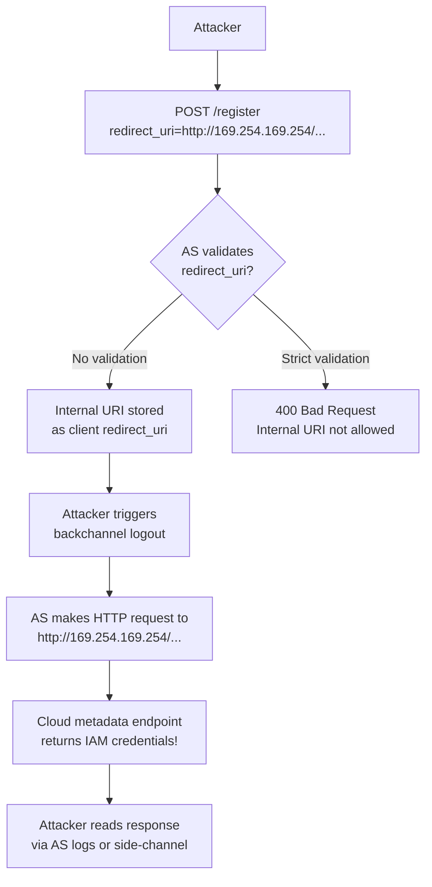

⚡ TL;DR - SSRF (Server-Side Request Forgery) via OAuth
redirect URI manipulation exploits an AS's token exchange
mechanism: instead of using the redirect URI for browser
redirect, it abuses the fact that some AS implementations
make server-side HTTP requests to the redirect URI during
backchannel operations (like backchannel logout, webhook
notifications, or dynamic client registration callbacks).
An attacker who can influence the redirect URI registered
for a client can cause the AS to make internal HTTP requests
to cloud metadata endpoints (169.254.169.254), internal
services, or the AS itself. Additionally, if the AS's
redirect URI validation is bypassed, the browser redirect
itself becomes an open redirect that can exfiltrate tokens.
Defense: strict redirect URI validation + SSRF mitigations
at any server-side callback mechanism.

---

### 🔥 The Problem This Solves

**WHEN THE OAUTH SERVER MAKES OUTBOUND REQUESTS:**

Most OAuth attacks focus on browser-based redirect flows.
But some AS features require the server to make outbound
HTTP requests using the redirect URI or registered callback
URLs: backchannel logout, CIBA (Client-Initiated Backchannel
Authentication), dynamic client registration callbacks,
webhook notifications for token events. If an attacker can
register a redirect URI pointing to an internal service
(cloud metadata, Redis, internal APIs), they can exploit
the AS as an SSRF proxy to reach internal infrastructure.

---

### 📘 Textbook Definition

Server-Side Request Forgery (SSRF) in OAuth context occurs
in two scenarios:

**Scenario 1: AS makes server-side requests to redirect URI**
When AS features involve server-side callbacks (backchannel
logout MUST use POST, CIBA callbacks, webhook notifications),
the AS makes HTTP requests to the registered redirect URI.
If the registered URI points to an internal service
(e.g., `http://169.254.169.254/latest/meta-data/`), the
AS becomes an SSRF proxy.

**Scenario 2: Authorization code sent to internal service**
If the AS's redirect URI validation is too permissive and
allows internal IPs or cloud-internal hostnames as registered
redirect URIs, the authorization code is delivered to an
internal service (acting as the "redirect"). The authorization
code + possibly the access token are then available to
whoever can read the internal service's logs or responses.

**Attack surfaces:**
1. Dynamic client registration (RFC 7591) - attacker
   registers a client with internal `redirect_uri`.
2. Backchannel logout - AS posts logout to internal URI.
3. AS admin APIs - if misconfigured to allow internal URIs
   in client registration.
4. SSRF in AS itself - if the AS fetches the issuer discovery
   URL from a user-provided `issuer` parameter (used in OIDC
   federation), attacker provides an internal URL.

---

### ⏱️ Understand It in 30 Seconds

**The two attack paths:**

```
ATTACK PATH 1: SSRF via Backchannel Logout
  1. Attacker registers client via dynamic registration:
     POST /register
     redirect_uris: ["http://169.254.169.254/latest/meta-data/"]
     backchannel_logout_uri: "http://169.254.169.254/..."

  2. Attacker initiates a logout event for the client.

  3. AS sends logout notification:
     POST http://169.254.169.254/latest/meta-data/
     → Returns AWS instance metadata (credentials!)
     AS may log/store the response.

ATTACK PATH 2: SSRF via OIDC Federation Discovery
  1. AS supports OIDC federation / third-party IdP login.
     User provides: "my issuer is https://..."
  2. AS fetches:
     GET https://attacker-controlled-server/
         .well-known/openid-configuration
     And follows redirects to the discovery doc.
  3. Attacker's discovery doc contains:
     "jwks_uri": "http://internal.service/anything"
  4. AS fetches JWKS from internal service:
     GET http://internal.service/anything
     → SSRF into internal network

DEFENSE:
  1. Validate redirect URIs: only HTTPS, no internal IPs/hostnames
  2. Block RFC 1918, link-local, and cloud metadata IPs
  3. Disable discovery URL follow-redirects / validate issuer
  4. Use dynamic registration guard (protected endpoint)
```

---

### ⚙️ How It Works (Mechanism)

```
┌──────────────────────────────────────────────────────────┐
│  SSRF SURFACE MAP IN OAUTH/OIDC                           │
├──────────────────────────────────────────────────────────┤
│                                                           │
│  FEATURE                │ SERVER-SIDE HTTP REQUEST        │
│─────────────────────────┼──────────────────────────────── │
│ Backchannel logout      │ POST to backchannel_logout_uri  │
│ CIBA                    │ POST to client_notification_    │
│                         │   endpoint                      │
│ Dynamic client reg      │ Validate redirect_uri reachable │
│   (some AS impls)       │   (optional, AS-specific)       │
│ OIDC federation         │ GET issuer/.well-known/...      │
│                         │   then GET jwks_uri             │
│ Webhook event delivery  │ POST to client event_endpoint   │
│─────────────────────────┼──────────────────────────────── │
│                                                           │
│  BLOCKED DESTINATIONS (must validate):                    │
│  - 169.254.169.254 (AWS/GCP/Azure cloud metadata)         │
│  - 10.0.0.0/8, 172.16.0.0/12, 192.168.0.0/16 (RFC 1918) │
│  - ::1, fc00::/7 (IPv6 private)                           │
│  - 127.0.0.0/8, ::1 (loopback)                            │
│  - Internal hostnames (redis.internal, database.local)    │
│  - Non-standard ports of public hosts                     │
│                                                           │
│  DEFENSE LAYERS:                                          │
│  1. Registration validation: reject internal URIs         │
│  2. Pre-request DNS resolution + IP check                 │
│  3. Network-level: egress firewall blocks internal ranges │
│  4. Dynamic reg requires client auth (not open)           │
│  5. OIDC discovery URL: validate issuer in doc matches    │
│     requested URL (prevents JWKS redirect to internal)    │
└──────────────────────────────────────────────────────────┘
```



---

### 💻 Code Example

**Example 1 - BAD then GOOD: redirect URI validation in AS:**

```python
# BAD: Redirect URI registered without SSRF validation
# Problem: internal IPs and cloud metadata URIs not blocked

from urllib.parse import urlparse

def register_client_bad(
    redirect_uris: list[str],
) -> dict:
    # WRONG: Only validates URL format, not destination
    for uri in redirect_uris:
        parsed = urlparse(uri)
        if not parsed.scheme in ('http', 'https'):
            raise ValueError("Invalid scheme")
        # MISSING: IP range validation
        # MISSING: hostname resolution check
        # MISSING: scheme enforcement (must be HTTPS)
    return store_client(redirect_uris)
```

```python
# GOOD: Redirect URI validation with SSRF protection
# WHY: Prevents the AS from being used as SSRF proxy
#   when it makes server-side requests to registered URIs.

import ipaddress, socket, re
from urllib.parse import urlparse

# Blocked IP ranges (RFC 1918, loopback, link-local, cloud meta)
BLOCKED_RANGES = [
    ipaddress.ip_network("10.0.0.0/8"),
    ipaddress.ip_network("172.16.0.0/12"),
    ipaddress.ip_network("192.168.0.0/16"),
    ipaddress.ip_network("127.0.0.0/8"),        # Loopback
    ipaddress.ip_network("169.254.0.0/16"),     # Link-local
    ipaddress.ip_network("100.64.0.0/10"),      # Carrier-grade NAT
    ipaddress.ip_network("::1/128"),            # IPv6 loopback
    ipaddress.ip_network("fc00::/7"),           # IPv6 private
    ipaddress.ip_network("fe80::/10"),          # IPv6 link-local
]

BLOCKED_HOSTS = {
    "169.254.169.254",  # AWS/GCP/Azure metadata
    "metadata.google.internal",
    "localhost",
    "metadata",
}

BLOCKED_HOST_PATTERNS = [
    re.compile(r'\.internal$'),
    re.compile(r'\.local$'),
    re.compile(r'\.corp$'),
    re.compile(r'^10\.'),
]

def is_internal_address(host: str) -> bool:
    """Check if a hostname resolves to an internal IP."""
    if host in BLOCKED_HOSTS:
        return True
    for pattern in BLOCKED_HOST_PATTERNS:
        if pattern.search(host):
            return True
    try:
        # Resolve the hostname to check IP range
        # Note: DNS rebinding is still possible; use network
        # egress firewall as the definitive control.
        addr_info = socket.getaddrinfo(host, None)
        for info in addr_info:
            ip_str = info[4][0]
            ip_obj = ipaddress.ip_address(ip_str)
            for blocked in BLOCKED_RANGES:
                if ip_obj in blocked:
                    return True
    except socket.gaierror:
        # Can't resolve = treat as suspicious (fail-closed)
        return True
    return False

def validate_redirect_uri_ssrf_safe(uri: str) -> None:
    """
    Validate redirect URI is safe for registration.
    Blocks internal IPs, cloud metadata endpoints,
    and private ranges. For production AS registration.
    """
    try:
        parsed = urlparse(uri)
    except Exception:
        raise ValueError("Invalid URI format")

    # Must be HTTPS for production URIs
    # (http allowed only for localhost - native apps)
    if parsed.scheme not in ('https', 'http'):
        raise ValueError(
            f"Scheme '{parsed.scheme}' not allowed. "
            f"Use https."
        )

    if parsed.scheme == 'http':
        # Only allow http for localhost / loopback
        # (native app OAuth flows - RFC 8252)
        if parsed.hostname not in ('localhost', '127.0.0.1'):
            raise ValueError(
                "http only allowed for localhost. "
                "Use https for all other URIs."
            )

    if not parsed.hostname:
        raise ValueError("Redirect URI must have a hostname")

    if is_internal_address(parsed.hostname):
        raise ValueError(
            f"Redirect URI hostname '{parsed.hostname}' "
            f"resolves to an internal/reserved address. "
            f"Internal URIs cannot be registered."
        )

def register_client(
    redirect_uris: list[str],
    backchannel_logout_uri: str | None = None,
) -> dict:
    """Register client with SSRF-safe URI validation."""
    for uri in redirect_uris:
        validate_redirect_uri_ssrf_safe(uri)

    if backchannel_logout_uri:
        validate_redirect_uri_ssrf_safe(backchannel_logout_uri)
        # backchannel logout MUST be HTTPS (not localhost)
        parsed = urlparse(backchannel_logout_uri)
        if parsed.scheme != 'https':
            raise ValueError(
                "backchannel_logout_uri must use https"
            )

    return store_client(redirect_uris, backchannel_logout_uri)
```

**Example 2 - Defense: OIDC federation discovery URL validation:**

```python
# AS: validate OIDC issuer before fetching discovery
# Prevents SSRF via user-provided issuer URLs

def fetch_oidc_metadata_safe(
    user_provided_issuer: str,
    allowed_issuer_allowlist: set | None = None,
) -> dict:
    """
    Fetch OIDC discovery for an external IdP.
    Validates issuer before fetching.
    Prevents SSRF via malicious issuer URLs.
    """
    # If using an allowlist (most secure): only allow known
    # external IdPs to be configured by admin
    if allowed_issuer_allowlist is not None:
        if user_provided_issuer not in allowed_issuer_allowlist:
            raise ValueError(
                f"Issuer not in allowlist: "
                f"{user_provided_issuer}"
            )

    # Validate the issuer URL itself for SSRF
    # (belt-and-suspenders defense even with allowlist)
    issuer_uri = urlparse(user_provided_issuer)
    if issuer_uri.scheme != 'https':
        raise ValueError("Issuer must use https")
    if is_internal_address(issuer_uri.hostname):
        raise ValueError(
            "Issuer hostname resolves to internal address"
        )

    discovery_url = (
        f"{user_provided_issuer.rstrip('/')}"
        "/.well-known/openid-configuration"
    )

    import requests
    resp = requests.get(
        discovery_url,
        timeout=5,
        allow_redirects=False,  # Do NOT follow redirects
        # Following redirects could redirect to internal!
    )
    if resp.is_redirect:
        raise ValueError(
            "Redirect in discovery URL not allowed"
        )
    resp.raise_for_status()
    doc = resp.json()

    # Validate issuer in doc matches requested issuer
    if doc.get("issuer", "").rstrip('/') != \
            user_provided_issuer.rstrip('/'):
        raise ValueError("Discovery issuer mismatch")

    # Validate jwks_uri is also external (not internal)
    jwks_uri = doc.get("jwks_uri", "")
    if jwks_uri:
        jwks_parsed = urlparse(jwks_uri)
        if is_internal_address(jwks_parsed.hostname):
            raise ValueError(
                "jwks_uri in discovery doc is internal"
            )

    return doc
```

---

### ⚖️ Comparison Table

| Attack Vector | Exploits | Defense | OWASP |
|---|---|---|---|
| **Redirect URI → internal IP** | Permissive URI validation | Exact match + IP blocklist | A10 SSRF |
| **Backchannel logout → metadata** | AS makes server-side requests | Validate all registered callback URIs | A10 SSRF |
| **OIDC discovery → internal JWKS** | AS follows jwks_uri in federated IdP doc | Validate jwks_uri, no-redirect fetches | A10 SSRF |
| **Open redirect at callback** | Weak redirect URI check | Exact-match URI registration | A01 Broken Access |

---

### ⚠️ Common Misconceptions

| Misconception | Reality |
|---|---|
| SSRF in OAuth only matters for high-privilege AS deployments | SSRF via OAuth redirect URI is particularly dangerous in cloud environments where the instance metadata endpoint (169.254.169.254) is accessible from the AS. Compromising the cloud metadata endpoint gives the attacker IAM role credentials with the AS instance's privileges - potentially full access to the cloud account. This is not a low-severity issue in cloud deployments. |
| Exact-match redirect URI validation prevents SSRF | Exact-match validation prevents attackers from registering URIs after the fact (redirect URI hijacking). But for SSRF via OAuth, the concern is an attacker who CAN register a new client (via dynamic registration, a compromised admin account, or a vulnerable registration API). Exact-match validation is necessary but not sufficient - you must also validate that the registered URI is not an internal IP. |
| IP allowlisting at the network level makes application-level validation unnecessary | Network egress filtering (blocking 169.254.0.0/16) is the defense-in-depth layer, not the primary control. Application-level validation provides earlier detection and better error messages. DNS rebinding attacks can bypass hostname-based validation - an attacker registers a public domain that resolves to an internal IP during the AS's outbound request. Both layers (application validation + network egress) are needed. |

---

### 🚨 Failure Modes & Diagnosis

**SSRF via OIDC jwks_uri in Federated Discovery**

**Symptom:**
AS support tickets report errors when users try to authenticate
via a new enterprise IdP. The AS logs show HTTP requests to
internal service hostnames that should not be externally
reachable.

**Diagnostic:**

```bash
# Check AS network logs for unexpected outbound requests
# Focus on: requests made during OIDC federation flow

# In AS access logs, look for requests TO internal addresses:
grep "169.254.169.254" /var/log/authorization-server/access.log
grep "10\." /var/log/authorization-server/outbound.log

# Check if AS made requests to internal metadata endpoint:
# These appear as GET requests initiated by the AS itself
# to cloud metadata or internal service URLs
```

**Fix:**
1. Add SSRF validation to all code paths where the AS makes
   outbound HTTP requests (OIDC discovery, JWKS fetch,
   backchannel logout, webhook delivery).
2. Add network egress filtering (firewall rule blocking
   169.254.169.254, RFC 1918 ranges from the AS host).
3. Require admin approval for new OIDC federation configs
   rather than allowing self-service (reduces attack surface).
4. Add `allow_redirects=False` to all AS outbound requests.

---

### 🔗 Related Keywords

**Prerequisites:**
- `Redirect URI Validation` - the primary attack surface
- `Dynamic Client Registration (RFC 7591)` - SSRF entry point

**Builds On:**
- `Token Substitution Attack` - related attack chain
- `OAuth Production Debugging` - detecting SSRF in logs

---

### 📌 Quick Reference Card

```
┌──────────────────────────────────────────────────────────┐
│ SSRF VECTORS │ Backchannel logout to internal URI        │
│ IN OAUTH     │ OIDC jwks_uri pointing internally         │
│              │ Dynamic reg with internal redirect_uri    │
├──────────────┼───────────────────────────────────────────┤
│ BLOCK        │ 169.254.169.254, RFC 1918, loopback        │
│              │ .internal, .local, .corp domains          │
├──────────────┼───────────────────────────────────────────┤
│ VALIDATE     │ All registered URIs (redirect, logout,    │
│              │ notification endpoint) at registration    │
├──────────────┼───────────────────────────────────────────┤
│ FEDERATION   │ Validate issuer before discovery fetch    │
│              │ allow_redirects=False on discovery fetch  │
│              │ Validate jwks_uri is not internal         │
├──────────────┼───────────────────────────────────────────┤
│ ONE-LINER    │ "AS makes server-side requests to         │
│              │  registered URIs. Block internal targets."│
└──────────────────────────────────────────────────────────┘
```

**If you remember only 3 things:**

1. SSRF in OAuth occurs when the AS makes server-side HTTP
   requests to attacker-controlled URIs (backchannel logout,
   OIDC discovery, JWKS fetch). Validate all registered
   callback URIs at registration to block internal IPs and
   cloud metadata endpoints.

2. OIDC federation is a high-risk SSRF surface: the AS
   fetches a user-provided discovery URL, then the `jwks_uri`
   from that doc. Both must be validated. Never follow
   redirects during discovery fetch.

3. Network-level egress filtering (blocking 169.254.169.254,
   RFC 1918 ranges) is the defense-in-depth safety net.
   Application-level validation is the primary control.
   Both layers are needed.
