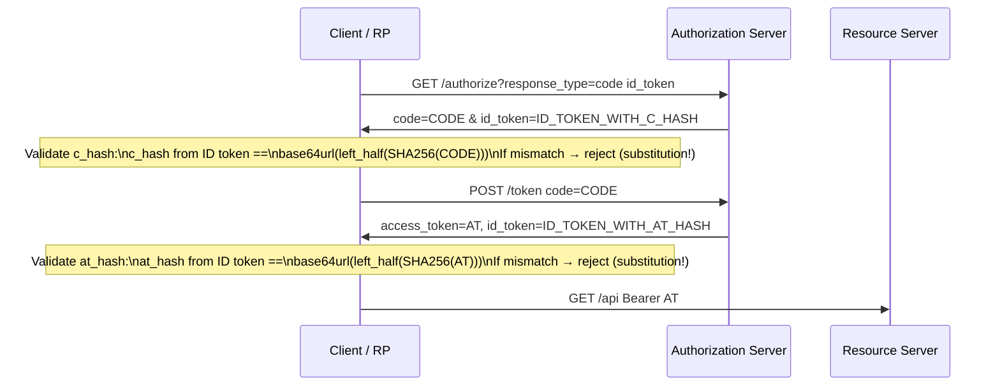

⚡ TL;DR - A token substitution attack replaces a valid
token in a multi-step OAuth/OIDC flow with a token from
a different flow (different user, different client, or
different AS). The classic variant: an attacker obtains
an ID token issued for their own account, then injects
it into another user's session during the OIDC callback
(ID token substitution). Defense uses token binding
claims in the ID token: `at_hash` binds the AT to the
ID token (LEFT-HALF(SHA256(AT)) in base64url), `c_hash`
binds the authorization code to the ID token. The client
must validate both claims before accepting tokens from
any multi-step flow.

---

### 🔥 The Problem This Solves

**WHEN TOKENS FROM DIFFERENT FLOWS ARE INTERCHANGEABLE:**

OAuth and OIDC involve multiple tokens in a single flow
(authorization code, access token, ID token). If the
client only validates that each individual token is valid
(signature, expiry, audience) without validating that all
tokens in the flow came from the SAME authorization event,
an attacker can substitute one of the tokens from a
different flow. The most impactful variant is ID token
substitution: the attacker's ID token (valid, signed,
for the attacker's identity) is injected where a victim's
ID token is expected, granting the attacker the victim's
session. The `at_hash` and `c_hash` claims exist precisely
to make this attack impossible by cryptographically binding
all tokens in a flow together.

---

### 📘 Textbook Definition

A token substitution attack injects a token from one
authorization flow into a different flow's processing
context. The attack exploits clients or RPs that validate
each token in isolation rather than validating that all
tokens in a flow are mutually bound.

**OIDC token binding claims (the defense):**

**`at_hash` (access token hash):**
Left half of the SHA-256 hash of the access token value,
base64url encoded. Bound in the ID token at issuance time.

```
at_hash = base64url(left_half(SHA256(access_token_value)))
```

If the client receives an AT and ID token together
(in `code` + `token` hybrid response, or in `code id_token
token` response), it MUST compute `at_hash` from the AT
and verify it matches `at_hash` in the ID token.
A substituted AT (from a different flow) produces a
different `at_hash` and MUST be rejected.

**`c_hash` (code hash):**
Left half of SHA-256 of the authorization code value,
base64url encoded. Bound in the ID token when using
hybrid flows where the ID token appears in the
authorization response alongside the code.

```
c_hash = base64url(left_half(SHA256(code_value)))
```

**When to validate:**

| Response Type | at_hash required | c_hash required |
|---|---|---|
| `code` | NO (AT not visible at callback) | NO (ID token not at callback) |
| `code id_token` | NO | YES (ID token appears with code) |
| `token` | N/A (implicit, avoid this) | N/A |
| `code token` | YES (AT visible at callback) | NO |
| `code id_token token` | YES | YES |

---

### ⏱️ Understand It in 30 Seconds

**The attack and the binding defense:**

```
ATTACK: ID Token Substitution

  Normal OIDC code flow:
    1. AS issues code → Client exchanges for AT + ID token
    2. Client uses ID token to establish session (sub = victim)

  Attack (attacker has their own OIDC account):
    1. Attacker authenticates, gets ID token (sub = attacker)
    2. Attacker intercepts/manipulates the callback for victim
    3. Substitutes victim's code (or token exchange response)
       with attacker's own ID token
    4. Client sees valid ID token (sig OK, aud OK) → logs in
       attacker as if attacker is the victim

DEFENSE: at_hash and c_hash

  ID token contains:
    at_hash = base64url(left_half(SHA256(VICTIM_AT)))
    c_hash  = base64url(left_half(SHA256(VICTIM_CODE)))

  Attacker's ID token contains:
    at_hash = base64url(left_half(SHA256(ATTACKER_AT)))
    c_hash  = base64url(left_half(SHA256(ATTACKER_CODE)))

  When client receives VICTIM_AT but ATTACKER_ID_TOKEN:
    Compute: base64url(left_half(SHA256(VICTIM_AT)))
    Compare to: at_hash in ATTACKER_ID_TOKEN
    MISMATCH → reject substitution attack
```

---

### ⚙️ How It Works (Mechanism)

```
┌──────────────────────────────────────────────────────────┐
│  TOKEN BINDING MECHANISM IN OIDC                          │
├──────────────────────────────────────────────────────────┤
│                                                           │
│  Authorization Code Flow (hybrid response_type):          │
│                                                           │
│  CLIENT                AS                RS              │
│    │                    │                 │              │
│    │─ GET /authorize ──►│                 │              │
│    │  response_type=     │                 │              │
│    │  code+id_token      │                 │              │
│    │                    │                 │              │
│    │◄─ code + ID token ─│                 │              │
│    │   (in callback)    │                 │              │
│    │                    │                 │              │
│    │  Validate c_hash:  │                 │              │
│    │  ID.c_hash ==       │                 │              │
│    │  base64url(left(   │                 │              │
│    │  SHA256(code)))    │                 │              │
│    │                    │                 │              │
│    │─ POST /token ─────►│                 │              │
│    │  code=...          │                 │              │
│    │◄─ AT + ID token ───│                 │              │
│    │                    │                 │              │
│    │  Validate at_hash:  │                 │              │
│    │  ID.at_hash ==      │                 │              │
│    │  base64url(left(   │                 │              │
│    │  SHA256(AT)))      │                 │              │
│    │                    │                 │              │
│    │─ GET /api ────────────────────────►  │              │
│    │  Authorization: Bearer AT           │              │
│                                                           │
└──────────────────────────────────────────────────────────┘
```



---

### 💻 Code Example

**Example 1 - BAD then GOOD: Missing at_hash validation:**

```python
# BAD: OIDC token validation without at_hash check
# Problem: An attacker can substitute the access token
#   with one from another flow; client won't detect it.

import jwt  # PyJWT

def validate_tokens_bad(
    id_token: str,
    access_token: str,
    client_id: str,
    issuer: str,
    jwks_client,
) -> dict:
    # Validate ID token signature and claims
    signing_key = jwks_client.get_signing_key_from_jwt(id_token)
    id_claims = jwt.decode(
        id_token,
        signing_key.key,
        algorithms=["RS256"],
        audience=client_id,
        issuer=issuer,
    )
    # WRONG: Uses ID token claims directly without validating
    # that the access_token is bound to THIS ID token.
    # A substituted AT (from a different user's flow)
    # will pass this validation.
    return id_claims
```

```python
# GOOD: OIDC token validation with at_hash and c_hash
# WHY: Cryptographically verifies that the AT and code
#   belong to the same authorization event as the ID token.
#   Prevents token substitution attacks.

import hashlib, base64
import jwt
from typing import Literal


def compute_token_hash(token_value: str) -> str:
    """
    Compute at_hash or c_hash per OIDC Core §3.3.2.11
    LEFT-HALF(SHA256(token)) base64url-encoded
    """
    digest = hashlib.sha256(token_value.encode()).digest()
    left_half = digest[:len(digest) // 2]  # Left half = first 16 bytes
    return base64.urlsafe_b64encode(left_half).rstrip(b'=').decode()


def validate_token_hash(
    token_value: str,
    token_hash_claim: str | None,
    claim_name: Literal['at_hash', 'c_hash'],
    required: bool = True,
) -> None:
    """
    Validate at_hash or c_hash claim in an ID token.
    Raises ValueError if validation fails.

    Args:
        token_value: The raw token (AT or code) whose hash
            should match the ID token claim.
        token_hash_claim: Value of at_hash or c_hash from
            the ID token claims dict.
        claim_name: 'at_hash' or 'c_hash'
        required: If True, raise error when claim is absent.
    """
    if token_hash_claim is None:
        if required:
            raise ValueError(
                f"ID token missing required claim: {claim_name}. "
                f"Cannot verify token binding. "
                f"Possible token substitution attack."
            )
        # Claim absent + not required: skip validation
        # (e.g., plain code flow where c_hash is optional)
        return

    expected = compute_token_hash(token_value)
    if expected != token_hash_claim:
        raise ValueError(
            f"{claim_name} mismatch: "
            f"expected={expected}, got={token_hash_claim}. "
            f"Token substitution attack detected: "
            f"the token is not bound to this ID token."
        )


def validate_oidc_tokens(
    id_token: str,
    access_token: str | None,
    authorization_code: str | None,
    client_id: str,
    issuer: str,
    jwks_client,
    response_type: str,
) -> dict:
    """
    Full OIDC token validation with at_hash and c_hash.

    response_type determines which hash checks apply:
      - 'code': no at_hash or c_hash needed (code flow)
      - 'code id_token': c_hash required (hybrid)
      - 'code id_token token': both at_hash + c_hash required

    Returns: validated ID token claims dict
    """
    # Step 1: Validate ID token signature + standard claims
    signing_key = jwks_client.get_signing_key_from_jwt(id_token)
    id_claims = jwt.decode(
        id_token,
        signing_key.key,
        algorithms=["RS256"],
        audience=client_id,
        issuer=issuer,
        options={"require": ["exp", "iat", "sub", "aud", "iss"]}
    )

    # Step 2: Validate at_hash if AT is present
    if access_token is not None:
        at_hash_required = 'token' in response_type
        validate_token_hash(
            access_token,
            id_claims.get('at_hash'),
            'at_hash',
            required=at_hash_required,
        )

    # Step 3: Validate c_hash if code is present
    # and ID token appeared alongside the code
    # (hybrid flow: response_type contains 'id_token' AND 'code')
    if authorization_code is not None:
        c_hash_required = (
            'id_token' in response_type and
            'code' in response_type
        )
        validate_token_hash(
            authorization_code,
            id_claims.get('c_hash'),
            'c_hash',
            required=c_hash_required,
        )

    return id_claims


# Production usage:
# Step 1: Receive hybrid callback
# code = request.args['code']
# id_token_callback = request.args['id_token']  # if hybrid
# Validate c_hash here with the callback ID token

# Step 2: Exchange code for AT + new ID token
# token_response = exchange_code(code)
# at = token_response['access_token']
# id_token_token = token_response['id_token']
# Validate at_hash here with the token endpoint ID token

claims = validate_oidc_tokens(
    id_token=token_response['id_token'],
    access_token=token_response['access_token'],
    authorization_code=None,   # Code already exchanged
    client_id="my-client-id",
    issuer="https://as.example.com",
    jwks_client=jwks_client,
    response_type="code",      # at_hash optional for plain code
)
```

---

### ⚖️ Comparison Table

| Token Attack | Mechanism | Binding Defense |
|---|---|---|
| **ID token substitution** | Replace ID token with attacker's | `aud` = client_id + `nonce` match |
| **AT substitution** | Replace AT with token from different flow | `at_hash` in ID token binds AT |
| **Code substitution** | Inject code from different flow | `c_hash` in ID token binds code |
| **Cross-AS substitution** | Use token from different AS | `iss` + `aud` validation + RFC 9207 |

---

### ⚠️ Common Misconceptions

| Misconception | Reality |
|---|---|
| Signature validation prevents token substitution | Signature validation only proves the token was issued by the legitimate AS. It does NOT prove the token belongs to THIS user's current flow. An attacker can obtain a legitimately signed ID token for their own account (valid signature, valid issuer) and substitute it. Token binding (`at_hash`, `c_hash`) is the additional layer that binds tokens within a single flow. |
| at_hash validation is only needed for hybrid flows | `at_hash` is required when the access token and ID token are returned together in the SAME response (hybrid response types). For standard authorization code flow (response_type=code), the AT and ID token are both returned from the token endpoint in the same response - but `at_hash` is OPTIONAL in that case per the spec. However, including and validating `at_hash` even in code flow is a defense-in-depth measure against malicious AS responses. |
| Only OIDC flows are vulnerable to token substitution | Pure OAuth 2.0 flows without OIDC can also be subject to token substitution: an attacker with a valid AT for a different user attempts to use it at a Resource Server that doesn't enforce audience and subject claims. The AT binding approach for pure OAuth is different (sender-constrained tokens via DPoP or mTLS). OIDC `at_hash` is specific to OIDC hybrid flows. |

---

### 🚨 Failure Modes & Diagnosis

**at_hash Mismatch in Production (Genuine Substitution Attempt)**

**Symptom:**
Application logs show `at_hash` validation failures in the
OIDC callback handler. The failures originate from a few
IP addresses, and each failure involves a different user's
ID token paired with the current user's access token.

**Diagnostic:**

```python
# Log token binding validation failures with context
# for security investigation

def validate_oidc_tokens_with_logging(
    id_token, access_token, client_id, issuer,
    jwks_client, response_type, request_ip,
):
    try:
        claims = validate_oidc_tokens(
            id_token, access_token, None,
            client_id, issuer, jwks_client, response_type,
        )
        return claims
    except ValueError as e:
        if 'at_hash mismatch' in str(e) or \
                'c_hash mismatch' in str(e):
            # Potential active attack - alert security
            security_logger.critical(
                "Token binding validation failure",
                extra={
                    "error": str(e),
                    "client_ip": request_ip,
                    "sub_in_id_token": _extract_sub(id_token),
                    "event": "token_substitution_attempt",
                }
            )
        raise
```

**Fix:**
1. Implement `at_hash` and `c_hash` validation immediately.
2. Audit the AS to understand how the substitution
   occurred (compromised user account? rogue AS node?).
3. Invalidate all active sessions and force re-auth.
4. If using hybrid response types, consider switching to
   plain `response_type=code` (simpler, eliminates
   callback-stage ID token substitution risk).

---

### 🔗 Related Keywords

**Prerequisites:**
- `OIDC ID Token Structure` - at_hash and c_hash live here
- `Hybrid Flow` - c_hash is required in hybrid callback

**Builds On:**
- `OAuth 2.0 Mix-Up Attack` - closely related attack pattern
- `Token Audience Validation` - aud is part of substitution defense

---

### 📌 Quick Reference Card

```
┌──────────────────────────────────────────────────────────┐
│ at_hash      │ base64url(left_half(SHA256(AT_value)))     │
│              │ In ID token. Binds AT to ID token.        │
│              │ Validate when AT + ID token returned       │
│              │ together.                                 │
├──────────────┼───────────────────────────────────────────┤
│ c_hash       │ base64url(left_half(SHA256(code_value)))  │
│              │ Binds auth code to ID token.              │
│              │ Validate in hybrid flow callback.         │
├──────────────┼───────────────────────────────────────────┤
│ REQUIRED     │ code id_token → c_hash required           │
│ WHEN         │ code id_token token → both required       │
│              │ code (plain) → neither required           │
├──────────────┼───────────────────────────────────────────┤
│ ATTACK       │ Attacker's valid ID token + victim's AT   │
│ PATTERN      │ at_hash mismatch = detected & rejected    │
├──────────────┼───────────────────────────────────────────┤
│ ONE-LINER    │ "at_hash binds AT to ID token.            │
│              │  Substituted AT = hash mismatch = reject."│
└──────────────────────────────────────────────────────────┘
```

**If you remember only 3 things:**

1. Token substitution: an attacker injects a valid token
   from their own flow into another user's session. The
   individual token is valid (signature OK, expiry OK) but
   belongs to the wrong flow. Standard validation misses this.

2. Defense: `at_hash` in ID token = SHA256 left half of AT
   value, base64url encoded. Client must compute `at_hash`
   from the received AT and compare to the claim in the ID
   token. Mismatch = reject. `c_hash` does the same for the
   authorization code in hybrid flows.

3. For plain authorization code flow (`response_type=code`),
   `at_hash` is optional in the spec. But hybrid flows
   that expose the ID token at the callback (`code id_token`)
   MUST validate `c_hash`. Always validate when the claim
   is present.
