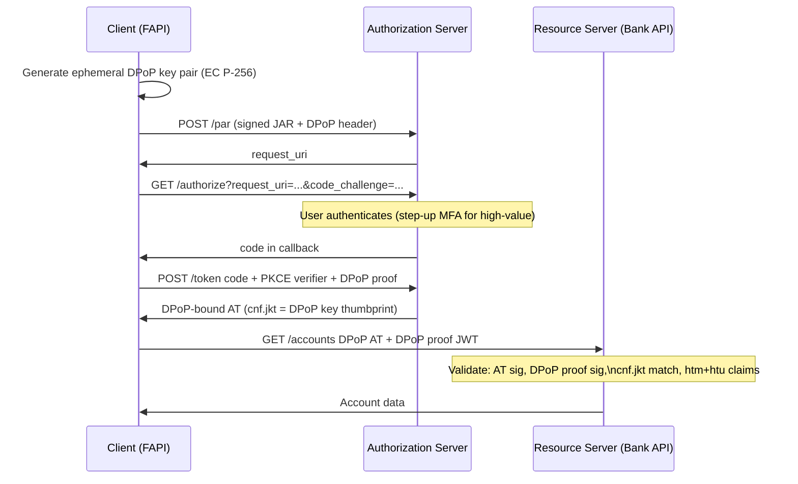

⚡ TL;DR - FAPI (Financial-grade API) is the OpenID
Foundation's security profile that hardenes OAuth 2.0
and OIDC for banking, payments, and open finance. FAPI 1.0
Advanced requires: PAR (Pushed Authorization Requests),
JAR (JWT-secured authorization requests), mTLS or private
key JWT client authentication, PKCE, sender-constrained
tokens (mTLS cert-bound or DPoP), and response_type=code
only. FAPI 2.0 (2023) builds on this, making PAR + DPoP
the preferred baseline. Used by Open Banking UK, Australia
CDR, Berlin Group (EU), and Brazil Open Finance. The goal:
even if TLS is compromised or traffic is observed, tokens
can't be replayed by an adversary.

---

### 🔥 The Problem This Solves

**WHY STANDARD OAUTH ISN'T ENOUGH FOR BANKS:**

Financial APIs expose payment initiation and account data
where a stolen token could cause immediate financial harm.
Standard OAuth 2.0 access tokens are bearer tokens: anyone
who obtains the token can use it. TLS protects tokens in
transit but: a compromised proxy, leaked log, or token
intercepted at the AS before TLS can lead to full account
access. FAPI requires sender-constrained tokens (bound to
a specific client certificate or DPoP key), so a stolen
token is useless without the corresponding private key.
Additionally, FAPI mandates signed authorization requests
to prevent AS response manipulation and strong client
authentication to eliminate client_secret-based attacks.

---

### 📘 Textbook Definition

FAPI is a set of OAuth 2.0 / OIDC security profiles
defined by the OpenID Foundation for high-security APIs:

**FAPI 1.0 (two parts):**
- FAPI 1.0 Baseline: PKCE, short-lived ATs, HTTPS-only,
  `response_type=code` recommended.
- FAPI 1.0 Advanced: All of baseline PLUS mTLS or
  private_key_jwt client auth, PAR, JAR (RFC 9101),
  sender-constrained tokens, restricted scopes.

**FAPI 2.0 (2023 baseline):**
- Simplified profile based on OIDC and OAuth 2.1 principles.
- Requires: PAR + PKCE, `code` response type, DPoP or mTLS
  sender-constraining, private_key_jwt or mTLS client auth.
- Eliminates: Implicit flow, hybrid response types, and
  client_secret_post entirely.

**Key FAPI requirements matrix:**

| Requirement | FAPI 1.0 Baseline | FAPI 1.0 Advanced | FAPI 2.0 |
|---|---|---|---|
| PKCE | Required | Required | Required |
| PAR | Optional | Required | Required |
| JAR | Optional | Required | Recommended |
| mTLS / DPoP | Optional | Required | Required |
| Client auth | PKCE sufficient | mTLS/private_key_jwt | private_key_jwt/mTLS |
| response_type | code recommended | code only | code only |
| AT lifetime | Short | Very short (<5 min) | Short |

**Sender-constrained tokens (the core security property):**
A FAPI access token is bound to the client that requested it.
Two mechanisms:
- mTLS certificate-bound tokens: AT contains `cnf.x5t#S256`
  (thumbprint of client cert). RS validates that the cert
  used to present the token matches the thumbprint.
- DPoP tokens: AT contains `cnf.jkt` (JWK thumbprint of
  DPoP public key). Client presents a DPoP proof (signed
  JWT) on every request. RS validates proof + AT binding.

---

### ⏱️ Understand It in 30 Seconds

**FAPI vs standard OAuth 2.0 in 60 seconds:**

```
STANDARD OAUTH 2.0 AT REQUEST:
  1. Client redirects user to AS
  2. User authenticates, code returned
  3. Client POSTs code to /token
  4. Receives AT (bearer token)
  5. Presents AT to RS: Authorization: Bearer <AT>
  Weak points: AT is a bearer token. Stolen = usable anywhere.

FAPI 2.0 AT REQUEST:
  1. Client: generate DPoP key pair (ephemeral)
  2. Client: PAR → POST signed JAR to /par
     → Receives request_uri
  3. Client redirects user with request_uri + PKCE
  4. User authenticates (with MFA at the AS)
  5. Client POSTs code + PKCE verifier + DPoP proof to /token
  6. Receives DPoP-bound AT (AT contains cnf.jkt = DPoP key thumbprint)
  7. Per-request: generates DPoP proof JWT signed by the key
  8. Presents AT + DPoP proof to RS
     RS validates: DPoP proof signature + AT's cnf.jkt matches
  Stolen AT is useless without the DPoP private key.
```

---

### ⚙️ How It Works (Mechanism)

```
┌──────────────────────────────────────────────────────────┐
│  FAPI 2.0 FULL FLOW WITH DPoP                             │
├──────────────────────────────────────────────────────────┤
│                                                           │
│  CLIENT                AS                RS              │
│    │                    │                 │              │
│    │ 1. Generate DPoP key pair (ephemeral EC P-256)       │
│    │                    │                 │              │
│    │─ PAR: POST /par ──►│                 │              │
│    │  (signed JAR body) │                 │              │
│    │  + DPoP header     │                 │              │
│    │◄─ request_uri ─────│                 │              │
│    │                    │                 │              │
│    │─ GET /authorize ──►│                 │              │
│    │  request_uri + PKCE│                 │              │
│    │  + client_id       │                 │              │
│    │                    │                 │              │
│    │◄─────── code ──────│                 │              │
│    │                    │                 │              │
│    │─ POST /token ─────►│                 │              │
│    │  code + verifier   │                 │              │
│    │  + DPoP proof JWT  │                 │              │
│    │  (signed by DPoP key)                │              │
│    │◄── DPoP-bound AT ──│                 │              │
│    │  AT.cnf.jkt =       │                 │              │
│    │  thumbprint(DPoP pub key)            │              │
│    │                    │                 │              │
│    │─ GET /api ────────────────────────►  │              │
│    │  Authorization: DPoP <AT>           │              │
│    │  DPoP: <proof JWT>                  │              │
│    │                    │                 │              │
│    │                    │   Validate:     │              │
│    │                    │   1. AT sig     │              │
│    │                    │   2. DPoP proof │              │
│    │                    │   3. cnf.jkt in AT == pub key  │
│    │                    │   4. htm + htu in proof        │
│    │◄──────────── 200 OK ────────────────│              │
└──────────────────────────────────────────────────────────┘
```



---

### 💻 Code Example

**Example 1 - BAD then GOOD: Bearer token vs DPoP at RS:**

```python
# BAD: Resource Server accepts bearer token without
# sender-constraining validation.
# Not FAPI-compliant. Stolen AT is immediately usable.

from flask import request, abort
import jwt

def validate_at_bearer_bad(jwks_client) -> dict:
    auth_header = request.headers.get('Authorization', '')
    if not auth_header.startswith('Bearer '):
        abort(401)
    token = auth_header[7:]
    # WRONG: only validates signature/claims - no sender binding
    key = jwks_client.get_signing_key_from_jwt(token)
    claims = jwt.decode(
        token, key.key, algorithms=["RS256"],
        audience="https://api.bank.example.com",
    )
    return claims
    # A stolen AT from logs/proxy can be replayed here!
```

```python
# GOOD: FAPI-compliant RS validates DPoP-bound access token
# WHY: Sender-constraining ensures the presenter holds the
#   DPoP private key. Stolen AT without the key = useless.
# Based on RFC 9449 DPoP validation at the RS.

import hashlib, base64, time
import jwt
from cryptography.hazmat.primitives.asymmetric.ec import (
    EllipticCurvePublicKey,
)
from cryptography.hazmat.primitives.serialization import (
    Encoding, PublicFormat,
)
from flask import request, abort

MAX_DPOP_AGE_SECONDS = 60  # DPoP proof max age

def validate_fapi_dpop_token(jwks_client) -> dict:
    """
    Validate a FAPI DPoP-bound access token at an RS.
    Steps per RFC 9449 §9:
    1. Validate AT signature and standard claims
    2. Validate DPoP proof JWT: signature, ath claim,
       htm (HTTP method), htu (HTTP URI), age
    3. Validate cnf.jkt in AT matches DPoP proof public key
    """
    # Step 1: Extract DPoP AT (not 'Bearer')
    auth_header = request.headers.get('Authorization', '')
    if not auth_header.startswith('DPoP '):
        abort(401, "DPoP token required (FAPI)")
    access_token = auth_header[5:]

    # Step 2: Validate AT signature + claims
    try:
        signing_key = jwks_client.get_signing_key_from_jwt(
            access_token
        )
        at_claims = jwt.decode(
            access_token,
            signing_key.key,
            algorithms=["PS256", "RS256", "ES256"],
            audience="https://api.bank.example.com",
            issuer="https://as.bank.example.com",
        )
    except Exception as e:
        abort(401, f"AT validation failed: {e}")

    # Step 3: Extract DPoP proof header
    dpop_proof = request.headers.get('DPoP', '')
    if not dpop_proof:
        abort(401, "DPoP proof required (FAPI)")

    # Decode DPoP proof header to get the public key
    try:
        unverified_header = jwt.get_unverified_header(
            dpop_proof
        )
    except Exception:
        abort(401, "Invalid DPoP proof format")

    if unverified_header.get('typ') != 'dpop+jwt':
        abort(401, "DPoP proof typ must be dpop+jwt")

    jwk_in_dpop = unverified_header.get('jwk')
    if not jwk_in_dpop:
        abort(401, "DPoP proof must embed public key in jwk")

    # Validate DPoP proof signature using embedded public key
    try:
        from jwt.algorithms import ECAlgorithm, RSAAlgorithm
        pub_key = ECAlgorithm.from_jwk(jwk_in_dpop)
        dpop_claims = jwt.decode(
            dpop_proof,
            pub_key,
            algorithms=["ES256"],
            options={"verify_exp": False},  # iat-based check below
        )
    except Exception as e:
        abort(401, f"DPoP proof signature invalid: {e}")

    # Step 4: Validate DPoP claims per RFC 9449
    now = int(time.time())
    iat = dpop_claims.get('iat', 0)
    if abs(now - iat) > MAX_DPOP_AGE_SECONDS:
        abort(401, "DPoP proof expired or too new")

    # htm: HTTP method must match current request
    if dpop_claims.get('htm', '').upper() != request.method.upper():
        abort(401, "DPoP htm mismatch")

    # htu: HTTP URI must match current request URL
    request_url = request.url.split('?')[0]  # Exclude query string
    if dpop_claims.get('htu', '').rstrip('/') != \
            request_url.rstrip('/'):
        abort(401, "DPoP htu mismatch")

    # ath: Access token hash - binds proof to THIS AT
    at_hash = base64.urlsafe_b64encode(
        hashlib.sha256(access_token.encode()).digest()
    ).rstrip(b'=').decode()
    if dpop_claims.get('ath') != at_hash:
        abort(401, "DPoP ath claim does not match AT")

    # Step 5: Validate cnf.jkt in AT matches DPoP key
    cnf = at_claims.get('cnf', {})
    jkt_in_at = cnf.get('jkt', '')

    # Compute JWK thumbprint of DPoP public key per RFC 7638
    import json
    jwk_for_thumbprint = {
        k: jwk_in_dpop[k]
        for k in sorted(jwk_in_dpop.keys())
        if k in ('crv', 'e', 'kty', 'n', 'x', 'y')
    }
    thumbprint = base64.urlsafe_b64encode(
        hashlib.sha256(
            json.dumps(jwk_for_thumbprint, separators=(',', ':'),
                       sort_keys=True).encode()
        ).digest()
    ).rstrip(b'=').decode()

    if jkt_in_at != thumbprint:
        abort(401,
            "AT sender-constraining failed: "
            "cnf.jkt does not match DPoP key"
        )

    return at_claims
```

---

### ⚖️ Comparison Table

| Profile | Sender Constraining | Client Auth | PAR | JAR |
|---|---|---|---|---|
| **Standard OAuth 2.0** | No (bearer) | client_secret_basic | No | No |
| **FAPI 1.0 Baseline** | Optional | PKCE sufficient | Optional | Optional |
| **FAPI 1.0 Advanced** | Required (mTLS) | mTLS/private_key_jwt | Required | Required |
| **FAPI 2.0** | Required (DPoP or mTLS) | private_key_jwt/mTLS | Required | Recommended |

---

### ⚠️ Common Misconceptions

| Misconception | Reality |
|---|---|
| FAPI is only relevant for banks and payment providers | FAPI's security requirements apply to any API that handles high-value resources where a stolen token would cause significant harm: healthcare data (SMART on FHIR uses FAPI), government identity systems, insurance, and enterprise APIs with high regulatory requirements. The pattern of sender-constraining + PAR + strong client auth is increasingly recommended for any API where regulatory compliance is required. |
| DPoP prevents all token theft scenarios | DPoP prevents replay attacks by an adversary who captures the AT from a log, proxy, or network tap. DPoP does NOT prevent an adversary who has both the AT AND the DPoP private key (compromised client host). In the mTLS binding model, the private key is protected by hardware security modules (HSMs) - this is stronger than software DPoP. FAPI 1.0 Advanced prefers mTLS because the private key in a banking context should be hardware-protected. |
| PKCE alone is sufficient for financial APIs | PKCE prevents authorization code interception attacks. But PKCE doesn't protect the AT once issued (bearer token). FAPI requires PKCE AND sender-constraining together: PKCE protects the authorization code exchange, DPoP/mTLS protects the AT at every RS request. Both protections serve different threat models and must both be present. |

---

### 🚨 Failure Modes & Diagnosis

**DPoP `htu` Mismatch in Production API Gateway**

**Symptom:**
FAPI clients receive 401 errors with "DPoP htu mismatch"
from the RS. The authorization flow succeeds (AT obtained),
but every API call fails DPoP validation. Affects all
clients, all users.

**Diagnostic:**

```python
# DPoP htu must match the EXACT URL the request was sent to.
# Common failures in production:
#   1. API gateway rewrites the URL (path prefix stripped)
#   2. Client uses http, gateway terminates TLS (https vs http)
#   3. Trailing slash mismatch
#   4. Port in htu vs no port in request URL

# Debug: log both the expected htu and what the RS receives
app.logger.debug(
    "DPoP htu validation",
    extra={
        "dpop_htu": dpop_claims.get('htu'),
        "request_url": request.url,
        "method": request.method,
        "x_forwarded_proto": request.headers.get(
            'X-Forwarded-Proto'
        ),
        "host": request.headers.get('Host'),
    }
)
```

**Fix:**
1. Ensure the `htu` in the client's DPoP proof matches
   the URL as seen by the RS (after gateway rewriting).
2. If the gateway strips path prefixes: configure the
   DPoP proof generation to use the RS-facing URL.
3. Use HTTPS everywhere - if TLS is terminated at the
   gateway and the RS receives http, DPoP proof must use
   `https://` in `htu`. Set `X-Forwarded-Proto` and use
   it to reconstruct the URL.

---

### 🔗 Related Keywords

**Prerequisites:**
- `mTLS Client Authentication for OAuth (RFC 8705)`
- `Pushed Authorization Requests (PAR)`
- `DPoP (RFC 9449)` - DPoP sender-constraining mechanism

**Builds On:**
- `Enterprise OAuth 2.0 Architecture Patterns`
- `Authorization Server Selection Framework`

---

### 📌 Quick Reference Card

```
┌──────────────────────────────────────────────────────────┐
│ FAPI 2.0      │ PAR + PKCE + code only                   │
│ BASELINE      │ DPoP or mTLS sender-constraining         │
│               │ private_key_jwt or mTLS client auth      │
├───────────────┼──────────────────────────────────────────┤
│ DPoP          │ AT.cnf.jkt = thumbprint(DPoP pub key)    │
│ BINDING       │ Per-request DPoP proof: ath + htm + htu  │
│               │ RS validates proof + cnf.jkt match       │
├───────────────┼──────────────────────────────────────────┤
│ mTLS          │ AT.cnf.x5t#S256 = cert thumbprint        │
│ BINDING       │ RS validates cert matches thumbprint     │
│               │ Better: HSM-protected private key        │
├───────────────┼──────────────────────────────────────────┤
│ ECOSYSTEMS    │ Open Banking UK, CDR (AU), Berlin Group   │
│               │ (EU), Brazil Open Finance, SMART on FHIR │
├───────────────┼──────────────────────────────────────────┤
│ ONE-LINER     │ "FAPI = OAuth hardened for finance.      │
│               │  Bearer tokens fail. Sender-constrain."  │
└──────────────────────────────────────────────────────────┘
```

**If you remember only 3 things:**

1. FAPI is OAuth + OIDC with mandatory sender-constraining
   (DPoP or mTLS). A stolen FAPI AT is useless without
   the client's DPoP private key or mTLS certificate.
   This is the core property that distinguishes FAPI from
   standard OAuth.

2. FAPI 2.0 requires: PAR (pre-authorize with signed request
   before redirect) + DPoP or mTLS + private_key_jwt/mTLS
   client auth. No client_secret, no implicit flow, no
   hybrid response types. `response_type=code` only.

3. DPoP proof claims that matter for RS validation:
   `ath` (AT hash), `htm` (HTTP method), `htu` (HTTP URI).
   AT must contain `cnf.jkt` = JWK thumbprint of DPoP key.
   All three claims must match the actual request context.

permalink: /technical-mastery/oauth/oauth-20-in-financial-services-fapi/
---