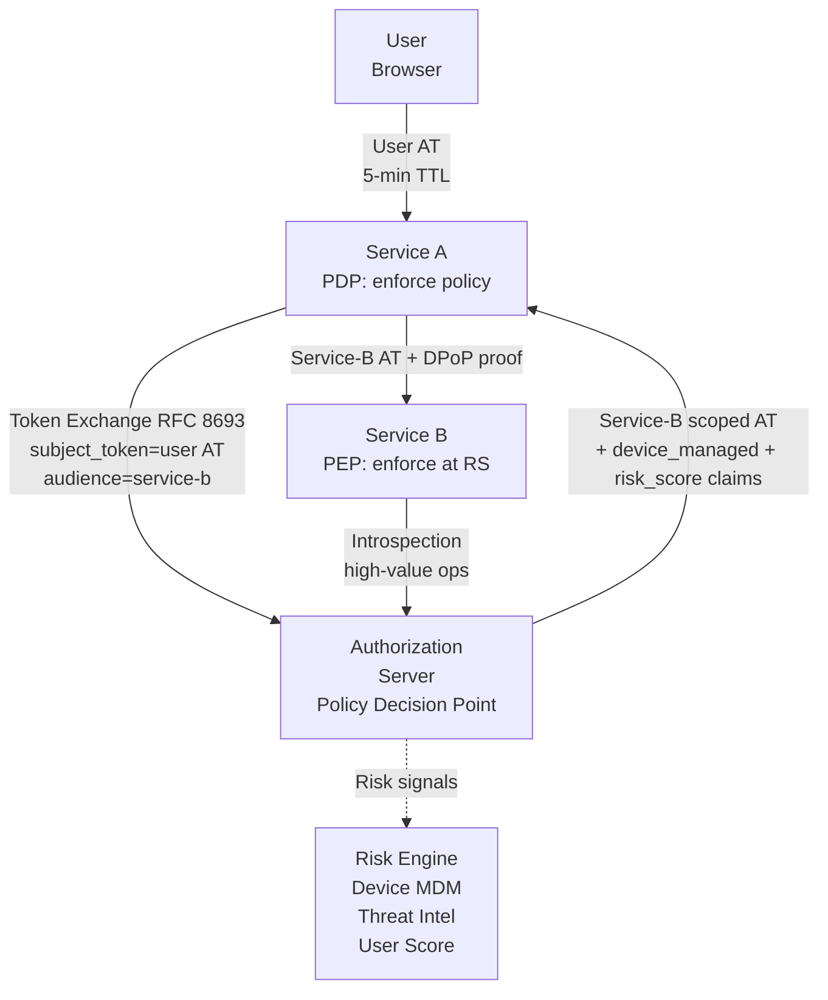

⚡ TL;DR - Zero Trust Architecture (ZTA, NIST SP 800-207)
replaces "trust the network" with "verify everything, always".
OAuth is ZTA's primary mechanism for service-to-service and
user-to-service authorization. In ZTA, OAuth adds three
properties beyond standard deployments: (1) short-lived
tokens (5-15 min AT lifetime, not 1 hour+), so compromise
windows are narrow; (2) continuous re-evaluation via
token introspection (not offline JWT validation), so the
AS can revoke access in real time based on risk signals;
(3) context-aware authorization using JWT claims for device
posture, network location, and risk score. The policy
decision point is the AS; the policy enforcement point is
the RS. Every service-to-service call requires a valid,
fresh token - even on the internal network.

---

### 🔥 The Problem This Solves

**PERIMETER SECURITY ASSUMPTIONS IN MICROSERVICES:**

Traditional perimeter security assumes that traffic inside
the network is trusted. A service at 10.0.0.5 doesn't need
to prove its identity to a service at 10.0.0.6 - they're
both "inside". Zero Trust eliminates this assumption.
In a microservices deployment, a single compromised service
can reach all other internal services without OAuth if the
network is trusted. OAuth in ZTA enforces that EVERY service
request - even internal calls - requires a valid, scoped,
short-lived access token with the caller's identity. The
compromise of one service doesn't automatically grant access
to all others. Each request is independently authorized.

---

### 📘 Textbook Definition

Zero Trust Architecture applied to OAuth means:

**Core principle:** "Never trust, always verify." Trust is
never derived from network location. Every request must
present proof of identity AND authorization, regardless of
whether it comes from inside or outside the network.

**ZTA applied to OAuth - five pillars:**

1. **Short-lived tokens:** AT lifetime 5-15 minutes.
   A stolen token from a compromised service expires quickly.
   No long-lived bearer credentials on the internal network.

2. **Sender-constrained tokens:** DPoP or mTLS binding
   ensures a stolen token is unusable without the client's
   private key. Prevents lateral movement even with a
   captured token.

3. **Continuous verification via introspection:** Instead of
   offline JWT validation (which caches decisions for the
   token's lifetime), high-risk operations use token
   introspection to query the AS in real time. The AS can
   revoke access mid-session when risk signals trigger
   (new device, anomalous location, threat intelligence hit).

4. **Context-aware authorization:** JWT access tokens carry
   context claims - device posture (MDM-enrolled, patched),
   network context (corporate IP, VPN), user risk score.
   The RS applies policy beyond scope: a payment API may
   require `device_managed: true` AND scope `payments:write`.

5. **Least-privilege scopes:** Every client is issued only
   the minimum scopes required. Service-to-service: client
   credentials flow with narrow scopes per upstream service.
   No shared service accounts with admin access.

---

### ⏱️ Understand It in 30 Seconds

**Traditional OAuth vs ZTA OAuth:**

```
TRADITIONAL OAUTH (perimeter trust model):
  AT lifetime: 1 hour
  Validation: offline JWT check (no AS contact)
  Service-to-service: shared API keys or network trust
  Revocation: effective at next token expiry (up to 1 hour)
  Internal traffic: not authenticated at token level

ZTA OAUTH:
  AT lifetime: 5-15 minutes
  Validation: introspection for sensitive ops (real-time)
  Service-to-service: client credentials + DPoP per call
  Revocation: effective within seconds (introspection)
  Internal traffic: every call authenticated + authorized
  Context: device posture + risk score in token claims

DELTA: In ZTA, a compromised internal service has a
blast radius limited to the time window of its current
AT (5-15 min) and the narrow scopes it holds.
In traditional OAuth, the blast radius is up to 1 hour
and potentially all scopes the service ever had.
```

---

### ⚙️ How It Works (Mechanism)

```
┌──────────────────────────────────────────────────────────┐
│  ZTA OAUTH FLOW: USER → SERVICE A → SERVICE B            │
├──────────────────────────────────────────────────────────┤
│                                                           │
│  POLICY ENGINE (AS)                                       │
│  ┌─────────────────────────────┐                          │
│  │ Risk Signals:                │                          │
│  │  - Device posture (MDM)      │                          │
│  │  - Network location (VPN?)   │                          │
│  │  - Auth strength (MFA level) │                          │
│  │  - User risk score           │                          │
│  │  - Threat intelligence       │                          │
│  └────────────┬────────────────┘                          │
│               │ Issues context-aware AT                   │
│               ▼                                           │
│  USER ──► SERVICE A ──────────────────────────────────   │
│    │         │                                            │
│    │         │  Token Exchange (RFC 8693):                │
│    │         │  POST /token                               │
│    │         │  grant_type=urn:...token-exchange          │
│    │         │  subject_token=<user AT>                   │
│    │         │  audience=service-b                        │
│    │         │                                            │
│    │         │◄─ Service-B-specific AT issued             │
│    │         │   (downscoped, audience=service-b)         │
│    │         │                                            │
│    │         │──────────────► SERVICE B                  │
│    │         │  Presents service-B AT                     │
│    │         │  + DPoP proof (sender-constrained)         │
│    │         │                                            │
│    │         │              SERVICE B validates:          │
│    │         │              - AT signature                │
│    │         │              - aud = service-b             │
│    │         │              - scope sufficient            │
│    │         │              - DPoP proof (if required)    │
│    │         │              - device_managed claim        │
└──────────────────────────────────────────────────────────┘
```



---

### 💻 Code Example

**Example 1 - BAD then GOOD: Token lifetime and scope:**

```python
# BAD: OAuth configuration with ZTA anti-patterns
# - 1 hour AT lifetime (too long for ZTA)
# - Offline JWT validation only (no introspection)
# - No context claims in tokens
# - No sender-constraining

# authorization_server_config_bad.py
OAUTH_CONFIG = {
    "access_token_lifetime": 3600,  # 1 hour - BAD for ZTA
    "token_validation": "offline",  # No introspection
    "sender_constraining": False,   # Bearer tokens
    "context_claims": False,        # No device/risk context
}
```

```python
# GOOD: ZTA-aligned OAuth configuration
# WHY: Short TTL limits blast radius. Introspection enables
#   real-time revocation. Context claims allow policy-based
#   access control beyond scope. DPoP prevents token replay.

# authorization_server_config_zt.py

ZT_OAUTH_CONFIG = {
    # Short AT lifetime - ZTA principle: narrow time window
    "access_token_lifetime_seconds": 300,  # 5 minutes

    # Tiered introspection: only high-sensitivity ops use
    # real-time introspection (latency cost vs security gain)
    "introspection_required_for_scopes": [
        "payments:write",
        "accounts:delete",
        "admin:*",
    ],

    # DPoP sender-constraining (or mTLS for server-to-server)
    "sender_constraining": "dpop",

    # Context claims to include in AT
    # AS fetches these from identity and device systems
    "context_claims": {
        "device_managed": True,    # MDM enrollment status
        "auth_level": "mfa",       # Authentication strength
        "network_zone": "corp",    # Network location
        "user_risk_score": 0.1,    # Risk engine output (0-1)
    },
}

# RS: Context-aware authorization beyond scope
def authorize_request_zt(
    token_claims: dict,
    required_scope: str,
    require_managed_device: bool = False,
    max_risk_score: float = 0.3,
) -> None:
    """
    Zero Trust authorization check at RS.
    Evaluates scope + context claims together.
    Raises PermissionError for any failed check.
    """
    # Standard scope check
    granted_scopes = token_claims.get('scope', '').split()
    if required_scope not in granted_scopes:
        raise PermissionError(
            f"Insufficient scope: required={required_scope}, "
            f"granted={' '.join(granted_scopes)}"
        )

    # ZTA: device posture check for sensitive operations
    if require_managed_device:
        if not token_claims.get('device_managed', False):
            raise PermissionError(
                "Request requires MDM-enrolled device. "
                "device_managed claim is False or absent."
            )

    # ZTA: risk score check
    risk_score = token_claims.get('user_risk_score', 1.0)
    if risk_score > max_risk_score:
        raise PermissionError(
            f"Risk score too high: "
            f"score={risk_score}, max={max_risk_score}. "
            f"Step-up authentication required."
        )

    # ZTA: auth level check for payments
    if required_scope.startswith('payments:'):
        auth_level = token_claims.get('auth_level', '')
        if auth_level not in ('mfa', 'hardware_mfa'):
            raise PermissionError(
                "Payments require MFA authentication. "
                f"Current auth_level: {auth_level}"
            )
```

**Example 2 - Token Exchange for service-to-service ZTA:**

```python
# RFC 8693 Token Exchange: Service A gets a scoped AT for
# Service B using the user's AT as the subject.
# This is the ZTA pattern for internal service delegation.

import requests

def exchange_token_for_service(
    user_access_token: str,
    target_service_audience: str,
    required_scope: str,
    as_token_endpoint: str,
    service_a_client_id: str,
    service_a_private_key_jwt: str,
) -> str:
    """
    Exchange user's AT for a service-scoped AT.
    Service A calls this before calling Service B.
    The resulting token has:
      - sub: original user
      - act: service-a (the actor performing the call)
      - aud: service-b (only valid for service-b)
      - scope: narrowed to required_scope
    """
    response = requests.post(
        as_token_endpoint,
        data={
            "grant_type":
                "urn:ietf:params:oauth:grant-type:token-exchange",
            "subject_token": user_access_token,
            "subject_token_type":
                "urn:ietf:params:oauth:token-type:access_token",
            "requested_token_type":
                "urn:ietf:params:oauth:token-type:access_token",
            "audience": target_service_audience,
            "scope": required_scope,
            "client_id": service_a_client_id,
            "client_assertion_type":
                "urn:ietf:params:oauth:client-assertion-type"
                ":jwt-bearer",
            "client_assertion": service_a_private_key_jwt,
        },
        timeout=5,
    )
    response.raise_for_status()
    return response.json()['access_token']

# At Service B: validate the exchanged token
def validate_exchanged_token(claims: dict) -> None:
    """Validate a token obtained via RFC 8693 exchange."""
    # 'act' claim shows who performed the exchange
    actor = claims.get('act', {}).get('sub', 'unknown')
    # 'sub' claim still = original user
    user = claims.get('sub')
    # Audit: user action delegated via service chain
    logger.info(
        "delegated_access",
        extra={"user": user, "actor": actor, "jti": claims.get('jti')}
    )
```

---

### ⚖️ Comparison Table

| Property | Perimeter Security | Zero Trust OAuth |
|---|---|---|
| **AT lifetime** | 1 hour (common) | 5-15 minutes |
| **Internal traffic** | Trusted by default | Requires AT + scope |
| **Token revocation** | Effective at expiry (up to 1h) | Seconds (via introspection) |
| **Context in tokens** | Scope only | Scope + device posture + risk |
| **S2S auth** | API keys / mTLS-only | Client credentials + short AT |
| **Sender constraining** | Optional | Required (DPoP or mTLS) |

---

### ⚠️ Common Misconceptions

| Misconception | Reality |
|---|---|
| Zero Trust eliminates the need for network security | ZTA is not "no network security". It's "network security is not sufficient alone". OAuth in ZTA works TOGETHER with network controls: the AS should only be reachable from known networks, and services should still have network segmentation as a defense-in-depth layer. ZTA adds identity and token-based authorization ON TOP of network controls, not instead of them. |
| Short AT lifetimes cause performance problems | 5-minute AT lifetimes mean clients refresh tokens every 5 minutes using a cached refresh token. The refresh call is a background operation and typically completes in <100ms. The RS validates the new AT offline (JWT signature check, no network call). The performance impact of short-lived ATs is negligible for the security benefit. The only real overhead is the refresh call frequency. |
| Token introspection is required for every request in ZTA | Introspection on every request introduces latency (a network call to the AS per API call) and makes the AS a single point of failure. ZTA applies tiered validation: offline JWT validation for standard operations, introspection for high-value operations (payments, admin actions). Short AT lifetimes (5 min) make offline validation acceptable for most operations. |

---

### 🚨 Failure Modes & Diagnosis

**Services Timeout Because AS Introspection Endpoint Overloaded**

**Symptom:**
After migrating to token introspection for internal API
calls, the AS introspection endpoint is overwhelmed.
P99 latency spikes to 2000ms. All services timing out.

**Diagnostic:**

```bash
# Check introspection endpoint call rate:
# AS metrics should show calls_per_second by client_id.
# If calls_per_second = total_rps of the fleet: all calls
# are introspecting (not just high-risk ones). That's wrong.

# Expected pattern:
# Standard API calls: offline JWT validation (no introspection)
# Payment/admin calls: introspection (low volume, high security)
```

**Fix:**
1. Audit which services are calling introspection on every
   request vs only for high-risk operations.
2. Apply tiered validation: use offline JWT for standard
   scopes, introspection only for `payments:*` and `admin:*`.
3. Cache introspection results per jti with TTL = remaining
   token lifetime (reduces repeat calls for same token).
4. Scale the AS introspection endpoint horizontally
   with a dedicated pool separate from the token endpoint.

---

### 🔗 Related Keywords

**Prerequisites:**
- `Token Introspection (RFC 7662)` - real-time revocation
- `DPoP (RFC 9449)` - sender constraining in ZTA
- `Token Exchange (RFC 8693)` - S2S delegation in ZTA

**Builds On:**
- `Enterprise OAuth 2.0 Architecture Patterns`
- `Authorization Server Clustering and High Availability`

---

### 📌 Quick Reference Card

```
┌──────────────────────────────────────────────────────────┐
│ ZTA OAUTH    │ Short AT (5-15 min), sender-constrained   │
│ PROPERTIES   │ Context claims, least-privilege scopes    │
│              │ Introspection for high-risk ops           │
├──────────────┼───────────────────────────────────────────┤
│ INTERNAL     │ Every S2S call needs AT + scope.          │
│ TRAFFIC      │ Client credentials + DPoP for services.  │
│              │ Network location ≠ trust.                 │
├──────────────┼───────────────────────────────────────────┤
│ CONTEXT      │ device_managed, auth_level, risk_score    │
│ CLAIMS       │ RS enforces policy beyond scope.          │
├──────────────┼───────────────────────────────────────────┤
│ S2S DELEGATE │ RFC 8693 Token Exchange: user AT →        │
│              │ service-specific AT (aud=target-svc)      │
├──────────────┼───────────────────────────────────────────┤
│ ONE-LINER    │ "Network location ≠ trust.                │
│              │  Short AT + DPoP + context = ZTA OAuth."  │
└──────────────────────────────────────────────────────────┘
```

**If you remember only 3 things:**

1. ZTA OAuth: short AT lifetimes (5-15 min) + sender-
   constraining (DPoP or mTLS). A stolen token from an
   internal service expires in minutes and is unusable
   without the client's private key. This limits the blast
   radius of a compromised internal service.

2. Context claims in JWTs (device_managed, auth_level,
   risk_score) allow the RS to enforce policy beyond scope.
   The AS is the policy decision point. The RS is the policy
   enforcement point. In ZTA, policy includes more than
   "what resource and action?" - it includes "with what
   device, what auth strength, and what risk level?"

3. Token introspection enables real-time revocation but
   introduces latency. Apply tiered validation: offline JWT
   for standard calls (fast, no AS contact), introspection
   for high-risk scopes only (payments, admin). Short AT
   lifetimes make offline validation safe for most cases.
