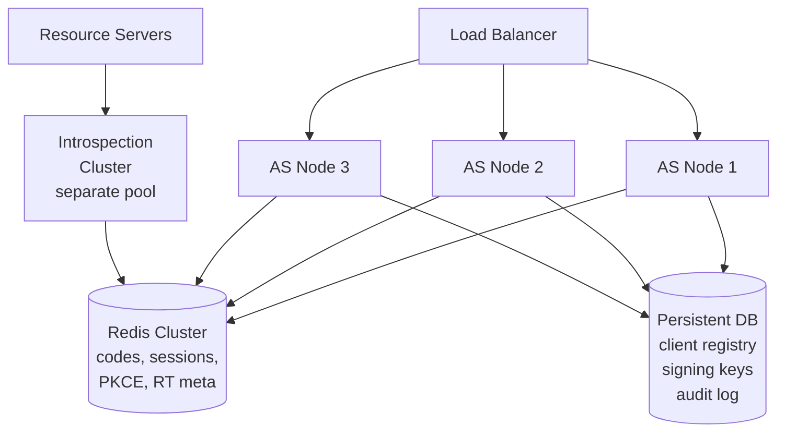

⚡ TL;DR - Clustering an Authorization Server requires
solving three stateful coordination problems across
nodes: (1) authorization code storage (issued on node A,
exchanged on node B - must share state via Redis or a
replicated database); (2) signing key distribution (all
nodes must hold the SAME active signing keys, with
synchronized rotation); (3) session state for interactive
flows (user consent in progress on node A must be
accessible on node B). The stateless token validation
path (JWT with offline verification) is already fully
horizontally scalable - no shared state needed. The
bottleneck is the stateful parts: code storage, session
coordination, and key management. Production AS HA
deployments also require a dedicated introspection endpoint
cluster separate from the token issuance cluster, since
introspection traffic patterns are different.

---

### 🔥 The Problem This Solves

**THE AS IS A SINGLE POINT OF FAILURE BY DEFAULT:**

An unclusterd Authorization Server creates a catastrophic
dependency: if the AS goes down, no new tokens can be
issued, users cannot authenticate, and any service that
performs introspection will fail. For existing valid JWTs,
the RSes can continue validating offline - but for token
refresh, new logins, or introspection-dependent services,
downtime is total. HA clustering is non-trivial because
the AS is NOT purely stateless: authorization codes,
consent sessions, PKCE challenges, and active OAuth sessions
must all be visible across nodes. The solution requires
separating the stateless token validation path (fully
scalable) from the stateful interaction paths (requires
shared backing store).

---

### 📘 Textbook Definition

Authorization Server HA clustering refers to running
multiple AS instances behind a load balancer, sharing
state via distributed storage, to eliminate the AS as
a single point of failure.

**Stateful vs stateless components:**

| Component | State Required | HA Strategy |
|---|---|---|
| JWT validation (RS) | None (offline) | Fully stateless |
| Token issuance endpoint | Code storage + sessions | Shared Redis / DB |
| Authorization code | Short-lived (120s), exchanged once | Replicated store |
| Refresh token | Long-lived, must be revocable | Persistent DB |
| User consent session | Duration of interaction | Redis with TTL |
| PKCE verifier | Duration of code lifetime (120s) | Redis with TTL |
| Active JWKS (signing keys) | All nodes need same keys | Distributed key store |
| Introspection cache | Per-token lookups | Separate Redis cluster |

**Key rotation in clustered AS:**

Zero-downtime key rotation must be synchronized across
all AS nodes. The procedure:
1. Generate new key pair (new kid).
2. Publish new key in JWKS endpoint (ALL nodes now serve
   both old and new public keys).
3. Wait for JWKS cache TTL to expire across all RSes.
4. Switch active signing key to the new key (ALL nodes
   start signing with new kid simultaneously).
5. After old key's oldest token expires: remove old key
   from JWKS.

In a clustered AS, steps 2 and 4 must happen atomically
across all nodes (coordinated via a configuration database
or leader election).

---

### ⏱️ Understand It in 30 Seconds

**What breaks without proper AS clustering:**

```
PROBLEM 1: Authorization code on node A, exchange on node B
  User: POST /authorize → node A issues code=ABC
        → node A stores code=ABC in memory
  Exchange: POST /token code=ABC → node B
            → node B: "code not found" → 400 error
  Fix: Store codes in shared Redis (TTL = 120 seconds)

PROBLEM 2: Key rotation not coordinated
  Node A: switches to new signing key at 14:00:00
  Node B: still using old key at 14:00:05
  RS gets JWT with new kid → fetches JWKS → only old kid there
  (Node B hasn't updated JWKS yet) → validation failure
  Fix: Atomic key activation across all nodes via DB flag.
       Nodes read active key from shared config store.

PROBLEM 3: Consent session split-brain
  User: consents to scopes on node A (session stored in memory)
  Load balancer: next request routes to node B
  Node B: no consent session → re-prompts user
  Fix: Store consent sessions in shared Redis (session affinity
       as fallback, not primary solution)

PROBLEM 4: Introspection overload
  RSes introspect every request → hit the same cluster
  Token issuance and introspection compete for resources
  Fix: Separate introspection to its own cluster with a
       dedicated cache layer. Token status = Redis lookup.
```

---

### ⚙️ How It Works (Mechanism)

```
┌──────────────────────────────────────────────────────────┐
│  CLUSTERED AS ARCHITECTURE                                │
├──────────────────────────────────────────────────────────┤
│                                                           │
│          LOAD BALANCER (ACTIVE/ACTIVE)                    │
│         ┌─────────────┬─────────────┐                    │
│         ▼             ▼             ▼                    │
│     AS Node 1     AS Node 2     AS Node 3                 │
│     (stateless    (stateless    (stateless                │
│      app layer)    app layer)    app layer)               │
│         │             │             │                    │
│         └──────┬──────┘             │                    │
│                ▼                    ▼                    │
│         SHARED STATE                                     │
│     ┌───────────────────────────────────┐                │
│     │  Redis Cluster                    │                │
│     │  - auth codes (TTL 120s)          │                │
│     │  - PKCE verifiers (TTL 120s)      │                │
│     │  - consent sessions (TTL varies)  │                │
│     │  - refresh token metadata         │                │
│     │  - token revocation list          │                │
│     └───────────────────────────────────┘                │
│                     │                                    │
│         ┌───────────┘                                    │
│         ▼                                                │
│     PERSISTENT DB (HA)                                   │
│     ┌───────────────────────────────────┐                │
│     │  - Client registry                │                │
│     │  - Signing key pairs (encrypted)  │                │
│     │  - Active key version flag        │                │
│     │  - Long-lived RT storage          │                │
│     │  - Audit log                      │                │
│     └───────────────────────────────────┘                │
│                                                           │
│     INTROSPECTION CLUSTER (SEPARATE)                     │
│     - Dedicated pool (doesn't compete with issuance)     │
│     - Reads from Redis revocation list                   │
│     - Caches results per jti (TTL = remaining token life) │
└──────────────────────────────────────────────────────────┘
```



---

### 💻 Code Example

**Example 1 - BAD then GOOD: authorization code storage:**

```python
# BAD: Auth code stored in node-local memory
# Problem: load balancer routes exchange request to
# different node; code not found; exchange fails.

import secrets
from typing import dict

# Node-local in-memory store - WRONG for clustered AS
_code_store: dict[str, dict] = {}

def issue_authorization_code(
    client_id: str, sub: str, scope: str,
) -> str:
    code = secrets.token_urlsafe(32)
    _code_store[code] = {
        "client_id": client_id,
        "sub": sub,
        "scope": scope,
    }
    # WRONG: Only stored locally; other nodes can't find it
    return code

def exchange_code_bad(code: str) -> dict:
    data = _code_store.pop(code, None)
    if data is None:
        raise ValueError("Invalid code")  # Fails on other nodes!
    return data
```

```python
# GOOD: Auth code stored in shared Redis
# WHY: Any AS node can retrieve and invalidate the code.
#   TTL ensures codes expire automatically (120 seconds).
#   Atomic GETDEL prevents double-exchange.

import secrets, json
import redis

# Redis client (shared across all AS nodes)
redis_client = redis.Redis(
    host="redis.internal",
    port=6379,
    decode_responses=True,
    socket_timeout=1.0,
    socket_connect_timeout=1.0,
)

CODE_TTL_SECONDS = 120  # Auth codes must expire per RFC 6749

def issue_authorization_code(
    client_id: str,
    sub: str,
    scope: str,
    code_challenge: str | None = None,
    redirect_uri: str | None = None,
) -> str:
    code = secrets.token_urlsafe(32)
    key = f"oauth:code:{code}"
    data = {
        "client_id": client_id,
        "sub": sub,
        "scope": scope,
        "code_challenge": code_challenge or "",
        "redirect_uri": redirect_uri or "",
    }
    # SETEX = SET with TTL; atomically expires code
    redis_client.setex(
        key,
        CODE_TTL_SECONDS,
        json.dumps(data),
    )
    return code

def exchange_code(code: str, client_id: str) -> dict:
    """
    Atomically retrieve and delete the authorization code.
    Uses a Lua script for atomic GETDEL to prevent
    double-exchange race conditions.
    """
    key = f"oauth:code:{code}"

    # Lua script: atomic GET + DEL (single Redis operation)
    # Returns the value, then deletes it.
    # If key doesn't exist, returns nil.
    lua_getdel = """
        local val = redis.call('GET', KEYS[1])
        if val then
            redis.call('DEL', KEYS[1])
        end
        return val
    """
    # NOTE: Redis 6.2+ has native GETDEL command:
    # raw = redis_client.getdel(key)
    raw = redis_client.eval(lua_getdel, 1, key)

    if raw is None:
        raise ValueError(
            "Invalid or expired authorization code. "
            "Code may have already been exchanged "
            "or expired (120s TTL)."
        )

    data = json.loads(raw)

    # Validate client_id matches what code was issued for
    if data['client_id'] != client_id:
        raise ValueError("client_id mismatch")

    return data
```

---

### ⚖️ Comparison Table

| Component | Local Memory | Redis | Persistent DB |
|---|---|---|---|
| **Auth codes** | BAD (node-local) | GOOD (TTL 120s) | OK (overkill) |
| **PKCE verifiers** | BAD | GOOD (TTL 120s) | OK |
| **RT metadata** | BAD | For session data | GOOD (durable) |
| **Signing keys** | BAD (out of sync) | Possible (AES-encrypted) | GOOD |
| **Client registry** | Cache only | Cache only | Authoritative |
| **Consent sessions** | BAD | GOOD | Overkill |

---

### ⚠️ Common Misconceptions

| Misconception | Reality |
|---|---|
| OAuth tokens are stateless, so the AS is stateless | JWT access tokens are stateless on the VALIDATION side (RSes validate offline). But the AS itself is inherently stateful: it issues authorization codes, stores refresh tokens, manages client registrations, holds signing keys, and tracks token revocations. The statelessness property applies to the RS's validation of tokens already issued - not to the AS's issuance process. |
| Session affinity (sticky sessions) solves clustering for the AS | Session affinity reduces cross-node state sharing by routing the same user to the same node. It works for user consent sessions during an interactive authorization flow. But it does NOT work for authorization code exchange (the client calls /token directly, not the user's browser) and does NOT work for refresh token use (client calls /token asynchronously). Session affinity is a partial mitigation, not a solution. Shared Redis is the solution. |
| A database-backed AS automatically achieves HA | The AS using a database (vs in-memory) stores state durably - but if the database has no HA (single-primary, no replicas), it's still a SPOF. Full AS HA requires: HA load balancer + multiple stateless AS app nodes + replicated Redis cluster + HA relational DB (primary + replicas with failover). Each layer must be individually HA. |

---

### 🚨 Failure Modes & Diagnosis

**Authorization Code Exchange Failures After AS Scaling Event**

**Symptom:**
After scaling the AS from 1 to 3 nodes, ~33% of login
attempts fail with "invalid_grant". The failures are random
(not tied to specific users). The error is intermittent
and becomes more frequent under load.

**Diagnostic:**

```bash
# Classic symptom: code-on-node-A, exchange-on-node-B

# Check if AS nodes are using shared Redis:
# In AS logs, filter for "invalid_grant" errors.
# If they correlate with the node that received /authorize
# being different from the node that received /token,
# the issue is node-local code storage.

# AS logs should have node identifier:
# {"event": "code_exchange_failed", "code_prefix": "abc",
#  "node": "as-node-2", "reason": "code_not_found"}
# {"event": "code_issued", "code_prefix": "abc",
#  "node": "as-node-1"}
# Mismatch in node field = code not shared between nodes.

# Fix: Check Redis connection in AS config.
# Temporarily enable load balancer sticky sessions as
# immediate mitigation while deploying Redis.
```

**Fix:**
1. Immediate: enable session affinity on load balancer
   (routes user to same AS node during auth flow).
2. Permanent: migrate authorization code storage to
   shared Redis cluster with atomic GETDEL for exchange.
3. Verify PKCE verifiers are also Redis-backed.
4. Add monitoring: alert if "code_not_found" rate > 0.1%.

---

### 🔗 Related Keywords

**Prerequisites:**
- `Authorization Server Architecture` - core AS components
- `JWKS and Public Key Discovery` - key rotation in clusters

**Builds On:**
- `Enterprise OAuth 2.0 Architecture Patterns`
- `Authorization Server Selection Framework`

---

### 📌 Quick Reference Card

```
┌──────────────────────────────────────────────────────────┐
│ STATEFUL     │ Auth codes, PKCE verifiers, consent       │
│ (Redis)      │ sessions, RT metadata, revocation list    │
├──────────────┼───────────────────────────────────────────┤
│ DURABLE      │ Client registry, signing key pairs,       │
│ (Persistent  │ audit log, long-lived RT storage          │
│ DB)          │                                           │
├──────────────┼───────────────────────────────────────────┤
│ STATELESS    │ JWT validation at RS (no AS contact)      │
│ (Scales      │                                           │
│ freely)      │                                           │
├──────────────┼───────────────────────────────────────────┤
│ KEY ROTATE   │ Publish new kid to JWKS first (all nodes) │
│ SEQUENCE     │ Wait for RS JWKS cache TTL to expire      │
│              │ Then switch active signing key (atomic)   │
├──────────────┼───────────────────────────────────────────┤
│ ONE-LINER    │ "Codes and sessions → Redis.              │
│              │  Keys → shared DB. RS validation → free." │
└──────────────────────────────────────────────────────────┘
```

**If you remember only 3 things:**

1. Authorization codes must be stored in shared Redis with
   TTL=120s and retrieved with atomic GETDEL. Node-local
   memory means ~1/N exchanges fail in a clustered AS
   (where N = number of nodes). This is the most common
   AS clustering failure in production.

2. Signing key rotation in clustered AS must be atomic
   across all nodes. Publish new public key to JWKS first
   (all nodes), wait for RS caches to expire, then switch
   active private key simultaneously across all nodes.
   A split-brain key rotation causes some nodes to sign
   with a key that RSes don't have in cache yet.

3. Separate the introspection cluster from the token
   issuance cluster. Introspection traffic patterns
   (high fan-out from many RSes per token) are different
   from issuance patterns. Sharing capacity causes
   issuance to suffer under introspection load spikes.
