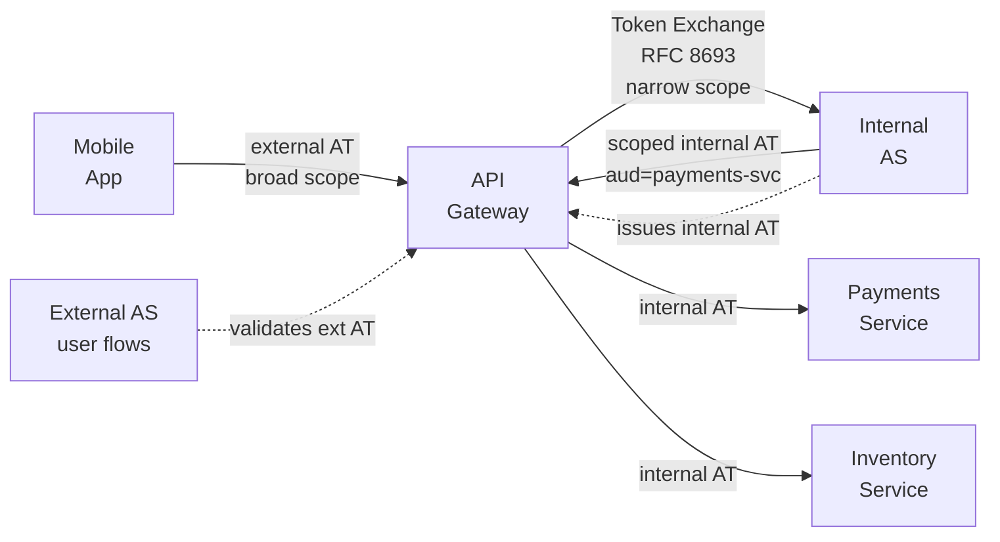

⚡ TL;DR - Enterprise OAuth deployments have four
dominant architectural patterns: (1) Centralized AS
(single AS for all apps - simple ops, federation
bottleneck risk); (2) Federated AS with Gateway (primary
AS + app-level AS instances sharing signing keys via
federation - scales org units); (3) API Gateway Token
Exchange (gateway as the AS proxy - exchanges external
tokens for internal scoped tokens); (4) OAuth Mesh
(every service has sidecar auth - full ZTA compliance).
The right pattern depends on: number of teams/apps,
need for isolation, existing IdP infrastructure, and
whether internal services must be independently
authorized. Most enterprises start with centralized
and evolve to gateway token exchange as they grow.

---

### 🔥 The Problem This Solves

**OAUTH DOESN'T COME WITH AN ENTERPRISE ARCHITECTURE:**

OAuth defines how to issue and validate tokens. It doesn't
define how an organization with 50 teams, 200 applications,
3 internal IdPs (AD, LDAP, HR system), and a mix of
legacy and modern services should deploy and operate OAuth.
Enterprise architecture decisions determine: Who operates
the AS? Which apps use which AS? How do internal services
authenticate to each other? How do legacy apps (without
OAuth support) participate? How is token scope governed
at an organizational level? Choosing the wrong architecture
leads to a centralized AS that becomes a bottleneck and
single point of organizational risk, or a fragmented setup
where every team runs their own AS with no governance.

---

### 📘 Textbook Definition

Enterprise OAuth architecture patterns are reusable
deployment topologies that address the organizational,
operational, and security requirements of large-scale
OAuth deployments.

**Pattern 1: Centralized AS**
Single AS serves all applications and services in the
enterprise. All clients registered in one place. Single
identity federation point (LDAP/AD). Simplest operations.

**Pattern 2: Federated AS Hierarchy**
Primary AS (enterprise IdP) handles authentication.
Domain-specific AS instances handle authorization for
specific business units (e.g., payments AS, HR AS).
Primary AS issues identity assertions (SAML or OIDC)
that domain ASes trust for user identity. Each domain
AS governs its own scopes and client registrations.

**Pattern 3: API Gateway Token Exchange**
All external traffic enters via an API gateway. The
gateway validates the external token (consumer AT issued
by public-facing AS). For internal routing, the gateway
exchanges the external AT for an internal AT using
RFC 8693 Token Exchange - scoped to the specific
downstream service. Internal services receive narrowly
scoped, short-lived tokens even when the external token
was broad.

**Pattern 4: OAuth Mesh (ZTA Sidecar)**
Each microservice has a sidecar proxy (Envoy, Istio).
The sidecar handles token validation and acquisition
for service-to-service calls. Client credentials tokens
for internal calls are fetched and cached by the sidecar,
transparent to the application code. Full ZTA: every
internal call is authenticated and authorized.

---

### ⏱️ Understand It in 30 Seconds

**Pattern selection chessboard:**

```
CENTRALIZED AS: Best when
  - Single team owns all applications
  - < 20 distinct services
  - One IdP (AD/LDAP)
  - Simple scope model
  Weakness: single bottleneck, all teams coupled to one AS

FEDERATED AS HIERARCHY: Best when
  - Multiple business units with different auth needs
  - Different data sovereignty requirements per unit
  - Existing department-level identity systems
  Weakness: key federation complexity, multiple AS to operate

API GATEWAY TOKEN EXCHANGE: Best when
  - Strong perimeter (external vs internal boundary)
  - Internal services don't need to understand external tokens
  - Existing API gateway investment (Kong, AWS API GW)
  - Narrow internal scope control is high priority
  Weakness: gateway is a chokepoint; exchange adds latency

OAUTH MESH / ZTA: Best when
  - Full Zero Trust required (every S2S call authenticated)
  - Kubernetes/service mesh already deployed
  - High security compliance requirements (FedRAMP, FAPI)
  - Team has operational maturity for sidecar management
  Weakness: most complex to operate; sidecar overhead
```

---

### ⚙️ How It Works (Mechanism)

```
┌──────────────────────────────────────────────────────────┐
│  PATTERN 3: API GATEWAY TOKEN EXCHANGE (MOST COMMON)      │
├──────────────────────────────────────────────────────────┤
│                                                           │
│  EXTERNAL WORLD        INTERNAL NETWORK                   │
│                                                           │
│  Mobile App            API Gateway              Services  │
│     │                      │                      │      │
│     │─ auth code flow ─────────────────────       │      │
│     │        ┌─────────────────────────────┐      │      │
│     │        │  External AS                │      │      │
│     │        │  - User-facing flows        │      │      │
│     │        │  - Broad scopes (read, write)│      │      │
│     │        └─────────────────────────────┘      │      │
│     │                      │                      │      │
│     │◄─ external AT ────────│                      │      │
│     │  (sub=user123,        │                      │      │
│     │   scope=api:read api:write)                  │      │
│     │                      │                      │      │
│     │─ GET /api/resource ──►│                      │      │
│     │  Bearer <external AT> │                      │      │
│     │                      │ Token Exchange        │      │
│     │                      │ POST /token           │      │
│     │                      │ subject_token=external_AT │  │
│     │                      │ audience=service-payments │  │
│     │                      │ scope=payments:read   │      │
│     │                      │                      │      │
│     │                      │◄─ internal AT ─────   │      │
│     │                      │  (aud=service-payments│      │
│     │                      │   scope=payments:read │      │
│     │                      │   TTL=5min)           │      │
│     │                      │─ GET /resource ──────►│      │
│     │                      │  Bearer <internal AT> │      │
└──────────────────────────────────────────────────────────┘
```



---

### 💻 Code Example

**Example 1 - BAD then GOOD: External token passed directly internally:**

```python
# BAD: API gateway passes external token directly to
# internal service. Internal service receives a broad
# external token with no scope restriction.
# External token with full scope accessible to all internal services.

# api_gateway_bad.py
import requests

def forward_to_internal_service_bad(
    external_token: str,
    internal_service_url: str,
    request_path: str,
) -> requests.Response:
    # WRONG: Forward external AT directly to internal service.
    # Problems:
    #   1. Internal service gets broader scope than it needs
    #   2. External token (consumer token) visible in internal logs
    #   3. No aud binding to the specific internal service
    return requests.get(
        f"{internal_service_url}{request_path}",
        headers={"Authorization": f"Bearer {external_token}"},
        timeout=5,
    )
```

```python
# GOOD: API gateway exchanges external token for internal
# service-specific scoped token before routing.
# WHY: Internal services receive tokens scoped ONLY to
#   their required permissions. External token is contained
#   at the gateway boundary. Internal AT has short TTL,
#   specific audience, and narrowed scope.

import requests
from functools import lru_cache
from threading import Lock
import time

class InternalTokenCache:
    """
    Cache internal tokens per (external_token, audience, scope).
    Avoid re-exchanging on every request when token is still valid.
    """
    def __init__(self):
        self._cache: dict[str, tuple[str, float]] = {}
        self._lock = Lock()

    def get(self, key: str) -> str | None:
        with self._lock:
            if key in self._cache:
                token, exp = self._cache[key]
                # Return cached if more than 30s remaining
                if time.time() < exp - 30:
                    return token
                del self._cache[key]
        return None

    def set(self, key: str, token: str, exp: float) -> None:
        with self._lock:
            self._cache[key] = (token, exp)

_token_cache = InternalTokenCache()

def get_internal_token(
    external_token: str,
    target_audience: str,
    required_scope: str,
    as_token_endpoint: str,
    gateway_client_id: str,
    gateway_private_key_jwt: str,
) -> str:
    """
    Exchange external AT for a narrowly-scoped internal AT.
    Uses RFC 8693 Token Exchange.
    Caches the result until 30s before expiry.
    """
    import hashlib
    cache_key = hashlib.sha256(
        f"{external_token[:16]}:{target_audience}:{required_scope}"
        .encode()
    ).hexdigest()

    cached = _token_cache.get(cache_key)
    if cached:
        return cached

    resp = requests.post(
        as_token_endpoint,
        data={
            "grant_type":
                "urn:ietf:params:oauth:grant-type:token-exchange",
            "subject_token": external_token,
            "subject_token_type":
                "urn:ietf:params:oauth:token-type:access_token",
            "requested_token_type":
                "urn:ietf:params:oauth:token-type:access_token",
            "audience": target_audience,
            "scope": required_scope,
            "client_id": gateway_client_id,
            "client_assertion_type":
                "urn:ietf:params:oauth:client-assertion-type"
                ":jwt-bearer",
            "client_assertion": gateway_private_key_jwt,
        },
        timeout=2,  # Gateway latency budget: 2s max
    )
    resp.raise_for_status()
    data = resp.json()

    internal_token = data['access_token']
    expires_in = data.get('expires_in', 300)
    exp = time.time() + expires_in
    _token_cache.set(cache_key, internal_token, exp)

    return internal_token

def forward_to_internal_service(
    external_token: str,
    internal_service_url: str,
    target_audience: str,
    required_scope: str,
    request_path: str,
    as_config: dict,
) -> requests.Response:
    """
    Gateway: exchange external token, forward with internal AT.
    External token never crosses the gateway boundary.
    """
    internal_token = get_internal_token(
        external_token=external_token,
        target_audience=target_audience,
        required_scope=required_scope,
        as_token_endpoint=as_config['token_endpoint'],
        gateway_client_id=as_config['gateway_client_id'],
        gateway_private_key_jwt=as_config['gateway_jwt'],
    )
    return requests.get(
        f"{internal_service_url}{request_path}",
        headers={"Authorization": f"Bearer {internal_token}"},
        timeout=5,
    )
```

---

### ⚖️ Comparison Table

| Pattern | Ops Complexity | Isolation | S2S Auth | Best For |
|---|---|---|---|---|
| **Centralized AS** | Low | None | Shared AS | Small orgs, simple scope model |
| **Federated Hierarchy** | High | Per business unit | Domain AS | Large orgs with BU independence |
| **Gateway Token Exchange** | Medium | Gateway-enforced | Exchange | API platforms with strong perimeter |
| **OAuth Mesh (ZTA)** | Very High | Per-service | Sidecar | Cloud-native, full ZTA compliance |

---

### ⚠️ Common Misconceptions

| Misconception | Reality |
|---|---|
| One AS per microservice is the most secure pattern | One AS per microservice creates operational chaos: hundreds of ASes to manage, upgrade, monitor, and rotate keys for. The security benefit does not justify the operational cost for most organizations. The API Gateway Token Exchange pattern achieves similar security properties (scoped tokens per service, short lifetimes) with a manageable number of AS deployments. ZTA sidecar patterns delegate per-service token management to the platform (Istio, Envoy), not to each service team. |
| The centralized AS pattern doesn't scale | A properly clustered centralized AS (multiple nodes + Redis) handles tens of thousands of token issuances per second. Token VALIDATION is fully stateless and scales without any AS involvement. The AS is only in the critical path for: new logins, token refresh, and introspection. These are relatively low-frequency operations compared to total API call volume. Centralized AS scales well for most enterprises up to thousands of applications. |
| OAuth mesh requires custom code in every service | OAuth mesh patterns (Istio/Envoy sidecars) handle token validation and acquisition transparently in the sidecar, without requiring changes to application code. The service receives the validated claims in HTTP headers (set by the sidecar). The application code reads claims from headers (X-User-Id, X-Scope) rather than validating tokens itself. This is the "service mesh" value proposition: security controls are infrastructure, not application code. |

---

### 🚨 Failure Modes & Diagnosis

**Token Exchange Latency Spikes Under Load in Gateway Pattern**

**Symptom:**
API gateway P99 latency spikes to 800ms under high load.
The exchange call to the internal AS is taking 700ms.
Error rate increases as token exchange calls timeout.

**Diagnostic:**

```python
# Token exchange should be cached per external token.
# Check cache hit rate:
# If hit_rate is low (< 80%), cache is not working.
# Common causes:
#   - Cache key includes full token (correct), but token
#     is rotated very frequently (short external AT TTL)
#   - Cache is per-instance (not shared), so many instances
#     each exchange independently

import prometheus_client as prom

token_exchange_cache_hits = prom.Counter(
    'token_exchange_cache_hits_total', ''
)
token_exchange_cache_misses = prom.Counter(
    'token_exchange_cache_misses_total', ''
)
token_exchange_duration = prom.Histogram(
    'token_exchange_duration_seconds', '',
    buckets=[0.01, 0.05, 0.1, 0.2, 0.5, 1.0, 2.0],
)
```

**Fix:**
1. Ensure token exchange cache is shared (Redis) not
   per-instance. All gateway nodes share the cache.
2. Increase cache key TTL: cache until token exp - 30s.
3. Scale the internal AS token endpoint horizontally.
4. Use circuit breaker on the exchange call: on AS
   timeout, fail-open with a degraded permission set
   (if your security policy allows graceful degradation).

---

### 🔗 Related Keywords

**Prerequisites:**
- `Authorization Server Architecture` - AS component design
- `Token Exchange (RFC 8693)` - gateway exchange mechanism

**Builds On:**
- `Authorization Server Selection Framework`
- `OAuth 2.0 in Zero Trust Architecture`

---

### 📌 Quick Reference Card

```
┌──────────────────────────────────────────────────────────┐
│ PATTERNS     │ Centralized, Federated Hierarchy,         │
│              │ Gateway Token Exchange, OAuth Mesh        │
├──────────────┼───────────────────────────────────────────┤
│ MOST COMMON  │ Gateway Token Exchange:                   │
│              │ External token → gateway → exchange →     │
│              │ internal scoped AT per service            │
├──────────────┼───────────────────────────────────────────┤
│ CACHE        │ Exchange results per (token, aud, scope)  │
│              │ TTL = token exp - 30s. Shared Redis.      │
├──────────────┼───────────────────────────────────────────┤
│ ZTA MESH     │ Sidecar handles tokens transparently.     │
│              │ App reads claims from headers.            │
├──────────────┼───────────────────────────────────────────┤
│ ONE-LINER    │ "Start centralized. Grow to gateway       │
│              │  exchange. ZTA mesh for full Zero Trust." │
└──────────────────────────────────────────────────────────┘
```

**If you remember only 3 things:**

1. The API Gateway Token Exchange pattern is the most
   practical enterprise architecture: external tokens
   stay at the gateway boundary. Internal services
   receive short-lived, narrowly-scoped tokens specific
   to their audience. This is achievable without full
   ZTA mesh complexity.

2. Cache token exchange results per (external token prefix,
   audience, scope) until 30s before expiry. Without
   caching, every API call triggers an exchange call to
   the AS - turning the AS into a per-request bottleneck.

3. Centralized AS is NOT an anti-pattern for enterprises.
   A properly clustered centralized AS handles thousands
   of applications. The threshold to switch to federated
   hierarchy is organizational (different BUs need different
   identity governance), not technical (performance).
