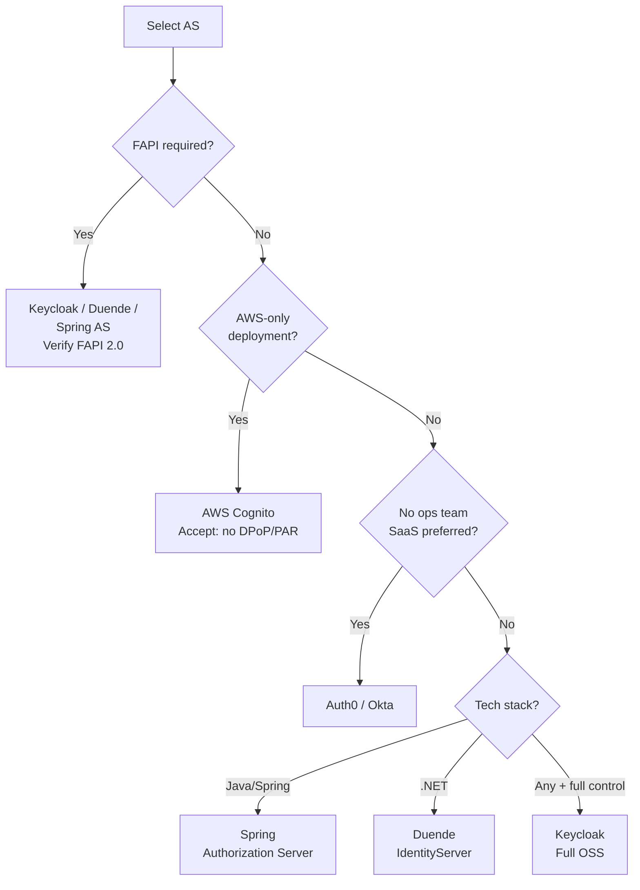

⚡ TL;DR - Selecting an Authorization Server involves
evaluating across six dimensions: (1) Compliance coverage
(which RFC/specs are supported: PKCE, PAR, JAR, DPoP,
RAR, FAPI); (2) Deployment model (cloud SaaS, self-hosted,
on-premise-only); (3) HA and clustering (Redis-backed
code storage, multi-region); (4) Protocol extensibility
(custom claims, custom grant types, policy engine
integration); (5) Operational maturity (admin API,
JWKS rotation automation, audit logging); (6) Total cost
of ownership (licensing model + operational burden).
Top production choices: Auth0/Okta (SaaS, consumer and
enterprise), Keycloak (self-hosted OSS, complex but full),
Spring Authorization Server (for Java shops, embedded),
AWS Cognito (AWS-native, limited extensibility), Duende
IdentityServer (.NET, full FAPI support). Build-your-own
AS is almost never the right answer.

---

### 🔥 The Problem This Solves

**THE WRONG AS CHOICE IS EXPENSIVE TO CHANGE:**

An Authorization Server becomes the identity infrastructure
for an entire organization. Migrating away from a wrong AS
choice requires: re-registering all clients, re-issuing
credentials, migrating user identity stores, updating all
RSes to trust the new AS's JWKS, and coordinating a
migration cutover. This typically takes 6-18 months for
a large deployment. The cost of a wrong choice compounds
as the number of integrated applications grows. A
selection framework prevents costly mistakes by requiring
evaluation of production requirements (FAPI, HA, audit
compliance) before commitment - not after going live.

---

### 📘 Textbook Definition

An AS selection framework is a structured evaluation
methodology that maps organizational requirements to
AS capabilities across multiple dimensions.

**Dimension 1: RFC/Spec Compliance**
Mandatory features for production OAuth deployments:
- RFC 6749 (core OAuth 2.0) - all ASes
- RFC 7636 PKCE - all modern ASes
- RFC 7591 Dynamic Client Registration - varies
- RFC 8693 Token Exchange - few support natively
- RFC 9126 PAR - growing support (2022+)
- RFC 9449 DPoP - growing support (2023+)
- FAPI 1.0 / FAPI 2.0 - limited to specialized ASes

**Dimension 2: Deployment Model**
SaaS (managed by vendor): lower ops burden, data
residency constraints.
Self-hosted: full control, full ops burden.
Embedded: AS runs within the application (Spring AS).
On-premise-only: air-gapped environments.

**Dimension 3: HA and Multi-Region**
Does the AS support active/active clustering?
What is the RPO/RTO for AS failure?
Does key material distribution work across regions?

**Dimension 4: Extensibility**
Can custom claims be added to tokens from external
sources (HR system, device registry)?
Custom grant types for non-standard flows?
Policy engine integration (OPA, Cedar)?

**Dimension 5: Operations**
Admin API for programmatic client management.
JWKS rotation automation (without manual intervention).
Audit log format (structured JSON + SIEM integration).
SCIM 2.0 for user provisioning.

**Dimension 6: Total Cost of Ownership**
SaaS: monthly per-MAU (Monthly Active User) pricing.
Self-hosted: engineering cost to operate + hosting.
OSS self-hosted: no license cost, high ops burden.

---

### ⏱️ Understand It in 30 Seconds

**AS comparison cheat sheet:**

```
AUTH0 / OKTA (SaaS)
  + Consumer-grade UX, extensive protocol support
  + Fast onboarding, low ops burden
  + Supports FAPI (Okta), PAR, DPoP (2023+)
  - Per-MAU pricing becomes expensive at scale
  - Limited customization vs self-hosted
  - Data residency constraints (SaaS cloud)

KEYCLOAK (Open Source, self-hosted)
  + Full protocol support (all major RFCs)
  + Highly customizable (SPIs for claims, flows)
  + No license cost
  - High operational complexity (Java, clustering)
  - Clustering requires external DB + Infinispan/Redis
  - Steep learning curve for custom extensions

SPRING AUTHORIZATION SERVER (embedded Java)
  + Full programmatic control
  + FAPI 2.0 support (with configuration)
  + Ideal when AS is part of an existing Spring Boot app
  - You're responsible for HA, storage, operations
  - No managed admin UI

AWS COGNITO
  + Zero-ops for AWS-native deployments
  + Native integration (ALB, API Gateway, Lambda)
  - Limited protocol extensibility
  - No PAR, no DPoP (2024)
  - Token customization limited (Lambda triggers)
  - User pool limits at scale

DUENDE IDENTITYSERVER (.NET)
  + Full FAPI support
  + .NET ecosystem integration
  - Commercial license (OSS version has restrictions)
  - .NET-only deployment context
```

---

### ⚙️ How It Works (Mechanism)

```
┌──────────────────────────────────────────────────────────┐
│  AS SELECTION DECISION TREE                               │
├──────────────────────────────────────────────────────────┤
│                                                           │
│  START: What is the primary constraint?                   │
│                                                           │
│  ┌── FAPI required (finance/health)?                      │
│  │      └── Yes → Keycloak / Duende / Spring AS           │
│  │                (verify FAPI 2.0 support)               │
│  │                                                        │
│  ├── AWS-only, low ops priority?                          │
│  │      └── Yes → AWS Cognito (accept limitations)        │
│  │                                                        │
│  ├── No ops team, SaaS preferred?                         │
│  │      └── Yes → Auth0 (SMB) / Okta (enterprise)         │
│  │                                                        │
│  ├── Full control, custom flows, budget for ops?          │
│  │      └── Yes → Keycloak (most features)               │
│  │                                                        │
│  ├── Java/Spring ecosystem, embedded AS?                  │
│  │      └── Yes → Spring Authorization Server            │
│  │                                                        │
│  └── .NET ecosystem?                                      │
│         └── Yes → Duende IdentityServer                   │
│                                                           │
│  SECOND FILTER: HA requirements?                          │
│  SaaS (Auth0/Okta) → vendor HA guaranteed                │
│  Keycloak → requires Infinispan + external DB            │
│  Spring AS → you build HA (Redis + clustered Spring Boot) │
│  Cognito → AWS-managed HA                                 │
└──────────────────────────────────────────────────────────┘
```



---

### 💻 Code Example

**Example 1 - AS capability validation script:**

```python
# GOOD: Automated AS capability probe before selection
# WHY: Prevents selecting an AS that claims spec support
#   but has incomplete implementation.
#   Tests actual OIDC discovery + PAR + DPoP endpoints.

import requests, json

def probe_as_capabilities(issuer_url: str) -> dict:
    """
    Probe an AS's OIDC discovery document to verify
    actual feature support before production commitment.
    Returns a capability report with pass/fail for
    each critical feature.
    """
    discovery_url = (
        f"{issuer_url.rstrip('/')}/"
        ".well-known/openid-configuration"
    )
    try:
        resp = requests.get(discovery_url, timeout=10)
        resp.raise_for_status()
        meta = resp.json()
    except Exception as e:
        return {"error": str(e), "reachable": False}

    checks = {}

    # PAR support (RFC 9126)
    checks['par'] = {
        "supported": 'pushed_authorization_request_endpoint'
                     in meta,
        "endpoint": meta.get(
            'pushed_authorization_request_endpoint'
        ),
        "rfc": "RFC 9126",
    }

    # DPoP support (RFC 9449)
    dpop_methods = meta.get(
        'token_endpoint_auth_methods_supported', []
    )
    checks['dpop'] = {
        "supported": 'dpop_signing_alg_values_supported' in meta,
        "algs": meta.get('dpop_signing_alg_values_supported', []),
        "rfc": "RFC 9449",
    }

    # FAPI: PAR + JAR + private_key_jwt
    checks['fapi_capable'] = {
        "par": checks['par']['supported'],
        "jar_request_object": meta.get(
            'request_object_signing_alg_values_supported'
        ) is not None,
        "private_key_jwt": 'private_key_jwt' in meta.get(
            'token_endpoint_auth_methods_supported', []
        ),
        "mtls": 'tls_client_auth' in meta.get(
            'token_endpoint_auth_methods_supported', []
        ),
    }
    checks['fapi_capable']['fapi_ready'] = all([
        checks['fapi_capable']['par'],
        checks['fapi_capable']['jar_request_object'],
        checks['fapi_capable']['private_key_jwt'],
    ])

    # Token Exchange (RFC 8693)
    grant_types = meta.get('grant_types_supported', [])
    checks['token_exchange'] = {
        "supported": (
            'urn:ietf:params:oauth:grant-type:token-exchange'
            in grant_types
        ),
        "rfc": "RFC 8693",
    }

    # Introspection (RFC 7662)
    checks['introspection'] = {
        "supported": 'introspection_endpoint' in meta,
        "endpoint": meta.get('introspection_endpoint'),
    }

    # JWKS
    checks['jwks'] = {
        "uri": meta.get('jwks_uri'),
        "present": 'jwks_uri' in meta,
    }

    return {
        "issuer": meta.get('issuer'),
        "capabilities": checks,
        "raw_discovery": meta,
    }


# Usage:
# report = probe_as_capabilities("https://your-as.example.com")
# print(json.dumps(report['capabilities'], indent=2))
```

---

### ⚖️ Comparison Table

| AS | FAPI 2.0 | PAR | DPoP | Token Exchange | Ops Model |
|---|---|---|---|---|---|
| **Auth0** | Partial | Yes | Yes (2023) | No | SaaS |
| **Okta** | FAPI 1.0 Adv | Yes | Yes | Yes (Actions) | SaaS |
| **Keycloak** | Yes (configuring) | Yes | Yes | Yes (SPI) | Self-hosted |
| **Spring AS** | Yes (custom) | Yes | Yes | Yes | Embedded |
| **AWS Cognito** | No | No | No | No | SaaS/AWS |
| **Duende** | Yes | Yes | Yes | Yes | Self-hosted |

---

### ⚠️ Common Misconceptions

| Misconception | Reality |
|---|---|
| Building a custom AS gives the most control | Building a custom AS means you own every security-critical component: token issuance, signature algorithms, key rotation, session management, PKCE, state management, and JWKS endpoint. Every vulnerability in these components is your responsibility. OAuth security is hard to get right. Auth0's engineering team has invested years into getting these details correct. The decision to build your own AS requires a clear, compelling reason (specialized requirements not met by any product) - not just a preference for control. |
| An AS that claims FAPI compliance is actually FAPI-compliant | FAPI compliance requires formal certification from the OpenID Foundation. A vendor claiming "FAPI-ready" or "FAPI-capable" without a certification from the OpenID Certification Program should be treated with skepticism. Check the official certification list at: openid.net/certification. There is a significant difference between "we implemented the specs" and "we passed the conformance test suite". |
| The cheapest option (Keycloak OSS) is always the right choice | Keycloak has zero license cost but significant operational cost: experienced Keycloak administrators are rare and expensive, Keycloak clustering requires specific expertise, and major version upgrades are complex. For an organization without dedicated identity platform engineering, a SaaS AS at a few cents per MAU may have lower total cost than self-hosting Keycloak. Always calculate engineering and operational costs, not just licensing. |

---

### 🚨 Failure Modes & Diagnosis

**AS Selection Regret: Missing FAPI Requirements Discovered Post-Deployment**

**Symptom:**
Six months after deploying with AS-X, a new partnership
with a UK Open Banking participant requires FAPI 1.0
Advanced certification. The deployed AS does not support
PAR or private_key_jwt client authentication. Implementing
support would require an AS migration.

**Diagnostic:**

```python
# Prevention: use the capability probe before selection
# Specifically check FAPI readiness

fapi_requirements = [
    'pushed_authorization_request_endpoint',  # PAR
    'request_object_signing_alg_values_supported',  # JAR
]
client_auth_for_fapi = [
    'private_key_jwt',
    'tls_client_auth',
]

def check_fapi_readiness(meta: dict) -> list[str]:
    """Return list of missing FAPI capabilities."""
    gaps = []
    for req in fapi_requirements:
        if req not in meta:
            gaps.append(f"Missing: {req}")
    token_auth_methods = meta.get(
        'token_endpoint_auth_methods_supported', []
    )
    if not any(m in token_auth_methods for m in client_auth_for_fapi):
        gaps.append(
            "Missing: private_key_jwt or tls_client_auth "
            "in token_endpoint_auth_methods_supported"
        )
    return gaps
```

**Prevention:**
1. Include regulatory roadmap in AS evaluation criteria:
   "Will we need FAPI in 24 months?"
2. Run the capability probe against all candidate ASes
   before the selection decision.
3. Check the OpenID Certification page for certified
   products if FAPI is a current or future requirement.

---

### 🔗 Related Keywords

**Prerequisites:**
- `Authorization Server Architecture` - what the AS must support
- `OAuth 2.0 in Financial Services (FAPI)` - FAPI requirements

**Builds On:**
- `OAuth 2.0 Migration Strategy` - changing AS after selection
- `Enterprise OAuth 2.0 Architecture Patterns` - deployment

---

### 📌 Quick Reference Card

```
┌──────────────────────────────────────────────────────────┐
│ SELECTION    │ Compliance, Deployment, HA, Extensibility │
│ DIMENSIONS   │ Operations, Total Cost of Ownership       │
├──────────────┼───────────────────────────────────────────┤
│ FAPI NEEDED  │ Keycloak / Duende / Spring AS             │
│              │ Check openid.net/certification first      │
├──────────────┼───────────────────────────────────────────┤
│ NO OPS TEAM  │ Auth0 (SMB) / Okta (enterprise)           │
├──────────────┼───────────────────────────────────────────┤
│ AWS-ONLY     │ Cognito (accept: no PAR/DPoP/Exchange)    │
├──────────────┼───────────────────────────────────────────┤
│ NEVER        │ Custom AS (security liability)            │
│              │ AS upgrade path = migration (plan ahead)  │
├──────────────┼───────────────────────────────────────────┤
│ ONE-LINER    │ "Probe the discovery doc. Check           │
│              │  openid.net/certification for FAPI."      │
└──────────────────────────────────────────────────────────┘
```

**If you remember only 3 things:**

1. Run the capability probe (fetch `/.well-known/openid-
   configuration`) against any candidate AS. The discovery
   document reveals actual protocol support. "FAPI-capable"
   marketing is not the same as passing the OpenID
   certification test suite.

2. Include regulatory roadmap in the selection criteria.
   If FAPI, CDR, or Open Banking compliance is possible
   in the next 2 years, select an AS that already has
   FAPI certification. Migrating away from an unqualified
   AS later costs far more than selecting correctly now.

3. The total cost of self-hosted OSS (Keycloak) includes
   operational burden. Factor engineering costs for:
   clustering setup, upgrade management, SPI development,
   and incident response into the TCO calculation.
   SaaS ASes are often cheaper in total for teams without
   dedicated identity engineering.
