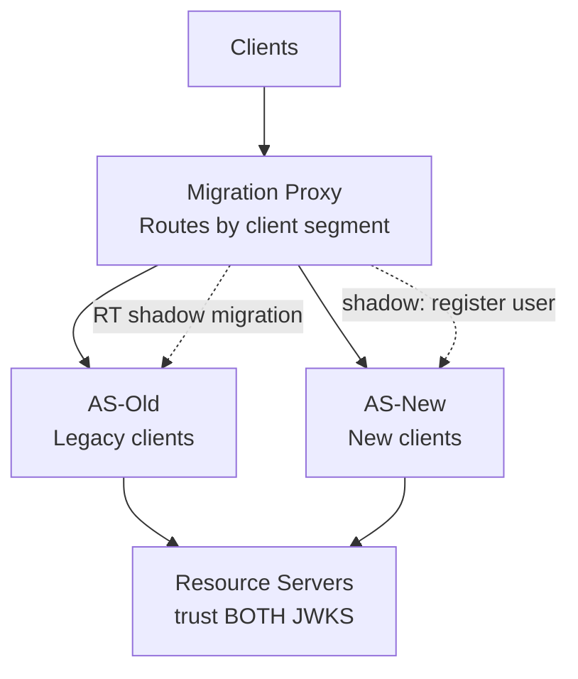

⚡ TL;DR - Migrating an OAuth 2.0 Authorization Server
requires a multi-phase approach: (1) parallel run both
ASes simultaneously with a token forwarding proxy that
routes by client or user segment; (2) migrate signing
keys with a cross-signing bridge (old AS co-signs tokens
with new key during transition); (3) migrate client
registrations programmatically using the admin APIs of
both systems; (4) decommission the old AS only after all
RSes have updated their JWKS trust. The hardest part is
not the new AS setup - it is the refresh token migration
(long-lived opaque tokens stored in the old AS) and the
JWKS trust update across every RS. Plan for weeks of
dual-AS operation, not hours.

---

### 🔥 The Problem This Solves

**AS MIGRATIONS BREAK ALL EXISTING TOKENS:**

When you replace AS-A with AS-B, every token issued by
AS-A becomes invalid the moment RSes stop trusting AS-A's
JWKS. Existing user sessions expire. Refresh tokens stored
in the old AS become useless. Every registered client must
be re-configured with the new client credentials. Every
RS must update its JWKS URL. Done wrong (big-bang cutover),
the migration causes a complete authentication outage for
all users. Done right (phased with parallel operation),
users experience no disruption. The migration strategy
must address: token lifetime overlap, JWKS trust transition,
refresh token continuity, and client credential migration.

---

### 📘 Textbook Definition

An OAuth AS migration is the process of replacing one
Authorization Server with another while maintaining
authentication continuity for existing users and sessions.

**Migration phases:**

**Phase 1: Preparation**
- Inventory all clients (count, types, grant types).
- Inventory all RSes (where JWKS URL is configured).
- Set up new AS with parallel client registrations.
- Configure new AS to trust old AS's user identities
  (federate to same IdP).

**Phase 2: Dual-AS Operation (parallel run)**
- Both ASes operational simultaneously.
- Traffic split by client type or user segment.
- New clients registered in new AS only.
- Existing clients initially on old AS.

**Phase 3: Token Trust Bridge**
- Configure all RSes to accept tokens from BOTH ASes
  (trust both JWKS URLs or use a JWKS union endpoint).
- Tokens from both ASes valid simultaneously.
- No forced re-login during migration.

**Phase 4: Client Migration**
- Migrate clients batch by batch to new AS.
- Monitor: error rates per client during migration.
- Rollback plan: re-route to old AS per client if issues.

**Phase 5: Refresh Token Migration**
- RT migration is the hardest step.
- Option A: Force re-login for all users (disruptive).
- Option B: Old AS issues a "migration token" that the
  new AS can exchange for a new RT (requires AS-specific
  implementation).
- Option C: Shadow RTs - when a user presents an old AS RT,
  the migration proxy exchanges it with old AS, then
  issues a new AS session.

**Phase 6: Decommission Old AS**
- All clients migrated to new AS.
- No active sessions using old AS tokens.
- Remove old AS JWKS from RS trust configurations.
- Shut down old AS.

---

### ⏱️ Understand It in 30 Seconds

**The four hardest parts of AS migration:**

```
HARD PART 1: Refresh Token Migration
  RTs are long-lived (days to months) and stored in old AS.
  They can't be "migrated" - they're tied to old AS's DB.
  Options:
    a) Force re-login (disrupts all active users)
    b) Migration proxy: old RT → new RT on first use
    c) Shadow migration: user uses old RT, proxy silently
       creates new AS session in background

HARD PART 2: RS JWKS Trust Update
  Every RS must add new AS's JWKS URL to its trust config.
  If any RS misses this: tokens from new AS rejected at that RS.
  Action: catalog every RS; verify JWKS update; monitor error
  rates per RS during migration.

HARD PART 3: Client Credential Migration
  Every client has client_id + client_secret or key pair.
  New AS will issue different client credentials.
  The client must update its configuration.
  For 200+ clients: this requires an admin API migration
  script, not manual updates.

HARD PART 4: Maintaining issuer consistency
  JWTs contain "iss" (issuer) claim.
  If new AS uses a different issuer URL, RSes that validate
  iss strictly will reject new tokens.
  Fix: configure new AS to issue with same issuer URL (if possible)
  OR update all RSes to accept new issuer URL simultaneously.
```

---

### ⚙️ How It Works (Mechanism)

```
┌──────────────────────────────────────────────────────────┐
│  DUAL-AS MIGRATION ARCHITECTURE                           │
├──────────────────────────────────────────────────────────┤
│                                                           │
│  CLIENT         MIGRATION PROXY       AS-OLD  AS-NEW     │
│                                                           │
│  Phase 1: Parallel Operation                             │
│    App1 ─────────────────────────────► AS-OLD            │
│    App2 ────────────────────────────────────────► AS-NEW │
│    (new clients registered in AS-NEW only)               │
│                                                           │
│  Phase 2: Token Trust Bridge                             │
│    RS validates tokens from BOTH ASes:                   │
│    RS trusted JWKS = union(AS-OLD/jwks, AS-NEW/jwks)     │
│    User with AS-OLD session → continues to work          │
│    User with AS-NEW session → works from day 1           │
│                                                           │
│  Phase 3: RT Shadow Migration                            │
│    User → POST /token (refresh_token=OLD_RT)             │
│    Proxy → forward to AS-OLD → gets new AT+RT           │
│    Proxy → simultaneously: register user in AS-NEW       │
│           issue AS-NEW refresh token in background       │
│    User → next refresh: routed to AS-NEW                 │
│    Transparent: user sees uninterrupted session          │
│                                                           │
│  Phase 4: Decommission                                   │
│    All RTs rotated through migration proxy               │
│    No active sessions on AS-OLD                          │
│    Remove AS-OLD JWKS from RS trust                      │
│    Shut down AS-OLD                                       │
└──────────────────────────────────────────────────────────┘
```



---

### 💻 Code Example

**Example 1 - JWKS union endpoint (trust both ASes):**

```python
# GOOD: RS configured to trust tokens from both ASes
# during migration. Uses a cached JWKS union that
# includes keys from both old and new AS.
# WHY: Enables zero-downtime migration by letting the RS
#   validate tokens from either AS during the transition.

import requests, time
from jose import jwt, jwk
from jose.exceptions import JWTError

class DualAsJwksCache:
    """
    Maintains a union JWKS from two Authorization Servers.
    Used during migration to validate tokens from either AS.
    """
    def __init__(
        self,
        old_as_jwks_uri: str,
        new_as_jwks_uri: str,
        cache_ttl_seconds: int = 300,
    ):
        self.old_as_jwks_uri = old_as_jwks_uri
        self.new_as_jwks_uri = new_as_jwks_uri
        self.cache_ttl = cache_ttl_seconds
        self._keys: dict[str, dict] = {}
        self._last_refresh: float = 0

    def _refresh(self, force: bool = False):
        now = time.time()
        if not force and now - self._last_refresh < self.cache_ttl:
            return

        all_keys = {}
        for uri in [self.old_as_jwks_uri, self.new_as_jwks_uri]:
            try:
                resp = requests.get(uri, timeout=5)
                resp.raise_for_status()
                for key_data in resp.json().get('keys', []):
                    kid = key_data.get('kid', 'unknown')
                    all_keys[kid] = key_data
            except Exception as e:
                import logging
                logging.warning(f"JWKS fetch failed for {uri}: {e}")
                # Use stale keys rather than clearing all keys

        if all_keys:
            self._keys = all_keys
            self._last_refresh = now

    def get_key(self, kid: str) -> dict | None:
        self._refresh()
        key = self._keys.get(kid)
        if key is None:
            # Force refresh: may be a newly rotated key
            self._refresh(force=True)
            key = self._keys.get(kid)
        return key

# RS token validation using dual-AS cache
dual_jwks = DualAsJwksCache(
    old_as_jwks_uri="https://old-as.example.com/jwks",
    new_as_jwks_uri="https://new-as.example.com/jwks",
)

TRUSTED_ISSUERS = {
    "https://old-as.example.com",  # Old AS
    "https://new-as.example.com",  # New AS
}

def validate_token_dual_as(token: str) -> dict:
    """
    Validate a JWT from either the old or new AS.
    Accepts tokens from both issuers during migration.
    """
    import logging
    try:
        header = jwt.get_unverified_header(token)
        kid = header.get('kid')
        key_data = dual_jwks.get_key(kid)
        if key_data is None:
            raise ValueError(f"Unknown signing key kid={kid}")

        claims = jwt.decode(
            token,
            key_data,
            algorithms=["RS256", "PS256", "ES256"],
            audience="https://api.example.com",
        )

        # Verify issuer is one of the trusted ASes
        iss = claims.get('iss', '').rstrip('/')
        if not any(
            iss == trusted.rstrip('/')
            for trusted in TRUSTED_ISSUERS
        ):
            raise ValueError(f"Untrusted issuer: {iss}")

        # Log which AS issued the token (migration metrics)
        logging.info(
            "token_validated",
            extra={"issuer": iss, "migration_source": iss}
        )
        return claims

    except JWTError as e:
        raise ValueError(f"Token validation failed: {e}")
```

---

### ⚖️ Comparison Table

| Migration Approach | User Impact | Complexity | Risk |
|---|---|---|---|
| **Big-bang cutover** | 100% forced re-login | Low (simple) | Very high |
| **Dual-AS with traffic split** | Zero (gradual) | Medium | Low |
| **RT shadow migration** | Zero | High | Medium |
| **Issuer alias (same issuer URL)** | Zero | Low | Low (if AS supports) |

---

### ⚠️ Common Misconceptions

| Misconception | Reality |
|---|---|
| You can migrate refresh tokens from one AS to another | Refresh tokens are opaque credentials tied to the AS's own database. They cannot be "exported" and "imported" into a new AS as-is. The new AS has no knowledge of what the old RT represented. The shadow migration pattern works around this by detecting old RTs at the proxy layer and converting them to new AS sessions during the first use. But this requires the proxy to have access to both AS admin APIs. |
| Migrating the issuer URL transparently is always possible | Some AS products do not support configuring a custom issuer URL - they always use their own domain as the issuer. If the old and new AS cannot share the same issuer URL, all RSes must update their issuer validation configuration simultaneously with the first new AS token being issued. This is often the most disruptive coordination challenge in migrations. Check the new AS's issuer URL configurability before committing to the migration strategy. |
| Token migration can be done in a weekend | For an organization with dozens of client applications, hundreds of resource servers, and millions of active sessions, AS migration takes weeks to months: inventorying clients and RSes (days), setting up and testing dual-AS configuration (weeks), gradual client migration with per-client monitoring (weeks), RT shadow migration completion (until last RT expires), final decommission verification. Weekend migrations only work for very small deployments with few clients and RSes. |

---

### 🚨 Failure Modes & Diagnosis

**RS Rejects New AS Tokens: JWKS Not Updated**

**Symptom:**
After migrating Client A to the new AS, all API calls
from Client A fail with 401. Old clients (still on old AS)
work fine. New AS tokens validated correctly in staging
but not in production.

**Diagnostic:**

```bash
# Check: does the RS have the new AS's JWKS configured?
# RS logs should show: "unknown kid: <new-as-kid>"
# vs "invalid signature" or "wrong issuer"

# Extract the kid from a new AS token for comparison:
# python3 -c "
# import jwt, sys
# t = sys.argv[1]
# print(jwt.get_unverified_header(t))
# " <new_as_token>

# Compare kid in new token vs what RS has in its JWKS cache.
# If RS's JWKS only has old AS keys: RS never fetched new JWKS.

# Check RS JWKS configuration:
# grep jwks_uri /etc/rs/config.yaml
# Should contain new AS's JWKS URI (or unified JWKS endpoint)
```

**Fix:**
1. Add new AS's JWKS URI to each RS's trust configuration.
2. If RS validates issuer: add new AS's issuer to trusted set.
3. For RS that can't be updated immediately: keep client
   on old AS until RS is updated.
4. After all RSes are updated: proceed with client migration.

---

### 🔗 Related Keywords

**Prerequisites:**
- `JWKS and Public Key Discovery` - RS trust during migration
- `Authorization Server Selection Framework` - choosing the new AS

**Builds On:**
- `Centralized vs Decentralized Authorization Design`
- `OAuth 2.0 for Internal Developer Platforms`

---

### 📌 Quick Reference Card

```
┌──────────────────────────────────────────────────────────┐
│ PHASES       │ Prep → Dual-AS → Trust Bridge →          │
│              │ Client Migration → RT Migration →         │
│              │ Decommission                              │
├──────────────┼───────────────────────────────────────────┤
│ RT MIGRATION │ Shadow: old RT → proxy → new AS session   │
│              │ Force re-login: simple but disruptive     │
├──────────────┼───────────────────────────────────────────┤
│ JWKS BRIDGE  │ RS trusts BOTH old + new AS JWKS          │
│              │ Remove old only after all tokens expired  │
├──────────────┼───────────────────────────────────────────┤
│ ISSUER URL   │ Match if possible. If not: update all RSes│
│              │ simultaneously with first new token.      │
├──────────────┼───────────────────────────────────────────┤
│ ONE-LINER    │ "Both ASes run in parallel. RSes trust    │
│              │  both. Migrate clients in batches."       │
└──────────────────────────────────────────────────────────┘
```

**If you remember only 3 things:**

1. Before migrating a single client to the new AS, update
   ALL resource servers to trust BOTH the old and new AS's
   JWKS. This is the most common migration failure: clients
   are migrated before RSes are updated, causing 401 errors.

2. Refresh tokens cannot be migrated between ASes. Use the
   shadow migration pattern (proxy intercepts old RT, creates
   new AS session on first use) to achieve zero user-visible
   impact. Otherwise, plan for a forced re-login window.

3. If the new AS uses a different issuer URL than the old AS,
   all RSes that validate `iss` must update their trusted
   issuer list. This must happen before any new AS tokens
   are issued. Coordinate this update with the first client
   migration.
