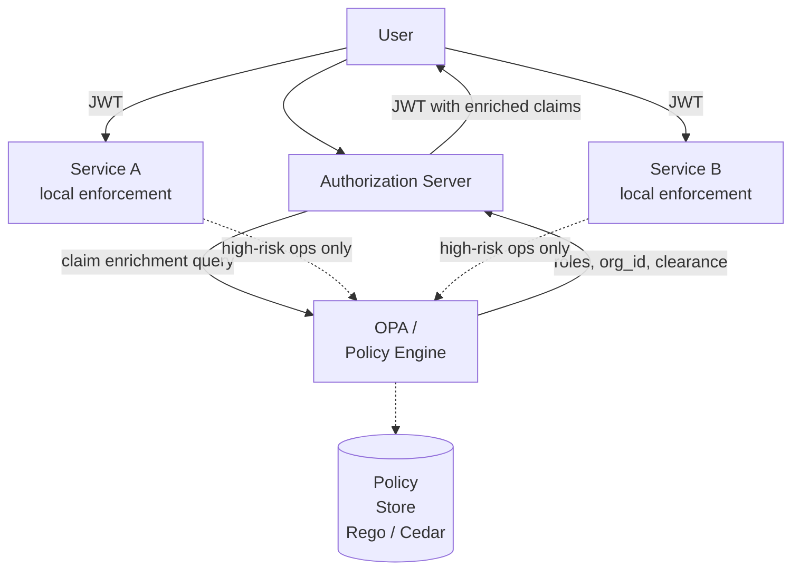

⚡ TL;DR - Centralized authorization: a single Policy
Decision Point (PDP) evaluates every access request -
consistent policy, single operational target, but a
latency bottleneck and single point of failure. Decentralized
authorization: each service enforces its own policy using
JWT claims embedded in tokens - no external calls per request,
fully offline, but policy drift risk (each service may
interpret policy differently). The production pattern is
a hybrid: centralize the POLICY DEFINITION (in OPA, Cedar,
or the AS's scope model) while decentralizing POLICY
ENFORCEMENT (each service evaluates locally using JWT claims
populated by the central PDP at token issuance time). This
gives offline enforcement latency with centralized policy
governance.

---

### 🔥 The Problem This Solves

**POLICY DRIFT IN MICROSERVICES:**

In a pure decentralized model, each microservice implements
its own authorization logic: "if user has role X and
resource belongs to org Y..." Written differently in
each service, tested differently, with different edge
cases handled inconsistently. When a new policy requirement
arrives ("admins can only access resources they own, not
all resources"), engineering must update and deploy 20
services to enforce it. Some miss the update. Policy
drift is the result: inconsistent authorization behavior
across services that is only discovered during security
audits or incidents. The centralized-definition /
decentralized-enforcement hybrid solves this: policy is
defined once, encoded into tokens at issuance, and
enforced consistently using the same claims structure.

---

### 📘 Textbook Definition

**Centralized authorization:** All authorization decisions
are made by a central Policy Decision Point (PDP). Services
send authorization queries to the PDP on every request.
The PDP has full context (user, resource, action, policy).

```
Service → PDP: "Can user:alice perform action:read on resource:doc-123?"
PDP → Service: Allow / Deny + reason
```

**Decentralized authorization:** Authorization decisions
are made by each service locally, based on token claims.
No external call per request. Claims are embedded in the
JWT at token issuance time by the AS.

```
Token: { sub: "alice", roles: ["editor"], org_id: "org-5" }
Service: locally evaluates if "editor" role has read access.
```

**Hybrid (production pattern):** Policy is defined centrally
(OPA policies, Cedar policies, or AS scope/claim templates).
At token issuance, the AS queries the PDP/policy engine to
populate the JWT with the claims needed for offline enforcement.
Services enforce locally using standardized claims.

**OPA (Open Policy Agent):** A CNCF project that provides
a general-purpose policy engine. Policies are written in
Rego. OPA can be deployed as:
- A sidecar (decentralized enforcement, policies synced centrally).
- An AS plugin (populates JWT claims during issuance).
- A standalone PDP (centralized query model).

**Cedar:** AWS's policy language used in Amazon Verified
Permissions. Designed for fine-grained, attribute-based
authorization. Separates policy authoring from enforcement.

---

### ⏱️ Understand It in 30 Seconds

**The trade-off in 3 scenarios:**

```
SCENARIO 1: Simple RBAC
  User has role admin/editor/viewer.
  Decision: is role sufficient for this action?
  Best model: DECENTRALIZED (role in JWT claim)
  Why: simple, no external query needed.

SCENARIO 2: Complex ABAC (attribute-based)
  Decision: user can access document IF:
    - user.department == document.department AND
    - document.classification <= user.clearance_level AND
    - current_time is within user.working_hours
  Best model: HYBRID
  Why: populate clearance_level + department in JWT claims
    (issued by AS from HR system). Service enforces locally.
    Time check: done locally. No PDP call per request.

SCENARIO 3: Dynamic policy (changes frequently)
  Decision: access allowed based on current fraud score +
  recent user activity + geolocation.
  Best model: CENTRALIZED PDP (token introspection or
    per-request PDP call for high-risk ops only)
  Why: claims in token are stale (issued 5 min ago).
    Fraud score changes in real time.
    Only high-risk operations use centralized PDP.
```

---

### ⚙️ How It Works (Mechanism)

```
┌──────────────────────────────────────────────────────────┐
│  HYBRID PATTERN: CENTRAL DEFINITION + LOCAL ENFORCEMENT   │
├──────────────────────────────────────────────────────────┤
│                                                           │
│  TOKEN ISSUANCE:                                          │
│  User authenticates → AS enriches token with             │
│  policy-relevant claims via PDP query:                    │
│                                                           │
│  AS ──► OPA/Policy Engine:                               │
│  Input: {subject: "alice", client_id: "app-A",            │
│           requested_scope: "documents:read"}             │
│  Output: {allowed_resources: ["org-5"],                  │
│            clearance: "INTERNAL",                        │
│            custom_roles: ["editor"]}                     │
│  ↓                                                       │
│  JWT AT:                                                 │
│  { sub: "alice",                                         │
│    scope: "documents:read",                              │
│    org_id: "org-5",                                      │
│    clearance: "INTERNAL",                                │
│    roles: ["editor"] }                                   │
│                                                           │
│  REQUEST ENFORCEMENT:                                    │
│  Service receives JWT → validates offline →              │
│  enforces locally using claims → no PDP call             │
│                                                           │
│  HIGH-RISK ENFORCEMENT:                                  │
│  For payment operations → call PDP in real time          │
│  OPA sidecar evaluates full policy with current          │
│  user attributes from policy data store                  │
└──────────────────────────────────────────────────────────┘
```



---

### 💻 Code Example

**Example 1 - BAD then GOOD: Service-level authorization drift:**

```python
# BAD: Each service implements its own authorization logic.
# Policy drift: service-A and service-B interpret roles differently.

# service_a.py
def authorize_bad_a(token_claims: dict, action: str) -> bool:
    # WRONG: service-specific role interpretation
    roles = token_claims.get('roles', [])
    if action == 'read':
        return 'viewer' in roles or 'editor' in roles
    if action == 'write':
        return 'editor' in roles
    return False

# service_b.py (different team, different interpretation)
def authorize_bad_b(token_claims: dict, action: str) -> bool:
    # WRONG: inconsistent - 'admin' not handled the same way
    # and org_id check missing
    user_role = token_claims.get('role')  # Singular!
    return user_role in ('admin', 'superuser')
    # Misses: org scoping, editor role, viewer role
    # Policy drift: service-B gives access to 'admin'
    # but service-A doesn't have admin handling at all
```

```python
# GOOD: Shared authorization library with centrally-defined
# role/permission mappings. All services use the same
# claims-based evaluation logic.
# WHY: Policy change = update one library + redeploy.
#   Consistent interpretation across all services.
#   Policy changes are auditable (single diff).

from dataclasses import dataclass
from enum import Enum

class Action(str, Enum):
    READ = "read"
    WRITE = "write"
    DELETE = "delete"
    ADMIN = "admin"

# Central permission map (defined once, shared across services)
# In production: this comes from OPA bundle or a config store.
ROLE_PERMISSIONS: dict[str, set[Action]] = {
    "viewer":    {Action.READ},
    "editor":    {Action.READ, Action.WRITE},
    "admin":     {Action.READ, Action.WRITE, Action.DELETE,
                  Action.ADMIN},
}

@dataclass
class AuthorizationContext:
    subject: str
    roles: list[str]
    org_id: str | None
    clearance: str | None

def build_context(token_claims: dict) -> AuthorizationContext:
    """Extract authorization context from JWT claims."""
    return AuthorizationContext(
        subject=token_claims.get('sub', ''),
        roles=token_claims.get('roles', []),
        org_id=token_claims.get('org_id'),
        clearance=token_claims.get('clearance'),
    )

def is_authorized(
    ctx: AuthorizationContext,
    action: Action,
    resource_org_id: str | None = None,
) -> tuple[bool, str]:
    """
    Centrally-defined authorization evaluation.
    Returns (allowed, reason).
    All services call this function - consistent evaluation.
    """
    # Collect all permissions from all roles
    allowed_actions: set[Action] = set()
    for role in ctx.roles:
        allowed_actions |= ROLE_PERMISSIONS.get(role, set())

    if action not in allowed_actions:
        return False, f"role {ctx.roles!r} lacks permission {action}"

    # Org scoping: can only access resources in own org
    if resource_org_id is not None and ctx.org_id is not None:
        if ctx.org_id != resource_org_id:
            return False, (
                f"org mismatch: user_org={ctx.org_id}, "
                f"resource_org={resource_org_id}"
            )

    return True, "allowed"

# Service-A usage:
# ctx = build_context(token_claims)
# allowed, reason = is_authorized(ctx, Action.WRITE, doc.org_id)
# if not allowed: abort(403, reason)

# Service-B usage (same library, same interpretation):
# ctx = build_context(token_claims)
# allowed, reason = is_authorized(ctx, Action.DELETE, resource_org)
```

---

### ⚖️ Comparison Table

| Model | Enforcement Location | Latency | Freshness | Policy Consistency |
|---|---|---|---|---|
| **Centralized PDP** | External service per request | High (network call) | Real-time | Guaranteed |
| **Decentralized (JWT claims)** | Service-local | None (offline) | Stale (token age) | Risk of drift |
| **Hybrid** | Local (standard claims) + PDP (high-risk) | Low (most ops) | Stale + real-time (tiered) | High (central definition) |
| **OPA Sidecar** | Process-local (sidecar) | Very low (IPC) | Policy synced | Controlled by policy bundle |

---

### ⚠️ Common Misconceptions

| Misconception | Reality |
|---|---|
| Centralized PDP is always more secure | A centralized PDP makes every request dependent on the PDP's availability. If the PDP is down (even for seconds), all authorization decisions fail. This creates pressure to fail-open (allow requests when PDP is unreachable) - which is worse than fail-closed. The hybrid pattern provides better security posture: offline enforcement using JWT claims can't fail due to PDP unavailability, while remaining under centrally-governed policy. |
| JWT claims are always up to date | JWT claims are set at token issuance. A token issued 4 minutes ago reflects the user's roles and permissions 4 minutes ago. If a user's role was revoked 3 minutes ago, services doing offline JWT validation won't see the revocation until the next token refresh. For the vast majority of operations this is acceptable. For high-security operations (privilege escalation, payment authorization), either use introspection (real-time check) or require step-up re-authentication with a new token. |
| OPA is the only policy engine option | OPA/Rego is the most widely deployed. AWS Verified Permissions uses Cedar (significantly more readable for complex policies). Casbin is popular for RBAC/ABAC in Go/Java. Zanzibar (Google's) and its derivatives (OpenFGA, SpiceDB) are the right choice for relationship-based authorization (REBAC: "user A can access resource X because user A is a member of group G which has access to X"). Each has different strengths; OPA is not always the right choice. |

---

### 🚨 Failure Modes & Diagnosis

**Privilege Escalation Due to Role Cache in JWT**

**Symptom:**
A user's admin role was revoked by HR two hours ago, but
the user can still perform admin actions. The RS is
validating JWT claims offline.

**Diagnostic:**

```python
# Check: what is the AT lifetime for admin-scoped tokens?
# If AT lifetime is 1 hour: revoked admin has up to 1 hour
# of continued access after revocation.

# Solution options:
# 1. Short AT lifetime for high-privilege scopes
#    (admin scope: 5 min AT lifetime, not 1 hour)
# 2. Introspection for admin operations
#    (real-time check against AS)
# 3. Token revocation on role change
#    (AS revokes all active ATs for user on role change)

# Check token lifetime in OIDC discovery:
import requests
meta = requests.get(
    "https://as.example.com/.well-known/openid-configuration"
).json()
# Look for: no standard field - check your AS docs
# In Keycloak: Access Token Lifespan per realm
# In Auth0: accessTokenExpiry per client
```

**Fix:**
1. Set short AT lifetime for high-privilege scopes
   (admin, payments): 5 minutes.
2. On role revocation events (HR system webhook):
   call AS revocation API to invalidate active sessions.
3. Enforce introspection for admin-scope API calls.

---

### 🔗 Related Keywords

**Prerequisites:**
- `Authorization Server Architecture` - AS as the PDP/PEP
- `JWT Access Tokens (RFC 9068)` - claims-based enforcement

**Builds On:**
- `Cross-Organization OAuth Federation`
- `OAuth 2.0 for Internal Developer Platforms`

---

### 📌 Quick Reference Card

```
┌──────────────────────────────────────────────────────────┐
│ CENTRALIZED  │ PDP per request. Fresh. High latency.     │
│ PDP          │ SPOF. Fail-open risk.                     │
├──────────────┼───────────────────────────────────────────┤
│ DECENTRALIZED│ JWT claims. Offline. No PDP call.         │
│ JWT CLAIMS   │ Stale (token age). Policy drift risk.     │
├──────────────┼───────────────────────────────────────────┤
│ HYBRID       │ Central policy definition (OPA/Cedar).    │
│ (PRODUCTION) │ Local enforcement via JWT claims.         │
│              │ PDP only for high-risk ops.               │
├──────────────┼───────────────────────────────────────────┤
│ FRESHNESS    │ High-privilege roles: short AT lifetime   │
│              │ + introspection for real-time revocation  │
├──────────────┼───────────────────────────────────────────┤
│ ONE-LINER    │ "Define policy centrally.                 │
│              │  Enforce locally via JWT claims."         │
└──────────────────────────────────────────────────────────┘
```

**If you remember only 3 things:**

1. The hybrid pattern: define policy centrally (OPA, Cedar,
   or AS scope model), enforce locally using JWT claims.
   Services don't call the PDP on every request. The PDP
   is consulted at token issuance to populate claims, and
   for high-risk operations only.

2. Policy drift is the failure mode of pure decentralized
   authorization. When each service writes its own
   authorization logic, policies diverge over time.
   Shared authorization libraries with centrally-defined
   permission mappings prevent drift.

3. JWT claims become stale. For roles that can be revoked
   (admin, payment authority), use short AT lifetimes
   (5 min) plus token revocation-on-change events at the
   AS. For real-time assurance: introspection on
   high-privilege operations. Accept stale claims for
   low-privilege read operations.
