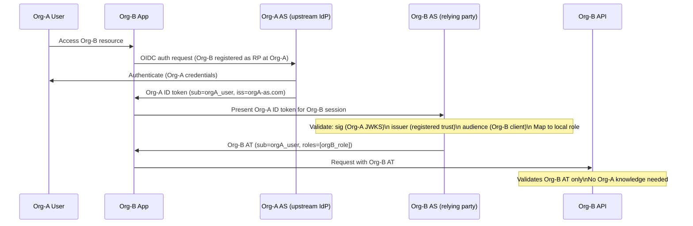

⚡ TL;DR - Cross-organization OAuth federation enables
Organization A's users to access Organization B's APIs
using their own identity (no account creation at Org-B).
The two primary patterns: (1) OIDC Identity Bridging -
Org-A's OIDC tokens are accepted by Org-B's AS as a
trusted identity assertion (Org-B AS acts as the
relying party to Org-A's OIDC AS); (2) Token Exchange
(RFC 8693) - Org-A's access token is exchanged at
Org-B's AS for an Org-B access token scoped to Org-B's
APIs. Both require a pre-established trust relationship:
Org-B must explicitly register Org-A as a trusted issuer,
validate Org-A's OIDC discovery, and limit the local
claims assigned to cross-org identities. Security risk:
blindly trusting all claims from Org-A's tokens is the
primary failure mode.

---

### 🔥 The Problem This Solves

**B2B INTEGRATION WITHOUT SHARED IDENTITY STORES:**

A SaaS company (Org-B) sells enterprise software to
another company (Org-A). Org-A has 10,000 employees in
their own Active Directory with their own identity
provider. Org-B needs to grant those employees access
to its platform. Options: (1) Create 10,000 accounts in
Org-B's system (management nightmare, security risk if
Org-A employee leaves), or (2) federate: Org-A authenticates
its employees, passes the identity assertion to Org-B,
and Org-B authorizes based on that assertion. Federation
eliminates the need for Org-B to manage Org-A's user
lifecycle. The security challenge: Org-B must control
WHAT access Org-A identities receive - it cannot blindly
trust all roles/groups claimed by Org-A's tokens.

---

### 📘 Textbook Definition

Cross-organization OAuth federation is a security pattern
where users from one organization's identity domain are
granted access to resources in another organization's
domain, using OAuth/OIDC as the interoperability layer.

**Pattern 1: OIDC Identity Bridging (most common)**
Org-A is the upstream Identity Provider.
Org-B is the Service Provider (relying party).
Org-B's AS is configured to trust Org-A's OIDC issuer.
When an Org-A user accesses Org-B's platform:
1. User authenticates with Org-A's AS.
2. Org-A issues an OIDC ID token.
3. Org-B's AS validates the ID token (OIDC RP flow).
4. Org-B's AS maps the Org-A user to a local Org-B
   identity context (local roles, local scopes).
5. Org-B's AS issues an Org-B access token.
6. The Org-B access token is issued with Org-B's local
   policy - NOT the claims from Org-A's token.

**Pattern 2: Token Exchange (RFC 8693)**
Org-A issues an access token for Org-A's APIs.
Org-B's AS exchanges Org-A's AT for an Org-B AT:
```
POST /token (Org-B AS)
grant_type=urn:ietf:params:oauth:grant-type:token-exchange
subject_token=<Org-A access token>
subject_token_type=...access_token
audience=org-b-api
```
Org-B's AS validates Org-A's AT (checks signature, issuer,
audience), then issues an Org-B-scoped AT for the same user.

**Trust relationship requirements:**
- Explicit registration of Org-A as a trusted issuer in Org-B.
- Org-B validates Org-A's OIDC discovery for issuer integrity.
- Local role mapping: Org-A user → Org-B local role.
- Claims filtering: Org-B strips Org-A claims; issues only Org-B claims.

---

### ⏱️ Understand It in 30 Seconds

**Federation flow step-by-step:**

```
PATTERN 1: OIDC BRIDGING

1. Org-A user visits Org-B's app.
2. Org-B's app: "Which IdP are you from?"
   (enterprise SSO discovery / "work email" UX)
3. Org-B redirects to Org-A's OIDC AS for login.
4. Org-A user authenticates → Org-A ID token issued.
5. Org-B's AS (acting as OIDC RP) validates Org-A ID token:
   - Signature: from Org-A's JWKS
   - Issuer: registered as trusted (Org-A's issuer URL)
   - Audience: Org-B's client_id at Org-A's AS
6. Org-B AS looks up Org-A user's local mapping:
   - orgA_user_id → orgB_local_role (from tenant config)
   - e.g., Org-A "employee" → Org-B "standard_user"
   - e.g., Org-A "admin" → Org-B "org_admin" (if allowed)
7. Org-B issues its own access token:
   sub = orgA_user_id (from ID token)
   org_id = orgA_tenant_id
   roles = [orgB_local_role]  ← LOCAL ROLES, not Org-A's
8. Org-B's RS validates Org-B's AT normally (no knowledge
   of Org-A needed at the RS level).

SECURITY CRITICAL: Step 6.
Org-B controls what local roles Org-A identities receive.
Org-B NEVER inherits Org-A's claims/roles directly into
the issued AT. This prevents Org-A from elevating privileges
in Org-B by adding custom claims to their ID tokens.
```

---

### ⚙️ How It Works (Mechanism)

```
┌──────────────────────────────────────────────────────────┐
│  CROSS-ORG OIDC BRIDGING ARCHITECTURE                     │
├──────────────────────────────────────────────────────────┤
│                                                           │
│  ORG-A DOMAIN          ORG-B DOMAIN                       │
│                                                           │
│  Org-A User            Org-B App        Org-B API         │
│     │                      │               │             │
│     │ 1. Login at Org-A ──►│               │             │
│     │      ┌──────────────────────────────┐│             │
│     │      │ Org-A AS (trusted by Org-B)  ││             │
│     │◄─────│ Issues OIDC ID token          ││             │
│     │      └──────────────────────────────┘│             │
│     │                      │               │             │
│     │ 2. ID token ─────────►│               │             │
│     │                      │               │             │
│     │         ┌────────────────────────────┐             │
│     │         │ Org-B AS                   │             │
│     │         │ Validates Org-A ID token   │             │
│     │         │ Maps to local identity:    │             │
│     │         │   Org-A user → Org-B role  │             │
│     │         │ Issues Org-B AT:           │             │
│     │         │   sub=orgA_user_id         │             │
│     │         │   org=orgA_tenant          │             │
│     │         │   roles=[orgB_local_role]  │             │
│     │         └────────────────────────────┘             │
│     │                      │               │             │
│     │         3. Org-B AT ─►│               │             │
│     │                      │─ Use Org-B AT ─────────────►│
│     │                      │               │             │
│     │                      │               │ Validates   │
│     │                      │               │ Org-B AT    │
│     │                      │               │ (no Org-A   │
│     │                      │               │  knowledge) │
└──────────────────────────────────────────────────────────┘
```



---

### 💻 Code Example

**Example 1 - BAD then GOOD: Cross-org claim inheritance:**

```python
# BAD: Org-B AS blindly inherits claims from Org-A's ID token
# CRITICAL RISK: Org-A could add "admin" or "superadmin" roles
# to their ID tokens to gain elevated access at Org-B.

def issue_orgb_token_bad(orgA_id_token_claims: dict) -> dict:
    # WRONG: Directly copying Org-A's claims into Org-B's token
    return {
        "sub": orgA_id_token_claims['sub'],
        # BAD: Inheriting Org-A's roles directly
        "roles": orgA_id_token_claims.get('roles', []),
        # Org-A adds "admin" to their roles → Org-B admin!
    }
```

```python
# GOOD: Org-B AS maps Org-A identity to local Org-B roles
# using a pre-configured tenant mapping table.
# WHY: Org-B controls what local access Org-A identities receive.
#   Org-A cannot escalate privileges in Org-B by modifying
#   their own token claims. The mapping is controlled by Org-B.

from dataclasses import dataclass

@dataclass
class TenantFederationConfig:
    """Org-B's configuration for a specific federated tenant."""
    tenant_id: str          # Org-A's tenant identifier
    trusted_issuer: str     # Org-A's OIDC issuer URL
    # Mapping: Org-A claim value → Org-B local role
    # Controlled by Org-B's admin, not by Org-A.
    role_mapping: dict[str, str]  # {"employee": "standard_user"}
    default_local_role: str = "read_only"
    max_local_role: str = "standard_user"  # Org-A can never exceed this

# Org-B tenant configuration (managed by Org-B admins)
TENANT_CONFIGS: dict[str, TenantFederationConfig] = {
    "orgA_tenant_123": TenantFederationConfig(
        tenant_id="orgA_tenant_123",
        trusted_issuer="https://sso.org-a.example.com",
        role_mapping={
            "employee": "standard_user",
            "manager": "org_admin",
            # NOTE: Org-A's "admin" role is NOT mapped to
            # Org-B's "admin". Org-A admins get standard_user.
        },
        default_local_role="read_only",
        max_local_role="org_admin",
    ),
}

ROLE_HIERARCHY = ["read_only", "standard_user", "org_admin", "admin"]

def get_local_role(
    tenant_id: str,
    orgA_roles: list[str],
    config: TenantFederationConfig,
) -> str:
    """
    Map Org-A roles to Org-B local role using tenant config.
    Enforces max_local_role ceiling regardless of Org-A claims.
    """
    # Find the highest local role this user is mapped to
    local_role = config.default_local_role
    for orgA_role in orgA_roles:
        mapped = config.role_mapping.get(orgA_role)
        if mapped and ROLE_HIERARCHY.index(mapped) > \
                ROLE_HIERARCHY.index(local_role):
            local_role = mapped

    # Enforce maximum role ceiling (Org-B control)
    max_idx = ROLE_HIERARCHY.index(config.max_local_role)
    local_idx = ROLE_HIERARCHY.index(local_role)
    if local_idx > max_idx:
        local_role = config.max_local_role

    return local_role


def issue_orgb_federated_token(
    orgA_id_token_claims: dict,
    tenant_id: str,
) -> dict:
    """
    Issue an Org-B access token for a federated Org-A identity.
    Applies local role mapping. Never inherits Org-A claims directly.
    """
    config = TENANT_CONFIGS.get(tenant_id)
    if config is None:
        raise ValueError(
            f"Unknown or untrusted tenant: {tenant_id}"
        )

    # Validate issuer matches registered trust
    orgA_issuer = orgA_id_token_claims.get('iss', '')
    if orgA_issuer.rstrip('/') != config.trusted_issuer.rstrip('/'):
        raise ValueError(
            f"Issuer mismatch: expected {config.trusted_issuer}, "
            f"got {orgA_issuer}"
        )

    # Map Org-A roles to Org-B local role
    orgA_roles = orgA_id_token_claims.get('roles', [])
    local_role = get_local_role(tenant_id, orgA_roles, config)

    # Issue Org-B token with LOCAL claims only
    # Org-A claims are NOT included in the issued token.
    return {
        "sub": orgA_id_token_claims['sub'],     # Org-A user ID
        "iss": "https://as.org-b.example.com",  # Org-B's issuer
        "federated_from": config.trusted_issuer, # Audit trail
        "tenant_id": tenant_id,                  # Org-A tenant
        # LOCAL Org-B role (controlled by Org-B):
        "roles": [local_role],
        # Never: "roles": orgA_id_token_claims.get('roles')
    }
```

---

### ⚖️ Comparison Table

| Federation Pattern | Use Case | Trust Model | Complexity |
|---|---|---|---|
| **OIDC Identity Bridging** | Enterprise SSO (B2B SaaS) | Org-B trusts Org-A as IdP | Medium |
| **Token Exchange (RFC 8693)** | API-to-API federation | Explicit AS-to-AS trust | Medium |
| **SAML-to-OIDC Bridge** | Legacy enterprise IdP | SAML AS front-ends OIDC | High |
| **Direct credential sharing** | BAD pattern | N/A | None |

---

### ⚠️ Common Misconceptions

| Misconception | Reality |
|---|---|
| Cross-org federation means trusting the federated organization's tokens directly at the RS | The RS should NEVER be configured to trust tokens from Org-A directly. The correct pattern is: Org-B's AS validates Org-A's identity assertion and issues its own access token with Org-B's local claims. The RS only trusts Org-B's AS. If the RS trusted Org-A's tokens directly, any compromise of Org-A's AS would immediately affect Org-B's RS security boundary. |
| Federation implies equal trust between organizations | Federation is inherently asymmetric. Org-B (the service provider) controls what access Org-A (the identity provider) users receive. This is enforced through the role mapping table: Org-B decides that Org-A employees get "standard_user" access - not whatever Org-A claims their roles are. The maximum role ceiling in the tenant config enforces this ceiling regardless of what Org-A includes in their tokens. |
| SAML and OIDC federation are equivalent | SAML federation is an older standard primarily used for browser-based SSO. OIDC federation (covered here) is designed for both browser and API contexts and uses JWT tokens. Modern B2B integrations prefer OIDC because: it works for both UI and API access, tokens are JWTs (easier to inspect and validate), and OIDC discovery simplifies trust configuration. If Org-A only has SAML, an OIDC bridge (SAML-to-OIDC translation service) is required. |

---

### 🚨 Failure Modes & Diagnosis

**Privilege Escalation via Org-A Token Claim Injection**

**Symptom:**
An Org-A enterprise customer reports that they can access
admin features in Org-B's platform. Org-A was only supposed
to have "standard_user" access. The Org-A customer's IT
admin added a custom `roles: ["admin"]` claim to their
OIDC token configuration.

**Diagnostic:**

```python
# Check: does Org-B's AS directly inherit Org-A's roles?
# In token issuance logs, compare:
#   - orgA_id_token_claims.roles
#   - issued_orgb_token.roles
# If they match: the AS is inheriting Org-A claims directly.

# Fix: verify role mapping is applied before issuance.
# The issued Org-B token should only contain local roles
# from the TENANT_CONFIGS mapping table, never Org-A's claims.

# Immediate: revoke all tokens for orgA_tenant and force
# re-issuance after fixing the claim inheritance bug.
```

**Fix:**
1. Remove direct claim inheritance from the token issuance
   path. ALL cross-org tokens must go through the role
   mapping table.
2. Add a hard max_local_role ceiling per tenant config.
3. Audit all existing cross-org tokens: check for any
   that contain Org-A claims instead of Org-B local claims.
4. Add a test: issue a federated token with Org-A claims
   containing "admin". Verify the issued Org-B token
   contains only the mapped local role.

---

### 🔗 Related Keywords

**Prerequisites:**
- `OIDC Identity Federation` - Org-A as IdP to Org-B
- `AS Metadata Discovery (RFC 8414)` - Org-A issuer validation

**Builds On:**
- `OAuth 2.0 for Internal Developer Platforms`
- `Enterprise OAuth 2.0 Architecture Patterns`

---

### 📌 Quick Reference Card

```
┌──────────────────────────────────────────────────────────┐
│ NEVER        │ Trust Org-A claims directly at Org-B RS   │
│              │ Inherit Org-A roles into Org-B tokens     │
├──────────────┼───────────────────────────────────────────┤
│ ALWAYS       │ Validate Org-A issuer against registered  │
│              │ trust before processing ID token          │
│              │ Map to LOCAL Org-B roles (tenant config)  │
│              │ Apply max_local_role ceiling per tenant   │
├──────────────┼───────────────────────────────────────────┤
│ RS LAYER     │ RS trusts ONLY Org-B's AS                 │
│              │ No knowledge of Org-A needed at RS        │
├──────────────┼───────────────────────────────────────────┤
│ TOKEN BRIDGE │ Org-A ID token → Org-B AS validates →     │
│              │ Local role mapping → Org-B AT issued      │
├──────────────┼───────────────────────────────────────────┤
│ ONE-LINER    │ "Org-B controls what Org-A users can do.  │
│              │  Never inherit Org-A claims into Org-B AT."│
└──────────────────────────────────────────────────────────┘
```

**If you remember only 3 things:**

1. Never inherit claims from Org-A's token into Org-B's
   issued access token. Org-B's AS maps the Org-A identity
   to LOCAL Org-B roles using a tenant-controlled mapping
   table. Org-A cannot escalate privileges in Org-B by
   modifying their own OIDC token claims.

2. The RS in Org-B should only trust Org-B's AS. The RS
   has no knowledge of Org-A's issuer or JWKS. The entire
   cross-org trust is resolved at the AS layer (Org-B AS
   is the OIDC relying party to Org-A). This keeps the
   RS's trust model simple and unaffected by federation.

3. Register each federated tenant explicitly with a
   max_local_role ceiling. This ceiling cannot be exceeded
   regardless of what Org-A puts in their tokens. The
   ceiling is the primary defense against federation-based
   privilege escalation.
