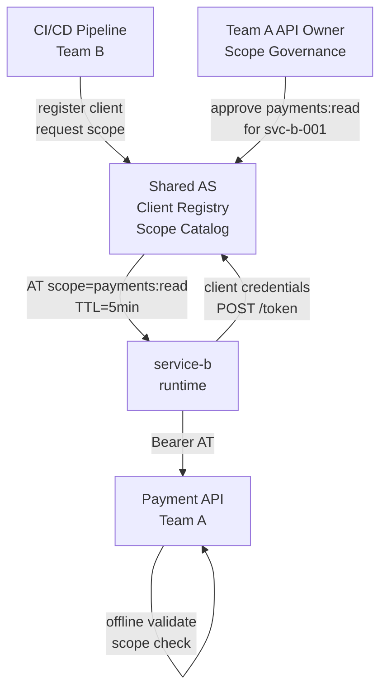

⚡ TL;DR - An Internal Developer Platform (IDP) uses
OAuth to solve a specific problem: engineering teams need
to publish internal APIs and have other teams' services
authenticate to them without sharing API keys or managing
credentials per-team. The OAuth solution is a shared
enterprise AS where: (1) every internal service registers
as an OAuth client (once); (2) service-to-service calls
use client credentials flow with narrow scopes; (3) the
AS serves as the API access catalog (which client has
which scopes); (4) teams self-service register clients
via the AS admin API from CI/CD pipelines. The key shift:
from "give team B your API key" to "AS grants team B's
service a scoped access token for your API". Scope
governance (who can request what) becomes the IDP's
primary security policy.

---

### 🔥 The Problem This Solves

**API KEY SPRAWL IN GROWING ENGINEERING ORGS:**

As engineering organizations grow from 5 to 50 to 500
services, API key management becomes unmanageable:
- API keys are rotated manually and inconsistently.
- Keys are stored in environment variables, sometimes
  committed to repos accidentally.
- When a service is decommissioned, its API keys remain
  active indefinitely.
- No centralized audit of which service has access to which API.
- Key rotation requires coordinated deployment across
  both producer and consumer services.

OAuth client credentials solves all these problems:
short-lived tokens (no rotation required), centralized
access registry in the AS, automatic expiry, revocation
via client deactivation, and a full audit trail in the AS.

---

### 📘 Textbook Definition

OAuth for an Internal Developer Platform means using
a shared enterprise Authorization Server as the mechanism
for all service-to-service authentication and authorization.

**Core concepts:**

**Service identity:** Each microservice or application team
registers one or more OAuth clients in the shared AS.
The client represents the service's identity. Client
credentials (client_id + private key or secret) are the
service's identity credential.

**Scope catalog:** The AS maintains a catalog of all
available API scopes. Each API team defines what scopes
their API accepts (e.g., `payments:read`, `orders:write`).
Scope governance defines who can request which scope:
services A and B can request `payments:read`, but only
service C can request `payments:write`.

**Client credentials flow for S2S:** Services obtain
short-lived access tokens using their registered client
credentials. No user interaction. Tokens are scoped to
the minimum permissions required for the specific call.

**Self-service client registration:** In a mature IDP,
teams register and manage their clients via the AS admin
API from CI/CD pipelines. No manual AS admin intervention
per client. Teams can rotate their own credentials
programmatically.

---

### ⏱️ Understand It in 30 Seconds

**API key vs OAuth client credentials for S2S:**

```
API KEY MODEL (anti-pattern at scale):
  - Team B needs access to Team A's payment API
  - Team A creates an API key, shares it with Team B
  - Key stored in Team B's environment variables
  - Key never expires (manual rotation)
  - Team A has no visibility into who is using the key
  - Team B's service is decommissioned: key remains active
  - 50 services × 10 dependencies = 500 API keys to manage

OAUTH CLIENT CREDENTIALS (IDP pattern):
  - Team B registers service-b as OAuth client in shared AS
  - AS admin grants service-b scope: payments:read
    (Team A's API team governs this scope)
  - Team B's CI/CD pipeline: creates client via AS admin API
  - Runtime: service-b calls AS /token (client credentials)
    → receives AT (TTL 5 min, scope: payments:read)
  - service-b calls payment API with AT
  - payment API validates AT offline (no AS contact)
  - service-b decommissioned: client disabled in AS
    → all future token requests fail immediately
  - Audit: AS logs every token issuance for service-b
```

---

### ⚙️ How It Works (Mechanism)

```
┌──────────────────────────────────────────────────────────┐
│  INTERNAL DEVELOPER PLATFORM OAUTH TOPOLOGY              │
├──────────────────────────────────────────────────────────┤
│                                                           │
│  CI/CD PIPELINE                SHARED AS                  │
│  (Team B, service-b)                                     │
│     │                                                    │
│     │─ POST /clients (admin API) ──────────────────────►│
│     │  {client_name: "service-b",                        │
│     │   grant_types: ["client_credentials"],             │
│     │   scope_request: "payments:read"}                  │
│     │◄─ client_id: "svc-b-001" ──────────────────────── │
│     │   (scope pending approval)                         │
│     │                                                    │
│  SCOPE GOVERNANCE:                                       │
│  Team A's API owner reviews + approves payments:read     │
│  for service svc-b-001                                   │
│                                                           │
│  RUNTIME (service-b):                                    │
│  service-b ─► POST /token                               │
│  grant_type=client_credentials                          │
│  client_id=svc-b-001                                    │
│  client_secret=...                                      │
│  scope=payments:read                                    │
│  ◄─ AT {sub: "svc-b-001", scope: "payments:read",       │
│         exp: now+300}                                   │
│                                                           │
│  service-b ─► GET /api/payments                         │
│  Authorization: Bearer <AT>                             │
│  ◄─ 200 OK                                              │
│                                                           │
│  PAYMENT API (RS):                                       │
│  Validates AT offline: sig, aud, scope=payments:read     │
│  Checks: sub (service identity) for audit log           │
└──────────────────────────────────────────────────────────┘
```



---

### 💻 Code Example

**Example 1 - BAD then GOOD: Service credential management:**

```python
# BAD: Service uses a long-lived API key stored in env var.
# Problems: no expiry, manual rotation, no audit trail.

import os, requests

# BAD: API key stored in env var, never expires
API_KEY = os.environ.get('PAYMENTS_API_KEY')

def call_payment_api_bad(amount: float) -> dict:
    resp = requests.post(
        "https://payments.internal/api/charges",
        headers={"X-API-Key": API_KEY},
        json={"amount": amount},
        timeout=5,
    )
    resp.raise_for_status()
    return resp.json()
    # No: audit of which service made this call
    # No: scope restrictions
    # No: automatic expiry
    # No: centralized revocation
```

```python
# GOOD: Service uses OAuth client credentials with token cache.
# WHY: Short-lived tokens, no credential rotation required,
#   centralized audit trail in the AS, immediate revocation
#   by disabling the client in the AS.

import os, time, threading
import requests

# Client credentials from environment (injected by secrets manager)
CLIENT_ID = os.environ['PAYMENTS_CLIENT_ID']
CLIENT_SECRET = os.environ['PAYMENTS_CLIENT_SECRET']
AS_TOKEN_ENDPOINT = os.environ['AS_TOKEN_ENDPOINT']

class ClientCredentialsTokenManager:
    """
    Manages OAuth client credentials tokens for S2S calls.
    Caches the current token and refreshes before expiry.
    Thread-safe for use in concurrent service environments.
    """
    def __init__(
        self,
        token_endpoint: str,
        client_id: str,
        client_secret: str,
        scope: str,
        refresh_buffer_seconds: int = 30,
    ):
        self.token_endpoint = token_endpoint
        self.client_id = client_id
        self.client_secret = client_secret
        self.scope = scope
        self.refresh_buffer = refresh_buffer_seconds
        self._token: str | None = None
        self._expires_at: float = 0
        self._lock = threading.Lock()

    def _fetch_token(self) -> tuple[str, float]:
        resp = requests.post(
            self.token_endpoint,
            data={
                "grant_type": "client_credentials",
                "scope": self.scope,
            },
            auth=(self.client_id, self.client_secret),
            timeout=5,
        )
        resp.raise_for_status()
        data = resp.json()
        expires_in = data.get('expires_in', 300)
        return data['access_token'], time.time() + expires_in

    def get_token(self) -> str:
        """Return current valid token, refreshing if needed."""
        with self._lock:
            if (self._token is None or
                    time.time() >= self._expires_at - self.refresh_buffer):
                self._token, self._expires_at = self._fetch_token()
            return self._token

# Singleton token manager per scope
# (typically one per external API being called)
payment_token_manager = ClientCredentialsTokenManager(
    token_endpoint=AS_TOKEN_ENDPOINT,
    client_id=CLIENT_ID,
    client_secret=CLIENT_SECRET,
    scope="payments:read",  # Only what's needed
)

def call_payment_api(amount_cents: int) -> dict:
    token = payment_token_manager.get_token()
    resp = requests.post(
        "https://payments.internal/api/charges",
        headers={"Authorization": f"Bearer {token}"},
        json={"amount_cents": amount_cents},
        timeout=5,
    )
    resp.raise_for_status()
    return resp.json()
    # Benefits vs API key:
    # - Token auto-rotates every 5 min (no manual rotation)
    # - Scope limited to payments:read (not all payments ops)
    # - AS logs every token issuance (who called when)
    # - Revoke by disabling CLIENT_ID in AS (immediate)
```

---

### ⚖️ Comparison Table

| Credential Type | Expiry | Audit | Revocation | Scope Enforcement |
|---|---|---|---|---|
| **API Key** | Never (manual) | Per RS only | Manual, delay | None (key = all access) |
| **OAuth AT (client creds)** | 5-15 min (auto) | AS issuance log | Immediate (disable client) | Per-token scope |
| **Service Mesh mTLS** | Cert lifetime | Service mesh logs | Cert revocation (CRL/OCSP) | None (mTLS = identity only) |
| **OAuth + mTLS** | 5-15 min + cert | Both layers | Both mechanisms | Per-token scope + sender binding |

---

### ⚠️ Common Misconceptions

| Misconception | Reality |
|---|---|
| Client credentials flow is less secure than API keys because the credentials are in environment variables | Both API keys and OAuth client secrets end up in environment variables or secrets managers. The security difference is NOT in the credential storage - it's in what the credential can be used for: an API key is typically a long-lived credential that grants fixed access forever. An OAuth client secret is used ONLY to obtain short-lived access tokens. Even if the client secret is compromised, the access window is limited to the next token issuance before rotation. Additionally, OAuth provides centralized audit, scope restrictions, and immediate revocation. |
| Every S2S call needs to call the AS token endpoint | No. The token cache pattern (shown above) means the AS is called once per token TTL (every 5 minutes), not once per API call. With a properly implemented token manager, the overhead of OAuth vs API keys is negligible: one background token refresh every 5 minutes for each downstream service being called. The AS is NOT in the critical path of individual service calls. |
| Internal services behind a firewall don't need OAuth | "Internal" services are frequently the highest-value targets in a breach. Lateral movement from a compromised external-facing service to internal services is a core attack pattern. OAuth with scope restrictions means a compromised frontend service can only call the internal APIs it was explicitly authorized for (payments:read, not payments:write). Without OAuth, a compromised service can call any internal API. Defense-in-depth requires authenticating internal calls. |

---

### 🚨 Failure Modes & Diagnosis

**Token Endpoint Becomes S2S Bottleneck Without Caching**

**Symptom:**
After migrating all internal services from API keys to
OAuth client credentials, the AS token endpoint is being
called on EVERY API call from every service. Token endpoint
latency P99 = 200ms. All internal API latencies increased
by 200ms. Services timing out.

**Diagnostic:**

```python
# Check: are services caching tokens or fetching per-request?
# AS metrics: calls_per_second by client_id
# If: calls/sec ≈ total S2S calls/sec → no caching!

# Correct pattern: calls/sec ≈ total_services / token_ttl_seconds
# For 100 services, 5-min TTL: ~0.33 calls/sec (one per 5 min per service)
# If seeing 1000 calls/sec for 100 services: each service is not caching

# Check in service code: is get_token() called inside the
# request handler, or is the token cached outside it?
```

**Fix:**
1. Implement token manager with TTL-based caching.
2. Move token fetch OUTSIDE the request handler.
3. Use background refresh: proactively refresh 30s before
   expiry to avoid any latency spike on expiry.
4. Add circuit breaker: if AS unreachable, serve cached
   token until it expires (safe for short TTLs).

---

### 🔗 Related Keywords

**Prerequisites:**
- `Client Credentials Flow` - the S2S grant type
- `Authorization Server Architecture` - the shared AS

**Builds On:**
- `Enterprise OAuth 2.0 Architecture Patterns`
- `OAuth 2.0 in Zero Trust Architecture`

---

### 📌 Quick Reference Card

```
┌──────────────────────────────────────────────────────────┐
│ IDP OAUTH    │ Shared AS = API access catalog            │
│ PATTERN      │ Services = OAuth clients (registered)    │
│              │ S2S = client credentials + narrow scope  │
├──────────────┼───────────────────────────────────────────┤
│ SCOPE        │ API team defines accepted scopes          │
│ GOVERNANCE   │ Infra team approves scope grants per client│
│              │ Self-service via AS admin API from CI/CD  │
├──────────────┼───────────────────────────────────────────┤
│ TOKEN CACHE  │ Cache token until exp - 30s              │
│              │ AS NOT in request critical path           │
├──────────────┼───────────────────────────────────────────┤
│ DECOMMISSION │ Disable client_id in AS                   │
│              │ All future token requests fail immediately│
├──────────────┼───────────────────────────────────────────┤
│ ONE-LINER    │ "OAuth replaces API keys with auditable   │
│              │  short-lived scoped tokens for S2S calls."│
└──────────────────────────────────────────────────────────┘
```

**If you remember only 3 things:**

1. OAuth client credentials replaces API keys for S2S
   calls in an internal platform. Short-lived tokens
   (5 min TTL), centralized scope governance in the AS,
   full audit trail of every token issuance per service,
   and immediate revocation by disabling the client.

2. Cache tokens with TTL-based refresh. The AS must NOT
   be called on every API request. Token manager with
   background refresh keeps the AS out of the critical
   path. One token refresh every 5 minutes per downstream
   service - negligible compared to API call volume.

3. Scope governance is the security policy of the IDP.
   Define which client can request which scope. Each API
   team governs the scopes for their API. Self-service
   client registration from CI/CD + approval-gated scope
   grants = centralized security policy with decentralized
   developer experience.
